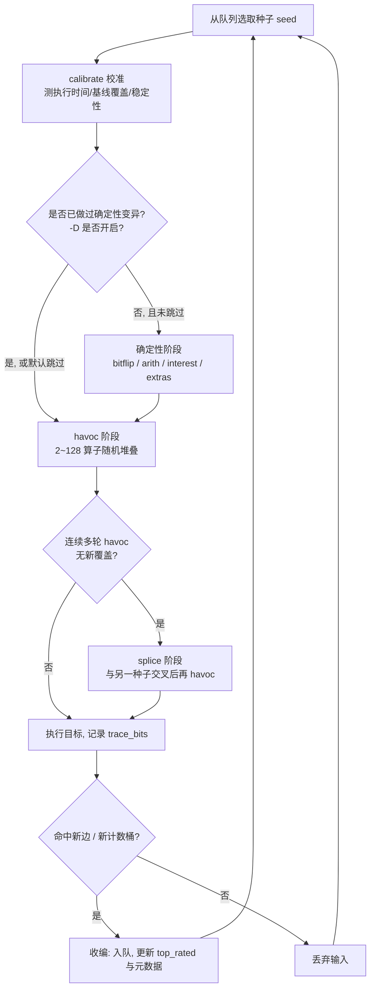
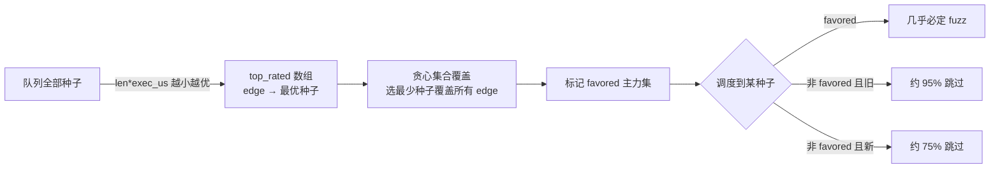
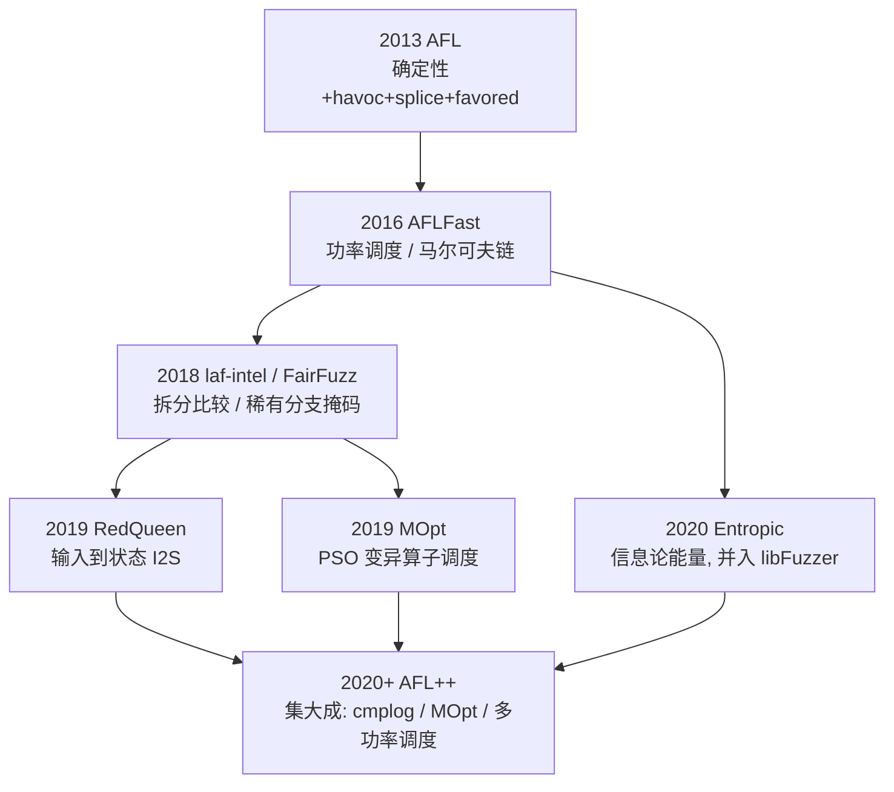
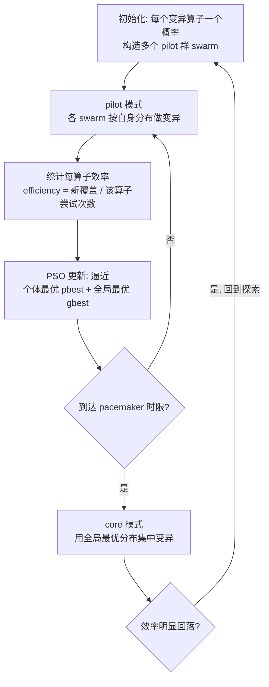

# Fuzzing与漏洞挖掘（10）· 变异策略与调度算法
> [!abstract] TL;DR
> - 灰盒 fuzzer 的“搜索”由两台引擎驱动：**变异**决定从一个种子跳到哪些邻居（局部算子），**调度**决定先扩展队列里的哪个种子、给它多少能量（搜索前沿的优先级）；覆盖率只是适应度函数。
> - AFL 的变异分四层：**确定性**（bitflip/arith/interest/字典，逐位游走、O(bit)、可复现）、**havoc**（2~128 个算子随机堆叠，非确定性主力）、**splice**（两种子交叉重组，等价于遗传算法的 crossover）、**CMP 引导**（laf-intel/RedQueen/CMPLOG 用比较操作数直接改写输入，专治 magic bytes 与校验和）。
> - 种子调度三件事：**选谁**（favored 集合＋队列裁剪 top_rated 贪心集合覆盖）、**给多少能量**（perf_score 按执行速度/覆盖量/深度/handicap 打分，决定 havoc 迭代数）、**用哪个算子**（MOpt 用 PSO 在线优化算子概率分布）。
> - **AFLFast** 把 fuzzing 建模成路径上的马尔可夫链，证明能量应偏向“低频路径”与“被选次数少”的种子，功率调度（fast/coe/explore/exploit…）由此而来；**Entropic** 从信息论出发，按“预期能揭示多少稀有特征”分配能量，已成为 libFuzzer 默认。
> - 工程默认在演化：AFL++ **默认关闭确定性阶段**（`-D` 再开），因为 havoc+cmplog 的吞吐性价比更高；deterministic 只在小种子/文本协议上划算。
> - 陷阱是系统性的：havoc 会让输入膨胀拖慢 exec/s、盲变异过不了校验和、种子过多导致能量稀释、覆盖不稳定（flaky）会污染调度——每一条都决定你几天后能不能挖到崩溃。

## 概述与定位

把一个灰盒 fuzzer 拆开，你会发现它本质是一台**在输入空间里做启发式搜索**的机器。覆盖率（第 02 篇）是这台机器的**适应度函数**——它告诉搜索“这个方向有没有走到新代码”；语料与字典（第 09 篇）是搜索的**起点与先验知识**；而本篇讲的**变异策略**与**调度算法**，才是搜索算法本身：前者是“从当前解怎么产生候选邻居”的**局部算子**，后者是“先扩展哪个节点、投入多少算力”的**前沿管理**。缺了变异，fuzzer 原地不动；缺了调度，fuzzer 把 99% 的算力浪费在早就烂熟的路径上。二者共同决定了在固定 CPU 时间里，你的“每秒有效尝试次数”有多高。

需要先划清与相邻篇目的边界。**覆盖率如何被采集与反馈**属于第 02、04 篇与 [[48.动态插桩与模拟执行引擎/12.插桩驱动的分析：覆盖率与污点与trace]]；**语料怎么收集/去重/最小化、字典怎么来**属于第 09 篇——本篇只关心“变异算子**怎么用**字典”；**语法/protobuf 这类结构化变异**留给第 11 篇；**污点/concolic 如何指导变异**留给第 12 篇。本篇聚焦最经典、也最通用的**字节级变异**与**种子/能量/算子三级调度**，这是 AFL/AFL++/libFuzzer/honggfuzz 共享的算法内核，理解它，后面所有“花式 fuzzer”都是在这套骨架上做增量。

一句话定位：**变异是“怎么走一步”，调度是“先走哪一步、走多久”**。fuzzer 的价值近似等于 `execs/s × P(单次执行命中新覆盖)`——变异和调度都是在拉高后一项，但复杂的策略又会压低前一项，全篇的工程判断都围绕这个乘积的权衡展开。

## 原理与机制

灰盒 fuzzing 的主循环可以浓缩成六步，反复迭代：

```
loop:
  seed   = schedule.pick(queue)          # 调度①：选种子
  energy = schedule.assign_energy(seed)  # 调度②：给能量（havoc 迭代数）
  for i in 1..energy:
     op    = schedule.pick_operator()    # 调度③：选变异算子（MOpt 等）
     input = mutate(seed, op)            # 变异：产生候选
     cov   = execute(target, input)      # 执行并采样覆盖
     if cov.has_new_edge():
        queue.add(input); update_metadata()   # 有新覆盖 → 收编为新种子
```

围绕这个骨架，把两条主线的“分类学”摆清楚。

**变异的四类算子。** 第一类是**确定性变异（deterministic）**：对种子逐位/逐字节地、按固定顺序、可复现地施加单一改动——翻转比特、加减小整数、写入“有意思的边界值”、套用字典 token。它的特点是**穷尽且可重放**，但代价是 O(输入比特数)，且每来一个新种子都要重跑一遍。第二类是**havoc（随机堆叠变异）**：一次对种子叠加 2~128 个随机选中的算子，非确定性、无法复现，但**单位算力的产出最高**，是现代 fuzzer 的真正主力。第三类是**splice（拼接/重组）**：把当前种子和队列里另一个种子在某个切点拼起来再 havoc，等价于遗传算法里的**交叉（crossover）**，用来跨越 havoc 难以一步到达的“两个好半段的组合”。第四类是**引导式变异**：用比较指令的操作数（laf-intel/RedQueen/CMPLOG）或污点信息，**定向**改写输入里“卡在比较上”的字节，专门对付 magic bytes 和校验和。

**调度的三个层级。** 层级一是**种子选择（inter-seed）**：队列里成百上千个种子，先 fuzz 谁？AFL 用 favored 集合＋概率跳过。层级二是**能量分配（power/energy）**：选中一个种子后，给它跑多少次 havoc？这由 perf_score 决定，AFLFast/Entropic 在此做文章。层级三是**变异算子调度（intra-seed）**：一次 havoc 里，翻比特、删字节、插字典……各算子的**概率**该是多少？MOpt 用粒子群优化在线学习这个分布。三个层级贯穿始终的主线矛盾，是**探索（exploration）与利用（exploitation）**的张力：把能量投给已知高产的种子（利用）能立刻多找几条边，但会错过队列深处那些“再变几步就能突破”的冷门种子（探索）。整个调度研究史，就是不断给这对矛盾找更聪明的配平。

下图是 AFL 一个种子的完整变异流水线，也是理解后文所有优化的地基。



## 变异算子与调度算法详解

### AFL 的确定性流水线：逐位游走与两个“聪明”优化

确定性阶段按严格顺序展开，AFL 用 `stage_name` 打印出来，逆向时对着日志能一眼认出：

```
bitflip 1/1   # 翻 1 bit，步长 1 bit，走遍全文件
bitflip 2/1   # 翻相邻 2 bit
bitflip 4/1   # 翻相邻 4 bit
bitflip 8/8   # 翻 1 字节（步长 1 字节）→ 即“字节翻转”
bitflip 16/8  # 翻相邻 2 字节
bitflip 32/8  # 翻相邻 4 字节
arith 8/8     # 对每字节做 +/- 1..35（ARITH_MAX=35）
arith 16/8    # 对每 16 位整数做 +/-，含大小端两种
arith 32/8    # 对每 32 位整数做 +/-
interest 8/8  # 写入 8 位“有意思的值”
interest 16/8 # 写入 16 位有意思的值
interest 32/8 # 写入 32 位有意思的值
user extras (over/insert) / auto extras (over)  # 字典 token
```

**为什么是这些算子？** 翻比特覆盖“单个标志位/开关位被误置”的场景；加减小整数覆盖“计数器、长度字段、循环边界的 off-by-one”；有意思的值是**精心挑选的边界常量**，专门去踩整数溢出与符号边界：

```
INTERESTING_8  = {-128,-1,0,1,16,32,64,100,127}
INTERESTING_16 += {-32768,-129,128,255,256,512,1000,1024,4096,32767}
INTERESTING_32 += {-2147483648,-100663046,-32769,32768,65535,65536,100663045,2147483647}
```

这些数字不是拍脑袋：`0x00/0xff` 是全零全一边界，`127/128/255/256/32767/32768/65535/65536` 是 `int8/uint8/int16/uint16` 的正负临界与进位临界，`-100663046`（0xFA0000FA 附近）之类是历史上被证明能触真实溢出的“毒值”。确定性阶段的哲学是**用有限的、语义明确的扰动，覆盖最常见的一类整数/标志 bug**，且**每一步都能被复现**——这对最小化崩溃、写 PoC 极其友好。

确定性阶段有两个常被忽略、却极见功力的优化，理解它们才算真懂 AFL：

- **eff_map（有效字节图）**：在 `bitflip 8/8` 这一趟里，AFL 顺便记录“翻转这个字节的低位有没有改变执行校验和”。凡是翻了也**毫无反应**的字节（典型如文件里大段的 payload 数据、注释、padding），会在后续昂贵的 `arith`/`interest` 阶段被**直接跳过**。真实输入里往往一大半字节是“死的”，这一招常能把确定性成本砍掉一半以上。这解释了为什么 O(bit) 的确定性在实践里没有想象中那么慢。
- **自动字典（auto extras / a_extras）**：在 `bitflip 1/1` 里，如果**连续翻转某几个相邻比特都产生同一个“新路径签名”**，AFL 推断这几个字节构成一个**原子 token**（很可能是关键字或 magic），把它抽出来（长度 2~32）塞进 extras，后续用于覆盖/插入。这是 fuzzer **无字典也能自己长出字典**的机制，把“变异”和“字典学习”缝在了一起——它与第 09 篇讲的人工字典互补。

**why 确定性正在被默认关闭。** AFL 原版默认开确定性；AFL++ 从 3.x 起**默认关闭**（要用 `-D` 显式开）。原因是吞吐权衡：确定性是 O(bit) 且**每个新种子都要重跑**，在大文件、二进制格式上开销巨大；而它主打的“过 magic bytes / 精确整数边界”这件事，cmplog（RedQueen 式输入到状态）做得**又快又准**。于是现代最佳实践变成：**主力靠 havoc + cmplog，确定性只在小种子、文本协议、或多核里留一两个 `-D` 实例兜底**。这是一个典型的“论文证明＋工程实测共同改写默认值”的案例。

### havoc：随机堆叠变异为什么最高产

havoc（“大破坏”）是非确定性主力。它的核心动作只有两步：先掷骰子决定这次**叠加多少个**算子，再循环从算子池里**随机抽**并施加：

```
use_stacking = 1 << (1 + rand(HAVOC_STACK_POW2))   # HAVOC_STACK_POW2=7 → 堆叠 2..128 个
for _ in range(use_stacking):
    switch rand(算子池):      # AFL 约 15 种，AFL++ 更多
      翻转一个随机 bit
      写入随机 8/16/32 位有意思值（随机大小端）
      对随机 8/16/32 位整数 +/- 随机量
      把某字节置为随机值
      删除一段字节 (delete)
      克隆/插入一段字节（来自自身或常量）
      用随机值或另一处内容覆写一段
      用字典 extra 覆写 / 插入
      （AFL++）调用自定义变异器 / 从另一队列项拼接
```

**why 堆叠？** 单个算子的改动往往太小，跨不过“需要同时满足两三个条件才进入的新分支”；而一次叠加几十个改动，等于在输入空间里迈一大步，能同时改动多个字段。但步子太大又容易全盘破坏结构，所以 AFL 用 `1<<(1..7)` 让堆叠数**指数分布**：大多数时候小步（2~8 个），偶尔大步（上百个）——这本质是一种**变步长的随机游走 / 模拟退火式**采样，兼顾精细调整与大跨度跳跃。

havoc 跑多少轮不是定值，而是被能量 `perf_score` 缩放的：

```
stage_max = (doing_det ? HAVOC_CYCLES_INIT : HAVOC_CYCLES) * perf_score / havoc_div / 100
# HAVOC_CYCLES=256, HAVOC_CYCLES_INIT=1024；havoc_div 随目标执行速度自适应变大（慢目标少跑）
```

这行公式就是**调度与变异的接缝**：调度算出的“种子有多值钱”（perf_score），直接换算成 havoc 的迭代预算。好种子多变、差种子少变，就发生在这里。

havoc 也是**输入膨胀**的主要来源——clone/insert 只增不减地拉长输入，越长的输入执行越慢、trace 越容易 flaky。AFL 用 `MAX_FILE`（默认 1 MiB）截断、用 trim/最小化（第 09 篇）反向收缩来对冲。逆向排查“为什么我的 exec/s 越跑越低”，十有八九是 havoc 把种子喂胖了。

### splice：语料交叉，等价于遗传算法的 crossover

当某个种子的 havoc **连续多轮颗粒无收**，AFL 认为“光靠扰动这一个种子已经榨干了”，转入 splice：

```
for retry in 1..SPLICE_CYCLES(=15):
    other = random_queue_entry()               # 随机挑另一个种子
    (f_diff, l_diff) = locate_diffs(cur, other)# 找首个/末个不同字节
    if l_diff < 2 or f_diff == l_diff: continue# 太相似则重挑
    split = rand(f_diff .. l_diff)             # 在“差异区间”里随机切
    spliced = cur[0:split] + other[split:]     # 前半来自 cur，后半来自 other
    havoc(spliced, cycles=SPLICE_HAVOC=32)     # 拼接结果再做一轮 havoc
```

**why 需要 splice？** havoc 是**单亲**的局部搜索——它只会在一个种子附近打转。但很多深层路径需要“输入 A 的前半结构（比如正确的文件头）＋输入 B 的后半结构（比如某个稀有字段）”的组合，这种**跨种子重组**是单点扰动几乎不可能一步凑齐的。splice 引入**双亲交叉**，把两个已经各自“达标”的半段拼起来，正是遗传算法 crossover 的思想：**站在两个局部最优的肩膀上找新解**。切点特意选在“两者开始不同”到“最后不同”的区间内，避免切出完全等同于父串的废输入。

splice 的软肋在**结构化二进制**：随手一切常把长度字段、偏移、校验和切得对不上，产出大量无效输入。这正是第 11 篇结构化 fuzzing（按语法/protobuf 做“合法的”重组）要解决的问题——splice 是它的“无结构版前身”。

### CMP 引导变异：laf-intel、RedQueen 与 CMPLOG

盲变异有一个天生打不过的敌人：`if (magic == 0xDEADBEEF)` 这种**多字节精确比较**。随机撞对 4 字节的概率是 1/2³²，穷尽也要几十亿次执行——覆盖反馈在这里**完全失效**，因为差 1 个字节和差 4 个字节，覆盖率长得一模一样（都是“没进 then 分支”），fuzzer 得不到任何“越来越近”的梯度。三种思路专治此病：

- **laf-intel（编译期拆分比较）**：把 `x == 0xDEADBEEF` 在 IR 层拆成逐字节的嵌套比较 `x[0]==0xDE && x[1]==0xAD && ...`。这样**每对上一个字节就多一条边**，把“一次撞对 4 字节”的悬崖，改造成“一次撞对 1 字节”的四级台阶，覆盖反馈重新有了梯度。代价是插桩膨胀、边数暴涨。AFL++ 里对应 `AFL_LLVM_LAF_*`；libFuzzer 里概念等价物是 `-use_value_profile=1`（把比较的“接近程度”并入特征）。
- **RedQueen（输入到状态，Input-to-State）**：NDSS'19 的关键观察是——**输入里的字节常常原封不动（或简单编码后）出现在比较操作数里**。于是不必求解，只要**运行时监控每条 cmp 的两个操作数**，发现某操作数等于输入某处的值，就把输入里那处**直接替换**成“对面期望的常量”。为消除偶然巧合，先做**colorization（着色）**：在不改变执行路径的前提下把输入尽量随机化，让每个 I2S 对应关系唯一可辨。这招几乎“免费”地干掉了绝大多数 magic bytes 和简单校验和。
- **AFL++ CMPLOG（`-c`）**：把 RedQueen 工程化——用一个额外插桩的 `cmplog` 二进制记录“最近比较值表”（TORC/table of recent compares），再在变异时用这些值去改写输入。它是当今 AFL++ 挖真实目标的**头号武器**，也是“确定性可以关掉”的底气所在。

一句话点透：CMP 引导把 fuzzing 从“猜答案”升级为**“偷看答案再填”**，是覆盖反馈失灵处的关键补丁。libFuzzer 走的是 SanitizerCoverage 的 `__sanitizer_cov_trace_cmp*` 回调，把比较操作数喂进自动字典/value profile，殊途同归。

### 种子调度（一）：favored 集合与队列裁剪

队列一大，round-robin 逐个 fuzz 就成了灾难：大量种子覆盖的边高度重叠，平均分配算力＝把时间摊薄到冗余上。AFL 的解法是 `cull_queue`（队列裁剪），求一个**近似最小的“主力”种子集合**：

```
维护 top_rated[MAP_SIZE]：对每条覆盖边 edge，记住“覆盖它、且 len*exec_us 最小”的那个种子
# len*exec_us = 输入长度 × 执行微秒，越小＝越“便宜好用”
每次 cull：
  清 temp_v（未覆盖 edge 集）
  贪心：遍历 top_rated，若某种子能覆盖当前尚未被覆盖的 edge，
        标记它 favored，并把它覆盖的所有 edge 从 temp_v 划掉
  直到所有 edge 都被某个 favored 种子覆盖
```

这是经典的**贪心集合覆盖（set cover）近似**：用尽量少的、且“又短又快”的种子，覆盖住当前发现的全部边。favored 种子在调度时**几乎必被 fuzz**；非 favored 则按概率跳过：

```
若队列里还有没 fuzz 过的 favored（pending_favored>0）：
    当前种子若已 fuzz 过 或 非 favored → 99% 概率跳过（SKIP_TO_NEW_PROB）
否则：
    非 favored 且“旧” → 95% 跳过（SKIP_NFAV_OLD_PROB）
    非 favored 且“新” → 75% 跳过（SKIP_NFAV_NEW_PROB）
```



**why 这样设计？** 它同时压住两个浪费：一是**冗余**（覆盖相同边的多个种子只留最划算的一个当主力），二是**成本**（favor 因子用 `len*exec_us`，天然偏爱又小又快的种子，直接抬高 exec/s）。但它不是硬性删除——非 favored 只是**低概率**被翻牌，保留了偶尔探索冷门种子的机会。AFL++ 进一步用**加权随机选择**替代原版的顺序遍历：按每个种子的分值算权重做加权抽样，让好种子被选中的期望频率更高，比“顺序＋概率跳过”更平滑。

### 种子调度（二）：能量分配 perf_score

选中种子后，`calculate_score` 给它打一个能量分（基准 100），这个分直接决定 havoc 迭代数：

```
avg_exec_us  = 全队列平均执行微秒
avg_bitmap   = 全队列平均覆盖字节数
perf_score = 100
# ① 执行速度：越快能量越高（快 → 同样时间能多变异）
exec_us 相对 avg：10x慢→10 ; 4x慢→25 ; 2x慢→50 ; 1.33x慢→75 ; ... ; 4x快→300
# ② 覆盖量：覆盖越多，越可能是“通向新区域的枢纽”
bitmap 相对 avg：多很多 ×3 ; 多 ×2 ; 略多 ×1.5 ; 少很多 ×0.25 ...
# ③ handicap：晚发现/同步进来的种子给补偿（它们“起步晚”，多给几轮追赶）
handicap≥4 → ×4（并 -=4）; handicap>0 → ×2（并 --）
# ④ 深度 depth：路径越深，越接近“难到达区域”，越该深挖
depth 0-3 ×1 ; 4-7 ×2 ; 8-13 ×3 ; 14-25 ×4 ; 26+ ×5
# 封顶：perf_score ≤ HAVOC_MAX_MULT(16) × 100 = 1600
```

四个因子对应四条朴素而深刻的直觉：**快的多给**（吞吐优先）、**覆盖广的多给**（枢纽种子）、**晚来的补偿**（公平追赶，避免早种子霸占算力）、**深的多给**（越深越难、越可能藏着未探明的逻辑）。这套启发式没有理论最优保证，是 lcamtuf 的工程直觉——它足够好，以至于成了后续所有“更聪明能量分配”论文的**对照基线**。

### 种子调度（三）：AFLFast 功率调度与马尔可夫链

Böhme 等人在 CCS'16《Coverage-based Greybox Fuzzing as Markov Chain》里给出了第一个**理论框架**：把 fuzzing 看成在“程序路径”上的**马尔可夫链**——从路径 i 变异出的输入，会以某转移概率落到路径 j。他们发现 AFL 的致命低效在于：**能量与路径的命中频率无关**，于是 fuzzer 反复砸能量在那些“随手一变就会走到”的**高频路径**上，而真正稀有、可能通向新代码的**低频路径**被饿死。

AFLFast 的处方是**功率调度（power schedule）**，核心变量是 `f(i)`＝路径 i 被命中的次数、`s(i)`＝种子 i 被选中的次数。以默认的 `FAST` 为例（示意）：

```
energy(i) ∝ 2^s(i) / f(i)     再对 α(i)/β 归一并封顶 M
```

含义直观：**命中越稀有（f 小）→ 能量越高**（值得挖）；**被选次数越少（s 小）→ 起步能量低，但随每次选中指数增长**（给冷门种子一个“先小投石问路、有戏就迅速加注”的机会）。AFL++ 把这套做成可选的 `-p` 家族：

- `explore`：偏探索，AFL++ 默认，通用最稳。
- `fast`：AFLFast 原版，激进偏向低频路径。
- `coe`（cut-off exponential）：只喂低于平均频率的路径，砍掉高频。
- `exploit`：偏利用，集中打已知高产种子（配合已知漏洞方向）。
- `rare`：偏向命中稀有边的种子；`seek`、`lin`、`quad`、`mmopt` 各有侧重曲线。



同期的 **FairFuzz**（ASE'18）从另一角度切入：锁定**稀有分支**，并计算一个**变异掩码**——哪些字节位可以变、哪些一变就会偏离这条稀有分支，从而“定点爆破”难到达的分支。它是变异与调度的混合体，思路上和功率调度互补。把这些工作放在一起看，**调度研究的主线就是不断把“探索 vs 利用”这对矛盾建模得更精确**：从 AFL 的手工启发式，到 AFLFast 的马尔可夫链，到把它当**多臂老虎机**（如 EcoFuzz, USENIX'20）在线学习。

### 变异算子调度：MOpt 与粒子群优化

前面的能量都在解决“**选哪个种子、给多少**”，MOpt（USENIX Security'19）解决第三层：一次 havoc 里，**十几种算子各自该以多大概率被抽中**？AFL 里这个分布是**均匀写死**的，但显然不同目标、不同阶段，翻比特和插字典的性价比天差地别。MOpt 用**粒子群优化（PSO）**在线学习最优分布：



把每个算子的选中概率看成 PSO 里粒子的一维坐标，**适应度＝该算子每次尝试带来的新覆盖**。**pilot 模式**用多个 swarm 并行探索不同概率分布，**core 模式**则拿全局最优分布集中开火；`-L t` 设定进入 core 前的 pacemaker 时限（分钟）。AFL++ 用 `-L` 开启 MOpt，另有内建的 `mmopt` 功率调度吸收了同类思想。

**why 值得？** 变异算子的收益是**目标相关且时变**的：早期翻比特扩边界收益高，中后期插字典/CMP 值更管用。MOpt 让 fuzzer**自适应**地把概率质量挪到当下最赚的算子上，是把“探索 vs 利用”下沉到最细粒度的一次实践。代价是它需要足够长的运行时间来收敛统计，短跑（几分钟）反而可能不如默认分布。

### 信息论视角：libFuzzer 的 Entropic

Böhme、Manès、Cha 在 FSE'20《Boosting Fuzzer Efficiency: An Information-Theoretic Perspective》给能量分配换了个**信息论**框架：一个种子的价值，应正比于它**预期能揭示多少“稀有特征”**——用 Shannon 熵度量“信息增益”。直觉是：老命中那些人人都命中的常见特征，信息量趋近于零；而能稳定摸到稀有特征的种子，才是信息富矿，该多给能量。Entropic 估计每个种子的“局部熵”，据此分配能量，并随命中动态更新（一个特征被越来越多种子命中，它的稀有度/信息量就衰减）。

这套方法被**合入 LLVM libFuzzer 并成为默认**（`-entropic=1`）。它与 AFLFast 的马尔可夫链是**同一枚硬币的两面**：AFLFast 说“喂低频路径”，Entropic 说“喂高信息增益种子”，都在数学上论证了同一个朴素直觉——**把算力投向稀有、未知，而非常见、已知**。区别在 libFuzzer 是**in-process**、特征来自 SanitizerCoverage 的 8-bit counters 与 value profile，因此它的能量计算还叠加了输入大小、执行时间等惩罚项（`-prefer_small` 等），整体更偏“单进程高频”的场景。

## 工具视角与实战

**AFL++（字节级 fuzzing 的主力）。** 记住这几组开关就能覆盖八成场景：

```
afl-fuzz -i seeds -o out -- ./target @@          # 基本运行，默认关确定性、explore 调度
afl-fuzz ... -D ...                              # 显式打开确定性阶段（小种子/文本协议值得）
afl-fuzz ... -c ./target_cmplog -- ./target @@   # 开 CMPLOG（RedQueen I2S）——过 magic/校验和的头号武器
afl-fuzz ... -p fast|coe|explore|exploit|rare    # 选功率调度
afl-fuzz ... -L 0                                # 开 MOpt 变异算子调度（0=立即进入 pacemaker）
AFL_CUSTOM_MUTATOR_LIBRARY=./mut.so afl-fuzz ... # 挂自定义变异器（结构化，见第 11 篇）
```

多核实战的常识是**跑一个 fuzzer 集群**：`-M main` 一个主实例（可开 `-D` 做确定性兜底），其余 `-S sec1 -S sec2 ...` 各自用**不同的功率调度和开关**（有的开 cmplog、有的纯 havoc、有的 MOpt），它们通过 out 目录**同步互相发现的种子**。这本质是在**调度层做集成学习**：不赌单一策略最优，而是让多种探索/利用配比并行、共享成果。看状态屏时，`favored`、`pending fav`、`cycles done`、`stability` 是判断“调度是否健康”的关键指标——stability 掉到 90% 以下说明覆盖 flaky，调度会被污染，要先查 harness（第 08 篇）。

**libFuzzer（in-process 高频）。** 它的变异集合（EraseBytes/InsertBytes/ChangeByte/ShuffleBytes/ChangeASCIIInteger/CopyPart/CrossOver 等）内建，CrossOver 就是它的 splice。关键开关：`-entropic=1`（默认，信息论能量）、`-use_value_profile=1`（比较接近度并入特征，等价 laf-intel 效果）、`-cross_over=1`、`-max_len`/`-prefer_small`（压输入膨胀）、`-reduce_inputs`（在线最小化语料）。想做结构化变异用 `LLVMFuzzerCustomMutator` 钩子或 libprotobuf-mutator（第 11 篇）。

**honggfuzz。** 用一组 mangle 函数（mangle_Bytes/Bit/Magic/Insert/Expand/Shrink/ASCIINum/Splice），`--mutations_per_run` 调每次变异强度，同样支持字典与 CMP 反馈。它的哲学更“简单直接、少调参”，适合当第二意见跑。

**逆向/研究视角。** 当你想弄清“到底哪一步变异触发了崩溃”，最实用的手段是**给变异器加日志**（AFL++ 可编译 debug 版打印每次 havoc 用了哪些算子），或对崩溃输入与其父种子做 diff——`locate_diffs` 式的字节比对能还原“crossover 切点＋哪几个 havoc 算子”的组合。想验证功率调度是否真把能量投给了稀有路径，可以采集每个种子的 `n_fuzz`（命中次数）与实际被选频率做散点，直接看到调度曲线。这类“给 fuzzer 装仪表盘”的能力，是把它从黑箱工具变成可分析系统的关键。

## 安全性与正确使用

> [!caution] 合规边界（务必先读）
> 变异与调度是**中立的搜索算法**，但 fuzzing 的产物是**可触发内存破坏的输入与崩溃**——这已站在漏洞利用链的上游。本篇所有内容仅用于：**你拥有或已获书面授权的目标、CTF 与靶场、以及以修复/加固为目的的安全研究**。严禁将这些技术用于未授权的生产系统或他人资产；一律采取**防御/教育视角**。不要将“过校验和/绕 magic bytes/定向能量”的原理，改写成针对**真实特定目标**的武器化配方，也不得用于绕过商业软件的授权与保护。挖到漏洞走**负责任披露**流程，给厂商合理修复窗口，而非公开可直接打击生产的成品 exploit。相关利用链的下游细节见 [[33.二进制漏洞与利用基础/01.内存破坏漏洞全景与利用链模型]]，请对照其中的红线阅读。

抛开合规，**正确使用**这些策略还有一串技术红线，踩中会让你几天算力白烧：

- **输入膨胀失控**：havoc 的 clone/insert 只增不减，种子越滚越胖 → exec/s 断崖。对策：设 `-max_len`/`MAX_FILE`，定期语料最小化（第 09 篇），libFuzzer 加 `-prefer_small`。
- **盲变异过不了校验和/magic**：跑了一天覆盖纹丝不动，多半卡在比较墙。对策：上 cmplog/laf-intel/value_profile，或写自定义变异器**在变异后重算校验和字段**——这是结构化 fuzzing（第 11 篇）的常见前置。
- **种子稀释**：调度把成千上万个高度重叠的种子都当“值得挖”，每个分到的能量趋零。对策：入队更严的去重、cull_queue、定期最小化，别把语料库当垃圾桶。
- **覆盖不稳定污染调度**：目标有随机性（时间戳、ASLR 影响的哈希、多线程）→ 同一输入两次覆盖不同 → 被误判为“新种子”，favored/能量全乱。对策：先在 harness 消除不确定性（固定随机源、串行化），关注 stability 指标。
- **探索/利用错配**：过早 `exploit` 会卡在局部最优；一直 `explore` 又迟迟不深入。没有万能档位，**多核跑不同调度并让它们同步种子**才是稳健解。
- **确定性的性价比幻觉**：在大二进制上盲目开 `-D`，会把算力耗在逐位游走上却收益寥寥。先判断种子大小与格式，再决定要不要开。

## 小结

变异与调度是灰盒 fuzzer 的搜索算法本体。变异四层——**确定性**（逐位游走＋eff_map/自动字典两大巧思，正被默认关闭）、**havoc**（2~128 算子指数堆叠的随机游走，非确定性主力）、**splice**（跨种子交叉，遗传算法式重组）、**CMP 引导**（laf-intel/RedQueen/CMPLOG 把“猜答案”变“偷答案”，专治 magic 与校验和）——共同决定“单次执行命中新覆盖的概率”。调度三层——**种子选择**（favored＋top_rated 贪心集合覆盖）、**能量分配**（perf_score 的四因子启发式，及 AFLFast 马尔可夫链、Entropic 信息论两条理论化路线）、**算子调度**（MOpt 的 PSO 在线学习）——共同决定“算力投向稀有未知而非常见已知”。所有这些技术，本质都在配平**探索与利用**这一对永恒矛盾，并在“复杂策略提高命中率”与“复杂策略压低吞吐”之间做工程权衡。理解了这套骨架，你再看任何新 fuzzer 的论文，都能一眼定位它在“变异×调度×反馈”三维里改了哪一格。往前，它依赖覆盖率反馈（第 02/12 篇）与好语料（第 09 篇）；往后，它的产物——崩溃——将进入分类去重（第 16 篇）与利用链（[[33.二进制漏洞与利用基础/01.内存破坏漏洞全景与利用链模型]]）；而当字节级变异撞上强结构目标，接力棒就交给第 11 篇的结构化 fuzzing。

## 相关阅读

- lcamtuf, *American Fuzzy Lop — technical_details.txt / historical notes*（AFL 确定性/havoc/splice/favored 的一手设计说明）
- M. Böhme, V-T. Pham, A. Roychoudhury, *Coverage-based Greybox Fuzzing as Markov Chain*, CCS 2016（AFLFast 功率调度）
- C. Lyu et al., *MOpt: Optimized Mutation Scheduling for Fuzzers*, USENIX Security 2019（PSO 变异算子调度）
- M. Böhme, V. Manès, S.K. Cha, *Boosting Fuzzer Efficiency: An Information-Theoretic Perspective*, FSE 2020（Entropic）
- C. Aschermann et al., *REDQUEEN: Fripping the Coin — Input-to-State Correspondence*，NDSS 2019（I2S / colorization，CMPLOG 的理论来源）
- A. Fioraldi et al., *AFL++: Combining Incremental Steps of Fuzzing Research*, WOOT 2020；及 AFL++ 官方文档 `docs/`（`-p`/`-L`/`-c`/`-D` 语义）
- LLVM 官方文档：*libFuzzer — a library for coverage-guided fuzz testing*（Entropic、value profile、CrossOver、自定义变异器）
- Zeller, Gopinath, Böhme, Fraser, Holler, *The Fuzzing Book*（变异/功率调度的可运行教学实现）
- 覆盖率与污点反馈：[[48.动态插桩与模拟执行引擎/12.插桩驱动的分析：覆盖率与污点与trace]]
- 崩溃转利用（下游）：[[33.二进制漏洞与利用基础/01.内存破坏漏洞全景与利用链模型]]
- 内核 / 浏览器方向：[[52.Linux内核机制与内核利用/18.内核Fuzzing与syzkaller]]、[[54.浏览器与JS引擎漏洞/00.浏览器与JS引擎漏洞总览]]、[[38.Windows内核与驱动逆向/30.内核Fuzzing]]

[[00.Fuzzing与漏洞挖掘总览|⬆ 系列总览]] | [[09.语料库与字典与最小化|← 上一章]] | [[11.结构化Fuzzing：语法与protobuf|→ 下一章]]
