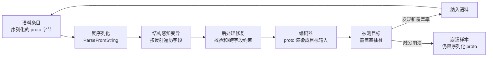
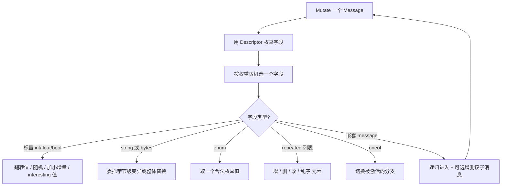
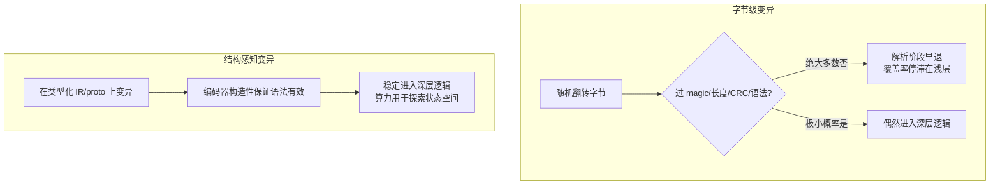
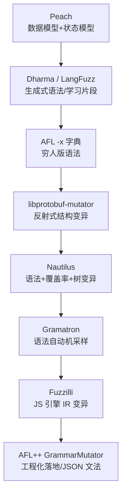
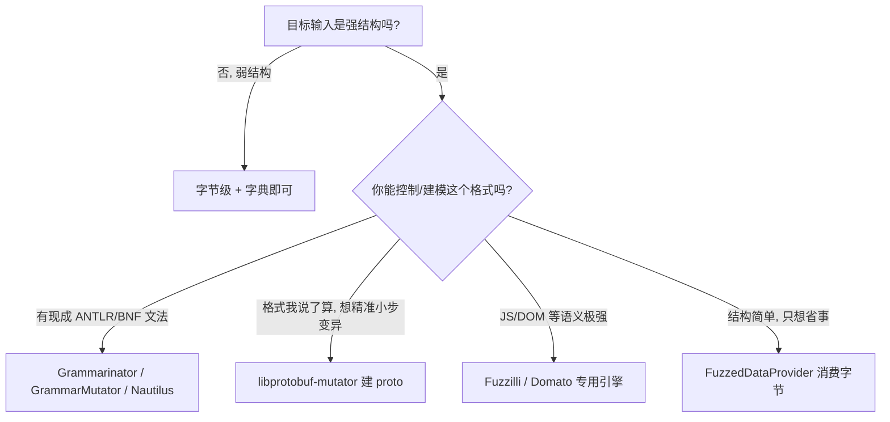

# Fuzzing与漏洞挖掘（11）· 结构化Fuzzing：语法与protobuf
> [!abstract] TL;DR
> - 字节级变异撞上"校验壁垒"：magic 数、长度字段、校验和、语法 token 让随机翻转在解析层就被早退拒绝，覆盖率停滞在浅层；结构化 Fuzzing 把变异域从**字节**搬到**类型化 IR**，从源头绕过这堵墙。
> - 两大流派：**生成式语法 Fuzzing**（从文法派生输入）与**结构感知变异**（在 AST/proto 上变异后再编码）。libprotobuf-mutator（LPM）是后者的代表——靠 protobuf 反射把通用变异器写一次，即可复用于任意消息类型。
> - LPM 的关键手法：语料条目**本身就存成序列化 proto**；每次变异 = 反序列化 → 按 `Descriptor`/`Reflection` 遍历字段做类型化变异 →（可选后处理修校验和/跨字段约束）→ 编码成目标输入。覆盖率反馈闭环完全不变。
> - proto 建模的是**语法**：语法有效性由编码器构造性保证；**语义有效性**（变量先定义后用、表必须存在、类型匹配）要靠编码器维护符号表或 `RegisterPostProcessor` 修补。
> - 代价与陷阱：序列化开销换深度，exec/s 下降；proto 过紧会漏 bug、过松会浪费算力；"永远只发合法输入"会形成**解析器盲区**，必须保留字节级 Fuzzing 覆盖 lexer 与错误处理路径。

## 概述与定位

前十章我们把覆盖率引导 Fuzzing 的引擎拆到了螺丝级：AFL 的位图与调度、libFuzzer 的持久模式、Sanitizer 插桩、变异算子的编排。但这些机制有一个共同的隐含假设——**输入是一段"无结构"的字节流**，翻转、拼接、插入任意字节都可能产生"有意义的新输入"。对图像、音频、压缩包这类**弱结构、宽容解析**的格式，这个假设大体成立；可一旦目标是**强结构**格式——带 magic 数与长度前缀的二进制协议、带 CRC/校验和的封包、需要词法与语法双重正确的编程语言（SQL、JavaScript、C）、Protocol Buffers/ASN.1 这类自描述编码——字节级变异就会**撞墙**：随机翻转出的字节在解析器的第一道关卡（magic 校验、长度合法性、token 化、语法分析）就被判非法而 `return`，程序根本走不到真正有 bug 的深层逻辑。覆盖率曲线于是early 见顶，几天几周都不再增长。

结构化 Fuzzing（Structure-aware Fuzzing / Grammar-aware Fuzzing）正是为破这堵墙而生。它的核心洞见只有一句：**把变异发生的"域"从原始字节，换到一个"绝大多数点都对应语法有效输入"的结构化域**。在这个域里，一次变异改的是"把加号换成乘号""给这个消息多加一个字段""把这个子表达式替换成另一个子表达式"，而不是"把第 37 字节的第 3 位翻转"。结构有效性由构造保证，fuzzer 的算力于是不再浪费在"造出能通过解析的输入"上，而是全部投入到"在合法输入空间里探索深层状态"。

本篇聚焦这一族技术中工程落地最广的一支——**基于 Protocol Buffers 的结构感知变异**，代表作是 Google 的 **libprotobuf-mutator（LPM）**；同时横向铺开**生成式语法 Fuzzing**（Peach、Dharma、Nautilus、Gramatron、Grammarinator、AFL++ GrammarMutator）与**IR 变异**（Fuzzilli）两条并行路线，讲清它们的取舍与深层原因。

定位上，本篇是[[10.变异策略与调度算法|第 10 章 变异策略]]的直接续篇：那里讲的是"字节域里怎么变异得更聪明"，这里讲的是"换一个域，让变异天然有效"。它依赖[[05.libFuzzer与持久模式|第 5 章]]的自定义变异器接口、[[09.语料库与字典与最小化|第 9 章]]的语料与字典（字典其实是"穷人版语法"）、[[08.Harness编写与目标裁剪|第 8 章]]的 harness 工程。它与[[12.覆盖率之外：污点与concolic|第 12 章 污点与 concolic]]是"翻越校验壁垒"的两条不同思路——结构化靠**先验建模**绕过校验，concolic 靠**约束求解**反解校验值，可互补。浏览器/JS 引擎的专用结构化技术见[[15.浏览器与JS引擎Fuzzing|第 15 章]]，内核系统调用的结构化（syzkaller 的 syscall 描述语言本质也是一种语法）见[[14.内核与驱动Fuzzing：syzkaller|第 14 章]]。

## 原理与机制

### 为什么字节级变异会"撞墙"：一个概率论视角

设想目标读入一个封包，头部有 4 字节 magic `0xDEADBEEF`、2 字节 payload 长度、末尾 4 字节 CRC32。字节级 fuzzer 想让一次随机变异同时**保持 magic 正确、长度自洽、CRC 匹配**，概率是天文数字级别的小：CRC 只有 1/2³² 的机会碰对。结果是 99.99% 的变异输入在校验函数里 `return -1`，只覆盖到"读头部—校验失败—退出"这几个基本块。位图饱和、能量分配（[[10.变异策略与调度算法|见第 10 章]]）再精巧也无济于事——**问题不在于变异不够聪明，而在于变异的域本身就几乎不含有效点**。

字典（`-x`）能缓解一部分：把 magic、关键字塞进字典，fuzzer 就能"整体替换"出正确 magic。但字典只能提供**固定的字面 token**，无法表达"长度字段必须等于 payload 实际长度""括号必须配对""变量必须先声明"这类**关系约束**与**递归结构**。字典是一维的常量表，语法是带产生式规则的多维结构——这是二者能力的本质分界。

### 换域：两个方向的映射

结构化 Fuzzing 的通用骨架，是在 fuzzer 与目标之间插入一个**双向映射**：

- **解码（bytes → 结构）**：让 fuzzer 的语料/变异仍然作用在一段字节上（这样 libFuzzer 的最小化、拼接、语料管理机制无需改动），但这段字节被解释为一个**结构化对象**（一棵 AST、一个 proto 消息）。
- **编码（结构 → 目标输入）**：把结构化对象序列化/渲染成目标真正吃的输入（一段 SQL 文本、一个二进制封包、一份源码）。

有了这层映射，"在结构上变异"就等价于"在字节上变异后重新解释"。不同技术流派的差别，全在于**这层映射怎么实现、变异到底发生在字节侧还是结构侧**：



关键点：**覆盖率反馈闭环（[[02.覆盖率引导原理：AFL的核心思想|第 2 章]]的核心）一个字节都没改**。结构化只是一个"前端适配层"，坐在字节世界与结构世界之间；引擎照旧靠 SanitizerCoverage（[[04.编译期插桩：SanitizerCoverage与PCGUARD|第 4 章]]）的边计数决定"这条输入是否有价值"。这也解释了为什么它能无缝嫁接到 libFuzzer 与 AFL++ 上——它不重造引擎，只重造"输入长什么样"。

### 语法有效 ≠ 语义有效：两层门槛

结构化 Fuzzing 天然解决**语法有效性**（syntactic validity）：编码器只要按文法产生式渲染，输出必然能通过词法与语法分析。但很多目标在语法之上还有**语义约束**（semantic validity）：SQL 里 `SELECT` 的列必须属于 `FROM` 的表；JS 里用到的变量得先声明；类型系统要求两端类型兼容；协议里"长度字段 == 实际长度""校验和 == 重算值"。纯语法生成器造出的输入能过 parser，却常在语义检查（binder、type checker、校验函数）处再次被拒。

跨过第二层门槛有两条路：**编码时携带上下文**（渲染 AST 时维护一张符号表，用变量只从"已声明集合"里取；生成 `FROM` 后把表名记下供 `SELECT` 引用），或**变异后统一修补**（LPM 的 `PostProcessor`：重算长度与 CRC、把越界的枚举夹到合法范围）。这两条路是本篇后续实战的重头戏。理解这两层门槛，才能理解结构化 Fuzzing 的能力边界——它把"过语法"变简单了，"过语义"仍需为每个目标定制建模。

## 结构感知变异与语法引擎详解

这一节把两大流派的内部机制拆开讲透，再做横向对比。

### libprotobuf-mutator：用反射把变异器写一次

LPM 的设计出发点是一个工程痛点：**为每种输入格式手写一个结构感知变异器太贵**——你得为 AST 的每种节点类型实现"如何随机造一个""如何变异一个""如何交叉两个"。Google 的取巧是：**不为每种格式写变异器，而是为 Protocol Buffers 这一种"元格式"写一个通用变异器**，然后让使用者把自己的输入格式**建模成一个 `.proto` 消息**。为什么偏偏是 protobuf？因为它同时具备三个稀缺属性：

1. **反射（Reflection）**：protobuf 运行时提供 `Descriptor`（描述某消息有哪些字段、各字段类型/标签/是否 repeated/是否 oneof）与 `Reflection`（在不知道具体类型的前提下 get/set 任意字段）。有了反射，一个变异器就能"遍历任意消息的任意字段并按类型变异它"，**一次编写、通吃所有消息类型**。
2. **规范的序列化**：protobuf 有确定的二进制编码与文本编码（TextFormat），于是语料条目可以直接**存成序列化 proto**，可移植、可最小化、可用 `protoc --encode/--decode` 人工编辑。
3. **足够的表达力**：`message` 嵌套、`repeated`（列表）、`oneof`（标签联合/和类型）、`enum`、`map`、proto2 的 `required/optional`——足以给绝大多数树状/递归结构建模。

**变异是怎么发生的？** LPM 的核心是 `Mutate(Message*)`：拿到一个消息对象，用 `Descriptor` 枚举它的字段，按权重随机选一个字段，再依字段类型分派到具体算子：



每种算子都带着"protobuf 语义"：改标量不会破坏消息结构；给 `repeated` 增删元素相当于"给列表加一项/减一项"这种高层操作；切换 `oneof` 分支相当于"把这个和类型从 A 变体换成 B 变体"——这些正是字节级变异**做不到的原子操作**。变异器还会**约束递归深度与消息大小**（`SetKeepInitialized` 保证 proto2 的 `required` 字段始终有值、限制最大尺寸），避免无限膨胀。

**它如何嵌进 libFuzzer？** LPM 用的是[[05.libFuzzer与持久模式|第 5 章]]提到的自定义变异钩子：它实现了 `LLVMFuzzerCustomMutator` 与 `LLVMFuzzerCustomCrossOver`。libFuzzer 递给它一段字节（语料条目），LPM 把这段字节 `ParseFromString` 成消息对象，调 `Mutate`（或跨两条语料做字段级 `CrossOver`），再 `SerializeToString` 写回缓冲区。使用者只需写：

```proto
// expr.proto —— 把"表达式语言"建模成 proto
syntax = "proto2";
package expr;

message Expr {
  oneof kind {              // 和类型：一个表达式要么是字面量，要么是二元运算，要么是变量
    int32   literal = 1;
    BinOp   binop   = 2;
    Var     var     = 3;
  }
}
message BinOp {
  enum Op { ADD = 0; SUB = 1; MUL = 2; DIV = 3; }
  required Op   op  = 1;
  required Expr lhs = 2;     // 递归：左右子表达式又是 Expr
  required Expr rhs = 3;
}
message Var { required uint32 index = 1; }
```

```cpp
// harness.cc —— DEFINE_PROTO_FUZZER 展开出 custom mutator + 入口
#include "src/libfuzzer/libfuzzer_macro.h"
#include "expr.pb.h"

static std::string ToSource(const expr::Expr& e, int depth = 0);  // 编码器：proto -> 文本

DEFINE_PROTO_FUZZER(const expr::Expr& e) {
  std::string src = ToSource(e);      // 结构 -> 目标语言文本，语法有效由构造保证
  TargetEvaluator().Eval(src);        // 喂给被测的解析/求值器
}
```

`DEFINE_PROTO_FUZZER` 宏把"注册自定义变异器 + 把字节反序列化成 `const expr::Expr&` 递给你"这些样板全部隐藏；你只需专注两件事：**建模（.proto）**与**编码器（ToSource）**。此外还有 `DEFINE_TEXT_PROTO_FUZZER`（语料存成可读文本 proto，便于人工审阅）与 `DEFINE_BINARY_PROTO_FUZZER`（面向"直接 fuzz protobuf 解析器本身"的场景）。

**语义修补：PostProcessor。** 当格式有跨字段约束时，用后处理回调在变异后统一修：

```cpp
using protobuf_mutator::libfuzzer::PostProcessorRegistration;
static PostProcessorRegistration<pkt::Packet> reg = {
  [](pkt::Packet* p, unsigned int /*seed*/) {
    p->set_length(p->payload().size());     // 长度字段 = 实际 payload 长度
    p->set_crc32(Crc32(p->payload()));      // 重算校验和，直接翻过 CRC 壁垒
  }};
```

这一手是结构化 Fuzzing 翻越 CRC/长度校验的"标准动作"：不去猜校验值，而是**每次变异后按规则算对**。它必须是**确定性、无副作用**的——同样的输入必须修出同样的结果，否则会破坏 libFuzzer"同字节同执行"的假设，导致崩溃不可复现。

**该 proto 的建模不是被测数据本身，而是"语法"。** 这是最容易被误解的一点：上面的 `Expr` proto 不是要去 fuzz protobuf，而是**借 proto 当一棵抽象语法树的载体**，最终渲染成目标语言的文本。LLVM 的 `clang-proto-fuzzer` 正是这么干的——它用 `cxx_proto.proto` 把 C++ 的一个子集建成 proto，再用 `proto-to-cxx` 渲染成源码喂给 Clang，从而把编译器推入合法但刁钻的深层代码路径；OSS-Fuzz 的结构化 Fuzzing 指南同样给出了 SQL、正则、图像格式的 proto 建模范式，Chromium 也用 LPM 对 Mojo IPC 消息做结构化 Fuzzing。

### 生成式语法 Fuzzing：从文法直接派生

另一支流派不"变异已有种子"，而是**从上下文无关文法（CFG）出发，随机推导（derivation）生成输入**。给定产生式 `S → SELECT cols FROM table | INSERT ...`，从起始符递归展开、每步随机选一条产生式，直到全是终结符，就得到一个语法有效的字符串。代表工具谱系：

- **Peach**：老牌商业/开源生成式 fuzzer，用 **DataModel**（数据结构）+ **StateModel**（协议状态机）描述格式与交互流程，擅长有状态网络协议。
- **Dharma / LangFuzz**：Mozilla 系。Dharma 是纯生成式语法引擎（多用于 JS/DOM）；LangFuzz 则**从既有语料里学出片段**并按语法重组，早年在 SpiderMonkey 上战功赫赫。
- **Grammarinator**：直接吃 **ANTLR** 的 `.g4` 文法，自动生成对应的生成器/变异器——复用现成语言文法是它的最大卖点。
- **Nautilus**：把**语法生成 + 覆盖率反馈 + 树变异**三者合一。它在语法派生树上做变异（随机替换子树、拼接来自不同种子的子树、按规则重写），并用 AFL 式覆盖率保留"打开新代码"的树——是"生成式"与"覆盖率引导"的关键融合点。
- **Gramatron**：针对"朴素 CFG 推导偏向浅层、难做大步变异"的痛点，把文法**转成有限状态自动机（FSA）**，在自动机上游走既能**均匀采样**又能做**激进的大步变异**，显著提升深层结构的探索效率。
- **Superion**：在 AFL 上加 **AST 树变异**，把输入解析成语法树后替换子树，主打 XML/JS 这类有明确文法的语言。

### "决策流"技巧：QuickCheck 式参数化生成器

还有一条优雅的中间路线，把生成器和字节 fuzzer 缝在一起：**让生成器在需要随机决策时，从 fuzzer 给的字节流里取"随机数"**。于是 fuzzer 变异字节 = 变异生成器的一连串决策 = 变异出的结构化输入。Java 的 **JQF/Zest**（`SourceOfRandomness` 由输入字节驱动）、**RLCheck** 是典型；LLVM 自带的 **`FuzzedDataProvider`**（`<fuzzer/FuzzedDataProvider.h>`，[[08.Harness编写与目标裁剪|第 8 章]]常用）是它的轻量版——`ConsumeIntegralInRange`、`ConsumeBytes` 逐段"消费"输入字节来构造类型化对象。它无需 protobuf、无需反射，写起来最省事；代价是**变异仍发生在字节侧**，`FuzzedDataProvider` 只是把字节确定性地"解释"成结构，一次字节翻转可能让后续所有 `Consume` 全体错位（结构剧烈跳变），不像 LPM 那样能做"只改这一个字段"的精准小步变异。这个对比很实用：**简单结构用 `FuzzedDataProvider` 就够，复杂递归结构才值得上 LPM 的重型建模**。

### 横向对比与深层原因



- **生成式 vs 变异式**：纯生成式语法有效率极高，但**难以"保留崩溃输入里好的部分"再微调**，也不天然吃覆盖率反馈（Nautilus/Gramatron 才补上）；结构感知变异（LPM/Fuzzilli）天生活在覆盖率引导闭环里，能最小化、能拼接、能保留有趣种子，语料语义清晰。代价是**必须把格式建模成 proto/IR，且编码器是 bug 与盲区的集中地**。
- **proto 过紧 vs 过松**：建模太严（只允许"完美合法"输入）会**漏掉解析器/校验器本身的 bug**；建模太松（几乎什么都允许）又退化回字节级、浪费算力。好的建模是"覆盖语法主干 + 留少量非法逃逸口"。
- **解析器盲区**：只发合法输入，就永远测不到目标的**词法错误处理、异常路径、健壮性**——而这些恰恰是历史上出洞的重灾区。正确做法是**结构化 Fuzzing 与字节级 Fuzzing 并行**：前者钻深层语义逻辑，后者砸浅层解析健壮性。
- **IR 而非文本**：JS 引擎的语义约束（作用域、类型）在文本层几乎无法保证有效，于是 **Fuzzilli** 干脆变异一种**类型化的 SSA 式 IR**（构造上就作用域正确、无未定义变量），再 lower 成 JS——这是把"语义有效性"也纳入构造保证的极致，细节见[[15.浏览器与JS引擎Fuzzing|第 15 章]]。

结构化 Fuzzing 的历史演进，可以串成一条"表达力越来越强、与覆盖率结合越来越紧"的主线：



## 工具视角与实战

### 用 LPM 搭一个结构化 harness 的完整流程

1. **建模**：把目标输入的语法写成 `.proto`。递归结构用嵌套 `message` + `oneof`（和类型），列表用 `repeated`，可选部分用 proto2 的 `optional`，关键字/运算符用 `enum`。建模粒度决定探索空间——太粗会漏组合，太细会爆炸。
2. **写编码器 `ToSource`**：把 proto 递归渲染成目标输入。**务必在编码器里限制递归深度**（如 `if (depth > 32) return "0";`）——proto 允许任意深嵌套，若不封顶，深树会在**你自己的 `ToSource` 里**栈溢出，产生一个与被测目标无关的**假崩溃**。这是 LPM 新手最常踩的坑。
3. **写 harness**：`DEFINE_PROTO_FUZZER(const Foo& msg){ ... }`，把 `ToSource(msg)` 的结果喂给目标。
4. **接编译**：和普通 libFuzzer 目标一样用 `clang++ -fsanitize=fuzzer,address`（[[07.Sanitizers：ASan与UBSan与MSan|第 7 章]]），另外链接 protobuf、LPM 及 `protoc` 生成的 `*.pb.cc`。LPM 官方给了 CMake 集成（会自带一份 protobuf 以避免版本漂移）。
5. **种子语料**：写几段文本 proto，用 `protoc --encode=pkg.Foo schema.proto < seed.textproto > seed.bin` 转成序列化 proto 放进语料目录；或用 `DEFINE_TEXT_PROTO_FUZZER` 直接吃文本 proto 语料。好种子能大幅缩短冷启动。
6. **跑与调**：崩溃样本是序列化 proto，肉眼不可读。设 `LPM_DUMP_NATIVE_INPUT=1` 让 harness 把当前 proto 以文本格式（以及/或渲染后的目标输入）打印到 stderr，就能把二进制崩溃样本还原成可读结构做**崩溃三分类**（[[16.崩溃分类与去重与可利用性|第 16 章]]）；也可写个小工具 `--decode` 回文本。

### AFL++ 与语法变异器生态

结构化不是 libFuzzer 的专利。AFL++（[[03.AFL++架构与使用|第 3 章]]）提供 **自定义变异器 API**（`afl_custom_init`/`afl_custom_fuzz`，通过 `AFL_CUSTOM_MUTATOR_LIBRARY` 环境变量挂载），LPM 也有对应的 AFL 适配，可把"protobuf 结构变异"接到 AFL++ 的调度上。AFL++ 生态里还直接内置/配套了多款语法变异器：

- **AFL++ GrammarMutator**：吃 **JSON 描述的文法**，既能生成也能做树变异，工程化程度高、上手快，适合已有 BNF/JSON 文法的语言目标。
- **Nautilus / Gramatron**：作为 custom mutator 接入，带来"语法感知 + 覆盖率"的组合拳。
- **字典（`-x`）**：最轻量的"语法近似"，把 magic、关键字、常见 token 喂进去，对弱结构格式常有立竿见影的效果——不要一上来就上重型建模，**先用字典试水**往往性价比最高。

### 选型决策



一句话经验：**弱结构上字典，强结构且你掌握格式上 LPM，已有语言文法上 GrammarMutator/Nautilus，JS/DOM 上专用引擎，简单结构上 FuzzedDataProvider**。别过度工程化——为一个 TLV 小协议写几百行 proto，收益未必比"字典 + 一个 CRC 后处理"高。

### 实战产出与下游

结构化 Fuzzing 出的洞往往又深又值钱：数据库/编译器/序列化库的解析与语义层历史上盛产内存破坏。崩溃拿到后，走[[16.崩溃分类与去重与可利用性|崩溃分类去重]]，再经[[33.二进制漏洞与利用基础/01.内存破坏漏洞全景与利用链模型|内存破坏漏洞全景与利用链模型]]评估可利用性、串成利用链。覆盖率反馈本身依赖插桩，其与污点/trace 的协同见[[48.动态插桩与模拟执行引擎/12.插桩驱动的分析：覆盖率与污点与trace|插桩驱动的分析]]。

## 安全性与正确使用

> [!caution] 合规边界（务必先读）
> 结构化 Fuzzing 能**又快又深**地在广泛部署的解析器/协议实现里挖出真实内存破坏漏洞，威力越大越要守住边界：
> - **仅用于自有资产、获得书面授权的目标、CTF 靶场与安全研究**；对第三方生产系统/他人服务实施 Fuzzing 或投喂畸形输入前，必须有明确授权，否则可能构成非法侵入或破坏。
> - 一律**防御与教育视角**：本篇讲的是"如何建模、如何绕过校验壁垒探索深层逻辑"的**原理与方法论**，不提供针对任何真实生产目标的武器化投递配方，也不为绕过商业授权/版权保护提供成品手段。
> - 挖到漏洞走**负责任披露**：私下报告厂商、给合理修复窗口，而非公开 0day 或用于攻击。
> - 涉及闭源商业软件时注意**许可与逆向条款**：结构化 harness 常需理解私有格式，务必确认所在法域与授权允许此类分析。

除合规外，几条"正确使用"的工程纪律直接决定结果真假：

- **别让编码器自己崩**：`ToSource`/生成器里的栈溢出、越界、空指针会产生**假阳性崩溃**，浪费三分类人力。编码器要封顶递归深度、做好边界，最好自己也过一遍 ASan。
- **PostProcessor 必须确定且无副作用**：修校验和/长度的回调若引入随机性或全局状态，会让崩溃**不可复现**，直接毁掉 libFuzzer 的最小化与回归价值。
- **警惕解析器盲区**：结构化只发合法输入，会系统性漏掉词法/错误处理路径的 bug。**结构化与字节级 Fuzzing 应并行**，两条战线互补。
- **proto/文法的粒度是双刃剑**：过紧漏 bug、过松浪费算力；建模要"覆盖语法主干 + 留少量非法逃逸口"，并随覆盖率反馈迭代调整。
- **要 fuzz protobuf/序列化库本身时，反其道而行**：解析**不可信** protobuf 本身就是攻击面（递归深度、内存放大、`oneof` 混淆）。此时**不要**先做结构化建模去"造合法 proto"，而应回到字节级、直接砸解析器（用 `DEFINE_BINARY_PROTO_FUZZER` 或干脆裸字节），否则你只测了"合法输入解析"，恰好漏掉真正危险的"畸形输入解析"。
- **schema 演进会作废语料**：改了 `.proto` 的字段编号/类型，旧的序列化 proto 语料可能被误读。schema 要像 API 一样谨慎演进，大改后重建语料。

## 小结

结构化 Fuzzing 解决的是覆盖率引导 Fuzzing 的一个根本性瓶颈：**当输入有强结构时，字节级变异几乎造不出能通过解析/校验的有效输入，算力全耗在浅层**。它的破法是**换域**——把变异从字节搬到"绝大多数点都语法有效"的结构化域，语法有效性由编码器构造性保证，覆盖率反馈闭环原样保留。

- **libprotobuf-mutator** 是结构感知变异的工程标杆：借 protobuf 反射把通用变异器写一次，使用者只需把格式建模成 `.proto` + 写一个编码器 `ToSource`；语料即序列化 proto，`PostProcessor` 负责跨越 CRC/长度等语义约束。它的杀手锏不是"fuzz protobuf"，而是"借 proto 当 AST 载体"去攻数据库、编译器、协议实现。
- **生成式语法流派**（Peach/Dharma/Nautilus/Gramatron/Grammarinator/GrammarMutator）从文法直接派生输入，Nautilus 与 Gramatron 把覆盖率与自动机采样融了进来；**决策流/参数化生成器**（Zest、`FuzzedDataProvider`）是缝合字节 fuzzer 与结构生成的轻量中间路线；**IR 变异**（Fuzzilli）把语义有效性也纳入构造保证。
- 核心取舍与纪律：**语法有效易、语义有效难**（靠符号表或后处理补）；**proto 过紧漏 bug、过松费力**；**只发合法输入有解析器盲区**，须与字节级并行；**编码器别自己崩、后处理要确定**；**fuzz 序列化库本身要回退到字节级**。

选型上记住那条决策链：弱结构上字典，强结构且掌握格式上 LPM，已有语言文法上 GrammarMutator/Nautilus，JS/DOM 上专用引擎，简单结构上 FuzzedDataProvider——**先轻后重，用覆盖率说话**。翻越校验壁垒的另一条正交思路（污点与 concolic 反解约束）见下一章。

## 相关阅读

- 上游概念：[[10.变异策略与调度算法|← 变异策略与调度算法]]（字节域变异，本篇的对照）、[[09.语料库与字典与最小化|语料库与字典与最小化]]（字典 = 穷人版语法）、[[05.libFuzzer与持久模式|libFuzzer与持久模式]]（自定义变异器接口）、[[08.Harness编写与目标裁剪|Harness编写与目标裁剪]]（FuzzedDataProvider）。
- 正交与下游：[[12.覆盖率之外：污点与concolic|→ 污点与concolic]]（约束求解翻越校验壁垒）、[[16.崩溃分类与去重与可利用性|崩溃分类与去重与可利用性]]、[[33.二进制漏洞与利用基础/01.内存破坏漏洞全景与利用链模型|内存破坏漏洞全景与利用链模型]]（崩溃转利用）、[[48.动态插桩与模拟执行引擎/12.插桩驱动的分析：覆盖率与污点与trace|插桩驱动的分析：覆盖率与污点与trace]]（覆盖率反馈来源）。
- 专用结构化领域：[[15.浏览器与JS引擎Fuzzing|浏览器与JS引擎Fuzzing]]（Fuzzilli 的 IR 变异）、[[14.内核与驱动Fuzzing：syzkaller|内核与驱动Fuzzing：syzkaller]]（syscall 描述语言即语法）、[[52.Linux内核机制与内核利用/18.内核Fuzzing与syzkaller|内核Fuzzing与syzkaller]]、[[54.浏览器与JS引擎漏洞/00.浏览器与JS引擎漏洞总览|浏览器与JS引擎漏洞总览]]、[[38.Windows内核与驱动逆向/30.内核Fuzzing|Windows 内核 Fuzzing]]。
- 官方文档与论文：google/libprotobuf-mutator 仓库与其 README、Protocol Buffers 官方文档（Descriptor/Reflection、proto2/proto3 语言指南）、OSS-Fuzz "Structure-Aware Fuzzing with libFuzzer" 指南、LLVM `clang-proto-fuzzer`/`proto-to-cxx` 源码、Nautilus（NDSS 2019）、Gramatron（ISSTA 2021）、Superion（ICSE 2019）、JQF/Zest 论文、AFL++ 文档中的 custom mutator 与 GrammarMutator 章节。

[[00.Fuzzing与漏洞挖掘总览|⬆ 系列总览]] | [[10.变异策略与调度算法|← 上一章]] | [[12.覆盖率之外：污点与concolic|→ 下一章]]
