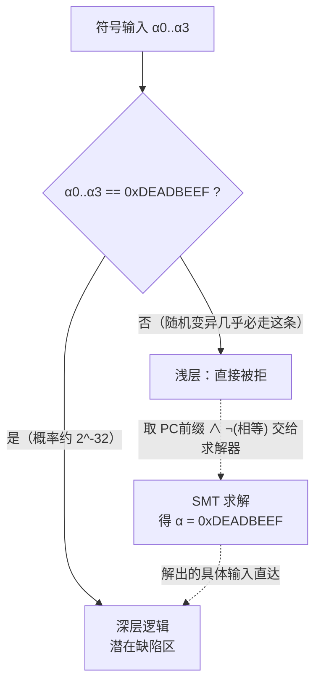
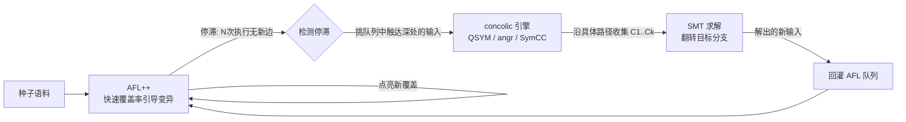
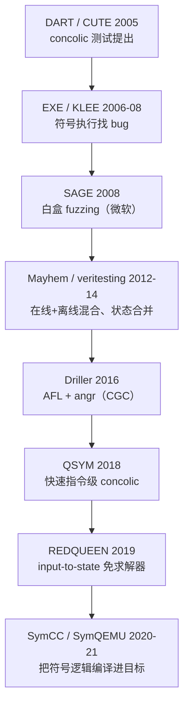

# Fuzzing与漏洞挖掘（12）· 覆盖率之外：污点与concolic
> [!abstract] TL;DR
> - 覆盖率引导在「魔术字节 / 强等值 / 校验和」这类分支上会撞墙：4 字节常量随机命中的概率只有 2⁻³²，而且**猜错 3 字节和猜错 0 字节拿到的覆盖率完全一样**——适应度曲面是平的，AFL 没有梯度可爬，退化成它爬不动的暴力搜索。
> - 突破口有两族：**污点分析**回答「输入的哪几个字节流向了这个比较」，把全局盲变异收敛成对少数关键偏移的定向变异（便宜、近似）；**concolic（混合执行）**把整条路径的约束交给 SMT 求解器，直接解出翻转分支的输入（精确、昂贵）。二者共同的范式转变是从「生成后观察」走向「推理后构造」。
> - **Driller** 的精髓是分工：AFL 在「隔间」内廉价地广度铺开，卡住时才唤醒 angr 的**选择性符号执行**去撬开隔间之间的窄门，解出的输入回灌 AFL 队列——用少量昂贵算力兑换 AFL 够不到的深度，而不是全程符号执行（那会路径爆炸）。
> - concolic 的工程死穴是**慢**与**路径爆炸**：QSYM 用指令级快速 concolic + 乐观求解 + 基本块剪枝把它做到可规模化，SymCC/SymQEMU 更进一步把符号逻辑**编译进目标**，比 KLEE/angr 的 IR 解释快几个数量级；而单向函数（SHA、强校验和）从数学上就解不动，求解器必然超时。
> - 很多「魔术字节」根本不必动求解器：**REDQUEEN 的 input-to-state**、**laf-intel 的比较拆分**、**AFL++ 的 CmpLog** 用近乎零成本就能吃掉大半强等值分支。工程正确姿势是「成本阶梯」——先字典与结构化，再 CmpLog/laf-intel，最后才上 QSYM/SymCC，每上一级 CPU 成本涨 10~100 倍。

## 概述与定位

前面几篇（02 覆盖率原理、03 AFL++、10 调度）反复讲一件事：现代灰盒 fuzzing 之所以强，是因为它有一根**梯度**——用边覆盖率当适应度信号，只要输入的微小改动能**增量地**点亮新边，模糊器就能像爬山一样一路摸进程序深处。这套机制在绝大多数真实代码上惊人地有效，但它有一个致命的盲区，这个盲区正是本篇要正面攻克的。

考虑这样一行判断：`if (memcmp(input, "\x7fELF", 4) == 0)`，或者 `if (header->magic == 0xDEADBEEF)`。要走进 `if` 里面，你必须让输入的那 4 个字节**恰好**等于目标常量。随机变异命中它的概率是 2⁻³²，约四十亿分之一——这已经够糟。但更致命的是第二点：一个猜对了 3 字节的输入，和一个 0 字节都没猜对的输入，**拿到的覆盖率一模一样**——它们都走了「不相等」那条边。没有部分得分，没有渐进反馈，适应度曲面在这里是一整块**平地**。爬山算法在平地上是瞎的。于是覆盖率引导退化成它根本无力承担的纯暴力搜索，卡在门外。

这就是所谓的**覆盖率之墙（coverage wall）**，也是灰盒 fuzzing 几乎所有「跑几小时后覆盖率停滞」现象背后的头号元凶。它的变体遍布真实程序：校验和 / CRC / 哈希守卫（拒绝 99.99…% 的输入）、多层嵌套形成的「隔间（compartment）」、要求特定输入序列才能推进的状态机。共性是——存在一个**强约束的窄门**，靠掷骰子过不去。

破墙有两族思路，构成本篇的两条主线：

- **污点分析（taint analysis / DTA）**：一个偏轻量、数据流层面的回答。它追踪「输入的哪几个字节，经过怎样的传播，最终影响了这个分支」。一旦知道是偏移 `[4,8)` 的字节决定成败，就把全局盲变异收敛成只针对这几个偏移的定向变异，甚至直接把被比较的常量抄进去。便宜，但不精确。
- **concolic 执行 / 符号执行（concolic execution）**：一个偏重量、语义层面的回答。它把输入当作符号变量，沿路径累积逻辑**约束**，再交给 SMT 求解器算出一个能翻转目标分支的具体输入。精确，但慢，而且容易路径爆炸。

两者之间还站着一排「近似符号」的实用招数（REDQUEEN、laf-intel、CmpLog、Eclipser），用一小部分成本换到大部分收益——这正是工程上真正天天在用的东西。

在系列坐标里，本篇是「**覆盖率之外**」的一篇：它默认你已理解 02（覆盖率）、10（调度）、11（结构化）。它讲的是 fuzzing 一侧如何**利用**这些分析结果去导向变异；而底层那台既提供覆盖率、也提供污点与 trace 的插桩/模拟引擎，则是 [[48.动态插桩与模拟执行引擎/12.插桩驱动的分析：覆盖率与污点与trace]] 的主题。往下游，被撬开的深层缺陷最终经 [[33.二进制漏洞与利用基础/01.内存破坏漏洞全景与利用链模型]] 转为利用。

## 原理与机制

**符号执行的直觉。** 常规执行喂进具体字节；符号执行反其道而行，把每个输入字节看成一个**符号变量** `α₀, α₁, …`（本质是一个新鲜的位向量）。程序照常「执行」，只不过每个寄存器、每个内存单元里存的不再是数值，而是一个关于这些 `α` 的**表达式**。走到条件分支 `if (e)` 时，`e` 是一个符号布尔表达式：要走 true 分支，就把 `e` 合取进**路径条件（PC, path condition）**；走 false 就合取 `¬e`。PC 是这条路径上所有分支决策的合取式，它的含义精确得可爱——**任何满足 PC 的 α 具体赋值，喂进去都会不多不少地走出这条路径**。

于是「如何构造一个能翻转某分支的输入」有了一个数学化的答案：取该分支之前的 PC 前缀，合取上该分支条件的取反，问 SMT 求解器「`PC_前缀 ∧ ¬e` 可满足吗？可满足就给我一组解」——求解器吐出的 model，就是一个能把这个分支翻到另一边的具体输入。魔术字节在这个框架下不再是四十亿分之一的运气，而是一道确定性的方程：解 `α₀α₁α₂α₃ == 0xDEADBEEF`，一步到位。

**路径爆炸——纯符号执行的天花板。** 天下没有免费的午餐。`n` 个顺序分支最多岔出 2ⁿ 条路径；带符号边界的循环更是无界。KLEE 式的**在线（online）**符号执行在每个分支处 fork 出两个状态并同时保活，很快就被指数级增长的状态数淹死。这是符号执行与生俱来的可扩展性硬墙，也是它二十年来无法单独取代 fuzzing 的根本原因。

**concolic：用具体值驯服符号。** concolic = **conc**rete + symb**olic**，正是为化解路径爆炸而生。它像普通 fuzzer 一样喂进一个**真实的具体输入**跑程序，但在旁边**影子式**地维护符号表达式。因为跟着一条具体路径走，任一时刻手里**只有一条 PC**——不 fork，单次运行不会指数膨胀。凡是不想或没法符号化建模的东西（一次系统调用、一个 libc 函数、一个符号化的内存地址），就**具体化（concretize）**：把运行时的真实值代进去。这让分析始终可解，代价是牺牲完备性（只对当前这条路径成立）。要探索新路径，就在具体路径上挑一个分支、取反其条件、解 `PC前缀 ∧ ¬cond`，得到新的具体输入，回喂再跑——如此迭代，就是 DART / SAGE 式的「代际（generational）」定向搜索。一句话：**具体执行驱动它、符号推理泛化它**，用重复的具体重跑（吃 CPU）换掉在线符号的内存爆炸。

**污点分析：更轻的那条路。** 动态污点分析（DTA）不做求解，只做**数据流追踪**。三要素：**污点源**——把输入字节标记为污点，标签通常就是它的偏移；**传播**——指令执行时沿数据流传播，`c = a + b` 则 `taint(c) = taint(a) ∪ taint(b)`，load/store 让污点穿过内存；**污点汇**——在比较 `cmp a, b`、内存下标、格式串等敏感点检查操作数被哪些输入偏移污染，于是得到「偏移 `[4,8)` 决定此分支」这一关键情报。拿到情报后，要么只变异这几个字节（把 2³² 的搜索空间砍到每字节 2⁸），要么干脆把另一操作数的具体值直接拼进这些偏移（input-to-state，见后文）。

污点分析的两个固有病灶必须心里有数：**过污染（over-taint / 污点爆炸）**——经由地址、查表等路径保守传播，导致「什么都被染」，精度归零还拖慢；**欠污染（under-taint）**——隐式流 / 控制依赖（`if (a) b = 1;`，`b` 依赖 `a` 却没有数据流复制关系）会被漏掉，除非追踪控制依赖，而那又会引入过污染。这条**健全性 vs 精度**的张力是 DTA 无法根除的顽疾，也是为什么污点常被当「线索」而非「真相」。

无论走污点（近似、逐字节）还是 concolic（精确、整路径），本篇统摄性的关键词是**约束求解引导（constraint-solving guidance）**：目标是**推导**出满足目标分支约束的输入，而不是靠运气撞上。这就是相对前十一篇最本质的范式跃迁——**从「生成后观察」到「推理后构造」**。

## 混合执行引擎与约束求解详解

### 符号状态、IR 与内存模型

一个符号执行引擎首先得选一套可解释的**中间表示（IR）**：angr 用 VEX（源自 Valgrind），KLEE 用 LLVM IR，S2E 用 QEMU 的 TCG，Triton 自建 x86/ARM 之上的 AST。为什么非 IR 不可？因为逐条精确建模 x86 每条指令的标志位与副作用语义是天文数字工程，而把它**提升（lift）**到几十条精简 RISC 式操作的小 IR，符号解释器才可能写得出、还能跨架构复用。引擎的**状态**是一个四元组：符号化的寄存器堆、符号化的内存、路径条件 PC、以及具体化回退值。

真正的硬骨头是**符号内存模型**。当一次 load/store 的**地址本身是符号化的**（`table[input]`，下标来自输入），怎么办？三种取舍：(1) **具体化地址**——在满足 PC 的前提下挑一个具体地址，快，但丢掉了其他可能（对完备性不健全）；(2) **全符号内存**——用 SMT 的**数组理论（QF_ABV）**建模，精确，但每次符号访问都变成对所有可能地址的 `ite/select` 嵌套，昂贵；(3) 折中——angr 默认偏向可配置策略的具体化，KLEE 则在可行解上 fork 到某个上界。这里再次印证那条贯穿全篇的铁律：**每一处具体化都在拿完备性换速度**。

### 路径条件收集与分支翻转

流程摊开看：跑一遍输入，记录每个分支的符号条件与实走方向，得到有序约束序列 `C₁, C₂, …, Cₖ`。要翻转第 `i` 个分支，就求解 `C₁ ∧ … ∧ C_{i-1} ∧ ¬Cᵢ`——**前缀必须保留**（否则新输入根本走不到第 `i` 个分支），只把 `Cᵢ` 取反把它送向另一边。SAGE 的**代际搜索**把这一步系统化：从一颗种子出发，对 trace 上每个分支逐一取反生成一批子代，按新增覆盖率打分，best-first 扩展，从而系统性地遍历一条路径的「邻域」。

### SMT 求解器与位向量理论

这些约束是机器字上的运算，所以落在**无量词位向量逻辑（QF_BV）**，加上内存则是**位向量+数组（QF_ABV）**；主流求解器有 Z3、STP、Boolector、Yices2。为什么必须是位向量而非数学整数？因为二进制层面的**回绕溢出、按位运算、移位**都要求精确建模——一个用无穷精度整数推理的符号执行器会在整数溢出上给出**错误**结论。求解本身 NP-hard，实际成本主要由约束规模、以及**非线性算子（乘除）**驱动。

这里有一道 concolic **无论如何都翻不过的墙：单向函数**。若分支被 `SHA256(input) == 目标摘要` 守着，求解器从数学设计上就无法高效求逆，必然超时——concolic **解不了**强哈希 / 强校验和。此时只能换域特定手段（打补丁绕过校验、或把摘要作为模型喂进去）。浮点与重非线性算术同样是求解器的天敌。**识别出「这道门求解器过不去」并及时改换策略，是 concolic 实战里最值钱的判断力之一。**

### 乐观求解、剪枝与指令级 concolic（QSYM 的三板斧）

整条路径约束 `C₁∧…∧Cₖ` 往往巨大、慢甚至不可解。QSYM（USENIX Security 2018）为把 concolic 做成 fuzzing 的可规模化配件，贡献了三个「不健全但好用」的关键工程：

- **乐观求解（optimistic solving）**：约束不可解时，扔掉前缀，只解 `¬Cₖ`。解出的输入不保证真能走到第 `k` 个分支（前缀没保证），但经验上常常能走到或很接近，而且极便宜——反正下游有个 fuzzer 会**具体重跑来验证**。这种「不健全但高产」正是让混合 fuzzing 真正跑起来的秘诀。
- **基本块剪枝**：热循环会反复吐出同样的约束，QSYM 检测重复基本块并停止发射冗余约束，给成本封顶。
- **原生执行上的指令级 concolic**：不去解释慢吞吞的 IR，而是让目标**原生**跑（Intel PIN 动态二进制插桩），只对触碰符号数据的指令即时计算符号表达式。这抹掉了让 angr/KLEE 比原生慢几个数量级的模拟税，把 concolic 拉进了「可用于真实二进制」的量级（libtiff、ffmpeg 等）。

### 在线 vs 离线，以及 veritesting

- **在线（KLEE）**：分支处 fork 状态、多状态同时保活、用写时复制共享内存。内存受限，适合小程序穷举。
- **离线 / concolic（SAGE、QSYM）**：一次运行一条路径，每个新输入重跑一遍。CPU 受限但内存轻，能扩展到大型真实程序。
- **混合与状态合并（Mayhem、MergePoint 的 veritesting）**：把「容易」的直线/局部分支区域**静态**汇总成单个公式（state merging）来对抗路径爆炸，只在真正需要处退回动态 fork。这是在线与离线之间的第三条路。

### 污点制导的定向变异（VUzzer / Angora）

concolic 的轻量表亲：不求解，而用污点**定位**责任字节，再要么只暴力这几个字节，要么做 input-to-state 替换。VUzzer 用 DTA 找魔术字节的偏移与取值、并用控制流特征给深/稀有路径提权。Angora 更进一步：把**分支距离**（离满足条件还差多少）看成输入字节的函数，做**梯度下降**（数值优化）把它压向零——不用 SMT 求解器就解掉比较。这个「把分支当函数、最小化距离」的思路，是 fuzzing 与优化理论之间的一座关键桥。

### input-to-state：绕开求解器（REDQUEEN）

一个朴素却极其有效的观察：绝大多数强等值比较里，输入字节会**直接**（或经简单变换后）出现在比较点的程序状态里——`if (input[0..4] == 0xdeadbeef)`，那个常量就明晃晃摆在 `cmp` 指令里。REDQUEEN（NDSS 2019）据此提出 **input-to-state correspondence**：先给输入「染色」（换成随机字节）以发现哪些输入位置对应哪些比较操作数，然后**直接把这些位置改写成另一个操作数**。既不追踪污点也不动求解器，只是一张「见过的比较操作数 → 候选补丁」的哈希表，就吃掉了绝大多数魔术字节；再配一个「打补丁+校验重算」的回路，连**校验和**都能过（改完 payload 再回填/重算校验字段）。这套东西正是 AFL++ 的 **CmpLog / RedQueen 模式**。它的编译期表亲 **laf-intel** 则把 `x == 0xdeadbeef` 拆成 4 个嵌套单字节比较——覆盖率反馈因此重新获得**梯度**，原生 AFL 无需任何 concolic 就能**逐字节增量**解出魔术字节。

### 灰盒 concolic：Eclipser

Eclipser（ICSE 2019）走中间路线：把每个分支条件**近似**成少量输入字节的简单（线性/单调）函数，用几次探测执行推断出来，再用**区间/二分搜索**代替 SMT 求解。以灰盒的成本拿下 concolic 的一大部分收益，是极务实的折中点。

## 工具视角与实战

把上面的原理落到能上手的工具：

- **angr**：Python 符号执行框架（VEX IR，claripy 封装 Z3），研究界的主力扳手，支持选择性/veritesting 模式。慢但灵活，CTF 与一次性约束求解的首选，也是 Driller 的地基。
- **Driller（Shellphish，CGC 2016）**：AFL（快）+ angr concolic（准）的经典混合。循环是——跑 AFL；监测**停滞**（favored 待处理数 / N 次执行无新覆盖）；一旦停滞，从 AFL 队列里挑输入，用 angr 做**选择性 concolic 追踪**去翻转那些通向新状态转移的分支；把解出的输入**回灌 AFL 队列**当新种子。分工是全部精髓：concolic 被**惜用**，只在 AFL 撬不动的门上出手。
- **QSYM（USENIX Security 2018）**：专为「混合 fuzzer 的符号半边」设计的快速 concolic 执行器，与 AFL 配对。指令级 concolic + 乐观求解 + 基本块剪枝，让混合 fuzzing 首次在真实二进制上规模化。实战即：AFL 主 + QSYM 助手对着同一个语料目录跑。
- **SymCC（USENIX Security 2020）/ SymQEMU（NDSS 2021）**（Poeplau & Francillon）：把符号处理**直接编译进目标**——SymCC 是 LLVM pass（需源码），SymQEMU 在 QEMU 翻译层做（纯二进制）。符号计算变成**原生代码**而非解释 IR，在符号路径上比 KLEE/angr 快到几个数量级，是当下 concolic 吞吐的天花板。
- **Fuzzolic**：SymQEMU 式追踪 + 一个基于 fuzzing 的近似求解器（FUZZY-SAT）替代全 SMT，用局部变异去「解」约束，把求解器一侧也变便宜。
- **KLEE**：经典的 LLVM-IR 在线符号执行引擎，面向源码级找 bug 与测试生成，更偏验证/测试工具，但地位奠基。
- **AFL++ 内建（务实的默认）**：很多时候你**根本不需要**独立 concolic 引擎。`-c` CmpLog（RedQueen input-to-state）、laf-intel（`AFL_LLVM_LAF_*`）比较拆分，就能以近乎零成本吃掉大半魔术字节/校验相邻分支。只有当这些 + 好字典 + 结构化（见第 09、11 篇）仍停滞时，才该请出 QSYM/SymCC。
- **Triton / S2E / Manticore**：面向定向分析的动态二进制分析/符号框架，S2E 可在整机层面做选择性符号执行（QEMU+KLEE）。

**成本阶梯（实战最重要的一张心智图）。** 面对停滞，逐级升级、非到必要不升级，因为每上一级 CPU 成本涨 10~100 倍：

1. 字典 + 结构化 harness（第 09、11 篇）——最便宜，先榨干；
2. AFL++ CmpLog + laf-intel——近零成本吃魔术字节/校验相邻分支；
3. 污点制导（Angora 式梯度下降）或灰盒 concolic（Eclipser）；
4. 完整混合 concolic（QSYM/SymCC + AFL）——只留给前三级都过不去的残余硬门。

下图是这一族技术的历史脉络，理解它有助于判断某个工具「便宜在哪、贵在哪」：

## 安全性与正确使用

> [!caution] 合规边界
> 混合执行与污点制导是威力很强的漏洞发现**放大器**，只应在**你拥有或已获书面授权的目标、CTF 靶场与安全研究环境**中使用。本文一律为**防御与教育**视角：把约束求解如何撬开分支、污点如何定位关键字节讲透，是为了让你在**自有代码**上更快地发现并修复缺陷。请勿将这些技术指向他人生产系统或未授权目标；也不要用于**绕过商业软件的授权/校验以牟利**——这类「武器化配方」本文不提供。原理讲到位，但不给「打某个真实目标」的成品步骤。

除合规外，还有几条**技术性的正确使用**戒律，用错了会得到假结论：

- **求解结果天生不健全，必须具体重跑验证**。乐观求解与地址具体化都可能让「解出的输入」实际走不到目标分支。永远把求解器输出当**候选**、由 fuzzer 具体执行来证实，切勿据未验证的求解结果就对真实系统下判断——混合 fuzzer 的架构本身就内建了这层验证，别把它旁路掉。
- **认清求解器的墙**。碰到强哈希/强校验和/重浮点，concolic 必然超时；此时正确的动作是**换策略**（补丁、建模、提供 oracle 或转向 input-to-state 的校验重算），而不是加大求解超时干耗算力。
- **污点既会给假线索也会漏字节**。过污染制造噪声、欠污染（隐式流）造成遗漏，污点情报要与实际执行相互印证，别当铁证。
- **成本与可复现性**。concolic 比原生慢 10~1000 倍，绝不能当主引擎，要严格限额（只在停滞时惜用）；环境建模差异还可能让「求解出的输入」在真实目标上**不复现**，务必在与目标一致的受控环境里核验。

## 小结

覆盖率引导的软肋是**平坦的适应度曲面**——魔术字节、强等值、校验和这类窄门上没有梯度可爬，随机变异撞不开。两族解法把 fuzzing 从「生成后观察」推向「推理后构造」：**污点分析**定位是哪几个输入字节在做主，把盲变异收敛成定向变异；**concolic 混合执行**沿具体路径累积约束、交 SMT 求解器算出翻转分支的输入。**Driller** 的分工哲学是全篇的题眼——AFL 廉价广度铺开、concolic 惜用地撬硬门、解出的输入回灌队列，用少量昂贵算力兑换够不到的深度。而工程落地的关键清醒是两点：一，concolic 慢且会路径爆炸，**QSYM** 的指令级快速 concolic 与乐观求解、**SymCC/SymQEMU** 的「编译进目标」才让它可规模化，但单向函数是它翻不过的墙；二，**先便宜后昂贵**——**REDQUEEN 的 input-to-state**、**laf-intel 的拆分**、**AFL++ CmpLog** 用近零成本就能吃掉大半强等值分支，真正需要动 SMT 的门远比想象中少。理解了这条成本阶梯，你就知道停滞时该往哪一级升级、以及何时该停手换招。

## 相关阅读

- 底层引擎（覆盖率/污点/trace 如何被插桩提供）：[[48.动态插桩与模拟执行引擎/12.插桩驱动的分析：覆盖率与污点与trace]]
- 漏洞下游（撬开的深层缺陷如何转为利用）：[[33.二进制漏洞与利用基础/01.内存破坏漏洞全景与利用链模型]]
- 内核方向的 fuzzing：[[52.Linux内核机制与内核利用/18.内核Fuzzing与syzkaller]]、[[38.Windows内核与驱动逆向/30.内核Fuzzing]]
- 浏览器/JS 引擎方向：[[54.浏览器与JS引擎漏洞/00.浏览器与JS引擎漏洞总览]]
- 本系列前置：[[02.覆盖率引导原理：AFL的核心思想]]、[[10.变异策略与调度算法]]、[[11.结构化Fuzzing：语法与protobuf]]
- 论文与文档：Godefroid 等《DART》(PLDI 2005)、Cadar & Engler《KLEE》(OSDI 2008)、《SAGE: Whitebox Fuzzing》(NDSS 2008)、Stephens 等《Driller》(NDSS 2016)、Yun 等《QSYM》(USENIX Security 2018)、Aschermann 等《REDQUEEN》(NDSS 2019)、Poeplau & Francillon《SymCC》(USENIX Security 2020) 与《SymQEMU》(NDSS 2021)、Choi 等《Eclipser》(ICSE 2019)；angr 官方文档、Z3 / SMT-LIB 参考。

[[00.Fuzzing与漏洞挖掘总览|⬆ 系列总览]] | [[11.结构化Fuzzing：语法与protobuf|← 上一章]] | [[13.黑盒与灰盒Fuzzing|→ 下一章]]
