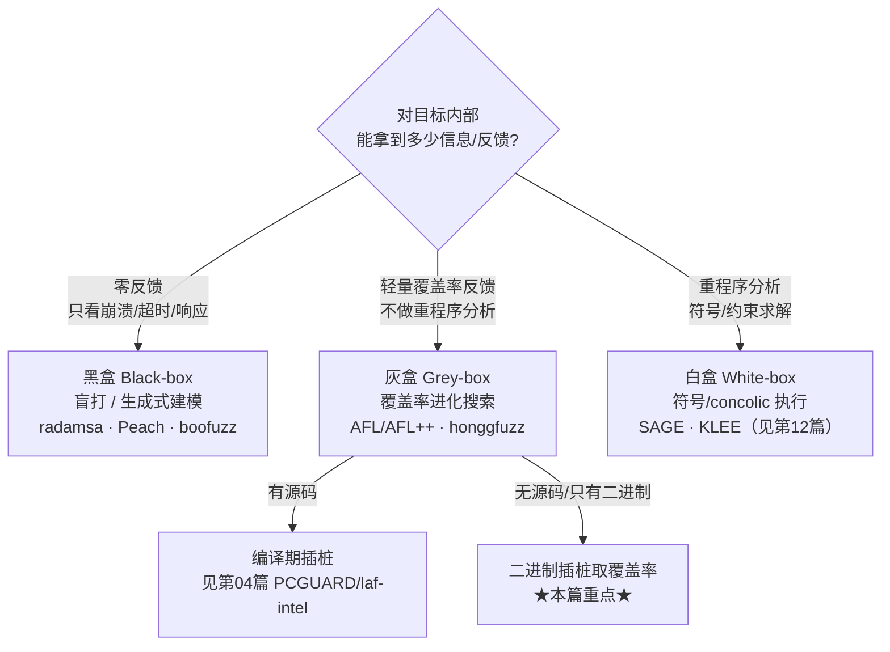
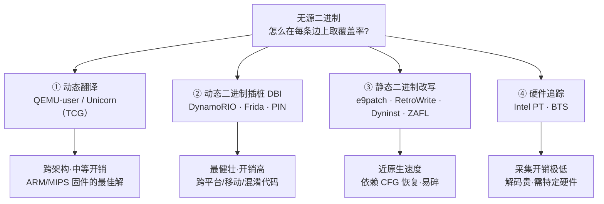
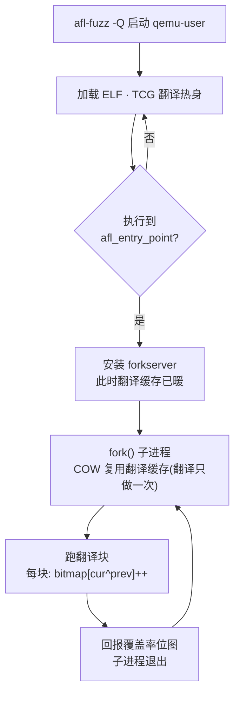
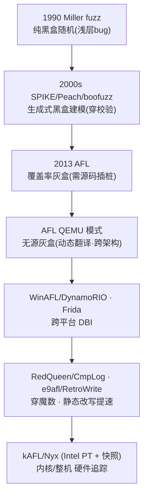

# Fuzzing与漏洞挖掘（13）· 黑盒与灰盒Fuzzing
> [!abstract] TL;DR
> - 黑/灰/白盒的分野不在"随机还是聪明"，而在**能拿到多少反馈信息**：黑盒零反馈盲打、灰盒用轻量覆盖率反馈做进化搜索、白盒用符号/约束求解主动构造路径；本篇聚焦"无源二进制"上的黑盒与灰盒。
> - 灰盒的威力（AFL 式进化）完全依赖覆盖率反馈；对没有源码的目标，核心工程问题被逼成一句话——**不重编译，怎么在每个基本块/边上插一段 `bitmap[cur^prev]++`**。
> - 取覆盖率有四条工程路线：动态翻译（QEMU-user / Unicorn 的 TCG）、动态二进制插桩 DBI（DynamoRIO / Frida / PIN）、静态二进制改写（e9patch / RetroWrite / Dyninst / ZAFL）、硬件追踪（Intel PT / BTS），在开销、健壮性、跨平台/跨架构上各有取舍。
> - QEMU 模式的精髓：复用 TCG 的翻译块边界注入覆盖率回报，并把 forkserver 装在入口点，让 ELF 加载与翻译缓存**只暖一次**，之后每个测试用例靠 `fork()` 的写时复制复用——这才把仿真开销摊得可用。
> - 跨架构是 QEMU/Unicorn 的杀手锏：可在 x86 主机上灰盒 fuzz ARM/MIPS 固件；持久模式补回速度，CmpLog/COMPCOV 补回"魔数/校验和"穿透力。
> - 典型陷阱：qemu-user 系统调用仿真缺口、PIE 基址导致覆盖率 ID 漂移、静态改写误判代码/数据、持久模式跨迭代状态泄漏、Intel PT 解码反倒成为吞吐瓶颈。

## 概述与定位

在整个 Fuzzing 谱系里，"黑盒 / 灰盒 / 白盒"是最古老也最容易被误解的一组标签。很多人以为区分标准是"用不用随机变异"或"聪不聪明"，这是错的。真正的分类轴只有一条：**Fuzzer 对被测目标内部到底能获取多少信息、拿到多少反馈**。

- **黑盒（Black-box）**：把目标当成一个完全不透明的盒子，只能从外部喂输入、从外部观察结果（崩溃、超时、返回码、响应报文）。它对"这条输入触发了哪些代码"一无所知。早期的 Miller `fuzz`（1990，把随机字节喂给 Unix 工具，25%~33% 直接崩）、`zzuf`、`radamsa`、以及基于数据模型的生成式 fuzzer（Peach、boofuzz、SPIKE、Defensics）都属此类。
- **灰盒（Grey-box）**：在盒子上开一条**窄缝**——用轻量插桩拿到覆盖率反馈（走过了哪些基本块/边），但**不做重量级程序分析**（不解约束、不建符号表达式）。AFL/AFL++、honggfuzz、libFuzzer 是灰盒的标杆。它凭"新覆盖率=有价值，保留进语料库"的进化式反馈，把盲目的随机搜索变成有导向的爬山。
- **白盒（White-box）**：对目标做重量级分析，用符号执行 / concolic 主动求解分支条件、构造能走到深处的输入（SAGE、KLEE），代价是分析昂贵、扩展性受限。这一块属于本系列 [[12.覆盖率之外：污点与concolic]]，本篇不展开。

本篇在系列中的定位非常明确：**当目标没有源码时，黑盒与灰盒各自怎么做、灰盒如何在纯二进制上把覆盖率反馈补回来**。这与前面几篇形成互补——[[02.覆盖率引导原理：AFL的核心思想]] 讲清了覆盖率反馈的原理，[[04.编译期插桩：SanitizerCoverage与PCGUARD]] 讲的是**有源码时**编译期怎么插桩，[[03.AFL++架构与使用]] 讲引擎本身。本篇的全部难点，都在"**无源**"这三个字上。

为什么"无源二进制 fuzzing"是刚需而非学术玩具？现实里大量高价值攻击面根本拿不到源码：闭源商业软件与第三方组件、只有二进制的 SDK/中间件、路由器/摄像头/PLC 的固件（往往还是 ARM/MIPS 架构）、Windows 内核驱动、被剥符号的恶意样本、DRM/授权模块。对这些目标，你不可能 `-fsanitize-coverage` 重编一遍——覆盖率必须"事后"从二进制里抠出来。这就是黑盒/灰盒二进制 fuzzing 的主战场。



## 原理与机制

先把黑盒和灰盒的"内核机制"各讲透，再进入无源灰盒的工程实现。

**黑盒的机制与它的天花板。** 黑盒 fuzzer 没有反馈闭环，它只有两种可能的"智能"来源：一是**输入模型**，二是**纯运气**。所谓 dumb fuzzing（哑变异），就是拿一个种子随机翻字节/切块/拼接，指望撞出崩溃——对浅层解析 bug 有效，但一旦目标在入口处有强校验（魔数、长度字段、CRC/校验和、握手协议），随机输入几乎永远过不了第一关，覆盖会卡死在"拒绝非法输入"的那几行。所谓 generational / model-based（生成式/建模），则是让人预先写出协议或文件格式的数据模型（Peach 的 Pit、boofuzz 的 block 定义），fuzzer 按模型生成"结构合法但字段异常"的样本——它能穿过校验、打到深层状态机，代价是**建模成本高、覆盖受限于人写的模型**（模型没写到的分支永远打不到）。黑盒的根本天花板在于：它**没有梯度**。它无法知道"这条输入比上一条多走了一步"，因此无法自我改进。这正是 1990 年以来黑盒长期停滞、直到 2013 年 AFL 出现才被颠覆的原因。

**灰盒的机制：一条反馈闭环。** 灰盒把黑盒缺的那条"梯度"补上了。它的循环是：变异输入 → 运行目标并**采集覆盖率** → 若出现**新的边/块**，说明这条输入探到了程序的新行为，把它存进语料库作为后续变异的父本 → 循环。覆盖率就是那个"是否进步"的信号。AFL 的经典实现（见第 02 篇）是在每个基本块插一段 `cur = <块ID>; shared_bitmap[cur ^ prev]++; prev = cur >> 1;`，用一张 64KB 的共享内存位图记录"边命中计数"。这套机制之所以强，是因为它把"探索程序状态空间"变成了一个**进化搜索**：能过魔数校验的那条输入哪怕只是运气，一旦命中就被保留下来，后代在它基础上继续变异，一步步啃深。

**无源灰盒的核心难题——插桩点从哪来。** 在有源码时，那段 `bitmap[cur^prev]++` 是编译器在每个基本块开头替你插进去的（PCGUARD / afl-cc）。没有源码，你就得回答一个尖锐的工程问题：**在一个已经编译好的、可能被剥了符号的二进制里，怎样在"每个基本块/每条边"的位置，可靠地插进一段覆盖率回报代码？** 这需要你至少能识别出基本块边界（哪里是块的开头）、并且能在不破坏原程序语义的前提下注入代码。围绕这个难题，业界演化出了四条互不相同的技术路线，构成了本篇最核心的知识——它们在**运行时开销、健壮性（会不会把程序改坏）、跨平台/跨架构能力**三个维度上各有强弱。



## 二进制插桩与覆盖率提取详解

这一节是全篇的骨架：把四条路线逐一拆到"读者不看代码也懂原理"的程度，并做横向对比。

### 动态翻译：QEMU 用户模式与 TCG

AFL 的 QEMU 模式（`afl-fuzz -Q`）是无源灰盒里名气最大、也最能说明"复用现成机制取巧"的一条路。它借用的是 **QEMU 用户态仿真（qemu-user）**：QEMU 本就要把 guest 指令翻译成 host 指令来跑，AFL 只需在翻译环节顺手插一脚。

原理分步展开：QEMU 的核心是 **TCG（Tiny Code Generator，微型代码生成器）**。它不逐条解释执行 guest 指令，而是以**基本块**为单位，把一段 guest 指令翻译成一段等价的 host 机器码，叫 **TB（Translation Block，翻译块）**，缓存进翻译缓冲区，下次再执行同一块就直接跑缓存的 host 码。注意：**一个 TB 大致对应 guest 的一个基本块**——这不正好是 AFL 想要的插桩粒度吗？于是 AFL 对 QEMU 打补丁（AFL++ 维护着一个叫 `qemuafl` 的 fork）：在翻译/执行每个块时，注入一段等价于 `afl_maybe_log(cur_loc)` 的逻辑，做的正是 `afl_area_ptr[cur_loc ^ prev_loc]++; prev_loc = cur_loc >> 1;`。`cur_loc` 由该块的 guest 地址哈希而来。这样，**不改一行目标代码，就在纯二进制上复刻了 AFL 的边覆盖**。

为什么这样设计（why）：因为"翻译"这个动作天然发生在**每个块边界**，正是插桩的理想锚点；而且 QEMU 做的是**全 CPU 仿真**，所以它能在 x86 主机上跑 ARM/MIPS/PPC 的 guest——这带来了别的路线都没有的**跨架构**能力，对 IoT/固件逆向是决定性的。

边界与陷阱：① `cur_loc` 是 guest 地址的哈希，PIE/ASLR 会让加载基址每次变化 → 覆盖率 ID 漂移、位图对不上；AFL 用 `afl_start_code/afl_end_code` 记录主模块地址区间、并处理加载偏移来稳定 ID（必要时配合 `AFL_QEMU_DEBUG_MAPS`）。② 默认**只插桩主可执行文件**，libc 等共享库不插（否则覆盖率被库噪声淹没、也更慢）；要连库一起插需 `AFL_INST_LIBS=1`。③ qemu-user 只仿真"一个 Linux 进程 + 系统调用转译"，某些 syscall 仿真不全会导致**假崩溃或假挂起**（目标其实没 bug，是仿真层的锅），这是 QEMU 模式最常见的误报来源。④ 位图是固定 64KB，块多了会**哈希碰撞**丢覆盖率（这一点与原生 AFL 同源，见第 02 篇）。

### forkserver 与持久模式：把仿真开销摊薄

QEMU 全仿真本身不便宜，早期 QEMU 模式比源码插桩慢 2~5 倍。让它可用的关键有两招。

**forkserver（分叉服务器）。** 朴素做法是每个测试用例都重启一次 qemu——但那要重新解析 ELF、重新热身翻译缓存，慢得离谱。AFL 的做法是：qemu 启动后一路跑到目标**入口点 `afl_entry_point`**（默认 ELF entry / `main`），此时 ELF 已加载、初始翻译已完成，就在这里安装 forkserver。之后每来一个测试用例，就从这个"暖好的"父进程 **`fork()` 一个子进程**去跑。子进程通过**写时复制（COW）** 直接继承父进程的翻译缓存，于是**翻译只发生一次**，后续每次执行都省掉了解析和翻译的固定成本。这是把仿真开销摊到可接受区间的核心技巧。

**持久模式（persistent mode）。** 更进一步，连 `fork()` 都想省。若目标里有一个"读一份输入、处理、返回"的纯函数，可以用 `AFL_QEMU_PERSISTENT_ADDR` 指定它的地址，让 qemu 在这个函数上**原地循环**成千上万次，每次循环喂一份新输入，而不是每次都 fork。相关旋钮：`AFL_QEMU_PERSISTENT_RET`（返回地址）、`AFL_QEMU_PERSISTENT_GPR=1`（每轮恢复通用寄存器）、`AFL_QEMU_PERSISTENT_CNT`（循环多少次再 fork 一次以清理状态）、`AFL_QEMU_PERSISTENT_HOOK`（用一个 `.so` 钩子在每轮开始重置状态/注入输入）。它能把吞吐提升一个数量级，但引入了**状态泄漏**这个经典陷阱：上一轮遗留的全局变量、堆、文件描述符会污染下一轮，导致崩溃不可复现或漏检——所以持久模式的每一轮都要小心把状态复位干净。持久 harness 的写法属于 [[08.Harness编写与目标裁剪]]。



### COMPCOV 与 CmpLog：穿透魔数与校验和

灰盒的老大难是"多字节比较"：`if (memcmp(input, "MAGIC", 5) == 0)` 或 `if (x == 0xDEADBEEF)` 在覆盖率上只是**一条边**——要么全中要么全不中，中间没有梯度，盲变异几乎不可能一次凑对 4~8 个字节。有源码时用 laf-intel/CmpLog（第 04 篇）解决；无源时，QEMU/Frida 模式提供了两种对应手段。

- **COMPCOV（`AFL_QEMU_COMPCOV` / `AFL_COMPCOV_LEVEL`）**：在翻译期钩住 `cmp` 类指令，把一个 N 字节比较**拆成逐字节的子比较**，每匹配对一个字节就登记一点新覆盖率。于是"凑对第 1 个字节"本身就成了可见的进步信号，fuzzer 能顺着这个梯度**一个字节一个字节地爬**出魔数。它是"制造梯度"的思路。
- **CmpLog（RedQueen 思路）**：直接记录比较指令**两个操作数的真实值**。若程序拿输入里的某段和常量 `0xDEADBEEF` 比，CmpLog 就把这对值记下来，fuzzer 在输入里**搜索"输入侧的值"并替换成"程序侧的常量"**——一步到位解开比较，不用盲猜。这叫 input-to-state（输入到状态）对应，源于 REDQUEEN（Aschermann 等，NDSS 2019），AFL++ 把它在源码/QEMU/Frida 各模式都实现了一遍。它是"直接求解"的思路，通常比 COMPCOV 更强。

两者都在攻击同一个敌人——**校验和/魔数/关键字**卡住覆盖率的问题，只是一个造信号、一个抄答案。

### 动态二进制插桩（DBI）：DynamoRIO / Frida / PIN

第二条路线是**同架构**的动态二进制插桩（Dynamic Binary Instrumentation）。与 QEMU 的"全 CPU 仿真跨架构"不同，DBI 假设 host 与 target 是同一 ISA（x86 上跑 x86），因此不必翻译指令集，只需在运行时**边执行边把代码搬进 code cache 并插桩**。代表：

- **DynamoRIO**：`WinAFL` 的默认引擎就是它（`drrun -c winafl.dll -coverage_module ... -- target`）。它按基本块把目标代码复制进 code cache 并注入覆盖率回报。
- **Frida（frida-gum 的 Stalker）**：AFL++ 的 Frida 模式（`-O`）与大量移动端 fuzzer 的基座。Stalker 做动态重编译、跟随执行流逐块变换、注入探针。最大卖点是**跨平台**：Linux/macOS/Windows/Android/iOS 通吃，是移动与 macOS 目标少数可行解。旋钮如 `AFL_FRIDA_INST_RANGES`（限定插桩地址范围）、`AFL_FRIDA_PERSISTENT_ADDR`（持久模式）。
- **Intel PIN**：更老的 `aflpin` 一类，开销偏高，如今在 fuzzing 场景多被 DynamoRIO/Frida/TinyInst 取代。
- **TinyInst（Ivan Fratric）**：专为 fuzzing 设计的轻量 DBI，只插桩你选定的模块，是 `Jackalope`（跨平台覆盖引导黑盒 fuzzer）的引擎。

为什么用 DBI（why）：它**不需要预先恢复 CFG**——代码是"执行到哪儿才发现到哪儿"，因此对**混淆代码、自修改代码、JIT、加壳**天然健壮，这是静态改写做不到的。代价是**每次运行都要付翻译/搬运成本**（虽有 code cache 缓存），实测开销常在数倍到十倍量级，通常比 QEMU 还是快些（省了跨 ISA 翻译），但明显慢于静态改写。陷阱：某些带反分析的目标（恶意样本、DRM）会**检测 DBI 存在**（检查 `/proc`、时序、异常 code cache 布局）从而改变行为，让 fuzzing 失真。

### 静态二进制改写：e9patch / RetroWrite / Dyninst / ZAFL

第三条路线最激进：**在运行前，直接把插桩焊进二进制文件本身**，改写一次、之后每次运行都是"原生速度"。它的诱惑是性能逼近源码插桩，它的诅咒是——**在剥符号的二进制上准确恢复控制流图（CFG）在一般情形下是不可判定的**：代码与数据难以区分、间接跳转/跳转表的目标算不准、变长指令可能重叠。谁把这个"soundness（不改坏程序）vs completeness（插全）"的权衡处理得好，谁就赢。

- **Dyninst（`afl-dyninst`）**：通用二进制改写库，能力强，但在高度优化/剥符号/复杂 C++ 二进制上**容易改错或失败**，鲁棒性看目标脸色。
- **RetroWrite（ASU，IEEE S&P 2020）**：面向 **PIE/PIC** 的 x86-64，通过把重定位"符号化"再重汇编来插桩，**近原生速度**，还能顺带插入二进制版 ASan（BinASan）。限制是**必须是位置无关代码**、x86-64。
- **ZAFL / Zipr**：Zipr 做整函数级重写，ZAFL 在其上加 AFL 插桩与可选变换（如 laf-intel 式拆分），号称**接近源码级性能**且不依赖启发式符号。
- **e9patch / e9afl（Gregory Duck）**：用"指令套用（instruction punning）"和跳板技巧，**不需要完整恢复 CFG、不搬动其他指令**就能打补丁，因而**即使在剥符号/手写汇编上也异常鲁棒**；`e9afl` 一条命令给二进制加上 AFL 插桩。代价是相对 RetroWrite 有一定运行时开销。

横向看：静态改写的收益是"付一次、跑千万次都快"，最适合**能被静态工具正确解析**的 Linux x86-64 用户态程序；一旦目标混淆/自修改/架构冷门，它就不如 DBI/QEMU 稳。工程上常见策略是**先用 e9afl 试**（鲁棒），跑不通再退到 QEMU 模式（万金油但慢），需要跨平台再上 Frida。

### 硬件辅助追踪：Intel PT 与 BTS

第四条路线把取覆盖率的活儿**下沉给 CPU 硬件**，几乎零插桩开销。**Intel PT（Processor Trace）** 是现代 Intel CPU 的一项特性：它把程序的控制流以高度压缩的**数据包**流写进一块内存环形缓冲（ToPA），采集开销通常只有个位数到十几个百分点。关键包类型：

```text
TNT  : 一串"条件分支 taken/not-taken"的比特（一字节最多塞 6 个分支结果）
TIP  : 间接分支/返回的目标地址（Target IP）
FUP  : 异步事件绑定的流内地址
PSB  : 同步点（Packet Stream Boundary，供解码器对齐）
PIP/MODE/CBR : CR3(进程) 切换、执行模式、频率等上下文
```

原理分步：TNT 只记"条件分支走没走"，TIP 只记间接目标——**光看包流还原不出完整路径**，解码器（`libipt`/`ptxed`）必须**结合被测二进制的静态反汇编**：从已知地址出发，遇条件分支就查 TNT 决定走哪支，遇间接分支就用 TIP 补目标，如此"沿着代码走一遍"重建出真实执行的**控制流边**，再写进覆盖率位图。

为什么用它（why）：**对目标零改动**——无须插桩、无须仿真，因此能覆盖别的路线难啃的场景：**JIT 生成的代码、闭源大程序、乃至操作系统内核**。`kAFL`（PT + KVM，OS 无关的内核 fuzzing）、`WinAFL` 的 Intel PT 模式、`honggfuzz`（支持 PT/BTS）、`PTrix`/`ptfuzzer` 都走这条。陷阱与代价：① **解码很贵**——重建边的 CPU 成本有时比省下的插桩成本还高，反成瓶颈；有的方案（PTrix）干脆不做完整重建，直接对原始包流做哈希当反馈信号以省解码。② 需要**特定硬件**（Intel PT，AMD 无同款；BTS 更老更慢，记录所有分支）。③ 解码需要**精确的二进制镜像映射**，地址对不上就 desync。④ 缓冲区可能溢出丢包。`Nyx`（Schumilo 等，USENIX Security 2021）把 PT 与 **KVM 快照**结合：用脏页跟踪做极快的状态复位、用 PT 取覆盖率，实现整机（内核/hypervisor/复杂用户态）的快照 fuzzing，是这条路线目前的集大成者。

### Unicorn 模式与快照：只跑一段代码

有时你连"把整个程序跑起来"都做不到——比如一段从固件里抠出来的 ARM 解析函数，它依赖的外设、OS、内存布局都不在。**Unicorn 引擎**（QEMU TCG 剥掉设备与 OS、只留纯 CPU 仿真）配合 AFL++ 的 **Unicorn 模式**正是为此：你在 harness 里**手工搭好上下文**——映射内存、写入寄存器初值、把测试输入放到目标缓冲区、注册钩子处理未知内存访问/外设，然后让 Unicorn 只**仿真那一小段代码**，同时把覆盖率位图接上。它牺牲了"自动跑整个程序"的便利，换来了**对任意 blob / MCU 固件 / 孤立算法**的可 fuzz 性，是嵌入式与逆向场景的利器（详见 [[48.动态插桩与模拟执行引擎/12.插桩驱动的分析：覆盖率与污点与trace]]）。

### 四条路线的横向权衡

一句话记忆：**QEMU/Unicorn 跨架构但慢、DBI 最健壮但开销高、静态改写最快但易碎、Intel PT 采集最省但解码贵且挑硬件**。真实工程里往往组合使用：Linux x86-64 优先静态改写（e9afl）求速度，通用/跨架构退 QEMU，跨平台/移动/混淆上 Frida/DBI，内核/JIT/整机上 Intel PT + 快照。



## 工具视角与实战

把上面的原理落到命令与选型上。以下命令仅示意**自有/授权目标**上的用法。

**AFL++ QEMU 模式（无源 Linux 二进制的默认解）。**

```bash
# 构建 qemu 模式支持（AFL++ 源码树内）
cd AFL++/qemu_mode && ./build_qemu_support.sh

# -Q 开启 QEMU 模式；@@ 表示输入文件名占位
afl-fuzz -Q -i seeds/ -o out/ -- ./closed_source_bin @@

# 穿透魔数/校验：叠加 CmpLog(-c) 或 COMPCOV
AFL_COMPCOV_LEVEL=2 afl-fuzz -Q -c ./closed_source_bin \
    -i seeds/ -o out/ -- ./closed_source_bin @@

# 连共享库一起插桩（默认只插主模块）
AFL_INST_LIBS=1 afl-fuzz -Q -i seeds/ -o out/ -- ./target @@

# 持久模式：把某函数原地循环，吞吐可提升一个数量级
AFL_QEMU_PERSISTENT_ADDR=0x555555555189 \
AFL_QEMU_PERSISTENT_GPR=1 \
afl-fuzz -Q -i seeds/ -o out/ -- ./target @@
```

**AFL++ Frida 模式（跨平台/无法编译 qemuafl 时）。** 把 `-Q` 换成 `-O` 即启用 Frida 后端，其余思路一致（`AFL_FRIDA_INST_RANGES` 限定插桩范围以过滤库噪声、`AFL_FRIDA_PERSISTENT_ADDR` 走持久模式）。macOS / Android 目标基本靠它。

**WinAFL（Windows 闭源二进制）。** Windows 没有 `fork()`，所以 WinAFL 走**内存内持久循环**：指定要循环的目标函数偏移与调用约定，反复喂样本。两套引擎：DynamoRIO 与 Intel PT。

```text
# DynamoRIO 引擎：反复调用 target_offset 处的函数 5000 次
drrun.exe -c winafl.dll -debug ^
  -target_module target.exe -target_offset 0x1420 -fuzz_iterations 5000 -nargs 2 ^
  -coverage_module target.exe -- target.exe @@
```

选型直觉：**Linux 用户态**优先 `e9afl`（静态改写、近原生速度）跑得动就用，跑不动退 AFL++ `-Q`；**需要跨架构/固件**用 QEMU（用户态）或 Unicorn（代码片段）；**Windows** 用 WinAFL 或 Jackalope/TinyInst；**macOS/移动/混淆**用 Frida/TinyInst；**内核/JIT/整机**用 Intel PT 系（kAFL/Nyx）。语料与字典（[[09.语料库与字典与最小化]]）、崩溃去重（[[16.崩溃分类与去重与可利用性]]）与源码情形通用，此处不重复。

**黑盒工具一瞥。** 当目标连插桩都做不到（远程网络服务、硬件、只能观测崩不崩），退回黑盒：`radamsa`（通用变异，`radamsa sample > out`）、`boofuzz`（网络协议生成式，写 block/request 模型）、`Peach`/`Defensics`（数据模型驱动）。实战常**黑灰混用**：生成式黑盒负责穿协议握手/校验、到达深层状态，再对其后的解析逻辑上覆盖引导的灰盒。逆向视角看，这一步的价值在于**先用 IDA/Ghidra 把校验、状态机、解析入口摸清**，据此决定"该建模（黑盒）还是该插桩持久化（灰盒）、持久点选哪个函数"——逆向与 fuzzing 在此闭环。

## 安全性与正确使用

黑盒/灰盒二进制 fuzzing 的能力边界，天然指向"别人的闭源软件、他人的固件、生产系统"，因此比源码 fuzzing 更需要先划清红线。

> [!caution] 合规边界（务必先读）
> - 本篇所有技术**仅限用于你**自有的、或已获得**明确书面授权**的目标，以及 CTF 靶场、厂商漏洞赏金明确许可的范围、隔离的安全研究环境。一切以**防御与教育**为目的。
> - 对**第三方闭源/商业软件、他人设备与固件、线上生产系统**进行插桩、逆向、fuzzing，可能同时触碰**计算机犯罪法与软件许可协议（EULA 常禁止逆向）**；即便"只是研究"，未经授权也可能违法违约。授权范围、测试时窗、数据边界都要落在纸面上。
> - 本篇讲透的是**原理与方法论**，**不提供**针对任何真实生产系统或他人系统的**武器化配方**，也**不为绕过商业授权/DRM 提供**可直接照搬的攻击步骤。把校验讲清是为了理解 fuzzer 为何卡住，不是教你去打某个具体目标。
> - 发现崩溃后走**负责任披露（coordinated disclosure）**：崩溃 → 分类去重（第 16 篇）→ 评估可利用性 → 通过厂商/CNA/CERT 通道上报，给予合理修复窗口，不公开可直接利用的 PoC。

除合规外，有几条"正确使用"的技术纪律直接影响结果可信度：① **区分真 bug 与仿真/插桩假象**——QEMU 模式的崩溃要在**原生环境复现**后才算数，syscall 仿真缺口造成的假崩溃很常见。② **持久模式必须验证状态复位**，否则崩溃不可复现、或把上一轮的脏状态误报成新 bug。③ **覆盖率位图碰撞**会让"没有新覆盖"变成假象，深目标要留意 `MAP_SIZE`。④ 对**带反 DBI/反调试**的目标，先确认插桩没有改变其行为再下结论。⑤ fuzzing 会真的**触发副作用**（写文件、发网络包、操作外设），务必在**隔离沙箱**里跑，别让"授权的测试"外溢成对真实系统的影响。

## 小结

黑盒与灰盒的本质区别是**反馈信息量**，不是"聪明与否"：黑盒零反馈、靠模型或运气，天花板在于没有梯度；灰盒用轻量覆盖率反馈把搜索变成进化，威力全系于此。本篇的真正难点是"**无源**"——没有源码时，灰盒赖以为生的覆盖率必须从二进制里抠出来，于是分裂出四条工程路线：**动态翻译（QEMU/Unicorn，跨架构但慢）、动态插桩 DBI（DynamoRIO/Frida，健壮但开销高）、静态改写（e9patch/RetroWrite，最快但依赖 CFG 恢复而易碎）、硬件追踪（Intel PT，采集省但解码贵、挑硬件）**。QEMU 模式靠复用 TCG 翻译块边界取覆盖、靠 forkserver 与持久模式摊薄仿真开销、靠 COMPCOV/CmpLog 穿透魔数，是最通用的入门解；Windows 走 WinAFL、跨平台走 Frida、内核/整机走 kAFL/Nyx。选型没有银弹，看目标的架构、平台、是否被混淆、能否静态解析而定。记住三条纪律：崩溃回原生复现、持久模式清状态、一切在授权与沙箱内进行。下一篇转入内核领域，看 syzkaller 如何把灰盒思想搬进系统调用接口。

## 相关阅读

- 覆盖率反馈原理（本篇灰盒的地基）：[[02.覆盖率引导原理：AFL的核心思想]]
- 有源码时的插桩对照：[[04.编译期插桩：SanitizerCoverage与PCGUARD]]、引擎本体：[[03.AFL++架构与使用]]
- 穿魔数的另一半——白盒方向：[[12.覆盖率之外：污点与concolic]]
- 持久 harness 与目标裁剪：[[08.Harness编写与目标裁剪]]；语料/字典：[[09.语料库与字典与最小化]]；崩溃去重与可利用性：[[16.崩溃分类与去重与可利用性]]
- 引擎依赖（插桩/仿真取覆盖率与 trace）：[[48.动态插桩与模拟执行引擎/12.插桩驱动的分析：覆盖率与污点与trace]]
- 漏洞下游（崩溃如何转为利用）：[[33.二进制漏洞与利用基础/01.内存破坏漏洞全景与利用链模型]]
- 内核方向：[[14.内核与驱动Fuzzing：syzkaller]]、[[52.Linux内核机制与内核利用/18.内核Fuzzing与syzkaller]]、[[38.Windows内核与驱动逆向/30.内核Fuzzing]]
- 浏览器/JS 引擎：[[15.浏览器与JS引擎Fuzzing]]、[[54.浏览器与JS引擎漏洞/00.浏览器与JS引擎漏洞总览]]
- 官方与论文：AFL++ 文档（QEMU mode / Frida mode / CmpLog）、Unicorn Engine、DynamoRIO 与 Frida-gum Stalker、e9patch（`An Extensible, Trap-Based Binary Rewriter`）、RetroWrite（IEEE S&P 2020）、REDQUEEN（NDSS 2019）、Nyx（USENIX Security 2021）、Intel SDM Vol.3 "Intel Processor Trace" 章节、WinAFL（Ivan Fratric）

[[00.Fuzzing与漏洞挖掘总览|⬆ 系列总览]] | [[12.覆盖率之外：污点与concolic|← 上一章]] | [[14.内核与驱动Fuzzing：syzkaller|→ 下一章]]
