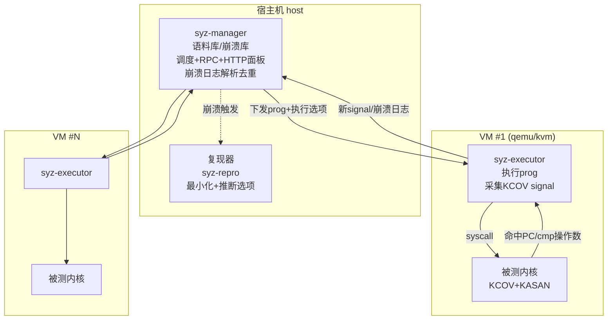
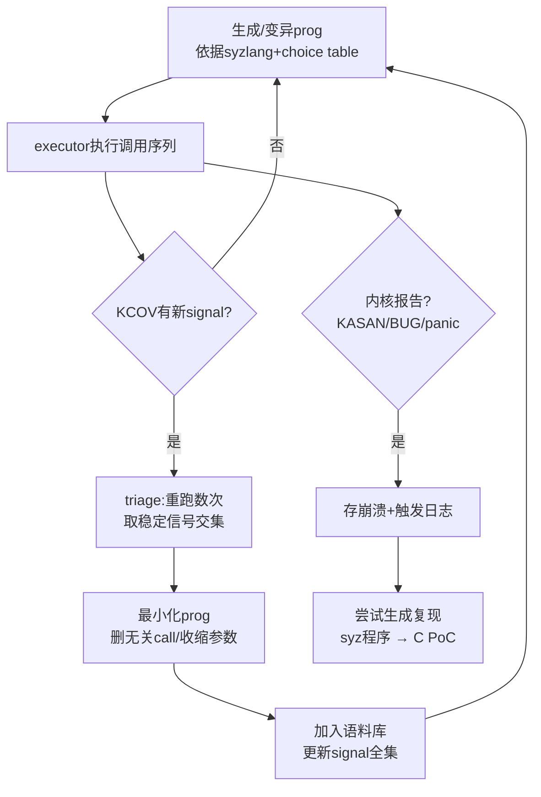
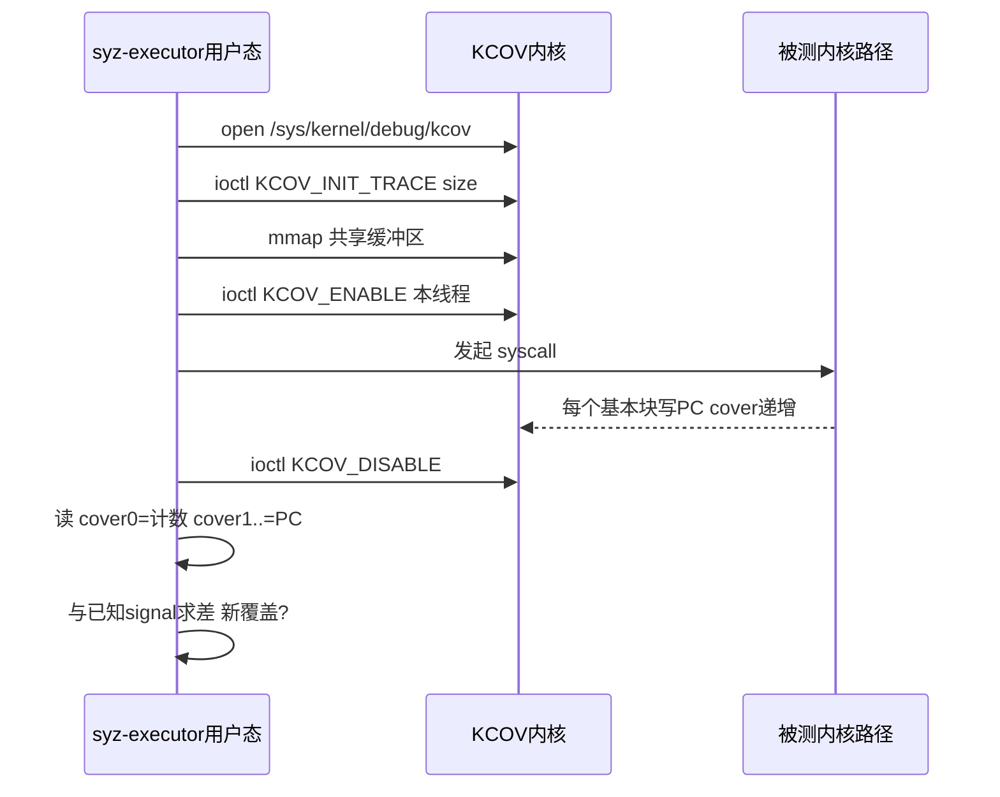

# Fuzzing与漏洞挖掘（14）· 内核与驱动Fuzzing：syzkaller
> [!abstract] TL;DR
> - syzkaller 是覆盖率引导的**内核系统调用 fuzzer**：用声明式语言 syzlang 描述每个 syscall 的参数类型与资源依赖，据此生成"有类型、有前后依赖"的调用序列，从根上解决"内核入口太结构化、随机字节打不进去"的问题。
> - 覆盖率来自内核编译期插桩 **KCOV**（`-fsanitize-coverage`），把每个任务命中的基本块 PC 经 `mmap` 暴露给用户态；`KCOV_TRACE_CMP` 再吐出比较操作数做 comparison-hint，等价于内核版的 RedQueen/CMPLOG。
> - 崩溃探测靠 **KASAN/KMSAN/KCSAN/LOCKDEP** 一族 sanitizer 把静默的内存破坏与并发缺陷变成可解析的 dmesg 报告，syz-manager 解析控制台输出做去重与归类。
> - 架构是"host 上的 syz-manager 管一群 VM，VM 里 syz-executor 执行程序"：内核崩溃只杀 VM、重启即恢复，天然满足内核 fuzzing 的隔离与可复现需求。
> - 复现是内核 fuzzing 的**头等难题**（竞态、状态依赖、非确定性）：syzkaller 从崩溃日志回放、最小化、推断执行选项（threaded/collide/repeat/sandbox），再用 syz-prog2c 落地成独立 C PoC。
> - syzbot 把这套 7×24 跑在 mainline/linux-next 上，自动报障、二分、验证补丁，累计推动数千内核 bug 修复——这是本篇与 [[52.Linux内核机制与内核利用/18.内核Fuzzing与syzkaller]] 的工程化落点。

## 概述与定位

内核是整台机器信任的根：它跑在最高特权级、掌管所有进程的内存与资源。一旦被攻破，攻击者拿到的往往是从普通用户到 root、从容器到宿主、从沙箱到内核的完整提权。而内核最大、最脏的攻击面就是**系统调用（syscall）**及其背后的驱动、文件系统、网络协议栈、`ioctl`、`netlink`、`io_uring` 等子系统——它们直接接收来自不可信用户态的输入。给这片攻击面做 fuzzing，正是本篇主角 **syzkaller**（Google 的 Dmitry Vyukov 自 2015 年前后主导）要解决的问题。

为什么不能像 [[02.覆盖率引导原理：AFL的核心思想|AFL]] 或 [[05.libFuzzer与持久模式|libFuzzer]] 那样，把内核当成吃 stdin/文件的黑盒去打？三个根本差异决定了内核 fuzzing 必须另起炉灶：

1. **入口不是字节流，而是强类型的 syscall ABI。** `ioctl(fd, cmd, arg)` 里 `fd` 必须是先前 `open` 出来的合法句柄，`cmd` 是某驱动约定的幻数，`arg` 常是指向复杂结构体（内含指针、长度、嵌套联合）的指针。随机字节几乎 100% 在最外层参数校验就被 `-EINVAL` 弹回，覆盖率卡在门口。要打进去，fuzzer 必须"懂"接口的形状。
2. **状态高度依赖、调用之间有因果。** 内核 bug 常需要"先 A 后 B、A 的返回值喂给 B"这类序列（先 `socket` 再 `setsockopt` 再 `sendmsg`）。单发变异一个 buffer 打不出这类 bug，fuzzer 必须生成**有依赖关系的调用序列**。
3. **崩溃会带走整台机器，且大量 bug 是静默的。** 用户态进程崩了有 `SIGSEGV`；内核踩了野指针可能只是悄悄损坏别处内存，几百次调用后才在无关路径炸掉——不可复现、无法归因。

syzkaller 对这三点的回答构成它的三大支柱，也是本篇要逐层拆开的核心：**用 syzlang 声明式描述 syscall 接口**（解决"懂形状"与"建依赖"）、**用 KCOV 编译期插桩拿覆盖率**（解决"看得见进展"）、**用 KASAN 一族 sanitizer + VM 隔离**（解决"静默 bug 变可见、崩溃可恢复"）。它在生态里的定位是：**面向开源内核（以 Linux 为主）的、覆盖率引导的、接口感知（interface-aware）的系统调用 fuzzer**，并通过 syzbot 变成持续挖洞的流水线。相对地，闭源内核/驱动（如 Windows）拿不到 KCOV 源码插桩，走的是硬件 trace 或快照系另一条路，本篇末尾会横向对比，也顺带收编 [[38.Windows内核与驱动逆向/30.内核Fuzzing]] 这个孤点。

## 原理与机制

### 整体架构：host 管调度、VM 里执行

syzkaller 是分层的分布式系统，核心三件套：

- **syz-manager**：常驻宿主机的大脑。它启动并监护一批 VM，维护**语料库（corpus）**与**崩溃库**，做调度、RPC、崩溃日志解析与去重，并提供 HTTP 面板看覆盖率与统计。它是唯一持久化状态的进程——即便所有 VM 都崩了，重启后语料库仍在。
- **syz-executor**：跑在 VM 里的执行器，负责把一个 **prog**（一段带具体参数的调用序列）真正下到内核里执行，并采集 KCOV 覆盖率回传。每个 VM 里可并发多个 executor 进程（`procs` 配置）。
- **fuzzing 逻辑**：早期版本由 VM 内的 `syz-fuzzer` 进程做输入生成/变异/最小化决策；较新版本把这套"生成—变异—triage"逻辑上移到了 host 的 syz-manager（`pkg/fuzzer`），VM 里只留轻量 executor。无论哪种切分，**决策与执行分离、执行放在可弃的 VM 里**这条主线不变。

为什么非要 VM？因为内核 bug 会 panic 整机。把执行放进 qemu/kvm（或 GCE、真机 adb、隔离机、gVisor 进程）里，一次崩溃只损失一个 VM，syz-manager 重启它即可继续；同时 VM 提供了干净、可重置的初始状态，是"可复现"的地基。



### prog：内核 fuzzing 的"测试用例"

syzkaller 的语料不是二进制 blob，而是一段**有类型的调用序列**，序列化后长这样：

```
r0 = openat(0xffffffffffffff9c, &(0x7f0000000000)='./file0\x00', 0x42, 0x1a4)
write(r0, &(0x7f0000000100)="deadbeef", 0x8)
r1 = dup(r0)
ioctl$FS_IOC_GETFLAGS(r1, 0x80086601, &(0x7f0000000200))
close(r0)
```

几处要点：`r0`/`r1` 是**资源（resource）**——把前一个调用的返回值绑成变量、喂给后续调用的参数，这正是"调用间依赖"的载体；`&(0x7f0000000000)` 是 executor 进程虚拟地址空间里的固定地址（syzkaller 把 `0x7f0000000000` 起的一段作为可预测的数据区，方便复现与地址计算）；`ioctl$FS_IOC_GETFLAGS` 里的 `$` 后缀是**同一 syscall 的具体变体**，每个变体绑定一组特定的 `cmd` 与 `arg` 结构。这种表示既机器可变异，又能一比一转成 C 代码复现（见后文 syz-prog2c）。

### 覆盖率反馈：KCOV 提供 signal，triage 去抖

syzkaller 沿用覆盖率引导思想（见 [[02.覆盖率引导原理：AFL的核心思想|AFL 核心思想]]、[[48.动态插桩与模拟执行引擎/12.插桩驱动的分析：覆盖率与污点与trace]]），但覆盖率来源是内核里的 **KCOV**：编译内核时打开 `CONFIG_KCOV`，编译器用 `-fsanitize-coverage=trace-pc` 在每个基本块首插一句 `__sanitizer_cov_trace_pc()`，运行时把当前 PC 写进**当前任务（per-task）**绑定的缓冲区。executor 执行一个调用前 `KCOV_ENABLE` 本线程、执行后 `KCOV_DISABLE`，读出这次命中的 PC 集合，就精确知道"这个 prog 走到了内核哪些基本块"。

syzkaller 把命中的 PC 集合当作**覆盖信号 signal**。若某个 prog 产生了**从未见过的新 signal**，它就是语料库候选。与 AFL 的差异值得注意：AFL 用 `(prev,cur)` 边哈希 + 命中次数分桶（bucketing），对循环次数敏感；syzkaller 默认以**基本块 PC 集合**为信号、不做命中次数分桶——这是"敏感度换确定性与规模"的工程取舍：内核里同一路径在不同上下文命中次数天然抖动，若也分桶会产生海量假新覆盖，拖垮语料库。为进一步压制抖动，新覆盖会进入 **triage** 流程：把 prog 重跑数次，取稳定命中的信号交集（deflake），再做最小化，最后才入库。

`KCOV_TRACE_CMP`（`CONFIG_KCOV_ENABLE_COMPARISONS`）是第二种模式：编译器额外插 `-fsanitize-coverage=trace-cmp`，运行时吐出每次比较的**两个操作数与 PC**。syzkaller 拿这些操作数做 **comparison hints**：当某比较总是差一个"魔数"通不过，就把该魔数直接替换进参数里去撞过校验——这就是内核版的 RedQueen/CMPLOG（对照 [[12.覆盖率之外：污点与concolic|污点与 concolic]]，属于"轻量绕过魔数比较"的同类技术，代价远低于符号执行）。



### 生成与变异：choice table 建模"哪些调用常一起出现"

纯随机拼调用序列效率极低。syzkaller 维护一张**choice table（选择表 / 优先级表）**：综合"描述的静态分析"（哪些调用产生/消费兼容的资源类型，如产 `fd` 的调用后面大概率跟消费 `fd` 的调用）与"语料库统计"（历史上哪些调用常同框出现），给"当前 prog 后面该插哪个调用"打分。变异算子包括：插入一个新调用、按类型变异某参数、与语料库里另一个 prog 拼接（splice）、把不需要结构的字段压成 `ANYBLOB`、删调用等。这套"资源驱动的关系建模"是 syzkaller 高效的关键之一；后续研究（如 Healer 的动态关系学习、MoonShine 从真实 strace 蒸馏种子）都在强化这一环。

### 执行模型：threaded 与并发，为竞态而生

内核里最毒、最难挖的是**竞态（race）**类 bug（double-free、UAF、TOCTOU）。syzkaller 的 executor 支持几种执行选项：

- **threaded**：把每个调用放进独立线程，避免一个阻塞调用（如 `read` 等数据）卡死整段 prog，也让"发起后立即做别的"成为可能。
- **collide / 并发**：成对并发地跑相邻调用，主动制造两个 CPU 同时进内核的时序，去撞并发缺陷。
- **repeat / procs**：重复执行、多进程并发，放大时序窗口与状态积累。
- **sandbox**：`none/setuid/namespace/android` 四档，决定 executor 以何种权限/隔离跑测试——沙箱越弱能碰的攻击面越大，但也越容易误伤 VM 自身。
- **fault injection**：配合 `CONFIG_FAULT_INJECTION/failslab`，主动让某次内核内存分配失败，逼程序走进平时难覆盖的错误处理/回滚路径（错误路径正是清理逻辑写错、二次释放的高发区）。

### 崩溃探测与去重：让静默 bug 现形

内核不会主动告诉你"我刚踩了野指针"。syzkaller 依赖**运行时检测器**把静默破坏变成显式报告，再解析内核控制台（dmesg）：**KASAN** 抓越界/UAF、**KMSAN** 抓使用未初始化内存、**KCSAN** 抓数据竞争、**UBSAN** 抓未定义行为、**KFENCE** 低开销采样抓堆越界、**LOCKDEP** 抓锁序死锁、外加 `WARN/BUG/panic/hung task/RCU stall/kmemleak`。`pkg/report` 用一堆正则识别这些报告、提取崩溃标题（crash title）做**去重**——同一标题归为一个 bug。这一步与 [[07.Sanitizers：ASan与UBSan与MSan|用户态 Sanitizers]] 同源：sanitizer 是 fuzzer 的"眼睛"，没有它，覆盖率再高也只是"跑过了"而看不见"跑坏了"。

## 系统调用描述语言与覆盖率采集详解

这一段把 syzkaller 的两块技术底座——**syzlang 描述**与 **KCOV 采集**——拆到实现层面。理解它们，才算真懂 syzkaller 为什么强、边界在哪。

### syzlang：声明式描述 syscall 的"形状"

syzkaller 用一套 DSL（俗称 syzlang）描述每个 syscall 的签名与语义，源码在 `sys/linux/*.txt`（其他 OS 在 `sys/<os>/`）。最小例子：

```
resource fd[int32]
resource sock[fd]

open(file ptr[in, string], flags flags[open_flags], mode flags[open_mode]) fd
read(fd fd, buf buffer[out], count len[buf]) len[buf]
write(fd fd, buf buffer[in], count len[buf]) len[buf]
close(fd fd)

socket(domain flags[socket_domain], type flags[socket_type], proto int32) sock
open_flags = O_RDONLY, O_WRONLY, O_RDWR, O_CREAT, O_APPEND, O_NONBLOCK
```

要点逐条拆开，每一条都对应一个"为什么这样设计"：

- **resource（资源）** 是 syzlang 的灵魂。`resource fd[int32]` 声明一种"32 位整数、但语义上是文件描述符"的类型。`open` 的返回类型是 `fd`（生产者），`read/write/close` 的第一个参数是 `fd`（消费者）。fuzzer 据此知道：要调 `read`，得先有个调用产出 `fd`。资源还能**继承**（`resource sock[fd]`：套接字也是 fd 的一种，可用在任何要 fd 的地方）。这就是"调用间依赖"被显式建模的地方——没有它，fuzzer 只能对 `fd` 参数瞎填整数，永远进不了门。
- **flags** 把一个参数的取值域限定成一组内核常量。fuzzer 变异时优先在这些"有意义的值"及其位组合里挑，而不是在 2^32 空间里大海捞针。
- **len / bytesize / bitsize** 表达"这个字段是另一个字段的长度"。`read(..., count len[buf])` 让 fuzzer 自动把 `count` 填成 `buf` 的真实长度，天然满足"长度与缓冲区一致"这类内核到处都在查的不变量。
- **ptr[dir, type]、buffer[dir]、array、string、const、struct、union**：完整的类型系统。`dir` 是 `in/out/inout` 方向，决定 executor 该把该缓冲区当输入填充还是当输出读取（也影响复现时是否需要拷回）。`union` 表达 `ioctl` 里"同一 `arg` 随 `cmd` 不同而是不同结构"。**type template** 允许参数化复用结构，减少重复描述。
- **变体（`$` 后缀）**：`ioctl$FS_IOC_GETFLAGS` 把 `ioctl` 这个"万能入口"拆成一个个具体、强类型的子接口，每个绑定固定 `cmd` 与对应 `arg` 结构。驱动 fuzzing 的绝大部分工作量，就在于把某驱动的 `ioctl`/`netlink` 命令一条条描述成这样的变体。

为什么非得声明式描述、不能像用户态那样喂随机字节？因为 syscall 入口是**极度结构化的强类型 ABI**，前几层校验会把绝大多数随机输入挡在外面；描述把 fuzzer 的搜索空间从"任意字节"压缩到"类型合法、依赖成立的调用序列"，让宝贵的算力花在真正的逻辑深处。代价是显式的：**syzkaller 只能有效 fuzz 你描述过的接口**——没描述的 syscall/`ioctl`/字段就是覆盖率盲区。这是 syzkaller 最核心的局限，也是所有内核 fuzzing 研究围绕的中心矛盾。

### 描述如何变成可执行代码：syz-extract / syz-sysgen / syz-declextract

描述文件里写的是 `O_CREAT` 这样的符号常量，但它们的**数值随架构/内核版本而变**。工具链两步走：

- **syz-extract**：针对目标内核头文件、按架构（amd64/arm64/…）把符号常量抽成真实数值，落到 `*.const` 旁文件。
- **syz-sysgen**：把 `.txt` 描述 + `.const` 常量编译成 Go 代码，构成 syzkaller 内部的类型元数据，供生成/变异/序列化使用。

手写描述是重体力活，也是覆盖率天花板的来源。较新的 **syz-declextract** 用 Clang 静态分析内核源码，自动从 `SYSCALL_DEFINE`、`ioctl` 处理函数、`netlink` policy 等处**抽取描述初稿**，大幅降低"描述覆盖不全"这一老大难。这条演进线（手写 → 半自动抽取）值得在逆向视角上留意：它本质是把"接口逆向"从人工前移到编译期程序分析。

### pseudo-syscall：声明式表达不了的，就用 C 补

有些设置无法用纯声明式描述表达：需要现场算校验和、需要多步初始化、需要拼一个合法的文件系统镜像或 USB 设备。syzkaller 为此提供**伪系统调用（pseudo-syscall）**——在 executor 里用 C 实现、以 `syz_` 前缀暴露给描述层，例如 `syz_open_dev`（打开某类设备节点）、`syz_mount_image`（用给定镜像挂载某文件系统，`fs` fuzzing 主力）、`syz_usb_connect`（模拟插入一个 USB 设备）、`syz_kvm_setup_cpu`（初始化 KVM vCPU 去 fuzz 虚拟化路径）、`syz_emit_ethernet`（注入以太网帧）。它们是"声明式 + 命令式"的缝合处：把复杂但固定的准备逻辑封进 C，把可变的参数继续交给描述层去 fuzz。

### KCOV 采集的实现细节

KCOV 是 per-task 覆盖率通道，用法固定：

```c
fd = open("/sys/kernel/debug/kcov", O_RDWR);
ioctl(fd, KCOV_INIT_TRACE, COVER_SIZE);          // 约定缓冲区容量
cover = mmap(NULL, COVER_SIZE*8, PROT_READ|PROT_WRITE, MAP_SHARED, fd, 0);
ioctl(fd, KCOV_ENABLE, KCOV_TRACE_PC);           // 对"本线程"开始记录
__atomic_store_n(&cover[0], 0, __ATOMIC_RELAXED);// 清零位置计数
syscall(__NR_xxx, ...);                           // 被测调用
n = __atomic_load_n(&cover[0], __ATOMIC_RELAXED);// cover[0]=命中数
// cover[1..n] 依次是命中的 PC
ioctl(fd, KCOV_DISABLE, 0);
```

几个设计要点：`cover[0]` 是位置计数器、`cover[1..]` 是 PC 序列，内核插桩代码原子递增计数并写 PC，用户态读差量即可；**记录粒度是 per-task 且线程绑定**，这样多 executor 并发时各线程的覆盖率互不串扰——这是 syzkaller 能多进程并发跑的前提。`KCOV_ENABLE` 的模式参数区分 `KCOV_TRACE_PC`（基本块覆盖）与 `KCOV_TRACE_CMP`（比较操作数，缓冲区里每条记录变成"类型/操作数1/操作数2/PC"四元组）。



**remote KCOV** 解决一个棘手问题：很多内核代码不跑在发起 syscall 的那个任务上下文里——USB 探测在后台线程、网络收包在软中断、很多工作在 workqueue/kthread 里异步执行。普通 per-task KCOV 抓不到这些。于是引入 `KCOV_REMOTE_ENABLE` + `struct kcov_remote_arg`：内核在这些后台上下文里用 `kcov_remote_start()/stop()` 打桩，把覆盖率归并回发起测试的 executor。USB fuzzing（`syz_usb_connect`）与很多子系统 fuzzing 全靠它，否则背景路径全是覆盖率黑洞。

### 覆盖率与 sanitizer 的协同边界

KCOV 只告诉你"走到了哪"，KASAN 才告诉你"走坏了没"。二者独立但互补：`CONFIG_KASAN` 用影子内存标记每字节可用性，在每次内存访问前插入检查，把越界/UAF 变成带调用栈的报告。KMSAN（查未初始化）与 KCSAN（查数据竞争）都依赖 Clang。开启这些检测会显著拖慢内核（KASAN 常见 1.5~3 倍、KMSAN 更重），所以 fuzzing 内核与生产内核是两套 `.config`。理解这层协同，才不会问出"为什么覆盖率涨了却不报 bug"这类问题——覆盖是必要条件，检测器才是充分条件。

## 工具视角与实战

### 构建"可 fuzz 的内核"：.config 是第一道坎

给内核开对开关，syzkaller 才有抓手。关键项（按用途分组）：

```
# 覆盖率
CONFIG_KCOV=y
CONFIG_KCOV_ENABLE_COMPARISONS=y   # 比较操作数,做 comparison hint
CONFIG_DEBUG_FS=y                  # kcov 的 debugfs 入口
CONFIG_KALLSYMS=y
CONFIG_KALLSYMS_ALL=y
CONFIG_DEBUG_INFO_DWARF4=y         # 覆盖率反解到源码行/PC 归属
# 检测器
CONFIG_KASAN=y
CONFIG_KASAN_INLINE=y              # 内联插桩,比 outline 快
# 接口面(按目标裁剪)
CONFIG_CONFIGFS_FS=y
CONFIG_SECURITYFS=y
CONFIG_USB_RAW_GADGET=y            # USB fuzzing
CONFIG_FAULT_INJECTION=y
CONFIG_FAILSLAB=y
```

### syz-manager 配置与起跑

syzkaller 用一份 JSON 描述"打什么、怎么起 VM"：

```json
{
  "target": "linux/amd64",
  "http": "127.0.0.1:56741",
  "workdir": "/syzkaller/workdir",
  "kernel_obj": "/linux",
  "image": "/image/bullseye.img",
  "sshkey": "/image/bullseye.id_rsa",
  "syzkaller": "/syzkaller",
  "procs": 8,
  "type": "qemu",
  "vm": { "count": 4, "kernel": "/linux/arch/x86/boot/bzImage", "cpu": 2, "mem": 2048 }
}
```

`kernel_obj` 指向带调试信息的内核构建目录，用于把 KCOV 的 PC 反解成源码位置、在 HTTP 面板上画覆盖率热图。`type` 可换成 `gce`（云上规模化）、`isolated`（真机，如 Android 走 adb）、`gvisor` 等。启动 `syz-manager -config my.cfg` 后，浏览器打开 `http` 地址即可实时看覆盖率增长、语料库规模与崩溃列表。

### 给自研驱动写描述：驱动 fuzzing 的主战场

假设有个字符设备 `/dev/acme`，暴露两个 `ioctl`。描述大致是：

```
resource fd_acme[fd]
syz_open_dev$acme(dev ptr[in, string["/dev/acme"]], id const[0], flags const[2]) fd_acme

acme_cfg { size len[parent, int32]; mode flags[acme_mode, int32]; ptr ptr[in, array[int8]] }

ioctl$ACME_SET(fd fd_acme, cmd const[0x40086401], arg ptr[in, acme_cfg])
ioctl$ACME_GET(fd fd_acme, cmd const[0x80086402], arg ptr[out, acme_cfg])
acme_mode = ACME_A, ACME_B, ACME_C
```

逆向视角下，写这套描述的过程就是**驱动接口逆向**：从 `.ko` 或源码里恢复 `unlocked_ioctl` 里 `switch(cmd)` 的每个分支、`copy_from_user` 拷进来的结构体布局、字段间的长度/指针约束。描述越贴合真实语义，fuzzer 越能进到 `switch` 深处的处理逻辑；描述错一个 `cmd` 幻数，整条分支就是死区。这也是 DIFUZE、SyzGen 等工作要自动恢复驱动接口的动因。

### 复现：内核 fuzzing 最难的一环

发现崩溃只是开始，**能稳定复现**才可提交、可修。难在内核 bug 大量依赖时序与状态：换个调度、少跑一次前置调用就不复现。syzkaller 的 `syz-repro` 流程：从崩溃触发日志里取候选 prog → 反复回放确认可复现 → **最小化**（删无关调用、收缩参数直到删一点就不炸）→ **推断执行选项**（要不要 threaded？要不要 collide 并发？要 repeat 几次？哪档 sandbox？）→ 产出两份产物：一份 `.syz` 程序（syzkaller 内部格式）和一份用 `syz-prog2c` 转出的**独立 C PoC**。C PoC 是提交给维护者、脱离 syzkaller 也能编译运行的最终交付物。常配的手动工具：`syz-execprog` 手动回放一个/一批 prog（调 `-threaded -collide -repeat -procs` 逼近复现条件），`syz-prog2c` 单独把 prog 转 C，`syz-db` 管理语料库打包。要强调：**不可复现不等于不是 bug**——syzbot 上大量"no repro"的报告依旧是真缺陷，只是触发条件太苛刻。

### syzbot：把 fuzzing 变成持续流水线

syzbot 是 Google 运营的持续 fuzzing 系统，7×24 打 mainline、linux-next 及各子系统树。发现 bug 后自动：生成唯一 bug id 与（尽量）复现器、邮件报告到相关维护者与 LKML、对"引入/修复"两端做 **git 二分（bisection）** 定位提交、并支持维护者回信 `#syz test` 让它自动编译打补丁的内核验证是否修好。它累计推动了数千个内核 bug 的修复,是"覆盖率引导 + sanitizer + 规模化"三者叠加威力的最佳注脚，也把本篇与 [[17.规模化：OSS-Fuzz与ClusterFuzz|OSS-Fuzz/ClusterFuzz]] 那套用户态持续 fuzzing 基建连成一条线。

### 横向对比：syzkaller 之外的内核/驱动 fuzzer

- **Trinity**：更老的"半智能"syscall fuzzer，懂一点参数类型但**无覆盖率反馈**、无资源依赖建模，是 syzkaller 的精神前身，如今主要做补充。
- **kAFL / Nyx**：基于 **Intel PT 硬件 trace + 虚拟机快照**，**不需要源码插桩**，因此能打闭源内核、驱动、Hypervisor、UEFI/BIOS 固件——这正是 Windows 内核/驱动 fuzzing 的主流路子（配合 `HEVD` 这类练习靶、`ioctlfuzzer` 类 IOCTL 定向工具），也是 [[38.Windows内核与驱动逆向/30.内核Fuzzing]] 的技术归宿。代价是缺少 syzkaller 那种"接口感知 + 资源依赖"的结构化生成，深度撞门更吃力。
- **MoonShine**：从真实程序的 `strace` 蒸馏出带真实依赖的种子喂给 syzkaller，解决"冷启动语料太弱"。
- **Healer**：用动态关系学习改进 choice table 的调用关系推断。
- **Agamotto / HyperCube / Nyx**：快照系，专攻虚拟设备与 Hypervisor。

一句话定位：**有源码、打 Linux → syzkaller 最强；无源码、打闭源内核/驱动/固件 → kAFL/Nyx 系更合适**。二者的分界线正是"能否做编译期 KCOV 插桩"。

## 安全性与正确使用

内核 fuzzing 直接生产的是**可导致本地提权、容器逃逸、拒绝服务的高危漏洞**，因此从一开始就要摆正用途与边界。

> [!caution] 合规与伦理边界
> - **仅在自有或获授权的环境**中开展：本机 VM、CTF 靶场、自建测试内核、公司自有产品线的安全测试，或明确纳入 SRC/漏洞赏金范围的目标。**严禁**对你不拥有、未获书面授权的生产系统、云主机、他人设备做 fuzzing 或投递 PoC。
> - 全篇为**防御与教育视角**：讲清 syzlang 建模、KCOV 采集、复现流程的**原理**，是为了帮助读者给自己的驱动/内核做健壮性测试、并按流程负责任地上报，**不提供**针对任一真实第三方目标的武器化"成品配方"，也不为绕过任何商业授权/加固提供攻击步骤。
> - 挖到的内核崩溃属敏感信息：走**负责任披露（coordinated disclosure）**——先私下报告维护者或厂商 PSIRT、约定修复窗口，再考虑公开；崩溃可经 [[33.二进制漏洞与利用基础/01.内存破坏漏洞全景与利用链模型|内存破坏利用链]] 升级为利用，公开 PoC 前务必评估影响面。
> - fuzzing 环境本身要隔离：用一次性 VM/快照、独立网络，避免 fuzzer 触发的内核破坏波及宿主或其他系统；`sandbox` 选弱档时尤其注意 VM 逃逸风险。

正确使用还包含工程纪律：为 fuzzing 内核单独维护一套开满检测器的 `.config`，别把 KASAN/KCOV 内核误上生产；语料库与崩溃库妥善归档以便回归；提交上游前用 C PoC 复核、写清触发条件与影响。把 syzkaller 当"内核质量的持续体检仪"，而非"打别人机器的枪"，才是它的正道。

## 小结

syzkaller 之所以成为内核 fuzzing 的事实标准，是因为它把内核这块"高结构化、强依赖、崩溃即死机"的硬骨头，拆成了三件可工程化的事：**syzlang 声明式描述**让 fuzzer 懂接口形状与调用依赖、把搜索空间从任意字节压到类型合法的调用序列；**KCOV 编译期插桩**（trace-pc 拿基本块、trace-cmp 拿比较操作数、remote 覆盖背景上下文）提供确定性覆盖反馈，triage 去抖、choice table 建模调用关系；**KASAN 一族 sanitizer + VM 隔离**把静默破坏变成可解析报告、把整机崩溃降级为可弃 VM 的重启。复现难题靠回放—最小化—推断选项—syz-prog2c 落地成 C PoC 化解，syzbot 再把这一切规模化成持续报障与二分验证的流水线。它的能力边界同样清晰：**只对描述过的接口有效、依赖源码插桩**——描述覆盖是天花板（催生 syz-declextract 自动抽取），闭源目标要交给 kAFL/Nyx 这类硬件 trace + 快照系。把握住"描述—覆盖—复现"这条主线，就握住了内核与驱动 fuzzing 的钥匙。

## 相关阅读

- 同库 · 内核落点：[[52.Linux内核机制与内核利用/18.内核Fuzzing与syzkaller]] —— 从内核机制侧看 syzkaller 与内核利用的衔接
- 同库 · 下游利用：[[33.二进制漏洞与利用基础/01.内存破坏漏洞全景与利用链模型]] —— 崩溃如何升级为利用
- 同库 · 覆盖率引擎：[[48.动态插桩与模拟执行引擎/12.插桩驱动的分析：覆盖率与污点与trace]] —— 覆盖率反馈的通用原理
- 同库 · 浏览器/JS 对照：[[54.浏览器与JS引擎漏洞/00.浏览器与JS引擎漏洞总览]]、[[15.浏览器与JS引擎Fuzzing|本系列第 15 篇]]
- 同库 · Windows 侧收编：[[38.Windows内核与驱动逆向/30.内核Fuzzing]] —— 闭源内核/驱动的 IOCTL 与硬件 trace 路线
- 本系列相邻/相关：[[02.覆盖率引导原理：AFL的核心思想]]、[[04.编译期插桩：SanitizerCoverage与PCGUARD]]、[[07.Sanitizers：ASan与UBSan与MSan]]、[[11.结构化Fuzzing：语法与protobuf]]、[[16.崩溃分类与去重与可利用性]]、[[17.规模化：OSS-Fuzz与ClusterFuzz]]
- 官方文档：syzkaller 文档树（`github.com/google/syzkaller/tree/master/docs`）、描述语法（`docs/syscall_descriptions_syntax.md`）、内核 `Documentation/dev-tools/kcov.rst` 与 `kasan.rst`、syzbot 面板（`syzkaller.appspot.com`）

[[00.Fuzzing与漏洞挖掘总览|⬆ 系列总览]] | [[13.黑盒与灰盒Fuzzing|← 上一章]] | [[15.浏览器与JS引擎Fuzzing|→ 下一章]]