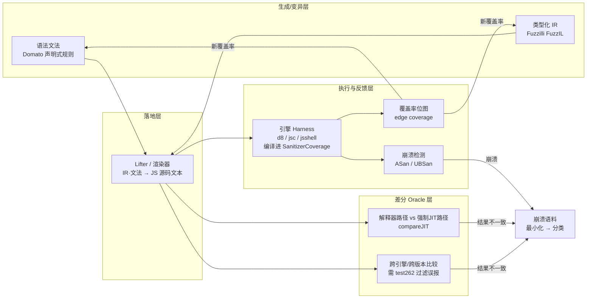
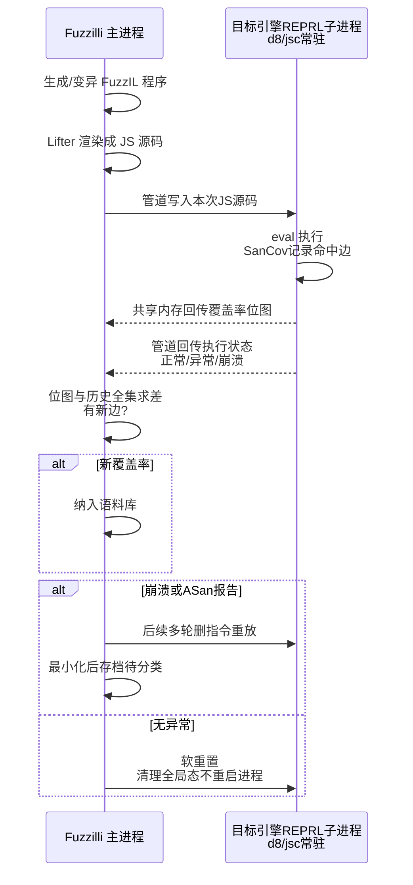
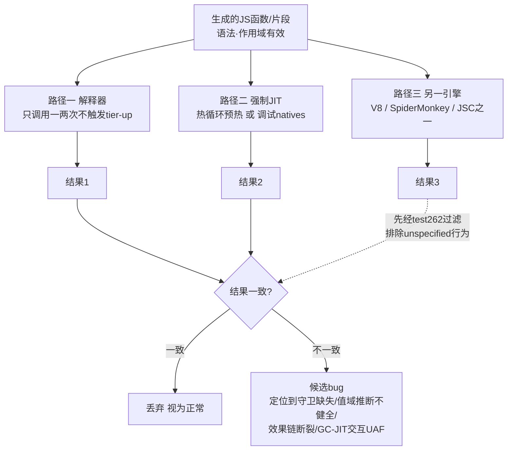
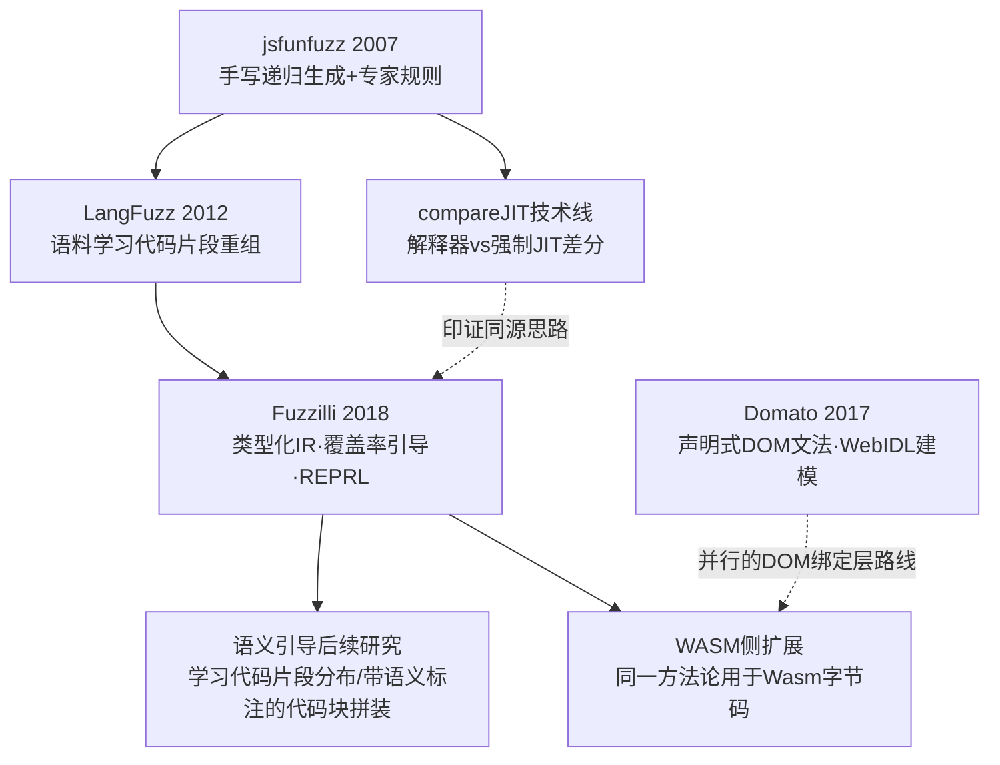
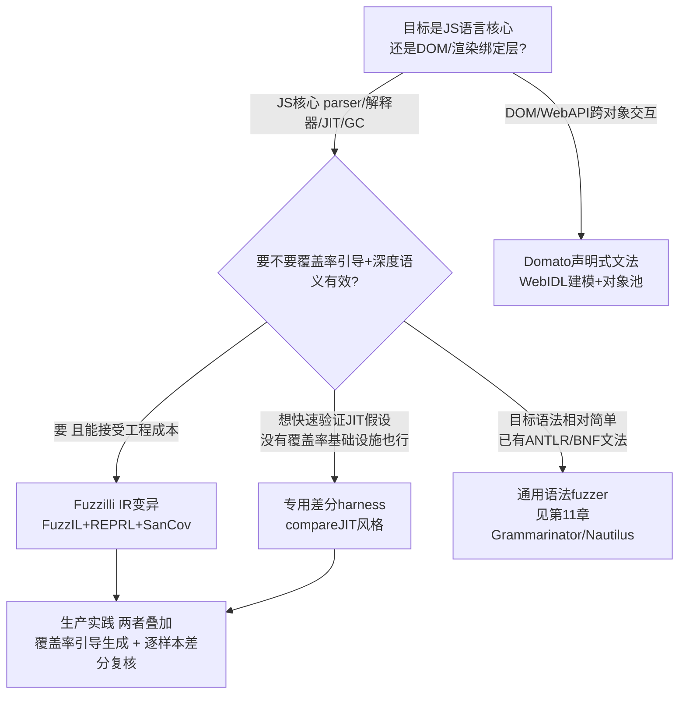

# Fuzzing与漏洞挖掘（15）· 浏览器与JS引擎Fuzzing
> [!abstract] TL;DR
> - 浏览器与 JS 引擎是"内存不安全的 C++ 运行时 + 图灵完备动态语言解释器 + 多层 JIT 编译器"叠出来的复合体：攻击面暴露给互联网上任意不可信页面，又是 Pwn2Own 与在野 0day 的常年主战场，因此发展出一整套专用 Fuzzing 方法论。
> - JS 语法强约束（括号配对、先声明后使用、隐式类型转换规则）让字节级变异在 parser 门口就阵亡；必须靠**语法感知生成**（Domato 式声明式文法）或**类型化 IR 变异**（Fuzzilli 的 FuzzIL）才能把变异后样本稳定送进解释器、乃至触发 JIT 热路径。
> - **差分测试（differential testing）**是这个领域缺失显式 oracle 时的核心武器：同一段代码分别走解释器与强制 JIT、不同引擎、不同优化层，结果不一致即候选 bug——这条技术线（jsfunfuzz 的 compareJIT）比覆盖率反馈更早揪出大量类型混淆与推测优化错误。
> - 覆盖率反馈与语法/IR 生成正交组合：Fuzzilli 把 SanitizerCoverage 编译进引擎本体、用 REPRL 协议做持久化执行，兼顾"语法合法"与"探索新路径"两个目标，思路上呼应 [[05.libFuzzer与持久模式|持久模式]]。
> - Domato（DOM 声明式生成）、jsfunfuzz/LangFuzz（手写生成 + 语料学习）、Fuzzilli（IR 级覆盖率引导变异）代表三代技术路线，选型取决于目标是 DOM 绑定层还是 JS 语言核心。
> - Fuzzing 挖出的 bug 类型（隐藏类/Map 混淆、边界检查消除不健全、GC 与 JIT 交互型 UAF）直接对应 [[54.浏览器与JS引擎漏洞/00.浏览器与JS引擎漏洞总览|系列 54]] 要拆解的漏洞根因——本篇只讲"如何发现"，"如何升级为利用"留给下游章节。

## 概述与定位

浏览器是普通用户机器上"运行不可信代码密度"最高的软件：每打开一个陌生网页，就等于让一段完全不受信任的 JavaScript 在本地跑起来。承载这段代码执行的 JS 引擎（V8、SpiderMonkey、JavaScriptCore 等），同时是现代软件里工程复杂度最高的组件之一——它不是一个简单的"解析某种文件格式"的库，而是一整套**动态类型语言运行时**：词法/语法分析、字节码解释器、多层实时编译（JIT）、垃圾回收器、内置对象模型缝合在一起，为了追求性能又叠加了大量"先猜后验"的推测优化。复杂度与暴露度的乘积，让浏览器/JS 引擎连续多年占据 Pwn2Own 桌面组的半壁江山，也是高价值在野 0day 的重灾区——这决定了它值得在系列里单独占一整篇，不能简单套用前面章节的通用手法了事。

本篇在系列中的位置：[[11.结构化Fuzzing：语法与protobuf|第 11 章]]已经把"字节级变异撞墙、需要换到结构化域"的道理讲透，并点明 JS 引擎是这条思路里**语义有效性要求最极端**的场景（该章末尾专门留了一句"细节见第 15 章"）；[[14.内核与驱动Fuzzing：syzkaller|第 14 章]]是另一个"专精领域"范例——用 syzlang 描述系统调用的类型与依赖。本篇是第三个专精领域案例，与前两者共享"覆盖率引导 + 结构化生成"的骨架，但"结构"的含义一路升级：syscall 序列是**有限指令集上的类型化调用链**，JS 源码则是**图灵完备、带任意递归文法与运行时类型系统的完整编程语言**——这个跃升迫使 Fuzzing 技术走向本篇的两大支柱：**语法生成**（如何构造出语法乃至语义都大体自洽、能钻进解释器与 JIT 深处的测试用例）与**差分测试**（在没有天然崩溃、也没有形式化规约可核对的情况下，如何判定"这不是崩溃但确实是 bug"）。

限定范围：本篇聚焦 **JS 引擎核心**（parser、字节码解释器、分层 JIT、对象模型、GC）作为主战场，向外延伸到 **DOM/渲染绑定层**（Blink/Gecko/WebKit 暴露给 JS 的 Web API）与 **WebAssembly** 子系统；完整浏览器的多进程架构、站点隔离与沙箱逃逸不在本篇范围，那是 [[54.浏览器与JS引擎漏洞/00.浏览器与JS引擎漏洞总览|系列 54]]（尤其其中多进程/沙箱与逃逸相关章节）的话题——本篇只负责"如何把 bug 从代码里揪出来"，后者负责"揪出来之后怎么升级成利用链"。

## 原理与机制

### 为什么字节级变异在这里彻底失效

JS 源码首先要过词法与语法分析这一关：括号必须配对、字符串必须闭合、token 序列必须符合文法。随机翻转字节几乎必然在 parser 的第一道关卡就被拒绝，这与[[11.结构化Fuzzing：语法与protobuf|第 11 章]]讲过的"强结构撞墙"是同一现象。但 JS 引擎的门槛比一般文件格式解析器更高一层：**光通过语法分析还远远不够**。JIT 编译器只有在某个函数被反复调用、热度计数超过阈值后才会被触发（"tier-up"）——这意味着一段生成/变异出的代码，不但要能通过语法分析，还要在解释执行的**整个热身循环期间**都不抛出未捕获异常、不提前跑飞控制流，才谈得上"摸到 JIT 编译出的机器码"。任何一次变异如果让某个变量在循环中途变成 `undefined`、或者引用了一个从未声明的标识符，程序在第一次迭代就会异常退出，永远够不着真正容易出漏洞的深层代码——JIT tier-up、内联缓存状态迁移、GC 触发时机等。换句话说，JS 引擎 Fuzzing 面对的不是"一次性过关"的语法门槛，而是"持续多次执行仍然有效"的更高要求，这是它比一般结构化 Fuzzing 目标更棘手的地方。

### 语法感知生成的原理：语法有效与语义有效的两层门槛

延续[[11.结构化Fuzzing：语法与protobuf|第 11 章]]"语法有效 ≠ 语义有效"的框架，JS 场景把语义门槛推向了极致。语法有效性（能被 parser 接受）相对容易靠一套上下文无关文法的产生式规则保证；但语义有效性——变量必须先声明后使用、作用域必须匹配、类型大体自洽以避免生成的样本满篇都是 `ReferenceError`/`TypeError`——如果不专门建模，纯文本层面的文法展开几乎无法维持。Domato（详见后文深度详解）用"对象池"这种启发式手段缓解这个问题：生成新语句时优先复用已创建、类型匹配的变量作参数，而不是每次都凭空引用一个不存在的标识符。这类方案的本质是**在生成过程中维护一份隐式或显式的符号表**，让每一步产生式展开都"知道"当前有哪些变量、它们大致是什么类型。

### IR 层变异的原理：把语义有效性收进构造规则本身

比语法感知生成更进一步的思路，是**不直接对 JS 源码文本或通用 AST 做变异，而是先定义一种自定义中间表示（IR），让这种 IR 的构造规则本身就无法表达"引用未声明变量"这类错误**。这正是 Fuzzilli 的核心洞见：变异永远发生在 IR 层——插入一条新指令、替换一个操作数、拼接一段来自其他程序的指令子序列——而每一种变异算子都被约束成"只能引用当前作用域内已定义的变量"，因此变异后的 IR 程序在**作用域**这个维度上总是合法的。最后才由一个专门的 **Lifter** 把 IR 渲染成真正的 JS 源码文本喂给引擎。这样做的代价是要为"变异能做什么"重新设计一整套指令集与类型近似机制，工程成本远高于文本模板或裁剪 AST；换来的收益是变异粒度更细（可以精确地"只换一根输入线"而不必重新生成整段代码）、且作用域正确性由构造保证而非依赖启发式，具体机制在下一节深度展开。

### 差分测试的原理：没有 oracle 时如何判定"错了"

覆盖率引导回答的是"这次执行有没有探索到新代码"，但它默认了一个前提——**bug 会以崩溃的形式表现出来**。JS 引擎里相当一部分高价值漏洞并不崩溃：一次数组越界读可能只是悄悄读出堆里另一个对象的字节、当作合法的浮点数返回，程序继续"正常"运行下去，ASan 也未必能捕捉到（如果读到的地址仍在同一分配的堆区间内，甚至连越界检测都触发不了）。对这类"没崩但算错了"的逻辑错误，需要一种完全不同的 bug 判定手段——**差分测试（differential testing）**：核心假设是"同一段语义确定的代码，在多条理应等价的执行路径下应该产生完全相同的可观察结果；不一致就说明其中至少一条路径的实现出了偏差"。在 JS 引擎场景下，可以互相印证的路径包括解释器与强制 JIT 之间、多个独立实现的引擎之间、不同 GC 配置之间——具体技术在深度详解板块展开。这里要强调它与覆盖率引导的关系：**差分测试是一种独立于覆盖率反馈之外的 oracle 构造技术**，理论上可以在纯黑盒生成的样本上运作，也可以叠加在覆盖率引导生成的深层样本之上，二者正交、可以组合但不能互相替代。

### 覆盖率反馈在 JS 引擎里的特殊性

给 JS 引擎做覆盖率引导 Fuzzing 时，SanitizerCoverage（见[[04.编译期插桩：SanitizerCoverage与PCGUARD|第 4 章]]）是编译进**引擎自身**的二进制（V8/JSC 等的 C++ 源码），而不是像一般 Fuzzing 那样插桩一个"被测目标程序"——因为 JS 引擎本身就是目标程序，被测的 JS 代码只是喂给它的输入。这带来一个容易被忽视的盲区：**边覆盖反映的是引擎内部 C++ 运行时/解释器/编译器代码被走到了哪些路径，而不是被执行的 JS 语义被探索到了多深**。两段语法结构完全不同的 JS 代码，完全可能落进解释器里同一条"整数相加快速路径"的 C++ 代码，产生一模一样的覆盖率信号，即使二者在业务语义上南辕北辙。更深一层的问题是：**JIT 在运行时动态生成的机器码，本身不参与任何编译期插桩**——SanitizerCoverage 只能覆盖引擎调用 JIT 编译器组装这段机器码的 C++ 逻辑，看不到"这段被生成出来的机器码执行到了它内部的哪一条分支"。这意味着覆盖率信号对"JIT 具体优化决策的深度"是失明的，必须靠专门设计的生成策略（刻意制造多态调用点、刻意触发去优化、刻意构造热循环）去补足，单靠覆盖率数字上涨并不能保证真的在探索 JIT 特有的漏洞面。



## 语法生成与差分测试详解

这一节把全篇的两大支柱拆到实现层面：语法生成一侧从 Domato 讲到 jsfunfuzz/LangFuzz 再到 Fuzzilli 的 FuzzIL，差分测试一侧从 compareJIT 讲到跨引擎比较的现实困难，最后串成一条演进主线。

### Domato：声明式 DOM 文法生成器详解

Domato（Ivan Fratric，Google Project Zero，2017 年开源）是声明式语法生成器在浏览器场景的代表，专注 **DOM/Web API** 而非 JS 语言核心本身。它的文法文件是一组产生式规则的文本描述，围绕几个核心概念组织：**creators**（如何构造/获得某接口类型的一个实例，例如"创建一个 `Document`""从 `document` 上 `querySelector` 出一个 `Element`"）、**functions**（该接口暴露的方法及参数类型）、以及接口/属性定义（大量来自对 WebIDL 的转译，因为浏览器暴露给 JS 的 API 表面本身就是用 WebIDL 描述的）。生成过程从根符号递归展开：每一步随机挑一条可用产生式代入，直到只剩终结符（字面文本）为止，拼出一段完整的 HTML + JS 测试用例。一段简化示意（非真实 Domato 语法，仅示意结构）：

```
<CreateElement> = document.createElement('<TagName>')
<TagName> = div | span | canvas | video | iframe
<CallMethod> = <GetElementVar>.<MethodName>(<Args>)
```

Domato 的关键设计是维护一个"已创建对象池"：生成新语句时优先从池子里挑一个类型匹配的既有变量作参数或接收者，而不是每次都新建实例——这样能表达"创建对象 A，随后多次交叉调用 A 与 B 的方法、在不同回调之间反复引用同一批对象"这种跨对象交互，而这恰恰是 DOM UAF 类漏洞最典型的触发模式（一个对象在某次回调中被销毁，另一处代码仍持有对它的悬垂引用并继续访问）。Domato **没有覆盖率反馈**——它是纯粹的黑盒/灰盒文法遍历，每次生成相互独立，不依据"上一次覆盖率涨没涨"调整策略。这既是它的局限（无法自我学习、后期边际产出会下降），也是它的优势所在：生成速度快、不依赖插桩过的目标即可运行、单次产出的测试用例信息密度高。发布后短时间内，它在 Chrome、Firefox、Safari、（旧版）Edge 的排版引擎里独立命中了大量真实漏洞，成为 DOM 层结构化 Fuzzing 的事实标杆。

### jsfunfuzz 与 LangFuzz：手写生成与语料学习的两条早期路线

**jsfunfuzz**（Jesse Ruderman，Mozilla，约 2007 年）是最早、也是战果最丰硕的纯手写 JS 生成器之一：一个递归下降式的生成器，内置了大量"已知容易触发解释器/GC bug 的 JS 构造模式"（反复触发垃圾回收、原型链魔改、`arguments` 对象逃逸、`with`/`eval` 制造非常规作用域等），在 SpiderMonkey 上独立挖出数百个 bug，是"把专家经验直接编码进生成规则"这条路线的鼻祖。它的局限也很直观：所有"该生成什么样的刁钻构造"的知识都是研究者手写进代码的，覆盖面受限于作者对引擎内部实现的理解深度，规则本身不会随目标代码演进而自动更新。

**LangFuzz**（Holler、Herzig、Zeller，论文《Fuzzing with Code Fragments》，USENIX Security 2012）走了另一条路：不完全依赖手写规则，而是**从既有测试语料里学**——把语料库里每个测试用例解析成语法树，按非终结符类型把子树切碎存进一个"片段库"，生成新用例时按文法在对应位置随机取一段类型相容的片段拼进去。这本质上是"文法约束下的语料驱动重组"，好处是能自动继承语料库里已经隐含的"有效但刁钻"的构造模式，不需要研究者逐条手写。jsfunfuzz 与 LangFuzz 后来被整合进 Mozilla 的 funfuzz 工具箱里协同使用：前者擅长制造"引擎实现者完全没想到的边界组合"，后者擅长"复用历史 bug 附近的语法模式再交叉变形"。

这两条早期路线共同的局限，是**没有真正意义上的作用域/类型建模**：无论手写规则多精巧，一旦涉及变量、函数、对象属性的跨语句依赖，生成器要么依赖启发式约定（比如"变量名从一个固定池子里选，因此大概率是已声明的"），要么干脆放任生成大量 `ReferenceError`/`TypeError`，让解释器直接因为语义错误跑崩、但每次都白白消耗一次执行预算。这正是 Fuzzilli 要从根本上解决的问题。

### Fuzzilli 与 FuzzIL：类型化 IR 变异详解

Fuzzilli（Samuel Groß，2018 年前后开源，核心用 Swift 实现）把"语法/作用域有效性"从生成器的约定俗成，提升成了一种**由中间表示的构造规则强制保证**的性质。核心设计是自定义中间语言 **FuzzIL**：

- **程序（Program）** 是一段 FuzzIL 指令序列，每条指令有固定操作码、输入/输出变量（类 SSA：变量一旦定义，编号只增不减，后续指令按编号引用）。指令集覆盖 JS 语义的主要构造：字面量装载（整数/字符串/浮点）、`CreateArray`/`CreateObject` 构造、属性与元素读写、函数调用与构造调用、二元/一元运算与比较、以及 `BeginFunction`/`BeginFor`/`BeginWhile`/`BeginIf` 一类结构化控制流的起止指令对。
- **变量作用域由指令构造规则本身维护**：任何一条指令都只能引用当前作用域内、编号不晚于自身的已定义变量作为输入——这条约束在生成与变异两个方向上都被强制遵守，因此 FuzzIL 程序天然不存在"引用未声明变量"这类作用域错误，从根源上消灭了 jsfunfuzz/LangFuzz 时代最常见的一类"生成即报废"样本。
- **抽象类型跟踪**：Fuzzilli 在构造/变异程序的同时做一遍轻量的抽象解释，为每个变量维护一个粗粒度类型标签（整数、字符串、对象、可能持有哪些属性/方法等）。这不是完整的类型系统，只是"够用的近似"——足以让代码生成器倾向于"用一个已知是对象的变量去调方法"而非"对整数变量调 `.push()`"，从而把语法合法但语义荒谬导致的异常风暴压低一个数量级。注意不是要消灭这类样本：JS 本身允许大量隐式转换与鸭子类型，某些"看似类型错误"的构造恰恰是触发引擎内部类型检查缺陷的关键输入，过度收紧类型近似反而会缩小探索面。
- **Lifter** 负责把 FuzzIL 程序渲染成真正的 JS 源码文本再交给目标引擎执行；语料库本身存的是 FuzzIL 程序而非 JS 文本，这与[[11.结构化Fuzzing：语法与protobuf|第 11 章]] libprotobuf-mutator"语料即序列化 proto"是同一设计哲学的复用——变异永远发生在结构化的中间态，文本只是最后一步的渲染产物。

**变异发生在 IR 层**，围绕几类算子展开：**InputMutator** 把某条指令的输入变量换成作用域内另一个类型兼容的变量，是最小步、最精准的一类操作；**OperationMutator** 改指令自带的立即数或操作符（把加法换成乘法、把整数常量改成 `0`/`-1`/边界值）；**CodeGenMutator** 复用"从零生成程序"的同一套代码生成器逻辑，在序列中随机位置插入一段新指令；**SpliceMutator** 从语料库另一个程序里剪一段指令子序列、做变量重编号后拼进当前程序，对应经典遗传算法里的交叉操作；此外 Fuzzilli 还提供一种运行时探测式的变异机制（Fuzzilli 称之为 Explore/探测式变异）——插入一条特殊指令，在**运行时**现场探查某变量的真实可用属性与方法，而不是仅凭静态跟踪的近似类型，再据此动态决定后续调用哪个方法、传入什么参数。这弥补了静态类型近似的盲区，尤其擅长探索宿主对象、内置对象上那些静态分析很难穷举的属性表面——本质上是把"运行时反馈"这一信号也引入了生成决策，而不仅仅依赖覆盖率位图。

**执行与覆盖率反馈：REPRL。** 若每个测试用例都完整 `fork`+`exec` 一次 V8/JSC 进程，光进程创建的固定开销就足以拖垮每秒执行数。Fuzzilli 采用一种称为 **REPRL（read-eval-print-reset-loop）** 的协议：目标引擎的 shell（如 `d8`）被打上补丁，进入一个常驻循环——每次通过管道接收一段 JS 源码、`eval` 执行、把状态做**软重置**（清理全局副作用但不重新拉起进程），再通过共享内存把这次执行命中的覆盖率位图回传给 Fuzzilli 主进程。这与[[05.libFuzzer与持久模式|第 5 章持久模式]]、AFL 的 fork server 是同一思想在 JS 引擎场景下的落地——都是"摊薄单次执行的固定开销，把预算留给真正的解释/编译执行"。覆盖率位图的来源正是[[04.编译期插桩：SanitizerCoverage与PCGUARD|第 4 章]]讲过的 SanitizerCoverage，在编译目标引擎本体时打开 `trace-pc-guard` 一类插桩选项。

**崩溃后的最小化。** 命中崩溃后，Fuzzilli 对 FuzzIL 程序做多轮程序化精简：反复尝试删除指令或子序列并重放，只要删完仍复现就接受，直到不能再删——原理与其他 Fuzzer 的用例最小化一致，只是操作对象是 IR 指令而非字节。最终产物既有最小化后的 FuzzIL（供继续变异复用），也会 lift 成最小化的 JS 源码交给人工分析。Fuzzilli 支持的目标包括 V8（`d8`）、JavaScriptCore（`jsc`），社区也维护了 SpiderMonkey、Hermes、JerryScript、QuickJS 等移植；由于各引擎的调试接口、覆盖率插桩方式、REPRL 补丁点都不一样，每个目标需要单独维护一份适配层，这是实际选型时要考虑的现实成本。



### 差分测试技术详解：从 compareJIT 到跨引擎比较

覆盖率引导解决的是"探索到没到过这段代码"，但如前所述，很多 JS 引擎的严重 bug 根本不崩溃，必须换一种"没有标准答案时怎么判断错没错"的方法，这就是差分测试要解决的问题。核心假设很朴素：**同一段语义确定的代码，在多个理应等价的执行路径下应该产生完全相同的可观察结果；一旦不等价，说明其中至少一条路径的实现出了偏差**。JS 引擎里能拿来互相印证的维度主要有：

1. **解释器路径 vs 强制 JIT 路径**：历史上最高产的一个维度，代表技术是 jsfunfuzz 的 **compareJIT**——把一段生成的函数分别用两种方式跑：一次只调用一两次（停留在解释器，不触发 tier-up），一次反复调用大量次数（或借助引擎调试接口强制优化，例如 V8 在 `--allow-natives-syntax` 下暴露的 `%OptimizeFunctionOnNextCall`/`%NeverOptimizeFunction`/`%PrepareFunctionForOptimization` 一类 debug natives），对比两次的返回值。不一致，说明 JIT 编译出的机器码在某个边界条件下背离了解释器定义的语义——这正是[[54.浏览器与JS引擎漏洞/06.类型混淆与JIT优化漏洞|系列 54 第 6 章]]讲的"推测—守卫—去优化"闭环里某一环失效的外部可观测症状：可能是守卫缺失、可能是类型推断给出了不健全的值域导致边界检查被误删、也可能是效果链断裂让副作用感知失败。差分测试不需要理解优化编译器内部 IR 的细节，就能纯粹从行为层面把这些深层逻辑错误揪出来——这正是它相对于"只依赖崩溃信号"最独特的价值：很多类型混淆 bug 不会立刻崩溃，只有对比预期输出才能发现。
2. **跨引擎比较**：把同一段（经过谨慎筛选、只用标准化语义的）JS 代码分别丢给 V8、SpiderMonkey、JavaScriptCore 跑，比较输出与异常类型。原理上更直接，但**假阳性极高**——ECMA-262 规范里存在大量 implementation-defined 或 unspecified order 的行为（某些边界情况下的属性遍历顺序、`Error.prototype.stack` 的具体格式、`Function.prototype.toString` 的输出细节、浮点数转字符串的舍入尾数），跨引擎比较很容易把"两边都合规、只是恰好不同"的噪声误报成 bug。实践中必须先用 **test262**（TC39 官方维护的 ECMAScript 一致性测试套件）过滤掉规范未强制的行为、只在"规范明确规定唯一结果"的场景下做比较，否则分诊成本会淹没真正的信号。
3. **跨 GC 配置/时机差分**：调整堆大小、主动触发垃圾回收、改变对象晋升代际的参数，对比同一段代码在不同 GC 压力下的行为——专门用来暴露 **GC 与 JIT 交互产生的 UAF**（例如 JIT 内联缓存缓存了某个对象的指针，GC 移动或回收了该对象但缓存未被正确失效）。
4. **WASM 侧差分**：同样的"解释 tier 与编译 tier 对比"可以搬到 WebAssembly 子系统（基线编译器与优化编译器之间），只是 Wasm 的类型系统更贴近底层（数值类型、线性内存边界），bug 模式与 JS 侧略有差异，具体利用面见[[54.浏览器与JS引擎漏洞/10.WebAssembly与RWX利用|系列 54 第 10 章]]。

需要澄清一个容易混淆的点：**差分测试与覆盖率引导生成是两条相互独立、可以正交组合的技术，不是同一件事**。Fuzzilli 本身的核心 oracle 是崩溃与 ASan 报告，而非跨路径差分，它靠 IR 变异与覆盖率反馈探索深度；compareJIT 这类差分技术历史上更多是在独立的检测层上运作，可以叠加在任何生成方式产出的样本之上。二者可以组合使用：用覆盖率引导 + IR 变异生成语法有效、能钻到深层的样本，再对每个样本额外跑一次差分比较，兼得"探索得深"与"没崩也能测出错"两方面的能力。



浏览器/JS 引擎生成式 Fuzzing 的演进，可以串成一条"从手写经验到自动学习、从纯文本到类型化中间表示"的主线：



## 工具视角与实战

### 搭建 Fuzzilli 环境跑主流引擎的实战流程

Fuzzilli 的核心用 Swift 实现，实战流程大致分三步：先编译 Fuzzilli 自身，再单独构建打了覆盖率插桩与 ASan 的目标引擎（仓库里为每个受支持引擎维护了独立的补丁与构建脚本，核心是给 shell 打 REPRL 补丁、开启 SanitizerCoverage、链接 ASan 运行时），最后指定目标引擎、语料目录与并发 worker 数起跑：

```
# 1. 编译 Fuzzilli 自身（Swift 工具链）
swift build -c release

# 2. 编译打了覆盖率插桩与 ASan 的目标引擎（以 V8 为例）
#    对应目录下自带 patch 与构建脚本：
#    给 d8 打 REPRL 补丁 + 开 SanitizerCoverage(trace-pc-guard) + ASan
./Targets/V8/fuzzbuild.sh    # 示意，具体脚本名/参数以对应版本仓库为准

# 3. 起 Fuzzing 会话：指定目标引擎 profile、语料目录、并发 worker
swift run -c release FuzzilliCli \
  --profile=v8 --corpus-dir=./corpus --storage-path=./out \
  --jobs=8 ./v8-build/d8
```

语料来源上，**test262**（ECMAScript 官方一致性测试套件，数万条按规范章节组织的用例）与各引擎自带回归测试（V8 的 `mjsunit`、SpiderMonkey 的 `jstests`、JSC 的 `stress` 测试）是极佳的初始种子——它们本身就是语法有效、且经常刻意戳在规范边界上的代码，比空语料库或纯随机生成热启动快得多，呼应[[09.语料库与字典与最小化|第 9 章]]"语料决定冷启动效率"的通用结论。

### Domato 对 DOM/渲染引擎的实战流程

Domato 的使用相对简单，批量生成独立 HTML 文件即可：

```
python domato.py --output_dir=out --no_of_files=2000
```

产出的 HTML 配合打了 ASan 的 Chromium `content_shell` 或 Firefox headless 构建运行，观察崩溃与 ASan 报告。由于 Domato 无覆盖率反馈，通常靠多进程并行铺量、并定期换随机种子重跑来维持产出效率，而不是像覆盖率引导 Fuzzer 那样让语料库自我进化。

### 差分 harness 的方法论骨架

以下示例只演示"如何把两条执行路径拉出来对比"的方法论骨架，不针对任何真实版本或已知漏洞：

```javascript
// 示意：压缩版 compareJIT 风格差分 harness
function runInterpreted(fn, args) {
  return fn(...args);                    // 只调用一次，几乎不可能tier-up
}
function runOptimized(fn, args) {
  %PrepareFunctionForOptimization(fn);    // V8 debug natives，需 --allow-natives-syntax
  for (let i = 0; i < 100000; i++) fn(...args); // 热身触发tier-up
  %OptimizeFunctionOnNextCall(fn);
  return fn(...args);
}
function differentialCheck(fn, args) {
  const a = runInterpreted(fn, args);
  const b = runOptimized(fn, args);
  if (JSON.stringify(a) !== JSON.stringify(b)) {
    throw new Error("differential mismatch: interpreter vs JIT disagree");
  }
}
```

真实生产级 harness 还需处理浮点 `NaN`/`-0` 的规范化比较、异常类型比较、`Symbol`/`BigInt` 等无法直接 `JSON.stringify` 的值的自定义序列化等大量细节，这里只保留方法论骨架。

### 崩溃后的实战流程：minimize、bisect、triage

拿到 ASan 报告或崩溃后，先用引擎自带或 Fuzzilli 自带的最小化流程反复删指令/删语句，直到不能再删；随后做 **bisect**——主流浏览器引擎通常提供按提交/版本索引的历史构建归档服务，可以二分下载不同版本的可执行文件重放最小化用例，定位到引入 bug 的具体提交；最后是 **triage**——判读是空指针解引用、越界读写、UAF 还是类型混淆，是否可控（受生成样本里的哪些参数影响偏移或大小），这一步的通用方法论见[[16.崩溃分类与去重与可利用性|第 16 章]]。判定为真实内存安全问题后，按后文安全性章节所述流程负责任披露。

### 与规模化的衔接

V8/Chromium 团队把覆盖率引导生成与差分技术接入了持续 Fuzzing 基础设施长期运行，规模化调度、语料共享、自动化崩溃归档与回归验证的机制留给[[17.规模化：OSS-Fuzz与ClusterFuzz|第 17 章]]专门展开，本篇不重复。

### 选型决策



一句话经验：**JS 语言核心且要长期投入，上 Fuzzilli 这类 IR 级引擎；DOM/渲染绑定层，上 Domato 这类声明式生成器；只想快速验证某类 JIT 假设，独立写一个差分 harness 即可，不必先搭覆盖率基础设施；生产实践里两者经常叠加使用**。

## 安全性与正确使用

> [!caution] 合规与伦理边界
> - 仅在**自有或获授权的环境**中开展：本地自行编译的 debug/ASan 构建、CTF 靶场、自建测试用的引擎/浏览器实例，或明确纳入 Chrome VRP、Mozilla Bug Bounty、Pwn2Own 范围的授权测试；严禁对不属于你、未获书面授权的生产浏览器、在线服务、他人设备投递生成的畸形 JS/HTML。
> - 浏览器场景有一个其他 Fuzzing 目标不具备的特殊风险：**JS 天然就是"发给别人浏览器执行的东西"**。本地 Fuzzing harness（REPRL 常驻子进程、`content_shell`、`d8`）与"做一个网页诱导受害者打开"是两回事——前者是自测，后者一旦脱离授权范围就是攻击行为。不要把 Fuzzing 产出的崩溃样本包装成网页发布，也不要投递给任何非自有目标。
> - 全篇为**防御与教育视角**：讲清语法生成、IR 变异、差分测试的原理，是为了帮助读者理解引擎实现里的薄弱环节、参与开源引擎的健壮性测试并负责任地上报，**不提供**针对任何真实第三方目标的武器化配方，也不为绕过任何商业授权提供攻击步骤。
> - 挖到的引擎崩溃属敏感信息：走**负责任披露（coordinated disclosure）**——Chrome VRP、Mozilla Bug Bounty、各家 PSIRT 都有标准提交渠道与合理的修复窗口；公开 PoC 前务必评估影响面，尤其是仍在广泛使用的旧版本引擎。差分测试挖出的"结果不一致"未必都是安全漏洞——先排除 ECMA-262 unspecified 行为造成的噪声再上报，避免制造无意义的恐慌或错误的 CVE 申请，这也是一种安全责任。

除合规外，几条工程纪律同样决定结果的真实价值：fuzzing 用的 ASan/覆盖率插桩构建产物**不能当日常浏览器使用或对外分发**——这类构建关闭了大量安全缓解、性能大幅下降，混用会带来真实风险；一次引擎侧的内存安全或逻辑 bug 通常只是攻击链的第一环，现代浏览器的多进程沙箱意味着还需要配合沙箱逃逸才能形成完整攻击，本篇止步于"如何发现引擎/DOM 层的 bug"，后续的原语构造（`addrof`/`fakeobj`）与利用链构造见[[54.浏览器与JS引擎漏洞/00.浏览器与JS引擎漏洞总览|系列 54]]与[[33.二进制漏洞与利用基础/01.内存破坏漏洞全景与利用链模型|系列 33]]，本篇不涉及、也不应被当作构造完整利用的教程；大规模持续 Fuzzing 会消耗大量算力与云资源，个人或团队自建时也要遵守所在组织的资源使用规范，避免失控的并发拖垮共享基础设施。高危或资源受限场景下，也可以考虑用 `--jitless` 一类关闭 JIT 的运行模式先做一轮基线测试，收窄一部分推测执行相关的攻击面。

## 小结

浏览器与 JS 引擎 Fuzzing 是"语言型目标"Fuzzing 的集大成案例：**语法生成**（Domato 的声明式文法、jsfunfuzz/LangFuzz 的手写规则与语料学习、Fuzzilli 把语义有效性上收到类型化 IR 的构造规则里）解决了"如何造出语法乃至作用域都自洽、能稳定钻进解释器与 JIT 热路径的深层测试用例"；**差分测试**（compareJIT 式的解释器/JIT 对比、跨引擎比较、跨 GC 配置比较）解决了"当很多严重 bug 根本不崩溃时，如何在没有形式化规约的情况下仍然判定出错"。覆盖率反馈（SanitizerCoverage 编译进引擎本体、REPRL 摊薄单次执行开销）把二者粘合成一个自增强的探索闭环，但也要清醒它的盲区——引擎侧的边覆盖不等于 JS 语义覆盖，JIT 生成的机器码本身不参与静态插桩。

这套方法论挖出的 bug，类型上高度集中于隐藏类/Map 混淆、边界检查消除不健全、副作用/效果链误判、GC 与 JIT 交互型 UAF——每一类都在[[54.浏览器与JS引擎漏洞/00.浏览器与JS引擎漏洞总览|系列 54]]有专门章节从"漏洞如何形成"的角度深入拆解；本篇给出的是"如何把它们从数百万行 C++ 与生成出来的海量 JS 组合里揪出来"的方法论。下一章将转向拿到崩溃之后的分类、去重与可利用性判定，把"发现"进一步推向"能不能用、值不值得深挖"的工程化决策。

## 相关阅读

- 同库·系列内：[[11.结构化Fuzzing：语法与protobuf|结构化Fuzzing：语法与protobuf]]（通用语法感知变异方法论，本篇 IR 变异的直接铺垫）、[[09.语料库与字典与最小化|语料库与字典与最小化]]（test262/mjsunit 作为种子的通用原理）、[[05.libFuzzer与持久模式|libFuzzer与持久模式]]（REPRL 的思想同源）、[[04.编译期插桩：SanitizerCoverage与PCGUARD|编译期插桩：SanitizerCoverage与PCGUARD]]（覆盖率来源）、[[14.内核与驱动Fuzzing：syzkaller|内核与驱动Fuzzing：syzkaller]]（另一专精领域对照）、[[16.崩溃分类与去重与可利用性|崩溃分类与去重与可利用性]]、[[17.规模化：OSS-Fuzz与ClusterFuzz|规模化：OSS-Fuzz与ClusterFuzz]]。
- 同库·下游利用：[[54.浏览器与JS引擎漏洞/00.浏览器与JS引擎漏洞总览|浏览器与JS引擎漏洞总览]]、[[54.浏览器与JS引擎漏洞/06.类型混淆与JIT优化漏洞|类型混淆与JIT优化漏洞]]、[[33.二进制漏洞与利用基础/01.内存破坏漏洞全景与利用链模型|内存破坏漏洞全景与利用链模型]]。
- 同库·插桩引擎：[[48.动态插桩与模拟执行引擎/12.插桩驱动的分析：覆盖率与污点与trace|插桩驱动的分析：覆盖率与污点与trace]]。
- 官方文档与延伸：Fuzzilli GitHub 仓库（`googleprojectzero/fuzzilli`）及其设计文档、Domato GitHub 仓库（`googleprojectzero/domato`）、Mozilla funfuzz 仓库（jsfunfuzz/LangFuzz）、ECMA-262 语言规范与 `tc39/test262` 一致性测试套件、Holler、Herzig、Zeller《Fuzzing with Code Fragments》（USENIX Security 2012）、V8 官方博客中关于 Fuzzing 与安全加固的相关文章。

[[00.Fuzzing与漏洞挖掘总览|⬆ 系列总览]] | [[14.内核与驱动Fuzzing：syzkaller|← 上一章]] | [[16.崩溃分类与去重与可利用性|→ 下一章]]
