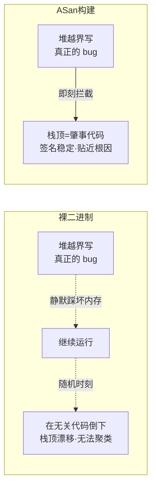
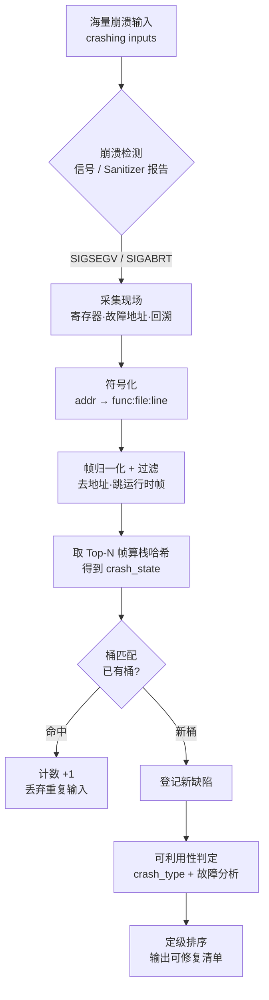
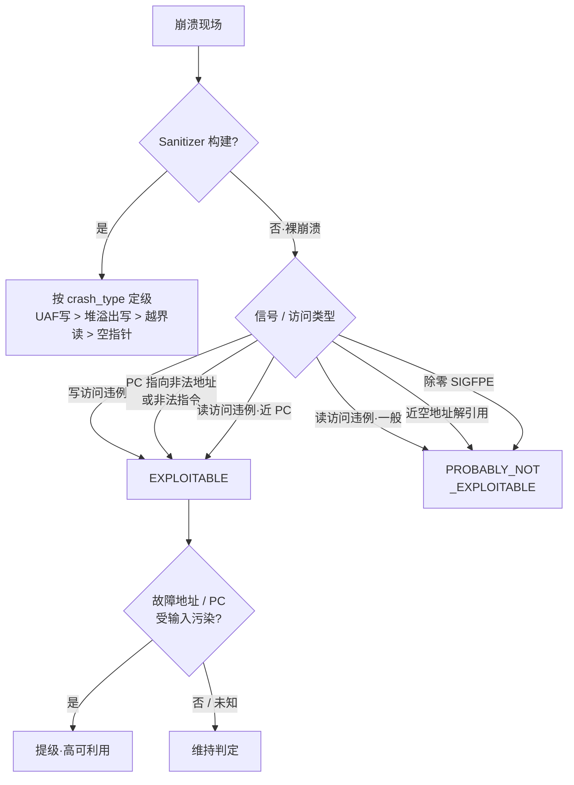

# Fuzzing与漏洞挖掘（16）· 崩溃分类与去重与可利用性
> [!abstract] TL;DR
> - 模糊测试的直接产物是**海量崩溃样本**而非漏洞：一次规模化 campaign 产出的百万级 crashing input 往往只对应个位数根因。崩溃分类（triage）→ 去重（dedup）→ 可利用性排序（exploitability）是把"崩溃堆"压缩成"可修复缺陷清单"的三级流水线，也是决定 fuzzing 产能能否兑现的后端瓶颈。
> - 去重的工业标准是**栈哈希**：对符号化回溯做帧归一化+过滤后取 Top-N 帧算哈希做桶键。覆盖率去重（AFL 的 bitmap `has_new_bits`）会把同一 bug 拆成上千个"独特"崩溃（过度拆分），栈哈希则会因公共帧/符号漂移而误并不同 bug（过度合并），两类失败模式各有针对性解法。
> - ASan 之所以让栈去重可靠，深层原因是它在**非法访问发生的那一刻**就中断，崩溃点贴近 bug、栈顶即肇事代码，签名稳定；裸二进制则在内存被静默损坏后于随机的无关代码处倒下，栈顶漂移、无法据此聚类。
> - 可利用性判定源自微软 `!exploitable` 与 CERT `exploitable`：以信号类型、访问方向（读/写）、故障地址与 PC 的关系为启发式，产出 EXPLOITABLE / PROBABLY_EXPLOITABLE / PROBABLY_NOT / UNKNOWN 四档——它是**排序信号，不是利用证明**。
> - 现代实践在 sanitizer 构建下改用**崩溃类型本身**作主判据（UAF 写 > 堆溢出写 > 越界读 > 空指针解引用），并以 CASR / ClusterFuzz 的 `crash_type + crash_state` 双因子做桶键与定级，比寄存器级启发式更稳。

## 概述与定位

在整条 fuzzing 流水线里，前面十五章讲的都是"如何更快、更深地把目标弄崩"——覆盖率反馈、插桩、sanitizer、harness、变异调度、结构化输入、内核与浏览器目标。但 fuzzer 的职责在"这里有一个能让程序崩溃的输入"这一刻就结束了，而这恰恰是**人类工作量真正开始**的地方。本章处理的就是这条鸿沟：**崩溃输入不等于崩溃，崩溃不等于 bug，bug 不等于漏洞**。

三个待完成的变换对应三项子任务：

- **去重（deduplication）**：把成千上万个 crashing input 归并到少数几个"独特崩溃"。这是最先要做、收益最大的一步——不去重，后面所有人工都在重复劳动。
- **分类 / 定因（triage / classification）**：判断每个独特崩溃是什么类型的内存错误、崩在哪、根因大概在哪，给出可读的缺陷描述。
- **可利用性与定级（exploitability / severity）**：估计该崩溃被武器化的难度与危害，决定"先修哪个"。

为什么这套流程值得单独成章？因为在规模化场景下，**人工 triage 时间是 fuzzing 的真正瓶颈**。OSS-Fuzz 每年报出数万个 bug，若没有自动去重+定因，工程师会被同一个 bug 的上万份重复报告淹没，真正的新缺陷反而被埋没。可以说，去重与 triage 决定了一台 fuzzer 的"信噪比"，进而决定它的实际价值。

**与相邻章节的边界**要划清楚，避免重复：第 07 章讲 sanitizer——它是本章崩溃信号的**上游生产者**（ASan 报告的结构直接决定去重质量）；第 12 章讲污点与 concolic——它为可利用性判定提供"故障地址是否受输入控制"的**污染信息**；第 14/15 章讲内核与浏览器 fuzzing——它们有各自的去重口径（syzkaller 按 oops 标题、浏览器按 JS 栈），本章讲通用原理；第 17 章讲 OSS-Fuzz/ClusterFuzz——那是把本章算法**跑在规模化基础设施**上的工程；而第 33 章（内存破坏漏洞与利用链）是本章的**下游消费者**——它拿走一个"已去重、判定为可利用"的崩溃，去构造真正的 exploit。本章是"从崩溃到缺陷清单"，不越界去讲"从缺陷到 shell"。

## 原理与机制

### 什么算一次"崩溃"

崩溃的外延比"段错误"宽得多，triage 系统必须统一处理多种终止信号：

- **操作系统信号**：`SIGSEGV`（非法内存访问，最常见）、`SIGABRT`（`abort()`，来自 assert、glibc 堆检查、或 sanitizer 主动中止）、`SIGBUS`（对齐错误 / mmap 越界）、`SIGFPE`（除零、整数溢出触发）、`SIGILL`（非法指令——常常是 PC 被破坏跳到了数据区，或 `__builtin_trap` / `ud2`）、`SIGTRAP`。
- **Sanitizer 主动中止**：ASan/UBSan/MSan 检测到错误后打印文本报告，再 `abort()` 或 `_exit`。这条路径产出的信息量最大——它把"哪种错误、访问方向、大小、分配/释放栈"全写清楚了。
- **语言层异常**：C++ 未捕获异常、Rust panic、断言失败。
- **非崩溃型缺陷**：超时（hang，可能是死循环或算法复杂度爆炸）、OOM（内存耗尽）、内存泄漏（LSan）。这些也要进 triage，但去重口径不同。

### 崩溃现场的原材料

一次崩溃能采集到的"证据"包括：故障时的**寄存器**、**故障地址**（`siginfo` 的 `si_addr`，即访问了哪个非法地址）、**回溯（backtrace/调用栈）**、**core dump**，以及信息量最高的 **sanitizer 文本报告**。去重与判定都建立在这些原材料之上，其中回溯是绝对核心。

### 符号化：从地址到函数

原始回溯是一串裸地址（`0x5555...`）。要做稳定的栈哈希，必须先**符号化**：把地址翻译成 `函数名 + 文件:行号`。这需要调试信息（DWARF/PDB）或至少符号表；没有符号时只能退化到 `模块名 + 模块内偏移（RVA）`，只要相对模块基址归一化，RVA 仍可用作签名。一个易被忽视的细节是**内联帧**：编译器把小函数内联后，一个物理地址其实对应多层逻辑调用；`llvm-symbolizer -i` 能展开内联信息，若展开策略在不同构建间不一致，栈哈希就会漂移。

### 去重的问题陈述与两大流派

去重的形式化目标是：设计一个**崩溃签名（signature）/ 桶键（bucket key）**函数，使得"触发同一根因"的两个输入落入同一个桶，"触发不同根因"的落入不同桶。现实中不存在完美签名，工程上分两大流派：

- **覆盖率 / 路径去重**（fuzzer 本来就在算）：AFL 判定一个崩溃"独特"的标准是它的执行路径（bitmap 里的边元组）出现了新位（`has_new_bits`）。优点是**零额外成本、不需符号**；致命缺点是**路径不等于 bug**——同一个 bug 用略微不同的输入到达，会经过不同的边，于是炸裂成成千上万个"独特"崩溃。这就是为什么 AFL 的 `crashes/` 目录里塞满了同一 bug 的重复样本。它**系统性地过度拆分**。
- **栈 / 签名去重**（下游做）：符号化后取调用栈derive一个签名。它贴近根因、是工业标准，但需要符号和可复现的崩溃。本章的"栈哈希"就属于这一流派。

### 为什么 ASan 是去重的地基

这是本节最重要的机制洞察：**没有 sanitizer 时，栈去重几乎不可用**。设想一个堆越界写——裸二进制里它会静默地踩坏相邻内存，程序继续跑，直到很久以后在某个**与 bug 毫不相干**的地方（比如释放那块被踩坏的 chunk 时、或读取被污染的指针时）才倒下。崩溃点与 bug 之间**解耦**了，同一个 bug 每次倒在不同地方，栈顶四处飘散，签名无法聚类。ASan 则在**越界写发生的那一条指令**上就拦截并中止，栈顶正是肇事的应用代码，签名既稳定又贴近根因。所以 sanitizer 对 triage 的价值不只是"能检测更多 bug"，更是"让去重和定因这件事在原理上成立"。这条因果链是理解本章一切工具选型的钥匙。



整条流水线的骨架如下：



## 栈哈希·去重·可利用性判定：算法与数据结构详解

这一段把三个种子（栈哈希、去重、exploitable 判定）逐层拆到"不看代码也能懂"的粒度。

### 一、栈哈希：五步流水线

**第 1 步·取回溯。** 从 core、ptrace 现场或 sanitizer 报告里拿到帧序列。每帧是 `(模块, 偏移)` 或符号化后的 `(函数, 文件, 行)`。

**第 2 步·帧归一化（去掉易变部分，signature 稳定性的关键）。** 一个原始帧里混着大量**跨运行/跨构建会变**的噪声，必须剥离，否则同一 bug 会因这些噪声被拆成无数桶：

- 去掉**绝对地址**——受 ASLR 影响，每次都不同，绝不能进签名。
- 处理**函数内偏移**（`+0x2f`）——它随编译器版本变；粗粒度去重直接丢弃，只保函数名；细粒度可保留以区分同函数内的不同崩溃点。
- **C++ 名字 demangle**，视策略决定是否连模板实参一起归一（模板实参保留更精确但更易漂移）。
- **文件路径**只留 basename——构建目录 `/home/ci/build-1234/...` 里的数字每次不同，全路径进签名是灾难。
- **内联帧**要么一致展开、要么一致折叠，不能时展时折。

**第 3 步·帧过滤（跳过"不认识 bug"的帧，避免过度合并）。** 栈顶常常是一堆与具体 bug 无关的**公共基础设施帧**，必须跳过：

- Sanitizer 运行时：`__asan_*`、`__interceptor_*`、`__ubsan_*`、`__msan_*`。
- 分配器：`malloc`、`calloc`、`operator new`、`__libc_malloc`。
- libc 管道函数、以及有时保留作边界的 harness 入口 `LLVMFuzzerTestOneInput`。

道理很直白：如果把 `__asan_memcpy` 也算进哈希，那么**所有** memcpy 类越界都会因共享这个栈顶而并成一个桶——把几十个不同 bug 误并成一个，等于藏起了 bug。ClusterFuzz 为此维护了一张庞大的 `STACK_FRAME_IGNORE_REGEXES` 黑名单，作用就是把签名"下推"到第一个真正的应用帧。honggfuzz 则提供 `--stackhash_bl` 让用户配置黑名单。

**第 4 步·取 Top-N（N 的取舍是过度拆分与过度合并之间的调参）。** 为什么是 Top-N 而不是全栈或栈顶单帧？

- **全栈太具体**：递归深度不同、同一个 helper 被不同调用者调用，都会让全栈签名不同——把一个 bug 拆成很多桶（过度拆分）。
- **只取栈顶太粗**：很多 bug 都崩在 `memcpy`/`strlen`/`memcmp` 里——只看栈顶会把它们全并到一起（过度合并）。
- **Top-N（经验上 N=3～5）是甜点**：既有足够上下文区分不同 bug，又稳定到能容忍调用路径的细微变化。ClusterFuzz 的 `crash_state` 就是**过滤后的前 3 个相关帧**。

**第 5 步·哈希 / 双层键。** 把归一化后的 Top-N 帧标识拼起来做哈希即得桶键。成熟系统用**两级哈希**：

- **major hash / crash_state**：Top-N 函数名 → 粗桶，表达"这是不是同一个 bug"。
- **minor hash**：纳入更多帧或偏移/地址 → 细分同一 bug 的不同变体。

这个 major/minor 两级模型正是微软 `!exploitable` 与 ClusterFuzz 共同采用的结构。

### 二、UAF 的多栈难题

Use-after-free 和 double-free 是去重里最棘手的。ASan 对一次 UAF 会打印**三个栈**：访问（崩溃）栈、释放栈、分配栈。麻烦在于**访问栈可能很泛化**（比如崩在一个通用的 getter 里，很多 UAF 都经过它），真正区分 bug 的是**释放点**或**分配点**。所以高质量的 UAF 去重往往要**组合崩溃栈 + 释放栈**做键，而不是只用栈顶。这也是为什么 UAF 的自动去重比堆溢出更容易出错。

### 三、精确哈希 vs 模糊聚类

精确栈哈希是"帧标识完全相等才同桶"，对符号漂移、内联抖动很脆。**模糊去重**把调用栈当作序列/集合，算**相似度**再聚类：

- 帧集合的 **Jaccard 相似度**；
- 帧序列的 **Levenshtein / 编辑距离**；
- 距离小于阈值即聚为一类。CASR 的 `casr-cluster` 就走这条路。

模糊法能吸收精确哈希会拆开的微小扰动，代价是**阈值难调**且聚类是 O(n²) 量级。工程上常常先精确哈希做粗分桶，再对边界样本模糊合并。

### 四、两类去重失败模式（务必对号入座）

| 失败模式 | 现象 | 主要成因 | 缓解手段 |
|---|---|---|---|
| 过度合并（false merge） | 不同 bug 进同一桶，**真 bug 被藏** | 帧数太少、公共帧未过滤（memcpy/malloc） | 过滤公共帧、增大 N、把 crash_type/地址纳入键 |
| 过度拆分（false split） | 一个 bug 裂成上千桶，**淹没人工** | 符号漂移、ASLR 泄进签名、内联抖动、全栈路径差异 | 严格归一化、只取 Top-N、模糊聚类 |

AFL 的覆盖率去重是过度拆分的典型；只取栈顶的朴素哈希是过度合并的典型。真实系统总是在两者之间调参。

### 五、可利用性判定：从 `!exploitable` 到 crash_type

**起源。** 微软 MSEC 于 2009 年前后发布 WinDbg 扩展 `!exploitable`，首次把"崩溃可利用性"自动分成四档：`EXPLOITABLE` / `PROBABLY_EXPLOITABLE` / `PROBABLY_NOT_EXPLOITABLE` / `UNKNOWN`。Jonathan Foote 的 CERT `exploitable` GDB 插件把同一思路移植到 Linux。

**启发式的输入信号：**

- **信号 / 异常类型**：写访问违例、非法指令、栈溢出（`__stack_chk_fail`/GS cookie 触发）、堆损坏中止，普遍判 `EXPLOITABLE`；除零 `SIGFPE`、一般读访问违例偏 `PROBABLY_NOT`。
- **访问方向**：**写远比读危险**——能写通常意味着能改控制数据。
- **故障地址与 PC 的关系**：若故障地址等于 PC、或 PC 落在不可执行/非法区，说明控制流已被劫持 → `EXPLOITABLE`。
- **故障地址量级**：靠近 0（小于一个页，`< 0x1000`）多半是空指针解引用 → 偏 `PROBABLY_NOT`。但这里有个**著名的误判**：`空指针 + 攻击者可控的大偏移`（如 `null->array[idx]`）其实可利用，量级启发式会错杀。

举几条具体规则的直觉：写访问违例 → 大概率能写 → `EXPLOITABLE`；在 PC 处读访问违例（在执行一个坏地址）→ 控制流已失控 → `EXPLOITABLE`；跳/调用到非法地址 → `EXPLOITABLE`；栈耗尽（无限递归）→ 只是 DoS → `PROBABLY_NOT`。

**污点增强的判定。** 更聪明的一类工具会污点追踪**故障地址/PC 是否源自输入**：若崩溃地址被输入污染，可利用性大幅上升。这把可利用性判定和第 12 章（污点）、第 48 章（DBI 驱动的污点/trace）接上了。Sydr/CASR 做了部分这类分析。



**为什么现代实践改用 crash_type 做主判据。** 有一个关键的时代转变：在 sanitizer 构建下，程序是被 ASan **主动 `abort()`**（`SIGABRT`）在检测点，而**不是**原生的 `SIGSEGV`——于是经典 `!exploitable` 那套"看信号和寄存器"的启发式**基本失效**了（现场已不是原生崩溃现场）。取而代之，直接用 **ASan 报告的错误类型**作为可利用性/严重度的主信号，实践证明比寄存器级启发式更稳：

```
heap-use-after-free  WRITE      → 高 / 严重
heap-buffer-overflow WRITE      → 高
stack-buffer-overflow           → 高
*-buffer-overflow    READ       → 中（可能信息泄露 / 常可利用）
heap-use-after-free  READ       → 中
SEGV on unknown addr READ 近空  → 低（空指针 DoS）
container-overflow / mismatch   → 中
```

一句话：**写 > 读，UAF/堆溢出 > 空指针**。CASR、ClusterFuzz 都用 `crash_type + crash_state` 这对因子同时完成"去重键"和"定级"。

### 六、崩溃点 ≠ 根因：定因的最后一公里

即便去重成功，崩溃点也可能离真正的 bug 有若干步（延迟损坏）。缩短这段距离的手段：ASan 把它拉到最近；**记录-重放**（`rr` 的 `reverse-continue`）能从崩溃处**倒着执行**回到第一次损坏；WinDbg 的 **TTD（时间旅行调试）**同理；反向污点/数据流分析追溯被污染指针的来源。这一步是 triage 里最难自动化、常常仍需人工的部分。此外还有**难复现崩溃**（flaky）——依赖全局状态、线程调度、ASLR、或 MSan 的未初始化内存——需要多次复现确认，否则会污染缺陷库。

## 工具视角与实战

**AFL 系（afl-utils / afl-collect / afl-triage）**：AFL 自己的 `crashes/` 是覆盖率去重的结果，**过度拆分**、不可直接用。典型做法是 `afl-collect` 把崩溃收拢，对每个样本跑 `gdb + exploitable` 插件，再按栈哈希二次去重、按 `!exploitable` 档位排序。这是"fuzzer 覆盖率去重 → 下游栈哈希去重"的经典两段式。

**CASR（Crash Analysis and Severity Reporter，ISP RAS / Sydr 团队，Rust）**：现代化 triage 工具链。`casr-san` 解析 sanitizer 报告、`casr-gdb` 从 gdb 现场提取、`casr-python`/`casr-java` 覆盖多语言，产出统一的 CASR 报告（含 crash 类型、栈、severity）；`casr-cluster` 用栈相似度聚类去重。它把"符号化—定类—定级—聚类"打包成一条命令，是当前较推荐的开源选择。

**CERT 三件套**：`exploitable` GDB 插件（Linux 上的 `!exploitable` 对等物）、BFF（Basic Fuzzing Framework）内置 triage。

**WinDbg**：`!analyze -v` 自动给出 bucket ID 与 follow-up 模块（微软内部的去重键就来自它），`!exploitable` 给可利用性档位，TTD 做时间旅行定因。Windows 目标的事实标准。

**ClusterFuzz**：以 `crash_type + crash_state（3 帧）+ crash_address` 为核心，一体化完成去重、回归定位（找出引入 bug 的提交区间）、样本最小化。它是本章算法的规模化落地，细节见第 17 章。

**honggfuzz**：内置 stackhash，直接用栈哈希给崩溃文件命名，`--stackhash_bl` 配黑名单——去重能力比 AFL 原生强。

**libFuzzer**：崩溃时靠 ASan 打报告，样本命名 `crash-<输入的 sha1>`（这是**输入去重**不是 bug 去重），bug 级去重交给上层（ClusterFuzz）。

**syzkaller**：内核场景按 oops **标题**去重（从 `KASAN: use-after-free Read in foo` 这类报告用正则抽标题聚类），见第 14 章。

**符号化工具**：`llvm-symbolizer`、`asan_symbolize.py`、`addr2line`——去重质量的前提是符号化质量，务必带调试信息构建。

**读懂一份 ASan 报告（去重键从哪来）**：

```
==1234==ERROR: AddressSanitizer: heap-buffer-overflow on address 0x60200000eff4
READ of size 4 at 0x60200000eff4 thread T0
    #0 0x4a1b2c in parse_header src/parser.c:88      <- crash_state 第1帧
    #1 0x4a0f30 in handle_packet src/net.c:210       <- crash_state 第2帧
    #2 0x49f800 in main src/main.c:42                <- crash_state 第3帧
0x60200000eff4 is located 0 bytes to the right of 20-byte region
allocated by thread T0 here:
    #0 0x4c0aaa in malloc                             <- 过滤（分配器帧）
    #1 0x4a1a00 in alloc_buf src/parser.c:70          <- 分配栈（UAF 时用于区分）
```

其中第一行的 `heap-buffer-overflow` + `READ of size 4` 就是 `crash_type`；过滤掉 `malloc` 等公共帧后的前三个应用帧 `parse_header / handle_packet / main` 拼成 `crash_state`，即去重桶键。这份报告同时给了定级（越界读，中）与去重键，一举两得——这再次印证了"sanitizer 是 triage 地基"。

**栈哈希的伪代码骨架**（说明归一化+过滤+取 N 的顺序）：

```
def stack_hash(frames):
    keep = []
    for f in frames:
        name = demangle(f.func)
        if matches_any(name, IGNORE_REGEXES):   # 跳 __asan_/malloc/...
            continue
        keep.append(normalize(name))            # 去地址/偏移/构建路径
        if len(keep) == 3:                       # Top-N=3
            break
    return sha1("|".join(keep))                  # major hash / crash_state
```

删掉上面两个代码块，本节的中文仍完整讲清了"crash_type 与 crash_state 分别是什么、从报告哪一部分来、为何过滤分配器帧、为何取 3 帧"——这正是深度自检要求的。

## 安全性与正确使用

> [!caution] 合规边界
> 崩溃分类、去重与可利用性判定，天然处在"发现内存破坏漏洞"的链条上，务必守住防御/研究的边界：
> - **仅在自有、获授权或明确同意的目标，以及 CTF 靶场、本地测试程序、开源软件的合法安全研究上开展。** 对他人生产系统或未授权目标做崩溃复现与可利用性评估，可能构成非法访问/入侵。
> - 本章讲的是**如何把崩溃归类、排序、写成可修复的缺陷报告**，其目的是**加速修复与协调披露**；不提供、也不应被用于针对真实生产系统或他人资产的**武器化步骤**。可利用性档位是"先修哪个"的排序信号，**不是攻击成品配方**。
> - 不为绕过商业软件授权/保护提供武器化路径；对第三方软件的发现走**协调披露（coordinated disclosure）**：报告厂商、约定 embargo、申请 CVE，切勿公开可直接打击在野系统的 PoC。

几条工程与伦理注意：

- **可利用性判定是启发式、误判率不低。** `PROBABLY_NOT_EXPLOITABLE` **绝不等于"安全、可以不修"**——空指针+可控偏移、信息泄露型越界读都可能被低估。防御立场下的正确做法是**修复所有内存安全 bug**，可利用性只用于排优先级，不用于决定"要不要修"。反过来，`EXPLOITABLE` 也可能只是一次良性断言，需人工确认。
- **复现崩溃要在沙箱里。** 崩溃样本本身可能就是一个针对**你的 triage 工具/解析器**的真实 exploit（尤其从不可信来源拿到的 corpus）；在隔离环境（容器/微VM/受限用户）里复现与符号化，别在特权环境直接跑。
- **崩溃语料可能含敏感数据。** seed corpus 里可能夹带真实用户数据，去重库与报告要按数据安全规范存储、脱敏。
- **披露材料要克制。** 缺陷报告应包含足够定位根因的信息（类型、crash_state、最小化输入），但公开渠道不附带"可直接复制粘贴打真实目标"的完整利用链。

## 小结

崩溃分类、去重与可利用性判定，是把 fuzzer 的"崩溃洪水"转化为"有序缺陷清单"的后端流水线，其质量直接决定一次 fuzzing campaign 的实际产能。核心结论收束如下：

- **去重的工业标准是栈哈希**：符号化 → 帧归一化（去地址/偏移/构建路径）→ 过滤公共帧（sanitizer/分配器）→ 取 Top-N（≈3）→ 双层哈希得 `crash_state`。理解它就理解了 ClusterFuzz/CASR/honggfuzz 的共同内核。
- **两类失败模式要对号入座**：覆盖率去重（AFL bitmap）系统性**过度拆分**，朴素栈顶哈希系统性**过度合并**；解法分别是"下游栈哈希再去重"和"过滤公共帧+增大 N+纳入 crash_type"。UAF 因多栈而最难，需组合崩溃栈与释放栈。
- **ASan 是 triage 的地基**：它在越界访问那一刻中止，使栈顶贴近根因、签名稳定——这是栈去重在原理上成立的前提，也是"sanitizer 不只是检测器"的深层价值。
- **可利用性判定从 `!exploitable` 的信号/寄存器启发式，演进到 sanitizer 构建下以 crash_type 为主判据**（写>读、UAF/堆溢出>空指针），并可用污点信息（故障地址是否受输入控制）提级。它始终是排序信号，不是利用证明。
- **崩溃点常非根因**：`rr` 反向执行、WinDbg TTD、反向污点是定因最后一公里的利器，但仍是最难自动化的一环。

掌握这套流水线后，下一步自然是把它跑在规模化基础设施上——成千上万个目标持续 fuzzing、自动去重、自动回归定位、自动最小化，这正是第 17 章 OSS-Fuzz/ClusterFuzz 要讲的工程。而当一个崩溃被确认为高可利用性时，它就越过本章边界，进入第 33 章的利用链构造领域。

## 相关阅读

- 漏洞下游：崩溃经 [[33.二进制漏洞与利用基础/01.内存破坏漏洞全景与利用链模型]] 转为真实利用（本章的可利用性判定是它的入口）。
- 引擎依赖：[[48.动态插桩与模拟执行引擎/12.插桩驱动的分析：覆盖率与污点与trace]]——覆盖率反馈与污点信息（可利用性提级的来源）。
- 内核 / 浏览器专用去重口径：[[52.Linux内核机制与内核利用/18.内核Fuzzing与syzkaller]]、[[54.浏览器与JS引擎漏洞/00.浏览器与JS引擎漏洞总览]]。
- 既有孤点收编：[[38.Windows内核与驱动逆向/30.内核Fuzzing]]。
- 同系列：[[07.Sanitizers：ASan与UBSan与MSan]]（崩溃信号的上游生产者）、[[12.覆盖率之外：污点与concolic]]（污点增强判定）、[[17.规模化：OSS-Fuzz与ClusterFuzz]]（本章算法的规模化落地）、[[00.Fuzzing与漏洞挖掘总览]]。
- 官方与经典参考（按名索引，非搬运外链）：微软 MSEC `!exploitable` Crash Analyzer、CERT `exploitable` GDB 插件与 BFF、Google ClusterFuzz 文档中的 crash_type/crash_state 去重模型、ISP RAS 的 CASR 项目、`rr` 记录-重放调试器、AddressSanitizer 官方 wiki。

[[00.Fuzzing与漏洞挖掘总览|⬆ 系列总览]] | [[15.浏览器与JS引擎Fuzzing|← 上一章]] | [[17.规模化：OSS-Fuzz与ClusterFuzz|→ 下一章]]
