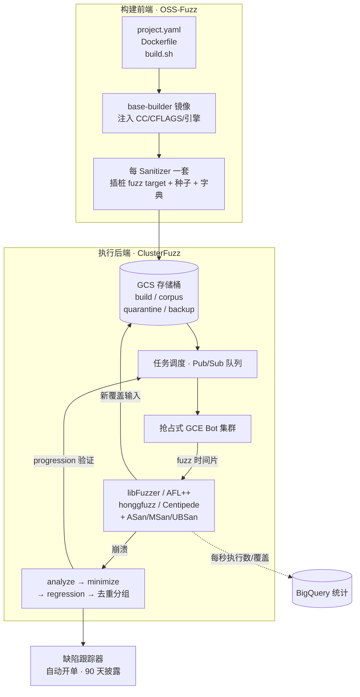
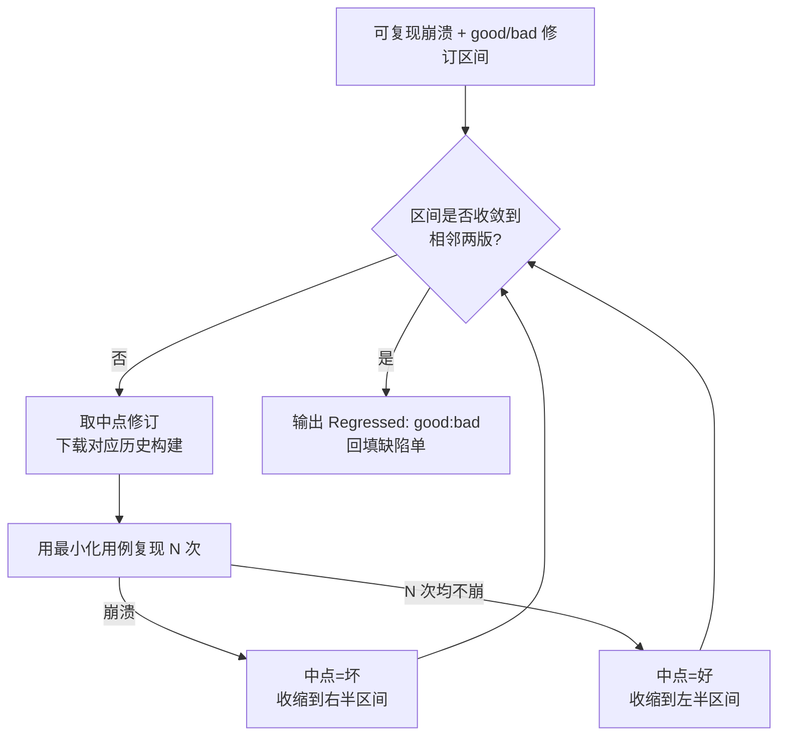
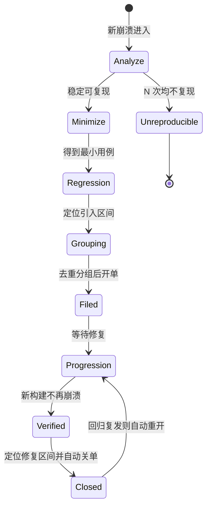

# Fuzzing与漏洞挖掘（17）· 规模化：OSS-Fuzz与ClusterFuzz
> [!abstract] TL;DR
> - OSS-Fuzz 是"前端"（把开源项目的 harness 与构建规约翻译成可持续运行的插桩目标），ClusterFuzz 是"后端"（在抢占式 VM 集群上调度 fuzz/最小化/回归/去重/验证等任务）；二者以 GCS 存储桶彻底解耦，构建产物与语料落桶、Bot 拉桶执行，互不感知对方实现。
> - 持续 fuzzing 的价值不在单次算力峰值，而在"语料的累积记忆"：今天的运行从昨天的语料继续，覆盖随代码演进不断前推；corpus pruning 定期用 `-merge` 按特征去冗余，防止语料膨胀拖慢每轮执行。
> - 崩溃去重靠 `crash type + 归一化的栈顶若干帧` 构成 crash state 签名，把海量崩溃塌缩成少量唯一缺陷；分组（grouping）与变体（variant）任务再把同源用例并到一张单。
> - 回归是对历史构建做二分：regression range 找"引入区间"、progression range 验"修复区间"，自动开单、自动关单、复发自动重开，闭环无需人工盯屏。
> - CIFuzz / ClusterFuzzLite 把同一套引擎前移到 PR/CI，几分钟短跑拦回归；Fuzz Introspector 静态找 harness 盲区，OSS-Fuzz-Gen 用大模型自动生成 harness。
> - 合规红线：这套设施面向"你自己维护或已获授权的开源代码"，是"报给维护者→修复→验证"的防御闭环，不是打他人生产系统的武器。

## 概述与定位

前十六篇讲的都是"一台机器、一个目标、一次运行"的 fuzzing：如何插桩（第 02、04 篇）、如何写 harness（第 08 篇）、如何管语料与字典（第 09 篇）、崩溃如何分类去重（第 16 篇）。这些是"单点战术"。本篇讨论的是"战役级"问题：当你有上千个开源项目、每个项目几十个 fuzz target、需要在代码持续变动的情况下**永不停歇地**测下去，单机脚本立刻崩溃——你需要一套工业化的持续 fuzzing 基础设施。OSS-Fuzz 与 ClusterFuzz 就是这套设施在开源世界里事实上的标准答案。

先厘清二者关系，这是很多人混淆的地方。**ClusterFuzz** 是 Google 内部起于 2011 年前后、最初为 Chrome 打造的分布式 fuzzing 后端；它负责"跑"——在成千上万台机器上调度任务、收集崩溃、去重、最小化、定位回归、验证修复。它对"被测的是什么项目"并不关心，只认"job（作业配置）+ fuzzer（如何产生输入）+ build（带插桩的二进制）"这三样抽象。**OSS-Fuzz** 则是 2016 年 12 月上线的一层"前端 + 准入 + 构建流水线"：它定义了一套"开源项目如何描述自己"的规约（`project.yaml` + `Dockerfile` + `build.sh`），把项目源码编译成带 Sanitizer 与覆盖率插桩的 fuzz target，推到 GCS，然后交给 ClusterFuzz 去跑。换句话说，OSS-Fuzz 把"异构的、五花八门的开源项目"归一化成 ClusterFuzz 能消费的标准物料。ClusterFuzz 已于 2019 年 2 月开源，任何人都能自建后端；OSS-Fuzz 的项目配置本身也全在公开仓库里。

从定位上看，这一篇是整个系列的"收束点"：前面所有引擎（AFL++、libFuzzer、honggfuzz、Centipede）、所有 Sanitizer（ASan/MSan/UBSan）、所有 harness 技巧，在这里被统一编排进一条 7×24 小时的流水线；而它的产物——去重后的崩溃、最小化用例、回归区间、可利用性初判——正是下游"漏洞利用"（见相关阅读）的原料。截至近年，OSS-Fuzz 已覆盖 1000+ 开源项目，累计发现数万个 bug（其中数千个安全问题），成为 libpng、OpenSSL、SQLite、FFmpeg、Linux 内核部分子系统等关键组件的常态化护栏。它的意义不只是"多找了些 bug"，而是把"fuzzing"从一次性的审计动作，变成了像 CI 一样嵌进软件生命周期的持续质量门。

## 原理与机制

理解这套系统，最好的心智模型是**"两层解耦 + 一个存储中枢"**。OSS-Fuzz（构建前端）与 ClusterFuzz（执行后端）之间没有直接 RPC 调用，它们通过 Google Cloud Storage（GCS）上的一组存储桶间接握手：前端把构建产物写进 `build` 桶，后端从桶里拉；后端把新语料写进 `corpus` 桶，下一轮又从桶里拉。这个"以桶为界"的设计是整套系统能横向扩展的根因——生产者与消费者都无状态，随时可增删机器。

**构建侧（OSS-Fuzz）的机制。** 每个项目在 OSS-Fuzz 仓库里有一个目录，含三件套：`project.yaml`（元数据：语言、联系人、启用哪些 Sanitizer/引擎/架构）、`Dockerfile`（从 `gcr.io/oss-fuzz-base/base-builder` 派生，拉取项目源码及依赖）、`build.sh`（真正的编译脚本）。构建时，基础镜像已经把编译器包装好：环境变量 `$CC/$CXX` 指向带插桩的 clang，`$CFLAGS/$CXXFLAGS` 里注入了对应 Sanitizer 的开关和 `-fsanitize=fuzzer-no-link`（SanitizerCoverage 的 PCGUARD 插桩，见第 04 篇），`$LIB_FUZZING_ENGINE` 是一个"引擎无关"的链接占位符。`build.sh` 只需用这些变量把每个 fuzz target 编译出来、链接 `$LIB_FUZZING_ENGINE`、丢进 `$OUT`——它**不关心**最终链接的是 libFuzzer 还是 AFL++ 的 `main()`，这层抽象让同一份 `build.sh` 无改动地适配所有引擎。关键在于：**每种 Sanitizer 是一次独立构建、独立作业**（address / memory / undefined 各一套），因为它们的 ABI 与运行时不兼容，尤其 MSan 需要整条依赖链（含 libc++）都被插桩，base 镜像为此预置了插桩版 libc++。语言支持也靠不同 base 镜像扩展：C/C++ 用原生 libFuzzer，Rust 走 `cargo-fuzz`，Go 有原生 native fuzzing，Python 用 Atheris，JVM（Java/Kotlin）用 Jazzer，JS 用 Jazzer.js，Swift 亦有支持——但它们最终都归一化成"一个能读 `stdin`/内存缓冲的可执行 fuzz target"。

**执行侧（ClusterFuzz）的机制。** 后端是一群运行在 GCE **抢占式（preemptible）虚拟机**上的 Bot。选抢占式实例是刻意的经济学决策：fuzzing 是"高度可并行、可随时中断"的负载——一台机器被云平台随时回收也无所谓，因为它的"成果"（新语料、崩溃)每轮结束都已落到 GCS，进度以语料为检查点，天然抗中断。Bot 从任务队列（Pub/Sub）领任务，任务类型是这套系统的核心词汇：`fuzz`（跑一个时间片，产新语料与崩溃）、`analyze`（判定一个崩溃是否可复现、是否安全相关）、`minimize`（最小化用例与栈）、`regression`（二分定位引入区间）、`progression`（验证是否已修复、找修复区间、自动关单）、`corpus_pruning`（周期性精简语料）、`variant`（把用例拿到别的作业/配置上试跑）、`symbolize`（符号化栈）、`impact`（判定影响到哪些发布分支）。元数据（testcase、fuzzer、job 的状态）存在 Datastore，性能统计（每秒执行数、新边覆盖、崩溃计数）灌进 BigQuery 供仪表盘分析。

**持续 fuzzing 的闭环。** 把上面拼起来就是一条永动的环：构建流水线每天重新编译各项目的最新代码 → 产物落 `build` 桶 → Bot 领 `fuzz` 任务，从 `corpus` 桶下载"昨天的语料"作为起点、跑一个时间片、把发现的新覆盖输入回传 `corpus` 桶、把崩溃交给 `analyze` → 崩溃经 `minimize`/`regression`/去重后自动在缺陷跟踪器开单 → 维护者修复 → `progression` 验证通过后自动关单。整个过程没有"一次性任务"的概念，只有"永远在跑的时间片流"。

## 任务流水线与去重回归详解

这一节把三个"规模化才会遇到的硬问题"拆开讲透：**海量崩溃如何塌缩成少量缺陷（去重）**、**语料如何在持续运行中既共享又不膨胀（语料共享 + pruning）**、**代码持续变动时如何自动定位引入与修复（回归）**。这三点正是本篇的种子，也是单机 fuzzing 永远学不到的工程内核。

### 崩溃去重：从"堆栈签名"到"分组"

规模化 fuzzing 一天能撞出上百万次崩溃，但背后往往只是几十个真实 bug——同一个越界读被不同输入触发无数次。若不去重，缺陷跟踪器会瞬间被淹没。ClusterFuzz 的去重核心是计算一个**crash state（崩溃签名）**：它解析 Sanitizer 的报错输出，抽取三要素——`crash type`（如 `Heap-buffer-overflow READ`、`Null-dereference`、`Stack-overflow`）、`crash address` 的性质、以及归一化后的**栈顶若干帧**（通常取最相关的 3 帧函数名）。这里的"归一化"是关键工程细节：必须**过滤掉噪声帧**——Sanitizer 内部的 `__asan_*`、内存分配器 `malloc/operator new`、常见包装函数——否则同一个 bug 会因为分配路径不同而签名各异。两个崩溃只要 `crash type` 相同且归一化栈顶帧一致，就判为同一 bug。

为什么用"栈顶 3 帧"而非整条栈？因为整条栈会因调用路径不同而发散（过度区分，同 bug 被拆成多单），只用崩溃点函数又会因内联/公共工具函数而过度合并（不同 bug 被并成一单）。取栈顶若干帧是"区分度"与"稳定性"的经验折中，和第 16 篇讲的去重哲学一脉相承，只是这里要在百万量级上工业化落地。签名相同的用例被 `grouping`（分组）逻辑归到一个"leader"用例，共用一张缺陷单；`variant` 任务再把一个用例拿到项目的其他作业/Sanitizer 配置上复现，判断它是否"跨配置同源"，进一步合并。

### 语料共享与 corpus pruning：把"记忆"喂给下一轮

持续 fuzzing 之所以比"跑一次"强，本质是**语料的跨轮累积**。第 09 篇讲过语料是覆盖引导 fuzzing 的"记忆"；在 ClusterFuzz 里，每个 fuzz target 在 `corpus` 桶有一份持久语料：`fuzz` 任务开始时下载它作为起点，结束时把本轮发现的、能触达**新特征（feature/edge）**的输入回传。于是今天从昨天的覆盖继续，覆盖率随时间单调爬升——这正是"持续"二字的技术含义。

但语料不能无限膨胀。libFuzzer/AFL 每轮要把语料里**每个**文件都执行一遍来重建覆盖基线，语料越大，"热身"越慢、每秒有效变异越少，边际收益递减。于是需要周期性的 **corpus_pruning（语料精简）** 任务：它本质是跑 libFuzzer 的 `-merge=1`——把当前语料喂进去，让引擎计算"覆盖相同特征集所需的最小子集"，只保留每个新特征的最短/最早代表，冗余样本移到 `backup` 桶归档。这样语料在"覆盖不丢"的前提下体积受控。pruning 还顺带做两件事：**quarantine（隔离）**——把会崩溃、超时或内存超限的"有毒"样本挪进 `quarantine` 桶，防止它们每轮拖垮 fuzzer；**cross-pollination（交叉授粉）**——在同项目的多个 fuzz target 之间互相借用语料作为额外种子，因为一个 target 发现的有趣输入（如某种文件头）常常能帮另一个 target 更快触达深层代码。引擎间也能共享：libFuzzer 与 AFL++ 都以"原始文件"为语料单位，故同一 target 的语料可在不同引擎间通用，这也是 OSS-Fuzz 敢对同一 target 挂多引擎的前提。

### 回归：二分历史构建，闭环开关单

代码天天变，"这个 bug 是哪次提交引入的、哪次提交修好的"是维护者最想要的信息。ClusterFuzz 用两个方向的**二分（bisection）**回答它。

**regression 任务找"引入区间"**：已知当前用最小化用例能复现崩溃，系统在历史构建序列上二分——取区间中点对应的历史修订版本，下载那个时间点的构建，用最小化用例去跑；若中点崩溃，说明 bug 在更早就存在，取左半；若不崩溃，说明 bug 在中点之后引入，取右半；直到区间收敛到相邻两个修订，输出 `Regressed: good_rev:bad_rev`，贴进缺陷单，维护者按图索骥即可锁定祸首提交。**progression 任务找"修复区间"并验证修复**：对已开单的用例，系统在更新的构建上持续复现；一旦某个新构建不再崩溃，就二分定位"修复区间"，自动把缺陷单标记为已修复并关闭。关单后用例并不丢弃，而是继续偶尔回放——若某天又崩溃（回归复发），自动重开单。这就是"自动开单—验证—关单—复发重开"的完整闭环，人只需在中间写修复。

二分的工程难点是**不稳定崩溃（flaky）**：有些 bug 依赖时序、地址随机化、未初始化内存，不是每次都触发。若二分中某次"没崩溃"其实是漏报，会把区间引到错误方向。对策是每个测试点**重复复现多次**（如 N 次里崩溃≥1 次即判为坏），并对"始终无法稳定复现"的用例单独标记为 `unreproducible`、降权处理，避免污染二分与缺陷单。

### fuzzer 选择、变异策略与最小化

规模化还有个隐形调度层：一个项目有多个 fuzz target、机时有限，该把算力分给谁？ClusterFuzz 用**加权随机（近似多臂老虎机）**来分配——近期新增覆盖多、找到崩溃多的 fuzzer 获得更高权重、更多时间片，"钝掉"的 fuzzer 权重下降但不归零（保留探索）。在单次 `fuzz` 内部，还会按概率开关一组 **libFuzzer 策略**：`value_profile`（值剖面，捕捉比较进度）、`fork`（fork 模式抗崩溃续跑）、`corpus_subset`（只用语料子集提速）、`random_max_len`、`recommended_dictionary`、`mutator_plugin`（如 radamsa 结构变异）等——每种策略并非总开，而是概率性启用，事后用 BigQuery 统计"哪种策略组合在这个 target 上更高产"，反哺权重。这层"元 fuzzing"是单机手动调参根本做不到的，它把第 10 篇的调度思想搬到了跨 target、跨策略的宏观尺度。

`minimize` 任务则把原始崩溃用例做**增量最小化（delta debugging）**：反复删除输入的块/字节，只要删完仍触发"同一 crash state"就接受，直到无法再删——产出的"最小复现件"既便于维护者调试，也让去重签名更稳定。它同时清理栈（去掉无关帧），让缺陷单的报告干净可读。

## 工具视角与实战

**接入一个项目：三件套。** 想让 OSS-Fuzz 测你的开源项目，核心是写好 `project.yaml`、`Dockerfile`、`build.sh`。`project.yaml` 声明 `language`、`primary_contact`、`sanitizers`（默认 address，可加 memory/undefined）、`fuzzing_engines`（默认 libfuzzer，可加 afl/honggfuzz/centipede）、`main_repo`。`Dockerfile` 从 `base-builder` 派生，`git clone` 你的源码与依赖。`build.sh` 用 `$CC/$CXX/$CFLAGS` 编译，把每个 fuzz target 链接 `$LIB_FUZZING_ENGINE` 后放进 `$OUT`，再把种子语料打成 `<target>_seed_corpus.zip`、字典命名为 `<target>.dict` 一并丢进 `$OUT`——命名约定就是接口契约。

**本地复现与调试：`helper.py`。** OSS-Fuzz 仓库根的 `infra/helper.py` 是开发者的主力工具，全程在 Docker 里跑，保证"你本地"与"云端"环境一致：`build_image <project>` 构建镜像；`build_fuzzers [--sanitizer address] <project>` 编译 target；`check_build <project>` 冒烟自检；`run_fuzzer <project> <target>` 本地起跑；拿到云端崩溃后，`reproduce <project> <target> <testcase>` 用下载的最小复现件本地复现——这是维护者收到 OSS-Fuzz 邮件后定位问题的标准第一步；`coverage <project>` 生成本地覆盖率报告，看 harness 到底摸到了哪些代码。一个常见实战陷阱：本地复现不出来，多半是 Sanitizer 或架构（`--architecture i386`）与云端作业不一致，或崩溃本身 flaky——先核对作业配置，再多跑几次。

**左移到 CI：CIFuzz 与 ClusterFuzzLite。** 持续 fuzzing 之外，还应把"回归拦截"前移到代码合入前。**CIFuzz** 是 OSS-Fuzz 项目专享的 GitHub Actions 集成：PR 触发时，只编译本次改动相关的 target、用已有语料短跑（如 10 分钟），当场逮住 PR 引入的崩溃，把复现件作为 CI 工件上传——相当于"提交前的迷你 OSS-Fuzz"。**ClusterFuzzLite** 则是 2021 年推出的**独立轻量版**，不依赖 Google 后端，可跑在 GitHub Actions、GitLab CI 等任意流水线上，把 ClusterFuzz 最有用的能力裁剪打包：PR 代码变更 fuzzing、批量 fuzzing（batch）、语料 pruning、覆盖率报告，语料与崩溃存到你自己的 filestore（如 Git 分支、云存储、CI 缓存）。它的意义是让"没被 OSS-Fuzz 收录、或代码闭源"的团队也能自建同款闭环。

**看清 harness 盲区：Fuzz Introspector 与覆盖率报告。** 光"跑得久"不够，还要知道"没测到哪"。OSS-Fuzz 为每个项目生成公开的**覆盖率报告**（每 target 及聚合），红色即未触达的代码。**Fuzz Introspector** 更进一步做静态分析：找出"覆盖阻塞点"（某个 `if` 挡住了大片深层函数）、列出根本没被任何 harness 调用的函数、并据此**建议新增 harness** 或改进入口——把"该往哪写 harness"从玄学变成数据驱动。近两年的 **OSS-Fuzz-Gen** 再往前一步，用大语言模型读项目 API 自动生成候选 harness、编译验证、择优接入，试图攻克"harness 编写"这个规模化的最大人力瓶颈（见第 08 篇）。

**读统计、追产出。** 所有 fuzzer 的每秒执行数、覆盖边数、崩溃数都进 BigQuery，仪表盘能看出"哪个 target 早就撞墙不涨覆盖了"（该改 harness 或补字典）、"哪个 target 执行速度异常低"（可能 harness 里有 I/O 或全局锁，违反第 08 篇的持久模式原则）。规模化运营的日常，很大一部分就是盯这些曲线做取舍。

## 安全性与正确使用

持续 fuzzing 天生指向真实、可利用的内存破坏漏洞，因此它的**披露纪律**与合规边界必须讲清。OSS-Fuzz 对发现的缺陷采用**限定期限披露**：安全相关的 bug 默认在报告约 **90 天后自动公开**，或在修复合入后约 **30 天公开**，以先到者为准；缺陷单初期仅对维护者与指定的 `auto_ccs` 可见，给上游留出合理修复窗口。这套"有期限但不无限拖延"的策略，是在"给厂商修复时间"与"防止漏洞被长期雪藏危害用户"之间取平衡，与第 16 篇的可利用性初判、下游的利用链分析共同构成负责任披露的一环。安全严重级别由内存工具的报告推导（如可控写 > 越界读），用于排序修复优先级。

工程上也有几处"正确使用"的坑：其一，**语料可能含敏感数据**——某些 target 的种子来自真实样本，OSS-Fuzz 默认不公开各项目语料，自建 ClusterFuzz/ClusterFuzzLite 时也要注意别把含隐私的语料推到公开存储。其二，**flaky 崩溃**不要草率上报，务必先按上文的多次复现判稳，否则会给维护者制造噪声。其三，**Sanitizer 是检测工具不是加固手段**——ASan/MSan 会显著改变内存布局与性能，绝不能带进生产二进制当"防护"，它们只服务于测试环境。其四，**最小复现件是"证据"不是"武器"**：它证明 bug 存在、便于修复，但把它加工成针对真实在网系统的成品攻击链是另一回事，本系列一律止步于"复现与定位"。

> [!caution] 合规边界
> OSS-Fuzz / ClusterFuzz 这类设施的设计前提是"你对被测代码拥有合法权利"——你自己维护的开源项目、已获授权的代码库、CTF 靶场，或隔离的安全研究环境。它的产物是崩溃复现件与回归区间，服务于"报给维护者→修复→验证"的**防御闭环**。请勿用它去 fuzz 你无权触碰的他人生产系统或闭源商业软件以绕过授权，也不要把复现件加工成针对真实目标的武器化攻击步骤。本篇一切内容仅供教育与防御用途：原理讲透，但不提供"打某个真实目标"的成品配方，也不为绕过任何商业授权提供武器化手段。发现第三方开源组件的漏洞时，走上游的负责任披露流程，而非公开 0day 细节。

## 小结

规模化 fuzzing 的本质，是把"单机一次性的战术动作"改造成"嵌进软件生命周期、7×24 自运转的工业流水线"。OSS-Fuzz 与 ClusterFuzz 用"构建前端 + 执行后端 + GCS 存储中枢"的两层解耦，实现了横向可扩展；用"任务化"的 `fuzz/analyze/minimize/regression/progression/corpus_pruning` 把每个环节拆成无状态、可重试、可并行的单元。三个规模化独有的硬核机制值得反复咀嚼：**去重**用 `crash type + 归一化栈顶帧` 的 crash state 把百万崩溃塌缩成少量缺陷；**语料共享**让覆盖跨轮累积、再靠 `-merge` 的 pruning 与 quarantine 防膨胀、防中毒；**回归**用历史构建二分自动定位引入与修复区间，配合多次复现抗 flaky，实现开单—验证—关单—复发重开的全自动闭环。再往外，CIFuzz/ClusterFuzzLite 把同一套能力左移到 PR，Fuzz Introspector 与 OSS-Fuzz-Gen 攻克 harness 盲区与人力瓶颈。当你把前十六篇的引擎、Sanitizer、harness、去重技巧都放进这条流水线，fuzzing 才真正从"一次审计"变成"一道持续质量门"——而它吐出的每一个去重、最小化、带回归区间的崩溃，就是下游漏洞利用研究的起点。

## 相关阅读

- 崩溃转利用（下游）：[[33.二进制漏洞与利用基础/01.内存破坏漏洞全景与利用链模型]]
- 覆盖率反馈的引擎基础：[[48.动态插桩与模拟执行引擎/12.插桩驱动的分析：覆盖率与污点与trace]]
- 内核方向的规模化 fuzzing：[[52.Linux内核机制与内核利用/18.内核Fuzzing与syzkaller]]、[[38.Windows内核与驱动逆向/30.内核Fuzzing]]
- 浏览器/JS 引擎方向：[[54.浏览器与JS引擎漏洞/00.浏览器与JS引擎漏洞总览]]
- 本系列前置：[[16.崩溃分类与去重与可利用性]]（去重哲学）、[[09.语料库与字典与最小化]]（语料与 -merge）、[[08.Harness编写与目标裁剪]]（harness 质量）、[[05.libFuzzer与持久模式]]、[[03.AFL++架构与使用]]、[[07.Sanitizers：ASan与UBSan与MSan]]
- 官方文档：OSS-Fuzz 文档（google.github.io/oss-fuzz）、ClusterFuzz 文档（google.github.io/clusterfuzz）、Fuzz Introspector 与 ClusterFuzzLite 项目文档

[[00.Fuzzing与漏洞挖掘总览|⬆ 系列总览]] | [[16.崩溃分类与去重与可利用性|← 上一章]]
