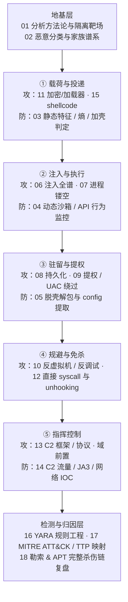
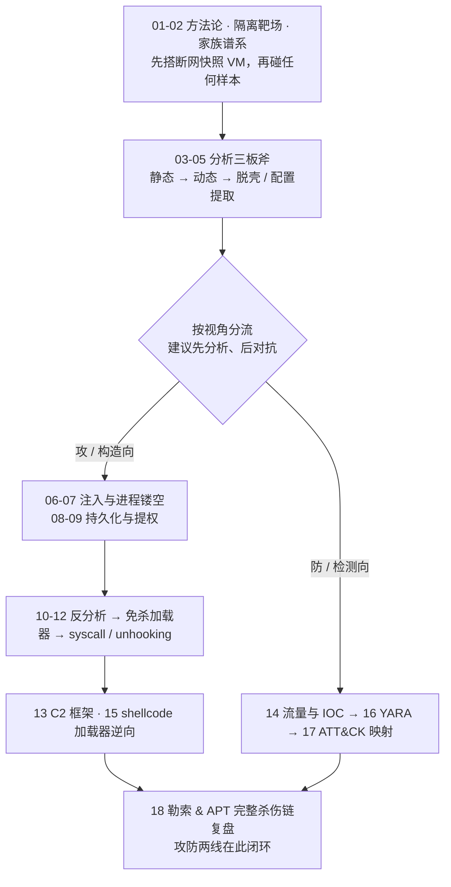

# 恶意代码分析与免杀对抗 · 系列总览

> 作者原创系列，共 **18** 篇。逆向工程的头号应用场景，也是同一枚硬币的两面：**分析者**拆解样本、提取 IOC、落地检测规则，**构造者**打磨注入、免杀与 C2——看懂后者，才谈得上检测前者。内容覆盖样本分析方法论、进程注入与持久化、防御规避与免杀、C2 与流量、YARA 与 ATT&CK 映射，全程立足**防御与研究视角**。串联注入（系列 32）、内核（系列 38）、取证（系列 53）。

下图把 18 篇按**恶意代码生命周期**串成骨架，每一环同时标出「攻（构造/免杀）」与「防（分析/检测）」两侧的对应篇目——二者互为镜像，是贯穿全系列的主线：

## 篇目导航

| # | 章节 | 说明 |
| --- | --- | --- |
| 01 | [[01.恶意代码分析方法论与实验环境]] | 静/动/沙箱三板斧、隔离靶场搭建 |
| 02 | [[02.恶意代码分类与家族谱系]] | 类型学、家族聚类、命名规范 |
| 03 | [[03.静态分析：特征与字符串与导入表]] | PE 特征、IAT、熵、加壳判定 |
| 04 | [[04.动态分析：沙箱与行为监控]] | API 监控、Cuckoo/沙箱、行为图 |
| 05 | [[05.脱壳与解包与配置提取]] | 通用脱壳、OEP、IAT 重建、config 提取 |
| 06 | [[06.进程注入技术全谱]] | 远程线程、APC、SetWindowsHook、注入分类 |
| 07 | [[07.进程镂空与傀儡进程Hollowing]] | Process Hollowing、Doppelganging、Herpaderping |
| 08 | [[08.持久化技术大全]] | 注册表/计划任务/服务/WMI/启动项 |
| 09 | [[09.提权与UAC绕过]] | 令牌窃取、UAC bypass、内核提权入口 |
| 10 | [[10.防御规避：反虚拟机与反调试与反沙箱]] | 环境检测、时间检测、人机检测 |
| 11 | [[11.免杀原理：混淆与加密与加载器]] | shellcode 加密、分阶段加载、签名滥用 |
| 12 | [[12.直接系统调用与unhooking]] | syscall stub、还原被 hook 的 ntdll |
| 13 | [[13.C2框架与通信协议]] | beacon、域前置、隐蔽信道 |
| 14 | [[14.流量分析与网络IOC提取]] | C2 流量、JA3/JA4、IOC，呼应系列 72 |
| 15 | [[15.Shellcode分析与加载器逆向]] | 位置无关码、API 解析、反射加载 |
| 16 | [[16.YARA规则工程]] | 字符串/条件/PE 模块、误报与泛化 |
| 17 | [[17.MITRE-ATTCK与TTP映射]] | 战术技术矩阵、行为归因 |
| 18 | [[18.勒索软件与APT案例剖析]] | 加密流程、横向移动、完整杀伤链复盘 |

推荐阅读路径：先搭环境、打牢分析基本功，吃透「分析三板斧」后再按攻/防两个视角分流推进，最终在 18 的完整杀伤链复盘中让两条线闭环：

> [!warning] 合规边界与学习建议
> **合规边界**：本系列自始至终立足**分析者与防御者视角**——研究攻击技术是为了检测、取证与加固。文中原理与技术**仅限在自有或已获书面授权的环境、CTF 靶场、隔离沙箱中用于安全研究与教育**；严禁针对未授权系统实施注入、持久化、免杀或 C2 通信等行为。真实样本务必在**断网、快照、无共享目录**的专用虚拟机中运行，避免误感染宿主与内网。
> **学习建议**：
> - **务必先读 01**：没有隔离靶场就不要碰任何真实样本；静/动/沙箱三板斧是后续每一篇的公共前提。
> - **先分析、后对抗**：先吃透 03-05「怎么拆样本」，再看 06-13「样本怎么造」——有了分析视角，你才看得懂每种攻击留下的可观测痕迹（API、句柄、内存、流量），免杀章节也才不至于沦为脚本堆砌。
> - **攻防对照阅读**：06 注入 ↔ 04 行为监控、11 免杀 ↔ 03 静态特征、13 C2 ↔ 14 流量 IOC，成对理解「构造」与「检测」如何互为镜像。
> - **落到检测**：每学一种技术，回到 16 YARA 与 17 ATT&CK 追问「它的检测特征与 TTP 编号是什么」，把技术沉淀为可复用的检测能力。
> - **横向串联**：注入细节深挖 [[32.hooks/00.总览|系列 32]]，主机痕迹的落地取证转 [[53.数字取证与事件响应/00.数字取证与事件响应总览|系列 53]]。

## 与知识库既有体系的衔接

- 注入承接：[[32.hooks/11-process-injection]]、[[32.hooks/12-kernel-hook]]、[[32.hooks/15-etw]]
- 取证下游：[[53.数字取证与事件响应/00.数字取证与事件响应总览]]（内存取证印证行为）
- 流量呼应：[[72.抓包与协议分析实战/12.流量特征分析与检测绕过]]、[[72.抓包与协议分析实战/19.网络取证与流重组]]
- 语言逆向：[[27.Go与Rust现代二进制逆向/00.Go与Rust现代二进制逆向总览]]（现代样本）
