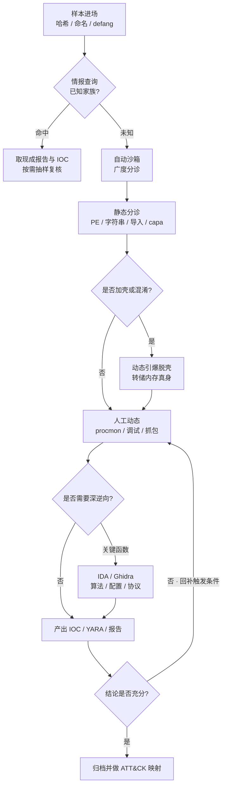
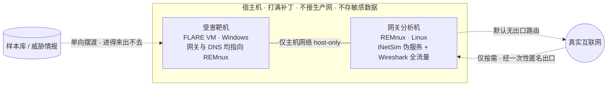
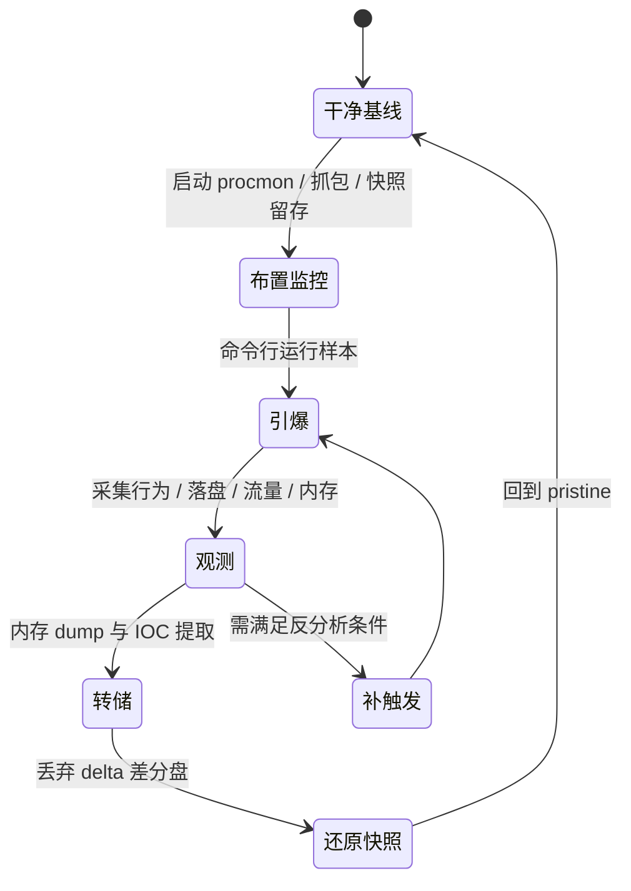

# 恶意代码分析与免杀对抗（1）· 恶意代码分析方法论与实验环境
> [!abstract] TL;DR
> - 静态、动态、沙箱这"三板斧"不是三选一，而是围绕 **解包 → 定位 → 验证** 相互补位的迭代循环：动态帮静态脱壳，静态帮动态找触发条件，沙箱做广度分诊、人工做深度剖析。
> - 方法论的核心是 **分诊漏斗 + 时间预算**：先用哈希/情报/沙箱/PE 分诊筛掉"不值得深挖"的，把 IDA/Ghidra 级的深逆向只留给真正关键的几个函数；不是每个样本都要读到最后一条指令。
> - 隔离靶场的 **四层隔离——物理 / 网络 / 快照 / 单向摆渡** 缺一层就可能反噬：样本联网即入僵尸网络、快照不还原即跨样本交叉污染、摆渡不单向即反向感染宿主。
> - 网络要"假联网"：**INetSim / FakeNet-NG** 伪造 DNS/HTTP/TLS 让样本吐出 C2 行为，同时不真正触达真实 C2——既保 OPSEC、不当帮凶，又避免样本因 C2 已下线而"装死"。
> - **FLARE VM（Windows 靶机）+ REMnux（Linux 网关/分析）** 是事实标准组合；VMware 的写时复制快照与链接克隆，是"可复现分析"这件事的物理地基。
> - 静态"代码全覆盖但会被加壳废掉"，动态"看真身却只覆盖执行到的路径"，沙箱"快而规模化却易被指纹识别"——理解三者各自的天敌，才知道下一步该切换到哪把斧头。

## 概述与定位

恶意代码分析（malware analysis）要回答的问题其实很朴素：**这段代码做了什么、怎么做的、和谁通信、如何检测与清除、以及大概是谁干的。** 围绕这五问，分析工作服务于四类目标，每一类对"分析要做到多深"有完全不同的要求：一是 **事件响应**——评估已发生入侵的能力与影响范围，回答"它偷了什么、还在不在、横向到哪了"；二是 **检测工程**——从样本里榨出可落地的检测物（IOC、YARA、Sigma），让下一次同族样本进门就被拦；三是 **威胁情报**——提取 TTP、做家族聚类与归因，把单个样本抬升为对一个攻击组织的画像；四是 **加固与研究**——理解攻击面与免杀原理，反过来改进防御与检测规则。

这四类目标背后有一条贯穿全书的价值判断，叫 **痛苦金字塔（Pyramid of Pain，David Bianco）**：你提取的检测物越靠近攻击者的"行为与工具链"，让对手换掉它的成本就越高。哈希值处在金字塔最底层——攻击者改一个字节就能让你的哈希失效，代价几乎为零；IP 与域名稍高，但换个 VPS、换个域名仍然廉价；而 **TTP（战术、技术、流程）** 在塔尖——要让攻击者放弃"用进程镂空注入 + 计划任务持久化 + HTTPS 心跳回连"这一整套打法，等于逼他重写工具、重训人。这解释了为什么现代分析不满足于"算个哈希扔进黑名单"，而要一路挖到行为层面。理解这一点，你才能判断某个样本"分析到什么程度就够了"。

本篇是整个系列的 **方法论骨架 + 环境地基**，只讲两件元问题：**用什么方法分析、在什么地方分析**。具体的静态特征与导入表提取放在 [[03.静态分析：特征与字符串与导入表|第 3 篇]]，动态行为监控与沙箱内幕在 [[04.动态分析：沙箱与行为监控|第 4 篇]]，脱壳解包在 [[05.脱壳与解包与配置提取|第 5 篇]]，各类攻击技术（注入、镂空、持久化、提权）在第 6–9 篇，反分析对抗在 [[10.防御规避：反虚拟机与反调试与反沙箱|第 10 篇]]，免杀原理在第 11–12 篇，规则工程与 TTP 映射在第 16–17 篇。本篇不重复它们的细节，而是把它们串成一张"何时用哪把斧头、在哪把斧头砍"的作业地图。

## 原理与机制

三板斧的分野，本质是 **"看不看它跑、以及谁来看它跑"** 这两个维度的组合。

**静态分析（static analysis）** 是不执行样本、只检查文件本体：解析 PE/ELF 结构、看节区与熵、抽字符串、读导入表、反汇编/反编译。它的第一性优势是 **代码全覆盖**——理论上文件里所有分支都摆在你面前，包括那些只在特定日期、特定受害者、特定命令下才走的隐藏逻辑；第二是 **绝对安全**，因为你根本没运行它。但静态有一个无法回避的理论天花板：**精确反汇编在一般情况下是不可判定的**。间接跳转（`call eax`）的目标依赖运行期的值、数据与代码混在同一节区、自修改代码（self-modifying code）在磁盘上根本"不是"它运行时的样子——这些让"把字节完美还原成控制流图"退化成停机问题的近亲。而加壳、混淆、字符串加密则是攻击者主动把这个天花板砸到你头顶：磁盘上你看到的是一个解压桩加一坨高熵密文，真正的恶意逻辑要等它自己在内存里解开才存在。**静态的天敌就是加壳/混淆/加密。**

**动态分析（dynamic analysis）** 是让它真的跑起来、在旁边观察：监控 API 调用、系统调用、文件/注册表/进程/网络行为。它天然 **化解加壳**——不管壳多复杂，样本要执行就必须把真身解到内存，你在解完的那一刻转储（dump）内存，就拿到了明文。但动态有对称的软肋：**只覆盖这一次实际执行到的路径**。样本今天没连上 C2、没等到触发日期、没检测到目标域环境，那条恶意分支就不会走，你也就看不到——这是动态分析的"代码覆盖问题"。更麻烦的是 **观察者效应**：监控本身会改变被观察对象。调试器一挂上，样本用 `IsDebuggerPresent`、时间差、`INT3` 扫描就能发现你在看；检测到虚拟机或沙箱指纹，它就装死、只做无害动作。**动态的天敌是反调试/反虚拟机/环境触发/长睡眠/C2 下线。**

**沙箱（automated sandbox）** 是把动态分析自动化、规模化——通过 hook、内核回调、或 hypervisor 级内省（VMI）自动跑样本、自动出报告。优势是 **快、批量、结论一致**，一天能过成千上万个样本，非常适合分诊。但它把动态的软肋放大了：环境是模板化的，指纹最容易被识别；分析有时间窗（跑几分钟就杀），长睡眠或延迟执行就能熬过去；缺少人机交互（不点"下一步"、不输密码），需要交互才展开的样本它推不动；顶尖样本甚至能 **逃逸沙箱**。

关键的方法论洞见在于 **三者互补、迭代补位**，而不是各自为战：用动态把壳解开、转储真身，再对真身做静态精读；用静态找到隐藏的触发条件（某个 mutex、某个日期、某个域名），再回到动态去人为满足它、逼出恶意分支；用沙箱做第一轮广度筛查，把可疑的少数交给人工做深度。下面这张图就是这条"回补触发条件"的迭代循环：



三把斧头的取舍可以压成一张对照表——它其实就是"下一步该切换到哪把斧头"的决策依据：

```
维度          静态分析            动态分析            自动沙箱
是否执行      否                  是                  是（自动）
代码覆盖      全覆盖（理论）      仅执行路径          仅执行路径
对抗加壳      失效                自动脱壳            多数能脱壳
主要天敌      加壳/混淆/加密      反VM/反调试/睡眠    环境指纹/逃逸
速度与规模    中                  慢（人工重）        快（可批量）
安全性        最高（不运行）      中（需隔离）        中（需隔离）
```

## 分析流程与靶场架构详解

方法论的落地有两根支柱：**一套分诊漏斗**决定"怎么分配注意力"，**一座隔离靶场**决定"在哪安全地跑"。这一节把两者都拆到机制层。

### 分诊漏斗与时间预算

新手最典型的错误是拿到样本就 `File → Open` 丢进 IDA 从入口点一条条读——这在工业规模下是灾难。正确姿势是 **漏斗式分诊**：每一层只做到"足以决定下一步"，越往下越贵、样本越少。第一层是 **哈希与情报查询**：算 SHA-256，去 MalwareBazaar / 内部情报库比对，命中已知家族就直接取现成报告，抽样复核即可（这一步就能筛掉一大半重复样本）；第二层是 **自动沙箱** 做广度覆盖，几分钟出一份行为概览；第三层是 **静态分诊**——用 DIE 看壳、pestudio 看导入表与字符串、capa 做能力画像；第四层才是 **人工动态**——procmon、调试器、抓包；最后一层、也是最贵的一层，是 **深度逆向**，且只针对少数关键函数：解密算法、配置解析、C2 协议编码。

支撑漏斗的是 **时间预算** 意识：分析目标决定深度。事件响应里"确认落了哪些文件、连了哪个 C2、怎么持久化"往往在动态层就够了，不必读完加密算法；而写高质量 YARA 或做家族归因，就必须深逆到配置结构和字符串解码。把有限的注意力花在金字塔越靠上的检测物上，是分析师的核心素养。

### 四层隔离靶场

靶场的设计原则一句话：**假设样本会尽一切努力逃出去、并反噬你。** 于是要叠四层独立隔离，任何一层都不能省。



**第一层，物理/宿主隔离。** 用一台专用机，不接生产网、宿主打满补丁、不在宿主上存任何敏感数据。为什么要到"专用机"这么狠？因为 **虚拟机逃逸（VM escape）0day 真实存在**——历史上 VMware、VirtualBox 都出过能从 guest 打穿到 host 的漏洞，一旦样本恰好带了这类武器，你的宿主就是它的下一跳。宿主既然可能沦陷，就当它迟早会沦陷来设计：无敏感数据、可随时重置。

**第二层，网络隔离。** 靶机与网关都挂在 **仅主机网络（host-only）** 的隔离网段，物理上无路由通往真实互联网或公司内网。这是防止两件事：样本联网 **对外**——探活、拉二阶段 payload、连 C2 回传，任何一次真实外联都可能让你的机器加入僵尸网络、或向攻击者暴露"你在分析我"；样本联网 **对内**——蠕虫类样本会扫段横向自我复制，没有网络围栏它能顺着共享和漏洞感染整个实验网。

**第三层，快照隔离。** 每次引爆前从 **干净基线快照** 出发，引爆、观测、转储之后 **必须还原**。原理是 **写时复制（copy-on-write）差分盘**：base 盘只读、所有改动写进 delta 差分盘，还原就是丢弃 delta、秒回原点。**live snapshot** 连内存与设备状态一起存，可把"正在运行、断在某条指令"的状态整个冻结、随时回放。为什么非还原不可？样本会改注册表、装服务、建计划任务、注入进程、落一堆文件——不还原，下一个样本就在被上一个污染的环境里跑，行为归因全乱，可复现性彻底崩掉。**链接克隆（linked clone）** 则让多台分析机共享同一 base 盘，只各自维护差分，省下大量磁盘。

**第四层，单向摆渡。** 样本要"进得来、出不去"。共享文件夹、剪贴板、拖放这些便利通道都是双向的、都是逃逸捷径，引爆时必须关闭。样本进场走一次性单向拷贝，产出物（内存 dump、IOC）出场同样受控。

### 网络要"假联网"

把网络完全掐死会带来一个副作用：很多样本探测不到网络就装死，你反而看不到它的真面目。解法是 **假联网**——用伪服务骗它"以为"上了网。**INetSim**（跑在 REMnux 网关上）伪装成整个互联网：DNS 泛解析（不管查什么域名都回网关自己的 IP）、HTTP/HTTPS 返回假响应、还有 SMTP/FTP/IRC 等一大票协议；靶机的默认网关与 DNS 都指向 REMnux，于是样本的每一次外联都落进网关、被 Wireshark 全量记录。**FakeNet-NG**（跑在 Windows 靶机本机）则做进程级重定向，好处是能在 TLS 握手前拿到 SNI、甚至在应用层看到明文。这样既拿到了 C2 域名、URL、User-Agent、心跳格式这些宝贵 IOC，又 **没有真正触达真实 C2**——不打草惊蛇、不当帮凶。偶尔确实需要真 payload 时，才做"半放行"（只放 DNS 看它查什么，或经一次性匿名出口取一次二阶段），这属于要专门评估风险的决策，绝非默认。

### 引爆-还原循环与 VM/裸机之辨

一次动态分析在靶场里的生命周期是一个严格的状态机——它保证了每次分析都从同一个 pristine 起点出发，这正是"可复现"的机制来源：



虚拟化平台的取舍：**VMware Workstation** 是首选，快照与链接克隆最成熟、artifacts 相对少（虽然仍可被检测）；**VirtualBox** 免费但指纹更显眼——`VBoxGuest` 驱动、一堆特征注册表键、特有 MAC OUI，反 VM 样本一测一个准。当碰到反虚拟化极狠、一进 VM 就装死的样本时，就退到 **裸机（bare metal）**，配合硬件还原卡、PXE 网络重装或 Deep Freeze 之类的还原方案来解决"没有快照"的问题。另一条路线是 **hypervisor 级内省（VMI）**——像 DRAKVUF、CAPEv2 那样从虚拟机 **外部** 观测 guest，样本在 guest 里根本 hook 不到监控点，天然抗"检测到我被监控"这类对抗。反 VM 的具体指纹与绕过细节属于 [[10.防御规避：反虚拟机与反调试与反沙箱|第 10 篇]]，此处只点到平台选型。

### 数据流与产出物

整条流水线的输入是"一个危险的文件"，输出是"一组可复用的知识"：样本进场先做哈希与 defang 化命名，经分诊、分析后产出 **IOC**（哈希、域名、IP、mutex、注册表键、文件路径、证书）、**YARA/Sigma 规则**、**行为报告**，最后映射到 **MITRE ATT&CK**（详见 [[17.MITRE-ATTCK与TTP映射|第 17 篇]]）归档。内存取证能与动态行为相互印证——同一个注入行为，你在 procmon 看到 `WriteProcessMemory`，在内存镜像里能看到目标进程多出的可执行私有内存页，两条证据链交叉验证，见 [[53.数字取证与事件响应/00.数字取证与事件响应总览|数字取证与事件响应总览]]。

## 工具视角与实战

把工具链摊成一张地图，按漏斗层次归类（各工具的深用法分散在后续各篇，这里只建立"手感"）：

- **分诊与静态**：PE-bear / CFF Explorer（PE 结构）、Detect It Easy（DIE，识别编译器与壳）、pestudio（导入表/字符串/熵/黑名单 API 一屏看全）、capa（基于规则把二进制的"能力"映射到 ATT&CK）、FLOSS（自动提取栈上/堆上解码出来的隐藏字符串）、exiftool、YARA。
- **反汇编/反编译**：IDA Pro、Ghidra（NSA 开源、带反编译器）、Binary Ninja、radare2/rizin，以及 x64dbg（Windows 用户态调试首选）。
- **动态监控**：Process Monitor（文件/注册表/进程/网络全量事件）、System Informer（前 Process Hacker）、Autoruns（自启动点巡检）、TCPView、API Monitor、Sysmon（长期行为日志）。
- **网络**：Wireshark、INetSim、FakeNet-NG、mitmproxy/Fiddler（TLS 中间人看明文）。
- **内存**：Volatility 3（配合取证篇做内存证据）。
- **沙箱**：CAPEv2（开源、内建脱壳与配置提取，工程价值最高）、Cuckoo（经典但已停维护）、以及 Joe Sandbox / Any.run / Hybrid Analysis / Hatching Triage 等在线平台。
- **环境发行版**：FLARE VM（Mandiant，Windows，靠 Chocolatey/BoxStarter 一键装数百工具）、REMnux（Lenny Zeltser，Linux 网关与分析集大成）、Commando VM（偏攻击，分析用得少）。

一个真实的分诊起手式大致如下——注意它体现的两条纪律：**先哈希只查不传、不加壳判断绝不盲上调试器**：

```bash
# 1) 先算哈希、去情报库比对（只查不传：上传公开平台 = 打草惊蛇）
sha256sum sample.bin        # 拿 hash 去 MalwareBazaar / 内部库查已知家族

# 2) 看文件真身与壳，决定要不要先脱壳
die sample.bin              # Detect It Easy：编译器 / 加壳 / 加密识别
pestudio sample.bin         # 导入表 / 字符串 / 熵 / 可疑 API 一屏

# 3) 能力画像（不执行、直接映射 ATT&CK）
capa -v sample.bin          # 命中"注入 / 持久化 / 反调试"等能力

# 4) 抠隐藏字符串（自动解码栈上/堆上的混淆串）
floss sample.bin            # FLARE FLOSS
```

跑完这四步，你已经能判断它"值不值得深挖、下一步该脱壳还是直接引爆"。**关于 VirtualTotal 的红线要单独强调**：查哈希是安全的，但 **上传样本等于公开发布**——针对 APT 的分析中，攻击者会监控 VT 的新样本，一上传就等于通知对方"你的工具暴露了"，逼他立刻换基础设施、甚至清痕迹。因此"只查哈希、不传样本"是 OPSEC 常识，不是可选项。

## 安全性与正确使用

> [!caution] 合规与安全边界（务必逐条遵守）
> - 本篇所有方法与环境搭建，**仅限用于你自有或已获明确书面授权的系统、CTF/靶场与安全研究**，且一律站在 **防御与教育** 视角。
> - **不提供、也不要索取**针对真实生产系统或他人系统的武器化步骤；原理可以讲透，但本系列不给"打某个真实目标"的成品配方，也不为绕过任何商业软件授权提供武器化手段。
> - 活体样本是 **危险品**：存储与传递一律加密压缩（口令惯用 `infected`）、改后缀（如 `.bin`/`.mal`）、URL 做 defang（`hxxp://`、`evil[.]com`），**绝不在生产机或联网主机上双击**。
> - 引爆网络 **不得路由到你的真实 IP 或任何生产/公司网**；确需与真实 C2 交互时经一次性匿名出口，并评估暴露与法律风险。
> - 默认 **不向任何公开平台上传样本**（既泄露、又打草惊蛇）；只查哈希。样本库要做访问控制与传播管控。

除了上面的硬边界，还有几处工程细节值得展开。**逃逸与反噬** 是靶场安全的头号威胁：VM 逃逸 0day 会让"隔离"失效，所以宿主要当"迟早沦陷"来设计——无敏感数据、可整机重置、不接生产网。**蠕虫样本** 要格外收紧网络围栏：一旦它开始扫段横向，隔离网段就是你和"整个实验网被感染"之间唯一的墙。**观察者效应的伦理与实务** 也在此：因为监控会改变样本行为，分析报告要如实标注"哪些行为是在放行网络/满足了哪些触发条件下才出现的"，避免给出误导性的"它不会外联"这种结论。最后，**合法性** 不只在于"别攻击别人"，也在于样本的持有与流转——某些地区对恶意代码的存储、传播本身就有法律约束，务必在授权与合规框架内行事，把一切产出用于让防守方更强，而不是相反。

## 小结

这一篇搭的是整个系列的地基。方法论上，记住三板斧是 **互补的迭代循环** 而非单选题：静态代码全覆盖却怕加壳，动态见真身却只覆盖执行路径，沙箱快而规模化却易被指纹识别——理解各自的天敌，才知道卡住时该换哪把斧头；而 **分诊漏斗 + 时间预算 + 痛苦金字塔** 三者合起来，决定了你把有限注意力投向何处、挖到多深才停。环境上，记住 **四层隔离**（物理/网络/快照/单向摆渡）缺一不可，**假联网**（INetSim/FakeNet）是逼出 C2 行为又不失守的关键，**FLARE VM + REMnux + VMware 快照** 是可复现分析的事实标准。后续各篇会沿着这条漏斗逐层深入：先是 [[02.恶意代码分类与家族谱系|分类与家族谱系]] 帮你在分诊时快速定位，再到静态、动态、脱壳、各类攻击技术、反分析对抗、免杀与规则工程——本篇给出的作业地图，会一直挂在墙上。

## 相关阅读

- 书目：《Practical Malware Analysis》(Sikorski & Honig，恶意代码分析圣经)、《Practical Binary Analysis》、《The Art of Memory Forensics》、《Malware Analyst's Cookbook》。
- 环境与工具官方文档：REMnux（remnux.org）、FLARE VM（GitHub: mandiant/flare-vm）、INetSim（inetsim.org）、FakeNet-NG（GitHub: mandiant/flare-fakenet-ng）、CAPEv2（GitHub: kevoreilly/CAPEv2）、capa（GitHub: mandiant/capa）。
- 框架与理念：MITRE ATT&CK（attack.mitre.org）、David Bianco "The Pyramid of Pain"。
- 本系列（承接与前瞻）：[[00.恶意代码分析与免杀对抗总览|系列总览]]、[[02.恶意代码分类与家族谱系]]、[[03.静态分析：特征与字符串与导入表]]、[[04.动态分析：沙箱与行为监控]]、[[05.脱壳与解包与配置提取]]、[[10.防御规避：反虚拟机与反调试与反沙箱]]、[[17.MITRE-ATTCK与TTP映射]]。
- 同库交叉：注入承接 [[32.hooks/11-process-injection]]、[[32.hooks/12-kernel-hook]]、[[32.hooks/15-etw]]；取证下游（内存印证行为）[[53.数字取证与事件响应/00.数字取证与事件响应总览]]；流量呼应 [[72.抓包与协议分析实战/12.流量特征分析与检测绕过]]、[[72.抓包与协议分析实战/19.网络取证与流重组]]；现代样本语言逆向 [[27.Go与Rust现代二进制逆向/00.Go与Rust现代二进制逆向总览]]。

[[00.恶意代码分析与免杀对抗总览|⬆ 系列总览]] | [[02.恶意代码分类与家族谱系|→ 下一章]]
