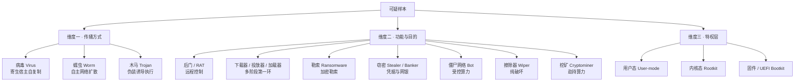
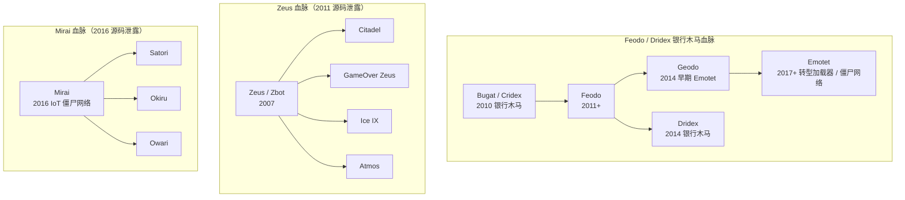
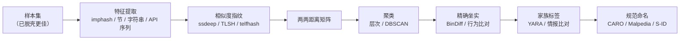

# 恶意代码分析与免杀对抗（2）· 恶意代码分类与家族谱系
> [!abstract] TL;DR
> - 恶意代码有两条**正交**的分类轴：按「行为与目的」的类型学（type taxonomy：木马 / 蠕虫 / 勒索 / RAT…）回答「它干什么」，按「代码血缘」的家族谱系（family lineage）回答「谁写的、从哪演化来」；类型是可叠加的标签集合，家族才是稳定的身份。
> - 单个现代样本往往同时命中多个类型：一条 loader→banker→ransomware 的多阶段链里，投放器、后门、加密载荷各是一层，用「主类型 + 附加能力」而非互斥枚举来描述才准确。
> - 家族聚类的本质是**相似度度量的阶梯**：加密哈希（精确、抗混淆为零）→ imphash / Rich header（构建工具链指纹）→ ssdeep / TLSH 模糊哈希 → BinDiff 控制流图同构 → 沙箱行为向量，越往上越抗变形，成本也越高。
> - 命名混乱是行业顽疾：同一样本各厂商各起名（WannaCry = WCry = WanaCrypt0r = WannaCrypt），CARO 方案给出 `类型:平台/家族.变种!后缀` 的结构化模板，Malpedia / MITRE Software S-ID / MISP galaxy 充当跨厂商的规范锚点。
> - 源码泄露与 builder / MaaS 让谱系树枝繁叶茂：Zeus 源码泄露催生 Citadel / GameOver / Ice IX，Mirai 泄露衍生数百 IoT 变种，Bugat→Feodo→Dridex / Emotet 是一条教科书级的银行木马血脉。
> - 归因要克制：false flag（伪旗）、共享 builder、affiliate（联盟制）都会污染「家族→组织」的映射，分类是威胁情报的**起点**而非终点，任何家族标签都应带置信度而非当成事实。

## 概述与定位

分类不是给样本贴标签的文书工作，而是把「一个未知二进制」压缩成「一组可检索、可复用、可比较的身份坐标」的信息工程。上一篇《恶意代码分析方法论与实验环境》解决的是「如何在隔离环境里安全地看清一个样本」，本篇解决的是它的前置与并行问题：**当分析结果出来后，我该把它放进威胁全景的哪个位置**。没有分类，每个样本都是孤岛，检测规则无法复用、情报无法关联、响应无法排序；有了分类，一个新样本可以立刻继承整个家族已知的 C2、TTP、解密逻辑与处置经验。

要理解本篇，先要在脑子里立起两根**互相垂直**的坐标轴，这是整篇文章的骨架，也是初学者最容易混为一谈的地方：

- **类型学（横轴，功能维度）**：描述样本「做什么」。木马、蠕虫、勒索软件、RAT、下载器、窃密器、擦除器……这是一个**行为/意图**的分类，回答「它对受害者造成什么后果、通过什么方式传播」。同一份代码，功能变了类型就变。
- **家族谱系（纵轴，血缘维度）**：描述样本「是谁、从哪来」。Emotet、TrickBot、Cobalt Strike、LockBit……这是一个**代码同源**的分类，回答「这段代码和历史上哪些样本共享作者、共享代码库、共享构建工具链」。功能可以变，但只要还是那套代码基座，血缘就不变。

这两轴为什么必须分开？因为它们的**稳定性与用途**完全不同。类型是易变的表层：Emotet 出道时是银行木马（横轴上的 banker），2017 年后转型成投放 TrickBot / Ryuk 的加载器与僵尸网络（横轴上的 loader/botnet）——它在横轴上大幅位移，但纵轴上始终是 Emotet 这一家族。反过来，勒索这个类型（横轴一个点）下面挤着 LockBit、BlackCat、Conti、REvil 等血缘各异的家族（纵轴上分散的多点）。**用横轴做检测与影响评估，用纵轴做情报关联与归因**——混用两者，就会写出「查杀所有勒索软件」这种既做不到又无意义的需求。

本篇在系列里的定位是「地图」：它先于第 3～5 篇的具体分析技法（静态特征、动态沙箱、脱壳），为它们提供**分类的目标语言**——你静态提取导入表、动态观测行为，最终都要落到「这属于哪个类型、哪个家族」这个判断上。因此本篇不深入任何单项分析技术（那是后续各篇的主场），而是讲透**分类体系本身**：类型学的维度划分、家族的定义与聚类算法、命名规范的结构与乱象。读完它，你再看后面每一篇，都会知道自己挖到的每一个特征最终服务于坐标系上的哪个投影。

## 原理与机制

### 类型学：多维度而非单一枚举

初学者常把恶意代码类型当成一个互斥的下拉框，这是根本性的误解。真实的类型学是**多个正交维度的组合**，一个样本是这些维度上的一个点集，而非单选。至少有三个维度值得独立看待：

**维度一：传播方式（如何到达并扩散）。** 这是最经典的三分法，也是「病毒 / 蠕虫 / 木马」这组老词的本义来源：

- **病毒（Virus）**：把自身代码**寄生**注入到宿主文件（可执行文件、文档宏、引导扇区）中，依赖宿主被执行才激活并感染下一个宿主，本质是「需要载体的自复制」。今天纯文件感染型病毒已相对少见，但宏病毒、感染型 PE 病毒（如 Virut、Sality）仍在。
- **蠕虫（Worm）**：**自主**地通过网络传播，无需寄生宿主、无需用户交互，典型靠漏洞利用（EternalBlue 之于 WannaCry）、弱口令爆破或可移动介质自我复制。蠕虫的杀伤力在于**指数级横向扩散**。
- **木马（Trojan）**：**伪装**成有用或无害的程序诱导用户主动执行，本身不自我复制，靠社会工程（钓鱼附件、破解软件、假更新）投递。今天绝大多数商品化恶意代码在传播维度上都是木马。

**维度二：功能与目的（执行后做什么）。** 这是实战中最常用、也最细的维度，常见类别包括：

- **后门（Backdoor）/ 远控木马（RAT，Remote Access Trojan）**：给攻击者持久的远程交互能力，RAT 通常带图形化控制端（njRAT、Quasar、Gh0st）。
- **下载器 / 投放器 / 加载器（Downloader / Dropper / Loader）**：本身几乎无恶意功能，职责是把「真正的载荷」带上场。Downloader 从网络拉取，Dropper 把内嵌载荷落地，Loader 负责在内存里解密并执行下一阶段——三者是多阶段攻击链的第一环，也是最常被单独作为家族识别（如 GuLoader、SmokeLoader、BumbleBee）。
- **勒索软件（Ransomware）**：加密文件或锁屏索要赎金，现代多带「双重勒索」（先窃取再加密）。
- **窃密类（Stealer / Spyware / Keylogger / Banker）**：窃取凭据、Cookie、钱包、键盘输入或劫持网银会话（RedLine、Vidar、银行木马 Dridex）。
- **僵尸网络客户端（Bot）**：把主机纳入受控网络听候 C2 指令，可租用于 DDoS、代理、发垃圾邮件（Mirai、Emotet）。
- **擦除器（Wiper）**：**不为钱、只为毁**，破坏数据或引导记录使系统不可恢复（NotPetya、多起针对性破坏事件），常伪装成勒索软件但根本没有可用的解密路径。
- **挖矿木马（Cryptominer）**：劫持算力挖加密货币，图财但不直接破坏数据。
- **广告软件 / 潜在有害程序（Adware / PUA）**：灰色地带，滋扰但危害较低。

**维度三：特权层与驻留位置（运行在哪一层）。** 同样的功能，跑在不同层意味着截然不同的隐蔽性与清除难度：

- **用户态（User-mode）**：绝大多数样本，运行在普通进程权限，最易被 EDR 观测。
- **内核态 Rootkit**：驻留内核，篡改系统调用 / 对象以隐藏文件、进程、网络连接，对抗力极强（内核挂钩细节见 [[32.hooks/12-kernel-hook]]）。
- **固件 / UEFI Bootkit**：驻留在操作系统之下的引导链或固件，重装系统都清不掉（LoJax、MoonBounce 等）。



理解了这三个维度，就能看穿一个关键事实：**「多阶段」是现代恶意代码的常态，单一类型标签几乎总是不完整的。** 一封钓鱼邮件里的宏文档（传播=木马，功能=downloader）拉下一个 loader（功能=loader，特权=用户态），loader 解密出一个 RAT（功能=后门），RAT 再投放勒索载荷（功能=ransomware）。给这条链只贴一个「勒索软件」标签，会丢掉前三环全部的检测与情报价值。正确的描述是**主类型 + 能力集合**：例如「Emotet：加载器 / 僵尸网络，具备信息窃取与横向移动能力」。

### 家族：什么把一堆样本绑成「一家」

如果说类型学是水平切片，家族就是垂直的血缘归并。**家族（family）的定义核心是「代码同源」**：一组样本共享足够多的代码、结构或独特实现细节，以至于可以合理推断它们出自同一套源码基座或同一批作者。围绕家族，有一组必须厘清的层级概念：

- **变种 / 版本（variant / version）**：同一家族在时间上的迭代，A、B、C…或按内部版本号区分。变种间差异小（改了 C2、换了加密密钥、加了个规避手法），血缘明确。
- **家族（family）**：变种的集合，是**最有情报价值的粒度**——一个家族名能索引出它全部已知的 IOC、TTP、解密工具与处置经验。
- **战役 / 活动（campaign）**：一次有时间、目标、基础设施边界的具体攻击行动，可能用到多个家族。campaign 是**运营维度**，与家族（代码维度）正交。
- **威胁行为体 / 组织（threat actor / group）**：APT28、Lazarus、FIN7…是**人的维度**。一个组织可用多个家族，一个家族（尤其是商品化或泄露的）也可被多个组织使用。**家族 ≠ 组织**，这是归因中最常被跨越的红线。

家族的判定为什么难？因为攻击者会主动破坏「同源可见性」，而工业化又制造了「非同源的相似」，两股力量夹击：

- **多态 / 变形 / 加壳（polymorphism / metamorphism / packing）**：每次生成的样本字节完全不同，精确哈希彻底失效，表层特征被打散。脱壳是恢复同源可见性的前提（见第 5 篇）。
- **Builder / 生成器**：一个图形化 builder（Zeus builder、njRAT builder）能吐出成千上万看似不同、实则同族的样本——同源但表面各异。
- **恶意代码即服务（MaaS）/ 勒索即服务（RaaS）**：家族由核心团队开发，**联盟成员（affiliate）**租用来打各自的目标。于是同一家族（如 LockBit）背后是许多互不相干的组织，**家族聚类到了、组织归因却不能想当然**。
- **源码泄露与抄袭**：泄露的源码（Zeus 2011、Mirai 2016、Babuk 2021、Conti 2022）被大量二次开发，制造出「血缘上确有渊源、但作者已换人」的复杂谱系；而 Hidden Tear 这类「教学用」开源勒索 POC 更被无数抄袭者套壳，导致「代码相似但并无真正组织关联」的噪声。



上图三条谱系正好覆盖三种血缘扩张模式：**Feodo 系**是同一团队持续演化（横轴上从 banker 漂移到 loader，纵轴血缘连续）；**Zeus 系**是源码泄露后多团队分叉（一次泄露炸出一片子家族）；**Mirai 系**是开源代码被 IoT 黑产海量魔改（变种以百计，多数只改配置与传播模块）。分析师在建家族树时，必须分清一个新样本是「同队迭代」「泄露分叉」还是「抄袭套壳」，因为三者对归因的含义完全不同。

## 相似度、聚类与命名详解

这一节是本篇的技术核心：**如何用可计算的相似度，把打散、加壳、变形后的样本重新归并成家族，再给归并结果一个规范的名字。** 我们沿「相似度阶梯」从最脆到最强逐级拆解，每一级都讲清它测的是什么、为什么这么设计、在哪里失效。

### 第 0 级：加密哈希——精确定位，零抗变形

MD5 / SHA-1 / SHA-256 对样本整体做单向散列，改动一个字节结果就雪崩式全变。它的用途是**精确去重与 IOC 交换**（「这个 SHA-256 我见过吗」），是一切样本库的主键。但它对家族聚类**完全无用**：多态、加壳、甚至重新编译一次都会得到全新哈希。理解这一点很重要——它划定了后续所有「模糊 / 结构」相似度存在的理由：我们需要的是「改一点、相似度只降一点」的**局部敏感**度量，而加密哈希的设计目标恰恰相反（雪崩效应）。

### 第 1 级：结构指纹——imphash 与 Rich header

不看字节整体，而看 PE 文件里**由编译 / 链接过程决定、随源码稳定**的结构痕迹。

**imphash（导入表哈希）** 是最常用的家族信号之一。算法（以业界事实标准 `pefile` 的实现为准）大致是：遍历 PE 导入目录，对每个被导入的函数，构造字符串 `dll名.函数名`——DLL 名转小写并剥掉 `.dll/.ocx/.sys` 等扩展名，按序号导入的则解析知名序号或退化成 `ord序号`；把所有这些字符串**按它们在导入表中出现的原始顺序**用逗号拼起来，取 MD5。

它为什么能标识家族？关键在**顺序**：导入表的排布顺序由编译器 / 链接器根据源码中 API 的引用方式与链接选项决定，同一套源码用同一工具链编译，导入表顺序高度稳定，于是 imphash 相同的样本**极可能同源或至少同构建环境**。它的边界同样清晰而致命：

- **加壳会毁掉它**——壳自己的导入表（往往只有 `LoadLibrary` / `GetProcAddress` 寥寥几个）覆盖了真实导入，于是「一堆不同家族但用同一个壳」的样本共享同一个 imphash，这时 imphash 标识的是**壳**而非家族，误判风险极大。
- **静态链接 / 极简导入**（如 Go、Rust、部分 shellcode loader）导入表太小，imphash 退化、区分度趋零。
- 因此 imphash 只是**弱信号**：命中相同要结合其它证据，不同却**不能**据此判定不同族。

**Rich header 哈希** 更进一步。微软链接器会在 DOS stub 与 PE 头之间塞一段未公开的「Rich」数据，记录参与构建的每个工具组件（编译器 / 汇编器 / 链接器）的 **product id 与精确 build 号**及使用次数，用一个 XOR 密钥编码。对这段数据做哈希，就得到了一个**构建工具链的精细指纹**——它反映的是「这台开发机上装的 VS 版本组合」，比 imphash 更贴近作者环境，是高价值的聚类与归因信号。但要牢记它可被**伪造**：Olympic Destroyer 事件里攻击者精心伪造 Rich header 制造指向他人的伪旗，正是这类结构指纹「可被主动污染」的经典教训。

### 第 2 级：模糊哈希——ssdeep 与 TLSH

结构指纹只看头部元数据，模糊哈希则对**整体字节流**给出「改一点、分数降一点」的相似度，这才是狭义上「相似度聚类」的主力。

**ssdeep（CTPH，上下文触发分片哈希）** 的巧思在于**用内容本身决定分片边界**。它拿一个**滚动哈希**在字节流上滑动固定窗口，滚动哈希只与窗口内当前若干字节有关；当滚动哈希对某个「分片大小」取模等于特定值时，就在此处切一刀，作为一个分片边界（触发点）。每切出一段，用一个传统哈希（FNV 系）压成**一个 base64 字符**，串起来就是签名，形式为 `分片大小:签名A:签名B`。比较时对两个签名串算加权编辑距离，映射到 0～100 分。

它为什么抗局部改动？因为边界由**内容触发**：在文件中间插入 / 删除一段，只会打乱插入点附近的分片，前后其余分片的边界与哈希字符不变，于是签名大部分对齐、分数只小幅下降——这正是加密哈希做不到的。它的边界也很实在：两个签名必须**分片大小相同或相差一倍**才可比；对小文件不稳定；面对「均匀分散的大量小改动」或刻意错位会明显失效，且**容易被针对性规避**（攻击者知道触发机制就能主动打乱边界）。

**TLSH（局部敏感哈希）** 是对 ssdeep 弱点的工程回应。它滑动一个 5 字节窗口，从窗口内字节的多个三元组经 Pearson 哈希落进 128 个桶计数；再对桶计数求分位点，把「每个桶计数相对分位点的高低」量化成 2 bit，连同长度、校验、分位比等头部信息拼成定长摘要。比较用近似汉明 / 差异距离：**0 表示极近，数值越大越远**（经验上几十以内算相似）。相比 ssdeep，TLSH 的数学性质更好、对较大文件更稳、对随机小改动更鲁棒，且**没有「分片大小必须匹配才能比」的硬约束**，因此更适合做大规模两两聚类；代价是需要最小字节量（约 50/256 字节起）、对极小样本不适用。**实战常两者并用**：ssdeep 直觉快、生态老，TLSH 稳、适合建距离矩阵。

跨平台还有专用变体，理解它们「为何要另起炉灶」比记名字更重要：**telfhash** 针对 ELF——ELF 的导入顺序不像 PE 那样稳定，故改用导入 / 导出**符号名集合**再套 TLSH，专治 Linux / IoT 恶意代码（Mirai 变种聚类利器）；**gimphash** 针对 Go——Go 静态链接、几乎没有传统导入表，imphash 失效，于是改从 Go 的函数名 / pclntab 提取指纹（现代 Go/Rust 样本的逆向背景见 [[27.Go与Rust现代二进制逆向/00.Go与Rust现代二进制逆向总览]]）。

### 第 3 级：代码级相似——控制流图同构

模糊哈希看字节，字节会被指令重排、寄存器分配变化、编译优化搅乱。**代码级相似**跳过字节、直接比**结构**：把每个函数还原成控制流图（CFG），再在整个二进制的调用图上做**图匹配**。业界基准工具 **BinDiff** 用函数的结构特征（基本块数、边数、指令助记符序列的哈希、调用关系等）在两个二进制间建立函数对应，输出相似度与置信度；其 IDA 上的开源同类是 **Diaphora**。

它的威力在于**近乎无视表层混淆**：只要控制流骨架还在，改字节、换字符串、重命名都动摇不了图的拓扑，因此能精确回答「新样本和已知家族在代码层面重合了多少」「哪些函数是新增的」——这对**版本演化分析**（如逐版本追踪 TrickBot 模块变化）价值极高。代价是**慢且重**：需要反汇编、构图、图匹配，是 O(样本对) 的昂贵操作，只适合小规模精细比对，不适合对海量库做初筛。所以现实流程是**先用模糊哈希 / imphash 粗聚类，再对可疑同族用 BinDiff 精确坐实**。

### 第 4 级：行为聚类——从动态报告提特征

以上都在看静态形态。**行为聚类**换一个视角：把样本丢进沙箱（见第 4 篇），把它跑出来的 **API 调用序列、释放的文件、注册表改动、互斥量名、网络行为**抽成特征向量，再聚类。它的独特价值是**天然穿透加壳与静态混淆**——壳再花哨，最终解密执行的行为暴露在动态轨迹里。局限是**环境敏感**（反沙箱、需触发条件的样本可能不暴露真身，见第 10 篇的反虚拟机 / 反沙箱）、且行为可能因配置不同而族内差异大。

### 聚类如何落地：从指纹到标签

有了相似度度量，聚类本身是标准数据挖掘流程：对样本集提特征 → 算**两两距离矩阵** → 跑聚类算法。算法选择各有取舍：**层次聚类**能给出谱系树状结构、契合「家族树」的直觉但计算量大；**DBSCAN** 基于密度、无需预设簇数、能自然剔除离群点（很适合恶意代码这种「有明确密集族 + 大量噪声」的数据）；**k-means** 快但要预设 k、且假设球形簇，对恶意代码并不理想。聚出簇后还要**打标签**：用 YARA 规则命中已知家族特征（YARA 规则工程见第 16 篇）、比对威胁情报库、人工确认，最终把簇绑定到一个家族名。



### 命名规范：结构、乱象与锚点

聚出家族只完成一半，还要**给它一个可交流的名字**——而这恰恰是全行业最混乱的环节。

结构化命名的事实标准是 **CARO 命名方案**（Computer Antivirus Research Organization），微软杀毒引擎至今沿用其变体。它的模板把一个检测名拆成分层字段：

```
Trojan:Win32/Emotet.A!bit
  │      │      │     │ │
  │      │      │     │ └─ 后缀 suffix：!bit 检出方式 / 自动化标记，.gen 泛化，!ml 机器学习命中
  │      │      │     └─── 变种 variant：A、B…AA，按发现先后递增
  │      │      └───────── 家族 family：分析师命名的核心身份
  │      └──────────────── 平台 platform：Win32 / Win64 / MSIL / JS / VBS / AndroidOS / Linux…
  └─────────────────────── 类型 type：Trojan / Worm / Ransom / PWS / Backdoor…
```

这个模板的好处是**一个名字里同时编码了横轴（type）、平台与纵轴（family）**，机器可解析、可聚合。但 CARO 只约束**格式**，不约束**家族名叫什么**——于是灾难来了：**同一个家族，每家厂商各起各的名**。WannaCry 有 WCry / WanaCrypt0r / WannaCrypt / Wanna Decryptor 等一串别名；Emotet 又被叫 Geodo / Heodo；Zeus 又叫 Zbot。原因是各厂商独立发现、独立命名，且抢首发命名权有市场价值，缺乏强制的中央注册（早年 CME「通用恶意代码枚举」试过统一编号，未成气候）。这种**别名地狱**让跨厂商情报关联寸步难行。

现实中靠几个**规范锚点**来收敛：

- **Malpedia**（Fraunhofer FKIE）：为每个家族维护一个规范名与别名映射、样本与文献，是学术 / 研究界事实上的「家族身份证」。
- **MITRE ATT&CK Software**：给知名恶意代码 / 工具分配稳定的 **S 编号**（如 `S0367` Emotet），并区分 **Malware**（专用恶意代码）与 **Tool**（Cobalt Strike、PsExec 这类可两用工具）——这个区分很关键，因为红队工具与恶意代码在检测语义上不同。ATT&CK 的 TTP 映射见第 17 篇。
- **MISP galaxy / 威胁情报平台**：以机器可读的簇（cluster）+ 同义词维护家族、组织、工具的关联，供自动化关联消费。
- **MalwareBazaar / 沙箱标签**：以社区标签（signature 字段）提供快速、众包的家族归类，覆盖广但质量参差，宜作线索而非定论。

最后必须把**组织命名**与**家族命名**彻底分开——这是另一套平行的乱象。厂商给威胁组织起的是**代号**而非结构名：Mandiant 的 `APT##`（APT28/APT29），CrowdStrike 按国家用动物（Fancy Bear=俄、Panda=中、Kitten=伊），微软 2023 年起改用「天气 + 元素」体系（Midnight Blizzard=俄、Volt Typhoon=中、Sandstorm=伊）。同一个组织在不同厂商笔下有五六个名字，和家族别名地狱如出一辙。**记住：APT28 是「人」，Emotet 是「代码」，二者绝不能划等号——尤其在 MaaS / affiliate 模式下，一个家族背后可能站着许多互不相干的组织。**

## 工具视角与实战

把上面的阶梯落到趁手的工具上，一个典型的「分类分诊」工作流是：**先算精确哈希去重 → 提结构指纹初判 → 模糊哈希粗聚类 → 情报库比对 → 必要时 BinDiff / 沙箱坐实**。

**结构指纹（Python + pefile）。** 拿 imphash 与 Rich header 做第一刀，几行就够：

```python
import pefile
pe = pefile.PE("sample.bin")
print("imphash :", pe.get_imphash())          # 导入表 MD5 指纹
# Rich header（存在时）用于构建工具链聚类 / 归因
rich = pe.parse_rich_header()
print("rich    :", rich.get("checksum") if rich else None)
```

拿到 imphash 后，直接把它丢进 VirusTotal / 样本库做「同 imphash 检索」，往往一步就把样本圈进一个候选族——但**务必记得先判断是否加壳**（若壳把导入表覆盖了，这个 imphash 标识的是壳）。

**模糊哈希（命令行）。** ssdeep 与 TLSH 都有 CLI，适合对一批样本互算相似度：

```bash
ssdeep -b *.bin > hashes.ss          # 生成签名
ssdeep -m hashes.ss suspect.bin      # 匹配某样本与库中相似项（0-100 分）
tlsh -c a.bin -f b.bin               # 输出两样本 TLSH 距离（越小越像）
```

工程上更常用它们的 **Python 绑定**（`ssdeep`、`py-tlsh`）批量建距离矩阵，再喂给 `scipy` 的层次聚类或 `sklearn` 的 DBSCAN 出簇。ELF/IoT 样本改用 `telfhash`，Go 样本用 `gimphash`。

**情报与规范化查询。** 手上有指纹后，比对这些权威源：**VirusTotal**（看多引擎检测名，但要有别名地狱的心理准备，别把某一家的名字当定论）、**Malpedia**（查家族规范名与别名、要 YARA 规则）、**MalwareBazaar**（按 tag / imphash / TLSH 拉同类样本）、**MITRE ATT&CK**（查家族 S 编号与 TTP）。跨引擎名字打架时，**取 Malpedia 规范名或 MITRE S-ID 作为你上报的锚点**，并在报告里附上各厂商别名。

**代码坐实（BinDiff / Diaphora）。** 当粗聚类给出「疑似 A 家族」但要确证时，用 BinDiff 对新样本与已知 A 家族样本做函数级比对，看重合率与新增函数——这是把「相似」升级成「同源」的证据级手段，也是版本演化分析的主力。

**YARA 作为家族识别器。** 家族一旦确认，产出一条覆盖其**稳定独特特征**（特定解密常量、独有字符串、代码片段）的 YARA 规则，之后同族样本入库即自动打标——这是把「一次人工分类」沉淀成「持续自动分类」的关键闭环（规则如何写得既敏感又不误报，见第 16 篇）。

**关联建库（MISP）。** 团队规模化时，用 MISP 把样本、家族簇、组织、campaign、IOC 关联进图，让每个新样本自动继承其家族已知的一切上下文——这才是分类工程的终态：分类不是为了贴标签，而是为了让**关联**发生。下游的内存取证如何印证这些行为判断，可参见 [[53.数字取证与事件响应/00.数字取证与事件响应总览]]；网络侧的家族特征提取见 [[72.抓包与协议分析实战/12.流量特征分析与检测绕过]]。

## 安全性与正确使用

分类与聚类看似「只是分析、不碰目标」，但它接触**真实活体样本**、并直接影响**归因结论**，两头都有雷。

> [!caution] 合规与伦理边界
> - **仅限授权环境**：本篇涉及的样本获取、指纹计算、聚类比对，只应在自有 / 授权的隔离实验室、CTF 靶场或正当安全研究中进行；活体样本的处置、隔离与销毁须遵循第 1 篇《方法论与实验环境》的规程（离线 / 快照 / 限网），绝不在生产网或他人系统上运行样本。
> - **纯防御 / 教育视角**：全文对相似度、命名、谱系的讲解，目的是**识别、检测、关联与响应**恶意代码；不提供、也不隐含任何针对真实生产系统或他人资产的武器化步骤，不为绕过商业授权、伪造检测名或规避正版校验提供成品配方。
> - **别把家族当组织、别把猜测当事实**：任何家族标签、任何「疑似某组织」的结论都应带**置信度**，明确写清依据与不确定性。false flag（如 Olympic Destroyer 伪造 Rich header 与代码痕迹嫁祸他人）、共享 builder、泄露源码二次开发、MaaS/affiliate 模式，都会让「代码相似」不等于「同一伙人」。过度归因既可能造成误伤，也可能被攻击者反向利用。
> - **样本与情报的合规流转**：真实样本、受害者数据、内部 IOC 的共享须遵守数据保护与情报共享的既定协议（如 TLP 分级），不随意外传、不将含敏感信息的样本上传到公开沙箱。

在正确性层面，还有几条务实纪律：**不要用单一信号定族**——imphash 相同可能只是同壳，ssdeep 高分也可能是同一 builder 的空壳；**先脱壳再聚类**，否则你聚的是壳不是家族；**保留别名与出处**，上报时以 Malpedia / MITRE 规范名为锚并附各厂商别名，避免把团队困在某一家的命名孤岛里；**给结论留可证伪的证据链**（哪些函数经 BinDiff 重合、哪条 YARA 命中），让别人能复核而非盲信。分类的价值在于可复用与可关联，而可复用的前提是**诚实标注置信度**。

## 小结

本篇把「恶意代码分类」拆成两根正交的轴讲透：**横轴类型学**回答「做什么」，是可叠加的多维标签（传播方式 / 功能目的 / 特权层），现代多阶段样本几乎总是「主类型 + 能力集合」而非单选；**纵轴家族谱系**回答「谁写的、从哪来」，以代码同源为核心，并要与变种、campaign、组织这些相邻概念严格分层。两轴用途不同：横轴驱动检测与影响评估，纵轴驱动情报关联与归因，混用即出错。

技术核心是**相似度阶梯**：加密哈希（精确、零抗变形）→ imphash / Rich header（构建指纹）→ ssdeep / TLSH（模糊哈希，改一点降一点）→ BinDiff（控制流图同源坐实）→ 行为聚类（穿透加壳），越往上越抗混淆、成本越高，实战是「粗聚类 + 精坐实」的组合拳。命名层面，CARO 给出 `类型:平台/家族.变种!后缀` 的结构，但家族名的**别名地狱**要靠 Malpedia / MITRE S-ID / MISP galaxy 这些锚点收敛；而组织命名是另一套平行代号体系，**家族绝不等于组织**。最后，源码泄露、builder、MaaS 与 false flag 让谱系与归因充满噪声，一切标签都应带置信度。带着这张地图，你就能把后续静态（第 3 篇）、动态（第 4 篇）、脱壳（第 5 篇）挖到的每一个特征，准确地投影回类型与家族的坐标系上。

## 相关阅读

- 系列上下文：[[00.恶意代码分析与免杀对抗总览|系列总览]]、[[01.恶意代码分析方法论与实验环境]]（样本处置与实验室规程）、[[03.静态分析：特征与字符串与导入表]]（导入表 / 字符串正是聚类的特征来源）、[[05.脱壳与解包与配置提取]]（聚类前先脱壳）、[[16.YARA规则工程]]（把分类沉淀为自动识别）、[[17.MITRE-ATTCK与TTP映射]]（家族到 TTP 的规范映射）、[[18.勒索软件与APT案例剖析]]（谱系与归因的综合案例）。
- 同库交叉：[[32.hooks/11-process-injection]]、[[32.hooks/12-kernel-hook]]、[[32.hooks/15-etw]]（Rootkit 与内核层类型的技术背景）、[[53.数字取证与事件响应/00.数字取证与事件响应总览]]（内存取证印证行为分类）、[[72.抓包与协议分析实战/12.流量特征分析与检测绕过]]、[[72.抓包与协议分析实战/19.网络取证与流重组]]（网络侧家族特征）、[[27.Go与Rust现代二进制逆向/00.Go与Rust现代二进制逆向总览]]（现代语言样本的指纹变体）。
- 权威规范与参考：CARO Malware Naming Scheme（恶意代码命名结构的原始约定）；Malpedia（Fraunhofer FKIE，家族规范名与别名库）；MITRE ATT&CK Software（家族 / 工具 S 编号与 TTP）；MISP Galaxy（机器可读的家族 / 组织簇）；ssdeep（Jesse Kornblum，CTPH 分片哈希）与 TLSH（Trend Micro 局部敏感哈希）原始论文；《Practical Malware Analysis》(Sikorski & Honig) 与《Malware Analyst's Cookbook》(分类与聚类章节)。

[[00.恶意代码分析与免杀对抗总览|⬆ 系列总览]] | [[01.恶意代码分析方法论与实验环境|← 上一章]] | [[03.静态分析：特征与字符串与导入表|→ 下一章]]
