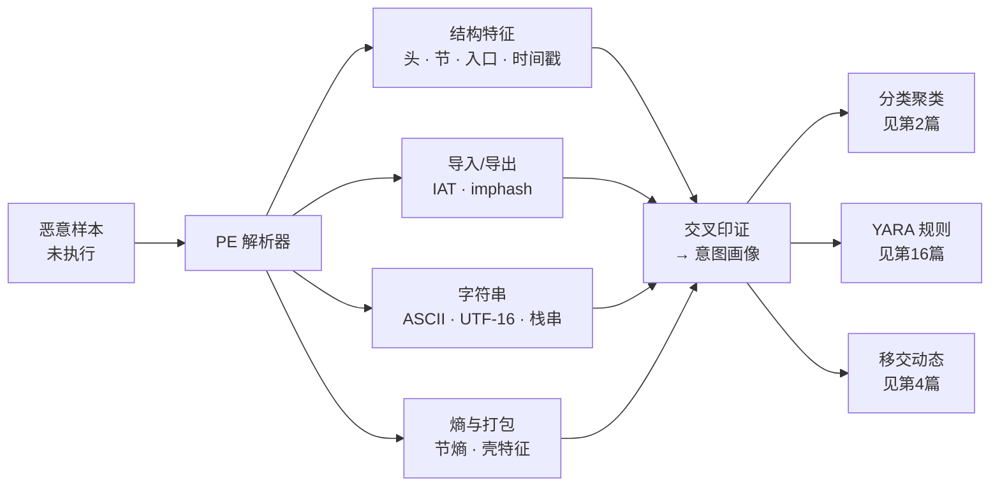
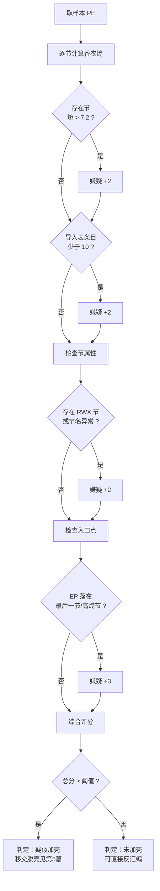
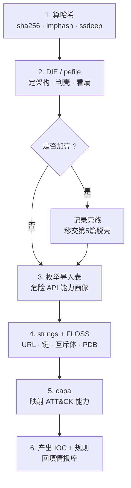

# 恶意代码分析与免杀对抗（3）· 静态分析：特征与字符串与导入表
> [!abstract] TL;DR
> - 静态分析在**不执行样本**的前提下，从 PE 结构、字符串、导入表、熵这四条证据链交叉印证样本意图，是分诊（triage）、分类聚类与检测规则的第一手来源。
> - 导入表用 **INT/IAT 双表**设计：INT（名字表）供加载器查名、不被覆盖；IAT（地址表）在加载时被改写为真实函数地址。导入稀疏且只剩 `LoadLibrary`/`GetProcAddress` 是加壳与动态解析的强信号。
> - 香农熵 `H = -Σ p·log2(p) ∈ [0, 8]`：代码段约 6.0–6.7，压缩/加密段 >7.2 逼近 8；但 PNG/证书/.NET 资源天然高熵会误报，判壳必须结合**节名、RWX 属性、入口点位置**综合评分而非单一阈值。
> - **imphash / Rich Header 哈希 / ssdeep / TLSH** 把「结构指纹」压成可比较、可聚类的键，是把单个样本升格为家族的桥梁（谱系归属见第 2 篇）。
> - **FLOSS** 反混淆栈字符串与解密字符串，弥补 `strings` 只能看明文的天花板；**capa** 把「导入 + 反汇编」映射到 ATT&CK 能力标签。
> - 静态特征可被壳、混淆、API 哈希抹平，是「必要不充分」证据：本篇**只判壳不脱壳**（脱壳见第 5 篇），行为确证交给动态分析（第 4 篇）。

## 概述与定位

静态分析（static analysis）指在**不让样本运行**的情况下，仅凭其磁盘上的字节形态推断其结构、能力与意图。它是恶意代码分析「静 / 动 / 沙箱」三板斧（见第 1 篇）中门槛最低、成本最省、也最安全的一环：无需引爆、无需还原快照，一台离线主机、一组解析工具即可对成千上万份样本做流水线分诊。它产出的每一条特征——一个可疑的导入函数、一段硬编码的 URL、一节异常的高熵数据——既是人工研判的线索，也是喂给下游**家族聚类**（第 2 篇）与 **YARA 规则**（第 16 篇）的原料。

本篇把静态分析收敛到四条最具信息密度的证据链上：**PE 结构特征**（头部字段、节表、入口点、时间戳）、**导入 / 导出表**（IAT、imphash）、**字符串**（ASCII / UTF-16 / 栈字符串）、**熵与加壳判定**。这四者不是孤立指标，而是要相互印证：一个「导入表只有三个函数、`.text` 之外还有一节 7.9 熵的 RWX 数据、入口点落在最后一节」的样本，四条链同时报警，几乎可以断言它被压缩壳保护——任何单条证据都可能误报，四条同时命中才构成可采信的画像。

必须先划清边界，避免与相邻篇重复：本篇**判壳而不脱壳**——识别「它被加壳了、是什么壳、壳藏在哪一节」属于本篇；而如何 dump 内存、定位 OEP、重建 IAT 则是第 5 篇《脱壳与解包与配置提取》的任务。本篇也**不碰动态**——导入表里出现 `CreateRemoteThread` 只能说明它「具备注入能力」，真正观察它注入了谁、写了什么 shellcode，属于第 4 篇的动态监控与第 6 篇的注入全谱。本篇更**不展开 YARA 语法**，只在特征层面为规则工程供料。

为什么先做静态、且必须先做静态？三个理由。其一是**安全**：不执行就不会触发载荷，分析者不必先承担被反噬的风险。其二是**规模**：哈希、熵、imphash 都是纯计算，可对海量样本秒级批处理，先用静态把「明显加壳 / 明显是某家族 / 明显是安装器」的样本筛掉，把昂贵的动态资源留给真正难缠的目标。其三是**上游性**：动态分析看到的行为，往往要回到静态特征里找「它为什么会这么做」的证据锚点。当然，静态天然是一场军备竞赛——攻击者会主动用壳、字符串加密、导入混淆、API 哈希来抹平这些特征，所以静态结论永远是「必要不充分」，这条对抗主线会贯穿第 10–12 篇。

本篇以 Windows PE 为主战场（恶意代码的绝对主场），ELF / Mach-O 有对应物但字段名不同；.NET 托管样本与 Go / Rust 现代样本在字符串、导入、符号形态上另有特殊性，后者可参见 [[27.Go与Rust现代二进制逆向/00.Go与Rust现代二进制逆向总览]]。

## 原理与机制

### PE 是一张「自描述地图」

要理解静态特征从何而来，先要理解一个反直觉的事实：**可执行文件必须向操作系统交代自己该如何被加载**。加载器（loader）不是猜测，而是照着文件头里明文写着的「地图」把各节映射到内存、修正重定位、填充导入地址。正因为这张地图是给加载器看的、必须准确，它也就**无可避免地向分析者泄漏了样本的结构与意图**——攻击者想藏，就得同时骗过加载器和分析者，代价陡增。

PE 的整体布局自文件头依次为：DOS 头（以 `MZ` 开头，末尾 `e_lfanew` 指向 PE 头）→ DOS Stub（那句 "This program cannot be run in DOS mode"）→ Rich Header（MSVC 工具链留下的指纹，后文详述）→ NT 头（`PE\0\0` 签名 + 文件头 `IMAGE_FILE_HEADER` + 可选头 `IMAGE_OPTIONAL_HEADER` 及其 16 项数据目录）→ 节表（section table）→ 各节原始数据。分析者与加载器共享的核心换算是 **RVA（相对虚拟地址）与文件偏移（`PointerToRawData`）之间的映射**：同一个导入表，在磁盘上按 `FileAlignment`（常见 0x200）对齐，在内存里按 `SectionAlignment`（常见 0x1000）对齐，二者不同，人工定位数据必须先根据节表把 RVA 换算成文件偏移。PE 各字段的完整语义已在 [[13.PE文件详解/00-合集总览-PE文件详解]] 系列穷尽，本篇只挑「betray intent（出卖意图）」的字段讲。

```
DOS 头（前 64 字节）关键字段
  偏移 0x00:  4D 5A ...            "MZ" 魔数（EXE 的历史包袱）
  偏移 0x3C:  e_lfanew (DWORD)     指向 NT 头的文件偏移，例如 0x000000F0
NT 头（位于 e_lfanew 处）
  +0x00:      50 45 00 00          "PE\0\0" 签名
  +0x04:      IMAGE_FILE_HEADER    Machine / NumberOfSections / TimeDateStamp / Characteristics
  +0x18:      IMAGE_OPTIONAL_HEADER Magic(0x10B=PE32,0x20B=PE32+) / AddressOfEntryPoint / ImageBase / DllCharacteristics / DataDirectory[16]
```

### 四条静态证据链

把 PE 这张地图拆开，恰好对应四条可批量提取、可交叉印证的证据链，如下图。分析者的工作不是逐字段罗列，而是让四条链彼此校验，收敛出「意图画像」，再决定这份样本是直接反汇编、还是移交脱壳 / 动态。



**结构特征链**里最值钱的几个字段：`Machine` 定架构（0x14C=x86，0x8664=x64，0xAA64=ARM64），`Subsystem` 分 GUI / 控制台（无窗口的控制台后门与有界面的诱饵性质迥异），`Characteristics` 的 `IMAGE_FILE_DLL` 位区分 EXE 与 DLL（后者暗示需要 rundll32 / 侧加载）。`TimeDateStamp`（编译时间戳）本可用于溯源与聚类，但**极易伪造或清零**——Go 编译器直接置零，攻击者也常填入 0 或未来时间做假旗，故只能作弱证据。`DllCharacteristics` 则暴露安全姿态：是否开启 ASLR（`DYNAMIC_BASE`）、DEP（`NX_COMPAT`）、CFG（`GUARD_CF`）——一个刻意关闭 ASLR、没有 `.reloc` 节的样本，往往是为了让载荷落在固定地址方便硬编码，本身就是可疑信号。`AddressOfEntryPoint`（入口点 EP）尤其关键：正常编译的 EP 落在 `.text`，若 EP 落在最后一节或一节高熵数据里，几乎必然是壳的解压桩。

**字符串链**是「明文意图的泄漏」。任何程序都难免留下明文：C2 域名 / IP、注册表键、互斥体名、文件路径、命令行、错误提示、甚至开发者忘删的 PDB 调试路径（能暴露工程名、用户名乃至攻击者代号）。原理简单——扫描字节流中连续可打印字符的游程，Windows 上要同时抽 **ASCII（单字节）与 UTF-16LE（Unicode 宽字符）**，因为大量 Win32 API 用宽字符，只抽 ASCII 会漏掉半壁江山。

**导入链与熵链**是本篇最硬核的两条，下面单列。

### 导入表：程序向系统「点菜」的清单

PE 文件本身只装自己的代码，凡是要调用操作系统或第三方 DLL 的功能，都得在**导入表（Import Table）**里明明白白写清：我要用哪个 DLL 的哪个函数。这就是分析者的金矿——**导入列表本质是一张粗粒度的能力地图**。看到 `VirtualAllocEx` + `WriteProcessMemory` + `CreateRemoteThread` 三件套，注入意图呼之欲出（机制见 [[32.hooks/11-process-injection]] 与第 6 篇）；看到 `CryptEncrypt` / `BCryptEncrypt` / `CryptGenRandom`，勒索或配置加密的嫌疑上升；看到 `InternetOpenUrlW` / `WinHttpConnect`，网络回连（C2）在望；看到 `RegSetValueEx` / `CreateServiceW` / 计划任务 COM 接口，指向持久化（第 8 篇）；看到 `IsDebuggerPresent` / `CheckRemoteDebuggerPresent`，反调试意图外露（第 10 篇）。

导入表的物理结构是一组 `IMAGE_IMPORT_DESCRIPTOR`（每个对应一个被导入的 DLL），其中两个指针最关键：`OriginalFirstThunk` 指向 **INT（Import Name Table，导入名字表，又称 ILT）**，`FirstThunk` 指向 **IAT（Import Address Table，导入地址表）**。二者的分工与「加载时被改写」的机制，是本篇深度详解的核心，放到下一节的字节级走查里讲透。这里先记住结论：**INT 保名字、IAT 存地址**，而 IAT 会被加载器就地填成真实函数地址，也正因此 IAT 成了 IAT Hook、导入混淆的主战场（见 [[13.PE文件详解/27-详解PE文件(二十七)IAT Hook与Import混淆]]）。

导入表还有两个常被忽视的变体。**绑定导入（bound import）**：为省去加载期解析，链接器在 bind 阶段就把 IAT 预填为地址、并记录时间戳，运行时若系统 DLL 版本未变则直接用（今日已罕见，见 [[13.PE文件详解/19-详解PE文件(十九)：绑定配置表]]）。**延迟导入（delay-load import）**：函数直到第一次被调用才由 helper 解析加载，用于减少启动开销，也常被恶意样本用来推迟暴露敏感 DLL（见 [[13.PE文件详解/21-详解PE文件(二十一)：延迟导入表]]）。

### 字符串：明文意图的泄漏

`strings` 工具的原理是「长度过滤 + 可打印判定」：默认抓长度 ≥4 的可打印游程。它的天花板也在此——只能看明文。现代样本普遍把敏感字符串加密或用**栈字符串（stack strings，逐字节 mov 到栈上，运行时才拼出）**规避扫描，`strings` 对此全盲。突破口是 FLOSS（后文工具节详述），它用轻量仿真把这些「藏起来的字符串」跑出来。

### 熵与哈希：把二进制变成可比较的数

**熵**衡量字节分布的不可预测度：压缩与加密会把数据「摊平」成接近均匀分布，熵逼近理论上限；而结构化的代码、文本熵较低。**哈希**则把样本压成可比较的键：SHA256 做精确同一性判定，`imphash` / Rich 哈希 / `ssdeep` / TLSH 做「结构相似性」判定，从而把散落的样本聚成家族。二者的精确算法、阈值与陷阱，进入下一节。

## 结构、熵与加壳判定详解

### 香农熵的精确计算与阈值

对一段字节序列，把 0–255 每个字节值 `i` 的出现频率记为 `p_i`，香农熵为：

```
H = - Σ_{i=0}^{255} p_i · log2(p_i)      单位：比特/字节，取值域 [0, 8]
```

为什么上限是 8？因为一个字节能表达 256 种取值，当且仅当 256 种值**等概率**出现时熵最大，等于 `log2(256) = 8`。为什么加密 / 压缩数据逼近 8？因为好的压缩会榨干冗余、好的加密会让密文与随机不可区分，二者都把字节分布推向均匀。经验带宽如下：纯英文文本约 4.0–4.7；可读结构化数据（导入名、字符串区 `.rdata`）约 4.5–5.5；已编译机器码（`.text`）约 6.0–6.7——注意代码**并非**接近 8，因为 x86 指令有大量高频字节（如 `0x00`、`0xFF`、`0x8B`、`0xE8`）造成偏斜；而压缩壳、加密载荷、密文段则 >7.2，常见 7.8–7.99。

关键陷阱：**高熵不等于加壳**。PNG / JPEG / ZIP 等已压缩资源、X.509 证书 blob、.NET 的压缩元数据都天生高熵；一个把大图标塞进 `.rsrc` 的正常安装器，其资源节熵可能 7.9，但它没加壳。所以熵只能作为**一票**，不能单独定案——这正是下面「加权判定」的由来。

### 节熵实例与加壳的物理痕迹

把逐节熵、原始大小、虚拟大小、内存属性并排看，加壳的「物理痕迹」会立刻显形：

```
节名     RawSize   VirtSize   熵      属性     判读
.text    0x5C00    0x5B4A     6.42    R-X      正常编译代码
.rdata   0x1E00    0x1D20     4.88    R--      字符串/导入名，偏低正常
.data    0x0800    0x2A00     2.10    RW-      VSize>>RawSize，含未初始化 BSS
.rsrc    0x2400    0x2380     4.30    R--      资源节，图标/清单
UPX0     0x0000    0x8000     0.00    RWX      RawSize=0 → 运行期解压目标空壳
UPX1     0x3A00    0x3B00     7.91    RWX      压缩数据：高熵 + 可写可执行
```

读这张表要抓四个矛盾点：其一，`UPX0` **磁盘大小为 0、虚拟大小却很大**——它是壳预留的解压落地区，磁盘上是空的，运行时才被填。其二，`UPX1` **熵 7.91 且属性 RWX**——正常代码节绝不会既可写又可执行（`W^X` 原则），RWX 几乎是自解压 / 自修改代码的标志。其三，**节名非标准**（`UPX0`/`UPX1`/`.aspack`/`.nsp0`/随机名）直接指向具体壳族。其四，若样本**缺少 `.reloc`**、且入口点 RVA 落在 `UPX1` 而非 `.text`，则「EP 在高熵节」这条最强信号亦命中。此外还要看**覆盖层（overlay）**——最后一节原始数据之后追加的、不被加载器映射的尾部字节，常藏配置、第二阶段载荷或安装器数据，其大小与熵同样是线索。

### 加壳判定：多弱信号加权，而非单一开关

工程上不存在「一测就准」的加壳开关。DIE、Manalyze 这类工具的做法是**把多个弱信号加权求和**，越过阈值才判「疑似加壳」。下图是一个可解释的评分骨架（真实工具会更细，但思路一致）：



每个信号都能单独误报，但**同时命中多个**时置信度陡增：正常安装器可能高熵（+2），但它导入丰富、无 RWX、EP 在 `.text`，总分不过阈值；而 UPX 样本四项全中，总分远超阈值。这种「多证据加权」正是所有静态判壳工具的共同底层逻辑，也解释了为何不能用「熵>7 就是壳」这种单条规则——那会把一堆带大资源的正常程序全部错杀。

### IAT / INT 双表：加载器如何改写地址

为什么导入表要维护 INT、IAT **两份看似重复的数组**？因为它们在加载前后扮演不同角色。加载前，二者内容相同，每个 `IMAGE_THUNK_DATA` 要么指向 `IMAGE_IMPORT_BY_NAME{Hint, Name}`（按名导入），要么是「最高位置 1 的序号」（按序号导入）。加载时，加载器遍历 INT 逐个解析出真实地址，**就地写回 IAT**；INT 则原封不动，保留名字信息。走查如下：

```
加载前（磁盘镜像）：
  IMAGE_IMPORT_DESCRIPTOR[kernel32.dll]
    OriginalFirstThunk (INT) ──▶ [RVA→ {Hint, "VirtualAllocEx"}]
                                 [RVA→ {Hint, "WriteProcessMemory"}]
                                 [0]                  ← NULL 结尾
    FirstThunk        (IAT) ──▶ [RVA→ {Hint, "VirtualAllocEx"}]   （与 INT 相同）
                                 [RVA→ {Hint, "WriteProcessMemory"}]
                                 [0]

加载后（内存镜像，loader 已改写 IAT）：
    OriginalFirstThunk (INT) ──▶ [仍指向名字]           ← 未改动，查名信息得以保留
    FirstThunk        (IAT) ──▶ [0x00007FFB1234ABCD]   ← VirtualAllocEx 真实地址
                                 [0x00007FFB12350010]   ← WriteProcessMemory 真实地址
                                 [0]
```

这套设计的深层原因：调用点（`call [IAT槽]`）编译时就固定引用 IAT 槽位，IAT 被改写后指令无需重编译即可跳到真地址；同时 INT 保留名字，供加载器解析、也供转发（forwarder）与重绑定使用。对分析者的直接价值有二：一是脱壳后重建 IAT 必须依赖这套关系（第 5 篇）；二是 **IAT 是 hook 的天然靶点**——把某个 IAT 槽改指向自己的桩，即可透明拦截该 API，EDR 与恶意软件都在这里博弈（见 [[32.hooks/12-kernel-hook]] 与 [[32.hooks/15-etw]]）。反过来，攻击者若**清空导入表、改用 `LoadLibrary`+`GetProcAddress` 动态解析，乃至只留 API 名字的哈希**（API hashing），静态导入链就会「失明」——这正是第 12 篇直接系统调用与 unhooking 要对付的场面。

### imphash：把导入表压成一个聚类键

Mandiant 提出的 **imphash** 把整张导入表压成一个 MD5，用于跨样本聚类。算法要点：

```
1. 按导入表出现顺序遍历每个 (dll, function)
2. dll 名转小写，去掉 .dll/.ocx/.sys 扩展名
3. function：有名字用名字（小写）；仅序号则记为 "dll.ord<N>"（各实现细节略有差异）
4. 每项拼成 "dll.function"
5. 按顺序用逗号连接所有项，得到一个长字符串
6. imphash = md5(该字符串)
```

它的威力在于：同一套源码用同一编译器 / 链接器构建出的不同变体，其导入表的**函数集合与排列顺序**高度稳定，imphash 往往相同，于是「同一个 imphash」成为家族聚类的强线索（谱系归属见第 2 篇）。它的失效模式同样清晰：**全动态解析的样本导入表为空或极小，imphash 会退化成同一个「空导入哈希」**，把一堆毫不相关的加壳样本错聚到一起（著名的空 imphash 值就属此类）；仅序号导入、被壳改写导入表的样本，imphash 也不可靠。所以 imphash 命中是「值得深挖」的信号，不是「铁定同族」的判决。

### Rich Header 与工具链指纹

`MZ` 头与 `PE\0\0` 之间那段看似垃圾的字节，其实是 MSVC 工具链偷偷写入的 **Rich Header**：它以明文里看不到、但异或解码后以 `DanS` 开头、`Rich` 标记结尾，异或密钥等于其自身校验和。解码后是一串 **@comp.id 记录**，每条记载「某个工具链组件（编译器 / 链接器 / MASM 的具体 build 号）+ 该组件处理过的对象文件数」。这等于给出了构建这份 PE 所用微软工具链的精确版本画像，`rich_hash`（对解码后数组取 MD5）因此成为极强的**构建环境指纹**，可用于聚类、甚至识别假旗——历史上有 APT 归因就靠 Rich Header 揭穿了伪造的编译痕迹。但它同样**可被剥离或伪造**（攻击者可整段清零或照抄他人的 Rich Header 做误导），故与时间戳一样，是「有则很有用、无或异常也是信号、但不可全信」的元数据。细节见 [[13.PE文件详解/26-详解PE文件(二十六)Rich Header]]。

### 模糊哈希 ssdeep / TLSH：相似性的度量

SHA256 改一个字节就雪崩、无法度量「相似」。**模糊哈希**填补此缺口。**ssdeep**（CTPH，上下文触发的分段哈希）按内容边界把文件切块、对每块哈希再拼接，两文件比对时算编辑距离，输出 0–100 的相似分——适合抓「同一样本的小改版」。**TLSH**（局部敏感哈希）则基于字节 n-gram 的统计构造定长摘要，用距离衡量相似（距离越小越像），对大文件与整体结构变化更稳健。二者定位互补：ssdeep 对局部小改敏感、对整体重排脆弱；TLSH 抗噪更好但需足够数据量。它们与 imphash、Rich 哈希一起，构成把「单样本」升格为「家族」的哈希工具箱。

### 静态特征的对抗与失效模式

必须清醒：上述每条特征都可能被主动抹平。**壳与压缩**把真实代码、字符串、导入全部藏进高熵数据，静态只看得到解压桩；**字符串加密 / 栈字符串**让 `strings` 颗粒无收；**导入混淆 / API 哈希 / 动态解析**让导入链失明；**时间戳、Rich Header、PDB 路径皆可伪造**，用于假旗与反溯源；甚至有**畸形 PE**（重叠头、非常规对齐、超大 `SizeOfImage`）专门让解析器崩溃或误判（见 [[13.PE文件详解/30-详解PE文件(三十)畸形PE与边界]]）。这正是静态分析「必要不充分」的本质：它能高效筛出「明显有问题」和「明显是某族」的样本，但对刻意对抗的高级样本，静态只能给出「这货被保护得很好、值得动态深挖」的结论，把接力棒交给第 4、5 篇。

## 工具视角与实战

### 工具谱系

按职责分四类，各取所长：

- **解析 / 查看**：CFF Explorer、PE-bear、PEview（图形化逐字段）；`pefile`（Python，可编程批处理）、LIEF（跨 PE/ELF/Mach-O，可解析亦可改写）；`dumpbin /imports /headers`（VS 自带）、`pev`/`readpe`（跨平台命令行）。
- **判壳 / 熵**：Detect It Easy（DIE，签名 + 启发式，社区首选）、PEiD（历史工具，签名库老旧）、Manalyze、Sysinternals `sigcheck`（含熵与签名校验）。
- **字符串**：Sysinternals / GNU `strings`（记得 `-el` 抽宽字符）、FLOSS（反混淆栈串与解密串）、`bstrings`。
- **能力 / 哈希**：capa（Mandiant，映射 ATT&CK）、`ssdeep`、`tlsh`、`pefile.get_imphash()`，以及聚合情报的 VirusTotal（上传前务必读安全节的 OPSEC 警告）。

### pefile 实战：一段脚本抽干静态特征

下面这段脚本一次性抽出「架构、入口、时间戳、imphash、逐节熵与属性、导入计数」——即前述四条链的可编程版本。核心逻辑（不看代码也要懂）：对每个节的原始字节做频率统计算香农熵，再用「熵>7.2 或 RWX 或 RawSize=0」三个条件中任一命中即打上 `PACKED?` 旗标，把加壳判定的加权思想落成代码。

```python
import pefile, math
from collections import Counter

def entropy(data: bytes) -> float:
    if not data:
        return 0.0
    n = len(data)
    return -sum((c / n) * math.log2(c / n) for c in Counter(data).values())

pe = pefile.PE("sample.bin", fast_load=False)

print("Machine  :", hex(pe.FILE_HEADER.Machine))            # 0x8664 = x64
print("EP RVA   :", hex(pe.OPTIONAL_HEADER.AddressOfEntryPoint))
print("Compiled :", pe.FILE_HEADER.TimeDateStamp)           # 可被清零/伪造，弱证据
print("imphash  :", pe.get_imphash())

SCN_EXEC, SCN_WRITE = 0x20000000, 0x80000000
for s in pe.sections:
    name = s.Name.rstrip(b"\x00").decode("latin1")
    ent  = entropy(s.get_data())
    rwx  = bool(s.Characteristics & SCN_EXEC) and bool(s.Characteristics & SCN_WRITE)
    flag = "PACKED?" if (ent > 7.2 or rwx or s.SizeOfRawData == 0) else ""
    print(f"{name:8} raw={s.SizeOfRawData:#08x} vsz={s.Misc_VirtualSize:#08x} H={ent:.2f} {flag}")

count = 0
for entry in getattr(pe, "DIRECTORY_ENTRY_IMPORT", []):
    for imp in entry.imports:
        count += 1
        fn = imp.name.decode("latin1") if imp.name else f"ord#{imp.ordinal}"
        # 命中危险 API（VirtualAllocEx / WriteProcessMemory / CreateRemoteThread ...）即高亮
print("import count:", count, "  （过少本身就是动态解析/加壳信号）")
```

### FLOSS 与 capa：越过 strings 的天花板

**FLOSS**（FireEye Labs Obfuscated String Solver）用轻量仿真恢复三类 `strings` 看不到的串：栈字符串、`tight string`（循环里逐块解出）、以及被简单解密例程还原的字符串。它把「攻击者以为藏好了的 URL / 密钥 / 互斥体」重新暴露出来，是字符串环节的关键补强。**capa** 则更进一步：它不看单个字符串，而是综合导入、反汇编模式、常量特征，匹配一套规则库，直接输出「这份样本具备哪些能力」并**映射到 MITRE ATT&CK**（如 "inject into process"、"encrypt data using RC4"、"check for debugger"）——等于把零散静态特征翻译成人能读、机器可归因的能力标签（TTP 映射见第 17 篇）。

### 60 秒分诊流程

实战中先跑一遍固定分诊，再决定深挖方向：



> [!tip] 分诊铁律
> 加壳样本先别急着读反汇编——壳会把真实逻辑藏在解压后，静态反汇编看到的全是解压桩。正确动作是「判壳→标记→脱壳（第 5 篇）→再回到静态」，否则会在满屏花指令里空耗时间。

## 安全性与正确使用

> [!caution] 合规边界（务必先读）
> 本篇所有技术**仅限用于你自有或已获得书面授权的环境、CTF 靶场与防御性安全研究**，一律以**防御 / 检测 / 教育**为立场。文中讲清静态特征与加壳判定的原理，是为了**识别与检测**恶意代码，**不提供**针对真实生产系统或他人系统的武器化步骤，**不为绕过任何商业软件授权 / 保护**提供成品配方。分析真实恶意样本须在**离线、隔离**的专用环境中进行，遵守当地法律与所在组织的样本处置与数据合规要求。

**样本处置**：静态分析虽不执行样本，但样本是「活」的，绝不能双击。实务上用无扩展名或改名（如 `.malz`）、加密码压缩包封存，放在与生产网物理 / 逻辑隔离的分析主机；关闭资源管理器的缩略图 / 图标预览（解析畸形资源本身可能触发漏洞）；分析工具尽量在容器 / 虚拟机内运行。要记住：静态「不引爆」这个安全前提，只在你**始终不运行**它时成立。

> [!warning] OPSEC：上传即泄露
> 把样本传到 VirusTotal 等公开平台会**同时把它交给防守方与攻击者**——定向攻击（APT）样本一旦上传，对手可据此得知「已被发现」并立即更换 C2、轮换载荷、销毁基础设施。对疑似定向攻击的样本，默认**不上传**，只在隔离环境自查或走可信内部渠道。

**归因的陷阱**：`TimeDateStamp`、PDB 路径、语言 ID、Rich Header 全部**可伪造**，历史上不乏用假中文 / 假俄文痕迹、抄袭他族 Rich Header 做「假旗」栽赃的案例。静态元数据只能作为**弱证据链**的一环，切忌凭单一字段下归因结论。样本处置的完整链条（证据固定、时间线、内存印证）属事件响应范畴，见 [[53.数字取证与事件响应/00.数字取证与事件响应总览]]。

最后是**双用性**的自觉：攻击者拼命想抹平的这些特征（低熵伪装、丰富的假导入、干净的字符串），恰是防守方要放大的检测面。本篇教的是**如何从字节里识别恶意**，而非如何隐藏——具体的规避原理（反虚拟机 / 反调试、混淆加密加载、直接系统调用）在第 10–12 篇同样以防御视角展开，讲透机理，但不给「打某个真实目标」的操作配方。

## 小结

静态分析是恶意代码研判的第一道、也是性价比最高的一道工序：**不执行样本**，仅凭 PE 这张「自描述地图」抽出结构、导入、字符串、熵四条证据链，交叉印证出意图画像，为分类聚类（第 2 篇）、规则工程（第 16 篇）与动态深挖（第 4 篇）供料。核心机制层面，要吃透 **INT/IAT 双表**为何一存名一存址、加载器如何就地改写 IAT；要能手算**香农熵**并理解「高熵≠加壳」，判壳靠节名 / RWX / 入口点 / 导入稀疏的**多信号加权**；要会用 **imphash / Rich 哈希 / ssdeep / TLSH** 把结构指纹变成可聚类的键。

几条易错点收束：其一，**判壳不脱壳**，别在解压桩上空耗（脱壳交第 5 篇）；其二，导入 / 字符串 / 时间戳 / Rich 皆可被抹平或伪造，静态结论**必要不充分**，切忌过度归因；其三，`strings` 只看明文，栈串 / 解密串要靠 FLOSS，能力标签要靠 capa；其四，样本是活的，静态的「安全」以「始终不运行 + 隔离处置 + 谨慎上传」为前提。把这四条链练成肌肉记忆，再难的样本也能在 60 秒分诊里定下「直接反汇编 / 移交脱壳 / 移交动态」的第一决策。

## 相关阅读

- 官方规范：Microsoft《PE Format》（PE/COFF 规范，`learn.microsoft.com/windows/win32/debug/pe-format`）——所有字段语义的权威出处。
- 书目：《Practical Malware Analysis》（Sikorski & Honig，静态分析章节经典）、《Practical Binary Analysis》（Andriesse）、《The Art of Memory Forensics》（下游内存印证）、《Windows Internals》（加载器与映像机制）。
- 工具文档：pefile、LIEF、FLOSS、capa、Detect It Easy、ssdeep、TLSH 的官方仓库与手册。
- 本库 PE 结构精讲：[[13.PE文件详解/00-合集总览-PE文件详解]]、[[13.PE文件详解/08-详解PE文件(八)：导入表]]、[[13.PE文件详解/20-详解PE文件(二十)：导入地址表]]、[[13.PE文件详解/26-详解PE文件(二十六)Rich Header]]、[[13.PE文件详解/27-详解PE文件(二十七)IAT Hook与Import混淆]]、[[13.PE文件详解/28-详解PE文件(二十八)PE脱壳基础]]、[[13.PE文件详解/30-详解PE文件(三十)畸形PE与边界]]。
- 本系列承接：[[00.恶意代码分析与免杀对抗总览|系列总览]]、[[02.恶意代码分类与家族谱系]]（imphash/ssdeep 聚成家族）、[[04.动态分析：沙箱与行为监控]]（行为确证）、[[05.脱壳与解包与配置提取]]（OEP 与 IAT 重建）、[[16.YARA规则工程]]（特征落成规则）、[[11.免杀原理：混淆与加密与加载器]]、[[12.直接系统调用与unhooking]]（导入失明的对抗面）。
- 跨库关联：[[32.hooks/11-process-injection]]、[[32.hooks/12-kernel-hook]]、[[32.hooks/15-etw]]（IAT 与 hook 博弈）；[[53.数字取证与事件响应/00.数字取证与事件响应总览]]（取证印证）；[[27.Go与Rust现代二进制逆向/00.Go与Rust现代二进制逆向总览]]（现代样本的字符串与符号特殊性）。

[[00.恶意代码分析与免杀对抗总览|⬆ 系列总览]] | [[02.恶意代码分类与家族谱系|← 上一章]] | [[04.动态分析：沙箱与行为监控|→ 下一章]]
