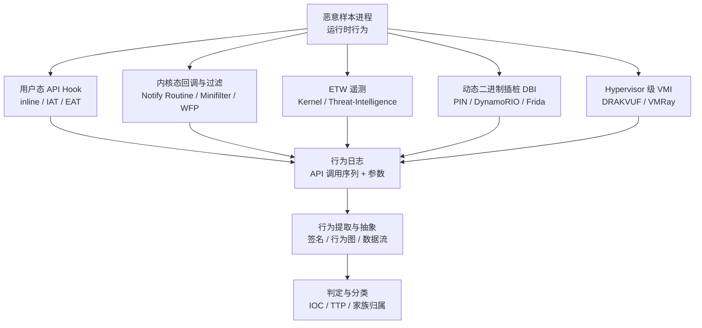
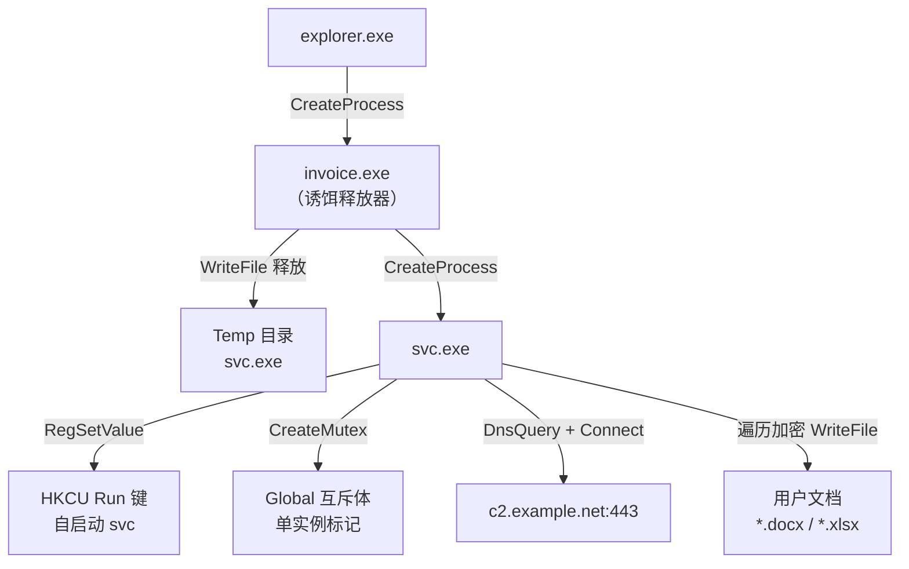
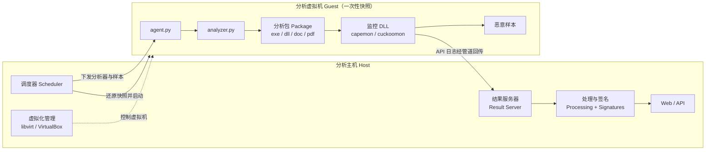
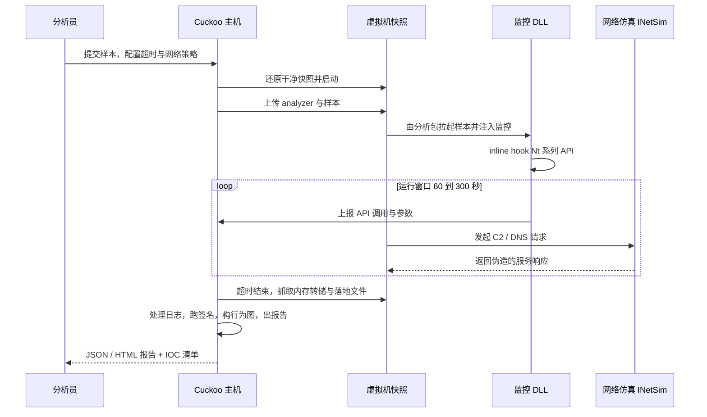

# 恶意代码分析与免杀对抗（4）· 动态分析：沙箱与行为监控

> [!abstract] TL;DR
> - 动态分析以"运行即真相"补足静态分析：加壳、加密、混淆能瞒过反汇编，却瞒不过真实执行时落地的文件、改写的注册表、注入的进程和外连的 C2。
> - API 监控是沙箱的核心传感器，可落在用户态 inline/IAT/EAT hook、内核回调与 minifilter、ETW 遥测、动态二进制插桩（DBI）、Hypervisor 级 VMI 五个层次，隐蔽性、覆盖面、抗篡改与运行开销各有取舍，没有免费午餐。
> - Cuckoo/CAPE 采用"主机—访客"分离架构：干净快照回滚、注入 agent 与监控 DLL、在有限运行窗口内采集行为、回传日志经处理与签名模块生成报告与 IOC。
> - 行为图把海量原始 API 序列抽象成"进程—文件—注册表—网络—同步对象"及其操作构成的因果图，是检测规则、家族聚类与取证复盘共用的语义骨架。
> - 猫鼠博弈的本质是"探针放在哪里"：放在客体进程内的 hook 可被样本读取比对并还原，放在 Hypervisor 之外的监控最隐蔽，代价是必须跨越"语义鸿沟"重建操作系统语义。
> - 反虚拟机 / 反调试 / 反沙箱等对抗手法留待第 10 篇；本篇聚焦"如何观测行为"以及"观测本身的边界与失败模式"。

## 概述与定位

上一篇 [[03.静态分析：特征与字符串与导入表]] 讲的是"不运行样本，从文件形态里榨取信息"。它的天花板也很明确：一旦样本被加壳、字符串被加密、导入表被延迟解析或干脆用 API 哈希，静态视角就会瞬间失明——你看到的只是一层外壳。动态分析恰好从相反的方向切入：**让样本真正跑起来，用传感器记录它对操作系统做的每一件事**，再从这些真实发生的行为里还原意图。壳终归要在内存里把真身解出来才能执行，配置终归要在运行时解密才能用，C2 地址终归要在发起连接的那一刻出现在网络栈里——这就是"运行即真相"（ground truth）的方法论根基。

在整个分析流水线里，动态分析处在两个位置。其一是**自动化分诊（triage）**：面对每天成千上万的样本，人工逆向不可能铺开，于是把样本丢进沙箱，几分钟内产出一份行为报告和一批 IOC（落地文件哈希、互斥体名、注册表键、域名/IP、ATT&CK 技术编号），据此判定恶意与否、归属哪个家族、优先级多高。其二是**人工深挖的先导**：逆向工程师在啃反汇编之前，先看一眼沙箱报告，就能快速定位"它在哪一步解密了配置""它注入了谁""网络长什么样"，把昂贵的静态逆向精力用在刀刃上。本篇讲的"沙箱与行为监控"主要指自动化的、可规模化的动态分析；手工挂调试器单步的动态调试属于逆向基本功，会在需要时穿插，但不是这里的主线。

必须一开始就把动态分析的**结构性局限**摆上台面，否则容易迷信报告：

- **单路径问题**：一次运行只走一条执行路径。样本若带条件触发器——特定日期才发作、收到某条 C2 指令才动手、命令行要带特定参数、检测到某互斥体存在才继续——沙箱这一跑根本触发不到那段代码，报告就会"干净"得可疑。
- **环境敏感**：样本会主动嗅探自己是不是在虚拟/沙箱环境里（进程数太少、无鼠标移动、磁盘太小、特征性用户名与设备名、已知的虚拟化痕迹），是则蛰伏或退出。这类反沙箱对抗是 [[10.防御规避：反虚拟机与反调试与反沙箱]] 的主题，本篇只把它当作"观测的边界"来对待。
- **时间预算**：沙箱通常只给每个样本 1—5 分钟。"睡过头"的样本（超长 Sleep、无意义的拖延循环、等待重启）能轻松熬过运行窗口。
- **网络依赖**：很多行为要在 C2 存活或被仿真时才展开。若真实 C2 已下线、或仿真服务答不出正确的协议握手，后半段行为就断了。

理解了定位与局限，才能读懂后面每一层监控技术"为什么要这么设计"——它们本质上都是在"看得全、看得准、还不被样本发现"这三者之间反复权衡。

## 原理与机制

动态分析要回答的根本问题只有一个：**一个正在运行的程序，它的"行为"到底怎么被外部观测到？** 程序对世界的一切影响，最终都要通过"向操作系统请求资源"来完成——建文件、写注册表、开进程、连网络、分配可执行内存。因此监控的着眼点天然落在这些"请求"上，而请求可以在不同的抽象层被拦截，层次越低越接近硬件真相、越难被绕过，但语义越稀薄、重建成本越高。

自上而下，观测点可以放在这几层：

- **库/API 层**：Win32 API（`CreateFileW`、`WriteProcessMemory`…）与其下的 Native API（ntdll 里的 `NtCreateFile`、`NtWriteVirtualMemory`…）。这里是"语义甜点区"——一次调用就是一个语义完整的动作，参数直接可读，最贴近分析员的思维方式。
- **系统调用层**：用户态与内核态的边界（x64 上的 `syscall` 指令）。抓这里能保证"任何绕过用户态封装、直接发起系统调用的样本也逃不掉"，但拿到的是系统调用号加寄存器，需要自己映射语义。
- **指令层**：动态二进制插桩（DBI）在指令/基本块粒度插入回调，能看清控制流与数据流，但开销巨大。
- **硬件/虚拟机层**：Hypervisor 从虚拟机之外观察内存与 CPU 寄存器，隐蔽性最强，代价是要跨越"语义鸿沟"。

这里有一个贯穿全篇的核心概念——**语义鸿沟（semantic gap）**。观测点越往下，你看到的就越是"生的"：Hypervisor 眼里只有物理内存字节和寄存器值，它并不"知道"什么是进程、什么是文件句柄。要把"CR3 换成了某个值、RIP 落在某段代码、栈上第一个参数指向一个 UNICODE_STRING"翻译成"进程 svc.exe 调用了 NtCreateFile 打开路径 C:\Users\...\a.docx"，必须在外部重建操作系统的数据结构语义（遍历 EPROCESS 链表、按调用约定解析参数、走页表把虚拟地址翻成物理地址）。层次越高语义越现成，层次越低越需要"重新发明操作系统的认知"。

另一个贯穿全篇的结构是**主机—访客（host-guest）模型**：样本在一次性的、可被瞬间还原的虚拟机（guest）里引爆，监控与结果收集尽量放在主机（host）侧或更外层，这样即使样本在 guest 里搞破坏，也污染不到分析基础设施，一个快照回滚就能把 guest 复原成干净初始态，供下一个样本使用。

下图把五层传感器与其后的行为提取管线串起来：



## 监控插桩与行为提取详解

这一段是本篇的技术核心：**逐层拆开五种监控实现，讲清各自的机制、隐蔽性与抗篡改边界，最后讲原始日志如何被抽象成行为图**。可以先记住一张对照表作为地图，随后逐项展开其中的"为什么"。

| 层次 | 语义层级 | 覆盖面 | 隐蔽性（抗检测） | 抗篡改 | 运行开销 | 代表实现 |
| --- | --- | --- | --- | --- | --- | --- |
| 用户态 API Hook | 最高（现成语义） | 中（依赖 hook 覆盖面） | 低（在客体进程内可见） | 低（可被 unhook） | 低 | cuckoomon / capemon |
| 内核回调 + minifilter | 高 | 高（系统级事件） | 中 | 中（内核态难改） | 低 | EDR、内核监控驱动 |
| ETW 遥测 | 高 | 高 | 中 | 中低（可被禁用/打补丁） | 极低 | ETW-TI、内核提供程序 |
| DBI 指令插桩 | 低—中（需重建） | 极高（每条指令） | 低（代码缓存痕迹） | 低 | Frida / PIN / DynamoRIO |
| Hypervisor VMI | 最低（语义鸿沟） | 极高 | 高（客体外观测） | 高 | DRAKVUF / VMRay |

### 用户态 API Hook：inline hook 与 IAT/EAT hook

这是最经典、也是 Cuckoo 系沙箱采用的方案：往被分析进程里**注入一个监控 DLL**（Cuckoo 1.x 叫 cuckoomon，CAPE 叫 capemon），由它在进程内对几百个关键 API——尤其是 ntdll 里的 `Nt*` 原生函数——安装 hook，逐次记录调用参数与返回值，再经命名管道把日志送回主机。

最主流的挂钩方式是 **inline hook（内联挂钩，又称 detour）**：把目标函数开头几条指令改写成一条跳转，先跳进监控代码，记完账再跳回去继续执行原函数。为什么能这么干、又有哪些坑，看这段字节布局就清楚了：

```
; 目标 API 原始开头（Windows 热补丁 hotpatch 约定）
7FF8`12340000  8B FF           mov  edi, edi     ; 2 字节 NOP 占位，专为热补丁预留
7FF8`12340002  55              push rbp
7FF8`12340003  8B EC           mov  rbp, rsp
; 函数前还预留了若干字节 CC/NOP 供写长跳转

; inline hook 之后：开头被改写为近跳
7FF8`12340000  E9 xx xx xx xx  jmp  hook_handler ; 5 字节 near jmp rel32
; 被覆盖掉的原始指令被复制进 trampoline（蹦床），
; hook_handler 处理完账后跳到 trampoline 执行原始指令，再跳回 +5 处
```

这里每个细节都有"为什么"。微软让许多系统函数以 `mov edi, edi`（机器码 `8B FF`，一条 2 字节的空操作）开头，并在函数前预留几字节填充，正是为了支持**在线热补丁**：改这 2 字节为短跳、配合前面的填充放长跳转，就能不停机打补丁。安全产品把这套机制"借"来做监控。x86 上一条 `near jmp rel32` 是 5 字节（`E9` + 4 字节相对偏移），所以要原子地覆盖前 5 字节；被覆盖的原始指令不能丢，得原样搬进一块叫 **trampoline** 的可执行内存，hook 结束后从 trampoline 执行它们再跳回原函数第 6 字节处，语义才不破。x64 上麻烦更大：`rel32` 只能覆盖 ±2GB，若 hook 处理函数离得更远，就得改用 14 字节的 `push imm32 / mov [rsp+4], imm32 / ret` 绝对跳，或 `jmp qword ptr [rip+0]` 后跟 8 字节绝对地址——覆盖字节变多，就更容易踩到指令边界、破坏后续代码，反汇编"够不够长"（length-disassembler）成了 hook 引擎的基本功。

另外两种是 **IAT hook** 与 **EAT hook**。IAT（导入地址表）hook 改写 PE 导入表里的函数指针，让"通过导入表调用某 API"被重定向——实现简单、不改代码，但**只拦得住静态导入**；样本一旦用 `GetProcAddress` 动态解析地址来调用，就绕过了 IAT。EAT（导出地址表）hook 反过来改导出表，让 `GetProcAddress` 返回 hook 地址，能补上一部分，但仍不如 inline hook 覆盖得彻底。所以现代沙箱以 inline hook 为主、辅以其它方式。

用户态 hook 的**致命弱点是它活在客体进程自己的地址空间里**：样本读一读自己的 ntdll，发现函数开头是 `E9` 跳转而非正常序言，就知道被 hook 了；更进一步，它可以从磁盘/KnownDlls 重新映射一份干净 ntdll，把被改的字节还原回去（unhooking），或者干脆不走被 hook 的封装、直接用 `syscall` 指令发起系统调用。这条"绕过用户态 hook"的路线是 [[12.直接系统调用与unhooking]] 的主题，也正是纯用户态沙箱最大的观测盲区——它提醒我们：**监控探针放在客体进程内，就必然可被客体读取、比对与篡改**。

### 内核态回调与过滤：把探针挪到样本改不动的地方

既然用户态探针可被样本抹掉，很自然的一步就是把探针下沉到内核。现代 Windows 提供了一整套**文档化的通知回调**，让驱动能在关键系统事件发生时被内核回调，这也是 EDR 和内核级沙箱的监控主力（相关内核挂钩机理见 [[32.hooks/12-kernel-hook]]）：

- `PsSetCreateProcessNotifyRoutineEx` / `Ex2`：进程创建与退出。
- `PsSetCreateThreadNotifyRoutine`：线程创建——远程线程注入的经典信号。
- `PsSetLoadImageNotifyRoutine`：镜像（EXE/DLL/驱动）加载。
- `CmRegisterCallbackEx`：注册表操作（增删改查键值）。
- `ObRegisterCallbacks`：句柄操作（打开/复制进程、线程句柄）——AV 常用它在恶意进程试图打开受保护进程时"削"掉句柄权限。
- `FltRegisterFilter`（minifilter 微过滤驱动）：文件系统 I/O，落地文件、勒索加密遍历都在这层现形。
- WFP（Windows Filtering Platform）callout：网络连接与数据。

为什么是这套回调，而不是老派的 **SSDT hook**？早年内核监控喜欢直接改写 SSDT（系统服务描述符表）里的系统调用分发指针，一举拦下所有系统调用。但 x64 上微软引入了 **PatchGuard（内核补丁保护，KPP）**：它周期性校验 SSDT、IDT、关键内核代码等结构，一旦发现被改就直接蓝屏。于是 SSDT hook 在 64 位时代基本"合法性死亡"，业界被迫转向这套官方回调 + minifilter + ETW 的组合——它们是微软"钦定"的扩展点，不触 PatchGuard 红线，稳定且难被用户态样本篡改。**探针挪进内核，抗篡改性显著上升，但代价是覆盖面受限于微软开放了哪些回调点**，某些细粒度语义（比如一次 `WriteProcessMemory` 的具体字节）在纯回调视角里未必拿得到全，往往要和 ETW、用户态信息拼合。

### ETW：把操作系统自带的遥测当传感器

ETW（Windows 事件跟踪）是 Windows 原生的高性能日志/遥测框架，内核与用户态"提供程序（provider）"源源不断发出结构化事件：`Microsoft-Windows-Kernel-Process`、`Kernel-File`、`Kernel-Network`、`DNS-Client`、`.NET Runtime`……监控方只需注册成消费者订阅即可，几乎零侵入。其中最有价值的是 **Microsoft-Windows-Threat-Intelligence（ETW-TI）** 提供程序，它专门吐露高敏感事件——分配 RWX 可执行内存、跨进程写内存、创建远程线程、可疑的 `Nt*` 调用等——几乎是为检测注入类攻击量身定做的（ETW 的机理与消费方式详见 [[32.hooks/15-etw]]）。

ETW 的好处是**它是操作系统"设计出来给人看的"遥测**：语义完整、覆盖广、开销极低，还不用你自己去 hook 任何函数。局限有二：一是 ETW-TI 受 PPL（受保护进程轻量级）门槛保护，只有以 PPL 身份运行的安全产品才消费得到；二是用户态那一侧的 ETW 写入可以被样本"消音"——把 ntdll 里的 `EtwEventWrite` 打个补丁、或把提供程序的启用位关掉，事件就不发了。这类"致盲 ETW"属于免杀/绕过范畴（详见 [[10.防御规避：反虚拟机与反调试与反沙箱]] 与 [[12.直接系统调用与unhooking]]），也说明**任何活在客体系统内、哪怕在内核的探针，都存在被针对性关闭的风险**，这正是把观测彻底移出客体（下面的 VMI）的动机。

### 动态二进制插桩（DBI）：需要看清每条指令时

当 API 级信息不够——比如要盯着壳在解密循环里逐字节还原真身、要做污点分析追踪一段密钥怎么流动——就得下沉到指令层，这就是 DBI 的用武之地。**Intel PIN** 与 **DynamoRIO** 通过 JIT 把目标代码重新编译进"代码缓存"，在指令、基本块、函数各粒度插入分析回调；**Frida** 用注入的 JS 引擎（Gum/Stalker）提供脚本化的动态插桩，跨平台、交互友好，是逆向现场最顺手的挂钩利器；还有 QBDI 等轻量框架。DBI 的能力上限极高（每条指令都能观测），但**开销常常是原生的 10—100 倍**，且代码缓存、自修改代码处理不当会留下可被探测的痕迹（时间差、内存布局异常），因此它更多用于对单个样本做外科手术式的深挖，而非规模化跑量。

### Hypervisor 级 VMI：把探针挪到客体够不着的地方

既然一切放在客体内的探针都可能被样本发现或关闭，终极思路就是**把监控搬到虚拟机之外**——在 Hypervisor 层观测。**DRAKVUF** 是这一路线的代表：它基于 Xen，用 `altp2m`（备用二级地址转换）和 LibVMI，把断点"注入"到影子内存页里——客体自己读那段内存看到的是干净字节，可一旦 CPU 去执行它就陷出到 Hypervisor，从而在客体毫无察觉的情况下捕获内核函数调用；整个过程**在客体里不放任何 DLL、不改任何字节（agentless 无代理）**。商用的 **VMRay** 同样走硬件辅助（Intel VT）的 agentless 监控路线，主打抗规避。

VMI 的隐蔽性与抗篡改是天花板级的——样本在客体内无论怎么自检、unhook、关 ETW，都看不见客体外的观测者。但它要付出**语义鸿沟**这笔账：Hypervisor 拿到的是物理内存和寄存器，要靠 LibVMI 配合内核符号/profile（如 Volatility/Rekall 体系的结构定义）去遍历 `EPROCESS`、走页表、按调用约定解析参数，才能把"某次陷出"翻译成"哪个进程调了哪个 API、参数是什么"。这套语义重建对操作系统版本敏感，内核结构一变就得跟着更新 profile，工程复杂度远高于简单挂个 hook。而且它也不是绝对不可探测——CPUID、Hypervisor 存在性、时间指纹等仍可能露馅（属于 [[10.防御规避：反虚拟机与反调试与反沙箱]]）。这正是取舍的极致：**你把探针移得越远、越隐蔽，就越要独自扛起"重建操作系统语义"的重担**。

### 从原始日志到行为图：把海量事件抽象成语义

监控层无论用哪种技术，吐出来的都是**海量的原始事件**——一次运行动辄几十万到上百万条 API 调用，直接看等于没看。行为提取要做的是**逐级抽象**：

第一级是**签名（signature）**。Cuckoo/CAPE 有一套社区签名，本质是 Python 规则，去匹配 API 序列与参数模式，把它们贴成人类可读的行为标签："创建了服务""写了 HKCU\...\Run 自启动键""查询了 CPUID/检测虚拟机""向另一进程写内存并建远程线程（注入）"。这些标签再映射到 MITRE ATT&CK 技术编号，与 [[17.MITRE-ATTCK与TTP映射]] 打通，形成标准化的 TTP 语言。

第二级是**行为图 / 溯源图（behavior / provenance graph）**。把系统对象抽象成节点——进程、文件、注册表键、网络端点、互斥体，把操作抽象成有向边——创建、写入、读取、连接、注入，于是一份行为就成了一张带因果的图。它的威力在于**捕捉因果链**：谁释放了谁、谁从释放物拉起了新进程、新进程又改了哪个自启动键、连了哪个 C2。这张图既能做检测（图匹配/子图同构找已知恶意模式）、做家族聚类（相似图归为一族），也能做取证复盘——它和内存取证印证的行为可以互相佐证（见 [[53.数字取证与事件响应/00.数字取证与事件响应总览]]）。学术上，Kolbitsch 等人的"基于系统调用依赖图的端点检测"就是把行为图加上数据流依赖来做高效检测的经典。

第三级是**数据流 / 污点分析**：不止看"调了什么"，还追"数据怎么流"，比如一段被解密的配置、一个被拼出来的 C2 URL 是怎么从密文一步步变出来的——这对提取配置（承接 [[05.脱壳与解包与配置提取]]）尤其关键。

下面这张行为图，浓缩了一个典型释放器 + 持久化 + C2 + 勒索的样本轮廓：



读这张图就是读意图：释放并拉起子进程 → 写 Run 键做持久化（更多手法见 [[08.持久化技术大全]]）→ 建互斥体防重入 → 外连 C2（协议细节见 [[13.C2框架与通信协议]]）→ 遍历加密文档。注入类的边（写内存 + 远程线程）对应的技术全谱在 [[06.进程注入技术全谱]] 与 [[32.hooks/11-process-injection]]，网络那条边的流量侧特征则承接 [[14.流量分析与网络IOC提取]]。

## 工具视角与实战

**Cuckoo Sandbox** 是开源自动化沙箱的鼻祖，理解它的架构就理解了这一类系统的通用骨架。主机侧跑调度器、结果服务器、虚拟化管理模块（对接 libvirt/KVM、VirtualBox、VMware、ESXi）、处理与签名模块、Web/API；访客侧是一台预先装好 Cuckoo agent（`agent.py`）并做成快照的干净虚拟机。



一次完整分析的时序如下：



其中**分析包（package）**是个精巧设计：样本形态五花八门（可执行、DLL、Office 文档、PDF、脚本、快捷方式），每种都要用对的方式"点起来"——EXE 直接运行，DLL 用 `rundll32` 调导出函数，文档用对应 Office 程序打开触发宏。分析包封装了这套"怎么引爆"的知识，选对包，样本才会真正跑起它的恶意路径。

**CAPE**（Config And Payload Extraction）是 Cuckoo 的著名分支，把重心放在**自动脱壳与配置提取**上：它在运行中用 YARA 扫内存识别已知家族，命中就触发对应的转储与配置解析器，把内存里脱壳后的真身 dump 出来、把 C2 配置结构化提取出来——这正好承接 [[05.脱壳与解包与配置提取]] 与 [[16.YARA规则工程]]。此外还有 Python3 重写的 Cuckoo3。

**在线与商用沙箱**各有取向：Any.Run 主打**交互式**（分析员能在浏览器里实时点击、喂输入，专治需要用户交互才展开的样本）；Joe Sandbox 深度大、跨平台、混合分析；VMRay 是前述 Hypervisor agentless 路线的商用标杆，主打抗规避；Hatching Triage（tria.ge）快且能规模化提取家族配置；Hybrid Analysis（CrowdStrike Falcon Sandbox）广被威胁情报引用。

**读一份沙箱报告**要抓这几块：signatures（贴好标签的行为，直接对应 ATT&CK）、behavior（进程树与逐进程的 API 摘要）、network（DNS/HTTP/TLS，产出域名 IP 等网络 IOC，深挖见 [[72.抓包与协议分析实战/12.流量特征分析与检测绕过]]）、dropped files（落地文件及其哈希，可再回炉分析）、screenshots（勒索勒索信、伪装界面）、内存转储（供 YARA/取证）。

**手工动态**这边，Sysinternals 的 **Process Monitor（procmon）** 用一个内核驱动实时捕获文件、注册表、进程、网络事件，是最顺手的行为观察器；**Process Explorer / System Informer** 看进程树与句柄；rohitab 的 **API Monitor** 挑 API 逐调用看参数；**Regshot** 做运行前后注册表快照对比；**Noriben** 把 procmon 包装成自动报告。特别值得一提的是 **ProcDOT**——它吃 procmon 导出的 CSV 加 pcap，自动生成可视化图，正是把"原始事件"变成"行为图"的教学级利器，亲手跑一遍就能把上一段讲的抽象过程看得明明白白。

**引爆的网络环境**通常不接真互联网，而用 **INetSim** 或 **FakeNet-NG** 仿真：DNS 一律解析到本机、HTTP/HTTPS/SMTP/FTP 一律给出通用响应，既让样本"以为联网成功"从而展开后续行为，又把危害圈在实验网里；抓下来的 pcap 交给 Wireshark 做流重组与协议分析（承接 [[72.抓包与协议分析实战/19.网络取证与流重组]]）。

对现代样本还有两点实战提醒：Go/Rust 编译的样本静态符号与控制流都更"糊"，动态观其行为往往比硬啃反汇编更划算（背景见 [[27.Go与Rust现代二进制逆向/00.Go与Rust现代二进制逆向总览]]）；而带反沙箱逻辑的样本可能在沙箱里装乖，这时要么换更隐蔽的 VMI 路线，要么人工补齐环境、绕过其环境检测——但那属于下一层博弈了。

## 安全性与正确使用

> [!caution] 合规与安全边界
> 本篇涉及"引爆真实恶意样本"，风险极高，务必守住底线：
> - **仅限自有 / 授权环境、CTF 靶场与安全研究**。分析活体样本前先确认你对该环境与样本有合法处置权，遵守所在组织与地区的法律及数据处置规定。
> - **一切以防御 / 教育视角**：目的是理解行为、提取 IOC、构建检测。本篇不提供、也不应被用于针对真实生产系统或他人系统的武器化步骤，不为绕过任何商业授权或反制安全产品提供成品配方；反沙箱 / 反调试 / 免杀等对抗手法的具体实现留待 [[10.防御规避：反虚拟机与反调试与反沙箱]] 与 [[12.直接系统调用与unhooking]]，且同样限定于防御研究语境。
> - 原理可以讲透，但"打某个真实目标"的可执行配方不在本篇范围。

引爆安全（detonation safety）是硬性工程要求，绝不能省：

- **网络隔离**：分析网必须与生产网、办公网物理或 VLAN 隔离，禁用共享文件夹、禁用宿主与访客的剪贴板/拖放桥接；对外流量走 INetSim/FakeNet 仿真或经严格白名单的一次性出口，**默认不让活体样本自由触达真实互联网**——否则可能真去感染别人、真去打真实 C2、成为攻击链的一环。
- **快照即抛**：每个样本跑在一次性快照上，分析完立即回滚到干净态，杜绝样本间交叉污染，也杜绝持久化残留影响下一次分析结论。
- **样本即活体武器**：落地的 dropped files、内存转储里的载荷都是可执行的真恶意代码，按危险品对待——加密存储、限定权限、明确命名（加 `.mal`/加密压缩带口令）、不误双击、不外传到无隔离环境。
- **承认观测的边界**：样本会检测并规避沙箱，报告"干净"未必真干净；把动态分析结论与静态、内存取证多源印证，别把单次运行当成唯一真相。

## 小结

动态分析的立身之本是"运行即真相"：壳与加密能挡住静态视角，却挡不住样本真跑起来时对系统留下的真实痕迹。它的核心传感器是 **API 监控**，而 API 监控又可以落在**用户态 hook、内核回调与 minifilter、ETW 遥测、DBI 指令插桩、Hypervisor 级 VMI** 五个层次——层次越低越难被样本察觉和篡改，语义却越稀薄、重建成本越高，"隐蔽性 vs 语义鸿沟"是贯穿始终的主线取舍，而"探针放在客体内就必然可被客体篡改"是理解这一切设计动机的钥匙。**Cuckoo/CAPE** 用主机—访客分离架构把这套监控工程化：干净快照、注入监控、有限窗口采集、回传日志出报告。最终，海量原始事件被逐级抽象成签名、**行为图**与数据流，成为检测规则、家族聚类与取证复盘共用的语义骨架。同时要清醒：单路径、时间预算、环境敏感、hook 可被绕过，是动态分析结构性的失败模式。下一篇 [[05.脱壳与解包与配置提取]] 会顺着 CAPE 的思路，把"运行中脱壳、内存里 dump 真身、提取 C2 配置"讲深讲透。

## 相关阅读

- 系列内承接：[[03.静态分析：特征与字符串与导入表]]（上一章·静态视角）、[[05.脱壳与解包与配置提取]]（下一章·内存脱壳与配置提取）、[[06.进程注入技术全谱]]、[[08.持久化技术大全]]、[[10.防御规避：反虚拟机与反调试与反沙箱]]（反沙箱对抗）、[[12.直接系统调用与unhooking]]（绕过用户态 hook）、[[13.C2框架与通信协议]]、[[14.流量分析与网络IOC提取]]、[[16.YARA规则工程]]、[[17.MITRE-ATTCK与TTP映射]]
- 监控机理：[[32.hooks/11-process-injection]]（被检测的注入行为）、[[32.hooks/12-kernel-hook]]（内核挂钩）、[[32.hooks/15-etw]]（ETW 遥测源）
- 下游印证：[[53.数字取证与事件响应/00.数字取证与事件响应总览]]（内存取证印证行为）、[[72.抓包与协议分析实战/12.流量特征分析与检测绕过]]、[[72.抓包与协议分析实战/19.网络取证与流重组]]
- 现代样本：[[27.Go与Rust现代二进制逆向/00.Go与Rust现代二进制逆向总览]]
- 官方文档与经典书目：Cuckoo Sandbox 官方文档（cuckoo.sh / readthedocs）、CAPE Sandbox 项目文档、DRAKVUF 与 LibVMI 项目文档、Frida 官方文档、Intel PIN 与 DynamoRIO 手册、Microsoft《Event Tracing for Windows》与内核回调 API 参考、《Practical Malware Analysis》(Sikorski & Honig)、《The Art of Memory Forensics》、MITRE ATT&CK Enterprise Matrix

[[00.恶意代码分析与免杀对抗总览|⬆ 系列总览]] | [[03.静态分析：特征与字符串与导入表|← 上一章]] | [[05.脱壳与解包与配置提取|→ 下一章]]
