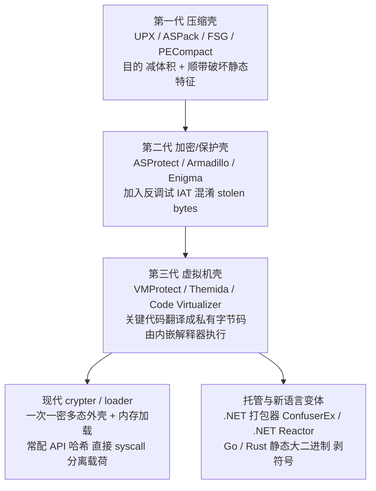
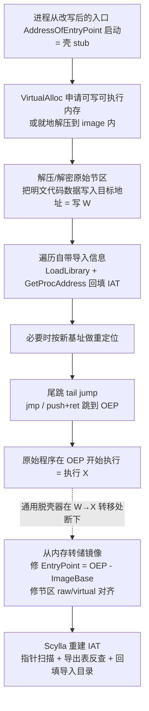
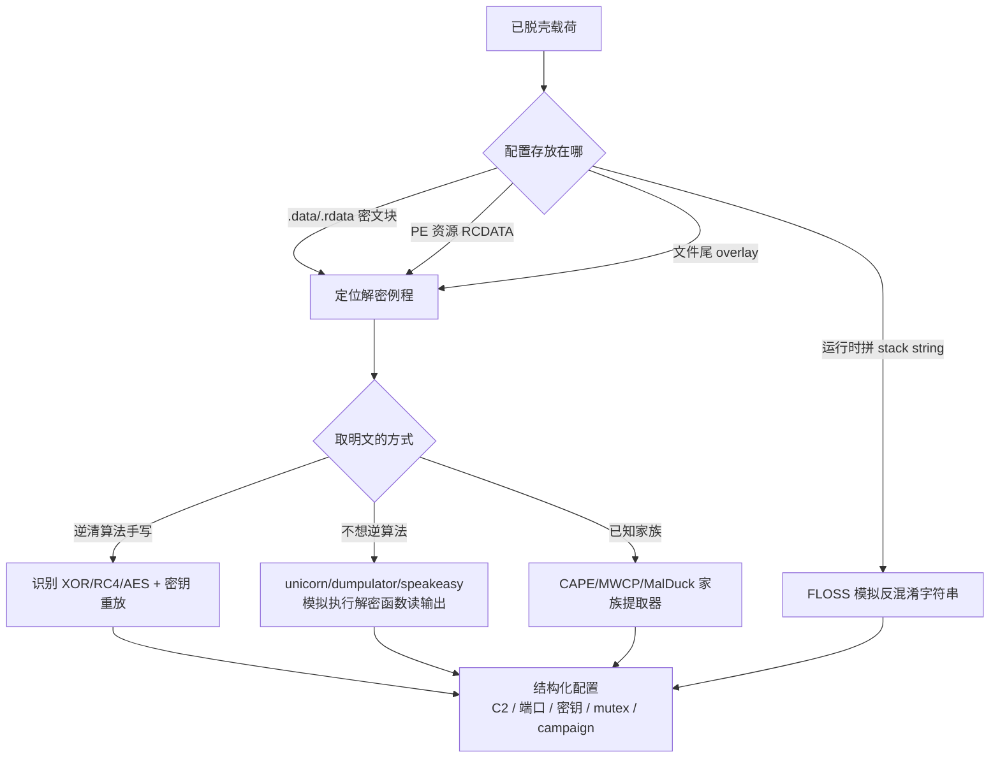

# 恶意代码分析与免杀对抗（5）· 脱壳与解包与配置提取

> [!abstract] TL;DR
> - 脱壳的通用不变式：无论算法多复杂，壳最终都必须把原始字节还原进内存、再把控制权交给它，因此“运行到 OEP 再转储”是绕开算法细节的万能路径；**写后执行（W→X）** 就是所有通用脱壳器的理论支点。
> - 脱壳的三块硬骨头是 **OEP 定位、IAT 重建、内存转储与 PE 修复**——ESP 定律/内存断点/段跳定位 OEP，Scylla 式“指针扫描 + 导出表反查”重建 IAT，转储时必须处理 raw/virtual 对齐与把入口点改回 OEP 的 RVA。
> - 壳分四代：压缩壳（UPX/ASPack）、加密保护壳（ASProtect/Armadillo，引入反调试与 stolen bytes）、虚拟机壳（VMProtect/Themida，把代码翻译成自定义字节码解释执行），以及现代一次一密 crypter/loader 与 .NET/Go 变体；越往后越不能“一键脱”，得转向调试、模拟执行与逆算法。
> - 配置提取（C2 地址、密钥、mutex、campaign ID、休眠抖动、kill date）有三条路：手工逆解密例程并重放、用 **unicorn/dumpulator/speakeasy** 模拟执行样本自身的解密函数直接取明文、或套 **CAPE/MWCP/MalDuck** 家族提取器。
> - 全流程只在隔离虚拟机/CTF 靶场里对**自有或授权样本**进行，且面向防御与教育；提取出的 C2 走威胁情报共享，不与真实 C2 做未授权交互，不为破解商业保护壳提供武器化配方。

## 概述与定位

“脱壳（unpacking）”是恶意代码分析中承上启下的关键一环。上游是[[03.静态分析：特征与字符串与导入表|静态分析]]与[[04.动态分析：沙箱与行为监控|动态分析]]：当你在静态阶段发现一个样本熵值逼近 8 bit/byte、导入表只剩 `LoadLibraryA`/`GetProcAddress`/`VirtualAlloc` 寥寥几个、节区名叫 `UPX0`/`.themida`/`.vmp0` 或干脆是随机字母，又在动态阶段观察到进程申请可执行内存、把自己“改写”一遍再跳进去——这些都是**被加壳**的确凿信号。脱壳的目标，就是把这层外壳剥掉，还原出可供反汇编、可跑 YARA、可提配置的**原始载荷（payload）**。它是[[16.YARA规则工程|YARA 规则工程]]、[[15.Shellcode分析与加载器逆向|载荷逆向]]、[[13.C2框架与通信协议|C2 分析]]所有下游工作的前置条件——对着加壳样本写规则，只能匹配到壳本身，抓不到真正的恶意逻辑。

先厘清一组容易混淆的术语，它们在攻防语境里指向不同的设计意图：

- **压缩壳（packer/compressor）**：主要动机是减小体积，副作用是破坏静态特征。代表 UPX、ASPack、FSG、PECompact、MPRESS、aPLib。结构简单，IAT 常保持完整，是脱壳入门的标准靶子。
- **加密壳 / 保护壳（protector）**：主动机是**反分析**——加密节区、内置反调试、混淆 IAT、偷 OEP 字节（stolen bytes）、加校验和。代表 ASProtect、Armadillo、Enigma、PECrypt。
- **虚拟机壳（virtualizer）**：把关键函数翻译成一套**私有字节码**，由内嵌的解释器（VM）在运行时逐条“解释执行”，原始 x86 指令根本不再出现。代表 VMProtect、Themida/WinLicense、Code Virtualizer。这类壳没有传统意义上的“完整 OEP + 明文代码”，脱壳退化为**逆虚拟机**。
- **crypter / loader**：恶意生态里的“免杀外壳”，强调**一次一密的多态**（每次生成密钥/结构都不同，杀掉静态哈希与特征）与**内存加载**（解密后直接在内存里跑或注入到别的进程，磁盘上不落明文）。它常与 API 哈希、[[12.直接系统调用与unhooking|直接 syscall]]、[[06.进程注入技术全谱|进程注入]]组合，属于[[11.免杀原理：混淆与加密与加载器|第 11 篇免杀原理]]的核心。

脱壳按“要不要真正运行样本”分三种范式，构成后文的主线：**静态脱壳**（读懂算法、离线重实现解压/解密，不执行恶意代码，最安全但最费脑）、**动态脱壳**（在调试器/沙箱里跑起来，在 OEP 处把内存转储下来，最通用）、**模拟执行脱壳**（用 unicorn/qiling 等仿真 CPU 与部分 Windows API，只跑脱壳 stub 或解密函数，兼顾安全与自动化）。本篇把这三条路线的原理、工具与陷阱讲透。



## 原理与机制

要理解脱壳，先要理解 **Windows 是怎样装载一个 PE** 的，因为壳所做的一切，本质是**把装载器的活儿抢过来自己干一遍**。正常情况下，磁盘上的 PE 文件由 DOS 头、NT 头（含 `OptionalHeader`，里面有 `ImageBase`、`AddressOfEntryPoint`、各数据目录）、节表和若干节区组成。系统装载器把各节按 `SectionAlignment`（通常 0x1000）映射到内存，按 `ImageBase` 落基址（否则做重定位），然后**处理导入表**：遍历导入描述符，`LoadLibrary` 加载每个依赖 DLL，`GetProcAddress` 解析每个函数地址，回填到 **IAT（Import Address Table，导入地址表）**，最后从 `AddressOfEntryPoint` 开始执行。这套流程里，`AddressOfEntryPoint`、IAT、节区内容是三个关键锚点，而它们正是壳要动手脚的地方。

**加壳器在构建期做四件事**：其一，把原始节区（代码 `.text`、数据 `.data`/`.rdata`）压缩或加密成一坨密文 blob；其二，往文件里塞一个新节区，装入**脱壳 stub**（解压/解密的引导代码）；其三，把 `AddressOfEntryPoint` 改指向 stub，让程序一启动先跑壳；其四，通常还会**破坏原始导入表**——把导入描述符清空或只留最小集，等运行时由 stub 自己重建，这样静态看导入表就得不到样本真实用了哪些 API。

**运行时脱壳 stub 干的活儿**，无论哪代壳，都遵循同一个骨架：分配内存（`VirtualAlloc` 申请可读写可执行区，或就地在 image 内解压）→ 把原始代码/数据的明文写进目标地址（这是关键的 **写 W** 动作）→ 重建 IAT（遍历自带的导入信息，`LoadLibrary`+`GetProcAddress` 回填）→ 若基址变化则做重定位 → 通过一次 **尾跳（tail jump）**（`jmp`、`push+ret`、或计算跳转）把控制权交给原始程序的 **OEP（Original Entry Point，原始入口点）** → 原始程序从 OEP 开始跑（这是关键的 **执行 X** 动作）。

这里就浮现出**通用脱壳的第一性原理**：不管壳的解压算法是 LZMA 还是 aPLib、加密是 RC4 还是 AES、反调试花活多少，它终究要把原始字节**先写进内存、再执行**。于是“**监控写后执行（W→X）转移**”成了不依赖具体算法的万能探测器——一旦 CPU 开始执行一段“刚刚被本进程写入过”的内存，那里极大概率就是脱好的原始代码，此刻即是转储良机。几乎所有自动脱壳器（沙箱内的 unpacker、PE-sieve、CAPE）都建立在这条不变式上；手工脱壳的 ESP 定律、内存断点，也都是它的具体落地手法。

多层壳只是把这个过程套娃：stub1 解出 stub2，stub2 再解出真正 payload。应对方法是**迭代**——脱一层、判断是否仍加壳（看熵值、看导入表、看是否又出现 W→X），不到 OEP 不停。而**反脱壳对抗**（详见[[10.防御规避：反虚拟机与反调试与反沙箱|第 10 篇]]）则是壳给这套流程处处埋雷：TLS 回调在入口前先跑、反调试检测（`IsDebuggerPresent`/PEB/时间差）、内存保护页（guard page）、完整性自校验、IAT 混淆、把 OEP 头几条指令“偷”走（stolen bytes）、乃至 Armadillo 的 nanomite（把条件跳转换成 `int3`，由父进程当调试器裁决分支，让你 dump 下来也没有跳转逻辑）。



## 脱壳内核详解：OEP 定位、IAT 重建、转储与配置提取

这一段把脱壳最硬的四个子问题拆开讲透——它们决定了你能否拿到一个**能被 IDA/Ghidra 正确反汇编、能加载运行、能提配置**的干净样本。

### PE 装载与 IAT 的运行时形成

理解 IAT 重建，必须先看清 IAT 在装载前后的形态变化。导入信息由数据目录第 1 项指向的一串 `IMAGE_IMPORT_DESCRIPTOR` 描述，每个被导入的 DLL 一个，以全零结构收尾：

```
IMAGE_IMPORT_DESCRIPTOR（每 DLL 一个，全 0 结构收尾）
+0x00  OriginalFirstThunk  RVA → ILT（Import Lookup Table，装载后不变，充当“模板”）
+0x04  TimeDateStamp
+0x08  ForwarderChain
+0x0C  Name                RVA → "kernel32.dll"（DLL 名字符串）
+0x10  FirstThunk          RVA → IAT（装载前=名称表；装载后=被覆盖成函数真实地址）

IMAGE_THUNK_DATA（32 位一格 4 字节 / 64 位一格 8 字节），ILT 与 IAT 并行等长：
  最高位 = 1  →  按序号导入：低 16 位即 ordinal
  最高位 = 0  →  按名导入：其余位是 RVA → IMAGE_IMPORT_BY_NAME{ WORD Hint; char Name[]; }
```

关键在于：**装载前** ILT 与 IAT 内容相同，都指向“提示+名字”结构；**装载后**，系统装载器把每个 IAT 项**原地覆盖**为解析出的函数真实地址（如 `kernel32!CreateFileW` 的 VA），而 ILT（`OriginalFirstThunk` 指向的表）保留为“模板”不动。代码里 `call [IAT项]` 就是这样间接调到真实 API 的。壳破坏 IAT，本质就是让这套“描述符→ILT/IAT→名字”的链条在磁盘上不复存在，逼你在内存里逆向重建。有一个坑：某些链接器/壳把 `OriginalFirstThunk` 置 0，只剩 IAT 一张表既当模板又当目标，重建时你就没有“名字模板”可依，只能靠地址反查。

### OEP 定位：从尾跳里抓住原始入口

OEP 是原始程序的**第一条指令**。定位不准，转储出来的样本入口对不上，反汇编器会从错误地址解析、满屏乱码。核心手法按“智能程度”递增：

**ESP 定律（栈平衡法）**——最经典、对压缩壳几乎百发百中。原理是：大量壳的 stub 开头用 `PUSHAD` 一次性把宿主的 8 个通用寄存器压栈（32 位下压 32 字节）保存现场，脱完壳后用对称的 `POPAD` 恢复现场，紧接着尾跳 OEP。**做法**：在 stub 入口单步过 `PUSHAD`，记下此刻 `ESP`；在这个 ESP 地址下一个 4 字节的**硬件读写断点**；运行——当 `POPAD` 回读这块栈内存时断点触发，你正停在尾跳前一两条指令处；再单步过尾跳就落在 OEP。为什么灵？因为 `PUSHAD/POPAD` 的对称性把“壳执行的开始与结束”精确地钉在同一个栈地址上。**边界**：VM 壳、不用对称 pushad/popad 的壳（如某些 ASProtect 变体）此法失效。

**内存断点 / 段跳法（section hop）**——更贴近 W→X 原理。把即将被写入并执行的目标节区页设为不可执行或下内存执行断点，当 stub 跳进这段“新鲜代码”时缺页异常触发，落点就在 OEP 附近。x64dbg 的“运行到用户代码”“内存断点”正是此类。它对不用 pushad 的壳也有效，是 ESP 定律的补充。

**尾跳识别与已知 OEP 特征**——OEP 前往往是一条“跳向截然不同地址区”的 `jmp`/`push+ret`（从壳节区跳回原始 `.text`）。落地后可用**编译器 stub 指纹**确认：MSVC 程序 OEP 常是 `push ebp; mov ebp,esp` 或直接进 `mainCRTStartup`/`__scrt_common_main_seh`，会调 `GetVersion`/`__security_init_cookie`；Delphi、MinGW、Go 各有独特入口序列。认得这些“真身开场白”，就能判断有没有跳对。

**stolen bytes（被偷的入口字节）陷阱**——ASProtect、Themida 这类会把 OEP 头几条指令**搬进壳自己分配的内存**里执行，再跳到原函数中段。于是你按上面方法找到的“OEP”缺了开头几条指令，dump 出来 prologue 残缺。补救是把壳内存里那段“寄养”的指令找回来、手工补回 OEP，或干脆接受一个偏移后的入口并在反汇编器里手动定义。

### IAT 破坏与 Scylla 式重建

壳破坏 IAT 的强度分档，重建难度随之陡增：

- **原样保留**（UPX 典型）：stub 重建完整 IAT，导入目录也在——最省事，dump 完 IAT 直接可用。
- **导入目录抹除**：运行时 IAT 被正确填了地址，但磁盘上的导入描述符没了。dump 后 IAT 里是一串裸地址，反汇编器不知道它们是谁 → 需要**反查重建**。
- **IAT 重定向 / 包裹（redirection/wrapping）**：IAT 不直接指向 `kernel32!X`，而指向壳内存里的一个**跳板 stub**，跳板做点垃圾运算再 `jmp` 真 API。Scylla 必须**穿透跳板**追到真身。VMProtect/Themida 把跳板本身 VM 化，追踪极难。
- **API 哈希（无导入表）**：干脆不要导入表，代码用哈希（ROR13、djb2、自定义）遍历 PEB→已加载模块→导出表来现算 API 地址。此时**没有 IAT 可重建**，分析重心转为逆那个 resolver 函数、建“哈希→函数名”对照表——这也是 shellcode 与现代 loader 的常态，参见[[15.Shellcode分析与加载器逆向|第 15 篇]]。

**Scylla / ImpREC 的重建算法**（也是理解自动化工具的钥匙）分四步：① 给定 OEP 与进程句柄，在预期的 IAT 区域附近**扫描连续指针**——凡是落在“某个已加载模块的地址空间”内的值，就当作一个 IAT 项候选；② 对每个候选地址，**反查它属于哪个模块的哪个导出**——遍历所有已加载模块的导出表，用地址匹配出 `DLL!Function`；③ 处理重定向项——若地址落在非常规模块（壳内存），顺着 `jmp` 链**追到真实 API**；④ 用②③的结果**重造** `IMAGE_IMPORT_DESCRIPTOR` + ILT/IAT + 名字表，写进新节区，并更新数据目录第 1 项指向它。做完，样本的导入表就“复活”了，反汇编器能把 `call [0x40XXXX]` 显示成 `call CreateFileW`。

### 内存转储与 PE 修复

拿到 OEP、重建了 IAT，还要把内存镜像**落成一个能再次加载的文件**，难点在**对齐**。内存里节区按 `SectionAlignment`（0x1000）对齐，磁盘里按 `FileAlignment`（0x200）对齐，两套布局不同。最省事的策略是做**“内存对齐转储”**：把每个节区的 `PointerToRawData` 直接设成它的 `VirtualAddress`、`SizeOfRawData` 设成 `VirtualSize`（向对齐取整），让磁盘布局与内存 1:1 一致，这样文件被映射时偏移不错位。同时必须：把 `AddressOfEntryPoint` 改成 `OEP - ImageBase`（OEP 的 RVA）；若进程实际加载基址≠`ImageBase`，要么改 `ImageBase` 为实际基址、要么补做重定位；修正各节 `Characteristics`（脱壳后代码节要可执行）；处理 overlay 附加数据。

```python
# 用 pefile 把“内存镜像转储”修成可加载文件（示意，实操常直接用 Scylla 一键完成）
import pefile
pe = pefile.PE(data=dumped_image)                      # 从进程内存整段读回的镜像
pe.OPTIONAL_HEADER.AddressOfEntryPoint = OEP_RVA        # 关键：入口改回真正的 OEP（RVA）
for s in pe.sections:
    s.PointerToRawData = s.VirtualAddress               # 内存对齐转储：raw 偏移 = 虚拟地址
    s.SizeOfRawData    = s.Misc_VirtualSize             # 大小按虚拟大小
pe.write("unpacked_fixed.exe")
# 之后把它喂给 Scylla：定位 IAT → 反查导出 → 回填导入目录，得到可反汇编的干净样本
```

### 配置提取：从干净载荷里抠出 C2 与密钥

脱壳只是手段，很多分析的**真正目的**是拿到**配置（config）**：C2 地址/端口、RC4/AES 密钥、mutex 名、安装路径、休眠与抖动、kill date、botnet/campaign ID、RSA 公钥。配置的存放与编码有套路：

- **存放位置**：`.data`/`.rdata` 里的密文块、PE 资源节（RCDATA）、文件尾部 overlay、或**运行时用 stack string 拼装**（一个字节一个字节地 `mov`，专门躲字符串扫描）。
- **编码层**：单字节 XOR（最弱）、多字节/滚动 XOR、RC4（密钥常就在附近硬编码）、AES（key+IV 藏在二进制里）、ChaCha、base64 外套、自定义 LCG/位运算，常叠两三层。
- **提取三条路**：其一，**手工逆解密例程**——在脱壳样本里定位解密函数、认出算法与密钥、离线重放；其二，**模拟执行“借刀杀人”**——不逆算法，直接用 unicorn/dumpulator/speakeasy 把样本自己的解密函数跑一遍读输出，对付魔改算法尤其省事；其三，**套家族提取器**——CAPE、MWCP、MalDuck、RATDecoders 里已有大量家族的现成 parser。

```python
# 路线一：认出是 RC4，就地重放（配置里往往就是明文 C2/端口/mutex）
def rc4(key, data):
    S = list(range(256)); j = 0
    for i in range(256):
        j = (j + S[i] + key[i % len(key)]) & 0xff
        S[i], S[j] = S[j], S[i]
    out = bytearray(); i = j = 0
    for b in data:
        i = (i + 1) & 0xff; j = (j + S[i]) & 0xff
        S[i], S[j] = S[j], S[i]
        out.append(b ^ S[(S[i] + S[j]) & 0xff])
    return bytes(out)
# 从 .data 抠出的密文块 blob + 二进制里硬编码的 key → rc4(key, blob) 即结构化配置

# 路线二：不想逆魔改算法，直接模拟执行样本自己的解密函数（unicorn 骨架，示意）
from unicorn import *
from unicorn.x86_const import *
def emulate_decrypt(code_bytes, base, dec_addr, dec_end, out_ptr, out_len):
    uc = Uc(UC_ARCH_X86, UC_MODE_32)
    uc.mem_map(base, 0x200000)
    uc.mem_write(base, code_bytes)                      # 映射已脱壳的代码+数据
    uc.reg_write(UC_X86_REG_ESP, base + 0x180000)       # 备好栈
    # ...按被逆函数的调用约定压入 密文指针/长度/输出缓冲指针...
    uc.emu_start(dec_addr, dec_end)                     # 只跑“解密”这一段
    return uc.mem_read(out_ptr, out_len)                # 读回明文配置，无需理解算法
```



## 工具视角与实战

**识别与判壳**是第一步：Detect It Easy（DIE）、PEStudio、CFF Explorer、pefile 看导入表稀疏度、节名（`UPX0/UPX1`、`.vmp0`、`.themida`、`.aspack`）、熵值曲线（加壳节熵高）、入口点是否落在最后一个节。老牌 PEiD 的签名库虽停更，识别常见壳仍够用。**别急着动手**——先判清是压缩壳（好办）还是 VM 壳（准备打持久战）。

**标准 UPX** 直接 `upx -d sample.exe` 还原；但恶意样本常**魔改 UPX 头**（改节名、破坏版本号）让官方 upx 拒绝解压，这时退回手工。

**手工动态脱壳**主力是 **x64dbg / x32dbg + Scylla 插件**（32 位老流程也可 OllyDbg + ImpREC）。典型压缩壳流程：入口过 `PUSHAD` → 记 ESP → 硬件断点 → 运行断在 `POPAD` 后 → 单步过尾跳到 OEP → Scylla 里“IAT Autosearch + Get Imports”反查导入 → “Dump”转储 + “Fix Dump”把重建的导入目录回填。整个过程就是前一段四个子问题的手工落地。

**自动化动态脱壳**（把样本跑起来让工具抓 W→X）：hasherezade 的 **PE-sieve**（扫单个进程，把被植入/脱壳/[[07.进程镂空与傀儡进程Hollowing|镂空]]的模块 dump 出来）、**hollows_hunter**（扫全系统进程）、**mal_unpack**（跑样本+监控+在载荷出现时 dump）；**unipacker** 基于 unicorn 对常见压缩壳做仿真自动脱壳；**CAPEv2 沙箱**（名字即 Config And Payload Extraction）在引爆时自动脱壳并对上百个家族提配置，是工业化首选。这些工具承接[[06.进程注入技术全谱|注入]]/[[07.进程镂空与傀儡进程Hollowing|Hollowing]]场景——很多“壳”其实是把真载荷注入别的进程，得去目标进程里 dump。

**模拟执行路线**（不真跑、更安全、可批量）：**unicorn**（纯 CPU 仿真）、**qiling**（带 OS/API 层的仿真框架）、**speakeasy**（Mandiant，仿真 Windows 内核态/用户态 API，专为恶意样本设计）、**dumpulator**（对真实进程取 minidump 快照后，在快照里直接“调用”函数——脱壳到导入解析完的时刻打快照，再调解密函数取配置，极其顺手）。它们是配置提取路线二的载体。

**.NET 样本**走完全不同的路：.NET 程序集不是经典意义上的加壳，常见形态是一个 loader（原生或托管）解密某个资源里的**真正 .NET 程序集字节**，再 `Assembly.Load(byte[])` 反射加载。脱壳=**截获传给 `Assembly.Load` 的 byte[] 并 dump**——用 **dnSpy/dnSpyEx** 在 `Assembly.Load`/模块解析处下断，运行到位取出内存字节即得干净程序集；**de4dot** 能自动脱多种混淆器（ConfuserEx、.NET Reactor、SmartAssembly）的壳、还原控制流、解密字符串、改名；ILSpy/dnSpy 反编译回近似 C# 源码。Go/Rust 样本则是另一类难题（静态大二进制、剥符号、独特 runtime），见[[27.Go与Rust现代二进制逆向/00.Go与Rust现代二进制逆向总览|Go 与 Rust 现代二进制逆向]]。

**配置与字符串工具箱**：**capa**（从脱壳后二进制识别能力，如“加密 C2 通信”“注入”）、**FLOSS**（Mandiant，靠模拟执行还原 stack string 与被混淆字符串——很多配置藏在 stack string 里）、**MWCP / MalDuck / RATDecoders / mwcfg**（家族配置 parser 框架）、YARA/YARA-X（先判家族再套对应算法）。

**内存取证接力**：当你只有一份内存镜像（而非活样本），用 **volatility3** 的 `malfind`（找 RWX 私有内存里的可疑代码）、`procdump`/`moddump`/`vaddump` 把脱壳后的载荷从内存里抠出来，再走上面的 IAT 重建与配置提取——这条线直接通向[[53.数字取证与事件响应/00.数字取证与事件响应总览|数字取证与事件响应]]，用内存证据印证[[04.动态分析：沙箱与行为监控|动态分析]]看到的行为。提取出的 C2/域名/JA3 再交给[[72.抓包与协议分析实战/12.流量特征分析与检测绕过|流量特征分析]]与[[72.抓包与协议分析实战/19.网络取证与流重组|网络取证与流重组]]做网络侧印证。

## 安全性与正确使用

脱壳与配置提取直接与**活体恶意样本**打交道，操作不当会真的感染主机、外连真实 C2、甚至触发样本的破坏逻辑，因此环境隔离与合规边界必须先于技术。

> [!caution] 合规与安全边界
> - **仅限授权环境**：只对**自有样本、CTF 靶场样本、获得书面授权的研究样本**进行脱壳与配置提取。一律采取**防御 / 教育视角**，目的是编写检测规则、生成威胁情报、理解攻击者 TTP，而非复用攻击能力。
> - **物理/网络隔离**：在**离线或严格受控网络的一次性虚拟机**里引爆样本，用快照（snapshot）随用随还原，禁止映射主机盘/剪贴板，出网流量走 INetSim/FakeNet 之类的**伪服务**而非真实互联网——否则你会真的连上活的 C2、暴露分析基础设施、乃至被反制。
> - **提取物的处置**：脱壳得到的**明文载荷仍是恶意代码**，不得随意分发、不得上传到会公开样本的服务；提取出的 C2/密钥等 IOC 通过**威胁情报共享渠道**（MISP、行业 ISAC、厂商）负责任地流转，**不主动与真实 C2 做未授权交互**（探测、投毒、接管都可能越界并打草惊蛇）。
> - **不为破解商业保护提供武器化**：本篇讲 VMProtect/Themida/Armadillo 是为了分析**用它们加壳的恶意软件**。把这些手法用于绕过**合法授权的商业软件保护**（去许可、破解正版）属于侵权乃至违法，本篇不提供、也不背书任何针对真实生产系统或他人受保护软件的成品配方。
> - **只讲原理、不给打真实目标的配方**：文中的 ESP 定律、IAT 重建、模拟解密均为**防御分析**通用方法，示例代码为教学骨架；不提供针对某个在野真实目标或生产环境的定向利用步骤。

从工程实践看，安全脱壳还有几条纪律：优先用**静态/模拟执行**（不真跑代码）路线处理未知高危样本，把动态引爆留到最后且限定在隔离机；对**反虚拟机/反沙箱**样本（详见[[10.防御规避：反虚拟机与反调试与反沙箱|第 10 篇]]）要意识到它可能识别出分析环境而改变行为，得到的“配置”可能是诱饵；处理带**破坏性载荷**（勒索、擦除）的样本时，务必确认快照可回滚且无共享盘可波及。记住：脱壳的产出是给**防御**用的证据与规则，不是给攻击复用的弹药。

## 小结

脱壳的世界观可以浓缩成一句：**壳能藏算法，藏不住“原始字节必须先落内存再执行”这个事实**。围绕这条 W→X 不变式，动态脱壳“运行到 OEP 再转储”成为万能路径，而真正决定成败的是三块硬骨头——用 **ESP 定律 / 内存断点 / 尾跳识别**定位 **OEP**，用 **Scylla 式指针扫描 + 导出表反查**重建被破坏的 **IAT**，转储时处理 **raw/virtual 对齐**并把入口点改回 OEP 的 RVA。壳的四代演进（压缩→加密保护→虚拟机→现代 crypter 与 .NET/Go 变体）不断抬高门槛，把战场从“一键脱壳”推向调试对抗、模拟执行与逆虚拟机；.NET 则另辟蹊径，脱壳退化为截获 `Assembly.Load` 的字节。而这一切的下游落点是**配置提取**——手工逆算法、模拟执行借刀取明文、家族提取器三条路，把 C2、密钥、mutex、campaign ID 变成可行动的威胁情报。工具层面，DIE/PEStudio 判壳、x64dbg+Scylla 手工脱、PE-sieve/mal_unpack/CAPE 自动化、unicorn/dumpulator/speakeasy 模拟、de4dot/dnSpy 治 .NET、volatility3 从内存捞载荷，构成完整链路。脱壳既是[[03.静态分析：特征与字符串与导入表|静态]]与[[04.动态分析：沙箱与行为监控|动态]]分析的收口，也是[[06.进程注入技术全谱|注入]]、[[16.YARA规则工程|YARA]]、[[13.C2框架与通信协议|C2 分析]]的起点——把外壳剥开，样本的真身才第一次完整地摆在分析者面前。

## 相关阅读

- [[03.静态分析：特征与字符串与导入表|← ch03：静态分析（判壳的熵值/导入表/节区线索来源）]]
- [[04.动态分析：沙箱与行为监控|← ch04：动态分析（观察 W→X 与自改写行为）]]
- [[06.进程注入技术全谱|→ ch06：进程注入（很多“壳”其实把载荷注入别的进程再脱）]]
- [[11.免杀原理：混淆与加密与加载器|→ ch11：免杀原理（crypter/loader 的构建视角，与脱壳互为攻防）]]
- [[15.Shellcode分析与加载器逆向|→ ch15：Shellcode 与加载器（API 哈希 resolver 与无导入表载荷）]]
- [[16.YARA规则工程|→ ch16：YARA（对脱壳后载荷与配置写规则）]]
- [[10.防御规避：反虚拟机与反调试与反沙箱|↔ ch10：反调试/反虚拟机（脱壳对抗的雷区）]]
- 注入承接：[[32.hooks/11-process-injection]]、[[32.hooks/12-kernel-hook]]、[[32.hooks/15-etw]]
- 取证下游：[[53.数字取证与事件响应/00.数字取证与事件响应总览]]（内存取证印证脱壳后行为）
- 流量呼应：[[72.抓包与协议分析实战/12.流量特征分析与检测绕过]]、[[72.抓包与协议分析实战/19.网络取证与流重组]]
- 语言逆向：[[27.Go与Rust现代二进制逆向/00.Go与Rust现代二进制逆向总览]]（Go/Rust 现代样本脱壳与逆向）
- 官方规范与工具：Microsoft PE/COFF 规范（`docs.microsoft.com` PE Format）、Scylla（IAT 重建/转储）、CAPEv2（沙箱化配置与载荷提取）、Unicorn Engine / qiling / speakeasy / dumpulator（模拟执行）、de4dot（.NET 脱壳去混淆）、hasherezade PE-sieve/mal_unpack
- 书目：《Practical Malware Analysis》（Sikorski & Honig）第 18 章 Packers and Unpacking；《Practical Binary Analysis》（Dennis Andriesse）

[[00.恶意代码分析与免杀对抗总览|⬆ 系列总览]] | [[04.动态分析：沙箱与行为监控|← 上一章]] | [[06.进程注入技术全谱|→ 下一章]]