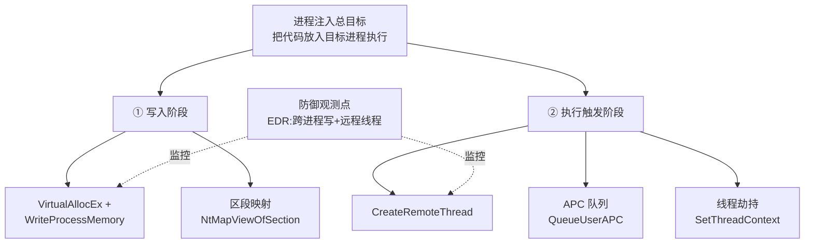

# 恶意代码分析与免杀对抗（6）· 进程注入技术全谱

> [!abstract] TL;DR
> - 进程注入是恶意代码实现代码执行隐蔽性的核心手段，通过向合法进程注入恶意代码来规避检测、逃脱隔离、提升权限或伪装流量来源。
> - Windows 进程注入存在 8+ 种主要技术，分别基于线程创建、Hook 劫持、窗口消息、内存映射、注册表回调等不同操作系统机制。
> - 远程线程、APC 异步注入、SetWindowsHook 全局钩子是历史上最为活跃的三大通用方案，各有优劣，演进过程映射了微软防护能力的跟进。
> - 进程注入检测的关键在于观察线程溯源（新线程的代码所有权）、内存权限异常、调用栈特征（返回地址在堆或注入段），而非简单的进程名称。
> - 进程注入原理与 shellcode 执行、加载器机制深度关联，是免杀对抗链条的中间环节，上游接脱壳与配置提取，下游对接持久化与权限提升。

---

## 概述与定位

进程注入（Process Injection）是恶意代码在 Windows 系统上实现**代码执行隐蔽性**的一流工具。其核心价值在于：一个恶意进程可以将自身代码或 shellcode 注入到合法进程（如 explorer.exe、svchost.exe、notepad.exe）的地址空间中执行，从而实现规避安全软件检测、逃脱沙箱隔离、窃取目标进程的令牌权限、或伪装恶意流量的来源进程。

从防御者角度看，进程注入是威胁狩猎的高优先级指标：一个 notepad.exe 突然开启网络连接、创建文件、枚举注册表，这强烈暗示其被注入了恶意代码。但进程注入的**检测难点**在于合法性判定——某些正当应用（如截图工具、浏览器扩展、输入法）也会向其他进程注入代码，需要通过代码所有权、注入时机、栈回溯等多维特征来区分。

从恶意代码开发者角度，进程注入解决了多个关键问题：

1. **隐蔽性**：代码执行发生在合法进程上下文，进程名、签名、启动者都是合法的。
2. **权限继承**：将低权进程的恶意代码注入高权进程（如系统进程）可直接获得高权执行。
3. **环境适应**：注入到已运行进程无需新建进程（减少创建时的异常行为），充分利用已有的网络连接、句柄等资源。
4. **沙箱突破**：某些沙箱限制进程创建，但允许现有进程的内存修改，注入是绕过此类限制的方式。

本篇涵盖进程注入的全谱技术——从经典的远程线程、APC 异步注入，到 Hook 钩子、窗口消息、内存映射、注册表回调等变体。我们将从**原理层面**逐一剖析这些技术的设计原理、实现细节、检测特征、防御手段，以及在对抗演进中的地位变化。

---

## 原理与机制




### 进程地址空间与线程执行模型

进程注入的基础是 Windows 的**进程隔离与线程执行模型**。每个 Windows 进程拥有一个独立的虚拟地址空间（32 位进程 2GB 可用，64 位进程 128TB 可用），内核维护一个页表树将虚拟地址映射到物理内存。线程是进程内的执行单元，拥有独立的栈、寄存器、执行指针（EIP/RIP），但**共享进程的地址空间、堆、打开的句柄**。

这一设计意味着：
- 同一进程内的多个线程可以直接访问彼此的堆数据，无需特殊的 IPC 机制。
- 一个线程可以修改进程的代码段（在有合适权限且不触发内存保护的前提下）。
- 如果我们能在目标进程内创建或控制一个线程，并让其执行我们的代码，该代码就自动获得目标进程的权限、令牌、句柄等。

### 进程间的访问控制与权限检查

Windows 内核对进程间操作设有严格的访问检查。要从进程 A 修改或读取进程 B 的地址空间，需要：

1. **打开目标进程的句柄**：`OpenProcess()` 需要指定所需的访问权限（`PROCESS_VM_READ/WRITE/OPERATION` 等）。内核在此刻检查调用者的令牌权限，确保有足够权限打开该句柄。
2. **访问权限标志**：句柄携带访问标志，后续的 `ReadProcessMemory`、`WriteProcessMemory`、`CreateRemoteThread` 等都会检查句柄是否包含所需标志。
3. **令牌检查**：进程令牌决定其权限等级（User/Administrator/System）。管理员权限的进程可以打开任意进程句柄，而普通用户进程只能打开自己或同权限进程的句柄。

**绕过这些检查的路径**包括：

- **同权进程间注入**：普通用户的进程 A 可以注入到同用户的进程 B（因为令牌检查通过）。
- **权限继承**：将低权进程代码注入到高权进程，就直接获得高权执行上下文。
- **内核驱动绕过**：某些高级恶意软件使用内核驱动，直接操作内存而绕过用户态的访问检查。
- **漏洞利用**：利用内核漏洞修改进程令牌或页表，获得非法权限。

### 线程创建与代码执行流程

创建远程线程的典型流程是：

```
1. OpenProcess(dwDesiredAccess, pid)         → 获取目标进程句柄
2. VirtualAllocEx(hProcess, ...)             → 在目标进程地址空间分配内存
3. WriteProcessMemory(hProcess, addr, code) → 写入恶意代码（shellcode）
4. CreateRemoteThread(hProcess, addr, ...)  → 创建线程，指向 addr 处的代码
5. 内核调度该线程运行
```

当线程被调度执行时，CPU 的 EIP/RIP 指向指定的地址，栈指针 ESP/RSP 指向为该线程分配的栈，然后 CPU 开始执行代码。这时，代码享有该线程所在进程的全部权限——可以调用该进程已加载的 DLL 导出的任何 API（如 LoadLibrary、CreateProcess 等）。

---

## 进程注入技术详解与原理

### 1. 远程线程注入（CreateRemoteThread）

**原理与操作流程**

远程线程是最直接的注入手段。通过 `CreateRemoteThread()` 在目标进程内创建新线程，指向恶意 shellcode 的地址。内核将为新线程分配栈、初始化线程上下文（TEB、TLS 等），然后在目标进程的上下文中执行这个线程。

代码框架：
```c
HANDLE hProcess = OpenProcess(PROCESS_ALL_ACCESS, FALSE, pid);
LPVOID pBuffer = VirtualAllocEx(hProcess, NULL, shellcode_size, 
                                 MEM_COMMIT | MEM_RESERVE, PAGE_EXECUTE_READWRITE);
WriteProcessMemory(hProcess, pBuffer, shellcode, shellcode_size, NULL);
HANDLE hThread = CreateRemoteThread(hProcess, NULL, 0, 
                                     (LPTHREAD_START_ROUTINE)pBuffer, 
                                     NULL, 0, NULL);
WaitForSingleObject(hThread, INFINITE);
```

**优势与劣势**

优势：
- 最直接、最可靠，几乎对所有进程有效。
- 内核原生支持，API 暴露，易于实现。
- 线程会自动调用 DLL 入口点、触发 DLL 初始化，如果注入的是完整 DLL 会自动反射加载。

劣势：
- `CreateRemoteThread` 本身是恶意代码分析工具常见的检测点。
- 新线程会在进程的 PEB（进程环境块）的线程列表中注册，内存取证易发现（栈地址、返回地址不在模块内）。
- 需要 `PROCESS_CREATE_THREAD` 权限，权限要求高。

**检测特征**

1. **线程所有权不匹配**：线程的栈地址、返回地址都在堆或 .data 段，而非任何已加载模块中。
2. **入口点异常**：线程的起始地址在 shellcode 堆空间，而非模块导出或标准线程入口。
3. **行为时间**：线程创建时间晚于进程启动，且创建线程的调用来自外部进程。

---

### 2. APC 异步过程调用注入（QueueUserAPC）

**原理与机制**

APC（Asynchronous Procedure Call）是 Windows 的异步通知机制。内核为每个线程维护一个 APC 队列，当代码向线程队列一个 APC 时，内核在该线程**下次进入可警告状态（alertable state）时**会中断当前执行，转向执行 APC 回调函数，然后恢复原执行。

```
1. 目标线程运行 / 阻塞在可警告 API（WaitForSingleObject/Sleep 等）
2. 注入者调用 QueueUserAPC(pfnAPC, hThread, dwData)
3. 内核将 APC 加入线程的 APC 队列，标记线程为"有待处理 APC"
4. 线程下次进入可警告状态时，内核劫持执行，先调用 pfnAPC(dwData)
5. pfnAPC 返回后，线程恢复原执行上下文
```

关键的 API 调用：
```c
// 获取目标进程的线程列表
HANDLE hThreadSnapshot = CreateToolhelp32Snapshot(TH32CS_SNAPTHREAD, 0);
THREADENTRY32 te32 = {sizeof(te32)};
Thread32First(hThreadSnapshot, &te32);
do {
    if (te32.th32OwnerProcessID == target_pid) {
        // 打开该线程的句柄
        HANDLE hThread = OpenThread(THREAD_SET_CONTEXT, FALSE, te32.th32ThreadID);
        // 向线程队列 APC 回调
        QueueUserAPC((PAPCFUNC)shellcode_addr, hThread, (ULONG_PTR)param);
    }
} while (Thread32Next(hThreadSnapshot, &te32));
```

**设计优势与对抗进度**

设计优势：
- **隐蔽**：APC 不创建新线程，而是复用现有线程，降低进程线程数异常的检测可能。
- **权限要求更低**：只需 `THREAD_SET_CONTEXT` 权限，而 `CreateRemoteThread` 需要 `PROCESS_CREATE_THREAD`。
- **有道理**：APC 原本就是 Windows 的正常机制（I/O 完成、定时器回调都用 APC），存在大量合法使用，混淆检测。

劣势与对抗：
- 需要目标线程进入可警告状态，如果目标线程一直忙碌（计算密集），APC 永远不会触发。
- 要获取目标进程的线程句柄，仍需一定的打开权限。
- 现代 EDR 已能通过栈回溯和 APC 队列检查识别异常 APC（来自 shellcode 地址的 APC 回调）。

**检测视角**

1. **栈回溯**：线程执行到 shellcode 时，栈底是 APC 回调机制的返回地址（在 ntdll 中的 `KiUserApcDispatcher` 或类似），而不是正常的线程启动代码。
2. **内核 APC 队列**：内核调试器可查看 `!adt` 等命令观察线程的 APC 队列，异常的 shellcode 地址会暴露。
3. **行为时序**：APC 一般在目标线程调用 Sleep/WaitForSingleObject 时触发，监控这些 API 的调用及其后续行为变化可识别异常。

---

### 3. SetWindowsHook 全局钩子注入

**原理与 Hook 消息循环**

SetWindowsHook 是 Windows 的全局事件拦截机制。应用可以注册一个全局钩子回调，在系统发生特定事件（键盘输入、鼠标移动、窗口创建等）时调用该回调。关键特性是：**为了让回调函数在目标应用的上下文执行，Windows 会强制将钩子回调所在的 DLL 注入到该应用的地址空间**。

```
1. 攻击者编写恶意 DLL，导出钩子回调函数 HookProc()
2. 调用 SetWindowsHookEx(WH_KEYBOARD_LOW, &HookProc, hModule, 0)
3. Windows 获取注册表或模块路径，遍历系统中的所有窗口（对应线程）
4. 对每个窗口所在的线程，向其发送特殊消息，让线程加载恶意 DLL
5. DLL 被加载到目标进程，SetWindowsHookEx 返回一个 HHOOK 句柄
6. 当用户触发钩子事件（如按键），Windows 在目标进程上下文中调用 HookProc()
```

代码示例（恶意侧）：
```c
// malicious.dll 中的钩子回调
LRESULT CALLBACK HookProc(int nCode, WPARAM wParam, LPARAM lParam) {
    // 在这里执行恶意代码，享有目标进程的权限
    // 例如窃取按键输入、修改窗口、创建子进程等
    return CallNextHookEx(NULL, nCode, wParam, lParam); // 传递给链中的下一个钩子
}

// 注册全局键盘钩子
HHOOK hHook = SetWindowsHookEx(WH_KEYBOARD_LOW, HookProc, hModule, 0);
```

**注入机制深度**

SetWindowsHookEx 的注入过程涉及内核与用户态的精妙协作：

1. **枚举注册**：SetWindowsHookEx 遍历系统中的所有窗口（通过 EnumWindows），获取每个窗口所在的线程 ID。
2. **消息注入**：内核向目标线程发送 `WM_HOOK_INSTALL` 等专有消息，指示加载钩子 DLL。
3. **DLL 加载**：目标线程收到消息后，在自己的上下文中调用 `LoadLibrary()` 加载恶意 DLL。
4. **回调注册**：导出函数 `HookProc()` 的地址被记录，系统事件发生时从该进程上下文调用。

这种机制的巧妙之处在于：**无须直接写内存、创建线程，仅通过消息驱动目标进程的线程自主加载 DLL**。目标进程对此通常没有感知，因为消息拦截和 DLL 加载都是在进程的消息循环中进行。

**隐蔽性与检测难点**

隐蔽性：
- DLL 是通过正常的 LoadLibrary 机制加载，在模块列表中出现，但一旦注入完成，所有者并不明显。
- 回调是由系统事件触发（按键、鼠标），而非人为创建线程，较难与合法应用的事件钩子区分。
- 钩子可以是全局的，影响系统所有应用，一个恶意软件可以注入数十个进程。

检测难点：
- 正当应用（输入法、辅助功能工具、截图软件）也大量使用全局钩子。
- DLL 可被签名（数字证书伪造）来伪装合法性。
- 需要跨进程链接钩子源与注入进程，这涉及复杂的取证工作（DLL 来源、钩子回调代码分析）。

**现代对抗与防御演进**

- Windows 10 之后引入了 Hook 的白名单机制，部分 Hook 类型（如 `WH_MOUSE_LL`、`WH_KEYBOARD_LL`）只允许 DLL 来自 system32、syswow64 等系统目录。
- 某些安全软件启用了钩子完整性检查，验证加载到关键进程的 DLL 的签名与来源。
- 进程隔离增强（如 Chrome 的多进程架构）使得一次注入影响范围变小。

---

### 4. 其他注入技术简述

**SetWindowsHook 外的补充方案**

除了上述三大主流，Windows 还存在其他注入向量：

#### 窗口消息与 PostMessage 变体
某些恶意代码向特定窗口发送自定义消息，窗口消息处理程序是 DLL 的导出函数，处理消息时执行恶意代码。这种方式依赖目标应用的消息处理逻辑，往往需要精准了解目标应用的消息格式，难以通用。

#### 内存映射文件注入（MapViewOfFile）
恶意代码创建命名内存映射文件，目标进程通过 OpenFileMapping + MapViewOfFile 打开并映射到自己的地址空间。理论上，恶意 DLL 可被放入映射文件，目标进程加载时自动注入。但这需要目标进程主动打开该映射，实际应用中罕见，多见于目标进程是自定义应用（知道文件名）的情况。

#### 注册表回调与 CmRegisterCallback
某些驱动级恶意软件使用内核 API `CmRegisterCallback` 注册注册表修改回调。当进程访问注册表时，回调被触发，可在内核上下文中执行恶意代码。这是驱动级注入的一种变体，检测和防御更困难，因为完全发生在内核。

#### DLL 搜索路径劫持
恶意代码在系统目录或应用启动目录放置同名 DLL（如 mscoree.dll、msvcp140.dll），当应用启动时 DLL 搜索机制会优先加载恶意 DLL。这是**加载时注入**，不是运行时注入，但效果等同。

#### 代码洞穴填充（Code Cave）
某些注入方案不在堆中分配新内存，而是找到目标进程已加载模块中的未使用代码空间（代码洞穴），将 shellcode 写入，然后劫持模块的某个导入表条目或中间跳转指令，让执行流指向洞穴中的恶意代码。这种方式内存特征隐蔽，不易被简单的"堆地址执行"检测发现。

---

## 工具视角与实战

### 静态分析：识别注入意图

在对恶意代码样本的逆向中，识别**注入意图**是重要一步：

**特征签名**：
- 调用 `OpenProcess`、`CreateRemoteThread`、`WriteProcessMemory` 的组合。
- 调用 `VirtualAllocEx`、`GetProcAddress` 枚举 API 地址（为了在目标进程中调用这些 API）。
- 调用 `CreateToolhelp32Snapshot`、`Process32First/Next` 枚举进程或线程。
- 遍历进程列表，特别是指定目标进程名（explorer.exe、svchost.exe、notepad.exe）的逻辑。

**YARA 规则示例**：
```yara
rule Malware_ProcessInjection_Signature {
    strings:
        $api1 = "OpenProcess" 
        $api2 = "WriteProcessMemory"
        $api3 = "CreateRemoteThread"
        $api4 = "VirtualAllocEx"
    condition:
        3 of them
}
```

### 动态分析与内存取证

**在沙箱与内存取证中观察注入行为**：

1. **进程树异常**：某个进程（如 notepad.exe）创建了子进程（如 cmd.exe），但父进程是 explorer.exe，而 notepad.exe 在命令行中从未出现。这暗示 notepad 可能被注入。

2. **线程检查**：使用 Process Explorer（Sysinternals）查看进程的线程列表：
   - 线程的起始地址（Start Address）应指向已加载的 DLL 或线程启动函数（如 kernel32!BaseThreadStart）。
   - 如果起始地址指向堆地址（0xXXXXXX00 在堆范围内），说明有注入线程。

3. **模块加载异常**：某进程突然加载了不该加载的 DLL（如系统进程加载来自 %TEMP% 的 DLL），说明发生了注入。

4. **内存权限变化**：使用 Volatility（内存分析框架）检查进程的虚拟地址映射：
   ```
   volatility -f memory.dump malfind -p <pid>
   ```
   该命令找出进程中权限异常的内存段（如 PAGE_EXECUTE_READWRITE），这是 shellcode 驻留地。

### 检测与追踪工具

**Autoruns（注入检测）**：
- 显示系统所有的钩子、AppInit DLL、Image File Execution Options 等，可直观观察全局钩子的恶意 DLL。

**Procmon（进程监控）**：
- 追踪 OpenProcess、WriteProcessMemory、CreateRemoteThread 等系统调用的发起者与目标。
- 若看到 explorer.exe 调用 OpenProcess(pid=victim), WriteProcessMemory, CreateRemoteThread，说明发生了进程注入。

**x64dbg / WinDbg（动态调试）**：
- 在恶意代码执行注入逻辑前下断，单步追踪 shellcode 的写入与执行。
- 在目标进程中下硬件断点（DrX），监控地址被执行时，观察调用栈与执行上下文。

**Volatility 内存分析**：
```bash
# 列出异常线程（起始地址在堆）
volatility -f memory.dump threads | grep "0x[0-9a-f]{6,8}"

# 查找隐藏的可执行段
volatility -f memory.dump malfind -p <pid>

# 提取可疑内存段供反汇编
volatility -f memory.dump memdump -p <pid> -D output/
```

**Ghidra / IDA 反汇编**：
- 反汇编 shellcode（从内存转储或编译工具生成），识别其行为（创建进程、改注册表、下载文件等）。
- 跟踪 API 调用序列，判断注入目的。

---

## 安全性与正确使用

> [!caution]
> **合规与边界声明**  
> 进程注入技术只应用于以下合法场景：
> - 自有系统与授权环境的安全测试与防御验证。
> - CTF 竞赛、学术安全研究、官方安全竞赛。
> - 安全产品的自身功能实现（如 EDR 的行为监控、反病毒的隔离机制）。
> 
> **严禁**将进程注入用于：
> - 攻击他人系统或未授权计算机。
> - 绕过商业授权（如反编译受保护应用、破解许可证验证）。
> - 监视他人隐私（如键盘记录、屏幕截图）。
> - 传播恶意代码或开展网络犯罪。
> 
> 本篇原理讲透，但**不提供针对真实生产环境或他人系统的注入武器化步骤与成品代码**。学习者应在自有虚拟环境或官方靶场中进行实验。

### 防御侧：检测与阻止进程注入

#### 内核级防护

**处理进程创建的内核回调**：安全驱动可注册 `CmRegisterCallback` 监听进程创建、线程创建、模块加载事件，在异常行为发生前拦截（如在 CreateRemoteThread 系统调用发生前检查发起者权限，或对 SetWindowsHook 注册的 DLL 进行完整性验证）。

**页表权限监控**：某些 EPT（Extended Page Table）虚拟化安全方案在硬件层面监视内存权限变化，当进程尝试将堆内存变为可执行，立即告警或阻止。

#### 用户态防护

**IAT（导入地址表）钩子**：在进程启动时，安全软件钩子关键 API（OpenProcess、CreateRemoteThread 等），在调用时检查参数、调用者身份、目标进程，异常时拦截。

**栈回溯验证**：在 API 调用时检查调用栈，如果 API 来自不可信位置（shellcode、未签名 DLL），拒绝调用。

**内存扫描**：定期扫描进程内存，寻找可疑的 shellcode 特征（常见 API 调用序列、反调试代码等）。

#### 行为检测

**异常线程监控**：EDR 系统维护合法线程启动地址的白名单（system32 中的标准函数），检测起始地址不在列表中的线程。

**权限变化告警**：监视 VirtualAllocEx 从 PAGE_READWRITE 变为 PAGE_EXECUTE，或 WriteProcessMemory 后立即 CreateRemoteThread，这是典型的注入序列。

**进程行为异常**：某进程（如 notepad.exe）突然打开网络连接、修改注册表、创建远程连接，由于与该进程的预期行为不符，触发告警。

### 开发侧：安全的代码加载与通信

对于合法应用开发者，需要防止自身被注入：

**代码签名与完整性验证**：加载 DLL 前验证其签名，确保来自受信来源。示例：
```c
BOOL VerifyDLLSignature(const wchar_t *dllPath) {
    // 使用 WinVerifyTrust API 验证 Authenticode 签名
    // 具体实现涉及 WINTRUST_DATA 结构与验证流程
}
```

**ASLR 与 DEP**：启用地址空间布局随机化（ASLR）与数据执行保护（DEP），增加 shellcode 的定位难度。

**内存保护与隔离**：某些高安全应用使用进程隔离（多进程架构）或容器化，限制单一进程被注入的影响范围。浏览器（Chrome、Edge）的多进程设计正是这一理念。

---

## 小结

进程注入是现代恶意代码的重要工具与威胁指标。从远程线程的直接创建，到 APC 异步回调的隐蔽触发，再到 SetWindowsHook 的消息驱动注入，各种技术代表了攻防对抗的不同阶段与思路。

**核心洞见**：

1. **多维注入向量**：没有单一的"注入检测"方案能覆盖全部技术，需要从线程所有权、内存权限、栈回溯、行为时序多个维度综合判断。

2. **权限继承链**：注入往往与权限提升联动——低权进程注入高权进程，或利用高权进程的令牌扩展低权进程的能力。

3. **隐蔽性演进**：早期的远程线程易被发现，后来的 Hook 与 APC 在用户态更隐蔽，最新的驱动级注入则需要内核级防护。

4. **防御即是加固**：安全研究者理解注入原理，才能设计有效的防护——内核回调、栈验证、行为监控三位一体缺一不可。

进程注入技术与 shellcode 加载、持久化机制、权限提升等深度关联。掌握注入原理，是深入理解恶意代码执行链条、开展有效威胁狩猎的必要基础。

---

## 相关阅读

- [[32.hooks/11-process-injection|进程注入与 Hook 技术详解]]
- [[32.hooks/12-kernel-hook|内核 Hook 与驱动级控制]]
- [[32.hooks/15-etw|Windows ETW（事件跟踪）与行为监控]]
- [[05.脱壳与解包与配置提取|脱壳与解包与配置提取]]（shellcode 来源链）
- [[07.进程镂空与傀儡进程Hollowing|进程镂空与傀儡进程 Hollowing]]（进程注入的高级变体）
- [[08.持久化技术大全|持久化技术大全]]（注入后的驻留）
- [[09.提权与UAC绕过|提权与 UAC 绕过]]（权限继承链）
- [[53.数字取证与事件响应/00.数字取证与事件响应总览|数字取证与事件响应总览]]（内存取证验证）
- [[72.抓包与协议分析实战/12.流量特征分析与检测绕过|流量特征分析与检测绕过]]（伪装流量来源）

[[00.恶意代码分析与免杀对抗总览|⬆ 系列总览]] | [[05.脱壳与解包与配置提取|← 上一章]] | [[07.进程镂空与傀儡进程Hollowing|→ 下一章]]
