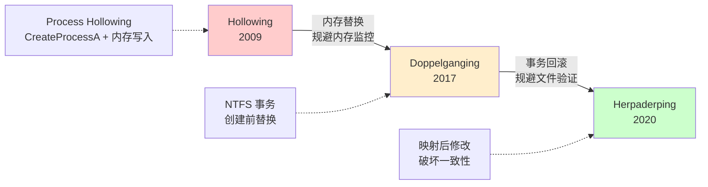
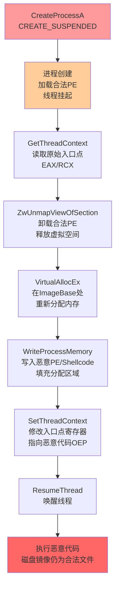
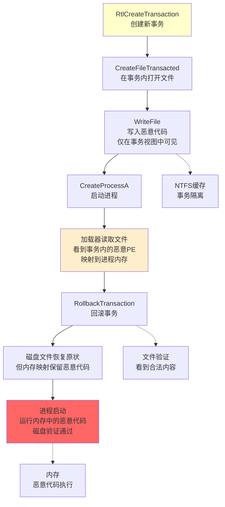
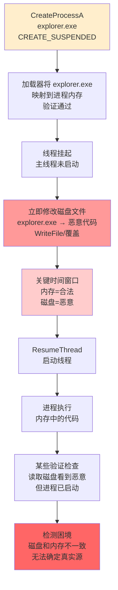

# 恶意代码分析与免杀对抗（7）· 进程镂空与傀儡进程Hollowing

> [!abstract] TL;DR
> - **Process Hollowing** 通过创建挂起进程、卸载原PE、写入恶意代码、修改入口点来隐藏恶意逻辑，比经典注入的IPC消息更隐蔽
> - **Doppelganging** 利用 NTFS 事务回滚在创建进程前完全替换二进制，无需明显的内存操作，对内存扫描难以追踪
> - **Herpaderping** 通过在映射后即时修改磁盘文件，打破进程与磁盘镜像的一致性，规避验证机制
> - 三种技术递进式规避进程创建监控、内存特征扫描、磁盘验证，代表了注入对抗的进化路线
> - 防守端需从进程启动链、内存完整性、映射验证、加载器行为等多维度进行检测和加固

---

## 概述与定位

进程镂空（Process Hollowing）是一类高级进程注入技术的统称，其核心思想是**先创建一个合法进程的表壳，再用恶意代码填充其内部**。相比 [[06.进程注入技术全谱|前一章]] 中讲的直接远程注入，进程镂空具有以下关键特征：

1. **创建者身份的利用**：注入者拥有对创建进程的完全控制，而非对已运行进程的侵入
2. **内存布局的重构**：可在进程启动的最早阶段（线程挂起时）修改内存映射，而不是事后修补
3. **文件验证的绕过**：从磁盘加载的二进制与实际运行的代码可以不一致

进程镂空技术家族包括三个重要变体：

- **Process Hollowing**（2009年左右出现）：基础形式，通过 CreateProcessA + 内存操作实现
- **Process Doppelganging**（2017年，Tal Melamed 等公开）：利用 NTFS 事务在创建前就替换文件
- **Process Herpaderping**（2020年，Spencer McIntyre 等公开）：在文件映射后修改磁盘内容

这个演进链条反映了对**进程创建链防守**的层层突破：Hollowing 规避了进程创建后的检查，Doppelganging 规避了创建前的扫描，Herpaderping 规避了启动后的验证。



---

## 原理与机制

### 进程启动的关键阶段

理解进程镂空，首先要明白 Windows 进程创建的分阶段特性。调用 `CreateProcessA/CreateProcessW` 时，操作系统执行以下步骤：

1. **内核对象创建**：创建 PROCESS 和 THREAD 内核对象
2. **虚拟地址空间初始化**：为新进程分配虚拟内存范围（通常从 `0x00400000` 开始）
3. **PE 映射**（若未指定 CREATE_SUSPENDED）：通过加载器将磁盘上的 PE 文件映射到内存，包括：
   - 解析 PE header 获取配置信息
   - 映射每个 section 到计算出的虚拟地址
   - 执行重定位和导入表修复（IAT binding）
4. **线程初始化**：设置主线程的入口点和栈空间
5. **线程启动**（CREATE_SUSPENDED 旗标为0时）：执行 ntdll!LdrInitializeThunk，进入用户代码

**关键发现**：若指定 `CREATE_SUSPENDED` 旗标，操作系统会在第3步之后、第5步之前挂起线程。此时：
- 进程虚拟地址空间已分配
- 原始PE已映射到内存
- 主线程已创建但未执行任何用户代码
- 调用者仍持有进程句柄，拥有完全的内存访问权

这就是进程镂空的切口。

### Process Hollowing 的核心步骤

基础的 Hollowing 攻击流程如下：



步骤详解如下：

```
1. CreateProcessA(lpApplicationName, NULL, CREATE_SUSPENDED)
   └─ 操作系统加载合法进程（如 explorer.exe），但不启动主线程

2. GetThreadContext(hThread) 获取主线程的初始寄存器状态
   └─ 读取 EAX/RCX（x86/x64 中的指令指针），指向 ntdll!LdrInitializeThunk

3. ZwUnmapViewOfSection(hProcess, ImageBase)
   └─ 从进程内存中卸载原始的合法 PE，归还虚拟地址空间

4. VirtualAllocEx(hProcess, ImageBase, ImageSize, MEM_COMMIT)
   └─ 在原 PE 的基址处重新分配内存，用于放置恶意代码

5. WriteProcessMemory(hProcess, ImageBase, MalwareBuffer, ...)
   └─ 将恶意 PE（或已解包的 shellcode）写入分配的空间

6. SetThreadContext(hThread, new_context)
   └─ 修改线程上下文中的入口点寄存器
      [x86] EAX = 恶意 PE 的 OEP（Original Entry Point）
      [x64] RCX = 恶意 PE 的 Entry Point + ImageBase

7. ResumeThread(hThread)
   └─ 唤醒线程，开始执行恶意代码
```

**为什么这比远程注入更难检测？**

- **进程创建事件是合法的**：从系统角度看，这是创建 explorer.exe 的正常操作，创建事件日志中不会显示异常
- **无跨进程通信**：避免了 CreateRemoteThread、WriteProcessMemory（对远程进程的）等显著特征
- **父子关系符合预期**：创建者进程是正常的父进程
- **映像路径有效**：进程的 "镜像文件"（PEB 中的 ImagePathName）仍指向 explorer.exe，但实际代码已被替换

### 内存布局的细节问题

实际操作中，Hollowing 会遇到以下复杂性：

**1. 进程基址的不确定性（ASLR）**

在 ASLR 开启的系统上，操作系统可能不会在预期的基址（通常 0x400000）加载 PE。解决方案包括：

- 读取加载后的实际基址：通过 `ReadProcessMemory` 读 PEB 的 `ImageBaseAddress` 字段
- 使用固定基址的二进制：某些编译配置或老版本二进制可能禁用了 ASLR
- 动态重定位恶意代码：若恶意 PE 预期的基址与实际不符，需要执行完整的重定位修复

**2. Shellcode vs. PE 的取舍**

- **注入完整 PE**（含完整的 Section Table、Import Table）：更易维护，但需精确处理基址和重定位，且文件大小较大
- **注入原始 Shellcode**：更紧凑，但需手工管理导入函数地址和堆栈初始化，不能依赖 ntdll 加载器

许多变体选择注入无基址依赖的位置无关代码（PIC：Position Independent Code）加上一个精简的 stub，来兼顾大小和可靠性。

**3. 线程上下文的平台差异**

- **x86-32 bit**：入口点在 EAX（第一个参数传递寄存器），LdrInitializeThunk 期望 EAX = PE 的 ImageBase
- **x64-64 bit**：入口点在 RCX（第一个参数），值为 PE 的 ImageBase
- **ARM64**（较新系统）：寄存器约定不同，但原理相同

**4. TEB/PEB 的一致性**

线程执行的 ntdll!LdrInitializeThunk 会读取 TEB（Thread Environment Block）中的信息来初始化进程，包括：
- PEB（Process Environment Block）指针
- 栈基址和大小
- 调试器端口信息

若这些数据与实际进程状态不一致，可能导致初始化失败或崩溃。完善的 Hollowing 实现需要一并修正这些字段，或者直接从修改后的入口点跳过加载器初始化，直接进入用户代码。

---

## 进程镂空的系统原理与实现细节

### Hollowing 的关键 API 与权限需求

| API | 目的 | 权限需求 | 备注 |
|-----|------|--------|------|
| CreateProcessA/W | 创建挂起进程 | 同创建目标进程的权限 | CREATE_SUSPENDED 是关键旗标 |
| GetThreadContext | 读取线程寄存器状态 | THREAD_GET_CONTEXT | 获取原始入口点 |
| ZwUnmapViewOfSection | 卸载进程的 PE | PROCESS_VM_OPERATION | 需要 ntdll 暴露 |
| VirtualAllocEx | 分配内存 | PROCESS_VM_OPERATION | 在原 ImageBase 处 |
| WriteProcessMemory | 写入恶意代码 | PROCESS_VM_WRITE | 关键操作 |
| SetThreadContext | 修改线程上下文 | THREAD_SET_CONTEXT | 修改入口点 |
| ResumeThread | 启动线程 | THREAD_SUSPEND_RESUME | 触发执行 |

所有这些权限在**同一进程创建者内**是天然拥有的，这就是为何从子进程注入比从其他进程注入更容易规避防守。

### 进程基址识别与重定位

恶意载荷通常需要知道自己被加载到了哪个地址，以便正确地执行以下操作：

**方案1：完全位置无关代码（PIC）**
- 所有地址计算使用 RIP（指令指针）相对寻址
- 不依赖硬编码的基址
- x64 上相对容易，x86 需要额外技巧（如 `call $+5; pop eax` 获取 EIP）

**方案2：动态基址获取 + 重定位**
```c
// 在运行时获取自身基址
ULONG_PTR GetImageBase() {
    return (ULONG_PTR)&__ImageBase;  // 编译器内建符号
}

// 或通过 PEB 读取
PEB* peb = (PEB*)__readgsqword(0x60);  // x64: GS:[0x60] = PEB
ULONG_PTR base = (ULONG_PTR)peb->ImageBaseAddress;
```

**方案3：在注入时传递基址**
- 在 Hollowing 时计算实际基址
- 通过栈、寄存器或特定内存位置传递给恶意代码
- Shellcode 第一条指令读取并使用该基址

### 导入表绑定与 API 访问

若注入的是完整 PE（带 IAT），需要处理导入表：

**自动处理**（依赖加载器）：
- 若不修改线程上下文直接跳往 PE 的 OEP 而是让加载器初始化，ntdll 会自动填充 IAT
- 风险：加载器初始化可能检测到非预期的状态而拒绝

**手工处理**（通常方案）：
- 在 Hollowing 时，直接扫描 PE 的 Import Directory Table（IDT）
- 对每个导入的 DLL，使用 LoadLibraryA/GetProcAddress 获取函数地址
- 将地址填入 IAT（本质上是内存中的指针表）
- 代码访问 IAT 项时就能调用真实的系统函数

```c
// 伪代码：手工修复 IAT
PIMAGE_IMPORT_DESCRIPTOR iid = IDT_ADDRESS;
while (iid->Name) {
    HMODULE hMod = LoadLibraryA((char*)(ImageBase + iid->Name));
    PIMAGE_THUNK_DATA iat = (PIMAGE_THUNK_DATA)(ImageBase + iid->FirstThunk);
    
    while (iat->u1.Function) {
        if (iat->u1.Ordinal & 0x80000000) {  // 按序号导入
            DWORD ord = iat->u1.Ordinal & 0xFFFF;
            iat->u1.Function = (ULONG_PTR)GetProcAddress(hMod, (char*)ord);
        } else {  // 按名称导入
            PIMAGE_IMPORT_BY_NAME ibn = (PIMAGE_IMPORT_BY_NAME)(ImageBase + iat->u1.AddressOfData);
            iat->u1.Function = (ULONG_PTR)GetProcAddress(hMod, ibn->Name);
        }
        iat++;
    }
    iid++;
}
```

### Doppelganging 的事务替换机制

Doppelganging（2017）的创新在于**在进程创建前就替换二进制**，完全避免了内存操作的痕迹。其原理利用了 NTFS 事务（NTFS Transactions）的回滚特性：

**核心思想**：
- NTFS 事务允许一组文件操作作为"原子"单元执行
- 若事务中途回滚，所有修改都会撤销
- Windows 进程加载器在事务回滚前读取文件，会获得事务内的**临时修改视图**

**技术流程**：



```
1. RtlCreateTransaction() 创建新事务
   └─ 获得事务句柄

2. CreateFileTransacted() 在事务内打开目标二进制（explorer.exe）
   └─ 在事务隔离下获得文件句柄

3. WriteFile(hTransactedFile, MalwareBuffer, ...) 
   └─ 在事务内将恶意代码写入文件
   └─ 此时文件系统缓存中看到的是恶意内容，但磁盘和其他进程看不到

4. CreateProcessA() 启动进程，触发加载器读取
   └─ 加载器看到事务内的文件视图，即恶意 PE
   └─ 内核中的内存映射指向事务中的数据

5. RollbackTransaction()
   └─ 回滚事务，恶意修改从 NTFS 还原
   └─ 但进程的内存映射（由内核维护的 Section object）仍指向旧的内存视图
   └─ 磁盘上的文件恢复为原始状态

6. 进程启动
   └─ 运行的是内存中的恶意代码，但磁盘、文件验证、签名检查都看到合法的原始文件
```

**为什么规避检测**：

- **文件级验证失效**：签名校验工具、文件哈希检查看到的都是合法的原始文件
- **内存快照困难**：从内存提取的二进制与磁盘不一致，难以验证"真实"内容
- **创建事件正常**：从进程创建的日志看，仍是 CreateProcessA(explorer.exe)，无异常
- **句柄操作隐蔽**：未进行显著的内存操作，避免了 VirtualAllocEx、WriteProcessMemory 的事件

**限制因素**：

- 仅适用于 NTFS 文件系统（不适用 FAT32、ReFS）
- 事务功能在某些 Windows 版本（如 Home 版）中被禁用
- 需要文件写入权限（通常在 System32 下无法获得）
- 事务回滚时间窗口很小，时序敏感

### Herpaderping 的映射后修改

Herpaderping（2020）更进一步：**在文件已被映射到内存后立即修改磁盘上的文件**，破坏进程与其镜像的一致性。

**关键前置知识**：
- 进程的文件映射（Section）在创建时拍摄，映射完成后修改磁盘文件**不影响已映射的内存内容**
- 许多验证机制（如代码完整性检查、签名验证）发生在映射时
- 但某些检查会在映射后进行，期望内存与磁盘一致

**技术流程**：



```
1. CreateProcessA(explorer.exe, CREATE_SUSPENDED)
   └─ 创建进程，加载器将 explorer.exe 映射到内存
   └─ 此时进程内存包含合法的 explorer.exe 代码
   └─ 验证机制（如 Code Integrity 检查）可能在映射时通过

2. 操作系统完成映射和验证，但线程仍挂起

3. 调用者立即修改磁盘上的 explorer.exe
   └─ WriteFile(hFile, MalwareBuffer, ..., FILE_WRITE_ATTRIBUTES)
   └─ 物理磁盘的 explorer.exe 被替换为恶意代码
   └─ 但进程内存中的映射仍是合法内容

4. ResumeThread(hThread)
   └─ 进程开始执行内存中的合法 explorer.exe 的初始化代码

5. 但等等 —— 重点来了：
   某些启动过程会再次检查磁盘文件的完整性，比如：
   - Windows Defender 的启发式扫描
   - 某些商业 EDR 的文件监控
   - HVCI（Hypervisor-protected Code Integrity）的验证
   
   这些检查读取磁盘，看到恶意代码 → 但时机已晚，进程已启动！

6. 恶意代码在内存中执行，同时磁盘上也显示恶意内容
   └─ 若检测基于"磁盘 + 内存 hash 应一致"的假设，则验证失败，但进程已在运行
```

**为什么 Herpaderping 难以防守**：

- **时序漏洞**：在映射验证完成、文件修改完成、进程执行开始之间存在窗口
- **验证假设的破坏**：打破了"进程镜像与磁盘应一致"的基本假设
- **多来源的矛盾**：内存显示合法，磁盘显示恶意，取证时无法确定"真实"源
- **进程启动链的完整性被破坏**：进程从合法镜像启动，但代码来自恶意磁盘文件

**Herpaderping 的限制**：

- 需要对磁盘文件的写入权限
- 在写时间和启动时间之间有竞态：若启动太快，修改未完成；太慢，检查可能完成
- 现代系统的文件锁定可能阻止修改（进程加载时通常持有共享锁）
- 某些 EDR 通过实时文件监控和内存扫描的交叉验证能检出异常

---

## 工具视角与实战

### 开源 PoC 与工具链

**Process Hollowing 的经典实现**：

- **Metasploit Framework** 的 `windows/meterpreter/reverse_tcp` payload 集成了 Hollowing 注入
- **Empire/Covenant** C2 框架的加载器使用 Hollowing 加载第二阶段代码
- **SpawningEngine**（原 GhostInTheShell）：独立 PoC，展示了基础 Hollowing 和线程上下文修改的完整实现

**Doppelganging 的实现**：

- **Tal Melamed** 的原始公开示例使用 NTFS 事务 API
- **MDSec** 的研究包含了针对 Windows 10/11 的适配版本
- 通常需要 `RtlCreateTransaction`、`CreateFileTransacted` 等 undocumented API

**Herpaderping 的演示**：

- **Spencer McIntyre** 的原始 PoC 在 GitHub 上发布
- 展示了文件修改时序的精准控制

### 检测 Hollowing 的端点指标

安全监控应从多个维度追踪：

**1. 进程创建事件的异常模式**
- 通常 Hollowing 目标是系统二进制（explorer.exe、svchost.exe、dllhost.exe）
- 这些进程突然出现罕见的父进程（如浏览器、Office）则可疑
- 进程创建的完整命令行为空或异常

**2. 内存操作的检测**（若监控原始 Hollowing）
- `CreateRemoteThread` + `WriteProcessMemory` 序列（虽然 Hollowing 本身避免了这个，但某些实现可能先远程注入再 Hollow）
- 对系统进程的 `VirtualAllocEx` + `WriteProcessMemory`（取决于内存监控的粒度）

**3. PE 文件完整性扫描**
- 内存中的 PE Header 与磁盘上的不一致（Herpaderping 的特征）
- Entrypoint 被修改（SetThreadContext 的痕迹）

**4. 加载器跳过的指标**
- 某些进程的 ntdll!LdrInitializeThunk 被 Patch/Hook（规避加载器验证）
- 进程的 TEB/PEB 中的数据与实际内存映射不一致

**5. 文件系统的事务迹象**（Doppelganging 特有）
- NTFS 事务的创建和回滚操作（仅在事务 API 被直接监控时）
- 极短的时间窗口内文件内容与签名验证之间的矛盾

### 实战场景：EDR 与防守对抗

**EDR 的防守策略**：

1. **驱动级文件监控**：拦截磁盘写操作，若目标文件是系统二进制则禁止
2. **内存一致性检查**：定期扫描进程内存，计算 PE Hash，与磁盘对比
3. **签名验证**：强制执行代码签名检查（Windows Defender SmartScreen、HVCI）
4. **进程启动链限制**：限制哪些进程可以创建 explorer.exe 等敏感进程
5. **事务 API Hook**：监控 RtlCreateTransaction、CreateFileTransacted 的调用

**攻击者的适应**：

- 使用合法进程打造的"宿主"（如运维工具、企业软件）而非标准系统二进制
- 在内存和磁盘验证之间的窗口修改，或利用时间检查的竞态
- 结合 Direct System Calls（绕过用户态 Hook）进行 Hollowing 操作
- 使用多层加载器：第一层 Hollow 加载第二层 Stub，第二层才是真正的恶意代码

---

## 安全性与正确使用

> [!caution]
> 进程镂空及其变体（Doppelganging、Herpaderping）是高度侵入式的进程操纵技术。本章节的技术讨论仅针对以下场景：
> 
> - 自有系统的安全研究与加固测试
> - 获得明确书面授权的渗透测试和红队评估
> - CTF 竞赛、学术研究环境
> - 防守工具与 EDR 产品的原理学习与检测开发
> 
> **严禁**用于：
> - 任何未授权的目标系统（包括生产环境、他人云服务、在线服务）
> - 规避商业软件授权的恶意行为
> - 数据窃取、勒索、破坏、追踪他人
> 
> 违法使用该技术将触犯《计算机欺诈和滥用法案》（CFAA，美国）、《刑法》第285-287条（中国）等法律，承担民事和刑事责任。

### 防守设计的关键原则

**1. 进程创建链的完整性**
- 强制要求父进程满足白名单（如仅允许 explorer.exe 创建 cmd.exe）
- 监控异常的进程树深度和并发创建数
- 使用 Windows 的 Process Creation Audit 日志，分析异常父子关系

**2. 内存映射的一致性验证**
- 定期计算进程内存中关键 Section（如 .text）的哈希值
- 与磁盘上的二进制对比，检测不一致
- 但注意：某些正常的自修改代码（JIT 编译、补丁）会改变内存内容，需白名单

**3. 代码完整性（Code Integrity）的强制**
- 启用 Windows Defender Code Integrity（DCI）或 Hyper-V Code Integrity（HVCI）
- 强制所有执行的代码页都经过签名验证
- 限制驱动级代码的加载，防止 Hollowing 的内存回写被隐藏

**4. 文件访问控制的细化**
- System32 和 SysWOW64 目录的写操作应仅限管理员，且应审计
- 文件写入权限与执行权限分离（Write XOR Execute）
- 对关键系统二进制启用 WIP（Windows Integrity Protection）或类似机制

**5. 直接系统调用的检测**
- Hollowing 的高阶版本会使用 syscall 绕过用户态 Hook
- 驱动级监控需要在内核中 Hook 相关系统调用（NtCreateProcess、NtUnmapViewOfSection、NtSetInformationThread）
- 但此法需注意性能和误报率

### 蓝队加固的分层策略

**第一层：预防**
- 禁用 NTFS 事务功能（Doppelganging 的前提）
- 启用代码签名强制，拒绝未签名的进程
- 限制文件写入权限，防止 Herpaderping

**第二层：检测**
- 部署文件完整性监控（FIM）工具，监测关键二进制的修改
- 进程内存扫描与磁盘镜像对比
- 异常进程创建链分析（父进程、权限提升、目标进程类型）

**第三层：响应**
- 进程隔离或杀死可疑进程
- 内存 dump 并分析，与磁盘镜像对比以确认恶意代码
- 事件日志溯源，追踪初始访问向量

**第四层：恢复**
- 系统二进制的完整性验证和恢复
- 内核态检查，确认没有驱动级恶意代码
- 重启到安全模式进行深度扫描

---

## 小结

进程镂空及其演进型态（Doppelganging、Herpaderping）代表了进程注入对抗的最前沿：

1. **Process Hollowing** 通过在进程创建时进行内存替换，规避了进程创建事件的异常，但仍可通过内存扫描和 API 监控检测。

2. **Process Doppelganging** 利用 NTFS 事务的回滚特性，在进程创建前就完成了代码替换，避免了明显的内存操作，但依赖特定的文件系统和版本。

3. **Process Herpaderping** 打破了进程镜像与磁盘一致性的假设，在映射后修改磁盘内容，制造了多来源矛盾，使取证困难。

这三种技术的递进说明：**防守的每一层加固都会催生更深层次的对抗**。仅依靠单一的检测维度（如文件签名、内存扫描、创建事件）都是不够的。有效的防守需要从进程创建链、代码完整性、内核监控、文件访问控制等多个维度进行纵深防守，同时在 EDR/XDR 中建立关联分析，才能应对这类高级对抗。

在现代威胁中，Hollowing 及其变体已成为 APT、勒索软件、恶意软件加载器的标配技术。安全研究人员和防守团队必须深刻理解这些机制的原理，才能设计有效的检测和防护措施。

---

## 相关阅读

- [[06.进程注入技术全谱]] —— 了解 Hollowing 之外的其他注入技术背景
- [[32.hooks/11-process-injection]] —— 进程注入的底层机制与 Hook 对抗
- [[32.hooks/12-kernel-hook]] —— 内核级监控与绕过
- [[32.hooks/15-etw]] —— ETW 日志追踪进程行为
- [[53.数字取证与事件响应/00.数字取证与事件响应总览]] —— 进程 Hollowing 的内存取证方法
- [[08.持久化技术大全]] —— Hollowing 作为初始持久化的应用
- [[11.免杀原理：混淆与加密与加载器]] —— 加载器与 Hollowing 的结合
- [[27.Go与Rust现代二进制逆向/00.Go与Rust现代二进制逆向总览]] —— 现代语言编译的二进制与 Hollowing 的兼容性

---

[[00.恶意代码分析与免杀对抗总览|⬆ 系列总览]] | [[06.进程注入技术全谱|← 上一章]] | [[08.持久化技术大全|→ 下一章]]
