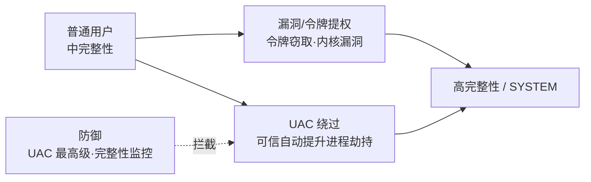

# 恶意代码分析与免杀对抗（9）· 提权与UAC绕过

> [!abstract] TL;DR
> - Windows令牌是访问控制的最小单位，包含SID、特权、完整性级别；令牌窃取通过复制、冒充进程令牌或滥用ALPC通信链完成
> - UAC基于完整性级别（IL）+令牌过滤实现分层隔离，绕过本质是绕过IL检查而非权限本身，微软v1-v4的补丁演进说明为何DLL劫持、COM接口、注册表等方案有效及其原理
> - 内核提权分漏洞利用（驱动BO、GDI、Win32k）与功能滥用两类，需要IOCTL交互、污点追踪内核流程，现代样本常链式组合UAC+内核漏洞绕过多重保护

## 概述与定位

Windows安全模型采用分层防御：用户登录时生成主令牌（Primary Token），后续操作都在令牌定义的权限集合内进行。提权攻击的目标是突破当前令牌的限制，获得更高权限等级的令牌。本篇覆盖三个递进的攻击面：

1. **令牌窃取（Token Theft）**：在用户态通过已有权限复制或冒充其他进程令牌
2. **UAC绕过（User Account Control Bypass）**：突破Windows Vista引入的完整性级别隔离
3. **内核提权（Kernel Privilege Escalation）**：通过驱动漏洞或系统调用触发内核代码执行

后续章节【[[32.hooks/11-process-injection|进程注入]]】会利用提权结果进行更深层的代码执行，【[[32.hooks/12-kernel-hook|内核hook]]】涉及驱动加载与系统调用拦截，本篇重点在获权过程的原理与检测对抗。

---

## 原理与机制




### Windows令牌的核心结构

令牌（Token）是Windows内核维护的对象，代表一个线程/进程的安全上下文。每次线程执行需要访问资源时，内核检查令牌中的信息：

- **安全标识（SID, Security Identifier）**：用户SID（S-1-5-21-...）、组SID（Administrators、SYSTEM）
- **特权列表（Privileges）**：SE_ENABLE_DELEGATION_PRIVILEGE（允许服务模拟客户端）、SE_IMPERSONATE_PRIVILEGE（模拟权限）等40+种，每个特权有启用/禁用状态
- **完整性级别（Integrity Level, IL）**：Low、Medium、High、System，Vista+引入，用于跨进程访问的二次检查
- **令牌类型**：Primary Token（进程初始化）vs Impersonation Token（线程冒充），后者生命周期可短至一个API调用

```
令牌结构简图：
┌─────────────────────────────────────┐
│ Token Object (内核)                 │
├─────────────────────────────────────┤
│ Type: Primary / Impersonation        │
│ User SID: S-1-5-21-xxx-xxx-xxx-1000  │
│ Primary Group SID                   │
│ Groups: [Administrators, ...] + 属性 │
│ Privileges: (SE_DEBUG, SE_IMPERSONATE, ...) │
│ Integrity Level: Medium / High / System │
│ Virtualization: Enabled/Disabled    │
│ Owner: Process/Thread               │
└─────────────────────────────────────┘
```

### UAC隐形护盾的三层机制

**完整性级别检查（Integrity Level Check）**：
当一个Medium IL的进程尝试打开High IL的进程进行内存读写时，内核在ACL检查之前执行IL比较：如果访问方的IL < 目标的IL，直接拒绝，不管该用户是否Administrators组成员。这是Vista后与XP最大的区别，打破了"Administrators = 无限权限"的假设。

**令牌虚拟化（Token Virtualization）**：
Low IL进程的注册表写入重定向到HKEY_CURRENT_USER\VirtualStore（对用户"隐形"），系统文件写入被拦截。微软的目标是让旧应用在Low IL下看起来能写，但实际隔离了污染。这给了一些绕过机会：写到VirtualStore的DLL后通过DLL搜索路径优先级加载。

**令牌过滤（Token Filtering）**：
一个High IL进程从Low IL进程（如浏览器）启动时，自动移除Administrators组SID和强大特权（如SE_DEBUG）。这防止Low→High的提权链，但引入了绕过可能：如果High IL程序有逻辑缺陷（如允许用户指定DLL路径或COM服务器），攻击者仍可利用。

### 内核提权的黑白线

内核提权需要触发Ring 0代码执行，本质上三条路：

1. **驱动漏洞**：溢出、整数溢出、竞态条件、信息泄露，通过IOCTL或特殊文件操作触发
2. **系统调用缺陷**：Win32k（GDI子系统）缺陷最常见，因为GDI在Ring 0运行且接收来自用户态的复杂指令
3. **功能滥用**：WMI、COM服务、计划任务等以高权限运行的服务有逻辑漏洞或参数注入

---

## 令牌、UAC与内核的多维对抗

### 令牌窃取的五个维度

**维度1：主令牌复制（Primary Token Duplication）**

当攻击者已获得对目标进程的句柄权限时，调用 `DuplicateToken` 复制目标令牌成为Impersonation Token：

```c
HANDLE hToken = NULL;
OpenProcessToken(hTargetProcess, TOKEN_DUPLICATE, &hToken);
HANDLE hDupToken = NULL;
DuplicateToken(hToken, SecurityImpersonation, &hDupToken);
// 此时hDupToken与目标权限完全相同
ImpersonateLoggedOnUser(hDupToken);
```

原理：Windows设计上，取得进程句柄的代码可以读该进程的令牌（假设无MAC层限制），这反映了"进程所有者掌控"的理念。但在多用户环境中，Local System或高权限服务进程令牌一旦被复制，攻击者就升到SYSTEM。防御需要：检查句柄打开时的目标进程权限等级，拒绝Low IL→High IL的令牌操作。

**维度2：ALPC消息冒充（ALPC Impersonation）**

Advanced Local Procedure Call（ALPC）是Win32 RPC的内核层基础。当一个进程通过ALPC与另一个进程通信时，接收方可以声明对发送方的冒充：

```c
// 服务端接收消息时
HANDLE hPort;
while (AlpcReceiveMessage(hPort, &message, ...)) {
    // 在处理消息前冒充客户端
    AlpcImpersonateClientOfPort(hPort, &message);
    // 后续操作以客户端权限执行
    // ...
    AlpcReverseImpersonation(hPort);
}
```

如果服务以SYSTEM运行但未校验客户端身份，任何Low IL进程都可冒充自己是高权限用户，服务就会以假身份执行操作（如写高权限文件、创建计划任务）。Named Pipe impersonation是这种原理的特化版本。

**维度3：进程令牌窃取（Process Token Snapshot）**

某些情况下，攻击者无法直接获得进程句柄，但可以通过Windows事件追踪（ETW）或内核回调（如 SetWinEventHook）观察其他进程的令牌切换动作。更直接的方式是遍历所有线程的模拟令牌栈：

```c
// 模拟当前线程的令牌栈：
//   Thread -> ImpersonationToken1 -> ImpersonationToken2 -> ...
// 每一层可能来自不同来源（COM、RPC、内核句柄）
// 特殊情况：System Thread模拟Administrators令牌
```

防御者需要监控线程令牌切换频率，异常高的切换可能表示令牌嗅探行为。

**维度4：特权提升（Privilege Escalation within Token）**

即使复制了一个令牌，其特权可能处于禁用状态。某些特权（如SE_DEBUG）需要显式启用：

```c
TOKEN_PRIVILEGES tp;
LookupPrivilegeValue(NULL, SE_DEBUG_NAME, &tp.Privileges[0].Luid);
tp.Privileges[0].Attributes = SE_PRIVILEGE_ENABLED;
AdjustTokenPrivileges(hToken, FALSE, &tp, ...);
```

一旦SE_DEBUG启用，该令牌对应的线程就可以附加到任何进程进行调试，绕过IL检查。防御是某些特权（如SE_IMPERSONATE、SE_DEBUG）在创建令牌时自动禁用，除非代码路径显式启用。

**维度5：系统登录令牌注入（Logon Session Token Creation）**

高级攻击不复制现存令牌，而是创建新的登录会话：

```c
HANDLE hToken = NULL;
LogonUser(L"Administrator", L".", L"password", LOGON32_LOGON_INTERACTIVE, 
          LOGON32_PROVIDER_DEFAULT, &hToken);
// 成功则得到一个管理员令牌
CreateProcessAsUser(hToken, L"C:\\Windows\\System32\\cmd.exe", ...);
```

这要求获知或爆破目标用户密码。Mimikatz的 "sekurlsa" 模块会从LSASS内存转储明文密码，一旦有密码就可以重新登录。防御：部署Windows Defender Credential Guard（虚拟化LSASS），或启用Credential Guard把密码从内存中完全移出。

### UAC绕过的四代演进

**第一代：注册表路径劫持（Registry Path Hijacking）**

UAC会弹框提示用户，但如果用户点击"是"，被启动的程序是High IL的，此时它可以直接写System32。早期的UAC绕过发现：某些Windows组件（如Disk Cleanup, Computer Defragmenter）的启动参数来自注册表，且这些注册表键可被Non-Admin用户写入：

```
HKU\.DEFAULT\Software\Classes\...\shell\open\command
→ 改为指向攻击者的可执行文件
→ 用户点击UAC同意某个高权限操作
→ 实际执行的是攻击者的EXE
```

**第二代：DLL搜索路径劫持（DLL Hijacking via Search Order）**

High IL进程加载DLL时按顺序搜索：当前目录 → System32 → SysWoW64 → ...。如果一个High IL应用在当前目录加载DLL（如 WinRAR 解压缩目录下的DLL），Low IL的攻击者可提前放置同名恶意DLL：

```
C:\Users\attacker\Downloads\archive\
  ├── WinRAR.exe (High IL 在此目录运行)
  └── UxTheme.dll (攻击者的恶意版本，High IL加载)
```

这不是UAC"被绕过"，而是利用High IL程序的加载逻辑漏洞。防御：使用 SetDllDirectory 限制搜索路径，或签名校验DLL。

**第三代：COM接口滥用（COM Elevation of Privilege）**

某些COM服务以High IL运行，但客户端接口允许Low IL调用。IFileOperation（文件操作COM接口）就是经典案例：

```c
IFileOperation *pfo = NULL;
CoCreateInstance(CLSID_FileOperation, NULL, CLSCTX_ALL, 
                 IID_IFileOperation, (void**)&pfo);
// pfo对象运行在High IL
pfo->CopyItem(L"C:\\Users\\attacker\\mal.exe", 
              L"C:\\Windows\\System32\\mal.exe", // High IL执行
              NULL);
```

UACMe 的 Simda、Fubuki 等方案都是滥用特定COM接口的权限提升。微软的修补方式是将这些接口的IL要求提升到High，但总有新的遗漏接口被发现。

**第四代：绕过令牌过滤（Token Filtering Bypass）**

即使前三代补丁都打上，攻击者可以尝试绕过令牌过滤本身。例如，通过创建一个"假的"令牌过滤过程，或利用某些系统组件加载High IL DLL时不进行充分的验证。现代UAC还有个漏洞：某些条件下（如特定注册表路径、进程标记），Windows可能跳过过滤。

### 内核提权的触发链

典型的内核漏洞利用流程：

1. **漏洞发现**：Fuzzing驱动IOCTL、分析系统调用边界
2. **漏洞触发**：精心构造输入参数，使驱动执行不安全操作（如未初始化的堆、缓冲区溢出）
3. **控制流劫持**：如果是栈溢出，覆盖返回地址；如果是堆漏洞，修改虚表指针
4. **Shellcode执行**：在Ring 0执行自定义代码，通常是补充令牌特权或修改访问控制列表
5. **权限巩固**：创建持久化后门，或加载内核驱动保留权限

驱动通常通过 CreateFileA 打开设备驱动，然后 DeviceIoControl 发送命令：

```c
HANDLE hDriver = CreateFileA("\\\\.\\VulnerableDriver", 
                              GENERIC_READ | GENERIC_WRITE, ...);
DWORD payload[256] = { /* 精心构造的数据结构 */ };
DWORD bytesReturned;
BOOL result = DeviceIoControl(hDriver, IOCTL_VULNERABLE_FUNCTION, 
                               payload, sizeof(payload), ...);
// 如果驱动有缺陷，可能造成内存腐坏或代码执行
```

常见的Win32k漏洞（GDI子系统在Ring 0）涉及窗口对象管理、位图操作、字体缓存。这些子系统接收用户态大量复杂指令，面积大、边界多，历史上产生过数百个CVE。

---

## 工具视角与实战

### 令牌枚举与窃取工具链

**Whoami /all**：Windows原生工具，枚举当前令牌信息：

```cmd
C:\>whoami /all

用户信息
---------
用户名     DESKTOP-ABC\Administrator
用户 SID   S-1-5-21-123456789-123456789-123456789-500

组信息
------
组名                            类型   SID                               属性
Administrators                  Group  S-1-5-32-544                      启用的组默认
Builtin\Users                   Group  S-1-5-32-545                      启用的组默认

特权信息
--------
特权名                                  说明                               状态
SeCreateTokenPrivilege                  创建令牌                           已禁用
SeDebugPrivilege                        调试程序                           已禁用
SeEnableDelegationPrivilege             启用令牌的委派                     已禁用
SeImpersonatePrivilege                  模拟客户端的令牌                   已启用
```

**Mimikatz 的 token 模块**：复杂场景下的令牌操作：

```
mimikatz # token::list        // 列出所有令牌
mimikatz # token::enumerate   // 详细枚举
mimikatz # token::elevate     // 寻找可提升的令牌并切换
mimikatz # token::run /pid:804 cmd.exe  // 以目标PID的令牌运行cmd
```

原理：Mimikatz运行在当前(可能Low/Medium IL)进程，通过遍历所有线程、检查其模拟令牌栈，寻找System或High IL令牌可冒充的机会。如果找到，调用 SetThreadToken 切换当前线程的令牌。

**TokenStealer** 等自定义工具：通常实现以下逻辑：

```c
// 伪代码：扫描特权线程
for each process P {
    for each thread T in P {
        HANDLE hToken = GetThreadToken(T);  // 如果线程在模拟
        if (hToken.privileges include SE_IMPERSONATE or SE_DEBUG) {
            // 记录可用的高权限令牌
            record_for_later_use(hToken);
        }
    }
}
```

### UAC绕过的PoC与Metasploit模块

**Metasploit 的 exploit/windows/escalate/* 系列**：涵盖已知的UAC绕过（如 eventvwr、fodhelper、silentcleanup）：

```ruby
# modules/exploits/windows/escalate/uac_eventvwr.rb
# 工作原理：
# 1. EventVwr.exe (高权限)启动时，加载mmc.exe的DLL
# 2. 攻击者在注册表HKCU写入恶意DLL路径
# 3. EventVwr加载DLL时，DLL以高权限运行
# 4. DLL内代码掉回来启动攻击者进程

Exploit::Remote::Powershell {
    register_options([
        OptString.new('LHOST', [true, 'LHOST']),
        OptInt.new('LPORT', [true, 'LPORT']),
    ])

    def exploit
        ps_code = powershell_code  # 反向shell Powershell脚本
        generate_eventloop_bypasses(ps_code)
        # 写注册表、触发EventVwr、等待高权限回连
    end
}
```

**UACMe 开源项目**：专门收集UAC绕过方法的PoC库，当前维护60+种绕过技术，支持Windows 7-11。每个绕过编号对应一个具体方法：

```
UACMe #1-10:  注册表路径、DLL注入
UACMe #20-30: COM接口（IFileOperation、InprocServer32）
UACMe #40-50: Fodhelper、SilentCleanup（注册表路径）
UACMe #60+:   高版本Windows的新绕过（如Splunk Universal Forwarder路径、3rd-party installer）
```

### 内核调试与漏洞触发

利用内核漏洞需要精确构造触发条件。以一个假设的GDI漏洞为例：

```c
// 假设：某GDI函数在处理特殊字体文件时，
// 未校验字体头的某字段，导致堆溢出

HFONT hFont = CreateFontFromFile("malicious.ttf");
SelectObject(hdc, hFont);
TextOut(hdc, 0, 0, "trigger", 7);  // 触发堆溢出，写入shellcode

// Shellcode目标：
// 1. 在Ring 0查找当前进程EPROCESS结构
// 2. 定位令牌字段，复制system进程(PID 4)的令牌
// 3. 返回到用户态，此时线程已是SYSTEM权限
```

实战中常用 WinDbg（内核调试器）设置断点、观察内存变化验证漏洞，或用 Frida 在用户态Hook相关函数观察参数。

---

## 安全性与正确使用

> [!caution]
> **合规声明**：本文涉及的提权技术仅用于以下场景：
> - 自有系统的安全测试与研究
> - 授权渗透测试合同范围内
> - CTF竞赛与学术安全研究
> 
> **严禁**将本文内容用于：
> - 未授权系统的入侵与控制权获取
> - 商业竞争对手系统的攻击
> - 绕过安全产品保护真实目标
> - 为他人提供"成品"攻击工具
>
> 违反上述者需承担法律责任。本文以**防御与教育为角度**讲解原理，目的是帮助防御者理解威胁、加固系统。

### 防御者的检测视角

**事件日志监控**：

1. **令牌操作日志**（Audit Sensitive Privilege Use）：
   - Event ID 4673：敏感特权使用
   - 监控 SE_DEBUG、SE_IMPERSONATE、SE_DELEGATE 的启用

2. **进程创建与令牌切换**：
   - Event ID 4688：进程创建，若Integrity Level从Low→High属异常
   - 结合 Get-WinEvent -FilterHashtable @{ LogName='Security'; ID=4688 } 脚本化筛选

3. **ALPC通信异常**：
   - 事件日志中较难直接观察，需用WMI事件回调或内核ETW追踪

**代码级防御**：

```c
// 1. 禁用危险DLL搜索路径
SetDllDirectory(NULL);  // 禁用当前目录加载DLL

// 2. 清理令牌特权
// 不使用的特权尽早禁用或移除
TOKEN_PRIVILEGES tp = {0};
tp.PrivilegeCount = 1;
tp.Privileges[0].Luid = <SE_IMPERSONATE LUID>;
tp.Privileges[0].Attributes = 0;  // 不启用
AdjustTokenPrivileges(GetCurrentProcessToken(), FALSE, &tp, ...);

// 3. 令牌完整性检查
DWORD dwIL = GetTokenIntegrityLevel(hToken);
if (dwIL < SECURITY_MANDATORY_HIGH_RID) {
    // 拒绝来自低IL进程的关键操作
    return FALSE;
}
```

### 蓝队对抗与缓解措施

**短期缓解**：

1. **禁用特定COM接口的Remote激活**（Group Policy）：
   - HKLM\Software\Policies\Microsoft\Windows\OLE\AppCompat
   - 注册表设置限制特定CLSID的权限等级要求

2. **启用Code Integrity（CI）与Hypervisor-Protected Code Integrity（HVCI）**：
   - HVCI在Hypervisor隔离态验证内核代码签名，内核漏洞利用难度大幅上升
   - Windows 11默认推荐启用，但对老驱动兼容性有要求

3. **部署Credential Guard**：
   - 虚拟化LSASS进程，防止Mimikatz从内存转储密码
   - 需要UEFI Secure Boot + TPM 2.0硬件支持

**长期建议**：

1. **最小权限运行（Principle of Least Privilege）**：
   - 日常用户账户运行在Standard User，仅在需要时提升
   - 防止一个应用漏洞导致整个Administrators组权限泄露

2. **监控驱动加载**：
   - 仅允许签名驱动（强制Code Integrity）
   - 审计所有DeviceIoControl调用（ETW）

3. **版本与补丁管理**：
   - 微软每月补丁周期针对新发现漏洞，内核漏洞是高优先级
   - 跟踪Microsoft Security Updates与CVE公告

---

## 小结

提权与UAC绕过构成了恶意代码的第二道关键防线突破。令牌是Windows访问控制的最小执行单位，包含身份、特权、完整性三个维度；令牌窃取技术从简单的复制到复杂的ALPC冒充，反映了系统设计的进化与安全边界的拓展。

UAC模型虽然精妙（IL+令牌过滤），但其落地实现中的细节漏洞（COM接口权限配置、DLL搜索路径、注册表校验不足）让绕过成为持续的猫鼠游戏。每一代补丁修复某个漏洞，下一代研究人员又发现新的角落——这反映出在复杂系统中，完全的"免漏洞"是不现实的，防御的关键在于多层纵深。

内核提权则是最后的堡垒：需要漏洞（驱动BO、GDI缺陷）或信息泄露链的支持。现代样本往往链式组合UAC绕过+内核漏洞，以突破多重保护。防御者需要在事件监控、令牌隔离、驱动签名、补丁管理等多个维度同时发力。

---

## 相关阅读

- [[32.hooks/11-process-injection|进程注入技术全谱]]：令牌复制后的实战应用
- [[32.hooks/12-kernel-hook|内核hook与驱动编程]]：内核提权后的持久化与防御规避
- [[32.hooks/15-etw|ETW与事件追踪]]：检测令牌操作与进程提权的关键
- [[53.数字取证与事件响应/00.数字取证与事件响应总览|数字取证与事件响应]]：内存取证还原提权行为
- [[08.持久化技术大全|持久化技术大全]]：提权后的权限维持
- [[10.防御规避：反虚拟机与反调试与反沙箱|防御规避]]：提权工具的反检测策略
- [[27.Go与Rust现代二进制逆向/00.Go与Rust现代二进制逆向总览|现代二进制逆向]]：新一代提权样本的分析方法

[[00.恶意代码分析与免杀对抗总览|⬆ 系列总览]] | [[08.持久化技术大全|← 上一章]] | [[10.防御规避：反虚拟机与反调试与反沙箱|→ 下一章]]
