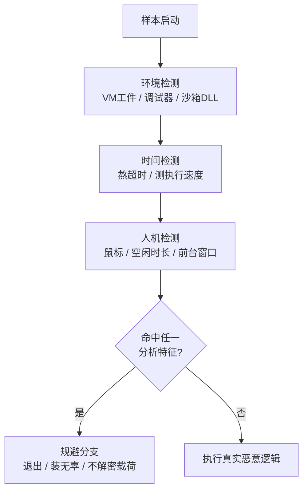
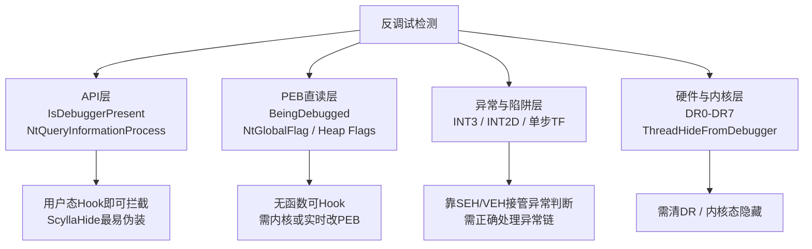
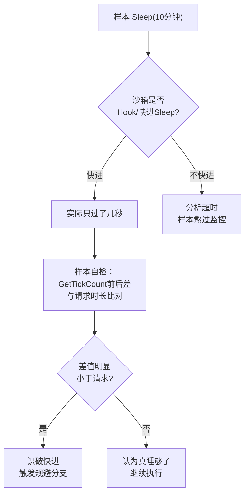
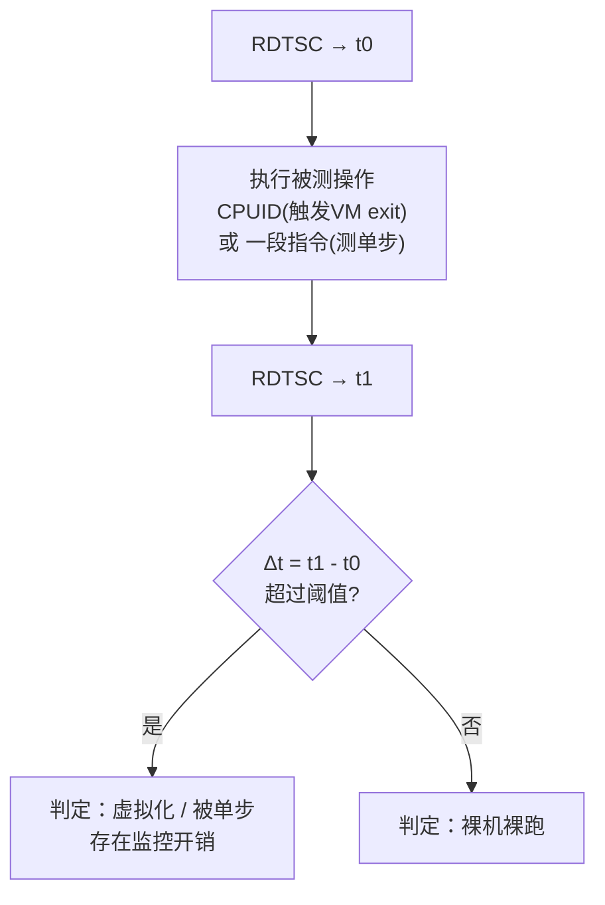

# 恶意代码分析与免杀对抗（10）· 防御规避：反虚拟机与反调试与反沙箱
> [!abstract] TL;DR
> - 反分析的本质是**「环境差异检测」**：样本寻找分析环境（虚拟机 / 调试器 / 沙箱）与真实受害机之间的可观测差异——**工件、时间、人机行为**三条轴，任一命中即改变行为（退出 / 装无辜 / 不解密载荷）。
> - 反调试分三层：**API 层**（`IsDebuggerPresent` / `NtQueryInformationProcess`）、**PEB 直读层**（`BeingDebugged` / `NtGlobalFlag` / Heap Flags，绕过用户态 Hook）、**异常与硬件层**（INT 3/2D、单步陷阱 TF、DR0-DR7、`ThreadHideFromDebugger`）——层级越低越难伪装。
> - 反虚拟机分**软工件**（MAC 前缀、注册表、驱动文件、进程名、SMBIOS 字符串）与**硬指纹**（CPUID hypervisor 位与厂商叶、SIDT/SGDT Red Pill、RDTSC 测 VM exit 开销、VMware 后门端口）；后者难伪造，是硬对抗的核心。
> - **时间检测**双向使用：既反沙箱（超长 `Sleep` 熬过分析超时；用 `GetTickCount` 前后差比对识破「快进 Sleep」），又反调试（RDTSC/QPC 测单步导致的时间膨胀）。
> - **人机检测**赌沙箱「无人交互」：鼠标位移 / 点击、`GetLastInputInfo` 空闲时长、前台窗口切换、最近文档数、真实开机时长——把自动化流水线与真人使用区分开。
> - 分析对抗是猫鼠循环：ScyllaHide / TitanHide 隐藏调试器、硬件断点替代 `0xCC`、加固 VM（改 MAC/SMBIOS/加内存核数、注入鼠标轨迹）、必要时上裸机；pafish / al-khaser 用来量化「我的环境有多容易被识破」。

## 概述与定位

在 MITRE ATT&CK 的战术分层里，本篇主题落在 **Defense Evasion（TA0005）** 下，核心对应三项技术：`T1497 Virtualization/Sandbox Evasion`（含 `.001 System Checks`、`.002 User Activity Based Checks`、`.003 Time Based Evasion`）、`T1622 Debugger Evasion`，以及作为「最强规避」的 `T1480.001 Environmental Keying`（环境密钥化）。用最朴素的话讲：**恶意代码在真正开火前，先问自己一句「我现在是不是被人盯着看？」——如果是，就装死或装无辜；如果不是，才释放真实载荷。**

这类技术之所以关键，是因为它直接决定了**分析结论是否可信**。现代商品化木马、下载器乃至 APT 样本几乎都带有某种程度的反分析逻辑；一个自动化沙箱如果被样本识破而只观测到「无害分支」，就会给出「Clean」误判，让样本堂而皇之地流过检测流水线。因此，理解反 VM / 反调试 / 反沙箱，既是**攻击者视角的免杀基石**，也是**防御者判断沙箱裁决可信度、并加固分析环境**的必修课。

需要先划清与相邻篇的边界，避免重复：
- 第 04 篇《动态分析：沙箱与行为监控》讲的是**分析者一侧如何搭建、运行沙箱**；本篇讲的是**样本如何识破并逃逸这类沙箱**，二者是攻防的一体两面。
- 第 03 篇《静态分析》处理特征、字符串、导入表；本篇里「导入了 `NtQueryInformationProcess`／出现 `cpuid`／`sidt` 指令」正是静态阶段能提前预警的**规避信号**。
- 第 11 篇《免杀原理：混淆与加密与加载器》讲静态免杀（过 AV 引擎与特征扫描）；本篇讲**动态免杀**（过运行时观测）。两者常配合：外壳先反调试确认「安全」，再解密并运行内层。
- 第 12 篇《直接系统调用与 unhooking》讲**如何绕过用户态监控 Hook**；本篇会引用它，但把「检测 Hook 是否存在」作为反沙箱原语讲，具体的直接系统调用实现留给第 12 篇。

## 原理与机制

所有反分析检测，抽象成一个谓词 `P(env) → {被分析, 未被分析}`。样本据此**分支**。整个技术家族的统一模型可以浓缩为一句话：**分析环境必然在某些可观测量上区别于真实受害机，检测就是去测量这些量并设阈值判定。** 差异来自三个不可消除的源头，正好对应本篇的三条主轴：

1. **工件差异（环境轴）**：分析要么依赖虚拟化（VMware / VirtualBox / KVM / Hyper-V），要么注入监控组件（调试器、Hook DLL、沙箱代理）。这些必然在系统里留下痕迹——设备、驱动、注册表键、进程名、特殊 MAC 前缀、SMBIOS 字符串，甚至 CPU 层面的 hypervisor 标志位。
2. **时间差异（时间轴）**：虚拟化的特权指令要陷入 VMM（VM exit），单步调试要在每条指令后中断处理，用户态 Hook 要多绕几层——这些都**变慢**。同时，自动化分析有**时间预算**（通常几十秒到几分钟），样本可以「熬时间」熬过它。
3. **行为差异（人机轴）**：真实用户会动鼠标、敲键盘、开一堆窗口、机器已经开了很久、桌面上有一堆最近文档；而全自动沙箱往往是**刚开机、无人交互、干净得反常**。



理解这套机制，关键是抓住**攻击者的三个设计目标之间的张力**：其一，**真实受害机上的误报要低**——如果检测太激进，把真用户也当成分析环境而拒绝执行，就等于放弃了目标，得不偿失；其二，**分析环境里的真阳性要高**——尽量识破所有主流沙箱；其三，**检测自身要隐蔽**——因为「调用了一堆稀奇古怪的检测 API」本身就是强烈的行为 IOC，会被沙箱反向标记为可疑。这三点常常互相拉扯，也解释了为什么高级样本倾向于用**环境密钥化**这种「不判断、只加密」的手法：它不显式地「if 被分析 then 退出」，而是把载荷用**目标环境特有的值**（域名、用户名、特定文件哈希、CPU 序列）派生的密钥加密——环境不对，密钥就算不出来，载荷永远解不开，分析者连「无害分支」都看不到真容，也抓不到一个明确的「检测→退出」把柄。

另一个反复出现的设计模式是**失败姿态（fail-safe posture）**的选择：识破后是「立刻退出」「抛异常崩溃」「静默进入死循环」，还是「执行一段人畜无害的诱饵逻辑」？成熟样本多选后者，因为「一进沙箱就退出」这件事本身就极其可疑，等于向分析者招手。装无辜（例如弹个报错框、打开一个正常网页、复制一个无害文件）才能骗过基于「行为是否可疑」的启发式裁决。

## 检测原语详解：环境指纹、时间侧信道与人机交互

这一段把三条主轴拆到**具体的检测原语**级别，给出偏移量、指令与代码，并逐条讲清「为什么这样能测出来、边界在哪、逆向时怎么看见它」。删掉代码块，中文也应能独立讲清每一点。

### 一、反调试原语

反调试按「离内核有多近」分层，越往下越难被用户态工具伪装。

**API 层**是最表层，也最容易被反制。经典调用链是 `IsDebuggerPresent`（本质就是读 PEB 的一个字节）、`CheckRemoteDebuggerPresent`、以及功能最全的 `NtQueryInformationProcess`：

```c
// ProcessDebugPort      = 0x07：被调试返回非0端口(通常 -1)
// ProcessDebugObjectHandle = 0x1E：被调试返回一个调试对象句柄
// ProcessDebugFlags     = 0x1F：反向——被调试时返回 0(NoDebugInherit 被清)
ULONG_PTR port = 0;
NtQueryInformationProcess(hProc, 0x07, &port, sizeof(port), NULL);
if (port != 0) { /* 正被调试 */ }
```

这一层的**深层弱点**在于：它们全走 ntdll 导出函数，分析者只要 Hook 住这几个函数、篡改返回值即可（ScyllaHide 正是这么做）。所以攻防重心迅速下沉到 PEB。

**PEB 直读层**跳过 API，直接从 `fs:[0x30]`（x86）/ `gs:[0x60]`（x64）拿到进程环境块，读取那些被调试器改写的字段。这就是为什么它比 API 层强——**没有函数可 Hook**，除非工具在内存里实时改 PEB 或用内核驱动。关键字段的字节布局如下（用代码块表达，不硬塞 Mermaid）：

```
; x86 (fs:[0x30]=PEB)              x64 (gs:[0x60]=PEB)
PEB+0x002  BeingDebugged  (BYTE)    PEB+0x002  BeingDebugged
PEB+0x018  ProcessHeap    (PTR)     PEB+0x030  ProcessHeap
PEB+0x068  NtGlobalFlag   (DWORD)   PEB+0x0BC  NtGlobalFlag
; 被调试器创建的进程，NtGlobalFlag 通常含 0x70：
;   FLG_HEAP_ENABLE_TAIL_CHECK      (0x10)
;   FLG_HEAP_ENABLE_FREE_CHECK      (0x20)
;   FLG_HEAP_VALIDATE_PARAMETERS    (0x40)
; 且进程堆头的 Flags/ForceFlags 被置位：正常运行时 ForceFlags 近似为 0，
; 被调试时堆会启用尾检查/校验，ForceFlags != 0。
```

其原理是：当调试器**创建**被调试进程时，系统会启用「调试堆」——尾部检查、释放检查、参数校验，这些通过 `NtGlobalFlag` 与堆头标志体现出来。样本只要读这几个偏移就能判断「我是不是被人 CreateProcess 出来调试的」。**边界与陷阱**：如果是**附加（attach）**到已运行进程，堆标志不会被追溯设置，这条就失效；而且这些偏移**随 Windows 版本与位数漂移**，写死偏移的老样本在新系统上会失灵——这也是逆向时判断样本年代的一个线索。

**异常与陷阱层**利用「调试器会优先接管异常」这一事实。常见把戏：
- 埋一条 `INT 3`（`0xCC`）或 `INT 2D`、`ICEBP`（`0xF1`），自己用 SEH/VEH 兜底。**无调试器**时异常落到自己的处理函数；**有调试器**时被调试器先吃掉，处理函数不被触发——据此反推。
- **单步陷阱标志（TF）**：设置 EFLAGS 的 TF 位后执行，正常会触发一次单步异常由自己捕获；若调试器在单步/跟踪，这个异常的语义会被打乱。
- `CloseHandle`/`NtClose` 传入一个**非法句柄**：仅在被调试时会抛出 `EXCEPTION_INVALID_HANDLE`（`0xC0000008`），据此判定。

**硬件与内核层**是最难对付的：
```c
CONTEXT ctx; ctx.ContextFlags = CONTEXT_DEBUG_REGISTERS;
GetThreadContext(GetCurrentThread(), &ctx);
if (ctx.Dr0 || ctx.Dr1 || ctx.Dr2 || ctx.Dr3 || ctx.Dr7)
    { /* 存在硬件断点 */ }
```
硬件断点存在 DR0-DR3（地址）与 DR7（控制），样本读自己的调试寄存器就能发现分析者下了硬件断点。另一记杀招是线程隐藏：
```c
// ThreadHideFromDebugger = 0x11
NtSetInformationThread(GetCurrentThread(), 0x11, NULL, 0);
// 之后本线程的调试事件不再上报给调试器；若工具未 Hook 该调用，
// 断点/单步会在此线程"丢失"，调试器仿佛瞎了。
```
`ThreadHideFromDebugger` 让内核不再把该线程的调试事件转发给附加的调试器，效果堪比给调试器蒙眼。**逆向对策**：ScyllaHide/TitanHide 会拦截 `NtSetInformationThread`、把这次隐藏「吞掉」，让线程照常上报。

此外还有两类补充原语常被忽略：**软件断点扫描**——样本对自己的 `.text` 段扫 `0xCC`，或算一段代码的 CRC/校验和与内置「干净值」比对，从而发现分析者植入的 `0xCC` 断点（对策就是用硬件断点，不改代码字节）；**父进程与窗口枚举**——检查父进程是不是 `explorer.exe`（正常双击启动）还是某调试器进程，或用 `FindWindow` 找 `OLLYDBG`、`WinDbgFrameClass`、x64dbg / IDA 的窗口类名，`Process32Next` 遍历找 `x64dbg.exe`、`ida.exe`、`procmon.exe`、`wireshark.exe` 等分析工具进程名。



### 二、反虚拟机原语

反 VM 分「软工件」和「硬指纹」，二者难度天差地别。

**软工件**是虚拟化平台留下的可枚举痕迹，一查一个准，但也一改就没：
- **MAC 前缀**：VMware 用 `00:0C:29`、`00:05:69`、`00:1C:14`、`00:50:56`；VirtualBox 用 `08:00:27`。样本读网卡 MAC 比前三字节即知。
- **注册表**：`HKLM\SYSTEM\CurrentControlSet\Services\Disk\Enum` 里出现 `VBOX HARDDISK` / `VMware Virtual`；`HKLM\HARDWARE\DESCRIPTION\System` 的 `SystemBiosVersion`/`VideoBiosVersion` 含 `VBOX`/`VMWARE`；存在 `SOFTWARE\VMware, Inc.\VMware Tools`、`SOFTWARE\Oracle\VirtualBox Guest Additions`。
- **驱动与文件**：`vmmouse.sys`、`vmhgfs.dll`、`VBoxMouse.sys`、`VBoxGuest.sys`。
- **进程与服务**：`vmtoolsd.exe`、`VBoxService.exe`、`VBoxTray.exe`。
- **SMBIOS / WMI**：`SELECT * FROM Win32_ComputerSystem` 的 `Manufacturer`=`VMware, Inc.`、`Model`=`VirtualBox`；`Win32_BIOS` 序列号、`Win32_Fan`（VM 里往往查不到风扇）、`Win32_PortConnector`（VM 缺物理接口）。

软工件的**深层脆弱性**在于：它们都是「可改的字符串/键值」，加固脚本（后文的 VMwareHardenedLoader 一类）可以逐条抹掉，所以只靠软工件的样本在加固过的分析 VM 里会失效。这也是为什么高级样本转向**硬指纹**。

**CPU 指令硬指纹**直接问 CPU「你上面有没有 hypervisor」，难以伪造：
```c
int regs[4];
__cpuid(regs, 1);
int hv = (regs[2] >> 31) & 1;   // 叶1 ECX bit31 = hypervisor present
// 厂商叶 0x40000000：EBX:ECX:EDX 拼出 12 字节厂商串
//   "VMwareVMware" / "VBoxVBoxVBox" / "KVMKVMKVM\0\0\0"
//   "Microsoft Hv" / "XenVMMXenVMM" / "TCGTCGTCGTCG"(QEMU-TCG)
```
`CPUID` 叶 1 的 ECX 第 31 位是 SDM 规定的「hypervisor 存在」提示位，几乎所有虚拟化平台都会置位；叶 `0x40000000` 更直接吐出厂商字符串。**为什么难伪造**：这两个是 CPU/VMM 层面的语义，除非 VMM 主动配置隐藏（部分平台可关，但会破坏 Guest 里许多依赖该位的正常软件），否则就在那儿明摆着。缺点是它**误报几乎为零但漏报也几乎为零**——它测的是「虚拟化」而非「分析」，而如今大量正常业务也跑在云 VM 里，单凭这条就退出会误伤真实目标，所以样本常把它当「加分项」而非「一票否决」。

**Red Pill 家族**（Joanna Rutkowska 的经典）走的是「读被虚拟化重定位的寄存器」：
```asm
sidt  fword ptr [idtr]   ; 存 IDTR：2字节limit + IDT基址
; 物理机上 IDT 基址通常较低(如 0x8003F400 附近)；
; 早期 VMware/VPC 为避冲突把 Guest 的 IDT 重定位到更高地址 → 读高字节即可分辨
```
同族还有 `SGDT`/`SLDT`（No Pill）与 `STR`（Scoopy）——它们都是**非特权可执行、却读的是每 CPU 独立的系统表基址**。**为什么现在不可靠**：单核时代一个 IDT，阈值法很准；多核 / 现代 CPU 每个逻辑核有独立 IDT，基址分布变化大，阈值误报飙升，`SIDT` 已从「银弹」退化为「弱信号」。逆向时看到 `sidt`/`sgdt` 往往能判断样本是老代码或抄了老 PoC。

**VMware 后门**是平台特有通道：
```asm
mov eax, 0x564D5868   ; 'VMXh' 魔数
mov ecx, 0x0A         ; 命令：取版本
mov dx,  0x5658       ; 'VX' 后门端口
in  eax, dx           ; VMware 在此接管 I/O
; 若返回 ebx == 0x564D5868 → 处于 VMware
; 真机上 IN 特权端口会异常，需 SEH 包裹以免崩溃
```
它利用 VMware 为 Guest 与主机通信预留的后门端口，命中即确证 VMware。**时间侧信道**版本的反 VM 则见下一小节的 RDTSC：测 `CPUID` 这类必然触发 VM exit 的指令耗时。

最后是**资源规格检测**：真机通常 ≥8GB 内存、≥256GB 磁盘、≥4 核、有独显和高分辨率；而分析 VM 常被抠成 2GB/60GB/2 核。样本用 `GlobalMemoryStatusEx`、`GetDiskFreeSpaceEx`、`GetSystemInfo` 读这些「太寒酸」的规格作为佐证。**陷阱**：这条误报最高（低配真机很多），只能当弱证据加权。

### 三、时间检测

时间既能反沙箱，也能反调试，是最具「侧信道」味道的一轴。

**熬时间（反沙箱）**：自动化沙箱有分析时间预算。样本主动 `Sleep` 一段远超预算的时间（如 10 分钟），等沙箱超时收工、判其无害后再干活。沙箱的反制是**Hook `Sleep`/`NtDelayExecution` 并「快进」**——把请求的 10 分钟压缩成几秒。于是攻防升级：样本**自测睡眠是否真实发生**：
```c
DWORD t0 = GetTickCount();
Sleep(600000);                 // 请求睡 10 分钟
DWORD slept = GetTickCount() - t0;
if (slept < 550000) { /* 被快进了 → 判定沙箱 */ }
```
只要 `Sleep` 前后的 tick 差远小于请求值，就说明有人快进，反手识破沙箱。更刁钻的手法包括：**分片睡眠**（成千次短睡，累加规避单点 Hook）、改用 `SetWaitableTimer`+`WaitForSingleObject` 或 `NtWaitForSingleObject`（换一条沙箱可能没 Hook 的延时路径）、以及**不睡而空转的 stalling code / API hammering**——用一个纯计算大循环，或把某个无害 API（如格式化字符串、无意义的 `GetVersion`）连调几百万次来烧掉墙钟时间，既拖过预算又不碰被 Hook 的 `Sleep`。**逻辑炸弹**是时间检测的另一面：检查系统日期，只在特定日期后（或特定星期几）才发作，让沙箱当天跑不出恶意行为。



**时间侧信道测调试 / VM（反调试 / 反 VM）**：正常执行一小段指令只需几十到几百个时钟周期；一旦被**单步调试**，每条指令后都要陷入调试器处理，耗时暴涨几个数量级；一旦跑在**虚拟机**里，`CPUID`、`RDMSR` 等指令会触发 VM exit 陷入 VMM，也明显变慢。样本用 `RDTSC`（或 `RDTSCP`、`QueryPerformanceCounter`、`GetTickCount64`）在操作前后各取一次时间戳，看差值是否越过阈值：

```asm
rdtsc                 ; EDX:EAX = TSC
mov  esi, eax
cpuid                 ; 强制 VM exit(虚拟化下昂贵)；或换成被测代码段
rdtsc
sub  eax, esi         ; Δ 过大 → 存在 hypervisor 拦截 / 被单步
```



**这一招的深层原理**是：监控本身有开销，开销以时间形式泄漏。**边界与对策**：阈值难定（不同 CPU 频率、缓存状态、系统负载都会抖动，故样本常测多次取最小值或中位数）；分析者可用 ScyllaHide 的「RDTSC 平滑」把两次读数的差值伪造成正常小值，或在跳过单条 `rdtsc` 后手工回填一个合理增量。逆向时看到「`rdtsc` … `rdtsc` … `sub` … `cmp` 阈值」这种夹心结构，基本就是时间反调试。

### 四、人机检测

人机检测赌的是「全自动沙箱背后没有真人」。它不测机器指纹，而测**交互痕迹**：

```c
// 1) 鼠标是否在动
POINT p1, p2; GetCursorPos(&p1); Sleep(3000); GetCursorPos(&p2);
if (p1.x==p2.x && p1.y==p2.y) { /* 3秒没动 → 疑似无人沙箱 */ }

// 2) 系统空闲了多久
LASTINPUTINFO li = { sizeof(li) };
GetLastInputInfo(&li);
DWORD idle = GetTickCount() - li.dwTime;   // 空闲毫秒数，太大=没人操作
```

常见原语还有：**要求一定量的鼠标位移或点击**后才继续（弹一个「点击继续」的诱饵对话框，真人会点，沙箱多半干瞪眼）；用 `GetForegroundWindow` 看**前台窗口是否切换**（真人会切来切去）；检测**滚轮滚动**、双击间隔；统计**最近文档数**（`Recent` 文件夹）、浏览器历史、桌面图标数量——真机用久了这些「有生活气息」，沙箱则空空如也；检查**系统开机时长**（`GetTickCount64`）——真机常连开数天，沙箱往往「刚开机几分钟」；甚至统计**运行中的进程总数**、是否装了 Office/常用软件。

**为什么人机检测对沙箱格外致命**：环境工件和时间开销，防御方还能靠加固 VM、平滑时间去伪装；但「模拟出以假乱真的真人交互」极难——鼠标轨迹要有人类的抖动与曲率、点击要有节奏、窗口切换要合理。多数沙箱只能做很粗糙的「随机挪一下鼠标、点几下」，稍精细的人机检测（如要求鼠标走出贝塞尔曲线般的自然轨迹、或累计位移超过阈值）就能识破。**对策与陷阱**：先进沙箱（CAPE、Cuckoo 的 human 模块，或商业沙箱）会注入合成鼠标/键盘事件、伪造最近文档、拉长开机时长；但这也带来**反向识别面**——如果「鼠标每隔恰好 X 毫秒移动固定像素」，其机械规律本身又成了新的沙箱指纹，攻防就此再套一层。

## 工具视角与实战

站到**分析者一侧**，本节讲如何识别、绕过、并加固环境去对抗上述所有原语。核心心法：**先定位检测点，再决定「隐藏」还是「patch」，最后加固环境让检测查无实据。**

**一、定位检测点。** 静态先行：在 IDA/Ghidra 里搜 `IsDebuggerPresent`、`CheckRemoteDebuggerPresent`、`NtQueryInformationProcess`、`GetTickCount`/`QueryPerformanceCounter`、`GetCursorPos`/`GetLastInputInfo`、`RegOpenKey`（看查的什么键）等导入；反汇编里搜 `cpuid`、`rdtsc`、`sidt`/`sgdt`/`sldt`、`in`（后门端口）等指令。这些是规避逻辑的路标。动态则在这些 API/指令上下断点，观察样本读了什么、比了什么、跳向哪个分支——**规避的分支跳转（`je`/`jne` 到「退出」或「装无辜」）就是你要 patch 的靶点**。

**二、隐藏调试器。** 首选 **ScyllaHide**（用户态，x64dbg/OllyDbg/IDA 插件）：它 Hook `NtQueryInformationProcess`、`NtSetInformationThread`、`NtQueryObject`、`GetTickCount`、`OutputDebugString`、`CloseHandle` 等一大票函数并返回「无调试器」的结果，同时把 PEB 的 `BeingDebugged`/`NtGlobalFlag` 实时抹平、平滑 `rdtsc`。对付会检测用户态 Hook 的样本，上 **TitanHide**（内核驱动，从 SSDT 层面拦截，用户态看不到 Hook 痕迹），或用 x64dbg 自带的「隐藏调试器（hide）」选项。

**三、断点策略。** 面对「扫 `0xCC`/校验和」的样本，**改用硬件断点**（DR0-DR3），不改代码字节即可下断；反过来，若样本查 DR 寄存器，就退回软件断点或内存断点（页保护），按样本查什么就换用它没查的那种，是实战里的常规腾挪。对「`ThreadHideFromDebugger`」，确保 ScyllaHide 的对应拦截项开启。

**四、直接 patch。** 对判断明确、就想快速过掉的检测，最省事是**把分支 patch 死**：把 `je 恶意退出` 改成 `nop` 或反转条件，或把检测函数入口改成 `xor eax,eax; ret` 直接返回「干净」。手工改 PEB：在调试器里把 `BeingDebugged` 字节清零、`NtGlobalFlag` 清 `0x70`。这类硬 patch 不优雅但高效，脱壳时常用来「一路踏平反调试，直奔 OEP」。

**五、加固分析 VM。** 这是对抗反 VM 的根本手段：用 **VMwareHardenedLoader** 一类工具或手改 `.vmx`，隐藏 SMBIOS/厂商字符串、伪造 CPUID hypervisor 位（部分平台可关）、改网卡 MAC 避开已知前缀、把磁盘/内存/核数调到真机规格、删除 VMware Tools/VBox Additions 的可疑驱动与进程、往注册表/文件系统里塞入「有人用过」的痕迹（浏览器历史、最近文档、多个用户档案），并注入合成鼠标轨迹与拉长开机时长以过人机检测。

**六、自检与量化。** 用 **pafish（Paranoid Fish）**、**al-khaser**、**InviZzzible** 在你的分析 VM 里跑一遍——它们把上述几乎所有原语打包成测试项，逐条报告「你这台环境哪几项会被样本识破」，据此针对性加固，把「我的沙箱有多容易露馅」变成可度量的清单。

**七、脱壳与解密的实战顺序。** 很多样本是「外壳反调试 → 确认安全 → 解密内层 → 跳 OEP」。实战里先用 ScyllaHide 压制反调试，在 `VirtualAlloc`/`VirtualProtect`（内层将被写入并置为可执行的内存）或写内存处下**硬件断点**，等外壳把明文内层解出来时命中，再 dump 内存、修 IAT。若外壳带用户态 Hook 检测，配合第 12 篇《直接系统调用与 unhooking》的思路，从磁盘重载干净 ntdll 或走直接系统调用绕过监控。

**八、终极手段：裸机分析。** 对识破一切虚拟化、专挑「有没有 hypervisor」下手的顶级样本，最彻底的办法是**在真实物理机（bare metal）上分析**，配合硬件写保护、网络隔离与还原卡/快照。代价是慢、还原麻烦、无法大规模自动化，因此只对少量高价值、高对抗样本使用。现代沙箱另一条路是**基于 hypervisor 内省（VMI）的无 Agent 监控**——不在 Guest 里放 Hook，从 VMM 外部观测，天然免疫「查用户态 Hook」这类反沙箱；但它仍改变不了「我在虚拟化里」这个事实，对 CPUID 硬指纹依旧无解，这也是攻防在 2020 年代持续拉锯的前沿。

## 安全性与正确使用

> [!caution] 合规边界与使用声明
> 本文所述反虚拟机 / 反调试 / 反沙箱技术**仅用于自有或获得明确书面授权的环境、CTF 靶场与安全研究**，目的在于**理解威胁、加固分析平台、提升检测与取证的准确性**，全篇立足**防御与教育视角**。
> - **不提供**针对真实生产系统或他人系统的武器化步骤，**不为**绕过任何商业软件授权、DRM 或反作弊提供成品配方。
> - 文中偏移、指令与代码片段是**原理演示级别**的最小示例，用于识别与逆向样本中的既有逻辑，而非拼装一个「打某真实目标」的规避载荷。
> - 在他人系统上部署具备反分析能力的代码、或利用这些技术对抗合法的安全检测，可能触犯《刑法》《网络安全法》及相关法律，后果自负。

从防御工程角度，有一个常被忽视却极有价值的认知反转：**规避检测本身就是强信号。** 一个正常程序几乎没有理由去读 `NtGlobalFlag`、执行 `sidt`、查询 CPUID 叶 `0x40000000`、或在启动阶段密集检查鼠标是否移动。因此防御方完全可以**把「样本做了这些检测」当作 IOC 反向利用**：EDR/沙箱监测到进程调用 `IsDebuggerPresent`+`NtQueryInformationProcess`+`GetTickCount` 时间夹心+人机探测的组合，就足以把可疑度大幅提权，即便样本最终走了「无害分支」。YARA 侧可对 `VMXh`/`0x564D5868`、`cpuid 0x40000000` 厂商串比对模式、`SbieDll.dll`/`vboxguest` 等字符串写规则（详见第 16 篇《YARA 规则工程》）。这把「攻击者用来隐身的动作」变成「防御者用来点名的把柄」，是研究这套技术最正当、也最有产出的落点。

同时要牢记**双刃性**与**误报治理**：加固分析 VM、平滑时间、注入人机行为，是为了让**你自己的**沙箱更难被识破、给出更可信的裁决；这些能力不应，也无需被移植到针对第三方系统的对抗中。判定样本「带反分析」时也要留意误报——正常反调试保护（商业软件的防破解、反外挂）与恶意反分析在技术上高度同源，结合样本的其他行为（注入、持久化、C2）综合研判，才不至于把一个加了壳的正版软件误报成恶意代码。

## 小结

反虚拟机、反调试、反沙箱是同一枚硬币的三个面，统一在**「环境差异检测」**这一原理之下：**工件、时间、人机**三条轴穷尽了「分析环境区别于真实受害机」的全部可观测量。反调试沿 API→PEB→异常→硬件逐层下沉，层级越低越难伪装；反 VM 分「一改就没」的软工件与「难以伪造」的 CPU 硬指纹；时间检测双向发力，既熬过沙箱预算又测出监控开销；人机检测则赌自动化流水线背后无真人，是最难被防御方模拟的一轴。

站在分析者一侧，对抗是一场持续的猫鼠循环：**ScyllaHide/TitanHide 隐藏调试器、硬件断点规避代码扫描、手工 patch 分支与 PEB、系统性加固 VM、pafish/al-khaser 量化露馅面、必要时上裸机或 VMI 内省**。最深刻的一课是那个反转——**规避动作本身即是最强的行为 IOC**：攻击者越努力隐身，留下的「检测组合拳」反而越独特，恰好成为防御检测与狩猎的抓手。下一篇进入静态免杀的世界，看载荷如何通过混淆、加密与加载器躲过特征扫描，与本篇的动态规避互为表里。

## 相关阅读

- 本系列并读：[[00.恶意代码分析与免杀对抗总览|⬆ 系列总览]]、[[04.动态分析：沙箱与行为监控]]（分析者一侧的沙箱构建，与本篇攻防互补）、[[11.免杀原理：混淆与加密与加载器]]（静态免杀，与动态规避互为表里）、[[12.直接系统调用与unhooking]]（绕过用户态监控 Hook 的实现）。
- 注入与内核承接：[[32.hooks/11-process-injection]]（规避后落地的注入手法）、[[32.hooks/12-kernel-hook]]（内核级隐藏与 TitanHide 同源）、[[32.hooks/15-etw]]（ETW 遥测与反遥测）。
- 取证下游：[[53.数字取证与事件响应/00.数字取证与事件响应总览]]（内存取证从内存痕迹反证样本行为，弥补沙箱被规避的盲区）。
- 流量呼应：[[72.抓包与协议分析实战/12.流量特征分析与检测绕过]]、[[72.抓包与协议分析实战/19.网络取证与流重组]]（当样本靠人机/时间检测确认安全后才发起 C2，网络侧仍留痕）。
- 现代样本：[[27.Go与Rust现代二进制逆向/00.Go与Rust现代二进制逆向总览]]（Go/Rust 样本的反分析与逆向差异）。
- 官方文档与权威参考：MITRE ATT&CK `T1497 Virtualization/Sandbox Evasion`、`T1622 Debugger Evasion`、`T1480.001 Environmental Keying`（<https://attack.mitre.org/techniques/T1497/>）；Intel® 64 and IA-32 Architectures Software Developer's Manual（`CPUID` / `RDTSC` / `SIDT` 语义）；Microsoft Learn 的 `NtQueryInformationProcess`、`GetThreadContext`、`GetLastInputInfo` 文档；书目《Practical Malware Analysis》（Sikorski & Honig）反调试/反 VM 章节、《The Art of Memory Forensics》；开源自检工具 pafish、al-khaser、InviZzzible（仅作环境加固的对照测试用途）。

[[00.恶意代码分析与免杀对抗总览|⬆ 系列总览]] | [[09.提权与UAC绕过|← 上一章]] | [[11.免杀原理：混淆与加密与加载器|→ 下一章]]
