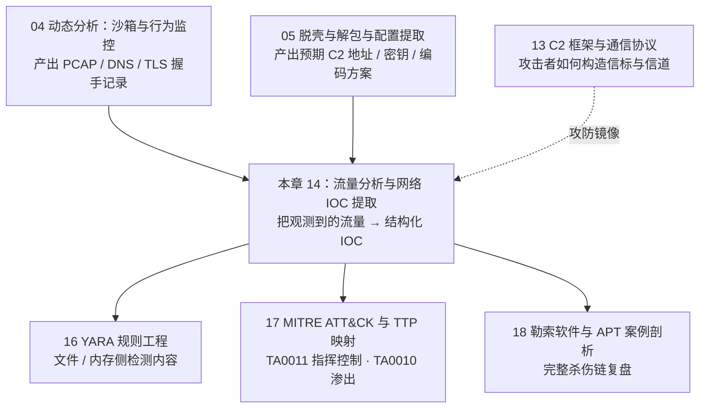
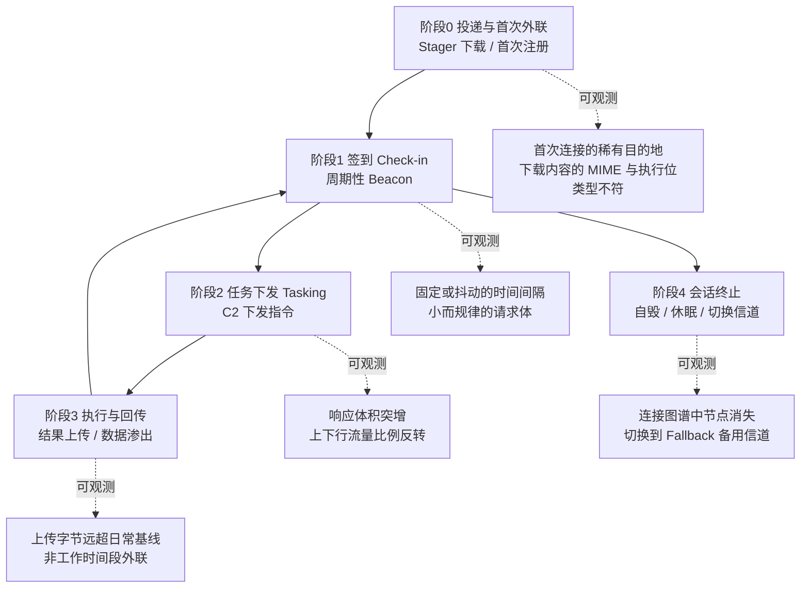
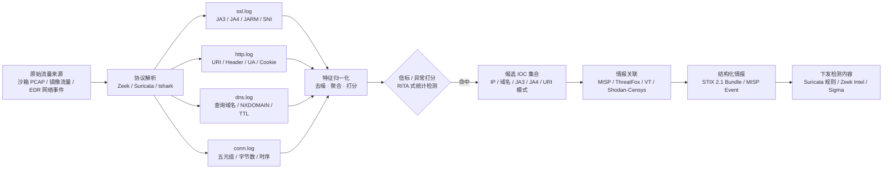

# 恶意代码分析与免杀对抗（14）· 流量分析与网络IOC提取

> [!abstract] TL;DR
> - 本章是[[13.C2框架与通信协议|第 13 章 C2 框架与通信协议]]的镜像：13 讲攻击者怎么**造**信标与信道，14 讲防御者怎么从抓包/沙箱流量里**认出**它们并沉淀成可复用的网络 IOC——攻防两面互相印证。
> - TLS 把应用层内容锁死，但**握手元数据、时序与体积**锁不住：JA3/JA4/JARM/JA4H、信标（Beaconing）统计打分、域名熵值与 NXDOMAIN 比率，是加密时代仍然可观测的"缝隙"，是本章一切技术的立足点。
> - **痛苦金字塔**搬到网络 IOC 上呈现清晰的成本落差：哈希/IP/域名攻击者一次重编译或一条 DNS 记录就能换掉；JA3/JA4/JARM/Malleable Profile 要动 TLS 栈或整套流量画像；TTP（签到-下发-回传的行为模式本身）动一次等于换框架——越往上越"伤筋动骨"，也越值得投入检测资源。
> - 提取管道有固定骨架：PCAP/沙箱网络事件 → Zeek/Suricata/tshark 解析出 ssl.log/http.log/dns.log/conn.log → 打分与聚合 → 候选 IOC → 情报关联（MISP/ThreatFox/VT/Shodan-Censys）→ STIX/MISP 结构化 → 下发 Suricata/Zeek Intel/Sigma 检测内容，向下闭环到[[16.YARA规则工程|YARA]]与[[17.MITRE-ATTCK与TTP映射|ATT&CK 映射]]。
> - 全流程限定在自有/授权环境与 CTF 靶场；文中 IP/域名示例均取自 RFC 5737/6890 文档保留段与虚构 TLD，不做任何针对真实在网 C2 的主动探测或武器化配方。

## 概述与定位

**网络 IOC（Indicator of Compromise，失陷指标）** 是指能够在流量或日志里被观察到、并可用来判断"某主机是否与某恶意活动有关"的具体特征——可以是一个 IP、一个域名、一个 TLS 指纹，也可以是一段固定的 URI 模式或一套请求头顺序。本章要回答的问题很朴素：拿到一段可能含有 C2 通信的流量（无论来自沙箱引爆、镜像流量还是 EDR 上报的网络事件），如何把它**读懂**、**认出信标**、并**提炼成能被其他系统消费的结构化情报**。

这件事在整条分析流水线里承上启下。上游是[[04.动态分析：沙箱与行为监控|第 4 章动态分析]]——沙箱引爆样本时产出的 PCAP、DNS 请求、TLS 握手记录，正是本章的原始输入；也承接[[05.脱壳与解包与配置提取|第 5 章配置提取]]——从脱壳后的样本里逆出的 C2 域名、端口、加密算法与密钥，是本章用来**印证**流量观测结果的"标准答案"（流量里看到的域名和配置里提取的域名对得上，才是真正闭环的证据链，而不是各说各话）。下游则汇入[[16.YARA规则工程|第 16 章 YARA]]（YARA 面向文件/内存字节，本章面向流量字节，二者互补而非重叠）与[[17.MITRE-ATTCK与TTP映射|第 17 章 ATT&CK 映射]]（本章提取的 IOC 最终要落到具体的战术技术编号上才算真正"可行动"），最终在[[18.勒索软件与APT案例剖析|第 18 章完整案例]]里与主机侧证据合流。



需要明确一个边界，避免与知识库里已有内容重复劳动：JA3/JA4/JARM 的**逐字段计算细节**、DPI 的 Aho-Corasick 匹配原理、Domain Fronting/ECH 的协议机制，[[72.抓包与协议分析实战/12.流量特征分析与检测绕过|第 72/12 章]]与[[72.抓包与协议分析实战/16.TLS指纹进阶JA4与JARM与HASSH|第 72/16 章]]已经讲得很透，本章不再重新推导，而是把它们当作**现成的仪器**直接拿来用，重心放在"这把仪器在恶意代码分析场景里具体怎么用、认哪些框架、和样本本体的分析结果怎么对得上"；TCP 流重组、文件雕复、凭据提取、大规模 PCAP 处理架构，[[72.抓包与协议分析实战/19.网络取证与流重组|第 72/19 章]]同样已经系统覆盖，本章默认读者已掌握这些工程基础，把笔墨集中在**C2 特异性**的识别逻辑与情报产出上。简言之：72 系列教你怎么"看懂流量"，本章教你怎么"从看懂的流量里挑出属于 C2 的那部分，并变成别人能复用的情报"。

## 原理与机制

理解网络 IOC 提取，要先接受一个前提：**分析者面对的几乎永远是加密流量**。C2 框架早已默认套 TLS（甚至嵌套在合法 CDN、SaaS API 之上），应用层的具体内容——任务指令、回传的屏幕截图、窃取的凭据——分析者通常看不到明文。这并不意味着流量分析失效，而是把战场从"读内容"整体搬到了"读元数据"：连接的目的地、握手过程中协商了什么、请求发生的时刻与体积、请求之间的间隔规律。信息论意义上，**通信本身的存在、时机与体量是无法被加密隐藏的**——除非引入覆盖流量（cover traffic）把真实通信淹没在噪声里，而这在实战中代价高昂、极少被真正落地。这正是流量分析在 TLS-everywhere 时代仍然成立的根基，也是本章所有技术共同的立足点。

把一次完整的 C2 生命周期拆开看，每个阶段都会在网络上留下不同性质的可观测信号：



**痛苦金字塔映射到网络 IOC 上**，是本章组织所有具体技术的主线索。这个理论本身在[[17.MITRE-ATTCK与TTP映射|第 17 章]]已有专门阐述，这里只做网络维度的具体化：金字塔每升一层，攻击者要付出的改造成本呈数量级上升，这正是"为什么高层 IOC 更值得投入"的经济学解释。

| 层级 | 网络侧对应物 | 攻击者更换成本 | 典型陷阱 |
| --- | --- | --- | --- |
| 哈希值 | 流量里传输的载荷/工具文件哈希 | 重新编译或加个字节即变，近乎零成本 | 对流量本身几乎无检测价值，只用于关联已知样本 |
| IP 地址 | C2 服务器 IP、回连目的地 | 换一台 VPS，几分钟 | 云厂商 IP 复用率高，历史 IP 拉黑易误伤后续租户 |
| 域名 | C2 域名、DGA 候选域 | 注册一个新域名，几美元几分钟 | 合法域名生成服务/CDN 边缘域名可能被误判为 DGA |
| 网络/主机特征 | JA3/JA4/JARM、URI 模式、Header 顺序、Cookie 编码 | 要改 TLS 栈配置或整套 Malleable Profile，可能牵连其他功能 | uTLS 等库可仿冒指纹，单一指纹不能作为唯一判据 |
| 工具 | 特定 C2 框架/版本的整体行为签名 | 换一款框架，团队重新踩坑、重新踩雷 | 商业/开源框架高度可定制，"默认配置"检测容易被规避 |
| TTP | 签到-下发-回传的行为模式本身 | 重新设计整套操作手法，成本最高 | 需要长期行为基线与多维关联，单点告警难以覆盖 |

**Malleable Profile 与"可整形"的流量外观**，是理解中间三层为何既有效又有限的关键。以 Cobalt Strike 为代表的现代 C2 框架把流量的外观参数化：URI 路径、HTTP 方法、请求头集合、Cookie 编码方式、响应的 Content-Type，全部可以在一份配置文件（profile）里自定义，目的是让信标流量"看起来像"访问了一个普通网站——伪装成 jQuery CDN 请求、伪装成 Amazon 的静态资源、甚至伪装成合法 SaaS 的 API 调用。这解释了为什么单纯依赖"某个固定 URI 字符串"的检测规则寿命很短：换一份 profile，字符串就变了。但 Profile 能整形的只是**外观**，改不掉**结构性不变量**——签到必须携带某种形式的元数据（哪怕字段名不同，总要有会话标识/主机指纹/任务 ID）、任务响应必须能装下可变长度的数据（体积分布仍然异常）、心跳必须按某种节奏重复（哪怕加了抖动，统计意义上仍比人类流量规律）。检测工程的核心思路，正是把力气从"记住某个具体外观"转移到"识别这些整形不掉的结构性不变量"上。

DNS 是另一条经常被 C2 选中的信道，原因很直接：出站 UDP/TCP 53 在绝大多数网络策略里默认放行，即使在高度受限的环境（仅允许经代理访问 Web）里，DNS 解析往往也是"基础设施级"的例外。**DNS 隧道**把要传递的数据编码进查询的子域名标签（受 RFC 1035 限制，单个标签最长 63 字节、完整 FQDN 最长 253 字节，因此常用 Base32/Base36 这类大小写不敏感的编码提高单包载荷密度），并利用 TXT/NULL/CNAME 等记录类型承载体积更大的下行数据；iodine、dnscat2 是这类技术的公开实现代表。**DGA（域名生成算法）**则解决了攻击者的另一个痛点——固定域名一旦被标记就会被批量拉黑或提前占坑（sinkhole），DGA 让恶意软件基于日期、硬编码种子等参数在本地算出成百上千个候选域名，攻击者只需要提前注册其中极少数几个，防御方却几乎不可能穷举拦截全部候选。检测 DGA 主要靠两条腿走路：**语言学特征**（域名标签的香农熵、n-gram 语言模型与自然语言/字典词的偏离程度）与**解析行为特征**（同一恶意软件在客户端上会尝试解析大量候选域，其中绝大多数因未被注册而返回 NXDOMAIN，NXDOMAIN 比率异常升高是极强信号）。更进一步，如果分析者能从脱壳后的样本里逆出 DGA 的种子算法（呼应[[05.脱壳与解包与配置提取|第 5 章]]的配置提取思路），就能**预先算出未来几天的候选域名**，抢在攻击者注册之前完成封堵或 Sinkhole 接管——历史上多起僵尸网络的联合执法行动正是建立在这条能力之上。**快速通量（Fast-Flux）**是 DGA 的姊妹技术，靠给同一个域名配置极短 TTL、并让 A 记录在一批被控主机（通常是被感染的家用路由器/IoT 设备）间快速轮换来提高抗打击能力；如果连权威 NS 记录也在轮换，则称为双重通量（Double-Flux）。识别快速通量的核心信号是"低 TTL + 短时间窗口内解析出的 IP 数量异常多 + 这些 IP 分布在互不相关的 ASN/地理位置"，这与合法 CDN 的多 IP 特征（同一 ASN、地理上贴近用户）有明显区别。

> [!note] DoH/DoT 与 QUIC 对可见性的冲击
> 当解析走 DNS-over-HTTPS/TLS 时，传统基于端口 53 明文可见性的 DNS 监控整体失效——查询被封装进一条普通的 443 TLS 连接，网络位置上只能看到"这台主机连了 Cloudflare/Google 的 DoH 端点"，看不到具体查询了什么域名。这类场景把检测重心进一步推向连接层指纹（该 DoH 连接的 JA3/JA4 是否与合法浏览器/系统解析器一致）与主机侧遥测（Hook 应用层解析 API，参见[[32.hooks/11-process-injection|进程注入]]/[[32.hooks/15-etw|ETW]]）。同理，HTTP/3 建立在 QUIC 之上，QUIC 自身的握手也可以被指纹化——JA4 在设计时就把协议类型纳入首字符（`t`=TLS、`q`=QUIC、`d`=DTLS），这也是 JA4 相对 JA3（只覆盖传统 TCP 上的 TLS）更"面向未来"的原因之一。

最后，网络 IOC 只有落到 ATT&CK 的战术技术编号上才算真正"可行动"——既方便与[[17.MITRE-ATTCK与TTP映射|第 17 章]]的映射方法论衔接，也方便团队之间用统一语言沟通检测覆盖面。下表列出指挥控制（TA0011）与渗出（TA0010）战术下与本章关系最密切的一批技术（具体编号请以当前版本 ATT&CK 矩阵为准，官方会随版本迭代调整子技术拆分）：

| 技术编号 | 名称 | 对应的网络观测 |
| --- | --- | --- |
| T1071 / .001 / .004 | 应用层协议（Web / DNS） | HTTP(S) 信标、DNS 查询模式 |
| T1573 | 加密信道 | TLS 封装的 C2 会话本身 |
| T1090.004 | 代理：域前置 | SNI 与 Host/内层 SNI 不一致 |
| T1102 | Web 服务 | 借助 Slack/Discord/GitHub 等合法 API 中转 |
| T1568.002 | 动态解析：DGA | 高熵域名、高 NXDOMAIN 比率 |
| T1071.004 / T1572 | DNS 隧道 | 超长子域名标签、异常 TXT/NULL 查询 |
| T1571 | 非标准端口 | 常见服务端口之外的出站连接 |
| T1132 / T1001 | 数据编码 / 混淆 | Cookie/Header 中的 Base64、自定义编码块 |
| T1008 | 备用信道 | 主信道失败后切换域名/协议 |
| T1041 / T1567 | 经 C2 信道渗出 / 经 Web 服务渗出 | 上传字节远超下载、上传峰值对应敏感文件访问 |

## C2 识别与 IOC 提取详解：信标检测、指纹关联与情报结构化

### 信标的统计检测：从时间序列到分数

人类驱动的正常流量在时间上是不规律的——间隔分布长尾、受作息与业务逻辑支配；而自动化的心跳，哪怕加了随机抖动（Jitter），本质上仍然是"围绕一个基准间隔做小幅扰动"，在统计上比人类流量集中得多。信标检测正是利用这种**规律性差异**：把同一目的地的连接时间戳序列取相邻差值（Δt），观察这组差值的离散程度与集中程度——越集中，越像自动化心跳。RITA（Active Countermeasures 出品，基于 Zeek 的 conn.log）是这一思路最成熟的开源实现，综合考虑了时间间隔的偏度、众数占比、数据量分布等多个维度后给出一个 0～1 的信标分数。下面是一个简化版本，只保留最核心的两个维度，用于讲清楚原理，不建议直接用来替代 RITA 等生产级实现：

```python
import numpy as np

def beacon_score(timestamps):
    """
    简化版信标打分：输入同一目的地一系列连接的时间戳（秒级 epoch）
    思路参考 RITA——规律性越强分数越接近 1，越不规律越接近 0
    真实实现还需纳入连接数量、双向字节量分布等维度，此处仅演示核心逻辑
    """
    ts = sorted(timestamps)
    deltas = np.diff(ts)
    if len(deltas) < 4:
        return 0.0  # 样本太少，不足以判断规律性

    # 离散度：变异系数（标准差 / 均值），越低说明间隔越规律
    cv = np.std(deltas) / (np.mean(deltas) + 1e-9)
    regularity_score = max(0.0, 1.0 - min(cv, 1.0))

    # 集中度：差值落在同一个粗粒度桶里的比例，用于捕捉"围绕基准抖动"的模式
    bucket = max(1, int(np.median(deltas) * 0.2))  # 桶宽取中位数的 20%，近似 Jitter 容忍度
    buckets = (deltas // bucket).astype(int)
    concentration = np.bincount(buckets - buckets.min()).max() / len(deltas)

    score = 0.6 * regularity_score + 0.4 * concentration
    return round(score, 3)
```

这套方法有清楚的边界。第一，**低速信标**（睡眠数小时甚至数天才签到一次）在短观测窗口内样本量不足，规律性无从体现，需要拉长观测周期或跨会话累积；第二，**大幅随机 Jitter**（现代框架普遍支持配置 20%～50% 甚至更高的抖动比例）会主动压低规律性分数，这也是"信标检测"和"JA3/JA4 指纹"必须组合使用而非互相替代的原因——即便时序被刻意打乱，TLS 指纹与 URI 模式往往还在；第三，信标检测天然是**基于历史累积的统计判据**，对单次连接无能为力，无法给出"这一个包是不是 C2"的即时答案，只能回答"这条连接关系在过去一段时间里像不像自动化心跳"。

### TLS/SSH 指纹落地：JA3/JA4/JARM 速查与"指纹错配"分析法

JA3（客户端 TLS 指纹）、JA4/JA4S/JA4H（新一代客户端/服务端/HTTP 指纹）、JARM（主动式服务端指纹）的具体字段与计算过程，[[72.抓包与协议分析实战/16.TLS指纹进阶JA4与JARM与HASSH|第 72/16 章]]已系统覆盖，本节只讲它们在恶意代码分析里的**落地方式**。三者分工不同：JA3/JA4 回答"这个客户端用的是哪个 TLS 库/框架"，适合在流量里批量筛出"非浏览器"的可疑客户端；JARM 回答"这台服务器的 TLS 栈长什么样"，适合拿到一个可疑 IP 后**反向确认**它是不是某个已知 C2 框架的默认监听端；HASSH 把同样思路用在 SSH 上，适合横向移动阶段的东西向流量。

比单纯"查表匹配已知恶意指纹"更有价值的是**指纹错配分析法**：正常浏览器的 User-Agent、TLS 指纹、HTTP 头集合三者是高度自洽的——声称是 Chrome 120 的 User-Agent，理应搭配 BoringSSL 在那个版本上的固定 JA4，也理应带着现代 Chrome 必然携带的一整套 `Sec-Fetch-*`/`Sec-Ch-Ua-*` 头。很多 C2 框架和自定义 HTTP 客户端会在 User-Agent 字段上"抄"一个常见浏览器字符串来降低可疑度，却因为使用的是 Go/Python/.NET 自带的 HTTP/TLS 实现而在 JA3/JA4 或头部完整性上露馅——这正是"伪装了外观、没伪装底层实现"的典型案例，也是分析中最容易出成果的一类比对。现代语言运行时本身也是一种指纹来源：Go 编译的恶意软件如果不显式覆盖 `net/http` 默认客户端，会带上 `Go-http-client/1.1` 这样的默认 User-Agent，其 `crypto/tls` 栈的密码套件与扩展顺序也与浏览器主流实现明显不同；Rust 的 `reqwest`/`hyper` 生态同样有区别于 OpenSSL/BoringSSL 的可辨识 TLS 指纹。这类现代语言编译产物的识别与更广泛的逆向方法论，参见[[27.Go与Rust现代二进制逆向/00.Go与Rust现代二进制逆向总览|Go 与 Rust 现代二进制逆向]]。

具体框架的 JARM/JA3 数值[[72.抓包与协议分析实战/16.TLS指纹进阶JA4与JARM与HASSH|第 72/16 章]]已给出对照表，这里补充一层**架构性差异**——这类特征比单个指纹哈希更耐久，因为它反映的是产品设计取舍，不会随一次配置调整而消失：

| 框架 | 典型信道设计 | 显著网络侧架构特征 |
| --- | --- | --- |
| Cobalt Strike | HTTP(S)/DNS/SMB 命名管道，Malleable Profile 高度可定制 | 存在 Stager 校验和过滤逻辑；HTTP(S) 信标外观完全由 profile 决定 |
| Sliver | mTLS 为主，兼容 HTTP(S)/DNS/Wireguard | 双向证书校验，多协议切换在同一实现内完成 |
| Mythic | HTTP/WebSocket/自定义信道以容器化"C2 Profile"插件形式加载 | 架构上把信道实现从核心框架解耦，profile 即独立服务 |
| Havoc | HTTP(S)/SMB，implant 侧带睡眠混淆 | 相对新兴，默认特征库覆盖率随版本快速变化 |
| Brute Ratel (BRc4) | HTTP(S) 为主，主打规避 EDR 内存检测 | 更强调载荷侧免杀，网络侧外观同样高度可定制 |

这张表想传达的是：**框架识别不能只依赖某个版本的默认指纹**，而要理解每款工具在架构层面"擅长整形什么、不擅长整形什么"。Cobalt Strike 的核心卖点就是 Malleable Profile，因此指望靠固定 JA3/URI 抓住它是不现实的预期；反而是它的 Stager 校验和过滤这种**为了性能/安全而妥协设计出的结构性逻辑**更难被 profile 抹除。

### HTTP 层伪装的裂缝：URI、Header 与编码载荷解码

HTTP 依然是目前应用最广的 C2 信道，原因很实际：几乎所有网络环境都放行出站 80/443，且 HTTP(S) 流量在海量正常 Web 访问中天然具备隐蔽性。分析者要盯的裂缝集中在三处。**URI 与响应内容类型的错位**：一个自称返回 `application/javascript` 的响应，实际内容却是不可打印的密文字节，或者一个自称静态资源的路径每次返回的内容长度都不一样——静态资源不应该"每次都不同"。**Header 集合的完整性**：真实浏览器发出的请求会带一整套版本关联的头部（`Accept-Language`、`Sec-Fetch-Site`、`Sec-Ch-Ua` 等），手搓或库生成的 HTTP 客户端往往漏掉其中一部分，"头部指纹"因此也能类比 JA4H 的方式单独打分（参见第 72/16 章 JA4H 部分）。**Cookie/自定义 Header 里的编码载荷**：很多信标把首次签到的元数据（主机指纹、进程 ID、架构位、会话标识）编码后塞进一个"看起来随机"的 Cookie 值或自定义头，常见编码是标准/自定义字母表 Base64 叠加单字节或滚动 XOR：

```python
import base64

def decode_beacon_cookie(cookie_value: str, xor_key: int = 0x2e):
    """
    许多 HTTP 信标把首次签到元数据编码后塞进 Cookie 字段，
    常见编码是"Base64 + 单字节/滚动 XOR"的组合。
    这里演示的是通用两步骨架；真实密钥/字母表/字段顺序
    需要从脱壳后的样本里逆出（参见第 5 章配置提取），
    不同样本、不同版本可能完全不同，切勿套用固定密钥。
    """
    padded = cookie_value + "=" * (-len(cookie_value) % 4)
    raw = base64.urlsafe_b64decode(padded)
    return bytes(b ^ xor_key for b in raw)
```

想直观理解"整形能改什么、改不掉什么"，看一段简化重建的 Malleable Profile 片段会很有帮助（下面这段只是教学用的示意结构，用来说明分析方法，并非某个真实活跃 C2 的配置）：

```
http-get {
    set uri "/jquery-3.3.1.min.js";     # 伪装成静态资源请求，混入正常 Web 流量
    client {
        header "Accept" "*/*";
        metadata {
            base64url;
            prepend "sess=";
            header "Cookie";            # 首次签到元数据经 base64url 编码后塞进 Cookie
        }
    }
    server {
        header "Content-Type" "application/javascript";  # 伪装响应类型
        output {
            print;                       # 任务内容直接作为"JS 文件"返回
        }
    }
}
```

分析者面对这类流量时的思路不是去猜某个具体 profile 的 URI 字符串（那是徒劳的，下一份 profile 就会换掉），而是反过来问："Cookie 字段是不是每次请求都出现、长度是不是稳定在某个范围、内容是不是能被常见编码解出结构化数据、这个 URI 声称的静态资源和它的响应行为是否自洽"——这些问题的答案不随 profile 更换而改变。

### 提取流水线与情报结构化：STIX 与 MISP

从一段原始流量到一条能被其他系统消费的情报，中间是一条标准化的管道：



结构化这一步的目的是让 IOC**脱离分析者的个人笔记**，变成机器可解析、可在组织间流转的对象。STIX 2.1 是 OASIS 制定的通用威胁情报交换语言，核心是用 `pattern` 字段以类 SQL 的方式描述可观测对象（Observable）的匹配条件：

```json
{
  "type": "bundle",
  "id": "bundle--3f1b6b2e-example",
  "objects": [
    {
      "type": "indicator",
      "spec_version": "2.1",
      "id": "indicator--a1b2c3d4-example",
      "created": "2026-07-01T00:00:00Z",
      "modified": "2026-07-01T00:00:00Z",
      "name": "疑似 DGA 候选域（样本关联，合成示例）",
      "pattern": "[domain-name:value = 'kxq7z1v9.example-tld'] AND [domain-name:resolves_to_refs[*].value = '203.0.113.7']",
      "pattern_type": "stix",
      "valid_from": "2026-07-01T00:00:00Z",
      "indicator_types": ["malicious-activity"],
      "labels": ["c2", "dga"]
    },
    {
      "type": "indicator",
      "spec_version": "2.1",
      "id": "indicator--b2c3d4e5-example",
      "created": "2026-07-01T00:00:00Z",
      "modified": "2026-07-01T00:00:00Z",
      "pattern": "[network-traffic:extensions.'x-ja3'.hash = 'e7d705a3286e19ea42f587b344ee6865']",
      "pattern_type": "stix",
      "valid_from": "2026-07-01T00:00:00Z",
      "indicator_types": ["malicious-activity"],
      "description": "命中已知信标框架默认 TLS 指纹（JA3 非 STIX 核心 SCO，采用扩展属性表达，不同平台字段名可能不同）"
    }
  ]
}
```

这里刻意保留了一个"陷阱"供留意：STIX 2.1 核心规范并没有为 JA3/JA4/JARM 定义标准的可观测对象类型，各平台通常用**扩展属性**（如上面的 `extensions.'x-ja3'`）自行表达，这意味着不同厂商、不同 TIP（威胁情报平台）之间交换 TLS 指纹类 IOC 时经常出现字段名不一致、无法直接互认的摩擦——这是标准化滞后于技术演进的典型例子，实际工作中往往还要依赖平台间的映射表或人工核对。MISP 作为另一条主流路径，用更贴近实战的扁平化属性类型（`domain`、`ip-dst`、`ja3-fingerprint-md5`、`jarm-fingerprint` 等，具体类型名称以所用 MISP 版本的属性/对象模板为准）组织成 Event：

```json
{
  "Event": {
    "info": "疑似 C2 信标（合成教学示例，来源沙箱引爆）",
    "threat_level_id": "2",
    "distribution": "1",
    "Attribute": [
      { "type": "domain", "category": "Network activity", "value": "kxq7z1v9.example-tld", "to_ids": true, "comment": "DGA 候选域，标签熵值约 4.1 bit/字符" },
      { "type": "ip-dst", "category": "Network activity", "value": "203.0.113.7", "to_ids": true },
      { "type": "ja3-fingerprint-md5", "category": "Network activity", "value": "e7d705a3286e19ea42f587b344ee6865", "to_ids": true },
      { "type": "jarm-fingerprint", "category": "Network activity", "value": "07d14d16d21d21d07c42d41d00041d24a458a375eef0c576d23a7bab9a9fb1", "to_ids": true },
      { "type": "pattern-in-file", "category": "Payload delivery", "value": "GET /jquery-3\\.3\\.1\\.min\\.js", "to_ids": true, "comment": "URI 模式，对应 Malleable Profile 的 http-get.uri（示意）" }
    ]
  }
}
```

STIX 更适合需要严谨对象关系（Indicator、Malware、Campaign、Relationship 互相引用）的组织间正式共享，MISP 更贴近 SOC 一线的日常协作与自动化对接（自带丰富的 feed 生态与 IDS 导出功能）。多数团队的实际做法是两者并存：内部日常流转用 MISP，正式对外披露或跨联盟共享时再转换成 STIX Bundle。

### 迷你案例：从合成信标流量到成套 IOC

设想沙箱引爆一个样本后拿到一段 PCAP（以下数值均为教学用合成示例，非真实在网基础设施）。走一遍完整流程：Zeek 解析后 `dns.log` 显示主机在两分钟内查询了 40 多个形如 `[8位随机字符].example-tld` 的域名，其中只有一个解析成功、其余全部 NXDOMAIN——高熵值加上极端的 NXDOMAIN 比率，DGA 嫌疑成立；`conn.log` 显示对那唯一解析成功的 IP（示例中记为 `203.0.113.7`）建立了持续性连接，间隔在 58～62 秒之间小幅波动，套用前面的 `beacon_score` 函数得分 0.87，规律性极强；`ssl.log` 给出该连接的 JA3 与已知信标框架默认值一致，但 `http.log` 记录的 User-Agent 却声称是最新版 Chrome——典型的"指纹错配"；进一步跟踪该 TCP 流，请求的 Cookie 字段用前面的 `decode_beacon_cookie` 两步解码后得到一段包含主机名哈希与架构标识的结构化数据，与首次签到语义吻合。把这几条线索汇总，就得到一套内部自洽、互相印证的 IOC 组合——DGA 域名、C2 IP、JA3、URI/Cookie 模式、行为学意义上的"高信标分数"标签——分别对应痛苦金字塔的域名层、IP 层、网络特征层与 TTP 层，其中网络特征层与 TTP 层的判据最值得沉淀为长期检测内容,因为它们不会随下一次攻击者换域名/换 IP 而失效。

## 工具视角与实战

### 沙箱侧的"伪服务"：FakeNet-NG 与 INetSim

动态分析里一个常被忽视的细节是：**样本真的连上互联网去和真实 C2 通信，本身就是一种失控**——不仅可能暴露分析基础设施的出口 IP、让攻击者感知到被分析而改变行为，还可能真的把样本"喂饱"、诱发不可控的后续动作（例如收到真实任务并执行）。Mandiant FLARE 团队的 **FakeNet-NG**（Windows）与 **INetSim**（Linux，Perl 实现，常搭配 Cuckoo/CAPE 沙箱）解决的正是这个问题：伪造 DNS（把任意域名解析到自己）、伪造 HTTP/HTTPS（自签证书完成 TLS 握手后返回可配置的假响应）、以及监听任意端口的通用监听器，让样本"以为"自己成功联系上了真实 C2。样本发出的**第一次真实签到请求**——它的 URI、Header、Cookie 编码、TLS 指纹——会被完整捕获，而不会有任何字节真正离开分析环境。这是一种主动创造观测条件的技术，而不是被动等待流量出现，也是恶意代码分析场景区别于通用网络取证（72 系列默认处理的是已经发生、无法重现的流量）最鲜明的地方之一。

### 拿到明文：TLS 会话密钥、MITM 与 API 层截获

分析者对样本运行环境拥有完全控制权，这意味着即使 C2 走 TLS，也有多条路径拿到明文。最轻量的是 **SSLKEYLOGFILE** 机制：多数主流 TLS 实现（浏览器、OpenSSL、BoringSSL 等）在设置该环境变量后会把每个会话的密钥材料写入日志文件，Wireshark 读取后可直接解密对应的 PCAP；局限在于恶意软件常静态链接自己的加密库或使用系统原生的 SChannel，未必尊重这个环境变量。更通用的是**中间人代理**（如 mitmproxy）：在分析虚拟机里安装代理的根证书并劫持流量，前提是样本没有做证书锁定（Certificate Pinning）或没有在识别到被代理后改变行为——这类反分析检测手法参见[[10.防御规避：反虚拟机与反调试与反沙箱|第 10 章]]。最彻底的是**API 层截获**：在样本进程里挂钩加密函数（如 `SSL_write`/`NCryptEncrypt`/SChannel 相关 API），在明文即将进入加密函数的那一刻直接把它记录下来，天然绕开证书锁定与自定义 TLS 栈的问题——这条路径的落地手法参见[[32.hooks/11-process-injection|进程注入]]（把捕获逻辑注入目标进程）；如果需要更底层、更难被样本察觉的可见性，也可以在内核层用网络过滤驱动拦截，参见[[32.hooks/12-kernel-hook|内核 Hook]]；Windows 自带的 Schannel/TLS ETW 提供程序同样能在不注入代码的前提下拿到握手层事件，可与[[04.动态分析：沙箱与行为监控|第 4 章]]中基于[[32.hooks/15-etw|ETW]]的行为监控共用同一套采集基础设施，实现主机遥测与网络遥测的时间线对齐。

### 网络安全监控与批量研判：Zeek、Suricata、RITA、CapTipper

Zeek、Suricata、tshark 的通用用法[[72.抓包与协议分析实战/11.Zeek协议分析框架|第 72/11 章]]与[[72.抓包与协议分析实战/19.网络取证与流重组|第 72/19 章]]已详细覆盖，本章场景下值得单独强调的是 Zeek 的 `weird.log`（记录协议层面"不寻常但未必违规"的现象，例如畸形 TLS 记录、异常的 HTTP 分块编码，往往是自定义/简化实现的 C2 客户端而非成熟浏览器/服务端库留下的痕迹）与 `notice.log`（Zeek Intel Framework 命中已知 IOC 时的告警落点，可把前面提炼的域名/IP/JA3 直接灌入 Intel 数据源实现"下次自动命中"）。**RITA** 专注把 `conn.log` 批量转成信标分数报表，适合在大规模流量里做初筛，把人工精力集中到分数最高的一小撮连接上。**CapTipper** 则是专门面向恶意 HTTP 流量的分析工具，能够重放一次 HTTP 会话的完整对象树（尤其适合投递阶段的漏洞利用工具包/重定向链分析），与信标阶段的统计工具形成阶段互补——投递阶段看"内容与重定向链"，签到阶段看"节奏与指纹"。

### 情报关联与共享：MISP、ThreatFox、VirusTotal、urlscan、GreyNoise、Shodan/Censys

单条 IOC 的价值往往要靠外部情报关联才能放大。这几类平台在实战中各司其职：

| 平台 | 定位 | 典型产出 |
| --- | --- | --- |
| MISP | 私有/联盟情报共享与协作 | Event/Attribute，支持自动导出 IDS 规则 |
| ThreatFox（abuse.ch） | 公开 IOC 数据库，API 免费查询 | IP/域名/JA3/JARM 的家族归属与首次出现时间 |
| VirusTotal | 样本、URL、IP 的多引擎判定与关系图谱 | 与该 IP/域名有历史关联的其他样本、证书、被动 DNS |
| urlscan.io | 主动访问 URL 并记录页面行为与请求树 | 页面截图、发起的所有子请求、使用的 TLS 证书 |
| GreyNoise | 区分"互联网背景噪声扫描"与"真正针对性攻击" | 判断某 IP 是否为已知扫描器/CDN/云厂商基础设施，降低误报 |
| Shodan / Censys | 全网被动扫描数据库 | 按 JARM/证书/Banner 检索所有具有相同指纹的服务器，反推整套 C2 基础设施规模 |

这里有一条明确的方法论：**能查库就不要主动扫描**。JARM 命中一个可疑 IP 后，与其自己发起主动探测（涉及对未授权目标的网络扫描，法律与操作安全风险都不小），不如先在 Shodan/Censys 这类已经完成全网普查的数据库里检索相同指纹，往往能一次性拉出整批共享同一套基础设施的服务器，风险和成本都低得多。

### 训练素材与题库：Malware-Traffic-Analysis.net 式的实战积累

流量分析是一项需要大量样本积累的手艺，直接读取真实事件响应案例存在数据敏感性问题，因此**公开、脱敏的训练 PCAP 库**在这个领域格外重要。以 Malware-Traffic-Analysis.net 为代表的社区长期发布真实但已脱敏/过期失效的恶意流量样本（配合详细的分析走读），是练习本章方法论的理想靶场——同样的 DGA 识别、信标打分、URI 模式提取流程,可以在这些公开样本上反复演练，直到形成稳定的分析直觉。PacketTotal 一类的在线沙箱式 PCAP 分析平台也提供了类似的"上传即出报告"体验，便于快速验证某条思路。

## 安全性与正确使用

流量分析与 IOC 提取处于分析流水线的末端，看似只是"看数据"，实际仍然触碰几类实质风险：分析环境的出站流量可能真的连上活的 C2 基础设施；提取出的 IOC 一旦包含受害者身份信息（内网 IP、用户名、文档内容片段）会构成隐私与合规问题；主动扫描/探测未授权的第三方基础设施本身就可能触犯计算机滥用相关法律；不加甄别地发布共享云/CDN 的 IP 或域名作为 IOC，会造成大范围误伤合法业务。

> [!caution] 合规与安全边界
> - **仅限授权环境**：本章一切技术仅用于**自有资产、CTF 靶场、已获书面授权的研究样本**，一律采取**防御与教育视角**，目的是提炼检测规则与威胁情报，而非复用攻击能力。
> - **不做武器化配方**：文中的 Malleable Profile 片段、信标打分、指纹比对方法均为**分析方法论**的教学示例，不构成、也不提供针对真实生产系统或他人系统的定向攻击步骤，不为绕过任何商业软件的授权保护提供武器化手段。
> - **不与真实 C2 主动交互**：识别出的可疑基础设施应通过被动情报库（Shodan/Censys/VT/ThreatFox）核实,而非自行发起探测、登录、投毒或接管，这类主动行为在未授权前提下法律风险极高，也可能打草惊蛇、干扰真实的执法/联合处置行动。
> - **分析环境隔离**：动态引爆与流量捕获在断网或 FakeNet-NG/INetSim 伪造服务的隔离环境中进行，出网需求走受控代理，防止样本真正联系上其控制端。
> - **IOC 发布前脱敏**：分享 PCAP 或提取的 IOC 前，剥离受害者标识信息，按 **TLP（Traffic Light Protocol）** 标记明确的分发范围，避免过度共享。

从工程纪律的角度，还有几条经验值得强调：IOC 存在明显的**存活期差异**——IP/域名类 IOC 往往在数天到数周内因基础设施轮换而失效，JA3/JA4/JARM/URI 模式类特征通常能维持数周到数月（直到框架大版本更新），而 TTP 级别的行为模式可以稳定数月到数年,检测规则库的维护节奏应当按这个梯度分层设计，而不是把所有 IOC 一视同仁地长期保留或短期清理；发布 IP/域名类 IOC 前应核实其是否为共享云主机/CDN 出口，避免把一整个 IP 段的合法客户共同拉黑；扫描/指纹比对类判据应始终作为**辅助证据**而非单一裁决依据，与信标统计、终端遥测（回到[[04.动态分析：沙箱与行为监控|第 4 章]]与取证下游的[[53.数字取证与事件响应/00.数字取证与事件响应总览|数字取证与事件响应]]）交叉印证后再形成结论。

## 小结

流量分析与网络 IOC 提取的核心命题是：TLS 封住了内容,却封不住通信本身的存在、节奏与体量,这层"加密不掉的元数据"就是本章所有技术共同的立足点。围绕这一点，痛苦金字塔给出了明确的优先级排序——哈希/IP/域名成本最低也最易失效，JA3/JA4/JARM 与 Malleable Profile 层面的网络特征更耐久,而信标-签到-下发-回传这套行为模式本身（TTP）改造成本最高、检测价值也最高。识别手段上，信标统计打分捕捉自动化留下的规律性，TLS/SSH 指纹与"指纹错配分析法"捕捉伪装外观与底层实现之间的裂缝，DNS 熵值与 NXDOMAIN 比率捕捉 DGA 的算法本质，HTTP 层的 URI/Header/Cookie 分析捕捉整形技术改不掉的结构性不变量。工程实现上，从沙箱侧用 FakeNet-NG/INetSim 主动创造观测条件、到 SSLKEYLOGFILE/MITM/API 截获拿到明文、再到 Zeek/Suricata/RITA/CapTipper 完成批量研判、最终经 MISP/STIX 结构化并对接 Shodan/Censys/ThreatFox 等外部情报,构成一条完整的"流量到情报"流水线。这一切都是[[13.C2框架与通信协议|第 13 章]]的镜像——理解了攻击者如何构造与整形流量,才知道该在哪里、以什么代价去识别它；而识别的最终产出,又要沉淀进[[16.YARA规则工程|YARA]]规则与[[17.MITRE-ATTCK与TTP映射|ATT&CK 映射]]，让一次性的分析成果变成可持续复用的检测能力。

## 相关阅读

- [[13.C2框架与通信协议|↔ ch13：C2 框架与通信协议（构造视角，与本章互为镜像）]]
- [[04.动态分析：沙箱与行为监控|← ch04：动态分析（沙箱产出本章的原始 PCAP / 网络事件）]]
- [[05.脱壳与解包与配置提取|← ch05：脱壳与配置提取（预期 C2 / 密钥 / 编码方案，与流量互相印证）]]
- [[10.防御规避：反虚拟机与反调试与反沙箱|↔ ch10：反虚拟机 / 反沙箱（样本识别分析环境后可能改变网络行为）]]
- [[16.YARA规则工程|→ ch16：YARA 规则工程（文件 / 内存侧检测内容，与网络侧检测互补）]]
- [[17.MITRE-ATTCK与TTP映射|→ ch17：MITRE ATT&CK 与 TTP 映射（痛苦金字塔理论与 TTP 编号体系）]]
- [[18.勒索软件与APT案例剖析|→ ch18：勒索软件与 APT 案例剖析（完整杀伤链复盘）]]
- 注入承接：[[32.hooks/11-process-injection]]、[[32.hooks/12-kernel-hook]]、[[32.hooks/15-etw]]
- 取证下游：[[53.数字取证与事件响应/00.数字取证与事件响应总览]]（内存取证印证网络行为）
- 流量呼应：[[72.抓包与协议分析实战/12.流量特征分析与检测绕过]]、[[72.抓包与协议分析实战/16.TLS指纹进阶JA4与JARM与HASSH]]、[[72.抓包与协议分析实战/19.网络取证与流重组]]
- 语言逆向：[[27.Go与Rust现代二进制逆向/00.Go与Rust现代二进制逆向总览]]（现代样本的运行时网络指纹）
- 官方规范与工具：RFC 1035（DNS 报文格式与标签长度限制）、RFC 8701（GREASE）、OASIS STIX 2.1 规范、MISP 官方文档（misp-project.org）、MITRE ATT&CK Enterprise（Command and Control / Exfiltration 战术）、RITA（Active Countermeasures）、FakeNet-NG / INetSim 官方文档、Salesforce JA3 与 FoxIO JA4 项目
- 书目：《Practical Malware Analysis》（Sikorski & Honig）第 14 章 Malware-Focused Network Signatures；《The Practice of Network Security Monitoring》（Richard Bejtlich）

[[00.恶意代码分析与免杀对抗总览|⬆ 系列总览]] | [[13.C2框架与通信协议|← 上一章]] | [[15.Shellcode分析与加载器逆向|→ 下一章]]
