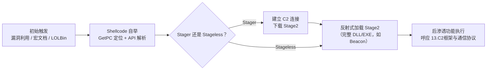
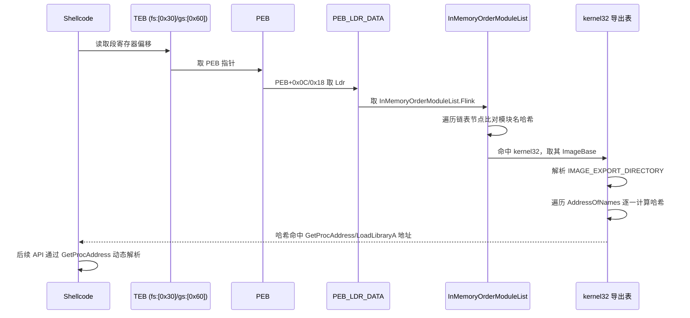
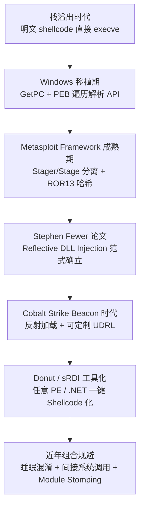
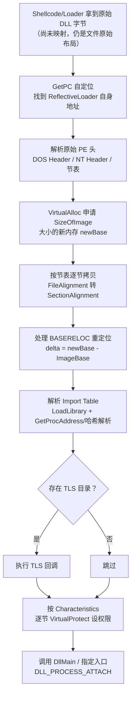

# 恶意代码分析与免杀对抗（15）· Shellcode分析与加载器逆向
> [!abstract] TL;DR
> - Shellcode 的本质是位置无关码（PIC）：不依赖固定加载基址、不依赖导入表，只用相对寻址（call/pop 取当前地址、x64 下原生的 RIP 相对寻址）就能在任意内存位置正确执行。
> - API 解析是 Shellcode 摆脱静态导入表的核心手段：通过 fs:[0x30]/gs:[0x60] 遍历 PEB→Ldr→InMemoryOrderModuleList 找到 kernel32 基址，再解析导出表定位函数；把 API 名哈希化（如 Metasploit 的 ROR13）是躲避字符串特征检测的标准套路，但哈希算法一旦被复原就能批量反查回可读符号。
> - 反射式加载（Reflective Loading）让一个 PE（尤其是 DLL）在不借助 Windows 加载器、甚至不落盘的前提下自举完成内存映射、重定位、导入解析与入口点调用，是 Meterpreter、Cobalt Strike Beacon 等后渗透载荷的标准装载方式。
> - Stager/Stage 分离、蛋猎手（Egghunter）、多态编码器（如 shikata_ga_nai）分别解决"载荷太大放不下""不知道大载荷落在哪""静态特征太扎眼"三个工程问题，各自都留下了可被针对性检测的固有代价。
> - 分析 Shellcode 的通用工作流是"先复原字节、再找 GetPC、再找 API 解析/哈希循环、最后核对反射加载的九个标准步骤"，speakeasy、scdbg、blobrunner、IDA/Ghidra 原始二进制加载配合哈希库是主力工具链。
> - 检测侧的高价值信号集中在内存态而非磁盘态：无文件支撑的可执行私有内存、大块 RWX 权限、PEB 遍历指令模式、ETW-TI 对"分配-写入-变可执行"序列的捕获，是 PE-sieve/Moneta 等工具与 EDR 的共同着力点，而 Module Stomping 等技术正是攻击侧对这些信号的针对性回应。

## 概述与定位

Shellcode 一词源自早期栈/堆溢出利用的实践——溢出后劫持执行流跳去运行的那段机器码，最初级的目的就是"弹一个 shell"（`execve("/bin/sh")`），因此得名。今天这个词的外延早已远超"弹 shell"：任何一段不依赖标准 PE/ELF 加载流程、被塞进任意进程任意内存地址后仍能正确执行的裸机器码，都被笼统称为 shellcode——无论它的真实用途是下载器、注入桩、还是完整后渗透框架的引导层。

在攻击链上，shellcode 处于"漏洞利用/宏执行/LOLBin 触发"之后、"完整恶意功能落地"之前的过渡地带。常见的投递入口包括缓冲区溢出后的控制流劫持、恶意文档宏里用 `CreateThread`+内存写入拼出的执行原语、浏览器/文档解析漏洞、以及各类"living-off-the-land"二进制间接触发。这段代码体积要足够小以塞进有限的溢出缓冲区或反射注入通道，又要足够"聪明"以完成自举——找到自己在内存中的位置、找到系统调用能力、把体积更大的真正载荷（往往是一个标准 PE 格式的 DLL/EXE）解密并映射进内存执行。这个"自举 + 装载"过程就是本章标题里"加载器"的含义：它不是磁盘上的 exe 启动器，而是运行在裸机器码环境里、手写实现了 Windows PE 加载器部分职责的极简代码。

需要与系列内相邻章节划清边界：[[06.进程注入技术全谱]] 讲的是"怎么把这段字节送进目标进程、怎么触发执行"（`CreateRemoteThread`/APC/线程劫持等传递手段）；[[07.进程镂空与傀儡进程Hollowing]] 是其中一种特化技术，关注"如何让一个合法进程的主镜像被替换成恶意内容"；[[11.免杀原理：混淆与加密与加载器]] 从免杀工程的宏观视角讨论加壳/加密/加载器三件套的组合策略；[[12.直接系统调用与unhooking]] 讨论 shellcode/loader 内部为规避 EDR hook 而采用的调用手法。本章的落点是这些技术共同依赖的"payload 本体"——shellcode 自身如何在没有操作系统帮助的情况下自己认路、自己找 API、自己把第二阶段的 PE 装进内存跑起来，以及逆向分析者拿到一坨裸字节后如何倒推出它的行为与最终载荷。这也是承接 [[13.C2框架与通信协议]]（stage 内容常常就是 Beacon/Meterpreter 这类 C2 植入体本身）与 [[14.流量分析与网络IOC提取]]（stager 拉取 stage2 的过程会在网络层留下痕迹）的关键一环。



## 原理与机制

### 位置无关码：为什么不能有绝对地址

正常 PE 程序在编译链接时会假设一个"优先加载基址"（ImageBase），所有全局变量、字符串、跳转目标在编译期都按这个假设基址算出绝对地址写死在代码里；如果实际加载地址与假设不符，Windows 加载器会读取重定位表（`.reloc`）把这些绝对地址逐一修正。Shellcode 没有这张安全网——它可能被扔进栈、堆、或任意一块 `VirtualAlloc` 出来的内存，事先完全不知道自己会落在哪个地址，也没有加载器帮它做重定位。于是 shellcode 必须满足两个硬约束：其一，代码里不能出现任何硬编码的绝对地址（跳转、call、数据引用全部相对化）；其二，不能依赖导入表（IAT）——因为 IAT 里的函数地址同样是加载器帮 PE 文件填好的，shellcode 没有这个环节，必须自己在运行时现查。

x86 下 CPU 没有直接把当前指令指针（EIP）读到通用寄存器的指令，这就催生了经典的 "GetPC"（Get Program Counter）技巧。最常见的写法是 call/pop 对：

```asm
call get_pc      ; call 会把"下一条指令的地址"压栈
get_pc:
pop  ebx          ; 弹出的正是 get_pc 标签在内存中的实际地址
; 此后所有数据引用都写成 [ebx + 偏移]，而不是绝对地址
```

另一种更老的技巧借用 FPU 环境保存指令：`fldz` 之后紧跟 `fnstenv [esp-0xc]`，把包含"上一条 FPU 指令地址"的浮点环境结构存到栈上，再从中取出该地址反推当前位置，早期 Metasploit 编码器（如 `shikata_ga_nai`）采用它是为了避开当时入侵检测系统对 `call/pop` 特征的检测。x64 架构天生更友好：RIP 相对寻址（`lea rax, [rip+offset]`）是原生寻址模式，不再需要 call/pop 这类 trick，这也是许多现代 shellcode 生成器（如 Donut）优先产出 x64 版本、且 x64 shellcode 体积和结构都更规整的原因之一。

有了自身基址，shellcode 就能把内部所有的字符串表、哈希表、跳转表都用"基址+偏移"的形式访问，整个代码段可以被当作一段完全不透明的字节数组，塞进任意可执行内存都不会散架——这正是"位置无关"四个字的字面含义，也是它能被用作栈溢出 payload、反射注入 payload、无文件植入体的共同前提。

### API 解析：没有导入表，如何调用 Win32 API

拿到自身位置只解决了"能跑"的问题，"能干活"还需要调用 Win32 API——但 IAT 是空的。几乎所有 Windows shellcode 都用同一套自举顺序解决这个问题：先从 TEB/PEB 拿到 kernel32.dll 基址，再解析它的导出表拿到 `GetProcAddress`（和/或 `LoadLibraryA`）这两把"万能钥匙"，后续所有其他函数都通过它们动态获取。

x86 下 `fs:[0x30]` 指向当前线程的 TEB，TEB 偏移 `0x30` 处是指向 PEB 的指针；x64 下对应的段寄存器是 `gs:[0x60]`。典型访问顺序：

```asm
; x86：PEB -> Ldr -> InMemoryOrderModuleList
mov eax, fs:[0x30]      ; eax = PEB
mov eax, [eax + 0x0C]   ; eax = PEB->Ldr
mov eax, [eax + 0x14]   ; eax = Ldr->InMemoryOrderModuleList.Flink

; x64 对应偏移
mov rax, gs:[0x60]      ; rax = PEB
mov rax, [rax + 0x18]   ; rax = PEB->Ldr
mov rax, [rax + 0x20]   ; rax = Ldr->InMemoryOrderModuleList.Flink
```

`InMemoryOrderModuleList` 是一条双向链表，按加载顺序依次挂着主程序自身、`ntdll.dll`、`kernel32.dll`……shellcode 沿链表走几个节点即可拿到 kernel32 的基址（不同 Windows 版本、不同加载路径下顺序可能有出入，鲁棒的实现会用模块名哈希逐一比对而非硬编码"走两步"）。拿到模块基址后按 PE 格式解析：DOS 头 `e_lfanew` 找到 NT 头，NT 头的 `OptionalHeader.DataDirectory[0]` 指向导出目录 `IMAGE_EXPORT_DIRECTORY`，其中 `AddressOfNames`/`AddressOfNameOrdinals`/`AddressOfFunctions` 三个并行数组配合，用函数名逐一比对，命中后即可算出函数的真实虚拟地址。

字符串比对最直观，但也最容易被静态特征库命中——一坨 shellcode 里出现明文 `"GetProcAddress"`、`"LoadLibraryA"`、`"WinExec"` 几乎等于自报家门。于是攻击者普遍改用**哈希化 API 解析**：构造时把每个需要的函数名算成一个固定哈希值写死在代码里，运行时对导出表里的每个名字现算哈希，比对上了就是目标函数，全程不出现任何可读字符串。Metasploit 系列 payload（`block_api.asm`）用的是经典的 ROR13 累加算法：

```c
uint32_t hash_name(const char *name) {
    uint32_t h = 0;
    while (*name) {
        h = _rotr(h, 13);           // 循环右移 13 位
        h += (unsigned char)toupper(*name++);
    }
    return h;
}
// 最终 API 哈希 = hash_name(module_name) + hash_name(function_name)
```

这类哈希算法谈不上密码学强度，选择 ROR13/CRC32/djb2 一类简单散列的原因是**追求代码尺寸和执行速度**而非抗碰撞——shellcode 常常要塞进几十到几百字节的可用空间，哈希循环必须短小。这也是它的软肋：算法一旦被逆向出来，分析者可以对 `kernel32.dll`/`ntdll.dll` 等常见 DLL 的全部导出名批量预计算哈希表，做成"哈希→函数名"的反查字典（IDA 的 `hashdb` 类插件、社区维护的 Metasploit/Cobalt Strike 哈希库都是这个思路），瞬间把一堆看似随机的 32 位常量还原成可读的 API 调用序列，是分析 shellcode 最立竿见影的一步。



### 简史：从"弹个 shell"到"自带反射加载器的位置无关码"

Shellcode 的形态是被攻防两端的工程约束反复塑造出来的，理解这条演进线有助于判断一段样本"处于哪个技术代际"：



这条演进线上每一次跃迁都是对上一代检测手段的直接回应：Windows 平台移植逼出了 PEB 遍历这套无导入表也能调用 API 的方案；Metasploit 把"体积可控的引导层"和"功能完整的阶段体"拆开，是为了适配漏洞利用缓冲区的尺寸限制；反射式加载解决了"不落盘还要跑起一个完整 DLL"的工程问题；Donut/sRDI 把这套能力产品化、通用化，使得几乎任何 .NET 或原生 PE 都能一键转换成同样具备自举与反射加载能力的位置无关码；而最近几年检测侧把重点移到内存行为面之后，攻击侧又发展出睡眠混淆（隐藏 beacon 静默期的内存特征）、间接系统调用（参见 [[12.直接系统调用与unhooking]]）、Module Stomping（向已通过合法 `LoadLibrary` 加载、因此"有文件背书"的正版 DLL 内存区域覆写代码，规避"无文件支撑可执行内存"这条经典检测规则）等组合拳继续对抗。

## Shellcode结构与反射加载算法详解

### 分阶段结构：Stager、Stage 与蛋猎手

真实环境里的 shellcode 很少是一整块从头写到尾的代码，投递通道的工程约束决定了它必须分层：

- **Stager（引导阶段）**：体积极小（Meterpreter 经典的 `windows/meterpreter/reverse_tcp` stager 大约 300~350 字节），唯一职责是建立到 C2 的连接（创建 socket、connect），接收对端发来的"阶段体积 + 阶段字节流"，把收到的字节写入一块新分配的可执行内存，然后直接跳转过去执行——阶段体（stage）本身可能是几十 KB 到几 MB 的完整功能模块（如 Meterpreter DLL 或 Beacon）。这样设计的原因是很多投递通道（溢出缓冲区、宏文档里挤出来的 shellcode 区域）对首发载荷大小有硬限制，stager 必须在这个限制内完成"能联网、能收字节、能跳过去"这三件事，其余功能全部留给阶段体在真正可控的内存里展开。
- **Stageless（无阶段/一体化）**：把完整功能一次性编码进单个 payload，不再依赖运行时二次下载。优点是不存在"stage2 下载窗口"这个可被网络层拦截的时间点（呼应 [[14.流量分析与网络IOC提取]] 里对分阶段下载流量特征的检测思路），代价是体积大、静态特征面更广、发送侧要求投递通道能装下更大的 blob。
- **蛋猎手（Egghunter）**：在利用原语极度受限（可用 shellcode 空间只有几十字节，但真正的大 payload 被安排在进程地址空间的别处，比如另一个缓冲区或堆块）时使用。蛋猎手自身极小（经典实现约 32 字节），逻辑是在整个可访问地址空间里逐页扫描，寻找一个提前约定好、连续出现两次的"蛋"标记（如 8 字节的重复 tag），命中后跳转执行紧随其后的真实 shellcode。由于扫描不可避免会踩到未映射页面导致访问违例，蛋猎手内部必须用 SEH 异常处理（或调用几乎不产生副作用的系统调用来试探页面可读性）把异常吞掉、跳过该页继续扫描，而不能让进程直接崩溃。

### 反射式加载：让 PE 在内存里自己把自己装起来

反射式加载解决的是一个更大的工程问题：怎么把一个体积可观、结构复杂的**标准 PE 文件**（通常是 DLL，例如 Meterpreter、Cobalt Strike Beacon）在**不写入磁盘、不调用 `LoadLibrary`** 的前提下装载进内存并跑起来。`LoadLibrary` 天生要求目标是磁盘上的合法文件路径，对无文件攻击而言这条路直接堵死；解决方案是 Stephen Fewer 在 2008 年提出的 **Reflective DLL Injection**：把 Windows 加载器"装载一个 PE"该做的步骤，用一段位置无关代码手工重新实现一遍，作为 DLL 自身的一个导出函数（`ReflectiveLoader`）附着在 DLL 里一起投递。目标进程里只要有办法执行到这个函数入口（无论是被注入后直接调用，还是被 sRDI 之类工具转换成纯 shellcode 从任意地址跳入），DLL 就能"反身"把自己从当前所在的内存位置正确加载起来，故得名 reflective（反射/自反）。

完整的反射加载算法按顺序做以下几步（这也是逆向分析反射加载器时应该核对的检查清单）：

1. **自定位**：反射加载器本身也是位置无关码，第一步用 GetPC 技巧确定自己当前运行在内存的哪个地址——因为此时 DLL 还没有被"正确"加载，它只是原封不动的一坨文件字节被扔进了某块内存，反射加载器的代码就嵌在这坨原始字节里，必须先找到自己，再从自己的位置反推出整个 DLL 原始镜像（未映射版本）的起始地址。
2. **解析原始 PE 头**：从找到的起始地址读 DOS 头、NT 头，取出 `SizeOfImage`、节表（Section Table）、`OptionalHeader.ImageBase`（优先基址，仅作重定位计算参照，不代表最终会落在这个地址）。
3. **申请新内存**：调用（此时已可用哈希解析拿到的）`VirtualAlloc`，按 `SizeOfImage` 申请一块新内存作为 DLL 的最终落脚点——这一步的地址几乎必然和 `ImageBase` 不同，这正是第 5 步重定位要处理的原因。
4. **按节表拷贝**：PE 文件在磁盘上的节是按 `FileAlignment`（常见 512 字节）紧凑排列的，但加载进内存后必须按 `SectionAlignment`（常见 4096 字节页大小）对齐重新摆放——这是"手工映射"和单纯 `memcpy` 整个文件最本质的区别。反射加载器必须逐节按其 `VirtualAddress`/`VirtualSize`/`PointerToRawData`/`SizeOfRawData` 四元组，把每个节从原始文件偏移拷贝到新内存的正确 RVA 位置，行为上完全复刻 Windows 加载器的节映射逻辑。
5. **处理重定位表**：因为新分配地址（记为 `newBase`）几乎不可能等于编译期假设的 `ImageBase`，必须遍历 `IMAGE_DIRECTORY_ENTRY_BASERELOC` 指向的重定位块，对每一项按 `delta = newBase - ImageBase` 修正所有绝对地址引用（典型的 `IMAGE_REL_BASED_DIR64`/`HIGHLOW` 类型重定位）。这一步和普通 exe 加载时"如果基址冲突就重定位"是同一套机制，唯一区别是反射加载器手写实现，而非调用系统加载器代码。
6. **解析导入表**：新拷贝进内存的各节里，`.idata`（或被合并进 `.rdata`）记录着这个 DLL 自己依赖的外部函数。反射加载器对 `IMAGE_DIRECTORY_ENTRY_IMPORT` 逐个模块调用 `LoadLibraryA`，再对每个导入函数调用 `GetProcAddress`（或哈希版本），把解析到的真实地址写回 IAT 对应槽位——这一步做完，DLL 内部"call [IAT_slot]"的调用点才真正可用。
7. **TLS 回调**（可选但关键）：如果原始 PE 存在 `IMAGE_DIRECTORY_ENTRY_TLS`，标准加载器会在入口点之前调用其中登记的 TLS 回调函数。相当一部分"手撸"反射加载器为了省事直接跳过这一步——这既是一个功能缺陷（依赖 TLS 回调做初始化或反调试自检的 PE 会行为异常甚至崩溃），也是分析者和检测工程反过来利用的特征：一个内存里"看起来是正常加载的 PE"却观测不到 TLS 回调被执行的痕迹，是怀疑反射加载的旁证之一。
8. **设置节权限**：逐节按其 `Characteristics` 标志调用 `VirtualProtect`，把 `.text` 设为 `PAGE_EXECUTE_READ`、`.rdata`/`.data` 设为对应的只读/读写、不该可执行的节坚决不给执行权限。这一步做得草率（图省事整块内存直接 `PAGE_EXECUTE_READWRITE`）是野生反射加载器最常见的实现缺陷，也是内存取证工具重点扫描的信号——合法模块极少会有大块 RWX 私有内存。
9. **调用入口点**：一切就绪后，模拟加载器语义调用 `DllMain(hModule, DLL_PROCESS_ATTACH, NULL)`，或者对某些变体直接跳转到指定的导出函数（如 Beacon 的入口约定）。



值得注意的是，反射加载和 [[07.进程镂空与傀儡进程Hollowing]] 讨论的进程镂空是两个不同维度的技术：镂空关注"如何让一个合法进程的主镜像被替换成恶意内容"，对付的是"这个进程本该跑什么"这层伪装；反射加载关注"一段 PE 字节如何在没有磁盘文件和系统加载器参与的情况下把自己正确装进已有的内存空间"，对付的是"PE 装载这件事本身怎么绕开加载器"这层机制约束。实战中两者经常组合使用——先把宿主进程镂空或注入出一块可控内存，再用反射加载器把真正的功能模块（比如 Beacon DLL）在这块内存里跑起来。

### 32/64 位差异与 Heaven's Gate

x86 和 x64 shellcode 不只是寄存器宽度不同，函数调用约定的差异直接决定了"调用一个解析出来的 API 地址"要怎么写代码：x86 下 Win32 API 普遍是 `stdcall`——参数从右到左依次 `push` 进栈，被调用者负责平栈，shellcode 里每次调用前要按参数个数手写一串 `push`；x64 下 Windows 统一用 `fastcall` 变体——前 4 个整数/指针参数走 `RCX/RDX/R8/R9` 寄存器，且调用者必须在栈上预留 32 字节"影子空间"（shadow space）供被调用者使用，即使参数不足 4 个也要留够。不了解这个差异去手写或调试 x64 shellcode，很容易在栈平衡或影子空间上出错，看到莫名其妙的崩溃或参数错位——这是分析半成品/调试中样本时常见的陷阱。

**Heaven's Gate** 是运行在 WOW64（64 位系统上跑 32 位进程的兼容层）环境下的一种进阶技巧：正常情况下 32 位进程里的系统调用会先经过 WOW64 的 32→64 位转换 thunk（`wow64cpu.dll` 等）再进入 64 位内核，这个转换层本身是很多安全产品重点挂钩监控的位置；Heaven's Gate 通过一次精心构造的远跳转（利用 `far jump`/`retf` 配合特殊的 64 位代码段选择子）让 32 位进程里的执行流"越级"直接切换到 64 位模式执行一小段 64 位代码（通常就是直接发起系统调用），执行完再切回 32 位模式继续。这样做的收益是绕开了 WOW64 转换层里可能存在的监控点，本质上和 [[12.直接系统调用与unhooking]] 里讨论的"绕过用户态 hook 直达内核"是同一种设计动机在不同层面（进程位数转换层 vs. ntdll 用户态 hook）的两种实现。

### 编码、加壳与生成工具生态

由于 shellcode 天然是一段"看起来毫无意义的字节数组"，围绕它的免杀手段和 PE 免杀有相通之处，但也有自己的特殊玩法：

- **NOP 滑梯（NOP sled）**：在早期基于栈喷射/堆喷射的漏洞利用中，用大量 `0x90`（或者不破坏程序状态的"等效 NOP"指令集，用于躲避对连续 `0x90` 的特征扫描）填充在真实 shellcode 之前，只要跳转/覆盖的返回地址落在这片区域内的任意一点，执行流最终都会"滑"到真正的 shellcode 起点，用于对抗跳转目标定位不精确的问题。现代基于精确原语的利用中这一手法已不常见，但在堆喷射、字体解析漏洞等场景仍能看到变体。
- **异或/加法编码器**：最简单的免杀是给 shellcode 整体做单字节 XOR 或滚动加法编码，配一个几字节的解码桩在最前面运行时自解密。这类编码几乎不增加分析难度——解码桩本身就是特征，且解码算法通常只有个位数种可能，暴力枚举即可还原。
- **多态编码器**：以 Metasploit 的 `x86/shikata_ga_nai` 为代表，核心机制是"自修改解码桩 + 每次生成都变化的密钥和指令选择"——解码逻辑本身也被参数化、乱序化、寄存器分配随机化，使得同一段 payload 每次编码产物在字节层面都不同，早年间能有效绕过基于精确字节/简单特征库的静态查杀。但其结构性特征（特定的 FPU GetPC 变体、固定的解码循环骨架）早已被现代 AV/EDR 建模识别——"多态"能绕开的是逐字节比对式的老旧检测，绕不开对解码器"行为模式"的识别，这也是横向对比"字节层面变化"和"行为层面识别"两种检测思路时最典型的例子。
- **生成与转换工具**：`msfvenom` 是最常见的 payload/编码器组合生成入口；`Donut`（TheWover）可以把任意 .NET 程序集、原生 PE（EXE/DLL）、甚至脚本转换成一段自带反射加载能力的位置无关 shellcode，并内建了对 AMSI/ETW 检测点的可选打补丁能力（呼应 [[12.直接系统调用与unhooking]] 里讨论的用户态 hook 规避）；`sRDI`（Nick Landers）专门负责把一个已经实现了 `ReflectiveLoader` 导出函数的 DLL"拍扁"成一段可以从任意地址直接跳入执行的纯 shellcode，本质是在 DLL 前面拼接一段自举桩，桩负责定位到 DLL 内的 `ReflectiveLoader` 导出并调用它。这条工具链的存在说明"反射加载"和"shellcode 化"在实践中是两个可以自由组合的正交能力：先给 PE 装上反射加载能力，再把整体转成位置无关字节流以便塞进任意注入通道。

## 工具视角与实战

实战中拿到的"shellcode"很少是干净的 `.bin` 文件，往往先要从各种搬运格式里把裸字节抠出来：`msfvenom -f c` 产出的是 `unsigned char buf[] = "\x90\x90..."` 形式的 C 数组，`-f raw` 才是纯二进制，`-f base64`/`-f hex`、或者直接嵌在 PowerShell 脚本里的 `[Byte[]]` 数组、VBA 宏里逐字节拼出来的字符串，都是同一段字节的不同"包装"。分析的第一步往往是先写几行脚本（或用 CyberChef 的"From Hex"/"From Base64"/正则提取 `\xNN` 再拼字节）把这些包装剥掉、还原成纯二进制，才能进入下面的反汇编/仿真环节——这一步做错（比如字节序、遗漏转义字符）会导致后续反汇编从错误的偏移开始，产生一堆无意义的乱码指令，是新手最容易踩的坑。

### 静态侧：先把裸字节流看成代码

拿到一段脱离容器（没有 MZ 头、没有 section）的裸字节，第一步永远是把它当成代码扔进反汇编器，但需要手动告诉工具"从哪个地址开始、按什么位宽"：

- **IDA Pro / Ghidra**："Load file as raw binary"，手动指定处理器（x86/x64）、加载基址（通常从 0 开始即可，因为 PIC 本身不依赖具体基址，只要保证 GetPC 相对偏移能正确解析）、入口偏移。分析完成后如果识别出了 API 哈希解析逻辑，IDA 的 `hashdb` 类插件可以把批量算好的"哈希→符号名"字典直接应用到反汇编视图，把一串 `push 0xE035F044` 之类的魔数常量批量重命名成可读符号，极大提升可读性。
- **radare2 / rizin**：`r2 -b 32 -m 0x0 -a x86 shellcode.bin` 一行进入交互反汇编，适合快速核对某个可疑偏移的指令语义。
- **CyberChef**：把疑似 shellcode 的字节流丢进"To Hex"/"Disassemble x86" recipe 快速通读整体结构；如果怀疑是被简单编码过（单字节 XOR/滚动加法），"XOR Brute Force" recipe 可以在几秒内枚举所有单字节密钥并肉眼挑出可读的解码结果，往往比动手写脚本更快。

### 动态侧：模拟执行与断点调试

纯静态反汇编对含大量运行时计算跳转目标（哈希解析、动态构造字符串）的 shellcode 效率很低，动态/模拟执行是主力：

- **scdbg**：基于 `libemu` 的经典 shellcode 专用调试器，直接加载裸字节并模拟执行 x86 指令与常见 Win32 API 调用（不真的调用系统 API，而是模拟其副作用并记录），运行结束会打印出一份"该 shellcode 调用了哪些 API、参数是什么"的清单——对识别下载器 URL、目标端口、释放的文件名这类信息非常高效，无需自己单步。适合体积不大、逻辑相对线性的老式（多为 32 位）shellcode。
- **speakeasy**（Mandiant/FireEye）：更现代、维护更活跃的 Windows 用户态 API 仿真框架，同时支持裸 shellcode、PE（EXE/DLL/驱动）的仿真执行，对 x86/x64 都有较完整支持，仿真过程中的注册表/文件/网络/进程行为会被结构化记录成报告，很适合接入自动化分析流水线做批量 shellcode 分诊。
- **blobrunner / jmp2it**：思路更直接——把 shellcode 字节原样拷贝进自身进程的一块可执行内存，在跳转执行前主动断下（写入断点字节或直接挂起等待调试器 attach），把"手写一个 C 语言 loader stub 编译成 exe 再拿 x64dbg 挂上去"这个重复劳动自动化，分析者只需要在 x64dbg/WinDbg 里正常下断点单步，尤其适合需要在解码完成后原地 dump 出解密后 payload 的场景。
- **JIT 型/自解码 shellcode 的断点策略**：如果 shellcode 先解码出一段新代码再跳过去执行，直接在原始字节上下断点没有意义——应该在"解码循环结束、即将 jmp/call 进新缓冲区"的那条跳转指令上下软件断点，或者对目标缓冲区设置"内存执行断点"（多数调试器支持在某内存页第一次被当作代码执行时中断），一步到位跳过解码器细节直接进入下一阶段。

### API 哈希还原：从魔数常量到可读符号

发现一段"遍历某模块导出表 + 循环里有 ROR/ROL/XOR + 和某个常量比较"的代码模式，基本可以确定是哈希化 API 解析。还原思路：先通过已知的开源实现（Metasploit `block_api.asm`、公开披露的 Cobalt Strike loader 变体等）比对循环结构猜出具体算法（ROR13 是目前最常见的一种，但同类攻击组织常常各自魔改移位位数和初始种子）；确认算法后，离线对 `kernel32.dll`、`ntdll.dll`、`advapi32.dll`、`ws2_32.dll` 等常用系统 DLL 的全部导出函数名批量跑一遍同样的哈希，生成一张"哈希值→函数名"的反查表；再把 shellcode 里出现的每个魔数常量去表里查一遍，绝大多数样本能被瞬间还原成可读的 API 调用序列。这一整套流程是分析人员为常见家族预先建库、复用效率最高的一类工作，也是为什么同一批 loader 换了几次壳但哈希算法不变时，分析速度会一次比一次快。

### 从内存里抠出反射加载完成后的载荷

反射加载器执行完毕后，目标内存区域是一个"看起来像 PE 但很多外部标记缺失"的镜像：MZ/PE 头可能被加载器主动清零以规避基于头部特征的内存扫描，导入表槽位里已经是解析好的真实函数指针而不是原始的 thunk 结构。分析这类内存转储通常需要：先用内存取证/进程扫描工具（如 PE-sieve、Moneta、hollows_hunter，或 Volatility3 的 `malfind` 类插件）定位可疑的可执行私有内存区间并 dump 下来；再用 Scylla、ImpREC 一类导入表重建工具，对照 dump 出来的每个 IAT 槽位实际指向的函数、反查其所属模块与函数名，重新拼出一张合法的导入表，把内存 dump 修复成一个能被反汇编器/沙箱正常识别和再加载的标准 PE，供后续按 [[03.静态分析：特征与字符串与导入表]]、[[05.脱壳与解包与配置提取]] 中的常规流程继续深入分析、提取 C2 配置。

## 安全性与正确使用

> [!caution] 合规边界
> 本章讨论的 GetPC 定位、API 哈希解析、反射式加载等技术，目的是让分析者能够看懂样本"在做什么、怎么自举、最终装载了什么"，从而支撑检测规则编写、事件响应与取证工作。相关技术仅可用于自有环境、经书面授权的渗透测试/红队评估、CTF 靶场与安全研究场景；本文不提供、也不应被用于针对真实生产系统或他人资产的可直接武器化攻击载荷、免杀成品或商业授权绕过方案。文中出现的工具（msfvenom/Donut/sRDI 等）均为公开安全研究工具，其误用责任由使用者自行承担，请始终在授权范围内开展工作。

### 检测工程视角：从"字节像什么"到"行为像什么"

传统基于字符串/固定字节序列的静态特征，面对哈希化 API 解析、多态编码器几乎必然失效——真正稳定的信号要么落在**结构模式**层面，要么落在**运行时行为**层面：

- **结构性 YARA 命中**：即使哈希值、密钥、寄存器分配每次都变，GetPC 的骨架指令（`call $+5` 紧跟 `pop reg`，或 x64 下密集出现的 `lea reg, [rip+...]`）、PEB 访问的固定操作码模式（`fs:[0x30]`/`gs:[0x60]` 系列取址）在绝大多数手写/半自动生成的 shellcode 里都会出现，是编写"家族无关、聚焦技术手法"YARA 规则的常见切入点（详见 [[16.YARA规则工程]]）。
- **内存态而非磁盘态**：无文件、反射加载类 payload 的最强信号出现在内存而非磁盘——不与任何磁盘文件对应的可执行私有内存（unbacked executable memory）、大块 `PAGE_EXECUTE_READWRITE` 权限、内存中 PE 结构存在但 MZ/PE 头被清零或篡改，都是 PE-sieve/Moneta 这类工具与主流 EDR 内存扫描模块的共同着力点。
- **ETW-TI（Threat Intelligence Provider）**：微软在内核态提供的 `Microsoft-Windows-Threat-Intelligence` ETW 提供程序，专门用于捕获 `VirtualAlloc`（申请可写内存）紧跟写入、再紧跟 `VirtualProtect` 改成可执行这种典型的"分配-写入-变可执行"三段式操作序列——这恰恰是几乎所有 shellcode 装载/反射加载流程绕不开的动作模式，是 EDR 在用户态 hook 被摘除（呼应 [[12.直接系统调用与unhooking]]）之后依然能观测到装载行为的关键原因。
- **熵与阶段切换的时序特征**：stager 体积小、熵值正常（明文 API 调用逻辑），一旦下载/解密出 stage2 并跳转过去，目标内存区域的熵会发生突变（从"看似随机的加密块"到"结构清晰的 PE"的转变），基于内存快照周期性熵扫描的检测思路可以捕捉这种切换时机，而不需要理解具体解码算法。

需要注意的是，上述任何一条单一信号都不是银弹——攻防两端始终在互相适应：针对"无文件支撑可执行内存"这条规则，出现了 **Module Stomping**（先用合法 `LoadLibrary` 加载一个签名正常的 DLL，让这块内存"有文件背书"，再把 shellcode/PE 覆写进它的 `.text` 节，使内存区域从取证工具视角看起来"有对应磁盘文件"）；针对内存权限异常这条规则，出现了前面提到的分节精确设置权限的"规范"反射加载器；针对 ETW-TI 对分配-写入-变可执行序列的捕获，出现了把这几步进一步拆散、插入延时、甚至复用已有合法内存区域而不新增分配的变体。这解释了为什么现代检测工程普遍不依赖任何单一特征，而是把内存态、行为序列、结构模式、哈希/熵异常多个维度做加权关联——这也是 EDR 与内存取证工具（如 PE-sieve 的多重启发式评分机制）近年的共同演进方向。

### 缓解措施：从系统机制到装载纪律

Windows 自身提供了几层可以直接打开的进程缓解策略（`SetProcessMitigationPolicy`/Exploit Protection）：**DEP/NX** 保证默认数据页不可执行，逼迫攻击者必须显式 `VirtualProtect` 才能执行新写入的代码（从而暴露上面提到的 ETW-TI 信号）；**ACG（Arbitrary Code Guard）** 直接禁止进程内动态生成/修改可执行代码，一旦开启会让传统"先写后跳"的自解码 shellcode 直接失效（代价是也会误伤所有依赖 JIT 的合法软件，如浏览器脚本引擎，需要按进程选择性启用）；**CIG（Code Integrity Guard）** 限制进程只能加载微软签名的二进制，收窄可被劫持加载的第三方模块面。这些机制的共同设计哲学是 **W^X（Write XOR Execute）**：一块内存不应该同时可写又可执行，合法加载器（包括写得规范的反射加载器）本就应该遵循"先以 RW 写入内容、再切换为 RX 执行"的纪律，并且是分节精确设置权限而非一刀切 RWX——检测工程恰恰是把"是否遵守这条纪律"当作善意/恶意的分野。理解这一点也解释了本章第三节反射加载步骤里"逐节 `VirtualProtect`"为什么被反复强调：写得潦草、图省事用整块 RWX 的加载器，从这个维度看和检测工具的匹配特征几乎是精确对齐的。

## 小结

Shellcode 分析的本质是在"没有文件系统结构、没有导入表、没有清晰函数边界"的裸字节世界里，倒推出一段代码"如何给自己定位、如何找到系统调用能力、最终装载/执行了什么"。位置无关码用相对寻址换取"扔哪都能跑"的可移植性；API 哈希解析用几十字节的循环换取对字符串特征扫描的免疫；反射式加载用一段手写的迷你 PE 加载器，把"不落盘也能跑起一个完整 DLL"变成工程上可复用的标准套路，支撑了从 Meterpreter 到 Cobalt Strike Beacon 的几乎全部现代后渗透装载链路。对分析者而言，识别 GetPC 骨架、复原哈希算法、按标准反射加载步骤逐项核对（映射/重定位/导入解析/TLS/权限设置）是通用且可复用于任何家族的方法论；对防御工程而言，行为面（内存分配-写入-变可执行的时序、内存态权限异常、ETW-TI 信号）比字节面更难被规避，也是当前检测能力持续演进的主战场。下一章将把这些运行时行为模式沉淀为可复用、可维护的 YARA 检测规则工程。

## 相关阅读

- [[06.进程注入技术全谱]]
- [[07.进程镂空与傀儡进程Hollowing]]
- [[11.免杀原理：混淆与加密与加载器]]
- [[12.直接系统调用与unhooking]]
- [[13.C2框架与通信协议]]
- [[14.流量分析与网络IOC提取]]
- [[16.YARA规则工程]]
- [[32.hooks/11-process-injection]]
- [[32.hooks/12-kernel-hook]]
- [[32.hooks/15-etw]]
- [[53.数字取证与事件响应/00.数字取证与事件响应总览]]
- [[72.抓包与协议分析实战/12.流量特征分析与检测绕过]]
- [[72.抓包与协议分析实战/19.网络取证与流重组]]
- [[27.Go与Rust现代二进制逆向/00.Go与Rust现代二进制逆向总览]]
- Microsoft, *PE Format Specification*（Windows Dev Center，PE/COFF 官方格式文档）
- Stephen Fewer, *Reflective DLL Injection*（Harmony Security，2008）
- Microsoft, *Process Mitigation Policies*（Exploit Protection / SetProcessMitigationPolicy 官方参考）

[[00.恶意代码分析与免杀对抗总览|⬆ 系列总览]] | [[14.流量分析与网络IOC提取|← 上一章]] | [[16.YARA规则工程|→ 下一章]]