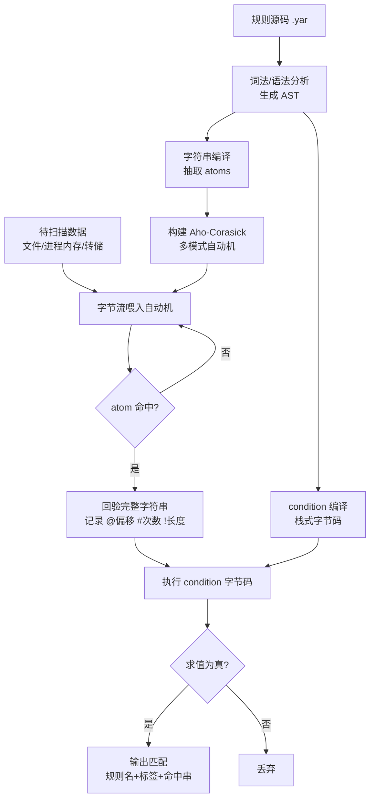

# 恶意代码分析与免杀对抗（16）· YARA规则工程
> [!abstract] TL;DR
> - YARA 是"编译—扫描"两阶段的模式匹配引擎：字符串被拆成 atoms 灌进 Aho-Corasick 自动机做多模式预筛，condition 编译成栈式字节码在候选命中后才求值——看懂这条流水线才能写出既准又快的规则。
> - 三类字符串（文本 / 十六进制 / 正则）叠加修饰符（nocase / wide / xor / base64 / fullword）覆盖编码变体；condition 用 `of` / `for` / `at` / `#` / `@` / `!` 与 `filesize`、`uintNN()` 把一堆弱信号编译成一条强判据。
> - PE、math、hash、dotnet 等模块把结构语义（imphash、Rich Header、区段熵、Authenticode 签名）引入规则，是家族归因与加壳检测的主力，也是"字节匹配"够不到的语义层。
> - 规则工程的核心矛盾是特异性与泛化的平衡：锚定不变量、组合弱串、用良性语料库回归测试，才能同时压低误报率（FP）与漏报率（FN）。
> - 攻防是军备竞赛：攻击者打散 atoms、伪造 imphash / Rich Header、填充区段改熵；防御者转向更难篡改的协议格式、加密常量与代码结构不变量；YARA-X 的 Rust 重写带来更快扫描与更严格的诊断。

## 概述与定位

YARA 常被称作"恶意代码研究者的模式匹配瑞士军刀"（the pattern matching swiss knife for malware researchers），由 Victor Alvarez 在 VirusTotal（后并入 Google）体系内开发并开源。它的定位极其清晰：**用一门声明式的小语言，把分析师脑中的"这个家族长这样"翻译成机器可反复执行、可分发、可版本化的判据**。一条 YARA 规则由三块构成——`meta`（元数据，人读）、`strings`（要找的特征字节 / 文本 / 正则）、`condition`（这些特征以什么逻辑组合才算命中）。规则本身是纯文本，可以进 Git、进 CI、进威胁情报平台，这让检测知识第一次具备了"代码"的工程属性。

要理解 YARA 的价值，得把它放进检测手段的谱系里横向对比。**文件哈希**（MD5/SHA256）精确但极脆——改一个字节即失效，只能抓"见过的那一个"；**AV 特征库**闭源、不可移植、无法审计；**Sigma** 针对日志、**Suricata/Snort** 针对网络流量、**ClamAV** 有自己的签名格式且以杀毒落地为目标。YARA 独占的生态位是：**面向任意字节流（文件、进程内存、固件、内存转储、流量载荷）的、开放且可编程的静态特征匹配**。在著名的"痛苦金字塔"（Pyramid of Pain）里，哈希/IP/域名位于底部（对手换起来毫无痛感），而 YARA 主要作用在"工具 / 主机工件"这一层——它能刻画一个加载器的代码骨架、一个家族复用的加密常量、一段独特的配置结构，这些是对手改起来真正肉疼的东西，检测价值因此远高于 IOC。

它的典型用武之地包括：威胁狩猎（在海量样本仓库里 retrohunt 历史、livehunt 新上传）、DFIR 应急（用 Loki/THOR 扫一台失陷主机的磁盘与内存）、沙箱打标（样本跑完自动贴家族标签）、EDR 与邮件网关的静态引擎、以及情报共享（一条规则即一份可执行的 IOC 报告）。放到本系列里看边界：第 03 篇讲的字符串、导入表、imphash 是 YARA 的**原料**；第 11、12、15 篇讲的混淆、直接系统调用、Shellcode 加载器是 YARA 要**对抗的检测规避对象**；第 17 篇的 MITRE ATT&CK 是比 YARA 更高一层的**行为 / TTP 抽象**。YARA 管"这块字节像不像某工具"，ATT&CK 管"这个行为属于哪个战术"，二者互补而非替代。

## 原理与机制

YARA 的心脏是一个**两阶段模型：先编译，后扫描**。理解这两阶段各自在干什么，是从"能写规则"到"能写好规则"的分水岭。

**编译阶段**：`yarac`（或库调用 `yr_compiler_*`）把规则源码做词法 / 语法分析生成 AST，然后分两路下沉。`strings` 一路：每个字符串被抽取出若干 **atoms**（原子，通常≤4 字节的短序列），编译器挑选"信息量最高、最不容易随机撞上"的 atom 作为该串的索引锚，所有 atoms 汇总构建成一台 **Aho-Corasick 多模式自动机**。`condition` 一路：布尔 / 算术表达式被编译成**栈式虚拟机的字节码**。这一步是性能的关键——**规则一次编译，可反复扫描海量文件**，编译期的代价被摊薄到近乎为零。

**扫描阶段**：待检数据（文件内容、进程内存页、转储）被当作一条字节流，**一次性喂过 Aho-Corasick 自动机**。自动机在 O(n) 时间内（n 为数据长度，与规则数量近乎无关）报告"哪些 atom 在哪些偏移命中"。只有当某个 atom 命中，YARA 才在该位置**回验完整字符串**（做通配 / 正则 / 修饰符的精确比对），命中则记录该串的偏移、长度、次数。所有字符串状态就绪后，才**执行 condition 字节码**求值；为真则输出匹配（规则名 + 标签 + 命中串）。



**为什么必须两阶段、必须 Aho-Corasick？** 设想没有预筛：一千条规则、每条五个字符串，对每个文件的每个字节位置逐一尝试匹配，复杂度爆炸到不可用。Aho-Corasick 的精髓是把"多个模式串"合并成一台自动机，一趟扫描同时匹配全部 atoms，且用失败指针避免回退——这让扫描时间几乎只取决于数据大小而非规则数量。**代价是：atom 的质量直接决定性能**（下文详述）。这也解释了 YARA 语言里的诸多设计动机：`filesize` 关键字让你早早剪枝掉过大文件；`uint16(0) == 0x5A4D` 这种在固定偏移读整数的判据几乎零成本，应放在 condition 最前面短路掉绝大多数非目标文件。

下面是一条形态完整的规则，把三段式和常见判据一次性展示：

```yara
import "pe"

rule APT_Loader_Heuristic
{
    meta:
        author      = "geesehoward20000"
        description = "示例：通用加载器启发式（教学/防御视角）"
        date        = "2026-07-03"
        tlp         = "WHITE"

    strings:
        $s1 = "VirtualAlloc"   ascii
        $s2 = "VirtualProtect" ascii
        // push imm32; push 0x40(RWX); push 0x3000(COMMIT|RESERVE)
        $op = { 68 ?? ?? ?? ?? 6A 40 68 00 30 00 00 }

    condition:
        uint16(0) == 0x5A4D and     // MZ 头，最先短路
        filesize < 2MB and
        2 of ($s*, $op)
}
```

注意 `uint8/uint16/uint32`（及有符号版 `intNN`）默认按**小端**读取，`uint16be` 等为大端；读越过 `filesize` 返回 `undefined`。把最便宜、最能剪枝的条件写在 `and` 链最前，是 YARA 性能工程的第一条肌肉记忆。

## 匹配引擎与规则语言详解

这一节把语言的三大支柱——字符串、条件、模块——连同其底层引擎行为逐一拆开，重点在"为什么这样设计"和"边界在哪"。

### 字符串：文本、十六进制、正则三态

**文本字符串** `$a = "malware"` 最直观，匹配原样字节序列。**十六进制字符串** `$a = { 4D 5A 90 00 }` 面向代码 / 结构特征，独有三种强大语法：通配 `??`（任意字节）与半字节通配 `?A`/`A?`（只定死高 / 低 4 位，常用于跨版本容忍寄存器编码差异）；**跳转** `[4-6]`（此处有 4 到 6 个任意字节）、`[2-]`（至少 2 个）、`[-]`（任意多个，慎用）；**替代** `( 45 | 46 )`（此处是 0x45 或 0x46）。跳转与替代让一条 hex 串能容纳指令长度浮动、常量分支等变体，是刻画"同一段代码的多个编译产物"的利器。

**正则表达式** `$a = /md5=[0-9a-f]{32}/` 用于结构化文本（配置字段、协议格式、路径模板）。关键认知：**YARA 用的是自研正则引擎，基于 Thompson NFA，不是 PCRE**——没有回溯灾难，但也不支持反向引用等 PCRE 高级特性；支持 `i`（不敏感）、`s`（点匹配换行）标志。正则灵活但代价高，尤其 `.*`、无界重复会让编译器难以提取有效 atom，触发性能警告；**能用带跳转的 hex 串表达的，优先别用正则**。

### 修饰符：一次声明覆盖多种编码变体

修饰符是 YARA 应对"同一语义、多种字节表现"的核心武器，一次声明抵得上手写十几条变体：

- `nocase`：大小写不敏感（文本串）。
- `wide`：按 UTF-16LE 匹配（每个 ASCII 字符后补 `00`），命中 Windows 宽字符串；`ascii` 显式要求 ASCII，`wide ascii` 同时匹配两种编码——**这是分析 Windows 样本几乎必加的组合**。
- `xor` / `xor(0x01-0xff)`：为字符串生成所有单字节 XOR 变体（默认 0x00–0xFF，`0x00` 即明文；带范围可排除明文或限定 key 空间），专治"配置 / C2 域名被单字节 XOR 编码"这一最常见的轻量混淆。
- `base64` / `base64wide`：处理 Base64 编码在字节流中的**对齐问题**——因为每 3 字节编码成 4 字符，子串在完整密文中的起始位置有 0/1/2 三种对齐，YARA 自动生成 3 种变体并剥掉受相邻字节影响的首尾字符。不能与 `nocase` 共用；可与 `wide` 组合成 `base64wide`。
- `fullword`：要求匹配两侧是非字母数字边界，避免 `"cmd"` 误命中 `"cmdlet"`。
- `private`：该串命中但**不出现在匹配报告里**，用于内部逻辑锚点而不泄露给下游。

```yara
strings:
    $u = "cmd.exe"    nocase wide ascii     // 大小写 + 宽/窄双编码
    $x = "evil.com"   xor(0x01-0xff)        // 单字节 XOR 混淆的 C2
    $b = "http://"    base64                 // 载荷内 Base64 嵌套的 URL
    $w = "SELECT"     fullword nocase        // 词边界，避开 SELECTED
```

**深层原因**：这些修饰符不是语法糖，而是把"编码变体的组合爆炸"下沉到编译器自动展开——`xor` 一行等价于手写 255 条串，且每条都参与 atom 优化。但要清醒：`xor` 会显著增加 atom 数量、拉低平均质量，宽范围 XOR 叠加短字符串是性能杀手，务必配 `filesize`、限定 key 范围、并保证被编码串足够长（≥6 字节更稳）。

### 条件表达式：把弱信号编译成强判据

`condition` 是规则的大脑。字符串标识符 `$a` 本身即布尔（是否命中）。围绕它有一整套算子把"命中的元信息"变成可计算量：

- `#a` = `$a` 命中次数，`#a > 3`；`#a in (0..100)` 限定计数区间。
- `@a[i]` = 第 i 次命中的偏移，`@a[1] < 0x400`（首次落在前 1KB）。
- `!a[i]` = 第 i 次命中的字节长度（对变长正则 / hex 跳转有意义）。
- `$a at 0x10`：命中恰好落在某偏移；`$a in (0..1024)`：命中落在某区间。
- **`of` 集合算子**：`2 of ($a,$b,$c)`、`any of them`、`all of ($s*)`、`none of them`、`50% of them`——这是**组合弱信号**的主力，把"任意一个易误报"变成"三选二才算数"。
- **`for` 循环**：`for any i in (0..pe.number_of_sections-1): (...)`、`for all i in (1..#a): (@a[i] < 0x1000)`，对命中集合或模块数组做量化判断。
- 环境量：`filesize`、`uintNN(off)`、`entrypoint`（旧，PE 场景改用 `pe.entry_point`）。

```yara
condition:
    uint16(0) == 0x5A4D and
    filesize < 500KB and
    #api >= 3 and                 // 某 API 名反复出现
    @cfg[1] < 0x2000 and          // 配置块靠前
    (2 of ($str*) or $op) and
    for any i in (0..pe.number_of_sections-1): (
        math.entropy(pe.sections[i].raw_data_offset,
                     pe.sections[i].raw_data_size) > 7.2   // 高熵=疑似加壳/加密段
    )
```

**设计哲学**：单条特征几乎必然要么太窄（只抓一个样本）要么太宽（满地误报），而 `condition` 让你把若干"各自不可靠"的证据用逻辑与阈值**编织成一个整体可靠的判据**——这正是规则工程的精髓，也是下一节"误报与泛化"的技术基础。此外规则可**互相引用**（在 condition 里写另一条规则名作为布尔），配合 `private rule` 可搭建"公共基元 + 家族规则"的分层结构；`global rule` 对所有规则叠加前置约束（如全局 `filesize` 上限）；`rule Foo : dropper apt` 的**标签**便于批量筛选输出。

### 模块系统：从字节匹配到结构语义

纯字节匹配够不到"这个 PE 的导入表指纹是什么""这段区段熵多高"这类**语义**，模块就是把解析器接进规则语言的桥。最常用的是 **PE 模块**：

- 结构：`pe.is_pe`、`pe.machine`、`pe.number_of_sections`、`pe.entry_point`、`pe.image_base`、`pe.characteristics`（`pe.DLL` 等位）、`pe.subsystem`、`pe.timestamp`、`pe.pdb_path`。
- 区段：`pe.sections[i].name/.virtual_address/.virtual_size/.raw_data_offset/.raw_data_size`——配合 math 模块算每段熵。
- 导入 / 导出：`pe.imports("kernel32.dll","CreateRemoteThread")`、`pe.exports("Start")`、`pe.number_of_imports`。
- **imphash**：`pe.imphash()` 返回导入表（按 DLL + 函数、依原始顺序）的 MD5。同一编译工程、同一链接器往往产出相同 imphash，是**家族聚类**的经典指纹。局限也要讲透：imphash 由**编译器 / 链接器决定的导入顺序**驱动，攻击者可打乱导入、改用动态解析（`GetProcAddress`）或全直接系统调用（见第 12 篇）来抹掉它——**imphash 相同强证同源，不同却不能证不同源**。
- **Rich Header**：`pe.rich_signature.clear_data`、`.toolid(id, ver)`——MSVC 链接器留下的工具链版本指纹，比 imphash 更细，可推断编译环境；同样可被清除 / 伪造。
- **Authenticode**：`pe.number_of_signatures`、`pe.signatures[i].issuer/.subject/.serial/.valid_on(time)`——识别是否签名、被谁签、证书是否在样本时间点有效（防"偷来的过期证书"）。
- 叠加：`pe.overlay.offset/.size`（附加在 PE 末尾的数据，常藏配置 / 第二阶段载荷）。

**math 模块**是加壳 / 加密检测的量尺：`math.entropy(off,len)` 返回 0–8 的香农熵，压缩 / 加密数据逼近 8，正常代码段约 5–6.5；`math.mean`、`math.deviation`、`math.serial_correlation`、`math.monte_carlo_pi` 提供更细的随机性刻画。**hash 模块**在规则内即时算内容哈希：`hash.md5(off,len)`、`hash.sha256(0,filesize)`、`hash.crc32(...)`，可对"某个固定偏移的配置块"做精确指纹。此外还有 **dotnet**（.NET 元数据 / 流 / GUID）、**elf**（Linux）、**dex**（Android）、**magic**（libmagic 类型）、**time**（规则内取当前时间做有效期）、以及调试用的 **console** 模块（`console.log()`，YARA 4.2+）。

```yara
import "pe"
import "hash"

rule Family_By_Structure
{
    condition:
        pe.is_pe and
        pe.imphash() == "a3f8c0...c2" and              // 导入指纹
        pe.rich_signature.toolid(0x104, 40116) > 0 and // 特定编译工具链
        pe.number_of_signatures == 0 and               // 未签名
        pe.overlay.size > 0 and
        hash.sha256(pe.overlay.offset, pe.overlay.size)
            == "9f2b...e1"                              // 附加载荷精确指纹
}
```

**一个致命陷阱：undefined 的传播。** 当你对非 PE 文件访问 `pe.entry_point`，模块字段返回 `undefined`，任何含它的算术 / 比较结果也变 `undefined`，在布尔上下文里视为假；更坑的是 `not undefined` 仍是 `undefined`（不是真）。因此**永远先用 `pe.is_pe and ...` 守卫**，否则规则会在非目标文件类型上悄悄失效或行为诡异。

### atoms 与性能：为什么有的规则慢

回到引擎本质：**扫描速度由 atoms 质量决定**。编译器从每个字符串抽取最优 atom 塞进 Aho-Corasick；atom 越长、越"罕见"，随机撞上从而触发昂贵回验的概率越低。

```
字符串  "VirtualProtect"
候选 atom（4 字节滑窗）:  "Virt" "irtu" "rtua" ... "tect"
编译器挑信息量最高者（如 "tect"）作索引锚；
扫描时 Aho-Corasick 命中 "tect" 才回验整串 → 高效。

反例   { ?? ?? ?? 90 }        // 唯一确定字节是 0x90(NOP)
无法提取 >=2 字节稳定 atom → 退化为满流逐位置验证
→ 编译期告警 "string may slow down scanning"。
```

由此推出可操作的性能守则：**避免过短字符串**（<4 字节几乎必慢）；**避免通配开头 / 全通配的 hex**（`{ ?? ?? 45 ... }` 无稳定前缀 atom）；**收敛正则**（别 `.*` 开路）；**慎用宽范围 `xor` 叠短串**；**善用 `filesize`、`uintNN(0)` 前置短路**。用 `yara -w` 看告警、用 `yara -p N`（多线程）与内建 profiling 定位慢规则。**深层原因**始终是同一条：任何让 atom 变短或变常见的写法，都会把工作从"廉价的自动机预筛"推给"昂贵的逐位置回验"。

## 工具视角与实战

**命令行**：`yara [options] rules_file target` 扫单文件 / 目录（`-r` 递归）；`-s` 打印命中串、`-m` 打印 meta、`-w` 关告警外显、`-d VAR=VAL` 传外部变量、`-p N` 多线程、`--scan-list` 批量。`yarac rules.yar rules.yarc` 预编译成二进制规则集，生产环境分发编译产物既快又不泄露规则明文。进程扫描直接 `yara rules.yar <PID>`（需权限），这是把静态规则用到**内存取证**上的入口——脱壳后的载荷在磁盘上被加密、在内存里却是明文，内存扫描常能命中磁盘扫描漏掉的家族串。

**库集成**：`yara-python`（`yara.compile()` / `rules.match()`）是自动化流水线与沙箱打标的事实标准；C 库 `libyara` 嵌进 EDR / 网关；Go、Rust 亦有绑定。规则因此能无缝接入样本入库、CI 回归、告警富化各环节。

**规模化狩猎**：VirusTotal 的 **Retrohunt**（对历史语料回溯扫描）与 **Livehunt**（对新上传实时打标）是威胁情报的日常；开源侧有 **mquery**（CERT.pl，PB 级样本库的 YARA 前置索引加速）、**klara**（Kaspersky 的分布式 YARA）。应急响应端 **Loki** / **THOR**（Florian Roth）把 YARA 规则 + IOC 打包成落地扫描器，直接扫失陷主机。

**自动生成——yarGen 及其方法论**：Florian Roth 的 `yarGen` 从一批样本提取字符串，**减去内置的良性字符串 / opcode 数据库（good-strings、good-opcodes）**，用打分模型选出最具代表性的候选，自动产出规则骨架。它的价值是把分析师从"手翻 strings 输出"里解放，**但产物必须人工复核**——自动工具无法判断某串是"家族独有"还是"恰好这批样本共有的编译器噪声"，直接上线极易过拟合。类似的还有 yarabuilder、yara-toolkit 等。正确姿势：**工具出草稿，人验代表性，再用语料库回归**。

```python
import yara
rules = yara.compile(filepath="family.yar",
                     externals={"filename": "sample.bin"})
for m in rules.match("sample.bin"):
    print(m.rule, m.tags, [(s.identifier, s.instances[0].offset)
                           for s in m.strings])
```

**YARA-X**：Victor Alvarez 主导、用 **Rust 重写**的下一代实现（2023 年起），目标是更快的扫描、更清晰的错误诊断、更强的内存安全与更好的可嵌入性（`yr` 新 CLI、官方多语言绑定）。它对绝大多数存量规则保持兼容，但**收紧了若干宽松 / 已弃用语义**（例如更严的类型与未定义处理），迁移时需回归测试。方向很明确：把十余年积累的经典设计，用现代工程重新落地。

### 误报与泛化的工程平衡

这是规则工程真正的难点，也是本篇的种子要点。一条规则活在**特异性（specificity）↔ 泛化（generalization）** 的连续谱上：


左端过拟合：规则只认训练时那几个样本，家族一改壳 / 换编译器就漏（高 FN）；右端欠拟合：`"CreateThread"` 这种谁都有的串，满世界误命中良性软件（高 FP）。工程目标是**把规则钉在中段的"不变量"上**：

- **锚定难改的东西**：C2 协议的字段格式与魔数、样本自带的加密常量表 / S-box、独特的 mutex / 命名管道名、去掉可变操作数后的**代码序列骨架**（用 hex 通配 + 跳转表达）。这些是对手换起来伤筋动骨的，检测寿命长。
- **组合弱信号**：任何单串都可能误报，就用 `3 of ($s*)`、`@a[1] < X and #b > 2` 把多个弱证据与成强判据——单串 FP 率相乘后趋近于零，同时保留对变体的容忍。
- **回归测试双向跑**：拿一份**良性语料库**（goodware corpus：干净系统盘、常见软件、SDK 运行时）扫规则，FP 必须为零或极低；再拿**家族样本全集**扫，测召回（能抓住多少变体）。两个数字一起看，才知道规则落在谱系哪一段。
- **避开这些坑**：编译器 stub / CRT 初始化代码、开源库字符串（OpenSSL/zlib/Boost 的版本串遍地都是）、通用 Windows API 名、编译时间戳、每次编译都变的随机字段、以及可被填充 / 重排轻易改写的 PE 结构量（单靠 `imphash` 或单段熵极易被规避，务必与内容特征叠加）。

区分**检测规则**（宽、面向狩猎、宁可多看几眼）与**识别 / 归因规则**（窄、面向定性、必须精准）能让你有意识地选择谱系位置——狩猎规则允许一定 FP 由人复核，归因规则的 FP 则可能污染情报结论，标准天差地别。

## 安全性与正确使用

> [!caution] 合规边界与使用红线
> 本篇所有规则语法、引擎原理、绕过—加固的攻防讨论，**仅限于自有资产、获明确书面授权的环境、CTF 靶场与安全研究 / 教学**，且**一律以防御与检测为目的**。
> - 不提供针对**真实生产系统或他人系统**的武器化步骤，不把"如何让某样本躲过某商业产品的规则集"整理成可复现的绕过配方。
> - 不为**绕过商业授权 / 版权保护**提供任何武器化手段。
> - 规则、样本哈希、语料库涉及情报，共享须遵循 **TLP**（红 / 琥珀 / 绿 / 白）分级与所在组织的数据合规要求；样本本身按恶意代码管理规范隔离处置。
> - 讲清"什么样的特征更难被规避"是为了写出更稳健的检测规则，方向始终朝向防御；把同样知识反用于帮助真实攻击者逃逸生产检测，超出本篇边界。

除合规外，还有两类**运营安全**问题必须正视。其一，**误报的现实代价**：一条上线到邮件网关 / EDR 的规则若命中良性文件，可能触发隔离甚至删除，直接造成业务中断——因此任何进生产的规则都必须先过良性语料库回归、灰度观察、并保留 meta 里的作者 / 日期 / 参考以便追责回滚。其二，**规则即攻击面**：明文规则一旦泄露，等于把"我怎么抓你"告诉对手，他们会据此打散 atoms、伪造 imphash / Rich Header、填充区段拉平熵来定向规避。这是一场持续军备竞赛——防御方的正确应对不是把规则藏死，而是**把判据锚在对手改起来最痛的不变量上**（协议、加密常量、代码结构），并让 YARA 的静态特征与行为检测（第 04 篇沙箱、第 17 篇 ATT&CK TTP、ETW/内核遥测）**纵深互补**。任何单层检测都会被绕过，YARA 的定位是这条纵深链上高性价比、可分发、可审计的一环，而非银弹。

## 小结

YARA 把"分析师对一个家族的直觉"编译成可执行、可分发、可版本化的判据，其威力与陷阱都根植于"编译—扫描"两阶段引擎：字符串经 atoms 进 Aho-Corasick 做廉价预筛，condition 编成字节码在候选命中后求值——**atom 质量定生死（性能），condition 逻辑定成败（准确性）**。三类字符串叠加 `nocase/wide/xor/base64/fullword` 覆盖编码变体，`of/for/at/#/@/!` 与 `filesize/uintNN()` 把弱信号编织成强判据，PE/math/hash/dotnet 模块把 imphash、Rich Header、区段熵、Authenticode 这些结构语义引进规则。规则工程的核心永远是**特异性与泛化的平衡**：锚定不变量、组合弱串、良性语料双向回归，才能同压 FP 与 FN。工具链上，`yarac`/`yara-python`/Loki/THOR/mquery/Retrohunt 覆盖从单机到 PB 级，yarGen 出草稿但须人验，YARA-X 用 Rust 把经典设计重新落地得更快更严。最后牢记：YARA 是静态特征层的一环，与行为 / 内核 / 流量检测纵深互补，才谈得上稳健。

## 相关阅读

- YARA 官方文档：`https://yara.readthedocs.io`（语言参考、模块、性能与告警指南）。
- YARA-X 文档与迁移说明：`https://virustotal.github.io/yara-x/`（Rust 实现的语义差异与新特性）。
- Florian Roth：`yarGen`（规则自动生成）、`Loki` / `THOR`（IOC + YARA 落地扫描器）、以及 "How to Write Simple but Sound Yara Rules" 系列方法论。
- CERT.pl `mquery` 与 Kaspersky `klara`：大规模 YARA 狩猎架构。
- 本系列：[[03.静态分析：特征与字符串与导入表|← 特征/字符串/导入表（原料）]]、[[11.免杀原理：混淆与加密与加载器|← 混淆加密加载器（被检测对象）]]、[[15.Shellcode分析与加载器逆向|← Shellcode 加载器]]、[[17.MITRE-ATTCK与TTP映射|→ 行为 / TTP 抽象]]。
- 承接注入与遥测：[[32.hooks/11-process-injection]]、[[32.hooks/12-kernel-hook]]、[[32.hooks/15-etw]]。
- 取证下游（内存扫描印证行为）：[[53.数字取证与事件响应/00.数字取证与事件响应总览]]。
- 流量呼应（网络侧特征与规避）：[[72.抓包与协议分析实战/12.流量特征分析与检测绕过]]、[[72.抓包与协议分析实战/19.网络取证与流重组]]。
- 现代样本语言逆向：[[27.Go与Rust现代二进制逆向/00.Go与Rust现代二进制逆向总览]]。

[[00.恶意代码分析与免杀对抗总览|⬆ 系列总览]] | [[15.Shellcode分析与加载器逆向|← 上一章]] | [[17.MITRE-ATTCK与TTP映射|→ 下一章]]
