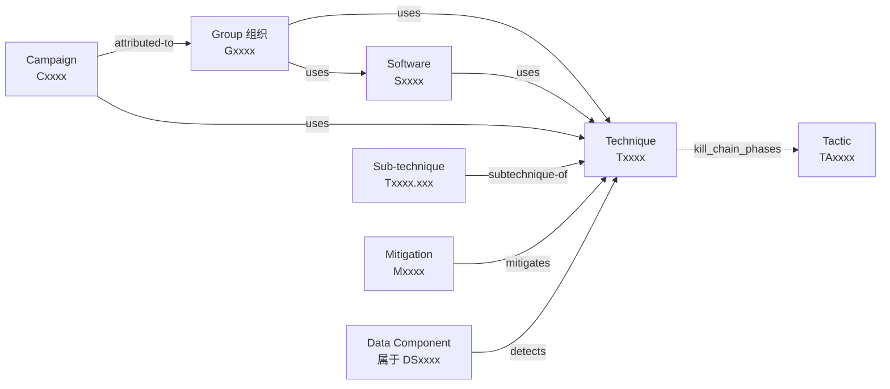
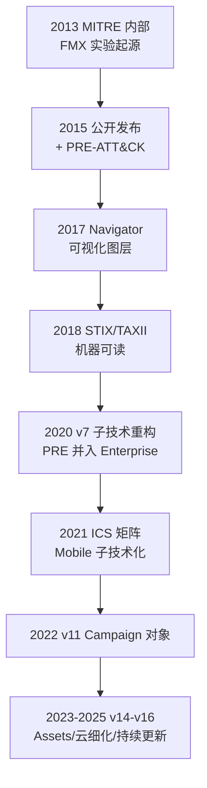
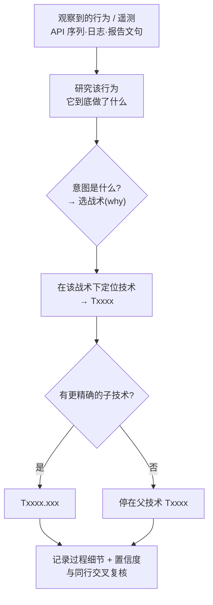
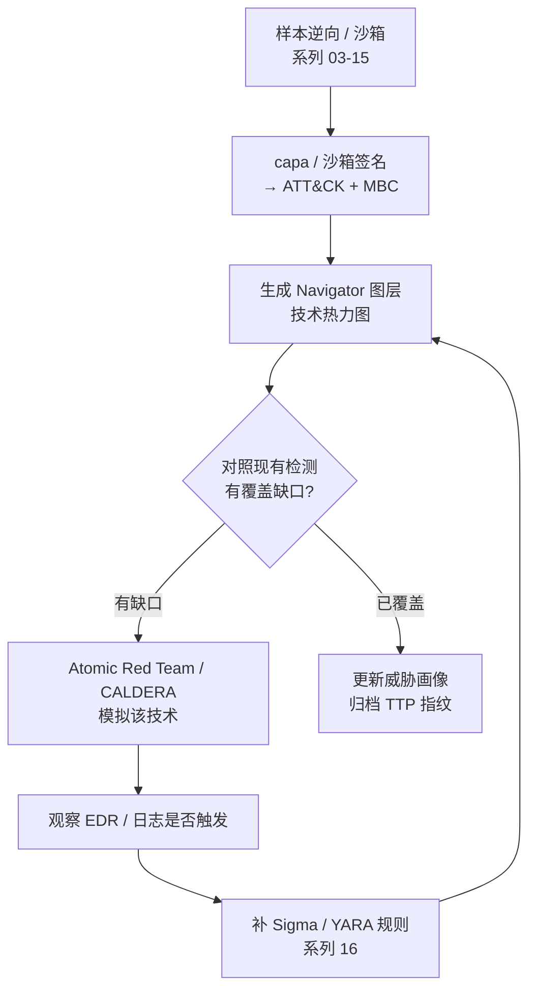

# 恶意代码分析与免杀对抗（17）· MITRE-ATTCK与TTP映射

> [!abstract] TL;DR
> - ATT&CK 是一部**经验性**（基于真实观测、而非理论推演）的对手行为知识库：**战术=为何(why)、技术=如何(how)、过程=具体实现**，三层抽象共同构成 TTP。它不是线性杀伤链，而是一张可组合、可寻址的行为坐标系。
> - ID 体系（TA 战术 / T 技术 / G 组织 / S 软件 / M 缓解 / DS 数据源 / C 战役）以 **STIX 2.1 对象 + relationship 图**承载；一个技术通过 `kill_chain_phases` 字段可同时归属多个战术，这是映射时最易踩的多对多陷阱。
> - TTP 映射是「行为→战术→技术→子技术」的自顶向下 / 自底向上过程，最大误区是把**工具或单条 API 当成行为**、把 `T1059` 无脑套给一切脚本执行。
> - **痛苦金字塔**（Pyramid of Pain）揭示 TTP 位于顶端：改哈希 / IP 对手近乎零成本，改 TTP 才伤筋动骨——这就是行为检测优于 IOC 的根因。
> - **行为归因**靠 TTP 聚类而非单点 IOC，但共享工具、开源武器与假旗（false flag）使归因充满不确定性，必须标注置信度，拒绝凭单薄重叠就「点名」。
> - 工具链闭环：`capa`/MBC 做静态能力→技术映射，Navigator 画热力图与覆盖缺口，Atomic Red Team / CALDERA 做对手模拟，Sigma 用 `attack.*` 标签回连检测。

## 概述与定位

本系列前十六篇是一部「技术词典」：注入（[[06.进程注入技术全谱]]）、镂空（[[07.进程镂空与傀儡进程Hollowing]]）、持久化（[[08.持久化技术大全]]）、提权（[[09.提权与UAC绕过]]）、防御规避（[[10.防御规避：反虚拟机与反调试与反沙箱]]）、C2（[[13.C2框架与通信协议]]）、Shellcode（[[15.Shellcode分析与加载器逆向]]）、YARA（[[16.YARA规则工程]]）……每一篇都在讲「一种具体手法怎么做」。而本篇要解决的是一个**元问题**：当你手里攒了几十上百种手法、几百个样本、十几份威胁报告，如何给它们一套**统一的语言、统一的编号、统一的坐标**，让分析师之间、检测团队与情报团队之间、甲方与厂商之间能对齐、能比较、能度量覆盖率、能做归因？这套语言就是 **MITRE ATT&CK**（Adversarial Tactics, Techniques, and Common Knowledge），而把样本行为翻译成这套语言的动作就叫 **TTP 映射**。

**TTP** 三个字母来自军事情报术语 Tactics（战术）、Techniques（技术）、Procedures（过程），描述对手「做什么」而非「用什么」。ATT&CK 把它落成三层抽象：**战术**回答「为什么做这一步」——攻击者的战术意图（如：持久化、横向移动、命令控制）；**技术**回答「怎么达成这个意图」——如「用注册表 Run 键实现持久化」；**过程**则是某个具体样本 / 组织在某次入侵中对该技术的**特定实现**——如「Emotet 把自身路径写入 `HKCU\...\Run` 下名为 `<随机>` 的值」。三层从抽象到具体，构成一个金字塔：战术极少（企业域 14 个）、技术几百、子技术上千、过程无穷。

要理解 ATT&CK 的定位，得把它和两个前辈对比：

- **洛克希德·马丁的网络杀伤链（Cyber Kill Chain）**：7 个线性阶段（侦察→武器化→投递→利用→安装→C2→行动）。它是**概念模型**，强调「阶段推进」，但太粗、太线性——现实入侵常常并行、回环、跳阶段，杀伤链无法描述「攻击者在'安装'这一步到底用了哪一种手法」。ATT&CK 的战术大致对应杀伤链的阶段，但**每个战术下挂着几十上百个可枚举、可检测的技术**，且允许乱序组合。
- **钻石模型（Diamond Model）**：以「事件」为中心，四个顶点是对手、能力、基础设施、受害者。它擅长**归因推理与关联转轴**（pivoting），但不提供行为的标准词表。ATT&CK 与钻石模型是互补的：钻石模型的「能力」顶点，正好用 ATT&CK 技术来填充。

ATT&CK 最关键的气质是**经验性**（empirical）：每一条技术都附有「谁用过、什么样本用过」的真实引用（procedure examples），来自公开威胁报告与红队实战，而不是「理论上可能存在的攻击」。这让它既是**攻防共同语言**，也是**威胁情报的骨架**。ATT&CK 有三大矩阵：**Enterprise**（覆盖 Windows / macOS / Linux / Cloud / Network / Containers）、**Mobile**（Android / iOS）、**ICS**（工控系统）。本篇以 Enterprise 为主线，因为恶意代码分析的绝大多数产物落在这里。

## 原理与机制

### 十四个企业战术：攻击者的意图轴

Enterprise 矩阵的列头是 14 个战术，每个有一个 `TAxxxx` 编号。把它们和本系列篇目对齐，你会立刻看到这套坐标如何「收纳」前面所有章节：

| 战术 | ID | 意图（why） | 本系列对应 |
| --- | --- | --- | --- |
| Reconnaissance 侦察 | TA0043 | 踩点、搜集目标信息 | 情报前置 |
| Resource Development 资源开发 | TA0042 | 搭 C2、注册域名、买证书 | [[13.C2框架与通信协议]] |
| Initial Access 初始访问 | TA0001 | 钓鱼、漏洞、有效凭证入口 | — |
| Execution 执行 | TA0002 | 让代码跑起来 | [[15.Shellcode分析与加载器逆向]] |
| Persistence 持久化 | TA0003 | 重启 / 注销后仍存活 | [[08.持久化技术大全]] |
| Privilege Escalation 提权 | TA0004 | 拿更高权限 | [[09.提权与UAC绕过]] |
| Defense Evasion 防御规避 | TA0005 | 躲开 AV/EDR/分析 | [[10.防御规避：反虚拟机与反调试与反沙箱]]、[[12.直接系统调用与unhooking]] |
| Credential Access 凭证访问 | TA0006 | 偷密码 / 票据 / 哈希 | — |
| Discovery 发现 | TA0007 | 内网摸底、枚举 | — |
| Lateral Movement 横向移动 | TA0008 | 从一台到多台 | [[18.勒索软件与APT案例剖析]] |
| Collection 收集 | TA0009 | 打包待窃数据 | — |
| Command and Control 命令与控制 | TA0011 | 与外部保持通信 | [[13.C2框架与通信协议]]、[[14.流量分析与网络IOC提取]] |
| Exfiltration 数据窃取 | TA0010 | 把数据搬出去 | [[14.流量分析与网络IOC提取]] |
| Impact 影响 | TA0040 | 加密 / 破坏 / 勒索 | [[18.勒索软件与APT案例剖析]] |

注意战术**不是**严格的时间顺序（`TA` 编号顺序更是历史遗留、毫无语义）：一次入侵可能在拿到初始访问的同一个投放器里，同时完成执行、防御规避、持久化三件事。这正是 ATT&CK 相对杀伤链的进步——它把「阶段」拆成**可并行、可复用、可寻址**的意图标签。

### ID 体系与对象类型

ATT&CK 的每一类实体都有独立编号前缀，理解它们就理解了整个数据模型：

- `Txxxx` **技术**（如 `T1055` Process Injection），`Txxxx.xxx` **子技术**（如 `T1055.012` Process Hollowing）；
- `TAxxxx` **战术**；
- `Gxxxx` **组织 / 入侵集**（intrusion-set，如 `G0016` = APT29 / Cozy Bear）；
- `Sxxxx` **软件**（malware 或 tool，如 `S0154` = Cobalt Strike、`S0002` = Mimikatz）；
- `Mxxxx` **缓解措施**（course-of-action）；
- `DSxxxx` **数据源**及其**数据组件**（data component，如 Process: Process Creation）——这是「用什么遥测能看见该技术」的检测基础；
- `Cxxxx` **战役**（Campaign，2022 年 v11 才引入的对象，把一批有时间跨度、有共同目标的活动聚合起来）。

它们之间用 **relationship（关系）** 连接，构成一张有向图。核心关系动词有：`uses`（组织/软件 使用 技术；组织 使用 软件）、`mitigates`（缓解 针对 技术）、`detects`（数据组件 探测 技术）、`subtechnique-of`（子技术 属于 父技术）、`attributed-to`（战役 归属 组织）、`revoked-by`（技术被另一技术取代）。



**为什么要引入子技术？** 2020 年 7 月的 v7 是 ATT&CK 史上最大重构。此前技术粒度极不均衡：`T1086 PowerShell` 和 `T1064 Scripting` 是并列技术，可前者明明是后者的一个具体形态；有的技术宽如「凭证访问」，有的窄如「某个具体注册表键」。粒度失衡让「覆盖率」这个指标失真——你说覆盖了 100 个技术，可能其中一个抵得上另一个的十倍工作量。子技术把「宽技术」拆成「父技术 + 若干子技术」：`T1055 Process Injection` 之下细分出 `.001 DLL`、`.004 APC`、`.012 Process Hollowing`……既保留了「注入」这个可讨论的抽象层，又给出可精确检测的落点。同期 PRE-ATT&CK（独立的侦察矩阵）被并入 Enterprise，化为 `Reconnaissance` 与 `Resource Development` 两个战术。这段演进史提醒我们：**ATT&CK 是活的、带版本的知识库**，技术会新增、合并、废弃（deprecate）或撤销（revoke），任何一份映射报告都必须**钉住 ATT&CK 版本号**才可复现。



### 承载格式：STIX 2.1 与 TAXII

ATT&CK 的权威机器可读形态是 **STIX 2.1 JSON**（发布在 `mitre-attack/attack-stix-data` 仓库，也可经 TAXII 2.1 服务器订阅）。映射到 STIX 的对象类型是：技术=`attack-pattern`、组织=`intrusion-set`、软件=`malware`/`tool`、缓解=`course-of-action`、战术=`x-mitre-tactic`、数据源=`x-mitre-data-source`、战役=`campaign`、关系=`relationship`。ATT&CK 编号藏在每个对象的 `external_references` 里（`source_name: mitre-attack` 的那条的 `external_id`）。这个设计的深意是：**ATT&CK 天生要被程序消费**——SIEM 规则、EDR 策略、CTI 平台都能直接吃 STIX，而不必人肉抄编号。下一节我们就深入这张对象图，讲清映射方法。

## 数据模型、映射方法与行为归因详解

### STIX 对象图与「一个技术属于多个战术」

初学者最常栽的坑，是以为「技术→战术」是一对一。实则不然：STIX 里技术对象带一个 `kill_chain_phases` 数组，元素是 `phase_name`（即战术的短名）。一个技术可以列出**多个**战术短名，意味着**同一个技术出现在矩阵的多列里**。典型如 `T1055 Process Injection` 同属 **Defense Evasion** 与 **Privilege Escalation**——注入既能藏身于合法进程（规避），又能借宿主进程的高权限令牌（提权）。所以映射时不能只回答「它是什么技术」，还要回答「在**这个样本的这个上下文**里，它服务于哪个战术意图」。同一技术，意图不同，落到 Navigator 图层上就是不同的格子。

程序化查询 ATT&CK 时，`mitreattack-python`（官方库）或 `pyattck` 能把 STIX 加载成对象图，让你做「列出 APT29 用过的全部技术」「找出所有能被 Sysmon EventID 1 检测的技术」这类查询。它们底层都是遍历 relationship 边。

### 映射六步法：MITRE 官方最佳实践

MITRE Engenuity 的「Best Practices for MITRE ATT&CK Mapping」把映射拆成一条可复现的流水线，核心是**从行为出发，而非从工具出发**：



两种发起方向要区分清楚：**自顶向下**是从一份人类写的威胁报告 / 事件叙述里,把「攻击者创建了一个计划任务」这样的句子翻译成 `T1053.005`；**自底向上**是从原始遥测（Sysmon 日志、沙箱 API trace、EDR 事件）里,把「`schtasks.exe /create` 进程创建 + `\Windows\System32\Tasks\` 下新文件」这组底层信号归纳成同一个技术。前者是 CTI 分析师的日常，后者是检测工程师和逆向工程师的日常。两条路殊途同归，但自底向上更抗「报告作者的主观措辞」。

### 从行为到技术：一张过程映射示例表

把本系列前面章节的手法逐一「上坐标」，就得到下面这张过程映射表——它也是你逆向一个真实样本后该产出的东西：

| 逆向观察到的行为 | 战术 | 技术 / 子技术 | 承接篇目 |
| --- | --- | --- | --- |
| `NtMapViewOfSection` + `SetThreadContext` 改写目标入口 | Defense Evasion | `T1055.012` Process Hollowing | [[07.进程镂空与傀儡进程Hollowing]] |
| `QueueUserAPC` 向挂起线程投递 shellcode | Defense Evasion | `T1055.004` APC Injection | [[06.进程注入技术全谱]] |
| 写 `HKCU\...\CurrentVersion\Run` 值 | Persistence | `T1547.001` Registry Run Keys | [[08.持久化技术大全]] |
| 创建 WMI `__EventFilter` + `CommandLineConsumer` | Persistence / PrivEsc | `T1546.003` WMI Event Subscription | [[08.持久化技术大全]] |
| `ShellExecute` 触发 `fodhelper.exe` 自动提权 | Privilege Escalation | `T1548.002` Bypass UAC | [[09.提权与UAC绕过]] |
| `cpuid`/`rdtsc` 探测虚拟机、检测 Sleep 加速 | Defense Evasion | `T1497.001/.003` Sandbox Evasion | [[10.防御规避：反虚拟机与反调试与反沙箱]] |
| 直接 `syscall` 绕过 ntdll 用户态 hook | Defense Evasion | `T1106` Native API（配合 unhook） | [[12.直接系统调用与unhooking]] |
| PEB 遍历 + 哈希比对解析 API | Defense Evasion | `T1027.007` Dynamic API Resolution | [[15.Shellcode分析与加载器逆向]] |
| 反射式加载 PE，不落地 | Defense Evasion | `T1620` Reflective Code Loading | [[15.Shellcode分析与加载器逆向]] |
| HTTPS 心跳 + 域前置 | C2 | `T1071.001` + `T1090.004` Domain Fronting | [[13.C2框架与通信协议]] |
| DNS TXT 隧道回传 | C2 | `T1071.004` DNS | [[14.流量分析与网络IOC提取]] |
| RSA 会话密钥 + AES 载荷加密 | C2 | `T1573.002` Asymmetric Crypto | [[13.C2框架与通信协议]] |
| 卷影删除 `vssadmin delete shadows` | Impact | `T1490` Inhibit System Recovery | [[18.勒索软件与APT案例剖析]] |
| 遍历文件 AES 加密 + 勒索信 | Impact | `T1486` Data Encrypted for Impact | [[18.勒索软件与APT案例剖析]] |

这张表就是「TTP 映射」的成品雏形。注意有的行需要**两个战术**（如 WMI 订阅同属持久化与提权），这正是前面强调的多对多。

### 映射的陷阱与置信度

映射看似机械，实则处处是坑，MITRE 专门列过这些反模式：

1. **把工具当行为**。看到样本用了 Cobalt Strike（`S0154`）就映射「Cobalt Strike」——错。Cobalt Strike 是软件对象，不是技术。你要映射的是它**做了什么**：它的 beacon 用 `T1071.001`、它的 `spawnto` 用 `T1055`。软件是「用什么」，技术是「做什么」，别混。
2. **`T1059` 套一切**。凡是执行脚本就打 `T1059 Command and Scripting Interpreter`，粒度太粗、信息量为零。要落到 `.001 PowerShell` / `.003 Windows Command Shell` / `.006 Python`。
3. **把单条 API 当技术**。`VirtualAlloc` 本身不是技术；`VirtualAlloc + WriteProcessMemory + CreateRemoteThread` 这**组合的意图**（把代码写进别的进程并执行）才是 `T1055`。技术是**行为**层，不是 API 层——这也是为什么纯 IAT 特征（[[03.静态分析：特征与字符串与导入表]]）不足以断言技术，得看调用序列与数据流。
4. **过度映射 / 强行凑格子**。为了让 Navigator「好看」而把牵强的技术都标上，制造虚假覆盖率。
5. **忽略置信度**。映射不是非黑即白。成熟做法是给每条映射标注**置信度**（确证 / 疑似 / 推测）与**证据出处**（哪段反汇编、哪条日志）。逆向时你亲眼看到 `SetThreadContext` 改写 RIP，是「确证」；只凭字符串里有 `powershell` 就推 `T1059.001`，只是「疑似」。

### 痛苦金字塔：为什么 TTP 是检测的制高点

David Bianco 2013 年提出的**痛苦金字塔**，是理解「为什么要映射 TTP 而不只是收集 IOC」的核心心智模型。它按「你封锁这类指标时、对手为了继续行动所付出的痛苦」把指标从下到上排序：

```
        ▲ 封锁它对手有多痛（越高越痛）
 TTPs           ← 最痛：改行为=重写整套打法（Tough!）
 Tools          ← 换工具：重开发 / 重新采购（Challenging）
 Network/Host   ← 改 artifact：改 mutex / UA / 路径（Annoying）
 Domain Names   ← 换域名：注册上线有成本（Simple）
 IP Addresses   ← 换 IP：几乎零成本（Easy）
 Hash Values    ← 改 1 字节即换哈希（Trivial）
        ▼ 检测方的投入产出比（越高越值）
```

底层三类（哈希、IP、域名）就是传统 IOC（见 [[14.流量分析与网络IOC提取]]）：好收集、好共享，但**对手规避成本近乎为零**——重新编译一次哈希就变了，换台 VPS 就是新 IP。顶层的 TTP 则是**行为不变量**：一个惯用 Process Hollowing + DNS 隧道 + WMI 持久化的团伙，若要躲开你针对这套 TTP 的检测，等于要**重写它的整个作战流程**，代价极高。这就是「威胁知情防御」（threat-informed defense）的经济学根基：把检测投资从易变的 IOC 上移到稳定的 TTP 上，用一次工程投入换对手的长期痛苦。当然,金字塔越往上、检测越难写、误报越难控（YARA/Sigma 写行为规则远比写哈希难，见 [[16.YARA规则工程]]），这是必须权衡的成本。

### MBC：ATT&CK 覆盖不到的恶意行为

ATT&CK 是「对手视角」的框架,它刻意**不去描述**很多恶意代码内部的技术细节——因为那些行为对红队 / 蓝队作战意义不大，却对**恶意代码分析**至关重要。比如「用异或解密字符串表」「检测断点 0xCC」「用 RC4 加密配置」这些**恶意软件微观行为**，ATT&CK 要么没有、要么归到一个笼统的 `T1027`。为填补这块，MITRE 又做了 **MBC（Malware Behavior Catalog）**，作为 ATT&CK 的「malware 专用姊妹」：它用 **Objectives**（对标战术，如 Anti-Behavioral Analysis、Anti-Static-Analysis、Cryptography、Memory）组织 **Behaviors** 与 **Micro-behaviors**，覆盖了「反调试的具体手法」「代码混淆的具体形态」「用了哪种加密原语」这些逆向工程师真正关心的粒度。实践中,`capa` 的输出**同时**给 ATT&CK 表和 MBC 表——前者对接检测与情报，后者对接样本画像与家族聚类（[[02.恶意代码分类与家族谱系]]）。记住这条分工：**ATT&CK 管「对手在网络里干了什么」，MBC 管「这段代码本身长什么样」**。

### 行为归因：用 TTP 聚类而非单点

**归因**（attribution）是 ATT&CK 最诱人也最危险的应用。逻辑是：既然 TTP 是行为不变量，那么两批样本 / 两次入侵若共享一组**独特的 TTP 组合**，就可能出自同一团伙。ATT&CK 的 `intrusion-set`（组织）对象与 `G` 编号，正是把「一组稳定 TTP + 工具 + 基础设施」命名归档的产物（如 `G0032` Lazarus）。归因流程本质是**聚类**：把待归因样本的 TTP 指纹，与已知组织的 TTP 画像做相似度比对。

但归因的不确定性极高，必须清醒：

- **共享工具污染**。Mimikatz、Cobalt Strike、开源 RAT 被无数团伙使用,「用了 Cobalt Strike」几乎没有归因价值。真正有区分度的是**独特的过程细节**——某团伙特有的加载器结构、C2 心跳节奏、命名习惯。
- **假旗（false flag）**。高级团伙会**故意模仿**他人的 TTP、植入他国语言字符串、复用公开报告里的 IOC,诱导错误归因（历史上 Olympic Destroyer 是经典案例）。
- **单点重叠不成归因**。凭一两个常见技术重叠就「点名」某 APT，是典型的确认偏误。可靠归因要求**多维度、独特、且难以伪造**的 TTP 与情报交叉印证，并给出**置信度分级**（如「中等置信度」）。

因此本篇立场很明确：TTP 聚类是**生成假设**的强力工具，但把假设升格为「确定是某国某组织」需要远超技术指标的证据链,而这往往超出恶意代码分析师的职责边界。内存与磁盘取证（[[53.数字取证与事件响应/00.数字取证与事件响应总览]]）、网络取证与流重组（[[72.抓包与协议分析实战/19.网络取证与流重组]]）能为归因补充旁证,但仍不足以单独定案。

## 工具视角与实战

### capa：从二进制到 ATT&CK/MBC 的自动映射

Mandiant/FLARE 的开源工具 **capa** 是逆向工程师做 TTP 映射的第一生产力工具。它的核心思想是：**用规则描述「能力」，而非「签名」**。capa 先用后端（vivisect / IDA / Ghidra / Binary Ninja，或对接 CAPE 沙箱的动态 trace）从样本里抽取**特征**（features）：API 调用名、字符串、字节序列、数字常量、指令助记符、以及「有循环」「读 PEB」这类特征化的 characteristic；再用 YAML 规则把这些特征用逻辑组合（`and` / `or` / `not` / `N or more` / `optional`）成「能力」。每条规则的 `meta` 里带 `att&ck:` 和 `mbc:` 字段——所以命中即映射。

```yaml
rule:
  meta:
    name: inject APC
    att&ck:
      - Defense Evasion::Process Injection::Asynchronous Procedure Call [T1055.004]
    mbc:
      - Process::Inject APC [C0038.003]
  features:
    - and:
      - api: kernel32.OpenThread
      - api: ntdll.NtQueueApcThread
      - or:
        - api: kernel32.VirtualAllocEx
        - api: kernel32.WriteProcessMemory
```

删掉这段 YAML，用中文也能讲清它的价值：capa 把「一堆离散的 API 命中」抽象成一个**有意图的能力**，并直接贴上 ATT&CK 与 MBC 编号；它比纯 IAT 匹配（[[03.静态分析：特征与字符串与导入表]]）强，因为要求 API **组合共现**、可加逻辑约束，误报低得多；比动态沙箱轻，因为纯静态即可跑、不必执行样本。它的输出是两张漂亮的表（ATT&CK 与 MBC 命中汇总）加每条命中的地址,配合 capa Explorer（IDA/Ghidra 插件或 Web 版）可直接跳到反汇编现场核对。局限也要知道：capa 是静态的,对强壳 / 强混淆样本会「看不见」被加密的代码——所以要先脱壳（[[05.脱壳与解包与配置提取]]）；对 Go/Rust 这类现代运行时（[[27.Go与Rust现代二进制逆向/00.Go与Rust现代二进制逆向总览]]）的静态特征识别也偏弱。

### ATT&CK Navigator：热力图与覆盖缺口

**ATT&CK Navigator** 是官方的矩阵可视化器。它的产物是一个 **layer JSON**（带 `versions`、`domain`、`techniques[]`，每个技术含 `techniqueID`、`score`、`color`、`comment`）。你可以：给检出的技术打分、上色，生成样本 / 组织的**技术热力图**；把多个图层用表达式做**集合运算**（如 `a + b` 求并、比较两个组织的 TTP 重叠）；把「已有检测覆盖」图层叠在「某 APT 常用技术」图层上，**红绿相减即得覆盖缺口**。这是 SOC 做「威胁知情的缺口分析」的标准动作,也是把恶意代码分析结论转化为防御行动的桥梁。



### 沙箱与自动映射器

主流动态分析平台都内置了「行为签名→ATT&CK」的自动映射：**CAPEv2 / Cuckoo** 的 signature 模块、**Joe Sandbox**、**Hatching Triage**、**Intezer**、**VirusTotal** 的 Behavior 标签页都会直接吐出命中的技术编号（原理见 [[04.动态分析：沙箱与行为监控]]）。它们胜在自动、规模化，弱在**粒度粗、易误报**（把一次普通的注册表读也标成技术）。所以自动映射是**初筛**,最终报告仍需逆向工程师人工核对、补置信度——机器给候选,人给定论。

### Sigma、Atomic Red Team、CALDERA：检测与模拟的闭环

- **Sigma**（通用 SIEM 检测规则语言）约定用 `tags: [attack.t1055.012, attack.defense_evasion]` 把每条检测规则**回连**到它所覆盖的技术。这样检测库本身就带 ATT&CK 坐标,可直接生成「我们能检测哪些技术」的 Navigator 图层。
- **Atomic Red Team**（Red Canary）为**每个技术**提供小而原子的测试用例（YAML 描述 + `Invoke-AtomicTest`），让你在实验室里**主动触发**某技术、验证检测是否告警。它是「把 Navigator 上一个格子从'纸面覆盖'验证成'真的能看见'」的利器。
- **CALDERA**（MITRE 官方）是自动化**对手模拟**平台，它的 ability（能力）都标了技术编号,能按对手画像编排出一条完整攻击链自动执行;配合 **CTID 的对手模拟库**（APT3、APT29、FIN6、menuPass、Carbanak 等有公开 emulation plan）,可复现真实团伙的 TTP 序列做紫队演练。
- 其它值得知道的：**TRAM**（用 NLP/LLM 从威胁报告文句里自动建议技术映射）、**DeTT&CT**（蓝队给数据源打分、评估可见性）、**ATT&CK Flow / Attack Flow Builder**（把离散技术串成有先后依赖的攻击流图）、**ATT&CK Workbench**（自建 / 扩展本地知识库）、**D3FEND**（ATT&CK 的防御对偶,把缓解映射成防御技术）、以及 **ATT&CK Evaluations**（用对手模拟对各家 EDR 做公开检测能力评测）。

## 安全性与正确使用

> [!caution] 合规边界与使用立场
> - **ATT&CK / 对手模拟工具是明确的双重用途知识**。本篇讲的映射、Atomic Red Team、CALDERA、emulation plan，**仅可用于你自有、获授权的环境、CTF 靶场与安全研究**；一律以**防御 / 教育 / 检测评估**为目的。**严禁**在未授权的生产系统或他人系统上运行对手模拟或复现任意技术。
> - **对手模拟能真实造成破坏**。emulation library 里含 `T1486`（加密勒索）、`T1485`（数据销毁）、`T1490`（删卷影）等影响类技术,以及 UAC 绕过、注入等——必须在**隔离快照实验室**（见 [[01.恶意代码分析方法论与实验环境]]）执行,备好回滚与清理，切勿在有真实数据的机器上跑。
> - **归因须极度克制**。切勿凭单薄的 TTP 重叠就公开「点名」某国某组织。共享开源工具、假旗、报告循环引用都会污染归因;结论必须标注**置信度分级**与**证据链**,政治与法律后果不由技术分析师承担。宁可写「与 Gxxxx 报告的 TTP 有中等置信度重叠」,也不要写「就是某某 APT 干的」。
> - **警惕「ATT&CK 剧场」**。Navigator 上一片绿≠真有检测能力。一个格子标「已覆盖」却从未用 Atomic Red Team 验证过,是自欺;覆盖率数字容易被过度映射灌水。诚实的做法是把「有检测规则」「已验证能告警」「已知盲区」分级标注。
> - **版本可复现**。任何映射报告都要**钉住 ATT&CK 版本号**（如 v15）,因为技术会新增 / 合并 / 撤销,不写版本的映射几个月后就无法复现。
> - 本篇是**组织与索引**层：它给前面各章防御性讲解过的行为「上坐标」,不提供任何针对真实目标的新型武器化配方。原理讲透,但成品攻击链的编排一律止于授权实验环境。

## 小结

ATT&CK 之于恶意代码分析，是一套**坐标系与共同语言**:它把散落各章的具体手法收纳进「战术(why)—技术(how)—过程(具体实现)」三层抽象，用 `TA/T/G/S/M/DS/C` 的 ID 体系和 STIX 2.1 relationship 图,让样本行为可寻址、可比较、可度量。**TTP 映射**是把逆向观察翻译成这套语言的手艺,关键纪律是「映射行为而非工具、落到子技术、标注置信度、别用 T1059 套一切、钉住版本」。**痛苦金字塔**解释了为什么要把检测投资从易变的 IOC 上移到稳定的 TTP:那是让对手最痛、让防御最省的经济学最优点。**MBC** 补齐了 ATT&CK 覆盖不到的恶意代码微观行为,与 capa 的双表输出一起支撑样本画像。**行为归因**用 TTP 聚类生成假设,但共享工具与假旗要求我们永远保持置信度意识、拒绝草率点名。工具上,capa 做静态能力映射、Navigator 画热力图与缺口、Atomic Red Team 与 CALDERA 做模拟验证、Sigma 用 `attack.*` 标签回连检测——五者串成「逆向→映射→缺口→模拟→补检测」的紫队闭环。掌握本篇,你才算把前十六篇的「点」连成了「面」,也为下一篇的完整杀伤链复盘备好了坐标纸。

## 相关阅读

- 官方知识库与规范：MITRE ATT&CK（`attack.mitre.org`）、ATT&CK Design & Philosophy Paper、`mitre-attack/attack-stix-data`（STIX 2.1 数据）、OASIS STIX 2.1 规范、TAXII 2.1 规范。
- 映射方法与威胁知情防御：MITRE Engenuity CTID「Best Practices for MITRE ATT&CK Mapping」、Center for Threat-Informed Defense（对手模拟库 / ATT&CK Flow / Sightings）、David Bianco「The Pyramid of Pain」。
- 工具官方仓库 / 文档：`mandiant/capa` 与 capa-rules、MBC（`MBCProject/mbc-markdown`）、ATT&CK Navigator、Red Canary Atomic Red Team、MITRE CALDERA、Sigma（SigmaHQ）、D3FEND、CAR（Cyber Analytics Repository）、TRAM。
- 本系列承接：[[06.进程注入技术全谱]]、[[07.进程镂空与傀儡进程Hollowing]]、[[08.持久化技术大全]]、[[09.提权与UAC绕过]]、[[10.防御规避：反虚拟机与反调试与反沙箱]]、[[13.C2框架与通信协议]]、[[14.流量分析与网络IOC提取]]、[[15.Shellcode分析与加载器逆向]]、[[16.YARA规则工程]]、[[18.勒索软件与APT案例剖析]]。
- 知识库跨系列：[[32.hooks/11-process-injection]]、[[32.hooks/12-kernel-hook]]、[[32.hooks/15-etw]]（注入与遥测底层）、[[53.数字取证与事件响应/00.数字取证与事件响应总览]]（取证印证行为）、[[72.抓包与协议分析实战/12.流量特征分析与检测绕过]]、[[72.抓包与协议分析实战/19.网络取证与流重组]]（网络侧 TTP 印证）、[[27.Go与Rust现代二进制逆向/00.Go与Rust现代二进制逆向总览]]（现代样本映射的难点）。

[[00.恶意代码分析与免杀对抗总览|⬆ 系列总览]] | [[16.YARA规则工程|← 上一章]] | [[18.勒索软件与APT案例剖析|→ 下一章]]
