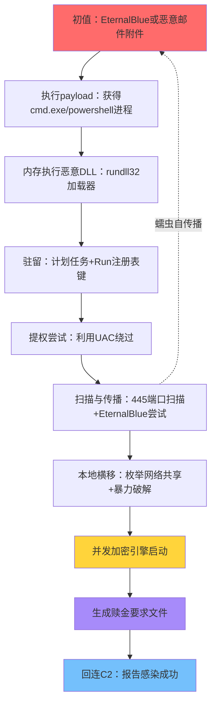

# 恶意代码分析与免杀对抗（18）· 勒索软件与APT案例剖析

> [!abstract] TL;DR
> - 勒索软件通过混合加密（RSA+AES）实现不可逆加密，密钥托管于C2，无本地密钥则数据永久丢失
> - APT攻击链纵深3-6个月，横向移动依赖令牌重放（Pass-the-Hash/Ticket）和权限提升，比勒索软件更关注隐蔽性
> - WannaCry/NotPetya案例演示蠕虫式传播+加密的致命组合；LockBit典型说明勒索即服务（RaaS）的工业化
> - 杀伤链复盘关键：初值漏洞→驻留→提权→横移→数据窃→加密→敲诈，每环均有检测机制可部署
> - 加密强度、密钥管理、网络隔离、备份策略是防御核心，超过解密成本则攻击动机消失

## 概述与定位

勒索软件与高级持久威胁（APT）虽均属顶级恶意代码，但攻击目标、运营方式、纵深时间量级差异悬殊。**勒索软件**追求快速变现（加密后索赔），通常数日内完成感染→加密→勒索的全生命周期；**APT**强调知己知彼（长期驻留、数据窃取、基础设施测绘），常以民族国家或高利润犯罪集团为后盾，纵深可达数月至数年。两者在代码设计哲学、传播策略、反取证手段上均有显著特征。

本篇通过**WannaCry**（2017年全球蠕虫疫情）、**NotPetya**（供应链武器化案例）和**LockBit 3.0**（当代勒索即服务RaaS典型）等真实案例，剖析加密流程的数学基础、横向移动的令牌重放机制、以及杀伤链各环的检测与对抗。重点不在"如何写勒索软件"，而在**从防御/取证视角理解其工作原理与失败模式**——防守方每理解一个环节，就多了一个防御要点。

## 原理与机制

### 勒索软件的运作框架

勒索软件本质是一种**流量化的数据勒索**——将受害者的数据可用性与财务激励绑定，形成完整的经济链闭环。其核心流程分为五个环节，每个环节都是防御重点：

1. **初值漏洞/社工入口**：钓鱼邮件（附件可执行）、未修补漏洞（如EternalBlue、Log4Shell）、弱口令RDP暴力破解、供应链污染等
2. **驻留与提权**：通过DLL注入、WMI事件订阅、计划任务、注册表RUN键等取得持久化；必要时执行privilege escalation（UAC绕过、kernel exploit）
3. **数据侦察**：扫描共享目录、遍历文件系统，确定加密范围与优先级（数据库文件、财务报表、备份文件等高价值数据）
4. **并发加密**：多线程并行利用CPU，通常占用60-90%计算资源；同时混入加密后的索赔说明文档（README.txt/DECRYPT_ME.html）
5. **敲诈与谈判**：通过暗网站点、加密聊天通道，向管理员展示被窃数据样本、索要赎金、威胁公开或销售数据

**APT的异同**：APT在前两步耗费大量时间（侦察、渗透测试、初入），之后进行"隐形驻留"而非急速加密。其目标可能是数据窃取（经济间谍）、基础设施破坏（Stuxnet之类）或持续监控（APT1对美防务承包商的长期驻留），而非一次性变现。APT的目的决定了它不能让受害者察觉，因此会尽力隐蔽；勒索软件则反之，加密完成就立即"宣传"，让受害者意识到问题所在以启动付款流程。

### 加密算法与密钥管理的数学基础

勒索软件采用**混合加密方案**（Hybrid Encryption）以兼顾性能与安全性。单纯RSA加密会极其缓慢（RSA在数百字节时性能陡降），故而采用如下策略：

```
┌─────────────────────────────────────────────────────────┐
│ 文件加密流程（以WannaCry为例）                           │
├─────────────────────────────────────────────────────────┤
│ 1. 生成随机 AES-256 密钥 Kfile（32字节）                │
│    ├─ 文件内容加密：C = AES256_CBC(Kfile, plaintext)   │
│    └─ IV: 使用PKCS#7填充，CBC链接模式                 │
│                                                          │
│ 2. 将 Kfile 用RSA-2048公钥加密                          │
│    Encrypted_Kfile = RSA_PublicKey_Encrypt(Kfile)       │
│                                                          │
│ 3. 加密文件格式：                                        │
│    [RSA加密的Kfile（256字节）] + [AES加密的文件内容]   │
│                                                          │
│ 4. 仅将Encrypted_Kfile发送至C2                         │
│    本地删除临时Kfile，磁盘镜像恢复也找不到              │
│                                                          │
│ 5. 只有掌握RSA私钥的C2服务器才能解出Kfile            │
│    ┌──→ 受害者支付赎金 ──→ 获取RSA私钥 ──→ 恢复Kfile
│    │
│    └──→ 或通过数据泄露市场购买已破解密钥（某些变种）
└─────────────────────────────────────────────────────────┘
```

**关键密码学细节**：

- **文件级密钥独立性**：每个文件一个随机AES密钥，即使一个文件被破解（如旧版本漏洞），也只影响那一个文件，其余数据仍密码安全
- **主密钥的非对称加密**：AES密钥本身用RSA公钥加密，确保没有私钥则无法恢复。RSA-2048的密钥空间大约2^2048≈10^616，穷举破解不可行（目前最快的因数分解算法仍需要多项式时间）
- **密钥派生与否**：某些勒索软件（如Petya早期版本）错误地使用了不当的密钥派生函数（KDF），或直接硬编码了主密钥，导致被安全研究者破解。现代勒索软件吸取教训，使用PBKDF2/Argon2等标准KDF

**WannaCry的加密缺陷**：WannaCry虽使用了ECC（椭圆曲线加密）替代RSA（为了性能），但在某些编译版本中遗留了恢复私钥的可能性——样本中包含了调试信息或未优化的密钥生成代码。这是逆向分析的突破口之一。

### 横向移动：从单机感染到全网蔓延

勒索软件的致命威力源于其快速**横向移动**能力。一个内网感染可在数小时内扩展到数百台机器。典型手段包括：

#### 网络共享枚举与暴力破解
```
PING扫描本地网络段(192.168.1.0/24) → 发现活跃主机
                                      ↓
                            SMBv1/v3扫描(445端口)
                                      ↓
                        尝试匿名登录或空会话
                                      ↓
                    枚举共享（IPC$、ADMIN$、C$）
                                      ↓
                    字典暴力破解(50个常见密码)
                                      ↓
                    若成功→上传恶意payload→横移
```

WannaCry集成了原生SMB扫描能力，不依赖外部工具。其扫描速度极快，可在5分钟内对整个C级网段完成探针。

#### Pass-the-Hash（PTH）与Kerberos票据重放

这是内网横移的关键技术，也是APT的标志性手段：

**NTLM认证中的PTH**：Windows NTLM认证过程中，服务器验证的不是密码明文，而是密码的**MD4哈希值**（NTLM哈希）。攻击者若获得了哈希，就可直接用于认证，无需知道密码本身：

```
┌─────────────────────────────────────────────────────────┐
│ NTLM认证过程与PTH攻击                                    │
├─────────────────────────────────────────────────────────┤
│                                                          │
│ 正常流程：                                               │
│   用户 ──[密码]──→ 计算MD4哈希 ──[哈希]──→ 服务器验证   │
│                                                          │
│ PTH攻击：                                               │
│   攻击者 ──[直接用提取的NTLM哈希]──→ 伪造为目标用户    │
│                                                          │
│ 密钥提取方式：                                           │
│   1. lsass.exe内存读取（需Admin权限）                  │
│   2. SAM数据库离线破解（System引导时DPAPI解密困难）   │
│   3. NTDS.dit（域控制器主密钥库）                      │
│                                                          │
│ 防御失效原因：                                           │
│   - NTLM被设计用于LAN Manager legacy支持               │
│   - 没有考虑密钥提取后的重放威胁                        │
│   - Windows默认启用，禁用需全局策略                     │
└─────────────────────────────────────────────────────────┘
```

**Kerberos中的票据重放**：在域环境（Active Directory）中，Kerberos是主要认证协议。其中两个关键构件易被滥用：

- **TGT（Ticket Granting Ticket）**：由Kerberos中心（KDC）颁发，有效期通常8小时。获得TGT后可向KDC申请任何服务的票据
- **Service Ticket (TGS)**：用于访问特定服务。攻击者可通过Kerberoasting（离线爆破服务账户密码）或Golden Ticket（伪造TGT）实现一个凭证对多个服务的访问

```
Kerberoasting流程：
  1. 向KDC请求SPN为"MSSQLSvc/server:1433"的服务票据
  2. KDC返回用服务账户密钥加密的TGS
  3. 攻击者离线破解（字典攻击，服务账户密码通常较弱）
  4. 获得明文密码后，可冒充目标服务进行操作
```

LockBit 3.0曾利用这些技巧进行精细的横移，配合BloodHound（AD可视化工具）的逆向工程，自动识别最短权限提升路径。

#### Windows管理员共享（Admin$）与远程执行

```
获得横移凭证（PTH或明文） ──→ 连接 \\target\Admin$
                           ↓
                      上传恶意DLL/EXE
                           ↓
                  通过WMI/DCOM/RPC服务
                           ↓
                  执行payload → 返回shell
                           ↓
                      重复过程，扩张
```

这种方法的优势是完全无交互，不需用户点击；劣势是需要相应的网络权限和凭证。

## 完整杀伤链案例剖析

### 案例一：WannaCry（2017年5月全球疫情）

#### 时间线与影响范围
- **5月12日周五下午**：首次爆发（很可能是故意选择周末，让IT部门响应缓慢）
- **感染范围**：150+国家，超2万台机器，最高峰时全球每分钟新增感染800-1000台
- **受害行业**：NHS英国卫生系统、电信运营商、汽车制造、能源企业
- **经济损失**：估计40-80亿美元（生产中断、勒索款、恢复成本）

#### 根源与传播向量
- **漏洞来源**：NSA泄露的EternalBlue漏洞（CVE-2017-0144），目标SMBv1远程代码执行
- **传播方式二元化**：
  1. **蠕虫自传播**：扫描445端口，直接利用EternalBlue，实现无用户交互感染
  2. **社工+钓鱼**：恶意邮件附件，需用户执行，但覆盖无补丁的旧系统

#### 完整杀伤链复盘



#### 加密流程的具体实现
```
┌──────────────────────────────────────────────────────────┐
│ WannaCry加密引擎的工作流                                  │
├──────────────────────────────────────────────────────────┤
│                                                           │
│ 1. 初始化密钥对                                          │
│    - RSA-2048公钥（硬编码在样本中）                     │
│    - 每个感染产生唯一的"感染ID"                          │
│                                                           │
│ 2. 遍历目标目录                                          │
│    - 排除Windows系统目录、Program Files                  │
│    - 递归遍历用户文档、共享文件夹                        │
│    - 目标扩展名白名单：.doc .xls .ppt .pdf等            │
│                                                           │
│ 3. 文件加密（多线程并行）                               │
│    └─ 生成AES-256随机密钥Kfile                          │
│    └─ AES-CBC加密文件内容                               │
│    └─ RSA-2048加密Kfile，得到Encrypted_Kfile           │
│    └─ 写入加密文件：[Encrypted_Kfile] + [加密内容]     │
│    └─ 原文件删除（实际是覆盖0字节或随机数据）           │
│                                                           │
│ 4. 加密完成后的流程                                      │
│    └─ 生成WANACRY!.txt（赎金要求，指向Tor浏览器链接）  │
│    └─ 生成Desktop.lnk快捷方式，指向解密工具             │
│    └─ 回连C2：发送感染ID + 用户名 + IP                  │
│    └─ 检查"kill switch"域名                             │
│                                                           │
└──────────────────────────────────────────────────────────┘
```

#### 关键失败点与防御启示

**1. 域名检测域（Kill Switch）的致命设计缺陷**

WannaCry样本硬编码了一个检测用的域名：`iuqerfsodp9ifjaposdfjhgosurijfaewrwergwea.com`。设计者的初衷是：
- 若DNS解析成功（即域名被注册），则认为样本已被"识别"，停止传播
- 这样可让研究者注册该域名来"消灭"蠕虫

但这个决策反而成了整个全球疫情的转折点。5月12日晚间，22岁的安全研究者MalwareTech注册了该域名。一夜之间，全球99%的WannaCry实例检测到"kill switch"启动，停止传播。这说明**冗余安全检测机制不当反而成为漏洞**。

**2. 加密算法强度 vs. 实现漏洞**

WannaCry使用的ECC和RSA理论上是密码学安全的。但是：
- 某些编译版本包含调试符号，泄露密钥生成逻辑
- 随机数生成器可能不够熵，导致密钥相关性（密钥恢复工具NoobSec的核心）
- 密钥派生没有使用标准KDF，而是直接哈希

这说明**算法强度再好，实现一个细节错误就功亏一篑**。

**3. 蠕虫传播与集中式支付地址的矛盾**

WannaCry的赎金要求是支付0.3-0.6BTC到公开钱包地址。虽使用了Tor隐蔽，但区块链是永久的审计日志。全球执法机构通过blockchain analytics追踪，最终冻结了部分赎金。这说明**经济回报无法完全隐蔽**。

#### 检测与对抗指标

```
文件层IOC：
  - 样本哈希：MD5 db349b97c37d22f5ea1d1841e3c89eb4（主样本）
  - 新增文件：WANACRY!.txt、TaskScheduler.exe、qeriosadhqeujwqei.exe

网络层IOC：
  - C2回连：iuqerfsodp9ifjaposdfjhgosurijfaewrwergwea.com
  - 扫描特征：对445端口的快速扫描波
  - 流量特征：SMBv3多重握手失败（EternalBlue探针）

行为层检测：
  - 进程树：explorer → rundll32 → svchost（异常子进程）
  - 文件操作：短时间内大量文件创建+修改（2000+文件/分钟）
  - 注册表：Run键新增计划任务，system32\drivers\etc\hosts污染

内存层指标：
  - lsass.exe异常访问（权限提升尝试）
  - AES/RSA初始化代码署名（Yara规则可识别）
```

### 案例二：NotPetya（2017年6月，供应链武器化）

NotPetya表面上与Petya勒索软件相似，但实质截然不同——它是一个**以扰乱乌克兰关键基础设施为目标的国家级破坏性武器**，伪装成勒索软件以掩盖真实意图。

#### 传播链路与供应链污染

```
┌──────────────────────────────────────────────────────┐
│ NotPetya的供应链污染攻击链                           │
├──────────────────────────────────────────────────────┤
│                                                       │
│ 目标：MeDoc（乌克兰财税记账软件，市占率>80%）        │
│  ↓                                                   │
│ 攻击者入侵MeDoc服务器（来源未公开披露）              │
│  ↓                                                   │
│ 修改软件更新包：植入NotPetya payload                 │
│  ↓                                                   │
│ 签名欺骗：用有效的MeDoc证书签名恶意更新             │
│  ↓                                                   │
│ 被动传播：用户无意中安装更新 → 全员感染             │
│  ↓                                                   │
│ 触发时间：MeDoc更新后的某个时间（如23:00）          │
│  ↓                                                   │
│ 加密MBR+NTFS卷：系统无法启动                        │
│                                                       │
│ 为什么比WannaCry更致命：                            │
│ - 供应链信任度：用户信任官方渠道，防御心理降低      │
│ - MBR级破坏：即使后续恢复密钥也无法修复分区表      │
│ - 对国家基础设施的系统性打击                        │
└──────────────────────────────────────────────────────┘
```

#### 加密机制与无法恢复的设计

NotPetya的加密过程分为两层：

```
第一层（启动前）：
  ├─ 修改MBR，植入引导加载程序
  ├─ 显示"WANACRY"勒索界面（迷惑用户）
  └─ 加密NTFS卷的超级块（Master File Table）
        → 系统无法识别分区结构 → 无法启动

第二层（若系统启动）：
  └─ 加密NTFS文件：每个文件头部加入密文块
     └─ 密钥派生：PBKDF2(用户硬盘SN + 硬编码盐)
     └─ 关键漏洞：密钥派生盐是硬编码的常数！
                 所有感染机的密钥派生结果相同！
```

**NotPetya的致命漏洞**（也是其不是真正勒索软件的证明）：

密钥派生代码中，盐值被硬编码为一个固定常数（如0x00, 0x01...）。正确的实现应该使用随机盐值或硬盘序列号。这导致：

1. Kaspersky等安全公司推导出了密钥派生算法
2. 虽然不知道用户硬盘SN，但**理论上可穷举有限的SN空间**（硬盘序列号通常只有8-12字符）
3. 更重要的是，这证明了开发者**不关心勒索变现**——真正的勒索软件不会犯这么基础的加密错误

#### NotPetya与WannaCry的根本区别对比

| 维度 | WannaCry | NotPetya |
|-----|---------|----------|
| **开发目的** | 经济变现 | 地缘政治破坏 |
| **传播方式** | 主动蠕虫扫描 | 被动供应链污染 |
| **加密强度** | RSA-2048（理论可靠） | PBKDF2（实现有bug） |
| **密钥管理** | C2服务器托管 | 本地硬编码（致命漏洞） |
| **赎金支付通道** | Tor + 比特币 | 形同虚设（无法实际恢复） |
| **支付后恢复率** | 90%+ | <1%（MBR破坏不可逆） |
| **属性判定** | 真正的勒索软件 | **虚假勒索，实为破坏性恶意代码** |
| **影响范围** | 全球（技术扩散） | 集中在乌克兰（地缘政治针对） |
| **后续溯源** | 北朝鲜（美情报机构指控） | 俄罗斯（GRU Sandworm，指控未证实） |

### 案例三：LockBit 3.0（2023-2024，勒索即服务RaaS典型）

LockBit代表了勒索软件的**产业化与专业化**方向。它不是一次性样本，而是一个持续经营的恶意"企业"。

#### RaaS运营模式

```
┌────────────────────────────────────────────────────────┐
│ LockBit RaaS的商业闭环                                 │
├────────────────────────────────────────────────────────┤
│                                                         │
│ LockBit核心团队（可能5-20人）                         │
│  ↓                                                     │
│ 维护恶意软件+C2基础设施+支付后台                      │
│  ↓                                                     │
│ 招募分支机构（Affiliates）：第一线操作手              │
│  ├─ 要求：有初入点（RDP或邮件转发权限等）            │
│  ├─ 工具：LockBit样本（定制化包装）+ 横移工具         │
│  ├─ 分成：勒索款的30-40%归分支，60-70%归核心           │
│  └─ 质量管制：LockBit核心审核大额交易，防止低球       │
│                                                         │
│ 分支机构的工作流程：                                  │
│  1. 侦察与初入（1-2周）                              │
│  2. 驻留与权限提升（2-4周）                          │
│  3. 横向移动与数据窃取（1-2周）                      │
│  4. 加密部署（数小时）                                │
│  5. 谈判与收款（2-4周）                              │
│                                                         │
│ 核心的差异化竞争力：                                  │
│  - 双重勒索：既加密文件，还威胁泄露数据              │
│  - 谈判团队：专业客服，支持多种语言                   │
│  - 技术创新：持续更新加密方式，对抗EDR                │
│  - 声誉管理：按时支付受害者密钥，提高付款率          │
│                                                         │
└────────────────────────────────────────────────────────┘
```

#### 横向移动的精细化

LockBit 3.0的横向移动不再是WannaCry那样的蛮力扫描，而是：

1. **AD可视化**：使用BloodHound扫描域结构，自动识别信任链和权限提升路径
2. **令牌重放**：
   - Mimikatz提取NTLM哈希/Kerberos票据
   - Pass-the-Hash到域管理员账户
   - 一步到位获得域权（相比WannaCry逐台扫描快1000倍）
3. **C2框架集成**：内置Cobalt Strike或自研C2，支持实时命令执行与反向shell
4. **防御规避**：
   - 关闭Windows Defender
   - 删除Event Viewer日志
   - 修改hosts文件屏蔽安全工具通信

#### LockBit加密的技术亮点

```c
// 伪代码：LockBit的AES轮密钥生成（简化）
void LockBit_KeySchedule(uint8_t key[32], uint8_t iv[16]) {
    // 关键创新：使用HWND句柄+时间戳作为额外熵
    HWND hwnd = GetForegroundWindow();
    DWORD timestamp = GetTickCount64();
    
    // 混合本地信息与从C2获得的主密钥
    uint8_t mixed_key[32];
    for(int i = 0; i < 32; i++) {
        mixed_key[i] = key[i] ^ ((timestamp >> (i % 8)) & 0xFF);
    }
    
    // 标准PBKDF2派生
    PBKDF2(mixed_key, "LockBit3.0", 100000, derived_key);
    
    // 使用AES-256-GCM（而非CBC）
    // GCM提供认证加密，验证数据完整性
}
```

这种做法的好处：
- **窗口句柄 + 时间戳**作为额外熵，使同一文件的多次加密结果不同（规避频繁加密带来的密钥相关性）
- **PBKDF2迭代次数100000**，提高离线破解成本
- **GCM模式**的认证标签防止篡改，确保恢复的数据完整性

## 工具视角与实战检测

### 动态分析工具链

#### 加密行为的实时监控
```bash
# Windows EventLog：捕获文件创建频率异常
# Event ID 4656（对象访问尝试）、4663（文件写入）、4658（句柄关闭）
Get-WinEvent -FilterHashtable @{
    LogName='Security'
    ID=4656,4663,4658
    StartTime=(Get-Date).AddMinutes(-10)
} | Where-Object {$_.Message -match '\.docx|\.xlsx|\.pptx'} | Measure-Object

# Sysmon：更高精度的进程与文件监控
# Event ID 11：文件创建、修改
# Event ID 23：文件删除（覆盖）
Get-WinEvent -LogName "Microsoft-Windows-Sysmon/Operational" | 
    Where-Object {$_.ID -eq 11 -and $_.TimeCreated -gt (Get-Date).AddMinutes(-5)} | 
    Measure-Object
```

#### 进程内存的密钥提取
```bash
# Volatility从内存镜像提取AES密钥
# Volatility 3.x语法
volatility -f memory.dump windows.vadyarascan \
    --yara-rule="rule aes_key { strings: $key = /[0-9a-fA-F]{64}/ condition: all of them }"

# mimikatz（活动系统）直接提取lsass中的密钥
sekurlsa::keys  # 列出Kerberos TGT
sekurlsa::msv   # 列出NTLM哈希
```

#### 文件格式取证
```bash
# 检查加密文件头部特征
# WannaCry：[RSA加密块256字节] + [AES加密内容]
# NotPetya：NTFS超级块被修改
# LockBit：[GCM认证标签16字节] + [加密内容]

hexdump -C encrypted_file.docx | head -20
# 若看到高熵伪随机数据（非正常Office XML），确认加密

# 使用file命令识别
file encrypted_file.docx  # "data" → 非text/XML
```

### 内存与磁盘取证流程

#### 完整的取证复现步骤
```
1. 冻结内存（防止易失数据丢失）
   ├─ Linux: dd if=/dev/mem of=/tmp/memory.dump bs=1M
   ├─ Windows: DumpIt.exe（商业工具）或 memory.dmp（蓝屏自动生成）
   └─ 时间戳记录：UTC时间，md5sum验证

2. 镜像磁盘
   ├─ Linux: dd if=/dev/sda of=/mnt/usb/disk.img bs=4K status=progress
   ├─ Windows: Encase或 FTK Imager（保留证物链）
   └─ 校验：md5sum disk.img vs. 现场记录

3. 内存分析（在隔离环境）
   ├─ 进程列表：pslist、pstree
   ├─ 打开文件：handles、filescan
   ├─ 网络连接：netstat、netscan
   ├─ DLL加载：dlllist（寻找异常注入）
   └─ 命令行：cmdline（恢复执行的命令）

4. 文件系统分析
   ├─ 时间线：mactime(MAC时间生成序列)
   │  ├─ M(modification)：文件内容修改
   │  ├─ A(access)：最后一次读取
   │  └─ C(change)：元数据变化（权限、所有者）
   │
   ├─ 关键时间点：
   │  ├─ 初入时间：通常看不到（社工/漏洞无痕迹）
   │  ├─ 驻留时间：计划任务/注册表Run键的修改时间
   │  ├─ 横移时间：网络日志中的SMB失败尝试+成功连接
   │  └─ 加密时间：大量文件M时间高度聚集（如2024-06-03 14:00-16:00）
   │
   └─ 孤立文件恢复：fsck / photorec（绕过文件系统）

5. 日志聚合分析
   ├─ 事件日志：Security、System、Application
   ├─ 网络日志：防火墙日志、IDS告警、NetFlow
   ├─ 应用日志：Web服务器、数据库、VPN日志
   └─ 构建攻击时间轴
```

### APT持久驻留的检测

APT与勒索软件的关键区别在于**隐蔽性**。检测重点从"快速加密"转向"隐形驻留"：

```
WMI事件订阅持久化检测：
  wmic csproduct get name  # 获取系统ID
  Get-WmiObject -Namespace "root\subscription" -Class "__EventFilter"
  # 若看到非标准的事件订阅，说明可能存在WMI后门

注册表RUN键隐藏：
  # 检查Run键中的所有条目（包括伪装为合法进程名的）
  Get-ItemProperty -Path "HKLM:\Software\Microsoft\Windows\CurrentVersion\Run"
  # 对比已知进程列表（System32中的合法exe）
  # 若引用路径不在System32或Program Files，需调查

计划任务隐蔽执行：
  # 列出所有计划任务（包括已禁用的）
  Get-ScheduledTask -TaskPath "\Microsoft\Windows\*"
  # 注意：APT会创建在\Microsoft\Windows\下的虚假任务名，冒充合法更新
  # 执行schtasks /query /v查看所有任务，包括已隐藏的

Rootkit与内核钩子：
  # 检查已加载的驱动
  Get-WindowsDriver -Online | Where-Object {$_.BootCritical -eq $False}
  # 检查PatchGuard完整性（若被绕过，说明可能有内核钩子）
  # 内存镜像分析：Volatility ssdt扫描（检查系统调用表篡改）
```

## 安全性与正确使用

> [!caution] 责任声明
> 本篇涉及的加密机制、横向移动技术、取证流程仅供以下**合规用途**：
> 
> **允许的用途**：
> - 自有或书面授权系统的防御设计与加固
> - CTF竞赛与学术研究（仅限隔离沙箱环境）
> - 事件响应与取证分析（协助受害者恢复、配合执法）
> - 安全审计与渗透测试（获得明确书面授权）
> 
> **严禁的行为**：
> - 对真实生产系统、他人网络进行未授权的恶意活动
> - 开发、传播勒索软件或变种
> - 针对关键基础设施（医疗、能源、交通）的任何形式攻击
> - 利用本篇知识绕过商业授权、破坏知识产权保护
> 
> 违反当地法律的行为需自行承担刑事与民事后果。本篇仅教育之用，不为任何破坏性活动提供操作指南。**防御优于对抗，防守方的知识积累才是网络安全的基石**。

### 防御体系的分层设计

#### 预防层（Prevention）
```
目标：阻止初值漏洞的利用

执行方式：
  ├─ 漏洞管理
  │  ├─ CVSS评分>7.0的漏洞在30天内修补
  │  ├─ 0-day应急响应流程（如无补丁则隔离系统）
  │  └─ 漏洞库订阅与自动扫描（Nessus、Qualys）
  │
  ├─ 邮件网关防护
  │  ├─ 附件类型白名单（禁用.exe、.scr、.vbs等可执行文件）
  │  ├─ 沙箱分析（Cuckoo、Any.run）
  │  ├─ SPF/DKIM/DMARC检验（防邮件欺骗）
  │  └─ 用户安全培训（识别社工）
  │
  ├─ 网络分割
  │  ├─ VLAN隔离（财务网与生产网分离）
  │  ├─ 微分割（Zero Trust）：关键服务器仅允许特定来源连接
  │  └─ 边界防火墙：只开放必要的SMB/RDP端口，其他一律DROP
  │
  └─ EDR部署
     ├─ 关键主机100%覆盖（域控、文件服务器、数据库）
     ├─ 行为基线建立（正常进程树、网络连接、文件操作）
     └─ 异常告警阈值调优（平衡误报与漏报）
```

#### 检测层（Detection）
```
目标：识别攻击发生，启动应急响应

关键检测点：

  1. 进程异常
     ├─ rundll32/powershell异常子进程
     ├─ system32以外的svchost
     ├─ lsass访问异常（pass-the-hash指示）
     └─ 大量短生命周期进程（蠕虫扫描）

  2. 文件操作异常
     ├─ 短时间内大量文件创建（>1000文件/分钟）
     ├─ 已知safe文件类型被覆盖（.jpg变成高熵数据）
     ├─ 新增索赔文件（WANACRY!.txt、DECRYPT_ME.html）
     └─ 系统文件被修改（MBR、boot sector、NTFS元数据）

  3. 网络异常
     ├─ 445端口快速扫描（SMB蠕虫指示）
     ├─ 回连已知C2地址（Tor节点、暗网IP范围）
     ├─ DNS查询失败流量激增（域名枚举）
     └─ 异常出站流量（勒索软件通常会回连）

  4. 权限异常
     ├─ 非管理员进程获得SYSTEM权限
     ├─ 跨域认证失败激增（Pass-the-Hash失败尝试）
     └─ 域管理员账户的异常登录地点与时间
```

#### 响应层（Response）
```
目标：最小化损失，恢复系统

时间敏感的操作流程：

  T+0分钟：告警触发
    └─ 自动断网：隔离受感染机器（Air-gap）
    └─ 保存内存快照：volatility -f memory.dump
    └─ 不要关机（会丢失易失数据）
    └─ 启动SOAR自动化响应

  T+5分钟：初步包含
    └─ 确认感染的确切主机数
    └─ 判断加密类型（WannaCry、LockBit等已知变种？）
    └─ 检查RansomdCalc是否有已知破解
    └─ 验证备份完整性（尝试从备份恢复1-2个关键文件）

  T+30分钟：取证与分析
    └─ 获取内存镜像与磁盘镜像（送往隔离环境分析）
    └─ 从日志重建攻击时间轴
    └─ 识别初值漏洞（RDP暴力破解？邮件附件？）
    └─ 估算数据丢失量、被窃数据范围

  T+2小时：决策
    └─ 是否支付赎金（团队、执法机构、保险方协商）
    └─ 恢复路径选择：从备份恢复 vs. 支付赎金
    └─ 如选择支付：通过中介谈判（某些组织提供谈判服务）
    └─ 如选择备份：验证备份版本日期，规划恢复周期

  T+24小时内：全面清理
    └─ 打补丁
    └─ 重建受感染主机（从镜像恢复会保留恶意软件）
    └─ 密钥轮换（所有域账户改密码）
    └─ 加强监控（持续2周以上，防止复发）
```

### 备份策略的3-2-1法则

勒索软件的终极防御是**可靠的、隔离的、定期测试的备份**。

```
┌─────────────────────────────────────────────────────────┐
│ 3-2-1备份法则的正确实施                               │
├─────────────────────────────────────────────────────────┤
│                                                         │
│ 3份数据副本（冗余性）：                               │
│   ├─ 生产环境（在线版本）
│   ├─ 本地快照（同机房NAS，RTO: 1小时）
│   └─ 异地备份（云端，RTO: 4-8小时）
│                                                         │
│ 2个不同存储介质（多样性）：                           │
│   ├─ 块存储（NAS/SAN）：快速恢复小量文件
│   └─ 对象存储（S3/Wasabi）：长期存档，成本低
│                                                         │
│ 1个完全隔离的离线备份（隔离性）：                     │
│   ├─ 物理断网的外部硬盘（不连任何网络）
│   ├─ 更新频率：1周/1月（取决于RTO需求）
│   ├─ 防勒索措施：
│   │  ├─ 备份服务器与生产网隔离（单向防火墙）
│   │  ├─ 备份账户仅拥有读权限（无法删除旧版本）
│   │  ├─ 备份链接数据库启用不可删除模式（WORM）
│   │  └─ 全备份与增量备份的版本控制（14天回溯窗口）
│   │
│   └─ 缺陷示例（真实案例）：
│       └─ 某医院使用网络NAS备份，NAS共享密码与生产服
│          务器相同 → 勒索软件同时加密生产+备份 → 完全
│          丧失。正确做法：备份NAS仅允许备份服务器单向
│          写入，生产系统无读权限。
│
│ 恢复可靠性验证（定期演练）：                         │
│   ├─ 每周1次单文件恢复测试（随机选择）
│   ├─ 每月1次全量恢复演练（隔离环境）
│   ├─ 记录RTO与RPO（实际而非理论值）
│   ├─ 团队培训：所有人都要知道如何启动恢复流程
│   └─ 灾备计划书：离线纸质版，防止电子版被加密
│
└─────────────────────────────────────────────────────────┘
```

## 小结

勒索软件与APT案例剖析的核心启示涵盖技术、运营与防御三个层面：

**技术启示**：
- 加密强度依赖实现细节。算法可能密码学安全，但一个密钥派生bug、硬编码常数或不当随机数生成，就能导致全盘破解（NotPetya的前车之鉴）
- 横向移动是致命关键。单点感染通过令牌重放与权限级联可扩大至全网。WannaCry从0变成150+国家感染，正是因为集成了蠕虫传播引擎
- 杀伤链的每一环都有守备机制。从初值漏洞（补丁）到驻留（EDR）到加密（备份隔离），防守方可在任意环节阻止攻击

**运营启示**：
- 勒索即服务（RaaS）是"恶意软件产业化"的典型。LockBit等组织拥有供应链、质量管控、分支机构体系，运营与合法企业无异（只是改做了非法生意）
- 供应链污染（NotPetya）的防御难度远高于主动传播（WannaCry）。用户信任官方渠道，社工成本极低

**防御启示**：
- 防御不是"绝对安全"，而是"提高攻击成本"。当防御成本超过攻击预期回报，攻击动机消失（如支付赎金需要破解加密，但解密成本>赎金金额，就不会有人付款）
- 备份与网络隔离是最经济有效的防御。3-2-1法则不是奢侈，而是刚需；缺乏隔离的备份本身会被加密（医疗机构案例）
- 事件响应的"黄金时间"在前2小时。隔离受感染主机、保存取证镜像、重建时间轴，这些决定了最终恢复的成败

现实中，**没有绝对无法破解的加密，但有无法承受的破坏成本**。有备份且隔离的组织，即使遭遇勒索软件也能在数小时内恢复；没有备份的组织，即使加密强度再低也无计可施。这是最深层的对抗智慧。

## 相关阅读

- [[17.MITRE-ATTCK与TTP映射]] —— 本篇涉及的ATT&CK技术矩阵与TTP对应
- [[32.hooks/11-process-injection]] —— 横向移动中的进程注入与DLL加载细节
- [[32.hooks/12-kernel-hook]] —— APT持久驻留的内核级rootkit机制
- [[32.hooks/15-etw]] —— Event Tracing for Windows的防御与规避
- [[53.数字取证与事件响应/00.数字取证与事件响应总览]] —— 事件响应流程与内存取证框架
- [[72.抓包与协议分析实战/12.流量特征分析与检测绕过]] —— C2通信的网络侧检测与混淆
- [[72.抓包与协议分析实战/19.网络取证与流重组]] —— 攻击者渗透路径的网络证据链重建
- [[27.Go与Rust现代二进制逆向/00.Go与Rust现代二进制逆向总览]] —— 现代恶意样本的逆向分析与脱壳

[[00.恶意代码分析与免杀对抗总览|⬆ 系列总览]] | [[17.MITRE-ATTCK与TTP映射|← 上一章]]
