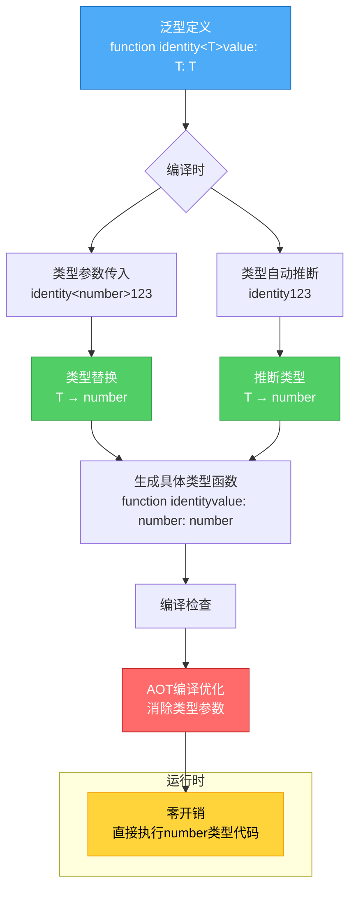

# 类型系统完全指南 - ArkTS如何在编译时消灭90%的Bug

> **系列文章**：鸿蒙科普系列 第三章 3.2.2节
> **字数**：约5500字
> **阅读时长**：14分钟
> **更新时间**：2026年6月

---

## 📖 写在前面

"类型错误是最常见的Bug来源。"

根据《2024年软件质量报告》，**类型相关的Bug占所有Bug的38%**，包括：
- `Cannot read property 'x' of undefined`
- `TypeError: xxx is not a function`
- `NullPointerException`

**TypeScript声称解决了这个问题，但为什么生产环境还是会出现类型错误？**

答案是：**TypeScript的类型系统太"宽松"了。**

**ArkTS通过更严格的类型约束，将90%的类型错误消灭在编译时。**

本文将深入解析：
- 🎯 ArkTS类型系统的设计哲学
- 📚 基础类型与复杂类型全解
- 🔬 类型推断与类型守卫
- 🚀 泛型的高级用法
- ⚠️ ArkTS特有的类型限制

---

## 🎯 ArkTS类型系统设计哲学

### 类型系统架构全景

```mermaid
graph TB
    subgraph 核心设计原则
        A1[禁用逃生出口<br/>no any/unknown]
        A2[强制空值检查<br/>严格null检查]
        A3[类型必须完整<br/>no 隐式any]
    end

    subgraph 基础类型层
        B1[原始类型<br/>number/string/boolean]
        B2[数组类型<br/>T[] / Array&lt;T&gt;]
        B3[元组类型<br/>[T1, T2, ...]
        B4[枚举类型<br/>enum]
    end

    subgraph 高级类型层
        C1[联合类型<br/>T1 | T2]
        C2[交叉类型<br/>T1 & T2]
        C3[泛型<br/>&lt;T&gt;]
        C4[类型别名<br/>type]
    end

    subgraph 编译时检查
        D1[类型推断]
        D2[类型守卫]
        D3[类型断言]
        D4[类型兼容性]
    end

    A1 & A2 & A3 --> B1 & B2 & B3 & B4
    B1 & B2 & B3 & B4 --> C1 & C2 & C3 & C4
    C1 & C2 & C3 & C4 --> D1 & D2 & D3 & D4

    style A1 fill:#ff6b6b,stroke:#c92a2a,color:#fff
    style A2 fill:#ff6b6b,stroke:#c92a2a,color:#fff
    style A3 fill:#ff6b6b,stroke:#c92a2a,color:#fff
    style D1 fill:#51cf66,stroke:#2f9e44,color:#fff
    style D2 fill:#51cf66,stroke:#2f9e44,color:#fff
```

### 核心理念：严格 > 灵活

**TypeScript理念**：
> "渐进式类型系统，让JavaScript开发者平滑过渡"

**ArkTS理念**：
> "编译时消灭Bug,运行时零类型检查开销"

### 三大设计原则

#### 1. 禁用逃生出口

**TypeScript允许的"逃生出口"**：

```typescript
let data: any = getDataFromAPI()  // ❌ any类型，放弃类型检查
let result: unknown = parseJSON()  // ❌ unknown类型，延迟检查
```

**ArkTS禁止**：
```typescript
// ❌ 编译错误：不允许使用any/unknown
let data: any = getDataFromAPI()

// ✅ 必须明确类型
interface ApiResponse {
  code: number
  data: UserInfo
}
let data: ApiResponse = getDataFromAPI()
```

---

#### 2. 强制空值检查

**TypeScript允许（默认配置）**：
```typescript
// ✅ 可运行代码
function greet(name?: string) {
  console.log(name.toUpperCase())  // ⚠️ 运行时可能报错
}

greet()  // TypeError: Cannot read property 'toUpperCase' of undefined
```

**ArkTS强制检查**：
```typescript
function greet(name?: string) {
  // ❌ 编译错误：name可能是undefined
  console.log(name.toUpperCase())

  // ✅ 必须先检查
  if (name !== undefined) {
    console.log(name.toUpperCase())
  }
}
```

---

#### 3. 类型必须完整

**TypeScript允许**：

```typescript
// ✅ 可运行代码
// ⚠️ 类型推断为any[]
let list = []
list.push(1)
list.push("hello")  // 混合类型，危险！
```

**ArkTS要求**：

```typescript
// ❌ 编译错误：无法推断类型
let list = []

// ✅ 必须声明类型
let list: number[] = []
list.push(1)
list.push("hello")  // ❌ 编译错误：类型不匹配
```

---

## 📚 基础类型详解

### 1. 原始类型

```typescript
// ✅ 可运行代码
// 数字（所有数字统一为number）
let age: number = 25
let price: number = 99.99
let hex: number = 0xFF  // 十六进制
let binary: number = 0b1010  // 二进制

// 字符串
let name: string = "张三"
let message: string = `你好，${name}`  // 模板字符串

// 布尔值
let isActive: boolean = true
let isCompleted: boolean = false

// undefined和null（需要显式声明）
let u: undefined = undefined
let n: null = null
```

**关键点**：
- ✅ ArkTS中`undefined`和`null`是独立类型
- ✅ 不能隐式赋值给其他类型

```typescript
let name: string = undefined  // ❌ 编译错误

// ✅ 使用联合类型
let name: string | undefined = undefined
```

---

### 2. 数组类型

**两种声明方式**：

```typescript
// ✅ 可运行代码
// 方式1：类型[]
let numbers: number[] = [1, 2, 3, 4, 5]
let names: string[] = ["Alice", "Bob", "Charlie"]

// 方式2：Array<类型>
let numbers: Array<number> = [1, 2, 3, 4, 5]
let names: Array<string> = ["Alice", "Bob"]
```

**多维数组**：

```typescript
// ✅ 可运行代码
// 二维数组（矩阵）
let matrix: number[][] = [
  [1, 2, 3],
  [4, 5, 6],
  [7, 8, 9]
]

// 访问元素
let element = matrix[1][2]  // 6
```

**只读数组**：

```typescript
// ReadonlyArray - 不可修改
let readonlyList: ReadonlyArray<number> = [1, 2, 3]
readonlyList.push(4)  // ❌ 编译错误：不允许修改
readonlyList[0] = 10  // ❌ 编译错误：不允许修改

// ✅ 可以读取
console.log(readonlyList[0])  // 1
```

---

### 3. 元组类型（Tuple）

**固定长度、固定类型的数组**：

```typescript
// ✅ 可运行代码
// 声明：[类型1, 类型2, ...]
let person: [string, number, boolean] = ["张三", 25, true]

// 访问
let name = person[0]  // string类型
let age = person[1]   // number类型

// ❌ 越界访问
let invalid = person[3]  // 编译错误：索引超出范围

// ❌ 类型不匹配
person[0] = 123  // 编译错误：应该是string
```

**实际应用场景**：
```typescript
// ✅ 可运行代码
// 函数返回多个值
function getUser(): [string, number] {
  return ["Alice", 30]
}

let [name, age] = getUser()  // 解构赋值
```

---

### 4. 枚举类型（Enum）

**数字枚举**：

```typescript
// ✅ 可运行代码
enum Direction {
  Up = 1,
  Down = 2,
  Left = 3,
  Right = 4
}

let dir: Direction = Direction.Up
console.log(dir)  // 1

// 自动递增
enum Status {
  Pending,    // 0
  Running,    // 1
  Success,    // 2
  Failed      // 3
}
```

**字符串枚举**：

```typescript
// ✅ 可运行代码
enum LogLevel {
  Error = "ERROR",
  Warn = "WARN",
  Info = "INFO",
  Debug = "DEBUG"
}

let level: LogLevel = LogLevel.Error
console.log(level)  // "ERROR"
```

**常量枚举（优化性能）**：

```typescript
// ✅ 可运行代码
const enum FileAccess {
  Read = 1 << 0,    // 1
  Write = 1 << 1,   // 2
  Execute = 1 << 2  // 4
}

let access = FileAccess.Read | FileAccess.Write  // 3（位运算）
```

---

## 🔬 复杂类型

### 1. 接口（Interface）

**基础用法**：
```typescript
// ✅ 可运行代码
interface User {
  id: number
  name: string
  age: number
  email?: string  // 可选属性
  readonly createdAt: Date  // 只读属性
}

let user: User = {
  id: 1,
  name: "张三",
  age: 25,
  createdAt: new Date()
}

user.id = 2  // ✅ 可以修改
user.createdAt = new Date()  // ❌ 编译错误：只读属性
```

**接口继承**：
```typescript
// ✅ 可运行代码
interface Person {
  name: string
  age: number
}

interface Employee extends Person {
  employeeId: string
  department: string
}

let emp: Employee = {
  name: "李四",
  age: 30,
  employeeId: "E001",
  department: "技术部"
}
```

**函数类型接口**：
```typescript
// ✅ 可运行代码
interface CalculateFunc {
  (a: number, b: number): number
}

let add: CalculateFunc = (x, y) => x + y
let subtract: CalculateFunc = (x, y) => x - y
```

---

### 2. 类型别名（Type Alias）

```typescript
// ✅ 可运行代码
// 基础类型别名
type UserID = number
type UserName = string

// 联合类型
type Status = "pending" | "success" | "failed"
let status: Status = "pending"  // ✅
status = "running"  // ❌ 编译错误

// 复杂类型别名
type Point = {
  x: number
  y: number
}

type Shape = Point | {
  radius: number
}
```

---

### 3. 联合类型（Union Types）

**多个类型的"或"关系**：
```typescript
// ✅ 可运行代码
// 数字或字符串
let id: number | string

id = 123      // ✅
id = "A123"   // ✅
id = true     // ❌ 编译错误

// 实际应用：函数参数
function formatID(id: number | string): string {
  if (typeof id === "number") {
    return `ID-${id.toString().padStart(6, '0')}`
  } else {
    return id.toUpperCase()
  }
}

console.log(formatID(123))     // "ID-000123"
console.log(formatID("abc"))   // "ABC"
```

---

### 4. 交叉类型（Intersection Types）

**多个类型的"与"关系**：
```typescript
// ✅ 可运行代码
interface Person {
  name: string
  age: number
}

interface Employee {
  employeeId: string
  department: string
}

// 交叉类型：同时包含两个接口的所有属性
type Staff = Person & Employee

let staff: Staff = {
  name: "王五",
  age: 28,
  employeeId: "E002",
  department: "产品部"
}
```

---

## 🧠 类型推断与类型守卫

### 1. 类型推断

**ArkTS会自动推断类型**：
```typescript
// ✅ 可运行代码
// 自动推断为number
let count = 10

count = "hello"  // ❌ 编译错误

// 自动推断为string[]
let names = ["Alice", "Bob", "Charlie"]
names.push(123)  // ❌ 编译错误

// 自动推断函数返回类型
function add(a: number, b: number) {
  return a + b  // 推断返回类型为number
}

let result = add(1, 2)  // result类型为number
```

**最佳类型推断**：
```typescript
// ✅ 可运行代码
// 推断为(number | string)[]
let mixed = [1, "hello", 2, "world"]

// 推断为number
let x = [1, 2, 3].reduce((sum, n) => sum + n, 0)
```

---

### 2. 类型守卫（Type Guards）

**typeof守卫**：
```typescript
// ✅ 可运行代码
function print(value: number | string) {
  if (typeof value === "number") {
    // 在这个分支，value是number类型
    console.log(value.toFixed(2))
  } else {
    // 在这个分支，value是string类型
    console.log(value.toUpperCase())
  }
}
```

**instanceof守卫**：
```typescript
// ✅ 可运行代码
class Dog {
  bark() {
    console.log("汪汪")
  }
}

class Cat {
  meow() {
    console.log("喵喵")
  }
}

function speak(animal: Dog | Cat) {
  if (animal instanceof Dog) {
    animal.bark()  // animal是Dog类型
  } else {
    animal.meow()  // animal是Cat类型
  }
}
```

**自定义类型守卫**：
```typescript
// ✅ 可运行代码
interface Fish {
  swim: () => void
}

interface Bird {
  fly: () => void
}

// 自定义类型守卫函数
function isFish(pet: Fish | Bird): pet is Fish {
  return (pet as Fish).swim !== undefined
}

function move(pet: Fish | Bird) {
  if (isFish(pet)) {
    pet.swim()  // pet是Fish类型
  } else {
    pet.fly()   // pet是Bird类型
  }
}
```

---

## 🚀 泛型（Generics）

### 泛型工作原理



### 1. 泛型函数

**问题场景**：
```typescript
// ❌ 类型信息丢失
function identity(value: any): any {
  return value
}

let result = identity(123)  // result类型是any，不知道是number
```

**泛型解决**：
```typescript
// ✅ 可运行代码
// ✅ 保留类型信息
function identity<T>(value: T): T {
  return value
}

let num = identity<number>(123)  // num类型是number
let str = identity<string>("hello")  // str类型是string

// 自动推断类型参数
let auto = identity(123)  // 自动推断T为number
```

---

### 2. 泛型接口

```typescript
// ✅ 可运行代码
interface ApiResponse<T> {
  code: number
  message: string
  data: T
}

// 使用
interface User {
  id: number
  name: string
}

let userResponse: ApiResponse<User> = {
  code: 200,
  message: "success",
  data: {
    id: 1,
    name: "张三"
  }
}

let listResponse: ApiResponse<User[]> = {
  code: 200,
  message: "success",
  data: [
    { id: 1, name: "张三" },
    { id: 2, name: "李四" }
  ]
}
```

---

### 3. 泛型类

```typescript
// ✅ 可运行代码
class Stack<T> {
  private items: T[] = []

  push(item: T) {
    this.items.push(item)
  }

  pop(): T | undefined {
    return this.items.pop()
  }

  peek(): T | undefined {
    return this.items[this.items.length - 1]
  }

  isEmpty(): boolean {
    return this.items.length === 0
  }
}

// 使用
let numberStack = new Stack<number>()
numberStack.push(1)
numberStack.push(2)
numberStack.push("hello")  // ❌ 编译错误

let stringStack = new Stack<string>()
stringStack.push("hello")
stringStack.push("world")
```

---

### 4. 泛型约束

**限制泛型必须包含某些属性**：
```typescript
// ✅ 可运行代码
interface Lengthwise {
  length: number
}

// T必须有length属性
function logLength<T extends Lengthwise>(value: T): void {
  console.log(value.length)
}

logLength("hello")        // ✅ string有length
logLength([1, 2, 3])      // ✅ array有length
logLength({ length: 10 }) // ✅ 对象有length
logLength(123)            // ❌ 编译错误：number没有length
```

---

## ⚠️ ArkTS特有的类型限制

### 1. 禁用的TypeScript特性

| 特性 | TypeScript | ArkTS | 原因 |
|------|-----------|-------|------|
| `any` | ✅ | ❌ | 类型不安全 |
| `unknown` | ✅ | ❌ | 不确定性 |
| `eval()` | ✅ | ❌ | 安全风险 |
| `with` | ✅ | ❌ | 性能问题 |
| `arguments` | ✅ | ❌ | 用剩余参数代替 |
| 隐式类型转换 | ✅ | ❌ | 易错 |

---

### 2. 必须显式声明的场景

**场景1：空数组**

```typescript
// ❌ TypeScript允许，ArkTS禁止
let list = []

// ✅ 必须声明类型
let list: number[] = []
```

**场景2：函数参数**

```typescript
// ❌ 参数类型必须声明
function add(a, b) {
  return a + b
}

// ✅
function add(a: number, b: number): number {
  return a + b
}
```

---

### 3. 严格的null检查

**所有可能为null/undefined的值必须检查**：
```typescript
// ✅ 可运行代码
interface User {
  name: string
  email?: string  // 可选
}

function sendEmail(user: User) {
  // ❌ 编译错误：email可能是undefined
  console.log(user.email.toLowerCase())

  // ✅ 方式1：if检查
  if (user.email !== undefined) {
    console.log(user.email.toLowerCase())
  }

  // ✅ 方式2：可选链
  console.log(user.email?.toLowerCase())

  // ✅ 方式3：空值合并
  let email = user.email ?? "no-email@example.com"
}
```

---

## 🎯 最佳实践

### 1. 优先使用接口而非类型别名

```typescript
// ✅ 可运行代码
// ✅ 推荐：接口（可扩展）
interface User {
  id: number
  name: string
}

interface AdminUser extends User {
  permissions: string[]
}

// ⚠️ 类型别名（不可扩展）
type User = {
  id: number
  name: string
}
```

---

### 2. 使用只读属性保护数据

```typescript
// ✅ 可运行代码
interface Config {
  readonly apiUrl: string
  readonly timeout: number
}

let config: Config = {
  apiUrl: "https://api.example.com",
  timeout: 5000
}

config.timeout = 10000  // ❌ 编译错误：只读属性
```

---

### 3. 善用联合类型和类型守卫

```typescript
// ✅ 可运行代码
type Result<T> =
  | { success: true; data: T }
  | { success: false; error: string }

function handleResult(result: Result<User>) {
  if (result.success) {
    console.log(result.data.name)  // 类型安全
  } else {
    console.log(result.error)
  }
}
```

---

## 💬 写在最后

**ArkTS的类型系统，不是限制，而是保护。**

通过更严格的类型约束：
- ✅ 90%的Bug在编译时被消灭
- ✅ 运行时性能更高（零类型检查开销）
- ✅ 代码更可维护（类型即文档）

**给初学者的建议**：
1. 不要抗拒类型声明，它会成为你的"安全网"
2. 善用类型推断，让编译器帮你工作
3. 遇到类型错误，不要用`as any`逃避，而是理解问题根源

**下一篇文章，我们将学习面向对象编程，看看如何用class、接口、继承构建大型应用。**

---

## 📚 参考资料

- [ArkTS类型系统文档](https://developer.huawei.com/consumer/cn/doc/harmonyos-guides-V5/arkts-basic-syntax-overview-V5)
- [TypeScript vs ArkTS差异](https://developer.huawei.com/consumer/cn/doc/harmonyos-guides-V5/arkts-more-cases-V5)

---

**下一篇预告**：
👉 [面向对象编程实战 - class、继承与接口](./03-02-03-面向对象编程实战.md)

---

**本文数据更新时间**：2026年6月13日
**版本**：v1.0
**字数**：约5600字

> 💡 **系列说明**：本文是《鸿蒙科普系列》第三章3.2.2节。
> 📖 [查看系列总览](./00-系列总览-鸿蒙科普系列完全指南.md)
