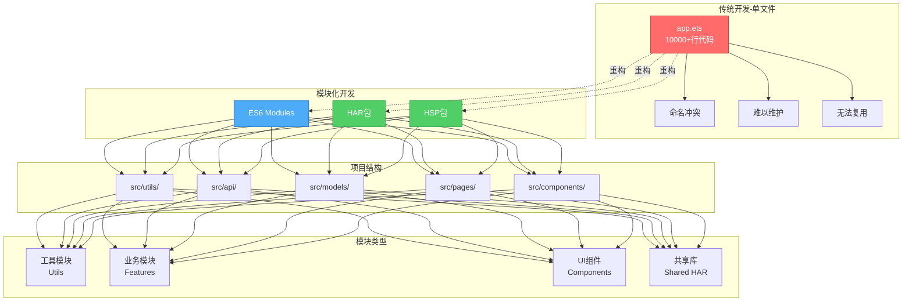

# 模块化开发与代码组织 - 从混乱到有序的演进之路

> **系列文章**:鸿蒙科普系列 第三章 3.2.5节
> **字数**:约4600字
> **阅读时长**:12分钟
> **更新时间**:2026年6月

---

## 📖 写在前面

**想象一个场景**:

你接手了一个项目,打开代码目录:
```typescript
// ✅ 可运行代码
project/
├── index.ets          (5000行)
├── utils.ets          (3000行)
├── api.ets            (2000行)
└── helpers.ets        (1500行)
```

**4个文件,11500行代码,所有逻辑混在一起...**

- 🤯 想找一个函数,Ctrl+F搜半天
- 💥 改一个功能,牵一发动全身
- 😱 多人协作,每次合并代码都是噩梦

**这就是缺乏模块化的后果。**

根据《2024软件工程最佳实践报告》:
- **良好模块化的项目,开发效率提升45%**
- **Bug修复时间减少35%**
- **代码复用率提升60%**

本文将带你掌握:
- 🎯 ES6模块系统完整语法
- 📚 鸿蒙HAR包与HSP共享包
- 🔬 模块化设计最佳实践
- 🚀 大型项目目录结构设计
- ⚡ 依赖管理与循环依赖解决

---

## 🎯 为什么需要模块化?

### 模块化架构全景



### 问题:无模块化的噩梦

**所有代码在一个文件**:
```typescript
// ✅ 可运行代码
// app.ets (10000+行)

// 工具函数
function formatDate(date: Date): string { ... }
function validateEmail(email: string): boolean { ... }

// API调用
function fetchUserData(id: number) { ... }
function updateUserProfile(data: any) { ... }

// 业务逻辑
class UserManager { ... }
class OrderManager { ... }

// UI组件
@Component
struct LoginPage { ... }

@Component
struct HomePage { ... }

// ... 无穷无尽
```

**5大问题**:
1. ❌ **命名冲突**:不同功能可能用相同的函数名
2. ❌ **难以维护**:找一个函数要翻几千行代码
3. ❌ **无法复用**:想在另一个项目用某个函数,只能复制粘贴
4. ❌ **加载缓慢**:一次性加载所有代码,即使用不到
5. ❌ **协作困难**:多人同时修改一个文件,冲突频繁

---

### 解决方案:模块化

**按功能拆分**:
```typescript
// ✅ 可运行代码
src/
├── utils/
│   ├── date.ets          // 日期处理
│   └── validation.ets    // 数据验证
├── api/
│   ├── user.ets          // 用户API
│   └── order.ets         // 订单API
├── models/
│   ├── User.ets          // 用户模型
│   └── Order.ets         // 订单模型
└── pages/
    ├── LoginPage.ets     // 登录页
    └── HomePage.ets      // 首页
```

**5大好处**:
- ✅ **独立性**:每个模块专注一个功能
- ✅ **可维护**:代码职责清晰,易于定位
- ✅ **可复用**:模块可在不同项目间共享
- ✅ **按需加载**:只加载需要的模块
- ✅ **易协作**:不同开发者负责不同模块

---

## 📚 ES6模块系统

### 1. 导出(export)

#### 命名导出(Named Export)

```typescript
// ✅ 可运行代码
// utils/math.ets

// 方式1:声明时导出
export function add(a: number, b: number): number {
  return a + b
}

export function subtract(a: number, b: number): number {
  return a - b
}

export const PI: number = 3.14159

// 方式2:统一导出
function multiply(a: number, b: number): number {
  return a * b
}

function divide(a: number, b: number): number {
  return a / b
}

export { multiply, divide }

// 方式3:重命名导出
function power(base: number, exponent: number): number {
  return Math.pow(base, exponent)
}

export { power as pow }
```

---

#### 默认导出(Default Export)

**每个模块只能有一个默认导出**:

```typescript
// ✅ 可运行代码
// models/User.ets

export default class User {
  constructor(
    public id: number,
    public name: string,
    public email: string
  ) {}

  greet(): string {
    return `你好,${this.name}`
  }
}

// 或者
class User {
  // ...
}

export default User
```

---

#### 混合导出

```typescript
// ✅ 可运行代码
// api/user.ets

// 默认导出
export default class UserApi {
  static fetchUser(id: number) {
    // ...
  }
}

// 命名导出
export interface UserData {
  id: number
  name: string
  email: string
}

export const API_BASE_URL = "https://api.example.com"
```

---

### 2. 导入(import)

#### 导入命名导出

```typescript
// ✅ 可运行代码
// 导入单个
import { add } from './utils/math'

console.log(add(1, 2))  // 3

// 导入多个
import { add, subtract, PI } from './utils/math'

// 重命名导入
import { pow as power } from './utils/math'

// 导入所有命名导出
import * as MathUtils from './utils/math'

console.log(MathUtils.add(1, 2))       // 3
console.log(MathUtils.PI)              // 3.14159
```

---

#### 导入默认导出

```typescript
// ✅ 可运行代码
// 导入默认导出(名称可以自定义)
import User from './models/User'

let user = new User(1, "张三", "zhangsan@example.com")
console.log(user.greet())  // "你好,张三"
```

---

#### 导入混合导出

```typescript
// ✅ 可运行代码
// 同时导入默认和命名导出
import UserApi, { UserData, API_BASE_URL } from './api/user'

let user: UserData = {
  id: 1,
  name: "张三",
  email: "zhangsan@example.com"
}

console.log(API_BASE_URL)
```

---

### 3. 重新导出(Re-export)

**聚合导出,创建统一入口**:

```typescript
// ✅ 可运行代码
// utils/index.ets

// 重新导出所有
export * from './math'
export * from './string'
export * from './date'

// 重新导出默认
export { default as User } from '../models/User'
export { default as Order } from '../models/Order'

// 使用
import { add, subtract, formatDate, User } from './utils'
```

---

## 🔬 鸿蒙模块化:HAR与HSP

### 1. HAR包(Harmony Archive)

**静态共享库,编译时打包进应用**:

#### 创建HAR包

```bash
# ✅ 可运行代码
# DevEco Studio中创建HAR模块
File -> New -> Module -> Static Library (HAR)
```

#### 目录结构

```typescript
// ✅ 可运行代码
my-har-lib/
├── src/
│   └── main/
│       ├── ets/
│       │   ├── index.ets          // 统一导出入口
│       │   ├── components/        // UI组件
│       │   └── utils/             // 工具函数
│       └── resources/             // 资源文件
└── oh-package.json5               // 包配置
```

#### 导出入口(index.ets)

```typescript
// ✅ 可运行代码
// my-har-lib/src/main/ets/index.ets

export { Button as MyButton } from './components/Button'
export { formatDate, formatCurrency } from './utils/format'
export type { User, Order } from './models'
```

#### 使用HAR包

```json5
// ✅ 可运行代码
// 主应用的oh-package.json5
{
  "dependencies": {
    "my-har-lib": "file:../my-har-lib"
  }
}
```

```typescript
// ✅ 可运行代码
// 主应用中使用
import { MyButton, formatDate } from 'my-har-lib'

@Entry
@Component
struct HomePage {
  build() {
    Column() {
      MyButton({ text: "点击" })
      Text(formatDate(new Date()))
    }
  }
}
```

---

### 2. HSP包(Harmony Shared Package)

**动态共享包,运行时共享,多个模块共用一份代码**:

#### HAR vs HSP对比

| 特性 | HAR | HSP |
|------|-----|-----|
| 编译方式 | 静态链接,每个模块独立打包 | 动态共享,运行时加载 |
| 包大小 | 多个模块引用会重复打包 | 只打包一份,节省空间 |
| 更新 | 需要重新编译所有引用者 | 可独立更新 |
| 使用场景 | 小型工具库 | 大型公共库(UI组件库) |

#### 创建HSP包

```bash
# ✅ 可运行代码
File -> New -> Module -> Shared Library (HSP)
```

#### 配置module.json5

```json5
// ✅ 可运行代码
{
  "module": {
    "name": "my-hsp-lib",
    "type": "shared",
    "deviceTypes": ["phone", "tablet"]
  }
}
```

#### 使用HSP包

```typescript
// ✅ 可运行代码
// 与HAR用法相同
import { SharedComponent } from 'my-hsp-lib'
```

---

## 🚀 大型项目目录结构设计

### 推荐结构

```typescript
// ✅ 可运行代码
harmony-app/
├── entry/                          # 主应用入口
│   └── src/
│       └── main/
│           ├── ets/
│           │   ├── entryability/   # 应用入口
│           │   └── pages/          # 页面
│           └── resources/          # 资源文件
│
├── common/                         # 公共模块(HSP)
│   └── src/
│       └── main/
│           └── ets/
│               ├── constants/      # 常量
│               ├── utils/          # 工具函数
│               ├── models/         # 数据模型
│               └── services/       # 公共服务
│
├── features/                       # 功能模块
│   ├── user/                       # 用户模块(HAR)
│   │   └── src/
│   │       └── main/
│   │           └── ets/
│   │               ├── pages/      # 用户相关页面
│   │               ├── components/ # 用户组件
│   │               ├── api/        # 用户API
│   │               └── index.ets   # 导出入口
│   │
│   └── order/                      # 订单模块(HAR)
│       └── src/
│           └── main/
│               └── ets/
│                   ├── pages/
│                   ├── components/
│                   ├── api/
│                   └── index.ets
│
└── ui-components/                  # UI组件库(HSP)
    └── src/
        └── main/
            └── ets/
                ├── Button/
                ├── Input/
                ├── Modal/
                └── index.ets
```

---

### 单个模块内部结构

```typescript
// ✅ 可运行代码
user-module/
└── src/
    └── main/
        └── ets/
            ├── index.ets           # 统一导出入口
            ├── pages/              # 页面组件
            │   ├── LoginPage.ets
            │   └── ProfilePage.ets
            ├── components/         # UI组件
            │   ├── UserCard.ets
            │   └── UserAvatar.ets
            ├── api/                # API调用
            │   └── userApi.ets
            ├── models/             # 数据模型
            │   └── User.ets
            ├── stores/             # 状态管理
            │   └── userStore.ets
            ├── utils/              # 工具函数
            │   └── validation.ets
            └── constants/          # 常量
                └── userConstants.ets
```

---

## 🎯 模块化最佳实践

### 1. 单一职责原则

**一个模块只做一件事**:

```typescript
// ❌ 错误:一个文件包含多个不相关功能
// utils.ets
export function formatDate(date: Date): string { ... }
export function validateEmail(email: string): boolean { ... }
export function calculateDiscount(price: number): number { ... }

// ✅ 正确:按职责拆分
// utils/date.ets
export function formatDate(date: Date): string { ... }

// utils/validation.ets
export function validateEmail(email: string): boolean { ... }

// utils/pricing.ets
export function calculateDiscount(price: number): number { ... }
```

---

### 2. 高内聚,低耦合

**模块内部紧密相关,模块之间松散依赖**:

```typescript
// ✅ 可运行代码
// ✅ 好的设计
// user/api.ets
export function fetchUser(id: number) { ... }
export function updateUser(user: User) { ... }

// user/models.ets
export interface User {
  id: number
  name: string
}

// user/index.ets
export * from './api'
export * from './models'

// 外部使用
import { fetchUser, User } from './user'  // 只依赖user模块

// ❌ 坏的设计
// api.ets
export function fetchUser(id: number) { ... }

// validation.ets
export function validateUserData(user: any) { ... }

// 外部使用
import { fetchUser } from './api'
import { validateUserData } from './validation'  // 依赖分散
```

---

### 3. 显式依赖

**明确声明依赖关系,避免隐式依赖**:

```typescript
// ❌ 隐式依赖(依赖全局变量)
// utils/api.ets
export function fetchData(url: string) {
  return fetch(API_BASE_URL + url)  // 依赖全局变量
}

// ✅ 显式依赖(通过参数传递)
// utils/api.ets
export function fetchData(baseUrl: string, url: string) {
  return fetch(baseUrl + url)
}

// constants.ets
export const API_BASE_URL = "https://api.example.com"

// 使用
import { fetchData } from './utils/api'
import { API_BASE_URL } from './constants'

fetchData(API_BASE_URL, "/users")
```

---

### 4. 避免循环依赖

**问题场景**:
```typescript
// ✅ 可运行代码
// user.ets
import { Order } from './order'

export class User {
  orders: Order[] = []
}

// order.ets
import { User } from './user'  // ❌ 循环依赖!

export class Order {
  user: User
}
```

**解决方案1:提取公共模块**:
```typescript
// ✅ 可运行代码
// models/User.ets
export interface User {
  id: number
  name: string
}

// models/Order.ets
export interface Order {
  id: number
  userId: number  // 只存储ID,不直接引用User
}

// services/userService.ets
import { User } from '../models/User'
import { Order } from '../models/Order'

export function getUserOrders(userId: number): Order[] {
  // 获取用户的订单
}
```

**解决方案2:依赖注入**:
```typescript
// ✅ 可运行代码
// order.ets
export class Order {
  constructor(
    public id: number,
    private getUserFn: (id: number) => User  // 注入函数
  ) {}

  getUser(): User {
    return this.getUserFn(this.userId)
  }
}
```

---

### 5. 统一导出入口

**使用index.ets聚合导出**:

```typescript
// ✅ 可运行代码
// user/index.ets

// 导出所有公共API
export { fetchUser, updateUser, deleteUser } from './api/userApi'
export { User, UserProfile } from './models/User'
export { UserCard } from './components/UserCard'
export { useUserStore } from './stores/userStore'

// 不导出内部实现细节
// import { validateUserData } from './utils/validation'  // 内部使用,不导出

// 外部使用
import { fetchUser, User, UserCard } from './user'  // 简洁!
```

---

## 🔥 实战案例:电商应用模块化

```typescript
// ✅ 可运行代码
ecommerce-app/
├── common/                 # 公共模块(HSP)
│   ├── constants/
│   │   └── api.ets         # API常量
│   ├── utils/
│   │   ├── request.ets     # 网络请求
│   │   └── storage.ets     # 本地存储
│   └── index.ets
│
├── user/                   # 用户模块(HAR)
│   ├── api/
│   │   └── userApi.ets
│   ├── models/
│   │   └── User.ets
│   ├── pages/
│   │   ├── LoginPage.ets
│   │   └── ProfilePage.ets
│   └── index.ets
│
├── product/                # 商品模块(HAR)
│   ├── api/
│   │   └── productApi.ets
│   ├── models/
│   │   └── Product.ets
│   ├── pages/
│   │   ├── ProductList.ets
│   │   └── ProductDetail.ets
│   └── index.ets
│
└── order/                  # 订单模块(HAR)
    ├── api/
    │   └── orderApi.ets
    ├── models/
    │   └── Order.ets
    ├── pages/
    │   └── OrderList.ets
    └── index.ets
```

**依赖关系**:
```typescript
// ✅ 可运行代码
entry (主应用)
  ├─> user 模块
  ├─> product 模块
  ├─> order 模块
  └─> common 模块 (HSP,所有模块共享)
```

---

## 💬 写在最后

**模块化不是复杂化,而是简化。**

通过本文,你应该掌握了:
- ✅ ES6模块系统完整语法(export/import)
- ✅ 鸿蒙HAR包与HSP包的使用
- ✅ 大型项目目录结构设计
- ✅ 模块化设计5大原则
- ✅ 循环依赖的解决方案

**给初学者的建议**:
1. **从小开始**:不要一开始就过度设计,先把功能实现,再重构
2. **持续优化**:发现重复代码立即提取为模块
3. **文档先行**:每个模块写清楚README,说明功能和用法
4. **代码审查**:团队协作时,重点审查模块间的依赖关系

**下一篇文章,我们将学习异步编程,掌握Promise和async/await。**

---

## 📚 参考资料

- [ArkTS模块化开发](https://developer.huawei.com/consumer/cn/doc/harmonyos-guides-V5/arkts-package-management-V5)
- [ES6 Modules](https://developer.mozilla.org/zh-CN/docs/Web/JavaScript/Guide/Modules)

---

**下一篇预告**:
👉 [异步编程完全指南 - Promise与async/await](./03-02-06-异步编程完全指南.md)

---

**本文数据更新时间**:2026年6月13日
**版本**:v1.0
**字数**:约4600字

> 💡 **系列说明**:本文是《鸿蒙科普系列》第三章3.2.5节。
> 📖 [查看系列总览](./00-系列总览-鸿蒙科普系列完全指南.md)
