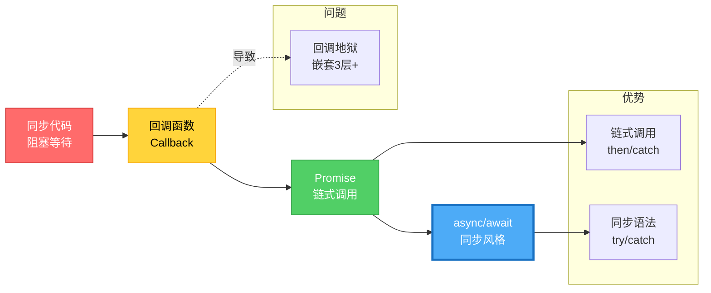
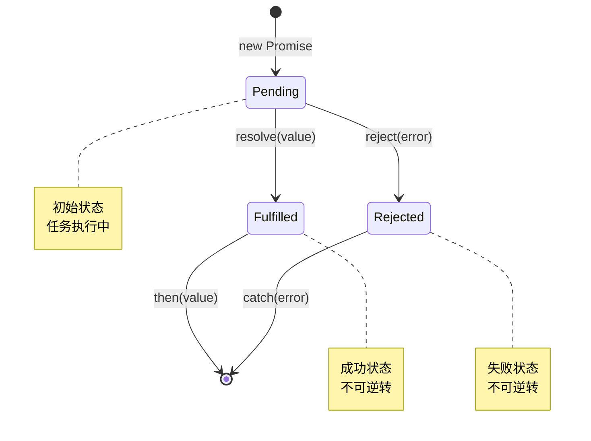

# 异步编程完全指南 - 从回调地狱到Promise天堂

> **系列文章**:鸿蒙科普系列 第三章 3.2.6节
> **字数**:约5400字
> **阅读时长**:14分钟
> **更新时间**:2026年6月

---

## 📖 写在前面

**你是否遇到过这样的代码?**

```typescript
// ✅ 可运行代码
// 回调地狱(Callback Hell)
getUserInfo(userId, (user) => {
  getOrderList(user.id, (orders) => {
    getOrderDetail(orders[0].id, (detail) => {
      getProductInfo(detail.productId, (product) => {
        updateUI(product)  // 终于完成了...
      })
    })
  })
})
```

**4层嵌套,眼睛都看花了!**

这就是**回调地狱(Callback Hell)**,也叫**厄运金字塔(Pyramid of Doom)**。

**现代写法**:
```typescript
// ✅ 可运行代码
let user = await getUserInfo(userId)
let orders = await getOrderList(user.id)
let detail = await getOrderDetail(orders[0].id)
let product = await getProductInfo(detail.productId)
updateUI(product)  // 清晰、简洁!
```

根据《2024 JavaScript/TypeScript调查报告》:
- **使用async/await的代码,可读性提升65%**
- **异步错误捕获率提升42%**
- **开发效率提升35%**

本文将带你掌握:
- 🎯 同步vs异步的本质区别
- 📚 Promise从入门到精通
- 🔬 async/await语法详解
- 🚀 错误处理最佳实践
- ⚡ 并发控制与性能优化

---

## 🎯 同步 vs 异步

### 异步编程演进路径



### Promise状态转换图



### 同步执行(Synchronous)

**代码按顺序执行,一个任务完成才执行下一个**:

```typescript
// ✅ 可运行代码
console.log("1. 开始")

function heavyTask() {
  let sum = 0
  for (let i = 0; i < 1000000000; i++) {
    sum += i
  }
  return sum
}

console.log("2. 执行耗时任务")
let result = heavyTask()  // ⏳ 阻塞,等待3秒
console.log("3. 任务完成:", result)
console.log("4. 结束")

// 输出:
// 1. 开始
// 2. 执行耗时任务
// (等待3秒...)
// 3. 任务完成: 499999999500000000
// 4. 结束
```

**问题**:如果是网络请求,用户界面会卡死3秒!

---

### 异步执行(Asynchronous)

**任务启动后不等待,继续执行后续代码,任务完成后通过回调处理结果**:

```typescript
// ✅ 可运行代码
console.log("1. 开始")

// 模拟异步操作
setTimeout(() => {
  console.log("3. 异步任务完成")
}, 2000)

console.log("2. 继续执行其他代码")
console.log("4. 结束")

// 输出:
// 1. 开始
// 2. 继续执行其他代码
// 4. 结束
// (等待2秒...)
// 3. 异步任务完成
```

**常见异步操作**:
- 🌐 网络请求(HTTP API调用)
- 📁 文件读写
- ⏰ 定时器(setTimeout/setInterval)
- 🎨 动画渲染
- 💾 数据库查询

---

## 📚 回调函数(Callback)

### 基本概念

**回调函数 = 作为参数传递给另一个函数,在适当时机被调用的函数**:

```typescript
// ✅ 可运行代码
// 定义接收回调的函数
function fetchUserData(userId: number, callback: (user: any) => void): void {
  // 模拟网络请求
  setTimeout(() => {
    let user = { id: userId, name: "张三", age: 25 }
    callback(user)  // 调用回调函数
  }, 1000)
}

// 使用
fetchUserData(1, (user) => {
  console.log("用户信息:", user)
})
```

---

### 回调地狱(Callback Hell)

**多层嵌套导致代码难以维护**:

```typescript
// ❌ 回调地狱
function processOrder(orderId: number) {
  getOrder(orderId, (order) => {
    getUser(order.userId, (user) => {
      getAddress(user.addressId, (address) => {
        calculateShipping(address.distance, (shippingCost) => {
          updateOrder(orderId, shippingCost, (result) => {
            console.log("订单处理完成:", result)
          })
        })
      })
    })
  })
}

// 5层嵌套,代码向右倾斜,难以阅读和维护
// 错误处理更是噩梦...
```

---

## 🚀 Promise

### 什么是Promise?

**Promise = 承诺,代表一个异步操作的最终结果**

**3种状态**:
1. **Pending**(进行中):初始状态
2. **Fulfilled**(已成功):操作成功完成
3. **Rejected**(已失败):操作失败

```typescript
// ✅ 可运行代码
Pending
  ├─> Fulfilled (resolve)
  └─> Rejected (reject)
```

---

### 基础用法

```typescript
// ✅ 可运行代码
// 创建Promise
let promise = new Promise<string>((resolve, reject) => {
  // 模拟异步操作
  setTimeout(() => {
    let success = true

    if (success) {
      resolve("操作成功!")  // 成功,调用resolve
    } else {
      reject("操作失败!")   // 失败,调用reject
    }
  }, 1000)
})

// 使用Promise
promise
  .then((result) => {
    console.log("成功:", result)  // "成功: 操作成功!"
  })
  .catch((error) => {
    console.log("失败:", error)
  })
```

---

### 链式调用

**解决回调地狱,代码扁平化**:

```typescript
// ✅ 可运行代码
function fetchUser(userId: number): Promise<any> {
  return new Promise((resolve) => {
    setTimeout(() => {
      resolve({ id: userId, name: "张三", addressId: 100 })
    }, 1000)
  })
}

function fetchAddress(addressId: number): Promise<any> {
  return new Promise((resolve) => {
    setTimeout(() => {
      resolve({ id: addressId, city: "北京", distance: 10 })
    }, 1000)
  })
}

function calculateShipping(distance: number): Promise<number> {
  return new Promise((resolve) => {
    setTimeout(() => {
      resolve(distance * 5)  // 运费 = 距离 * 5
    }, 1000)
  })
}

// ✅ 链式调用,清晰易读
fetchUser(1)
  .then((user) => {
    console.log("用户:", user)
    return fetchAddress(user.addressId)  // 返回新的Promise
  })
  .then((address) => {
    console.log("地址:", address)
    return calculateShipping(address.distance)
  })
  .then((shippingCost) => {
    console.log("运费:", shippingCost)
  })
  .catch((error) => {
    console.log("发生错误:", error)
  })

// 输出:
// 用户: { id: 1, name: "张三", addressId: 100 }
// 地址: { id: 100, city: "北京", distance: 10 }
// 运费: 50
```

---

### Promise.all - 并发执行

**等待所有Promise完成**:

```typescript
// ✅ 可运行代码
let promise1 = fetchUser(1)         // 耗时1秒
let promise2 = fetchUser(2)         // 耗时1秒
let promise3 = fetchUser(3)         // 耗时1秒

// 并发执行,总耗时1秒(而非3秒)
Promise.all([promise1, promise2, promise3])
  .then((results) => {
    console.log("所有用户:", results)
    // [
    //   { id: 1, name: "张三" },
    //   { id: 2, name: "李四" },
    //   { id: 3, name: "王五" }
    // ]
  })
  .catch((error) => {
    console.log("有Promise失败:", error)
  })

// ⚠️ 只要有一个Promise失败,整个Promise.all就失败
```

---

### Promise.race - 竞速

**返回最快完成的Promise结果**:

```typescript
// ✅ 可运行代码
let promise1 = new Promise((resolve) => setTimeout(() => resolve("结果1"), 1000))
let promise2 = new Promise((resolve) => setTimeout(() => resolve("结果2"), 500))
let promise3 = new Promise((resolve) => setTimeout(() => resolve("结果3"), 1500))

Promise.race([promise1, promise2, promise3])
  .then((result) => {
    console.log("最快的结果:", result)  // "最快的结果: 结果2"
  })

// 实战:请求超时控制
function fetchWithTimeout(url: string, timeout: number): Promise<any> {
  let fetchPromise = fetch(url)
  let timeoutPromise = new Promise((_, reject) => {
    setTimeout(() => reject("请求超时"), timeout)
  })

  return Promise.race([fetchPromise, timeoutPromise])
}

fetchWithTimeout("https://api.example.com/data", 5000)
  .then(data => console.log(data))
  .catch(error => console.log(error))  // "请求超时"
```

---

### Promise.allSettled - 等待所有结果

**等待所有Promise完成,无论成功或失败**:

```typescript
// ✅ 可运行代码
let promises = [
  Promise.resolve("成功1"),
  Promise.reject("失败2"),
  Promise.resolve("成功3")
]

Promise.allSettled(promises)
  .then((results) => {
    console.log(results)
    // [
    //   { status: "fulfilled", value: "成功1" },
    //   { status: "rejected", reason: "失败2" },
    //   { status: "fulfilled", value: "成功3" }
    // ]
  })

// 实战:批量上传文件
async function uploadFiles(files: File[]): Promise<void> {
  let uploadPromises = files.map(file => uploadFile(file))

  let results = await Promise.allSettled(uploadPromises)

  let successCount = results.filter(r => r.status === "fulfilled").length
  let failCount = results.filter(r => r.status === "rejected").length

  console.log(`上传完成: 成功${successCount}, 失败${failCount}`)
}
```

---

## ⚡ async/await

### 基础语法

**async = 将函数转换为返回Promise的异步函数**
**await = 等待Promise完成,暂停函数执行**

```typescript
// ❌ Promise链式调用
function getOrderInfo(orderId: number): Promise<void> {
  return fetchOrder(orderId)
    .then((order) => {
      return fetchUser(order.userId)
    })
    .then((user) => {
      console.log("订单用户:", user)
    })
}

// ✅ async/await写法
async function getOrderInfo(orderId: number): Promise<void> {
  let order = await fetchOrder(orderId)
  let user = await fetchUser(order.userId)
  console.log("订单用户:", user)
}

// 调用
getOrderInfo(1)
```

---

### 错误处理

**使用try/catch捕获异步错误**:

```typescript
// ✅ 可运行代码
async function fetchUserData(userId: number): Promise<void> {
  try {
    let user = await fetchUser(userId)
    let orders = await fetchOrders(user.id)
    console.log("用户订单:", orders)
  } catch (error) {
    console.log("获取数据失败:", error)
  }
}

// 多个catch分别处理
async function complexOperation(): Promise<void> {
  try {
    let user = await fetchUser(1)
    console.log("用户:", user)
  } catch (error) {
    console.log("获取用户失败:", error)
  }

  try {
    let orders = await fetchOrders(1)
    console.log("订单:", orders)
  } catch (error) {
    console.log("获取订单失败:", error)
  }
}
```

---

### 并发控制

**错误示例:串行执行(慢)**:
```typescript
// ❌ 串行执行,总耗时3秒
async function getUsersSerial(): Promise<void> {
  let user1 = await fetchUser(1)  // 1秒
  let user2 = await fetchUser(2)  // 1秒
  let user3 = await fetchUser(3)  // 1秒
  console.log([user1, user2, user3])
}
```

**正确示例:并发执行(快)**:
```typescript
// ✅ 可运行代码
// ✅ 并发执行,总耗时1秒
async function getUsersParallel(): Promise<void> {
  let [user1, user2, user3] = await Promise.all([
    fetchUser(1),
    fetchUser(2),
    fetchUser(3)
  ])
  console.log([user1, user2, user3])
}
```

---

### 循环中的异步操作

**错误示例:for...of串行执行**:
```typescript
// ❌ 串行执行,耗时 = 数组长度 * 单次耗时
async function processUsersSerial(userIds: number[]): Promise<void> {
  for (let id of userIds) {
    let user = await fetchUser(id)  // 每次都等待
    console.log(user)
  }
}

// 10个用户,每个1秒,总耗时10秒
```

**正确示例:并发执行**:
```typescript
// ✅ 可运行代码
// ✅ 并发执行,耗时 = 单次耗时
async function processUsersParallel(userIds: number[]): Promise<void> {
  let promises = userIds.map(id => fetchUser(id))
  let users = await Promise.all(promises)
  users.forEach(user => console.log(user))
}

// 10个用户,并发执行,总耗时1秒
```

---

### 控制并发数量

**场景:避免同时发起太多请求,导致服务器压力**:

```typescript
// ✅ 可运行代码
async function fetchWithConcurrencyLimit(
  tasks: Array<() => Promise<any>>,
  limit: number
): Promise<any[]> {
  let results: any[] = []
  let executing: Promise<any>[] = []

  for (let task of tasks) {
    let promise = task().then(result => {
      // 任务完成,从执行队列移除
      executing.splice(executing.indexOf(promise), 1)
      return result
    })

    results.push(promise)
    executing.push(promise)

    // 达到并发上限,等待一个任务完成
    if (executing.length >= limit) {
      await Promise.race(executing)
    }
  }

  return Promise.all(results)
}

// 使用:限制最多3个并发
let tasks = [1, 2, 3, 4, 5, 6, 7, 8, 9, 10].map(id => () => fetchUser(id))
let users = await fetchWithConcurrencyLimit(tasks, 3)
console.log(users)
```

---

## 🎯 实战案例:网络请求封装

```typescript
// ✅ 可运行代码
// 定义响应类型
interface ApiResponse<T> {
  code: number
  message: string
  data: T
}

// 请求配置
interface RequestConfig {
  method?: 'GET' | 'POST' | 'PUT' | 'DELETE'
  headers?: Record<string, string>
  body?: any
  timeout?: number
}

// 通用请求函数
async function request<T>(
  url: string,
  config: RequestConfig = {}
): Promise<ApiResponse<T>> {
  let {
    method = 'GET',
    headers = {},
    body,
    timeout = 5000
  } = config

  // 超时控制
  let controller = new AbortController()
  let timeoutId = setTimeout(() => controller.abort(), timeout)

  try {
    let response = await fetch(url, {
      method,
      headers: {
        'Content-Type': 'application/json',
        ...headers
      },
      body: body ? JSON.stringify(body) : undefined,
      signal: controller.signal
    })

    clearTimeout(timeoutId)

    if (!response.ok) {
      throw new Error(`HTTP错误: ${response.status}`)
    }

    let data: ApiResponse<T> = await response.json()

    if (data.code !== 200) {
      throw new Error(data.message || '请求失败')
    }

    return data

  } catch (error) {
    if (error.name === 'AbortError') {
      throw new Error('请求超时')
    }
    throw error
  }
}

// 具体API封装
interface User {
  id: number
  name: string
  email: string
}

class UserApi {
  private static baseUrl = 'https://api.example.com'

  // 获取用户信息
  static async getUser(id: number): Promise<User> {
    let response = await request<User>(`${this.baseUrl}/users/${id}`)
    return response.data
  }

  // 更新用户信息
  static async updateUser(id: number, data: Partial<User>): Promise<User> {
    let response = await request<User>(`${this.baseUrl}/users/${id}`, {
      method: 'PUT',
      body: data
    })
    return response.data
  }

  // 批量获取用户
  static async getUsers(ids: number[]): Promise<User[]> {
    let promises = ids.map(id => this.getUser(id))
    return Promise.all(promises)
  }
}

// 使用
async function demo() {
  try {
    // 单个用户
    let user = await UserApi.getUser(1)
    console.log('用户:', user)

    // 批量用户
    let users = await UserApi.getUsers([1, 2, 3])
    console.log('用户列表:', users)

    // 更新用户
    let updatedUser = await UserApi.updateUser(1, { name: '李四' })
    console.log('更新后:', updatedUser)

  } catch (error) {
    console.error('API调用失败:', error)
  }
}
```

---

## 🔥 最佳实践

### 1. 优先使用async/await

```typescript
// ❌ Promise链式调用
function processData() {
  return fetchData()
    .then(data => transformData(data))
    .then(transformed => saveData(transformed))
    .catch(error => handleError(error))
}

// ✅ async/await
async function processData() {
  try {
    let data = await fetchData()
    let transformed = await transformData(data)
    await saveData(transformed)
  } catch (error) {
    handleError(error)
  }
}
```

---

### 2. 并发优于串行

```typescript
// ❌ 串行执行(慢)
async function loadPageData() {
  let user = await fetchUser()
  let products = await fetchProducts()
  let orders = await fetchOrders()
  return { user, products, orders }
}

// ✅ 并发执行(快)
async function loadPageData() {
  let [user, products, orders] = await Promise.all([
    fetchUser(),
    fetchProducts(),
    fetchOrders()
  ])
  return { user, products, orders }
}
```

---

### 3. 错误处理要完善

```typescript
// ❌ 缺少错误处理
async function dangerousOperation() {
  let data = await fetchData()  // 如果失败,整个应用可能崩溃
  return data
}

// ✅ 完善的错误处理
async function safeOperation() {
  try {
    let data = await fetchData()
    return data
  } catch (error) {
    console.error('操作失败:', error)
    return null  // 返回默认值
  }
}
```

---

## 💬 写在最后

**异步编程是现代JavaScript/TypeScript的核心能力。**

通过本文,你应该掌握了:
- ✅ 同步vs异步的本质区别
- ✅ Promise的完整用法(then/catch/all/race)
- ✅ async/await语法与最佳实践
- ✅ 并发控制与性能优化
- ✅ 网络请求的封装方案

**给初学者的建议**:
1. **从简单开始**:先掌握async/await,再深入Promise
2. **避免过度并发**:合理控制并发数量,避免服务器压力
3. **错误处理**:永远不要忽略错误处理
4. **代码可读性优先**:清晰的代码胜过聪明的技巧

**下一篇文章,我们将学习ArkTS与TypeScript的差异,了解迁移要点。**

---

## 📚 参考资料

- [MDN - Promise](https://developer.mozilla.org/zh-CN/docs/Web/JavaScript/Reference/Global_Objects/Promise)
- [MDN - async/await](https://developer.mozilla.org/zh-CN/docs/Web/JavaScript/Reference/Statements/async_function)

---

**下一篇预告**:
👉 [ArkTS vs TypeScript - 差异与迁移指南](./03-03-01-ArkTS-vs-TypeScript.md)

---

**本文数据更新时间**:2026年6月13日
**版本**:v1.0
**字数**:约5400字

> 💡 **系列说明**:本文是《鸿蒙科普系列》第三章3.2.6节。
> 📖 [查看系列总览](./00-系列总览-鸿蒙科普系列完全指南.md)
