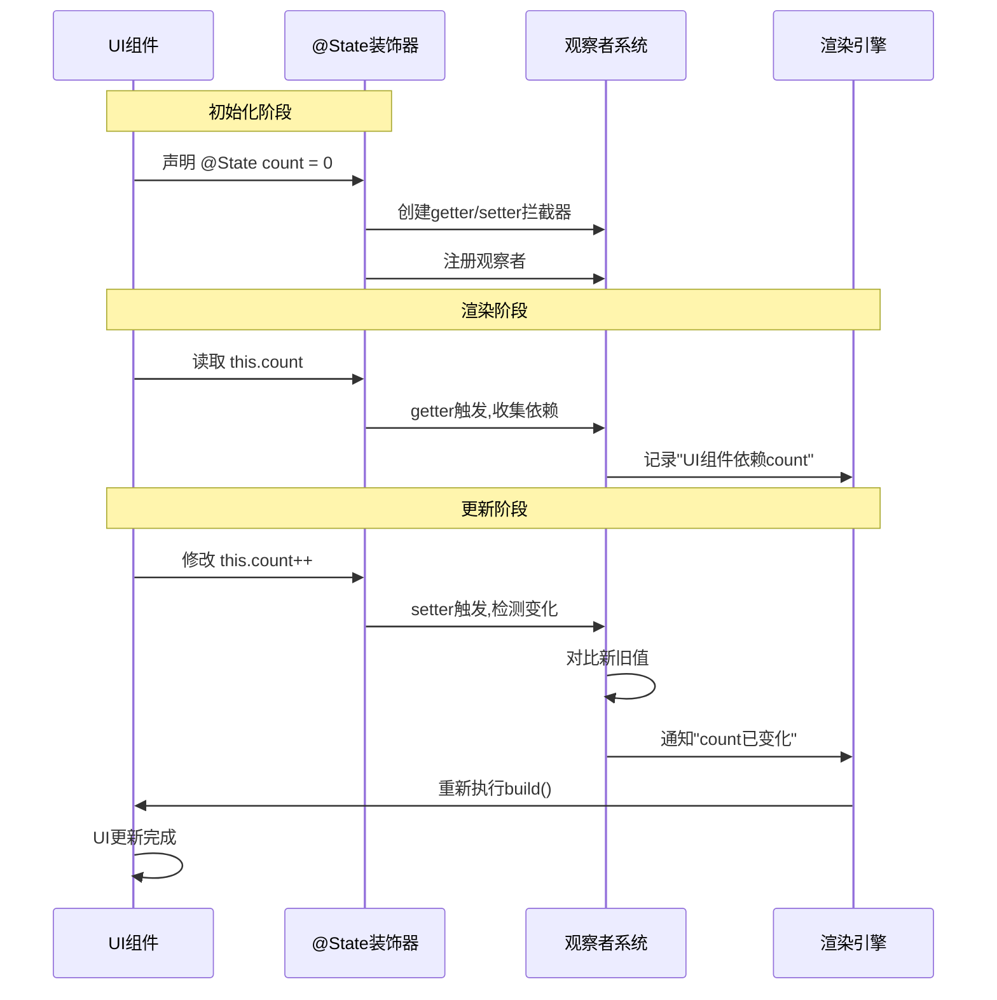
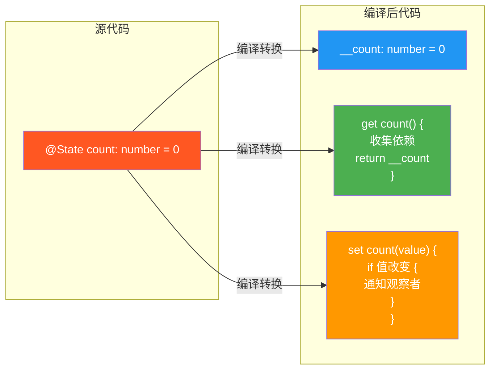

# @State与@Prop最佳实践 - 掌握组件状态管理的艺术

> **阅读时长**: 15分钟
> **难度级别**: ⭐⭐⭐⭐
> **前置知识**: 装饰器基础、响应式编程

---

## 引言：为什么需要深入理解@State和@Prop？

很多开发者刚接触ArkTS时,会遇到这些困惑:

```typescript
// 问题1: 为什么这样写不更新？
@State user: User = { name: '张三' }
this.user.name = '李四'  // ❌ UI不更新

// 问题2: 为什么@Prop不能修改？
@Prop title: string
this.title = '新标题'  // ❌ 编译错误

// 问题3: 为什么性能这么差？
@State bigList: Item[] = new Array(10000)  // ❌ 任何变化都重新渲染10000项
```

**本文将深入讲解@State和@Prop的工作原理、使用技巧和性能优化**,让你真正掌握组件状态管理!

---

## 1. @State深度解析

### 1.1 @State的工作原理

**@State响应式原理图**:



**编译时转换示意**:



**编译时转换**:

```typescript
// ✅ 可运行代码
// 源代码
@Component
struct Counter {
  @State count: number = 0

  build() {
    Text(`${this.count}`)
  }
}

// 编译后（简化版）
class Counter {
  private __count: number = 0
  private __observers: Set<Observer> = new Set()

  // Getter - 依赖收集
  get count(): number {
    // 记录"当前正在渲染的组件依赖count"
    if (currentRenderingComponent) {
      this.__observers.add(currentRenderingComponent)
    }
    return this.__count
  }

  // Setter - 变更通知
  set count(value: number) {
    if (this.__count !== value) {
      this.__count = value
      // 通知所有观察者更新
      this.__observers.forEach(observer => observer.update())
    }
  }

  build() {
    currentRenderingComponent = this  // 设置当前组件
    const result = Text(`${this.count}`)  // 触发getter,收集依赖
    currentRenderingComponent = null
    return result
  }
}
```

**核心机制**:
1. **依赖收集**: 在`getter`中记录哪些组件访问了这个状态
2. **变更检测**: 在`setter`中对比新旧值
3. **批量更新**: 收集所有变更,在微任务中统一更新UI

### 1.2 @State支持的数据类型

**基本类型** ✅
```typescript
// ✅ 可运行代码
@State count: number = 0
@State name: string = '张三'
@State isLogin: boolean = false
@State value: null | undefined = null
```

**对象类型** ⚠️ (只监听引用)
```typescript
@State user: User = { name: '张三', age: 18 }

// ❌ 不会触发更新（引用未变）
this.user.name = '李四'

// ✅ 替换整个对象
this.user = { ...this.user, name: '李四' }
```

**数组类型** ⚠️ (只监听引用)
```typescript
@State list: string[] = ['a', 'b', 'c']

// ❌ 不会触发更新
this.list[0] = 'x'

// ✅ 替换整个数组
this.list = [...this.list]
this.list[0] = 'x'

// ✅ 或使用不可变方法
this.list = this.list.map((item, index) =>
  index === 0 ? 'x' : item
)
```

**Date对象** ⚠️
```typescript
@State currentTime: Date = new Date()

// ❌ 不会触发更新
this.currentTime.setHours(10)

// ✅ 创建新Date对象
this.currentTime = new Date(this.currentTime.setHours(10))
```

**Map/Set** ⚠️
```typescript
@State map: Map<string, number> = new Map()

// ❌ 不会触发更新
this.map.set('key', 123)

// ✅ 替换整个Map
this.map = new Map(this.map.set('key', 123))
```

**嵌套对象** ❌ → 使用@Observed
```typescript
// ❌ @State无法深度监听
@State user: { profile: { name: string } } = {
  profile: { name: '张三' }
}
this.user.profile.name = '李四'  // 不会更新

// ✅ 使用@Observed（后续详解）
@Observed
class Profile {
  name: string = ''
}

@Observed
class User {
  profile: Profile = new Profile()
}

@State user: User = new User()
this.user.profile.name = '李四'  // ✅ 会更新
```

### 1.3 不可变更新模式

**为什么需要不可变更新？**

```typescript
// ✅ 可运行代码
// 可变更新（需要深度对比）
this.list[0].name = 'xxx'  // 引擎需要遍历整个list,对比每个元素

// 不可变更新（浅对比即可）
this.list = [...this.list]  // 引擎只需对比list引用
```

**常用不可变更新技巧**:

```typescript
// ✅ 可运行代码
// 1. 对象更新 - 使用展开运算符
@State user = { name: '张三', age: 18 }

// ✅ 更新单个属性
this.user = { ...this.user, name: '李四' }

// ✅ 更新多个属性
this.user = { ...this.user, name: '李四', age: 20 }

// ✅ 嵌套对象更新
@State user = {
  name: '张三',
  address: { city: '北京', street: '朝阳区' }
}

this.user = {
  ...this.user,
  address: { ...this.user.address, city: '上海' }
}

// 2. 数组更新
@State list: number[] = [1, 2, 3]

// ✅ 添加元素
this.list = [...this.list, 4]

// ✅ 删除元素
this.list = this.list.filter(item => item !== 2)

// ✅ 修改元素
this.list = this.list.map(item => item === 2 ? 20 : item)

// ✅ 插入元素
this.list = [
  ...this.list.slice(0, 1),
  99,
  ...this.list.slice(1)
]

// 3. 数组对象更新
@State items: Item[] = [
  { id: 1, name: 'A' },
  { id: 2, name: 'B' }
]

// ✅ 修改某一项
this.items = this.items.map(item =>
  item.id === 1 ? { ...item, name: 'AA' } : item
)

// 4. Map更新
@State map: Map<string, number> = new Map([['a', 1]])

// ✅ 添加/修改
this.map = new Map(this.map).set('b', 2)

// ✅ 删除
const newMap = new Map(this.map)
newMap.delete('a')
this.map = newMap

// 5. Set更新
@State set: Set<number> = new Set([1, 2, 3])

// ✅ 添加
this.set = new Set(this.set).add(4)

// ✅ 删除
const newSet = new Set(this.set)
newSet.delete(2)
this.set = newSet
```

### 1.4 性能优化技巧

**技巧1: 避免不必要的@State**

```typescript
// ❌ 过度使用@State
@Component
struct BadExample {
  @State cacheData: Map<string, Data> = new Map()  // 缓存不需要响应式
  @State tempValue: string = ''  // 临时变量不需要响应式
  @State displayData: Data[] = []  // ✅ 只有这个需要

  build() {
    List() {
      ForEach(this.displayData, (item: Data) => {
        ListItem() { Text(item.name) }
      })
    }
  }
}

// ✅ 最小化@State
@Component
struct GoodExample {
  private cacheData: Map<string, Data> = new Map()
  private tempValue: string = ''
  @State displayData: Data[] = []  // 只标记影响UI的

  build() {
    List() {
      ForEach(this.displayData, (item: Data) => {
        ListItem() { Text(item.name) }
      })
    }
  }
}
```

**技巧2: 使用计算属性代替方法**

```typescript
// ❌ 每次build都调用方法
@Component
struct BadExample {
  @State tasks: Task[] = []

  getPendingTasks(): Task[] {
    console.log('计算pending tasks')  // 每次build都执行
    return this.tasks.filter(t => !t.completed)
  }

  build() {
    Text(`未完成: ${this.getPendingTasks().length}`)
  }
}

// ✅ 使用getter,引擎会自动缓存
@Component
struct GoodExample {
  @State tasks: Task[] = []

  get pendingTasks(): Task[] {
    console.log('计算pending tasks')  // 只在tasks变化时执行
    return this.tasks.filter(t => !t.completed)
  }

  build() {
    Text(`未完成: ${this.pendingTasks.length}`)
  }
}
```

**技巧3: 拆分大组件**

```typescript
// ❌ 一个大组件,任何状态变化都全部重新渲染
@Component
struct BigComponent {
  @State userInfo: UserInfo = new UserInfo()
  @State products: Product[] = []
  @State cartCount: number = 0

  build() {
    Column() {
      // 用户信息区（依赖userInfo）
      Row() { Text(this.userInfo.name) }

      // 商品列表区（依赖products）
      List() {
        ForEach(this.products, (p: Product) => {
          ListItem() { Text(p.name) }
        })
      }

      // 购物车图标（依赖cartCount）
      Badge({ count: this.cartCount }) {
        Image($r('app.media.cart'))
      }
    }
  }
}

// ✅ 拆分成多个小组件,精确控制更新范围
@Component
struct SmartComponent {
  @State userInfo: UserInfo = new UserInfo()
  @State products: Product[] = []
  @State cartCount: number = 0

  build() {
    Column() {
      // 只有userInfo变化时,UserHeader才重新渲染
      UserHeader({ userInfo: this.userInfo })

      // 只有products变化时,ProductList才重新渲染
      ProductList({ products: this.products })

      // 只有cartCount变化时,CartBadge才重新渲染
      CartBadge({ count: this.cartCount })
    }
  }
}

@Component
struct UserHeader {
  @Prop userInfo: UserInfo
  build() {
    Row() { Text(this.userInfo.name) }
  }
}

@Component
struct ProductList {
  @Prop products: Product[]
  build() {
    List() {
      ForEach(this.products, (p: Product) => {
        ListItem() { Text(p.name) }
      })
    }
  }
}

@Component
struct CartBadge {
  @Prop count: number
  build() {
    Badge({ count: this.count }) {
      Image($r('app.media.cart'))
    }
  }
}
```

**技巧4: 使用ForEach的key优化**

```typescript
// ❌ 没有key,每次都重新创建所有Item
List() {
  ForEach(this.items, (item: Item) => {
    ListItem() { ItemCard({ item: item }) }
  })
}

// ✅ 使用唯一key,复用已存在的Item
List() {
  ForEach(
    this.items,
    (item: Item) => {
      ListItem() { ItemCard({ item: item }) }
    },
    (item: Item) => item.id.toString()  // 提供唯一key
  )
}
```

---

## 2. @Prop深度解析

### 2.1 @Prop的工作原理

**@State与@Prop数据流对比图**:

```mermaid
graph TB
    subgraph "@State数据流(可修改)"
        A1[父组件<br/>@State data]
        A2[子组件<br/>@Link data]
        A1 <-->|双向绑定<br/>可互相修改| A2
    end

    subgraph "@Prop数据流(只读)"
        B1[父组件<br/>@State data]
        B2[子组件<br/>@Prop data]
        B1 -->|单向传递<br/>只读副本| B2
        B2 -.x.-|不能修改父组件| B1
    end

    subgraph "@Prop拷贝机制"
        C1[基本类型<br/>number/string/boolean]
        C2[值拷贝<br/>完全独立]
        C3[对象/数组类型<br/>Object/Array]
        C4[浅拷贝<br/>共享引用]
        C1 --> C2
        C3 --> C4
    end

    style A1 fill:#4CAF50,color:#fff
    style A2 fill:#4CAF50,color:#fff
    style B1 fill:#2196F3,color:#fff
    style B2 fill:#2196F3,color:#fff
    style C2 fill:#FF9800,color:#fff
    style C4 fill:#F44336,color:#fff
```

**单向数据流**:

```typescript
// ✅ 可运行代码
// 父组件
@Component
struct Parent {
  @State count: number = 0

  build() {
    Column() {
      Child({ count: this.count })  // 传递数据
      Button('父组件+1')
        .onClick(() => this.count++)
    }
  }
}

// 子组件
@Component
struct Child {
  @Prop count: number  // 接收数据

  build() {
    Text(`子组件显示: ${this.count}`)
  }
}
```

**数据流向**:
```typescript
// ✅ 可运行代码
父组件@State变化
   ↓
框架检测到变化
   ↓
找到所有依赖的子组件
   ↓
更新子组件的@Prop
   ↓
子组件重新渲染
```

**为什么@Prop不能修改？**

```typescript
// ❌ 编译时会报错
@Component
struct Child {
  @Prop count: number

  build() {
    Button('子组件+1')
      .onClick(() => {
        this.count++  // ❌ Error: Cannot assign to 'count' because it is a read-only property
      })
  }
}
```

**原因**: 保证**单向数据流**,避免数据流向混乱

```typescript
// ✅ 可运行代码
如果允许子组件修改@Prop:
  子组件修改 → 父组件@State更新 → 其他子组件也更新
  ↓
  数据流向变得复杂,难以追踪变化来源
  ↓
  调试困难,容易出现意外的副作用
```

### 2.2 @Prop的数据拷贝机制

**@Prop是值拷贝还是引用拷贝？**

```typescript
// ✅ 可运行代码
// 1. 基本类型 - 值拷贝
@Component
struct Parent {
  @State count: number = 0

  build() {
    Child({ count: this.count })  // 拷贝值
  }
}

@Component
struct Child {
  @Prop count: number  // 拥有独立的副本

  aboutToAppear() {
    // 即使这里修改(假设可以),也不影响父组件
    // 因为是值拷贝
  }
}

// 2. 对象类型 - 浅拷贝引用
@Component
struct Parent {
  @State user: User = { name: '张三', age: 18 }

  build() {
    Child({ user: this.user })  // 拷贝引用
  }
}

@Component
struct Child {
  @Prop user: User  // 引用同一个对象

  aboutToAppear() {
    console.log(this.user === parent.user)  // true
    // 虽然不能重新赋值this.user,但对象内部属性仍是共享的
  }
}
```

**重要结论**:
- **基本类型**: 完全独立的副本
- **对象/数组**: 浅拷贝,共享引用(但不能重新赋值)

### 2.3 @Prop的典型使用场景

**场景1: 展示型组件（推荐）**

```typescript
// ✅ 可运行代码
// 纯展示组件,不修改数据
@Component
export struct ProductCard {
  @Prop product: Product

  build() {
    Column() {
      Image(this.product.image)
        .width('100%')
        .height(200)

      Text(this.product.name)
        .fontSize(16)
        .fontWeight(FontWeight.Bold)

      Text(`¥${this.product.price}`)
        .fontSize(18)
        .fontColor('#ff4d4f')

      Row() {
        Text(`销量: ${this.product.sales}`)
        Text(`评分: ${this.product.rating}`)
      }
    }
    .padding(12)
    .backgroundColor('#fff')
    .borderRadius(8)
  }
}
```

**场景2: 配置型组件**

```typescript
// ✅ 可运行代码
// 接收配置参数,不需要修改
@Component
export struct CustomButton {
  @Prop text: string = '按钮'
  @Prop type: 'primary' | 'default' | 'danger' = 'default'
  @Prop disabled: boolean = false
  onClick?: () => void

  build() {
    Button(this.text)
      .backgroundColor(this.getBackgroundColor())
      .enabled(!this.disabled)
      .onClick(() => this.onClick?.())
  }

  getBackgroundColor(): string {
    if (this.disabled) return '#ccc'
    switch (this.type) {
      case 'primary': return '#1890ff'
      case 'danger': return '#ff4d4f'
      default: return '#fff'
    }
  }
}

// 使用
CustomButton({
  text: '提交',
  type: 'primary',
  onClick: () => console.log('点击')
})
```

**场景3: 列表项组件**

```typescript
// ✅ 可运行代码
@Component
struct TodoList {
  @State tasks: Task[] = getTasks()

  build() {
    List() {
      ForEach(this.tasks, (task: Task) => {
        ListItem() {
          // 每个Item只接收自己的数据
          TaskItem({ task: task })
        }
      }, (task: Task) => task.id.toString())
    }
  }
}

@Component
struct TaskItem {
  @Prop task: Task  // 只读展示

  build() {
    Row() {
      Text(this.task.title)
      if (this.task.completed) {
        Image($r('app.media.check'))
      }
    }
  }
}
```

### 2.4 @Prop的限制与解决方案

**限制1: 不能修改 → 使用@Link**

```typescript
// 需求: 子组件要修改父组件的数据

// ❌ 使用@Prop无法实现
@Component
struct Child {
  @Prop count: number
  build() {
    Button('+1').onClick(() => this.count++)  // ❌ 报错
  }
}

// ✅ 改用@Link
@Component
struct Parent {
  @State count: number = 0
  build() {
    Child({ count: $count })  // ✅ 使用$传递引用
  }
}

@Component
struct Child {
  @Link count: number  // ✅ 可修改
  build() {
    Button('+1').onClick(() => this.count++)  // ✅ 可以
  }
}
```

**限制2: 浅拷贝问题 → 使用@ObjectLink**

```typescript
// 需求: 修改对象内部属性并触发UI更新

// ❌ @Prop无法深度监听
@Component
struct UserForm {
  @Prop user: User

  build() {
    TextInput({ text: this.user.name })
      .onChange(value => {
        // ❌ 虽然能修改,但不会触发UI更新
        this.user.name = value
      })
  }
}

// ✅ 使用@Observed + @ObjectLink
@Observed
class User {
  name: string = ''
  age: number = 0
}

@Component
struct Parent {
  @State user: User = new User()
  build() {
    UserForm({ user: this.user })
  }
}

@Component
struct UserForm {
  @ObjectLink user: User  // ✅ 深度监听

  build() {
    TextInput({ text: this.user.name })
      .onChange(value => {
        this.user.name = value  // ✅ 触发UI更新
      })
  }
}
```

**限制3: 多层传递繁琐 → 使用@Provide/@Consume**

```typescript
// 需求: 跨多层级传递数据

// ❌ @Prop需要一层层传递
A ({ data: this.data })
  → B ({ data: this.data })
    → C ({ data: this.data })
      → D ({ data: this.data })

// ✅ 使用@Provide/@Consume
@Component
struct A {
  @Provide data: Data = new Data()
  build() { B() }
}

@Component
struct B {
  build() { C() }  // 不需要处理data
}

@Component
struct C {
  build() { D() }  // 不需要处理data
}

@Component
struct D {
  @Consume data: Data  // ✅ 直接获取
  build() { Text(this.data.value) }
}
```

---

## 3. @State vs @Prop 对比

| 特性 | @State | @Prop |
|------|--------|-------|
| **可修改性** | ✅ 可修改 | ❌ 只读 |
| **数据来源** | 组件内部初始化 | 父组件传递 |
| **数据流向** | 组件内部 | 父 → 子 |
| **响应式** | ✅ 变化触发更新 | ✅ 父组件变化触发更新 |
| **拷贝方式** | 无（自己持有） | 基本类型值拷贝,对象浅拷贝 |
| **使用场景** | 组件私有状态 | 接收父组件数据 |
| **性能影响** | 中等 | 较小 |

**选择建议**:
- **@State**: 组件需要管理自己的状态
- **@Prop**: 组件只需要展示父组件的数据

---

## 4. 实战案例: 评论列表组件

### 4.1 需求分析

**功能**:
- 展示评论列表
- 点赞/取消点赞
- 展开/收起回复
- 发表回复

### 4.2 数据模型

```typescript
// ✅ 可运行代码
@Observed
class Comment {
  id: number
  author: string
  avatar: string
  content: string
  likeCount: number
  isLiked: boolean
  replies: Comment[]
  createTime: number

  constructor(id: number, author: string, content: string) {
    this.id = id
    this.author = author
    this.content = content
    this.avatar = `https://avatar.example.com/${id}`
    this.likeCount = 0
    this.isLiked = false
    this.replies = []
    this.createTime = Date.now()
  }

  // 切换点赞
  toggleLike() {
    if (this.isLiked) {
      this.likeCount--
      this.isLiked = false
    } else {
      this.likeCount++
      this.isLiked = true
    }
  }

  // 添加回复
  addReply(content: string) {
    const reply = new Comment(
      Date.now(),
      '当前用户',
      content
    )
    this.replies.push(reply)
  }
}
```

### 4.3 主列表组件（使用@State）

```typescript
// ✅ 可运行代码
@Component
export struct CommentList {
  @State comments: Comment[] = []
  @State isLoading: boolean = true

  aboutToAppear() {
    this.loadComments()
  }

  async loadComments() {
    this.isLoading = true
    try {
      // 模拟API请求
      const data = await fetchComments()
      this.comments = data.map(item =>
        Object.assign(new Comment(item.id, item.author, item.content), item)
      )
    } finally {
      this.isLoading = false
    }
  }

  build() {
    Column() {
      // 标题栏
      Row() {
        Text(`评论 ${this.comments.length}`)
          .fontSize(18)
          .fontWeight(FontWeight.Bold)

        Blank()

        Button('刷新')
          .onClick(() => this.loadComments())
      }
      .width('100%')
      .padding(16)

      // 评论列表
      if (this.isLoading) {
        LoadingSpinner()
      } else if (this.comments.length === 0) {
        EmptyView({ text: '暂无评论' })
      } else {
        List({ space: 12 }) {
          ForEach(this.comments, (comment: Comment) => {
            ListItem() {
              // ✅ 使用@ObjectLink传递,支持深度监听
              CommentItem({ comment: comment })
            }
          }, (comment: Comment) => comment.id.toString())
        }
        .layoutWeight(1)
        .padding({ left: 16, right: 16 })
      }
    }
    .width('100%')
    .height('100%')
    .backgroundColor('#f5f5f5')
  }
}
```

### 4.4 评论项组件（使用@ObjectLink）

```typescript
// ✅ 可运行代码
@Component
struct CommentItem {
  @ObjectLink comment: Comment  // ✅ 深度监听,可修改comment内部属性
  @State isExpanded: boolean = false  // ✅ 组件私有状态

  build() {
    Column({ space: 12 }) {
      // 主评论
      Row({ space: 12 }) {
        // 头像
        Image(this.comment.avatar)
          .width(40)
          .height(40)
          .borderRadius(20)

        // 内容区
        Column({ space: 4 }) {
          // 作者名
          Text(this.comment.author)
            .fontSize(14)
            .fontWeight(FontWeight.Bold)

          // 评论内容
          Text(this.comment.content)
            .fontSize(15)
            .fontColor('#333')

          // 操作栏
          Row({ space: 16 }) {
            // 时间
            Text(this.formatTime(this.comment.createTime))
              .fontSize(12)
              .fontColor('#999')

            // 点赞按钮
            Row({ space: 4 }) {
              Image(this.comment.isLiked ?
                $r('app.media.like_filled') :
                $r('app.media.like_outline')
              )
                .width(16)
                .height(16)

              Text(`${this.comment.likeCount}`)
                .fontSize(12)
                .fontColor(this.comment.isLiked ? '#ff4d4f' : '#999')
            }
            .onClick(() => {
              // ✅ 直接修改对象属性,自动触发UI更新
              this.comment.toggleLike()
            })

            // 回复按钮
            if (this.comment.replies.length > 0) {
              Text(`${this.comment.replies.length}条回复`)
                .fontSize(12)
                .fontColor('#1890ff')
                .onClick(() => {
                  // ✅ 修改组件私有状态
                  this.isExpanded = !this.isExpanded
                })
            }
          }
        }
        .alignItems(HorizontalAlign.Start)
        .layoutWeight(1)
      }
      .alignItems(VerticalAlign.Top)

      // 回复列表（展开时显示）
      if (this.isExpanded && this.comment.replies.length > 0) {
        Column({ space: 8 }) {
          ForEach(this.comment.replies, (reply: Comment) => {
            // ✅ 递归使用自身组件
            CommentItem({ comment: reply })
          }, (reply: Comment) => reply.id.toString())
        }
        .padding({ left: 52 })  // 缩进
        .width('100%')
      }

      // 回复输入框
      if (this.isExpanded) {
        ReplyInput({
          onSubmit: (content: string) => {
            // ✅ 调用对象方法,自动触发UI更新
            this.comment.addReply(content)
          }
        })
          .padding({ left: 52 })
      }
    }
    .width('100%')
    .padding(12)
    .backgroundColor('#fff')
    .borderRadius(8)
  }

  formatTime(timestamp: number): string {
    const diff = Date.now() - timestamp
    const minutes = Math.floor(diff / 60000)
    if (minutes < 1) return '刚刚'
    if (minutes < 60) return `${minutes}分钟前`
    const hours = Math.floor(minutes / 60)
    if (hours < 24) return `${hours}小时前`
    const days = Math.floor(hours / 24)
    return `${days}天前`
  }
}
```

### 4.5 回复输入框（使用@Prop接收回调）

```typescript
// ✅ 可运行代码
@Component
struct ReplyInput {
  @State replyText: string = ''  // ✅ 组件私有状态
  @Prop placeholder: string = '写下你的回复...'  // ✅ 配置参数
  onSubmit?: (content: string) => void  // ✅ 回调函数

  build() {
    Row({ space: 8 }) {
      TextInput({ placeholder: this.placeholder, text: this.replyText })
        .layoutWeight(1)
        .onChange(value => this.replyText = value)

      Button('发送')
        .enabled(this.replyText.trim().length > 0)
        .onClick(() => {
          if (this.replyText.trim()) {
            // ✅ 调用父组件传递的回调
            this.onSubmit?.(this.replyText)
            // ✅ 清空输入框
            this.replyText = ''
          }
        })
    }
    .width('100%')
  }
}
```

### 4.6 空视图组件（纯展示型，使用@Prop）

```typescript
// ✅ 可运行代码
@Component
struct EmptyView {
  @Prop text: string = '暂无数据'  // ✅ 只读配置
  @Prop image?: ResourceStr

  build() {
    Column({ space: 16 }) {
      if (this.image) {
        Image(this.image)
          .width(200)
          .height(200)
      }

      Text(this.text)
        .fontSize(16)
        .fontColor('#999')
    }
    .justifyContent(FlexAlign.Center)
    .width('100%')
    .layoutWeight(1)
  }
}
```

### 4.7 数据流动示意

```typescript
// ✅ 可运行代码
CommentList (@State comments)
    ↓ 传递
CommentItem (@ObjectLink comment)
    ↓ 用户点赞
comment.toggleLike()
    ↓ 修改对象属性
comment.isLiked = true
    ↓ @ObjectLink检测到变化
触发CommentItem重新渲染
    ↓
UI自动更新（点赞图标变红）

---

ReplyInput (@State replyText)
    ↓ 用户输入
this.replyText = '新回复'
    ↓ 点击发送
this.onSubmit(replyText)
    ↓ 回调到CommentItem
comment.addReply(content)
    ↓ 修改replies数组
comment.replies.push(new Comment())
    ↓ @ObjectLink检测到变化
触发CommentItem重新渲染
    ↓
UI自动更新（显示新回复）
```

---

## 5. 常见问题与解决方案

### Q1: @State修改对象属性不更新？

**问题**:
```typescript
@State user: User = { name: '张三', age: 18 }
this.user.name = '李四'  // ❌ UI不更新
```

**原因**: @State只监听对象引用,不监听内部属性

**解决方案**:
```typescript
// ✅ 可运行代码
// 方案1: 替换整个对象
this.user = { ...this.user, name: '李四' }

// 方案2: 使用@Observed/@ObjectLink
@Observed class User { name: string; age: number }
@ObjectLink user: User
this.user.name = '李四'  // ✅ 会更新
```

### Q2: @Prop接收对象，修改内部属性会影响父组件吗？

**回答**: 会！因为是浅拷贝,引用同一对象

```typescript
// ✅ 可运行代码
@Component
struct Parent {
  @State user: User = { name: '张三' }
  build() {
    Child({ user: this.user })
  }
}

@Component
struct Child {
  @Prop user: User

  aboutToAppear() {
    // ⚠️ 虽然不能重新赋值this.user
    // 但可以修改内部属性,会影响父组件！
    this.user.name = '李四'  // 父组件的user.name也变了
  }
}
```

**建议**: 如果不想影响父组件,使用深拷贝
```typescript
// ✅ 可运行代码
@Prop user: User

aboutToAppear() {
  // 深拷贝,与父组件完全独立
  this.user = JSON.parse(JSON.stringify(this.user))
}
```

### Q3: 数组/Map/Set修改不触发更新？

**问题**:
```typescript
@State list: number[] = [1, 2, 3]
this.list.push(4)  // ❌ 不更新

@State map: Map<string, number> = new Map()
this.map.set('key', 123)  // ❌ 不更新
```

**原因**: 引用未变,@State检测不到

**解决方案**:
```typescript
// ✅ 可运行代码
// 数组
this.list = [...this.list, 4]  // ✅ 创建新数组

// Map
this.map = new Map(this.map.set('key', 123))  // ✅ 创建新Map

// Set
this.set = new Set(this.set.add(4))  // ✅ 创建新Set
```

### Q4: 性能问题，状态变化导致整个列表重新渲染？

**问题**:
```typescript
// ✅ 可运行代码
@State items: Item[] = new Array(10000)  // 1万条数据
this.items[0].name = 'xxx'  // 整个列表都重新渲染
```

**解决方案**:
```typescript
// ✅ 可运行代码
// 1. 使用@Observed/@ObjectLink
@Observed class Item { name: string }
@State items: Item[] = []

// 2. 拆分子组件
@Component
struct ItemCard {
  @ObjectLink item: Item  // 只有这个Item变化才重新渲染
  build() { Text(this.item.name) }
}

// 3. 使用ForEach的key
ForEach(
  this.items,
  (item: Item) => ItemCard({ item: item }),
  (item: Item) => item.id.toString()  // 提供唯一key
)
```

---

## 总结

### 核心要点

1. **@State原理**:
   - 只监听引用变化
   - 需要不可变更新
   - 避免过度使用

2. **@Prop原理**:
   - 单向数据流
   - 只读属性
   - 基本类型值拷贝,对象浅拷贝

3. **选择建议**:
   - 组件私有状态 → `@State`
   - 接收父组件数据 → `@Prop`
   - 需要修改父组件数据 → `@Link`
   - 嵌套对象 → `@Observed` + `@ObjectLink`

4. **性能优化**:
   - 最小化@State
   - 拆分组件
   - 使用计算属性
   - ForEach提供key

### 学习路径

```typescript
// ✅ 可运行代码
第1步：掌握@State/@Prop基础用法
  ↓
第2步：理解不可变更新模式
  ↓
第3步：学习@Observed/@ObjectLink处理嵌套对象
  ↓
第4步：掌握组件拆分与性能优化
  ↓
第5步：实战项目应用最佳实践
```

### 下一步

- **深入学习**: [@ObjectLink与@Observed详解](./03-04-05-ObjectLink与Observed.md)
- **全局状态**: [AppStorage与LocalStorage](./03-04-06-AppStorage与LocalStorage.md)
- **性能优化**: [渲染性能优化技巧](./05-01-性能优化基础.md)

---

> 💡 **记住**: @State和@Prop是ArkTS状态管理的基石,理解其原理和限制,才能写出高性能、易维护的代码！

> 📚 **参考资料**:
> - [HarmonyOS官方文档 - @State装饰器](https://developer.harmonyos.com/cn/docs/documentation/doc-guides-V3/arkts-state-0000001474017162-V3)
> - [HarmonyOS官方文档 - @Prop装饰器](https://developer.harmonyos.com/cn/docs/documentation/doc-guides-V3/arkts-prop-0000001473537702-V3)
