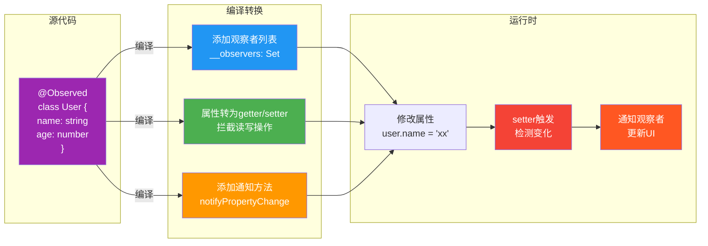
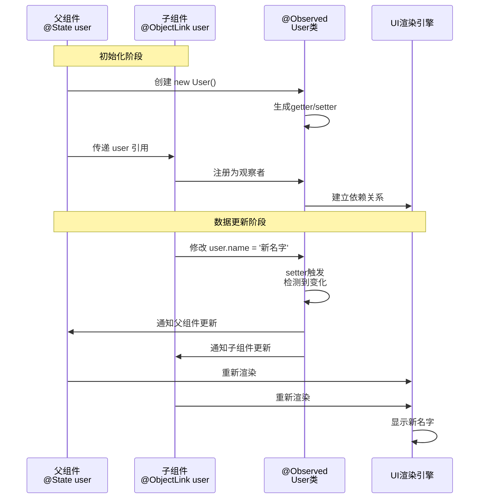

# @ObjectLink与@Observed深度解析 - 嵌套对象响应式的秘密

> **阅读时长**: 15分钟
> **难度级别**: ⭐⭐⭐⭐⭐
> **前置知识**: @State/@Prop基础、TypeScript类

---

## 引言：为什么需要@ObjectLink？

在上一篇文章中,我们了解到`@State`只能监听对象的引用变化:

```typescript
// ✅ 可运行代码
@Component
struct UserProfile {
  @State user: User = {
    name: '张三',
    age: 18,
    address: {
      city: '北京',
      street: '朝阳区'
    }
  }

  build() {
    Column() {
      Text(this.user.name)
      Button('改名')
        .onClick(() => {
          // ❌ 不会触发UI更新
          this.user.name = '李四'

          // ✅ 必须替换整个对象
          this.user = { ...this.user, name: '李四' }

          // ❌ 嵌套对象更麻烦
          this.user.address.city = '上海'  // 不更新
          this.user = {
            ...this.user,
            address: { ...this.user.address, city: '上海' }
          }  // 太繁琐!
        })
    }
  }
}
```

**痛点**:
- ❌ 修改对象属性需要替换整个对象
- ❌ 嵌套对象更新非常繁琐
- ❌ 代码可读性差,容易出错

**@Observed + @ObjectLink解决方案**:
```typescript
// ✅ 可运行代码
@Observed
class User {
  name: string = '张三'
  age: number = 18
  address: Address = new Address()
}

@Observed
class Address {
  city: string = '北京'
  street: string = '朝阳区'
}

@Component
struct UserProfile {
  @State user: User = new User()

  build() {
    Column() {
      UserForm({ user: this.user })
    }
  }
}

@Component
struct UserForm {
  @ObjectLink user: User  // ✅ 深度监听

  build() {
    Column() {
      TextInput({ text: this.user.name })
        .onChange(value => {
          // ✅ 直接修改,自动触发UI更新!
          this.user.name = value
        })

      TextInput({ text: this.user.address.city })
        .onChange(value => {
          // ✅ 嵌套对象也能直接修改!
          this.user.address.city = value
        })
    }
  }
}
```

---

## 1. @Observed原理深度解析

### 1.1 @Observed做了什么？

**@Observed响应式转换流程**:



**@Observed与@ObjectLink协作机制**:



`@Observed`是一个**类装饰器**,在编译时将类的所有属性转换为**响应式属性**。

**源代码**:
```typescript
// ✅ 可运行代码
@Observed
class User {
  name: string = '张三'
  age: number = 18
}
```

**编译后（简化版）**:
```typescript
// ✅ 可运行代码
class User {
  private __name: string = '张三'
  private __age: number = 18
  private __observers: Set<Observer> = new Set()

  // name的getter/setter
  get name(): string {
    return this.__name
  }

  set name(value: string) {
    if (this.__name !== value) {
      this.__name = value
      // 🔔 通知所有观察者
      this.notifyPropertyChange('name', value)
    }
  }

  // age的getter/setter
  get age(): number {
    return this.__age
  }

  set age(value: number) {
    if (this.__age !== value) {
      this.__age = value
      this.notifyPropertyChange('age', value)
    }
  }

  // 通知观察者
  private notifyPropertyChange(propertyName: string, newValue: any) {
    this.__observers.forEach(observer => {
      observer.propertyHasChanged(this, propertyName, newValue)
    })
  }

  // 添加观察者
  addObserver(observer: Observer) {
    this.__observers.add(observer)
  }

  // 移除观察者
  removeObserver(observer: Observer) {
    this.__observers.delete(observer)
  }
}
```

**核心机制**:
1. **属性拦截**: 将所有属性转为getter/setter
2. **变更检测**: setter中对比新旧值
3. **通知机制**: 值变化时通知所有观察者
4. **观察者模式**: 维护观察者列表

### 1.2 @Observed支持的属性类型

**✅ 支持的类型**:

```typescript
// ✅ 可运行代码
@Observed
class SupportedTypes {
  // 基本类型 ✅
  name: string = ''
  age: number = 0
  isActive: boolean = false

  // 日期 ✅
  createTime: Date = new Date()

  // 数组 ✅
  tags: string[] = []
  items: Item[] = []

  // Map/Set ✅
  map: Map<string, number> = new Map()
  set: Set<number> = new Set()

  // 嵌套@Observed对象 ✅
  address: Address = new Address()

  // 可选属性 ✅
  nickname?: string
  extra: string | null = null
}

@Observed
class Address {
  city: string = ''
  street: string = ''
}
```

**⚠️ 注意事项**:

```typescript
// ✅ 可运行代码
@Observed
class NotFullyReactive {
  // ⚠️ 数组元素变化需要特殊处理
  items: Item[] = []

  updateItem(index: number, newItem: Item) {
    // ❌ 直接修改不会触发更新
    this.items[index] = newItem

    // ✅ 需要替换整个数组
    this.items = [...this.items]
    this.items[index] = newItem
  }

  // ⚠️ Map/Set的方法不会自动触发
  map: Map<string, number> = new Map()

  addToMap(key: string, value: number) {
    // ❌ 直接调用set不会触发
    this.map.set(key, value)

    // ✅ 需要手动触发
    this.map = new Map(this.map.set(key, value))
  }
}
```

**✅ 最佳实践**:

```typescript
// ✅ 可运行代码
@Observed
class BestPractice {
  // 数组使用辅助方法
  private _items: Item[] = []

  get items(): Item[] {
    return this._items
  }

  addItem(item: Item) {
    this._items = [...this._items, item]  // 创建新数组
  }

  removeItem(id: number) {
    this._items = this._items.filter(item => item.id !== id)
  }

  updateItem(id: number, updates: Partial<Item>) {
    this._items = this._items.map(item =>
      item.id === id ? { ...item, ...updates } : item
    )
  }
}
```

### 1.3 嵌套@Observed对象

**深度响应式需要每一层都是@Observed**:

```typescript
// ✅ 可运行代码
// ✅ 正确示例
@Observed
class User {
  name: string = ''
  address: Address = new Address()  // Address也必须是@Observed
  profile: Profile = new Profile()  // Profile也必须是@Observed
}

@Observed
class Address {
  city: string = ''
  location: Location = new Location()  // 嵌套3层
}

@Observed
class Location {
  lat: number = 0
  lng: number = 0
}

@Observed
class Profile {
  avatar: string = ''
  bio: string = ''
}

// 使用
@Component
struct UserEditor {
  @State user: User = new User()

  build() {
    Column() {
      // ✅ 所有层级都能响应
      TextInput({ text: this.user.name })
        .onChange(v => this.user.name = v)

      TextInput({ text: this.user.address.city })
        .onChange(v => this.user.address.city = v)

      TextInput({ text: this.user.address.location.lat.toString() })
        .onChange(v => this.user.address.location.lat = parseFloat(v))
    }
  }
}
```

**❌ 常见错误**:

```typescript
// ❌ 子对象没有@Observed
@Observed
class User {
  name: string = ''
  address: { city: string, street: string } = { city: '', street: '' }
  // ⚠️ address对象内部属性不响应
}

// 使用时
this.user.address.city = '北京'  // ❌ 不会触发UI更新
this.user.address = { ...this.user.address, city: '北京' }  // ✅ 需要替换整个address
```

---

## 2. @ObjectLink深度解析

### 2.1 @ObjectLink的作用

`@ObjectLink`是一个**属性装饰器**,用于接收`@Observed`标记的对象,建立**深度依赖追踪**。

**工作流程**:

```typescript
// ✅ 可运行代码
// 父组件持有@State的@Observed对象
@Component
struct Parent {
  @State user: User = new User()  // User是@Observed类

  build() {
    Child({ user: this.user })  // 传递对象
  }
}

// 子组件使用@ObjectLink接收
@Component
struct Child {
  @ObjectLink user: User  // 建立深度依赖

  build() {
    Column() {
      Text(this.user.name)
      Button('改名')
        .onClick(() => {
          // ✅ 修改后自动触发Parent和Child的UI更新
          this.user.name = '新名字'
        })
    }
  }
}
```

**数据流动**:
```typescript
// ✅ 可运行代码
Parent.user (@State)
    ↓ 传递引用
Child.user (@ObjectLink)
    ↓ 修改属性
user.name = '新值'
    ↓ @Observed检测到变化
通知所有观察者 (Parent, Child)
    ↓
Parent.build() 重新执行
Child.build() 重新执行
    ↓
UI自动更新
```

### 2.2 @ObjectLink与@Prop的区别

| 特性 | @ObjectLink | @Prop |
|------|-------------|-------|
| **监听深度** | 深度监听对象属性 | 只监听对象引用 |
| **可修改性** | ✅ 可修改对象属性 | ❌ 只读 |
| **传递方式** | 直接传递 `{ user: this.user }` | 直接传递 `{ user: this.user }` |
| **数据同步** | 修改会同步到父组件 | 不可修改 |
| **必须配合** | `@Observed`类 | 任何类型 |
| **适用场景** | 需要修改嵌套对象 | 只读展示 |

**对比示例**:

```typescript
// ✅ 可运行代码
@Observed
class User {
  name: string = '张三'
  age: number = 18
}

// 使用@Prop（只读）
@Component
struct WithProp {
  @Prop user: User

  build() {
    Column() {
      Text(this.user.name)
      Button('改名')
        .onClick(() => {
          // ⚠️ 虽然能修改（浅拷贝引用同一对象）
          // 但不会触发UI更新
          this.user.name = '李四'
        })
    }
  }
}

// 使用@ObjectLink（可修改+响应式）
@Component
struct WithObjectLink {
  @ObjectLink user: User

  build() {
    Column() {
      Text(this.user.name)
      Button('改名')
        .onClick(() => {
          // ✅ 可以修改,且会触发UI更新
          this.user.name = '李四'
        })
    }
  }
}
```

### 2.3 @ObjectLink的使用规则

**规则1: 必须配合@Observed类**

```typescript
// ❌ 错误：普通对象不能使用@ObjectLink
class User {  // 没有@Observed
  name: string = ''
}

@Component
struct Component {
  @ObjectLink user: User  // ❌ 编译错误
}

// ✅ 正确：必须是@Observed类
@Observed
class User {
  name: string = ''
}

@Component
struct Component {
  @ObjectLink user: User  // ✅ 正确
}
```

**规则2: 父组件必须是@State或@ObjectLink**

```typescript
// ❌ 错误：父组件是普通属性
@Component
struct Parent {
  private user: User = new User()  // 普通属性

  build() {
    Child({ user: this.user })  // ❌ 不会建立响应式
  }
}

// ✅ 正确：父组件是@State
@Component
struct Parent {
  @State user: User = new User()  // @State

  build() {
    Child({ user: this.user })  // ✅ 正确
  }
}

// ✅ 正确：父组件是@ObjectLink
@Component
struct Parent {
  @ObjectLink user: User  // @ObjectLink

  build() {
    Child({ user: this.user })  // ✅ 正确
  }
}
```

**规则3: 不能使用undefined或null初始化**

```typescript
// ❌ 错误
@Component
struct Component {
  @ObjectLink user: User = undefined  // ❌ 编译错误
  @ObjectLink user: User = null       // ❌ 编译错误
}

// ✅ 正确
@Component
struct Component {
  @ObjectLink user: User  // 不提供初始值,由父组件传递
}
```

---

## 3. 实战案例：复杂表单管理

### 3.1 需求分析

**功能**:
- 用户基本信息编辑
- 地址信息管理（多个地址）
- 联系方式管理
- 实时验证
- 自动保存

### 3.2 数据模型设计

```typescript
// ✅ 可运行代码
// 地址信息
@Observed
class Address {
  id: number = Date.now()
  type: 'home' | 'work' | 'other' = 'home'
  province: string = ''
  city: string = ''
  district: string = ''
  street: string = ''
  isDefault: boolean = false

  // 完整地址
  get fullAddress(): string {
    return `${this.province}${this.city}${this.district}${this.street}`
  }

  // 验证
  get isValid(): boolean {
    return this.province.length > 0 &&
           this.city.length > 0 &&
           this.street.length > 0
  }
}

// 联系方式
@Observed
class Contact {
  id: number = Date.now()
  type: 'phone' | 'email' | 'wechat' = 'phone'
  value: string = ''
  isPrimary: boolean = false

  // 验证
  get isValid(): boolean {
    switch (this.type) {
      case 'phone':
        return /^1[3-9]\d{9}$/.test(this.value)
      case 'email':
        return /^[\w-\.]+@([\w-]+\.)+[\w-]{2,4}$/.test(this.value)
      case 'wechat':
        return this.value.length >= 6
      default:
        return false
    }
  }
}

// 用户信息
@Observed
class UserProfile {
  // 基本信息
  name: string = ''
  gender: 'male' | 'female' | 'other' = 'male'
  birthday: Date = new Date('2000-01-01')
  avatar: string = ''

  // 地址列表
  addresses: Address[] = []

  // 联系方式列表
  contacts: Contact[] = []

  // 计算属性：年龄
  get age(): number {
    const today = new Date()
    const birthDate = new Date(this.birthday)
    let age = today.getFullYear() - birthDate.getFullYear()
    const monthDiff = today.getMonth() - birthDate.getMonth()
    if (monthDiff < 0 || (monthDiff === 0 && today.getDate() < birthDate.getDate())) {
      age--
    }
    return age
  }

  // 计算属性：默认地址
  get defaultAddress(): Address | null {
    return this.addresses.find(addr => addr.isDefault) || null
  }

  // 计算属性：主要联系方式
  get primaryContact(): Contact | null {
    return this.contacts.find(c => c.isPrimary) || null
  }

  // 计算属性：表单是否有效
  get isValid(): boolean {
    return this.name.length > 0 &&
           this.addresses.some(addr => addr.isValid) &&
           this.contacts.some(c => c.isValid)
  }

  // 添加地址
  addAddress() {
    const address = new Address()
    // 如果是第一个地址,设为默认
    if (this.addresses.length === 0) {
      address.isDefault = true
    }
    this.addresses = [...this.addresses, address]
  }

  // 删除地址
  removeAddress(id: number) {
    this.addresses = this.addresses.filter(addr => addr.id !== id)
    // 如果删除的是默认地址,设置第一个为默认
    if (this.addresses.length > 0 && !this.addresses.some(addr => addr.isDefault)) {
      this.addresses[0].isDefault = true
      this.addresses = [...this.addresses]  // 触发更新
    }
  }

  // 设置默认地址
  setDefaultAddress(id: number) {
    this.addresses = this.addresses.map(addr => ({
      ...addr,
      isDefault: addr.id === id
    }))
  }

  // 添加联系方式
  addContact() {
    const contact = new Contact()
    if (this.contacts.length === 0) {
      contact.isPrimary = true
    }
    this.contacts = [...this.contacts, contact]
  }

  // 删除联系方式
  removeContact(id: number) {
    this.contacts = this.contacts.filter(c => c.id !== id)
    if (this.contacts.length > 0 && !this.contacts.some(c => c.isPrimary)) {
      this.contacts[0].isPrimary = true
      this.contacts = [...this.contacts]
    }
  }
}
```

### 3.3 主表单组件

```typescript
// ✅ 可运行代码
@Entry
@Component
struct UserProfileForm {
  @State profile: UserProfile = new UserProfile()
  @State isSaving: boolean = false

  aboutToAppear() {
    // 加载已保存的数据
    this.loadProfile()
  }

  async loadProfile() {
    // 从本地存储或API加载
    const saved = AppStorage.Get<string>('userProfile')
    if (saved) {
      try {
        const data = JSON.parse(saved)
        this.profile = Object.assign(new UserProfile(), data)
      } catch (e) {
        console.error('加载失败', e)
      }
    }
  }

  async saveProfile() {
    if (!this.profile.isValid) {
      promptAction.showToast({ message: '请完善必填信息' })
      return
    }

    this.isSaving = true
    try {
      // 保存到本地
      AppStorage.SetOrCreate('userProfile', JSON.stringify(this.profile))
      // 或保存到服务器
      // await api.updateProfile(this.profile)
      promptAction.showToast({ message: '保存成功' })
    } catch (e) {
      promptAction.showToast({ message: '保存失败' })
    } finally {
      this.isSaving = false
    }
  }

  build() {
    Scroll() {
      Column({ space: 16 }) {
        // 标题栏
        Row() {
          Text('个人信息')
            .fontSize(24)
            .fontWeight(FontWeight.Bold)

          Blank()

          Button('保存')
            .enabled(this.profile.isValid && !this.isSaving)
            .onClick(() => this.saveProfile())
        }
        .width('100%')
        .padding(16)

        // 基本信息区
        BasicInfoSection({ profile: this.profile })

        // 地址列表
        AddressListSection({ profile: this.profile })

        // 联系方式列表
        ContactListSection({ profile: this.profile })

        // 提交按钮
        Button('保存', { type: ButtonType.Normal })
          .width('100%')
          .height(50)
          .fontSize(16)
          .backgroundColor(this.profile.isValid ? '#1890ff' : '#ccc')
          .enabled(this.profile.isValid && !this.isSaving)
          .onClick(() => this.saveProfile())
          .margin({ top: 24, bottom: 24 })
      }
      .width('100%')
    }
    .width('100%')
    .height('100%')
    .backgroundColor('#f5f5f5')
  }
}
```

### 3.4 基本信息编辑组件

```typescript
// ✅ 可运行代码
@Component
struct BasicInfoSection {
  @ObjectLink profile: UserProfile  // ✅ 深度监听

  build() {
    Column({ space: 12 }) {
      Text('基本信息')
        .fontSize(18)
        .fontWeight(FontWeight.Bold)

      // 姓名
      FormItem({ label: '姓名', required: true }) {
        TextInput({ text: this.profile.name, placeholder: '请输入姓名' })
          .onChange(value => {
            // ✅ 直接修改,自动触发更新
            this.profile.name = value
          })
      }

      // 性别
      FormItem({ label: '性别' }) {
        Row({ space: 16 }) {
          Radio({ value: 'male', group: 'gender' })
            .checked(this.profile.gender === 'male')
            .onChange(checked => {
              if (checked) this.profile.gender = 'male'
            })
          Text('男')

          Radio({ value: 'female', group: 'gender' })
            .checked(this.profile.gender === 'female')
            .onChange(checked => {
              if (checked) this.profile.gender = 'female'
            })
          Text('女')

          Radio({ value: 'other', group: 'gender' })
            .checked(this.profile.gender === 'other')
            .onChange(checked => {
              if (checked) this.profile.gender = 'other'
            })
          Text('其他')
        }
      }

      // 生日
      FormItem({ label: '生日' }) {
        Row() {
          Text(this.profile.birthday.toLocaleDateString())
            .layoutWeight(1)

          Text(`(${this.profile.age}岁)`)
            .fontColor('#999')
            .margin({ right: 8 })

          Button('选择')
            .onClick(() => {
              // 打开日期选择器
              DatePickerDialog.show({
                start: new Date('1900-01-01'),
                end: new Date(),
                selected: this.profile.birthday,
                onAccept: (value: DatePickerResult) => {
                  this.profile.birthday = new Date(
                    value.year!,
                    value.month!,
                    value.day!
                  )
                }
              })
            })
        }
      }
    }
    .width('100%')
    .padding(16)
    .backgroundColor('#fff')
    .borderRadius(8)
  }
}
```

### 3.5 地址列表组件

```typescript
// ✅ 可运行代码
@Component
struct AddressListSection {
  @ObjectLink profile: UserProfile

  build() {
    Column({ space: 12 }) {
      // 标题栏
      Row() {
        Text('地址信息')
          .fontSize(18)
          .fontWeight(FontWeight.Bold)

        Blank()

        Button('添加地址')
          .fontSize(14)
          .onClick(() => {
            // ✅ 调用对象方法,自动触发更新
            this.profile.addAddress()
          })
      }
      .width('100%')

      // 地址列表
      if (this.profile.addresses.length === 0) {
        Text('暂无地址')
          .fontSize(14)
          .fontColor('#999')
          .padding(32)
      } else {
        ForEach(this.profile.addresses, (address: Address) => {
          // ✅ 每个地址项也用@ObjectLink
          AddressCard({
            address: address,
            onDelete: () => this.profile.removeAddress(address.id),
            onSetDefault: () => this.profile.setDefaultAddress(address.id)
          })
        }, (address: Address) => address.id.toString())
      }
    }
    .width('100%')
    .padding(16)
    .backgroundColor('#fff')
    .borderRadius(8)
  }
}
```

### 3.6 地址卡片组件

```typescript
// ✅ 可运行代码
@Component
struct AddressCard {
  @ObjectLink address: Address  // ✅ 深度监听单个地址
  onDelete?: () => void
  onSetDefault?: () => void

  build() {
    Column({ space: 12 }) {
      // 地址类型
      Row({ space: 8 }) {
        Select([
          { value: '家', label: '家庭地址' },
          { value: '公司', label: '公司地址' },
          { value: '其他', label: '其他' }
        ])
          .value(this.getTypeName())
          .onSelect(index => {
            // ✅ 直接修改
            this.address.type = ['home', 'work', 'other'][index]
          })

        if (this.address.isDefault) {
          Text('默认')
            .fontSize(12)
            .fontColor('#fff')
            .backgroundColor('#52c41a')
            .padding({ left: 8, right: 8, top: 4, bottom: 4 })
            .borderRadius(4)
        }

        Blank()

        Button('删除')
          .fontSize(14)
          .type(ButtonType.Normal)
          .backgroundColor('#ff4d4f')
          .onClick(() => this.onDelete?.())
      }

      // 省市区
      Row({ space: 8 }) {
        TextInput({ text: this.address.province, placeholder: '省' })
          .layoutWeight(1)
          .onChange(value => this.address.province = value)

        TextInput({ text: this.address.city, placeholder: '市' })
          .layoutWeight(1)
          .onChange(value => this.address.city = value)

        TextInput({ text: this.address.district, placeholder: '区' })
          .layoutWeight(1)
          .onChange(value => this.address.district = value)
      }

      // 详细地址
      TextInput({ text: this.address.street, placeholder: '详细地址' })
        .onChange(value => this.address.street = value)

      // 验证状态
      if (!this.address.isValid) {
        Text('请填写完整地址')
          .fontSize(12)
          .fontColor('#ff4d4f')
      }

      // 操作按钮
      if (!this.address.isDefault) {
        Button('设为默认地址')
          .width('100%')
          .onClick(() => this.onSetDefault?.())
      }
    }
    .width('100%')
    .padding(12)
    .backgroundColor('#f5f5f5')
    .borderRadius(8)
  }

  getTypeName(): string {
    switch (this.address.type) {
      case 'home': return '家'
      case 'work': return '公司'
      case 'other': return '其他'
      default: return ''
    }
  }
}
```

### 3.7 数据流动完整示意

```typescript
// ✅ 可运行代码
用户输入姓名
    ↓
TextInput.onChange
    ↓
this.profile.name = value
    ↓
@Observed检测到User.name变化
    ↓
通知所有@ObjectLink观察者
    ↓
UserProfileForm.build() (因为profile是@State)
BasicInfoSection.build() (因为profile是@ObjectLink)
    ↓
UI自动更新

---

用户点击"添加地址"
    ↓
this.profile.addAddress()
    ↓
this.profile.addresses = [...addresses, newAddress]
    ↓
@Observed检测到addresses变化
    ↓
通知观察者
    ↓
AddressListSection.build()
    ↓
ForEach重新渲染,新增AddressCard

---

用户修改某个地址的城市
    ↓
this.address.city = value
    ↓
@Observed检测到Address.city变化
    ↓
通知观察者
    ↓
AddressCard.build()
    ↓
只有这个AddressCard重新渲染（性能优化）
```

---

## 4. 性能优化技巧

### 技巧1: 精细化组件拆分

```typescript
// ❌ 一个大组件,任何属性变化都全部重新渲染
@Component
struct BigForm {
  @ObjectLink user: User

  build() {
    Column() {
      Text(this.user.name)
      Text(this.user.age.toString())
      Text(this.user.address.city)
      // ... 大量UI
    }
  }
}

// ✅ 拆分成小组件,精确控制更新范围
@Component
struct SmartForm {
  @ObjectLink user: User

  build() {
    Column() {
      NameDisplay({ name: this.user.name })  // 只依赖name
      AgeDisplay({ age: this.user.age })      // 只依赖age
      AddressDisplay({ address: this.user.address })  // 只依赖address
    }
  }
}

@Component
struct NameDisplay {
  @Prop name: string  // 只在name变化时重新渲染
  build() {
    Text(this.name)
  }
}
```

### 技巧2: 使用计算属性缓存复杂计算

```typescript
// ✅ 可运行代码
@Observed
class ProductList {
  items: Product[] = []
  filters: Filters = new Filters()

  // ✅ 使用getter,自动缓存
  get filteredItems(): Product[] {
    console.log('计算过滤结果')  // 只在items或filters变化时执行
    return this.items.filter(item => {
      // 复杂过滤逻辑
      return item.price >= this.filters.minPrice &&
             item.price <= this.filters.maxPrice &&
             item.category === this.filters.category
    })
  }
}

@Component
struct ProductListView {
  @ObjectLink list: ProductList

  build() {
    List() {
      // ✅ 直接使用计算属性
      ForEach(this.list.filteredItems, (item: Product) => {
        ListItem() { ProductCard({ product: item }) }
      })
    }
  }
}
```

### 技巧3: 避免不必要的@Observed

```typescript
// ❌ 过度使用@Observed
@Observed
class Config {  // 配置数据不需要响应式
  apiUrl: string = ''
  timeout: number = 5000
}

// ✅ 只标记需要响应式的类
class Config {  // 普通类
  apiUrl: string = ''
  timeout: number = 5000
}

@Observed
class UserData {  // 业务数据才需要@Observed
  name: string = ''
  age: number = 0
}
```

---

## 5. 常见问题

### Q1: 修改数组元素不触发更新？

```typescript
// ✅ 可运行代码
@Observed
class Store {
  items: Item[] = []
}

// ❌ 问题
this.store.items[0].name = 'xxx'  // 不触发更新

// ✅ 解决方案1: Item也标记为@Observed
@Observed
class Item {
  name: string = ''
}

// ✅ 解决方案2: 替换整个数组
this.store.items = this.store.items.map((item, i) =>
  i === 0 ? { ...item, name: 'xxx' } : item
)
```

### Q2: Map/Set修改不触发更新？

```typescript
// ✅ 可运行代码
@Observed
class Store {
  map: Map<string, number> = new Map()
}

// ❌ 问题
this.store.map.set('key', 123)  // 不触发更新

// ✅ 解决方案: 创建新Map
this.store.map = new Map(this.store.map.set('key', 123))
```

### Q3: @ObjectLink可以接收null吗？

```typescript
// ❌ 不可以
@ObjectLink user: User = null  // 编译错误

// ✅ 使用可选类型
@ObjectLink user?: User  // 但必须在使用前检查

// ✅ 或使用条件渲染
if (this.user) {
  Text(this.user.name)
}
```

---

## 总结

### 核心要点

1. **@Observed**: 将类转为响应式,所有属性变化可追踪
2. **@ObjectLink**: 建立深度依赖,可修改对象属性
3. **嵌套对象**: 每一层都需要@Observed
4. **数组/Map/Set**: 需要不可变更新
5. **性能优化**: 拆分组件、计算属性、避免过度使用

### 最佳实践

```typescript
// ✅ 可运行代码
// 1. 数据模型统一使用@Observed
@Observed
class User { ... }

// 2. 根组件用@State持有
@State user: User = new User()

// 3. 子组件用@ObjectLink接收
@ObjectLink user: User

// 4. 修改数据直接修改属性
this.user.name = 'xxx'  // ✅ 自动更新

// 5. 数组操作使用辅助方法
class User {
  addItem(item) {
    this.items = [...this.items, item]
  }
}
```

### 下一步

- **全局状态**: [AppStorage与PersistentStorage](./03-04-05-AppStorage与PersistentStorage.md)
- **状态模式**: [状态管理最佳实践](./03-04-06-状态管理最佳实践.md)
- **性能优化**: [渲染性能优化](./05-01-性能优化基础.md)

---

> 💡 **记住**: @Observed + @ObjectLink是处理复杂嵌套对象的最佳方案,理解其原理后,你会发现状态管理变得简单而优雅!

> 📚 **参考资料**:
> - [HarmonyOS官方文档 - @Observed和@ObjectLink](https://developer.harmonyos.com/cn/docs/documentation/doc-guides-V3/arkts-observed-and-objectlink-0000001473697338-V3)
