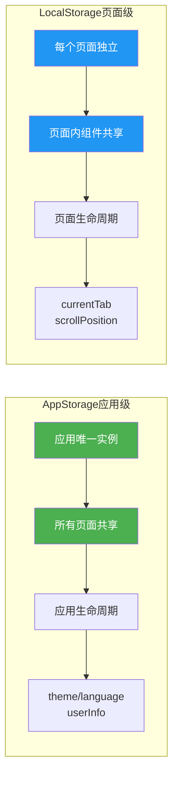
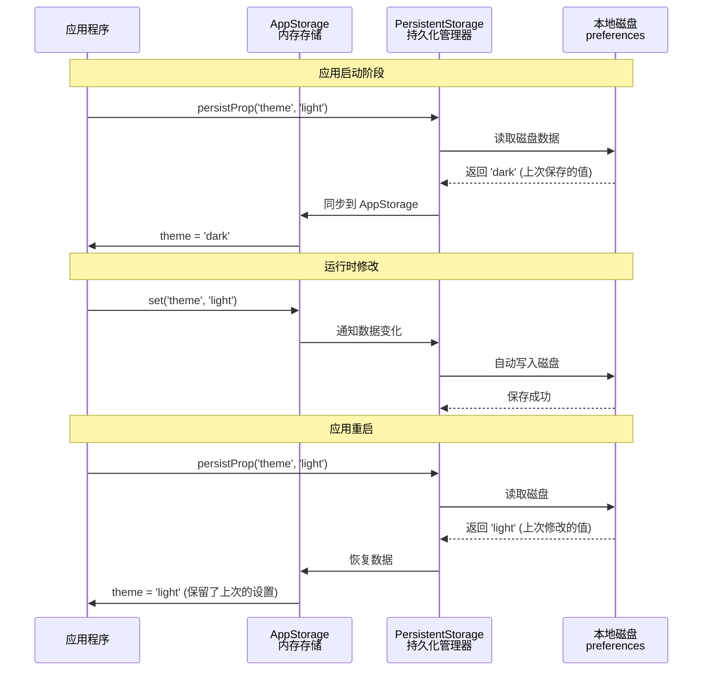

# 21-AppStorage与LocalStorage实战 - 应用级状态管理完全指南

> **适合人群**: 需要跨页面共享数据的开发者
> **阅读时间**: 15分钟
> **实战项目**: 主题切换系统、用户偏好设置、购物车持久化

---

## 🎯 核心问题

在之前的文章中,我们学习了组件级状态管理(@State/@Prop/@Link/@ObjectLink)。但实际开发中经常遇到这些场景:

**场景1: 主题切换**

```typescript
// ❌ 问题: 每个页面都要传递theme属性
@Entry
@Component
struct HomePage {
  @State theme: string = 'light'  // 首页

  build() {
    Column() {
      // 传递给子组件...
      SettingsPage({ theme: this.theme })
    }
  }
}

@Component
struct SettingsPage {
  @Prop theme: string  // 设置页也需要
  // 其他10个页面都要重复...
}
```

**场景2: 用户登录状态**

```typescript
// ❌ 问题: 用户信息需要在整个应用共享
@Entry
@Component
struct App {
  @State userInfo: User = null  // 根组件

  build() {
    Column() {
      // 需要一层层传递到深层子组件
      ProfilePage({ userInfo: this.userInfo })
      OrderPage({ userInfo: this.userInfo })
      CartPage({ userInfo: this.userInfo })
    }
  }
}
```

**场景3: 数据持久化**

```typescript
// ❌ 问题: 应用关闭后数据丢失
@State cartItems: Product[] = []

// 用户下次打开应用,购物车清空了!
```

**这些问题怎么解决?**
- ✅ **AppStorage**: 应用级全局状态,所有组件共享
- ✅ **LocalStorage**: 页面级共享状态,局部范围
- ✅ **PersistentStorage**: 持久化存储,关闭应用不丢失

---

## 📚 目录

1. **AppStorage基础**: 应用级状态管理
2. **LocalStorage详解**: 页面级状态管理
3. **PersistentStorage**: 数据持久化
4. **实战1**: 主题切换系统
5. **实战2**: 用户偏好设置
6. **实战3**: 购物车持久化
7. **性能优化**: 避免过度存储
8. **常见问题FAQ**

---

## 一、AppStorage基础

### 1.1 什么是AppStorage?

**AppStorage架构图**:

```mermaid
graph TB
    subgraph 应用层
        Page1[首页]
        Page2[设置页]
        Page3[购物车页]
    end

    subgraph AppStorage全局存储
        Store[(AppStorage<br/>单例存储<br/>────<br/>theme: 'dark'<br/>userInfo: {...}<br/>cartCount: 5)]
    end

    subgraph PersistentStorage持久化
        Disk[(本地磁盘<br/>────<br/>preferences文件)]
    end

    Page1 <-.@StorageLink<br/>双向绑定.-> Store
    Page2 <-.@StorageProp<br/>单向绑定.-> Store
    Page3 <-.@StorageLink<br/>双向绑定.-> Store
    Store <-->|自动同步| Disk

    style Store fill:#4CAF50,color:#fff
    style Disk fill:#2196F3,color:#fff
    style Page1 fill:#FF9800,color:#fff
    style Page2 fill:#FF9800,color:#fff
    style Page3 fill:#FF9800,color:#fff
```

**AppStorage与LocalStorage对比**:



**AppStorage** 是鸿蒙提供的**应用级全局状态存储**:

```typescript
// ✅ 可运行代码
// 📦 AppStorage = 应用级的全局变量仓库
// ┌──────────────────────────────────┐
// │       AppStorage (应用级)         │
// ├──────────────────────────────────┤
// │  theme: 'dark'                   │
// │  userInfo: { name: '张三' }      │
// │  cartCount: 5                    │
// └──────────────────────────────────┘
//        ↓         ↓         ↓
//    首页       设置页     购物车页
```

**核心特点**:
- ✅ **全局唯一**: 整个应用只有一个AppStorage实例
- ✅ **跨页面共享**: 任何组件都能访问
- ✅ **响应式更新**: 修改后所有订阅组件自动刷新
- ⚠️ **内存存储**: 应用关闭后数据丢失(需要配合PersistentStorage)

### 1.2 基础用法

#### (1) 设置和读取数据

```typescript
// ✅ 可运行代码
// 1️⃣ 存储数据 (通常在应用启动时初始化)
AppStorage.setOrCreate('theme', 'light')  // 设置主题
AppStorage.setOrCreate('language', 'zh-CN')  // 设置语言
AppStorage.setOrCreate('fontSize', 16)  // 设置字体大小

// 2️⃣ 读取数据
const theme = AppStorage.get('theme')  // 'light'
const lang = AppStorage.get('language')  // 'zh-CN'

// 3️⃣ 更新数据
AppStorage.set('theme', 'dark')  // 切换到深色主题

// 4️⃣ 删除数据
AppStorage.delete('fontSize')

// 5️⃣ 清空所有数据
AppStorage.clear()
```

#### (2) 组件中订阅AppStorage

```typescript
// ✅ 可运行代码
@Entry
@Component
struct HomePage {
  // 🌟 @StorageProp: 单向绑定,只读
  @StorageProp('theme') theme: string = 'light'

  // 🌟 @StorageLink: 双向绑定,可读写
  @StorageLink('fontSize') fontSize: number = 16

  build() {
    Column() {
      // 显示当前主题
      Text(`当前主题: ${this.theme}`)
        .fontSize(this.fontSize)

      // ✅ StorageLink可以修改
      Button('增大字体')
        .onClick(() => {
          this.fontSize += 2  // 修改后所有页面的字体都会变大
        })
    }
  }
}
```

### 1.3 @StorageProp vs @StorageLink

| 装饰器 | 数据流 | 使用场景 | 示例 |
|--------|--------|----------|------|
| **@StorageProp** | **单向**(AppStorage → 组件) | 只读显示,不需要修改 | 显示主题、语言 |
| **@StorageLink** | **双向**(组件 ↔ AppStorage) | 需要修改,影响其他组件 | 切换主题、调整字体 |

```typescript
// ✅ 可运行代码
@Component
struct ThemeDisplay {
  // ✅ 只读: 用@StorageProp
  @StorageProp('theme') currentTheme: string = 'light'

  build() {
    Text(`主题: ${this.currentTheme}`)  // 只展示,不修改
  }
}

@Component
struct ThemeSwitch {
  // ✅ 可读写: 用@StorageLink
  @StorageLink('theme') theme: string = 'light'

  build() {
    Button(this.theme === 'light' ? '切换到深色' : '切换到浅色')
      .onClick(() => {
        this.theme = this.theme === 'light' ? 'dark' : 'light'  // 修改
      })
  }
}
```

---

## 二、LocalStorage详解

### 2.1 LocalStorage vs AppStorage

**LocalStorage** 是**页面级共享状态**,作用域更小:

```typescript
// ✅ 可运行代码
// 对比示意图:
//
// AppStorage (应用级,全局唯一)
// ┌──────────────────────────────────────┐
// │  所有页面共享                          │
// │  userInfo, theme, language...        │
// └──────────────────────────────────────┘
//
// LocalStorage (页面级,每个页面独立)
// ┌─────────────┐  ┌─────────────┐  ┌─────────────┐
// │ 首页Storage  │  │ 列表Storage  │  │ 详情Storage  │
// │ currentTab  │  │ scrollPos   │  │ articleId   │
// │ bannerIndex │  │ filterType  │  │ commentPage │
// └─────────────┘  └─────────────┘  └─────────────┘
```

**使用场景对比**:

| 存储类型 | 作用域 | 生命周期 | 使用场景 |
|---------|--------|----------|----------|
| **AppStorage** | 全应用 | 应用运行期 | 主题、语言、用户信息 |
| **LocalStorage** | 单页面 | 页面存在期 | Tab索引、滚动位置、临时筛选条件 |

### 2.2 LocalStorage基础用法

#### (1) 创建和传递LocalStorage

```typescript
// ✅ 可运行代码
// 1️⃣ 创建LocalStorage实例
const storage = new LocalStorage({
  'currentTab': 0,
  'searchKeyword': '',
  'filterType': 'all'
})

// 2️⃣ 传递给页面
@Entry(storage)  // 将storage注入到组件
@Component
struct ListPage {
  // 3️⃣ 组件内订阅
  @LocalStorageProp('currentTab') tabIndex: number = 0
  @LocalStorageLink('searchKeyword') keyword: string = ''

  build() {
    Column() {
      Tabs({ index: this.tabIndex }) {
        TabContent() { Text('推荐') }
        TabContent() { Text('热门') }
      }

      TextInput({ placeholder: '搜索', text: this.keyword })
        .onChange((value) => {
          this.keyword = value  // 修改LocalStorage
        })
    }
  }
}
```

#### (2) 嵌套页面共享LocalStorage

```typescript
// ✅ 可运行代码
// 父页面创建LocalStorage
const parentStorage = new LocalStorage({ productId: '12345' })

@Entry(parentStorage)
@Component
struct ProductDetailPage {
  @LocalStorageLink('productId') productId: string = ''

  build() {
    Column() {
      Text(`商品ID: ${this.productId}`)

      // 子组件自动继承父页面的LocalStorage
      CommentList()
      RecommendList()
    }
  }
}

@Component
struct CommentList {
  // ✅ 可以访问父页面的LocalStorage
  @LocalStorageProp('productId') productId: string = ''

  aboutToAppear() {
    this.loadComments(this.productId)  // 使用共享的productId
  }

  loadComments(id: string) {
    // 加载评论...
  }

  build() {
    List() { /* 评论列表 */ }
  }
}
```

---

## 三、PersistentStorage - 数据持久化

### 3.1 为什么需要持久化?

**PersistentStorage持久化机制**:



```typescript
// ❌ 问题: 应用关闭后AppStorage数据全部丢失
AppStorage.setOrCreate('theme', 'dark')
AppStorage.setOrCreate('fontSize', 18)

// 用户关闭应用,再次打开...
// theme重置为默认值 'light'
// fontSize重置为默认值 16
```

**PersistentStorage** = AppStorage + 磁盘存储:

```typescript
// ✅ 可运行代码
// ✅ 解决方案: 持久化存储
PersistentStorage.persistProp('theme', 'light')  // 主题持久化
PersistentStorage.persistProp('fontSize', 16)  // 字体持久化

// 底层流程:
// 1. 首次运行: 从磁盘读取,如果不存在则用默认值
// 2. 运行中: 修改AppStorage时自动写入磁盘
// 3. 下次启动: 从磁盘恢复上次的值
```

### 3.2 基础用法

```typescript
// ✅ 可运行代码
// 1️⃣ 在应用启动时配置持久化 (通常在EntryAbility.ts中)
export default class EntryAbility extends UIAbility {
  onCreate(want, launchParam) {
    // 配置需要持久化的属性
    PersistentStorage.persistProp('theme', 'light')
    PersistentStorage.persistProp('language', 'zh-CN')
    PersistentStorage.persistProp('fontSize', 16)
    PersistentStorage.persistProp('cartItems', [])  // 购物车
  }
}

// 2️⃣ 组件中正常使用AppStorage
@Entry
@Component
struct SettingsPage {
  @StorageLink('theme') theme: string = 'light'
  @StorageLink('fontSize') fontSize: number = 16

  build() {
    Column() {
      // 切换主题
      Button('切换主题')
        .onClick(() => {
          this.theme = this.theme === 'light' ? 'dark' : 'light'
          // ✅ 修改后自动保存到磁盘,下次启动保留
        })

      // 调整字体
      Slider({
        value: this.fontSize,
        min: 12,
        max: 24,
        step: 2
      })
        .onChange((value) => {
          this.fontSize = value
          // ✅ 自动保存
        })
    }
  }
}
```

### 3.3 删除持久化数据

```typescript
// ✅ 可运行代码
// 删除某个持久化属性
PersistentStorage.deleteProp('theme')

// 注意:deleteProp只删除持久化绑定,不删除AppStorage中的值
// 如需彻底清除,还需要:
AppStorage.delete('theme')
```

---

## 四、实战1: 主题切换系统

完整实现一个全局主题切换功能:

### 4.1 定义主题类型

```typescript
// ✅ 可运行代码
// src/common/ThemeConfig.ets

// 主题类型
export enum ThemeType {
  LIGHT = 'light',
  DARK = 'dark',
  AUTO = 'auto'  // 跟随系统
}

// 主题配置
export class ThemeConfig {
  backgroundColor: string
  textColor: string
  primaryColor: string
  borderColor: string
}

// 主题数据
export const Themes: Record<ThemeType, ThemeConfig> = {
  [ThemeType.LIGHT]: {
    backgroundColor: '#FFFFFF',
    textColor: '#333333',
    primaryColor: '#007AFF',
    borderColor: '#E5E5E5'
  },
  [ThemeType.DARK]: {
    backgroundColor: '#1C1C1E',
    textColor: '#FFFFFF',
    primaryColor: '#0A84FF',
    borderColor: '#38383A'
  },
  [ThemeType.AUTO]: {
    backgroundColor: '#FFFFFF',  // 实际使用时根据系统决定
    textColor: '#333333',
    primaryColor: '#007AFF',
    borderColor: '#E5E5E5'
  }
}
```

### 4.2 初始化主题存储

```typescript
// ✅ 可运行代码
// src/entryability/EntryAbility.ts

import { ThemeType } from '../common/ThemeConfig'

export default class EntryAbility extends UIAbility {
  onCreate(want, launchParam) {
    // 持久化主题设置
    PersistentStorage.persistProp('appTheme', ThemeType.LIGHT)

    // 初始化到AppStorage
    AppStorage.setOrCreate('appTheme', ThemeType.LIGHT)
  }
}
```

### 4.3 创建主题管理器

```typescript
// ✅ 可运行代码
// src/common/ThemeManager.ets

import { Themes, ThemeConfig, ThemeType } from './ThemeConfig'

export class ThemeManager {
  // 获取当前主题配置
  static getCurrentTheme(): ThemeConfig {
    const themeType = AppStorage.get<ThemeType>('appTheme') || ThemeType.LIGHT

    if (themeType === ThemeType.AUTO) {
      // 跟随系统 (通过系统API获取)
      const systemTheme = this.getSystemTheme()
      return Themes[systemTheme]
    }

    return Themes[themeType]
  }

  // 切换主题
  static switchTheme(newTheme: ThemeType) {
    AppStorage.set('appTheme', newTheme)
  }

  // 获取系统主题 (模拟实现)
  private static getSystemTheme(): ThemeType {
    // 实际项目中使用系统API获取
    // import { ConfigurationConstant } from '@ohos.app.ability.ConfigurationConstant'
    const hour = new Date().getHours()
    return (hour >= 18 || hour < 6) ? ThemeType.DARK : ThemeType.LIGHT
  }
}
```

### 4.4 应用主题

```typescript
// ✅ 可运行代码
// 首页应用主题
@Entry
@Component
struct HomePage {
  @StorageLink('appTheme') currentTheme: ThemeType = ThemeType.LIGHT

  // 计算属性: 根据主题类型获取配置
  @Builder
  getThemeConfig(): ThemeConfig {
    return ThemeManager.getCurrentTheme()
  }

  build() {
    Column() {
      Text('首页')
        .fontSize(24)
        .fontColor(this.getThemeConfig().textColor)

      Button('设置')
        .backgroundColor(this.getThemeConfig().primaryColor)
        .onClick(() => {
          router.pushUrl({ url: 'pages/SettingsPage' })
        })
    }
    .width('100%')
    .height('100%')
    .backgroundColor(this.getThemeConfig().backgroundColor)
  }
}

// 设置页: 主题切换器
@Entry
@Component
struct SettingsPage {
  @StorageLink('appTheme') appTheme: ThemeType = ThemeType.LIGHT

  build() {
    Column() {
      Text('主题设置')
        .fontSize(20)
        .fontColor(ThemeManager.getCurrentTheme().textColor)
        .margin({ bottom: 20 })

      // 主题选项
      Row() {
        Text('浅色')
        Radio({ value: ThemeType.LIGHT, group: 'theme' })
          .checked(this.appTheme === ThemeType.LIGHT)
          .onChange(() => {
            ThemeManager.switchTheme(ThemeType.LIGHT)
          })
      }

      Row() {
        Text('深色')
        Radio({ value: ThemeType.DARK, group: 'theme' })
          .checked(this.appTheme === ThemeType.DARK)
          .onChange(() => {
            ThemeManager.switchTheme(ThemeType.DARK)
          })
      }

      Row() {
        Text('跟随系统')
        Radio({ value: ThemeType.AUTO, group: 'theme' })
          .checked(this.appTheme === ThemeType.AUTO)
          .onChange(() => {
            ThemeManager.switchTheme(ThemeType.AUTO)
          })
      }
    }
    .width('100%')
    .height('100%')
    .padding(20)
    .backgroundColor(ThemeManager.getCurrentTheme().backgroundColor)
  }
}
```

**效果**:
- ✅ 切换主题后,所有页面立即更新
- ✅ 关闭应用再打开,主题设置保留
- ✅ 支持浅色/深色/跟随系统三种模式

---

## 五、实战2: 用户偏好设置

完整的用户偏好设置系统:

### 5.1 定义设置类型

```typescript
// ✅ 可运行代码
// src/common/UserPreferences.ets

// 用户偏好设置
export class UserPreferences {
  // 外观设置
  theme: ThemeType = ThemeType.LIGHT
  fontSize: number = 16  // 12-24
  showImages: boolean = true  // 是否显示图片

  // 通知设置
  enableNotifications: boolean = true
  notificationSound: boolean = true
  vibration: boolean = true

  // 隐私设置
  trackingEnabled: boolean = false
  crashReportEnabled: boolean = true

  // 语言设置
  language: string = 'zh-CN'  // zh-CN, en-US, ja-JP
}
```

### 5.2 初始化设置

```typescript
// ✅ 可运行代码
// EntryAbility.ts

import { UserPreferences } from '../common/UserPreferences'

export default class EntryAbility extends UIAbility {
  onCreate(want, launchParam) {
    const defaultPrefs = new UserPreferences()

    // 持久化所有设置项
    PersistentStorage.persistProp('userPrefs', JSON.stringify(defaultPrefs))
  }
}
```

### 5.3 设置管理器

```typescript
// ✅ 可运行代码
// src/managers/PreferencesManager.ets

import { UserPreferences } from '../common/UserPreferences'

export class PreferencesManager {
  // 获取设置
  static getPreferences(): UserPreferences {
    const prefsJson = AppStorage.get<string>('userPrefs') || '{}'
    return JSON.parse(prefsJson)
  }

  // 更新设置
  static updatePreferences(updates: Partial<UserPreferences>) {
    const currentPrefs = this.getPreferences()
    const newPrefs = { ...currentPrefs, ...updates }
    AppStorage.set('userPrefs', JSON.stringify(newPrefs))
  }

  // 重置为默认值
  static resetToDefault() {
    const defaultPrefs = new UserPreferences()
    AppStorage.set('userPrefs', JSON.stringify(defaultPrefs))
  }
}
```

### 5.4 设置页面

```typescript
// ✅ 可运行代码
@Entry
@Component
struct PreferencesPage {
  @StorageLink('userPrefs') prefsJson: string = '{}'

  // 解析设置
  get prefs(): UserPreferences {
    return JSON.parse(this.prefsJson)
  }

  // 更新设置
  updatePref(key: keyof UserPreferences, value: any) {
    PreferencesManager.updatePreferences({ [key]: value })
  }

  build() {
    Scroll() {
      Column({ space: 16 }) {
        // === 外观设置 ===
        Text('外观设置').fontSize(18).fontWeight(FontWeight.Bold)

        // 字体大小
        Row() {
          Text('字体大小')
          Slider({
            value: this.prefs.fontSize,
            min: 12,
            max: 24,
            step: 2
          })
            .layoutWeight(1)
            .onChange((value) => {
              this.updatePref('fontSize', value)
            })
          Text(`${this.prefs.fontSize}`)
        }

        // 显示图片
        Row() {
          Text('显示图片')
          Toggle({ type: ToggleType.Switch, isOn: this.prefs.showImages })
            .onChange((isOn) => {
              this.updatePref('showImages', isOn)
            })
        }

        Divider()

        // === 通知设置 ===
        Text('通知设置').fontSize(18).fontWeight(FontWeight.Bold)

        Row() {
          Text('启用通知')
          Toggle({ type: ToggleType.Switch, isOn: this.prefs.enableNotifications })
            .onChange((isOn) => {
              this.updatePref('enableNotifications', isOn)
            })
        }

        Row() {
          Text('通知声音')
          Toggle({ type: ToggleType.Switch, isOn: this.prefs.notificationSound })
            .enabled(this.prefs.enableNotifications)  // 依赖enableNotifications
            .onChange((isOn) => {
              this.updatePref('notificationSound', isOn)
            })
        }

        Row() {
          Text('振动')
          Toggle({ type: ToggleType.Switch, isOn: this.prefs.vibration })
            .enabled(this.prefs.enableNotifications)
            .onChange((isOn) => {
              this.updatePref('vibration', isOn)
            })
        }

        Divider()

        // === 隐私设置 ===
        Text('隐私设置').fontSize(18).fontWeight(FontWeight.Bold)

        Row() {
          Column({ space: 4 }) {
            Text('使用跟踪')
            Text('允许应用跟踪您的活动')
              .fontSize(12)
              .fontColor('#999999')
          }
          .alignItems(HorizontalAlign.Start)
          .layoutWeight(1)

          Toggle({ type: ToggleType.Switch, isOn: this.prefs.trackingEnabled })
            .onChange((isOn) => {
              this.updatePref('trackingEnabled', isOn)
            })
        }

        Row() {
          Text('崩溃报告')
          Toggle({ type: ToggleType.Switch, isOn: this.prefs.crashReportEnabled })
            .onChange((isOn) => {
              this.updatePref('crashReportEnabled', isOn)
            })
        }

        Divider()

        // 重置按钮
        Button('恢复默认设置')
          .type(ButtonType.Normal)
          .backgroundColor('#FF3B30')
          .onClick(() => {
            PreferencesManager.resetToDefault()
          })
      }
      .width('100%')
      .padding(20)
    }
  }
}
```

**特点**:
- ✅ 所有设置实时保存
- ✅ 关闭应用后保留
- ✅ 设置项之间有依赖关系(如通知声音依赖启用通知)
- ✅ 支持一键重置

---

## 六、实战3: 购物车持久化

完整的购物车状态管理:

### 6.1 定义数据模型

```typescript
// ✅ 可运行代码
// src/models/CartModels.ets

export class Product {
  id: string
  name: string
  price: number
  image: string
}

export class CartItem {
  product: Product
  quantity: number
  selected: boolean = true  // 是否选中(用于结算)
}

export class Cart {
  items: CartItem[] = []

  // 计算总价
  getTotalPrice(): number {
    return this.items
      .filter(item => item.selected)
      .reduce((sum, item) => sum + item.product.price * item.quantity, 0)
  }

  // 计算选中商品数量
  getSelectedCount(): number {
    return this.items
      .filter(item => item.selected)
      .reduce((sum, item) => sum + item.quantity, 0)
  }
}
```

### 6.2 购物车管理器

```typescript
// ✅ 可运行代码
// src/managers/CartManager.ets

import { Cart, CartItem, Product } from '../models/CartModels'

export class CartManager {
  // 获取购物车
  static getCart(): Cart {
    const cartJson = AppStorage.get<string>('cart') || '{}'
    const cartData = JSON.parse(cartJson)
    const cart = new Cart()
    cart.items = cartData.items || []
    return cart
  }

  // 保存购物车
  private static saveCart(cart: Cart) {
    AppStorage.set('cart', JSON.stringify(cart))
  }

  // 添加商品
  static addProduct(product: Product, quantity: number = 1) {
    const cart = this.getCart()

    // 查找是否已存在
    const existingItem = cart.items.find(item => item.product.id === product.id)

    if (existingItem) {
      existingItem.quantity += quantity
    } else {
      cart.items.push({
        product,
        quantity,
        selected: true
      })
    }

    this.saveCart(cart)
  }

  // 更新数量
  static updateQuantity(productId: string, quantity: number) {
    const cart = this.getCart()
    const item = cart.items.find(i => i.product.id === productId)

    if (item) {
      if (quantity <= 0) {
        // 数量为0,移除商品
        cart.items = cart.items.filter(i => i.product.id !== productId)
      } else {
        item.quantity = quantity
      }

      this.saveCart(cart)
    }
  }

  // 切换选中状态
  static toggleSelection(productId: string) {
    const cart = this.getCart()
    const item = cart.items.find(i => i.product.id === productId)

    if (item) {
      item.selected = !item.selected
      this.saveCart(cart)
    }
  }

  // 全选/取消全选
  static selectAll(selected: boolean) {
    const cart = this.getCart()
    cart.items.forEach(item => item.selected = selected)
    this.saveCart(cart)
  }

  // 清空购物车
  static clear() {
    const cart = new Cart()
    this.saveCart(cart)
  }
}
```

### 6.3 购物车页面

```typescript
// ✅ 可运行代码
// pages/CartPage.ets

@Entry
@Component
struct CartPage {
  @StorageLink('cart') cartJson: string = '{}'

  // 解析购物车
  get cart(): Cart {
    const data = JSON.parse(this.cartJson)
    const cart = new Cart()
    cart.items = data.items || []
    return cart
  }

  build() {
    Column() {
      // 标题栏
      Row() {
        Text('购物车')
          .fontSize(20)
          .fontWeight(FontWeight.Bold)

        Text(`共${this.cart.items.length}件商品`)
          .fontSize(14)
          .fontColor('#999999')
          .margin({ left: 8 })
      }
      .width('100%')
      .padding(16)

      if (this.cart.items.length === 0) {
        // 空状态
        Column() {
          Image($r('app.media.empty_cart'))
            .width(120)
            .height(120)
          Text('购物车是空的')
            .fontSize(16)
            .fontColor('#999999')
            .margin({ top: 16 })
        }
        .layoutWeight(1)
        .justifyContent(FlexAlign.Center)
      } else {
        // 商品列表
        List({ space: 12 }) {
          ForEach(this.cart.items, (item: CartItem) => {
            ListItem() {
              this.CartItemCard(item)
            }
          }, (item: CartItem) => item.product.id)
        }
        .layoutWeight(1)
        .padding({ left: 16, right: 16 })

        // 底部结算栏
        Row() {
          // 全选
          Row() {
            Checkbox({
              name: 'selectAll',
              group: 'cart'
            })
              .select(this.cart.items.every(item => item.selected))
              .onChange((isChecked) => {
                CartManager.selectAll(isChecked)
              })
            Text('全选')
              .fontSize(14)
              .margin({ left: 8 })
          }

          Blank()

          // 总价
          Column({ space: 4 }) {
            Text(`合计: ¥${this.cart.getTotalPrice().toFixed(2)}`)
              .fontSize(18)
              .fontColor('#FF3B30')
              .fontWeight(FontWeight.Bold)
            Text(`已选${this.cart.getSelectedCount()}件`)
              .fontSize(12)
              .fontColor('#999999')
          }
          .alignItems(HorizontalAlign.End)

          // 结算按钮
          Button('结算')
            .type(ButtonType.Normal)
            .backgroundColor('#FF3B30')
            .width(100)
            .margin({ left: 16 })
            .onClick(() => {
              this.checkout()
            })
        }
        .width('100%')
        .padding(16)
        .backgroundColor('#F5F5F5')
      }
    }
    .width('100%')
    .height('100%')
  }

  // 购物车商品卡片
  @Builder
  CartItemCard(item: CartItem) {
    Row({ space: 12 }) {
      // 选中框
      Checkbox({
        name: item.product.id,
        group: 'cart'
      })
        .select(item.selected)
        .onChange(() => {
          CartManager.toggleSelection(item.product.id)
        })

      // 商品图片
      Image(item.product.image)
        .width(80)
        .height(80)
        .borderRadius(8)

      // 商品信息
      Column({ space: 8 }) {
        Text(item.product.name)
          .fontSize(16)
          .maxLines(2)
          .textOverflow({ overflow: TextOverflow.Ellipsis })

        Text(`¥${item.product.price.toFixed(2)}`)
          .fontSize(18)
          .fontColor('#FF3B30')
          .fontWeight(FontWeight.Bold)

        // 数量调整
        Row({ space: 8 }) {
          Button('-')
            .width(28)
            .height(28)
            .fontSize(16)
            .onClick(() => {
              CartManager.updateQuantity(item.product.id, item.quantity - 1)
            })

          Text(`${item.quantity}`)
            .fontSize(16)
            .width(40)
            .textAlign(TextAlign.Center)

          Button('+')
            .width(28)
            .height(28)
            .fontSize(16)
            .onClick(() => {
              CartManager.updateQuantity(item.product.id, item.quantity + 1)
            })
        }
      }
      .alignItems(HorizontalAlign.Start)
      .layoutWeight(1)
    }
    .width('100%')
    .padding(12)
    .backgroundColor(Color.White)
    .borderRadius(12)
  }

  // 结算
  checkout() {
    const selectedItems = this.cart.items.filter(item => item.selected)

    if (selectedItems.length === 0) {
      // 提示: 请选择商品
      return
    }

    // 跳转到订单确认页
    router.pushUrl({
      url: 'pages/CheckoutPage',
      params: {
        items: selectedItems,
        totalPrice: this.cart.getTotalPrice()
      }
    })
  }
}
```

### 6.4 初始化持久化

```typescript
// ✅ 可运行代码
// EntryAbility.ts

export default class EntryAbility extends UIAbility {
  onCreate(want, launchParam) {
    // 购物车持久化
    PersistentStorage.persistProp('cart', JSON.stringify({ items: [] }))
  }
}
```

**效果**:
- ✅ 添加商品到购物车,立即保存
- ✅ 关闭应用再打开,购物车内容保留
- ✅ 支持选中/取消选中,实时计算总价
- ✅ 数量调整,自动保存

---

## 七、性能优化

### 7.1 避免过度存储

```typescript
// ❌ 错误: 存储大量数据
AppStorage.setOrCreate('productList', largeArray)  // 10000条商品数据
AppStorage.setOrCreate('userHistory', hugelog)  // 几MB的日志

// ✅ 正确: 只存储必要的轻量数据
AppStorage.setOrCreate('currentProductId', '12345')  // 只存ID
AppStorage.setOrCreate('recentSearchKeywords', ['手机', '笔记本'])  // 最近5条

// 大量数据应该使用关系型数据库
import relationalStore from '@ohos.data.relationalStore'
```

### 7.2 使用@StorageProp减少不必要更新

```typescript
// ❌ 组件不需要修改,却用了@StorageLink
@Component
struct DisplayOnly {
  @StorageLink('theme') theme: string = 'light'  // 建立了双向绑定,浪费性能

  build() {
    Text(`主题: ${this.theme}`)  // 只读显示
  }
}

// ✅ 只读场景用@StorageProp
@Component
struct DisplayOnly {
  @StorageProp('theme') theme: string = 'light'  // 单向绑定,性能更好

  build() {
    Text(`主题: ${this.theme}`)
  }
}
```

### 7.3 批量更新

```typescript
// ❌ 多次触发更新
AppStorage.set('fontSize', 16)
AppStorage.set('theme', 'dark')
AppStorage.set('language', 'en-US')
// 触发3次UI刷新

// ✅ 合并为一个对象
class AppSettings {
  fontSize: number = 16
  theme: string = 'light'
  language: string = 'zh-CN'
}

const settings = new AppSettings()
settings.fontSize = 18
settings.theme = 'dark'
settings.language = 'en-US'
AppStorage.set('appSettings', JSON.stringify(settings))
// 只触发1次UI刷新
```

### 7.4 定期清理过期数据

```typescript
// ✅ 可运行代码
// 清理7天前的搜索历史
class HistoryManager {
  static cleanup() {
    const history = AppStorage.get<SearchHistory[]>('searchHistory') || []
    const sevenDaysAgo = Date.now() - 7 * 24 * 60 * 60 * 1000

    const validHistory = history.filter(item => item.timestamp > sevenDaysAgo)
    AppStorage.set('searchHistory', validHistory)
  }
}

// 应用启动时清理
EntryAbility.onCreate(() => {
  HistoryManager.cleanup()
})
```

---

## 八、常见问题FAQ

### Q1: AppStorage vs @State,什么时候用哪个?

**决策树**:

```typescript
// ✅ 可运行代码
需要跨组件共享数据?
├─ 否 → 用@State (组件内状态)
└─ 是 → 继续
    │
    需要跨页面共享?
    ├─ 否 → 用@Provide/@Consume (组件树内共享)
    └─ 是 → 继续
        │
        需要持久化?
        ├─ 否 → 用AppStorage
        └─ 是 → 用AppStorage + PersistentStorage
```

### Q2: PersistentStorage保存在哪里?

**存储位置**:
- 路径: `/data/storage/el2/base/haps/<bundleName>/files/`
- 格式: Key-Value键值对
- 限制: 单个值不超过8KB

```typescript
// ✅ 可运行代码
// 如果数据超过8KB,需要分片存储
const largeData = { /* 10KB数据 */ }
const chunk1 = largeData.slice(0, 4000)
const chunk2 = largeData.slice(4000, 8000)
const chunk3 = largeData.slice(8000)

PersistentStorage.persistProp('data_chunk1', JSON.stringify(chunk1))
PersistentStorage.persistProp('data_chunk2', JSON.stringify(chunk2))
PersistentStorage.persistProp('data_chunk3', JSON.stringify(chunk3))
```

### Q3: LocalStorage什么时候用?

**典型场景**:

```typescript
// ✅ 可运行代码
// ✅ 场景1: 页面临时状态 (不需要跨页面)
const pageStorage = new LocalStorage({ scrollPosition: 0 })

// ✅ 场景2: 多实例页面独立状态
// 比如: 打开多个商品详情页,每个页面有独立的评论筛选条件
const productStorage = new LocalStorage({ productId: '123', filterType: 'all' })

// ❌ 不适合: 全局共享状态 (用AppStorage)
// ❌ 不适合: 需要持久化 (用PersistentStorage)
```

### Q4: 如何监听AppStorage变化?

```typescript
// ✅ 可运行代码
// 方法1: 使用@StorageLink/@StorageProp (推荐)
@Component
struct ThemeWatcher {
  @StorageLink('theme') theme: string = 'light'

  build() {
    Text(this.theme)  // theme变化时自动刷新
  }
}

// 方法2: 手动订阅 (不常用)
AppStorage.link('theme', this, (newValue) => {
  console.log('主题变更为:', newValue)
})
```

### Q5: 能否在PersistentStorage中存储对象?

```typescript
// ❌ 直接存储对象无效
class User {
  name: string = '张三'
  age: number = 25
}
PersistentStorage.persistProp('user', new User())  // 错误!

// ✅ 正确做法: 序列化为JSON字符串
PersistentStorage.persistProp('user', JSON.stringify(new User()))

// 读取时反序列化
const userJson = AppStorage.get<string>('user') || '{}'
const user: User = JSON.parse(userJson)
```

---

## 📌 本章总结

### 核心要点

1. **AppStorage**: 应用级全局状态,所有组件共享
2. **LocalStorage**: 页面级局部状态,单页面或组件树内共享
3. **PersistentStorage**: 持久化存储,关闭应用后保留

### 装饰器对比

| 装饰器 | 数据源 | 数据流 | 使用场景 |
|--------|--------|--------|----------|
| @StorageProp | AppStorage | 单向 | 只读显示 |
| @StorageLink | AppStorage | 双向 | 可读写 |
| @LocalStorageProp | LocalStorage | 单向 | 页面内只读 |
| @LocalStorageLink | LocalStorage | 双向 | 页面内可读写 |

### 实战技巧

- ✅ 主题切换: AppStorage + PersistentStorage
- ✅ 用户设置: JSON序列化 + 统一管理器
- ✅ 购物车: 持久化 + 实时计算
- ✅ 性能优化: 轻量数据、批量更新、定期清理

### 下一步

下一篇文章将学习 **《22-状态管理最佳实践》**:
- 状态设计原则
- 大型应用架构
- 状态同步策略
- 调试技巧

---

> 💡 **小贴士**: AppStorage适合轻量级全局状态,如果需要复杂状态管理(如Redux模式),可以基于AppStorage封装自己的状态管理库!
