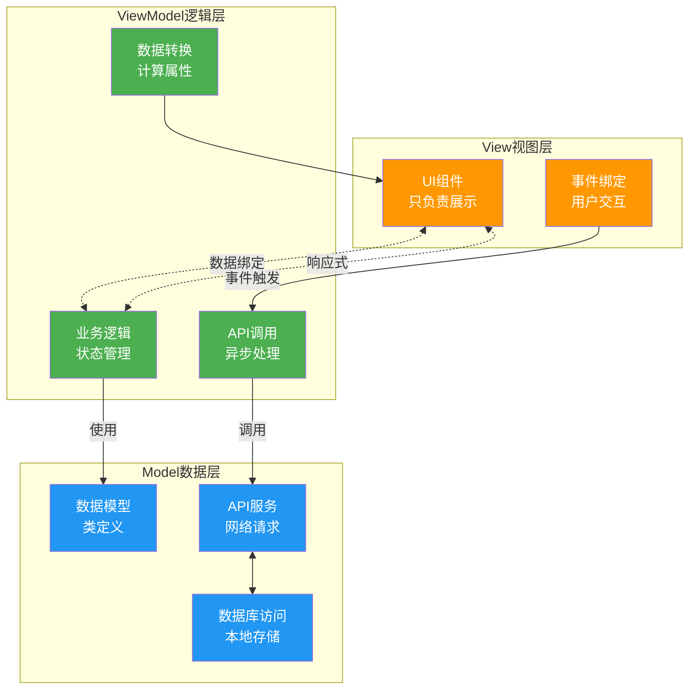
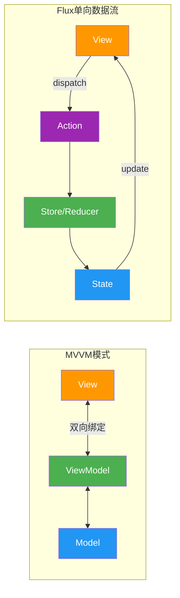

# 22-状态管理最佳实践 - 企业级应用状态设计指南

> **适合人群**: 开发中大型鸿蒙应用的架构师和高级开发者
> **阅读时间**: 20分钟
> **核心内容**: 状态设计原则、架构模式、性能优化、调试技巧

---

## 🎯 你将面临的挑战

随着应用规模扩大,状态管理会遇到这些问题:

### 挑战1: 状态混乱

```typescript
// ❌ 糟糕的状态组织
@Entry
@Component
struct OrderPage {
  @State userName: string = ''  // 用户信息
  @State userId: string = ''
  @State userAvatar: string = ''

  @State orderId: string = ''  // 订单信息
  @State orderStatus: string = ''
  @State orderTotal: number = 0

  @State showLoading: boolean = false  // UI状态
  @State showError: boolean = false
  @State errorMessage: string = ''

  @State currentTab: number = 0  // 页面状态
  @State scrollPosition: number = 0
  // ... 20个@State,难以维护!
}
```

### 挑战2: 性能问题

```typescript
// ❌ 过度渲染
@Component
struct UserCard {
  @ObjectLink user: User  // user对象很大

  build() {
    Row() {
      Text(this.user.name)  // 只用了name字段
      // 但user的任何字段变化都会导致重新渲染!
    }
  }
}
```

### 挑战3: 数据同步

```typescript
// ❌ 多处修改,状态不一致
// 页面A修改了用户信息
AppStorage.set('userName', '李四')

// 页面B读取时还是旧数据
const name = AppStorage.get('userName')  // 可能是'张三'

// 页面C通过API又更新了一次
this.updateUserName('王五')
// 三个页面数据不一致!
```

**本文将解决这些问题**,教你设计**可维护、高性能、可扩展**的状态管理系统。

---

## 📚 目录

1. **状态设计原则**: 5大核心原则
2. **架构模式**: MVVM vs Flux vs 自定义
3. **状态分层**: 领域/应用/UI三层架构
4. **性能优化**: 8大优化技巧
5. **实战**: 电商应用完整架构
6. **调试技巧**: 状态追踪与时间旅行
7. **常见陷阱**: 避坑指南

---

## 一、状态设计五大原则

### 原则1: 单一数据源 (Single Source of Truth)

**错误示例**:

```typescript
// ❌ 同一份数据分散在多处
@Component
struct UserProfile {
  @State userName: string = '张三'  // 第1处
}

@Component
struct UserSettings {
  @State userName: string = '张三'  // 第2处,重复!
}

AppStorage.setOrCreate('userName', '张三')  // 第3处,又重复!
```

**正确示例**:

```typescript
// ✅ 可运行代码
// ✅ 唯一数据源: AppStorage
AppStorage.setOrCreate('userName', '张三')

@Component
struct UserProfile {
  @StorageProp('userName') userName: string = ''  // 从AppStorage读取
}

@Component
struct UserSettings {
  @StorageLink('userName') userName: string = ''  // 从AppStorage读取
}
```

**原则总结**:
- ✅ 每个状态只有**一个权威来源**
- ✅ 所有组件从同一来源读取
- ✅ 修改时只更新唯一来源

---

### 原则2: 状态最小化 (Minimal State)

**错误示例**:

```typescript
// ❌ 存储冗余的派生状态
@Observed
class ShoppingCart {
  items: Product[] = []
  totalPrice: number = 0  // ❌ 可以从items计算得出
  totalCount: number = 0  // ❌ 可以从items计算得出
  isEmpty: boolean = true  // ❌ 可以从items计算得出
}
```

**正确示例**:

```typescript
// ✅ 可运行代码
// ✅ 只存储必需的基础状态
@Observed
class ShoppingCart {
  items: Product[] = []  // 唯一的真实数据

  // 派生状态用getter计算
  get totalPrice(): number {
    return this.items.reduce((sum, item) => sum + item.price * item.quantity, 0)
  }

  get totalCount(): number {
    return this.items.reduce((sum, item) => sum + item.quantity, 0)
  }

  get isEmpty(): boolean {
    return this.items.length === 0
  }
}
```

**好处**:
- ✅ 减少内存占用
- ✅ 避免数据不一致(派生数据总是最新的)
- ✅ 简化更新逻辑(只需更新items)

---

### 原则3: 不可变更新 (Immutable Updates)

**错误示例**:

```typescript
// ❌ 直接修改对象,ArkTS无法检测到变化
@State user: User = { name: '张三', age: 25 }

this.user.name = '李四'  // ❌ 不会触发UI更新!
```

**正确示例**:

```typescript
// ✅ 可运行代码
// ✅ 创建新对象
@State user: User = { name: '张三', age: 25 }

this.user = { ...this.user, name: '李四' }  // ✅ 触发更新

// ✅ 数组更新
@State list: number[] = [1, 2, 3]
this.list = [...this.list, 4]  // 添加元素
this.list = this.list.filter(n => n !== 2)  // 删除元素
```

**原则总结**:
- ✅ 永远不要直接修改对象/数组
- ✅ 总是创建新对象/数组
- ✅ 使用展开运算符`...`复制

---

### 原则4: 状态与UI分离 (Separation of Concerns)

**错误示例**:

```typescript
// ❌ 业务逻辑和UI耦合
@Component
struct ProductList {
  @State products: Product[] = []
  @State loading: boolean = false

  build() {
    Column() {
      if (this.loading) {
        LoadingSpinner()
      }

      Button('加载商品')
        .onClick(() => {
          // ❌ 业务逻辑写在UI中
          this.loading = true
          fetch('https://api.example.com/products')
            .then(res => res.json())
            .then(data => {
              this.products = data
              this.loading = false
            })
            .catch(err => {
              this.loading = false
              console.error(err)
            })
        })
    }
  }
}
```

**正确示例**:

```typescript
// ✅ 可运行代码
// ✅ 分离业务逻辑到ViewModel
class ProductViewModel {
  products: Product[] = []
  loading: boolean = false
  error: string = ''

  async loadProducts() {
    this.loading = true
    this.error = ''

    try {
      const res = await fetch('https://api.example.com/products')
      this.products = await res.json()
    } catch (err) {
      this.error = '加载失败'
    } finally {
      this.loading = false
    }
  }
}

// ✅ UI只负责展示
@Component
struct ProductList {
  @State viewModel: ProductViewModel = new ProductViewModel()

  build() {
    Column() {
      if (this.viewModel.loading) {
        LoadingSpinner()
      }

      if (this.viewModel.error) {
        Text(this.viewModel.error).fontColor(Color.Red)
      }

      List() {
        ForEach(this.viewModel.products, (product: Product) => {
          ListItem() {
            ProductCard({ product })
          }
        })
      }

      Button('加载商品')
        .onClick(() => {
          this.viewModel.loadProducts()  // 调用ViewModel方法
        })
    }
  }
}
```

---

### 原则5: 按需订阅 (Subscribe Only What You Need)

**错误示例**:

```typescript
// ❌ 订阅整个大对象
@Observed
class AppState {
  user: User = { /* 100个字段 */ }
  theme: Theme = { /* 50个字段 */ }
  settings: Settings = { /* 80个字段 */ }
}

@Component
struct UserAvatar {
  @ObjectLink appState: AppState  // ❌ 订阅了整个AppState

  build() {
    Image(this.appState.user.avatar)  // 只用了avatar字段
    // 但appState的任何字段变化都会触发重渲染!
  }
}
```

**正确示例**:

```typescript
// ✅ 可运行代码
// ✅ 只订阅需要的字段
@Component
struct UserAvatar {
  @Prop avatar: string  // ✅ 只订阅avatar

  build() {
    Image(this.avatar)  // 只有avatar变化才重渲染
  }
}

// 父组件传递
@Component
struct ParentPage {
  @ObjectLink appState: AppState

  build() {
    Column() {
      UserAvatar({ avatar: this.appState.user.avatar })  // 传递单个字段
    }
  }
}
```

---

## 二、架构模式选择

### 2.1 MVVM模式 (推荐)

**MVVM架构图**:



**MVVM vs Flux架构对比**:



**架构图**:

```typescript
// ✅ 可运行代码
┌──────────────────────────────────────────┐
│              View (UI层)                  │
│  @Component - 只负责展示和事件绑定           │
└──────────────────────────────────────────┘
              ↕ (数据绑定)
┌──────────────────────────────────────────┐
│           ViewModel (逻辑层)              │
│  业务逻辑、状态管理、API调用                │
└──────────────────────────────────────────┘
              ↕ (调用)
┌──────────────────────────────────────────┐
│            Model (数据层)                 │
│  数据模型、API服务、数据库访问              │
└──────────────────────────────────────────┘
```

**代码示例**:

```typescript
// ✅ 可运行代码
// === Model (数据层) ===
export class Product {
  id: string
  name: string
  price: number
  image: string
}

export class ProductService {
  static async getProducts(): Promise<Product[]> {
    const response = await fetch('https://api.example.com/products')
    return response.json()
  }

  static async getProductById(id: string): Promise<Product> {
    const response = await fetch(`https://api.example.com/products/${id}`)
    return response.json()
  }
}

// === ViewModel (逻辑层) ===
@Observed
export class ProductListViewModel {
  products: Product[] = []
  loading: boolean = false
  error: string = ''
  searchKeyword: string = ''

  // 加载商品列表
  async loadProducts() {
    this.loading = true
    this.error = ''

    try {
      this.products = await ProductService.getProducts()
    } catch (err) {
      this.error = '加载失败,请重试'
    } finally {
      this.loading = false
    }
  }

  // 搜索商品
  get filteredProducts(): Product[] {
    if (!this.searchKeyword) {
      return this.products
    }

    return this.products.filter(p =>
      p.name.toLowerCase().includes(this.searchKeyword.toLowerCase())
    )
  }

  // 更新搜索关键词
  updateSearchKeyword(keyword: string) {
    this.searchKeyword = keyword
  }
}

// === View (UI层) ===
@Entry
@Component
struct ProductListPage {
  @State viewModel: ProductListViewModel = new ProductListViewModel()

  aboutToAppear() {
    this.viewModel.loadProducts()
  }

  build() {
    Column() {
      // 搜索框
      TextInput({
        placeholder: '搜索商品',
        text: this.viewModel.searchKeyword
      })
        .onChange((value) => {
          this.viewModel.updateSearchKeyword(value)
        })

      // 加载状态
      if (this.viewModel.loading) {
        LoadingSpinner()
      }

      // 错误提示
      if (this.viewModel.error) {
        Text(this.viewModel.error)
          .fontColor(Color.Red)
      }

      // 商品列表
      List() {
        ForEach(this.viewModel.filteredProducts, (product: Product) => {
          ListItem() {
            ProductCard({ product })
          }
        }, (product: Product) => product.id)
      }
    }
  }
}
```

**优点**:
- ✅ 职责清晰: View只管展示,ViewModel处理逻辑
- ✅ 易于测试: ViewModel可独立测试
- ✅ 易于维护: 逻辑和UI解耦

---

### 2.2 Flux单向数据流

**架构图**:

```typescript
// ✅ 可运行代码
┌──────┐   dispatch   ┌──────────┐   update   ┌───────┐
│ View │ ───────────→ │  Store   │ ─────────→ │ View  │
└──────┘              └──────────┘            └───────┘
                            ↑
                       (Reducer处理)
```

**代码示例**:

```typescript
// ✅ 可运行代码
// === Action (动作) ===
export enum ActionType {
  SET_THEME = 'SET_THEME',
  ADD_TO_CART = 'ADD_TO_CART',
  REMOVE_FROM_CART = 'REMOVE_FROM_CART'
}

export interface Action {
  type: ActionType
  payload?: any
}

// === Store (状态存储) ===
@Observed
class AppStore {
  theme: string = 'light'
  cartItems: Product[] = []

  // Reducer: 根据Action更新状态
  dispatch(action: Action) {
    switch (action.type) {
      case ActionType.SET_THEME:
        this.theme = action.payload
        break

      case ActionType.ADD_TO_CART:
        this.cartItems = [...this.cartItems, action.payload]
        break

      case ActionType.REMOVE_FROM_CART:
        this.cartItems = this.cartItems.filter(item => item.id !== action.payload)
        break
    }
  }
}

// 全局单例Store
export const store = new AppStore()

// === View使用Store ===
@Entry
@Component
struct CartPage {
  @ObjectLink store: AppStore

  build() {
    Column() {
      List() {
        ForEach(this.store.cartItems, (item: Product) => {
          ListItem() {
            Row() {
              Text(item.name)
              Button('删除')
                .onClick(() => {
                  // Dispatch Action
                  this.store.dispatch({
                    type: ActionType.REMOVE_FROM_CART,
                    payload: item.id
                  })
                })
            }
          }
        })
      }
    }
  }
}
```

**优点**:
- ✅ 数据流清晰: 单向流动,易于追踪
- ✅ 状态可预测: 所有变更通过dispatch
- ✅ 易于调试: 可记录所有Action

**缺点**:
- ⚠️ 代码量大: 需要定义Action、Reducer
- ⚠️ 小项目过度: 简单应用不需要这么复杂

---

## 三、状态分层架构

### 3.1 三层架构设计

**状态分层架构图**:

```mermaid
graph TB
    subgraph UI状态层-组件级
        U1[showLoading<br/>showDialog]
        U2[currentTab<br/>scrollPosition]
        U3[临时表单数据]
    end

    subgraph 应用状态层-全局级
        A1[theme<br/>language]
        A2[userInfo<br/>isLoggedIn]
        A3[全局配置]
    end

    subgraph 领域状态层-业务级
        D1[productList<br/>orderHistory]
        D2[shoppingCart<br/>favorites]
        D3[userProfile]
    end

    subgraph 存储方案
        S1[@State<br/>组件内]
        S2[AppStorage<br/>内存]
        S3[PersistentStorage<br/>磁盘]
    end

    U1 --> S1
    U2 --> S1
    U3 --> S1
    A1 --> S2
    A2 --> S2
    A3 --> S3
    D1 --> S2
    D2 --> S3
    D3 --> S3

    style U1 fill:#FF9800,color:#fff
    style U2 fill:#FF9800,color:#fff
    style U3 fill:#FF9800,color:#fff
    style A1 fill:#4CAF50,color:#fff
    style A2 fill:#4CAF50,color:#fff
    style A3 fill:#4CAF50,color:#fff
    style D1 fill:#2196F3,color:#fff
    style D2 fill:#2196F3,color:#fff
    style D3 fill:#2196F3,color:#fff
    style S1 fill:#9C27B0,color:#fff
    style S2 fill:#9C27B0,color:#fff
    style S3 fill:#9C27B0,color:#fff
```

```typescript
// ✅ 可运行代码
┌──────────────────────────────────────────┐
│        UI State (UI状态层)                 │
│  - showLoading, showDialog               │
│  - currentTab, scrollPosition            │
│  (生命周期: 组件存在期)                     │
└──────────────────────────────────────────┘
              ↕
┌──────────────────────────────────────────┐
│      Application State (应用状态层)        │
│  - theme, language, userPreferences      │
│  - currentUser, isLoggedIn               │
│  (生命周期: 应用运行期, AppStorage存储)     │
└──────────────────────────────────────────┘
              ↕
┌──────────────────────────────────────────┐
│       Domain State (领域状态层)            │
│  - productList, orderHistory             │
│  - userProfile, shoppingCart             │
│  (生命周期: 按需加载, 可持久化)             │
└──────────────────────────────────────────┘
```

### 3.2 代码实现

```typescript
// ✅ 可运行代码
// === UI State (组件内状态) ===
@Component
struct ProductDetailPage {
  @State showShareDialog: boolean = false  // UI状态
  @State currentImageIndex: number = 0  // UI状态

  build() {
    Column() {
      // UI状态只在当前组件使用
      if (this.showShareDialog) {
        ShareDialog()
      }
    }
  }
}

// === Application State (应用级状态) ===
// 初始化
AppStorage.setOrCreate('theme', 'light')
AppStorage.setOrCreate('language', 'zh-CN')
AppStorage.setOrCreate('isLoggedIn', false)

@Entry
@Component
struct HomePage {
  @StorageLink('theme') theme: string = 'light'  // 应用状态
  @StorageLink('isLoggedIn') isLoggedIn: boolean = false  // 应用状态

  build() {
    Column() {
      if (this.isLoggedIn) {
        UserPanel()
      } else {
        LoginButton()
      }
    }
  }
}

// === Domain State (领域状态) ===
@Observed
class ProductDomain {
  products: Product[] = []
  categories: Category[] = []

  async loadProducts() {
    this.products = await ProductService.getProducts()
  }
}

@Observed
class UserDomain {
  profile: UserProfile | null = null
  orders: Order[] = []

  async login(username: string, password: string) {
    this.profile = await AuthService.login(username, password)
    AppStorage.set('isLoggedIn', true)  // 更新应用状态
  }

  async logout() {
    this.profile = null
    this.orders = []
    AppStorage.set('isLoggedIn', false)
  }
}
```

---

## 四、性能优化8大技巧

### 技巧1: 使用@Prop传递基础类型

```typescript
// ❌ 性能差: 传递整个对象
@Component
struct UserCard {
  @ObjectLink user: User  // user有50个字段

  build() {
    Text(this.user.name)  // 只用了name
    // 但user的任何字段变化都会重渲染
  }
}

// ✅ 性能好: 只传递需要的字段
@Component
struct UserCard {
  @Prop name: string
  @Prop avatar: string

  build() {
    Row() {
      Image(this.avatar)
      Text(this.name)
    }
    // 只有name或avatar变化才重渲染
  }
}
```

### 技巧2: 使用@Computed避免重复计算

```typescript
// ❌ 每次渲染都重新计算
@Component
struct ProductList {
  @State products: Product[] = []

  build() {
    Column() {
      // 每次build都调用filter, 性能差
      Text(`在售商品数: ${this.products.filter(p => p.inStock).length}`)

      List() {
        ForEach(this.products.filter(p => p.inStock), (product: Product) => {
          ListItem() { ProductCard({ product }) }
        })
      }
    }
  }
}

// ✅ 使用getter缓存计算结果
@Observed
class ProductListViewModel {
  products: Product[] = []

  // getter会自动缓存,只在products变化时重新计算
  get inStockProducts(): Product[] {
    return this.products.filter(p => p.inStock)
  }

  get inStockCount(): number {
    return this.inStockProducts.length
  }
}

@Component
struct ProductList {
  @State viewModel: ProductListViewModel = new ProductListViewModel()

  build() {
    Column() {
      Text(`在售商品数: ${this.viewModel.inStockCount}`)  // ✅ 使用缓存结果

      List() {
        ForEach(this.viewModel.inStockProducts, (product: Product) => {
          ListItem() { ProductCard({ product }) }
        })
      }
    }
  }
}
```

### 技巧3: 拆分大组件

```typescript
// ❌ 巨大的组件,任何状态变化都重渲染全部
@Component
struct OrderDetailPage {
  @State order: Order = {}

  build() {
    Column() {
      // 头部信息 (100行代码)
      Text(this.order.orderNo)
      Text(this.order.createTime)
      // ...

      // 商品列表 (200行代码)
      List() {
        ForEach(this.order.items, (item: OrderItem) => {
          // ...
        })
      }

      // 物流信息 (150行代码)
      // ...

      // 评价区域 (100行代码)
      // ...
    }
  }
}

// ✅ 拆分为多个小组件,按需更新
@Component
struct OrderDetailPage {
  @State order: Order = {}

  build() {
    Column() {
      OrderHeader({ orderNo: this.order.orderNo, createTime: this.order.createTime })
      OrderItemList({ items: this.order.items })
      OrderLogistics({ trackingInfo: this.order.tracking })
      OrderReviews({ reviews: this.order.reviews })
    }
  }
}

@Component
struct OrderHeader {
  @Prop orderNo: string
  @Prop createTime: string

  build() {
    // 只有orderNo或createTime变化才重渲染
    Row() {
      Text(this.orderNo)
      Text(this.createTime)
    }
  }
}
```

### 技巧4: 使用LazyForEach延迟加载

```typescript
// ❌ 一次性渲染1000条数据
@Component
struct ProductList {
  @State products: Product[] = []  // 1000条数据

  build() {
    List() {
      ForEach(this.products, (product: Product) => {
        ListItem() {
          ProductCard({ product })  // 渲染1000个组件,卡顿!
        }
      })
    }
  }
}

// ✅ 懒加载,按需渲染可见区域
class ProductDataSource implements IDataSource {
  private products: Product[] = []

  totalCount(): number {
    return this.products.length
  }

  getData(index: number): Product {
    return this.products[index]
  }

  registerDataChangeListener(listener: DataChangeListener): void {
    // ...
  }

  unregisterDataChangeListener(listener: DataChangeListener): void {
    // ...
  }
}

@Component
struct ProductList {
  private dataSource: ProductDataSource = new ProductDataSource()

  build() {
    List() {
      LazyForEach(this.dataSource, (product: Product, index: number) => {
        ListItem() {
          ProductCard({ product })  // 只渲染可见区域的组件
        }
      }, (product: Product) => product.id)
    }
  }
}
```

### 技巧5: 避免在build中创建对象

```typescript
// ❌ 每次渲染都创建新对象
@Component
struct ProductCard {
  @Prop product: Product

  build() {
    Row() {
      Text(this.product.name)
        .fontSize(16)
        .fontColor({ r: 51, g: 51, b: 51 })  // ❌ 每次build创建新颜色对象
    }
  }
}

// ✅ 提取为常量
const TEXT_COLOR: Color = { r: 51, g: 51, b: 51 }  // ✅ 只创建一次

@Component
struct ProductCard {
  @Prop product: Product

  build() {
    Row() {
      Text(this.product.name)
        .fontSize(16)
        .fontColor(TEXT_COLOR)  // ✅ 复用常量
    }
  }
}
```

### 技巧6: 批量更新状态

```typescript
// ❌ 多次触发更新
@Component
struct UserForm {
  @State user: User = { name: '', age: 0, email: '' }

  onSubmit() {
    this.user.name = 'New Name'  // 触发更新1
    this.user.age = 30  // 触发更新2
    this.user.email = 'new@example.com'  // 触发更新3
    // 触发3次重渲染!
  }
}

// ✅ 一次性更新
@Component
struct UserForm {
  @State user: User = { name: '', age: 0, email: '' }

  onSubmit() {
    this.user = {
      ...this.user,
      name: 'New Name',
      age: 30,
      email: 'new@example.com'
    }
    // 只触发1次重渲染!
  }
}
```

### 技巧7: 使用@Provide/@Consume跨层传递

```typescript
// ❌ 逐层传递props
@Entry
@Component
struct App {
  @State theme: string = 'light'

  build() {
    Column() {
      HomePage({ theme: this.theme })
    }
  }
}

@Component
struct HomePage {
  @Prop theme: string

  build() {
    Column() {
      ContentArea({ theme: this.theme })  // 传递给子组件
    }
  }
}

@Component
struct ContentArea {
  @Prop theme: string

  build() {
    Column() {
      ProductCard({ theme: this.theme })  // 继续传递
    }
  }
}

// ✅ 使用@Provide/@Consume跨层传递
@Entry
@Component
struct App {
  @Provide('theme') theme: string = 'light'

  build() {
    Column() {
      HomePage()  // 不需要传递theme
    }
  }
}

@Component
struct ProductCard {
  @Consume('theme') theme: string  // 直接消费,跳过中间层

  build() {
    Row() {
      Text('Product')
        .fontColor(this.theme === 'dark' ? Color.White : Color.Black)
    }
  }
}
```

### 技巧8: 防抖和节流

```typescript
// ❌ 频繁触发搜索
@Component
struct SearchBar {
  @State keyword: string = ''

  build() {
    TextInput({ text: this.keyword })
      .onChange((value) => {
        this.keyword = value
        this.search(value)  // ❌ 每输入一个字符就搜索一次
      })
  }

  search(keyword: string) {
    // 调用API搜索...
  }
}

// ✅ 使用防抖,300ms内只执行最后一次
@Component
struct SearchBar {
  @State keyword: string = ''
  private searchTimer: number = -1

  build() {
    TextInput({ text: this.keyword })
      .onChange((value) => {
        this.keyword = value
        this.debouncedSearch(value)  // ✅ 防抖搜索
      })
  }

  debouncedSearch(keyword: string) {
    clearTimeout(this.searchTimer)
    this.searchTimer = setTimeout(() => {
      this.search(keyword)
    }, 300)  // 300ms延迟
  }

  search(keyword: string) {
    // 调用API搜索...
  }
}
```

---

## 五、实战: 电商应用完整架构

完整的电商应用状态管理系统:

### 5.1 目录结构

```typescript
// ✅ 可运行代码
src/
├── models/               # 数据模型
│   ├── Product.ets
│   ├── User.ets
│   └── Order.ets
├── services/             # API服务
│   ├── ProductService.ets
│   ├── UserService.ets
│   └── OrderService.ets
├── viewmodels/           # ViewModel
│   ├── ProductListViewModel.ets
│   ├── CartViewModel.ets
│   └── UserViewModel.ets
├── stores/               # 全局Store
│   ├── AppStore.ets
│   └── index.ets
├── pages/                # 页面组件
│   ├── HomePage.ets
│   ├── ProductDetailPage.ets
│   └── CartPage.ets
└── components/           # 通用组件
    ├── ProductCard.ets
    └── LoadingSpinner.ets
```

### 5.2 全局Store设计

```typescript
// ✅ 可运行代码
// stores/AppStore.ets

import { User } from '../models/User'
import { Product } from '../models/Product'

@Observed
export class AppStore {
  // === 用户相关 ===
  currentUser: User | null = null
  isLoggedIn: boolean = false

  // === 购物车 ===
  cartItems: Product[] = []

  // === 应用设置 ===
  theme: string = 'light'
  language: string = 'zh-CN'

  // === 用户操作 ===
  login(user: User) {
    this.currentUser = user
    this.isLoggedIn = true
    AppStorage.set('isLoggedIn', true)
  }

  logout() {
    this.currentUser = null
    this.isLoggedIn = false
    this.cartItems = []
    AppStorage.set('isLoggedIn', false)
  }

  // === 购物车操作 ===
  addToCart(product: Product) {
    this.cartItems = [...this.cartItems, product]
    this.saveCartToPersistent()
  }

  removeFromCart(productId: string) {
    this.cartItems = this.cartItems.filter(item => item.id !== productId)
    this.saveCartToPersistent()
  }

  clearCart() {
    this.cartItems = []
    this.saveCartToPersistent()
  }

  // 计算购物车总价
  get cartTotalPrice(): number {
    return this.cartItems.reduce((sum, item) => sum + item.price, 0)
  }

  // === 持久化 ===
  private saveCartToPersistent() {
    AppStorage.set('cart', JSON.stringify(this.cartItems))
  }

  loadCartFromPersistent() {
    const cartJson = AppStorage.get<string>('cart') || '[]'
    this.cartItems = JSON.parse(cartJson)
  }
}

// 导出全局单例
export const appStore = new AppStore()
```

### 5.3 初始化Store

```typescript
// ✅ 可运行代码
// entryability/EntryAbility.ts

import { appStore } from '../stores/AppStore'

export default class EntryAbility extends UIAbility {
  onCreate(want, launchParam) {
    // 持久化配置
    PersistentStorage.persistProp('theme', 'light')
    PersistentStorage.persistProp('language', 'zh-CN')
    PersistentStorage.persistProp('isLoggedIn', false)
    PersistentStorage.persistProp('cart', '[]')

    // 初始化AppStorage
    AppStorage.setOrCreate('theme', 'light')
    AppStorage.setOrCreate('language', 'zh-CN')
    AppStorage.setOrCreate('isLoggedIn', false)
    AppStorage.setOrCreate('cart', '[]')

    // 从持久化加载购物车
    appStore.loadCartFromPersistent()
  }
}
```

### 5.4 商品列表ViewModel

```typescript
// ✅ 可运行代码
// viewmodels/ProductListViewModel.ets

import { Product } from '../models/Product'
import { ProductService } from '../services/ProductService'
import { appStore } from '../stores/AppStore'

@Observed
export class ProductListViewModel {
  products: Product[] = []
  loading: boolean = false
  error: string = ''

  // 分类筛选
  currentCategory: string = 'all'
  categories: string[] = ['all', 'electronics', 'clothing', 'food']

  // 排序
  sortBy: 'price' | 'name' | 'popular' = 'popular'

  // 加载商品
  async loadProducts() {
    this.loading = true
    this.error = ''

    try {
      this.products = await ProductService.getProducts()
    } catch (err) {
      this.error = '加载失败'
    } finally {
      this.loading = false
    }
  }

  // 筛选和排序后的商品列表
  get filteredProducts(): Product[] {
    let result = this.products

    // 分类筛选
    if (this.currentCategory !== 'all') {
      result = result.filter(p => p.category === this.currentCategory)
    }

    // 排序
    switch (this.sortBy) {
      case 'price':
        result = [...result].sort((a, b) => a.price - b.price)
        break
      case 'name':
        result = [...result].sort((a, b) => a.name.localeCompare(b.name))
        break
      case 'popular':
        result = [...result].sort((a, b) => b.sales - a.sales)
        break
    }

    return result
  }

  // 切换分类
  selectCategory(category: string) {
    this.currentCategory = category
  }

  // 切换排序
  changeSortBy(sortBy: 'price' | 'name' | 'popular') {
    this.sortBy = sortBy
  }

  // 添加到购物车
  addToCart(product: Product) {
    appStore.addToCart(product)
  }
}
```

### 5.5 商品列表页面

```typescript
// ✅ 可运行代码
// pages/ProductListPage.ets

import { ProductListViewModel } from '../viewmodels/ProductListViewModel'
import { Product } from '../models/Product'

@Entry
@Component
struct ProductListPage {
  @State viewModel: ProductListViewModel = new ProductListViewModel()
  @StorageLink('cart') cartJson: string = '[]'

  // 计算购物车数量
  get cartCount(): number {
    const cart = JSON.parse(this.cartJson)
    return cart.length
  }

  aboutToAppear() {
    this.viewModel.loadProducts()
  }

  build() {
    Column() {
      // 顶部导航栏
      Row() {
        Text('商品列表').fontSize(20).fontWeight(FontWeight.Bold)
        Blank()
        Badge({
          count: this.cartCount,
          position: BadgePosition.Right
        }) {
          Image($r('app.media.cart_icon'))
            .width(24)
            .height(24)
            .onClick(() => {
              router.pushUrl({ url: 'pages/CartPage' })
            })
        }
      }
      .width('100%')
      .padding(16)

      // 分类筛选
      Row({ space: 12 }) {
        ForEach(this.viewModel.categories, (category: string) => {
          Text(category)
            .fontSize(14)
            .padding({ left: 16, right: 16, top: 8, bottom: 8 })
            .backgroundColor(
              this.viewModel.currentCategory === category ? '#007AFF' : '#F5F5F5'
            )
            .fontColor(
              this.viewModel.currentCategory === category ? Color.White : Color.Black
            )
            .borderRadius(16)
            .onClick(() => {
              this.viewModel.selectCategory(category)
            })
        })
      }
      .width('100%')
      .padding({ left: 16, right: 16 })

      // 排序选项
      Row({ space: 16 }) {
        Text('排序:')
        Text('热门')
          .fontColor(this.viewModel.sortBy === 'popular' ? '#007AFF' : '#333')
          .onClick(() => this.viewModel.changeSortBy('popular'))
        Text('价格')
          .fontColor(this.viewModel.sortBy === 'price' ? '#007AFF' : '#333')
          .onClick(() => this.viewModel.changeSortBy('price'))
        Text('名称')
          .fontColor(this.viewModel.sortBy === 'name' ? '#007AFF' : '#333')
          .onClick(() => this.viewModel.changeSortBy('name'))
      }
      .width('100%')
      .padding(16)

      // 加载状态
      if (this.viewModel.loading) {
        LoadingSpinner()
      }

      // 错误提示
      if (this.viewModel.error) {
        Text(this.viewModel.error).fontColor(Color.Red)
      }

      // 商品列表
      List({ space: 16 }) {
        ForEach(this.viewModel.filteredProducts, (product: Product) => {
          ListItem() {
            this.ProductCard(product)
          }
        }, (product: Product) => product.id)
      }
      .layoutWeight(1)
      .padding({ left: 16, right: 16 })
    }
    .width('100%')
    .height('100%')
  }

  @Builder
  ProductCard(product: Product) {
    Column({ space: 8 }) {
      Image(product.image)
        .width('100%')
        .height(200)
        .objectFit(ImageFit.Cover)
        .borderRadius(12)

      Text(product.name)
        .fontSize(16)
        .fontWeight(FontWeight.Bold)

      Row() {
        Text(`¥${product.price}`)
          .fontSize(20)
          .fontColor('#FF3B30')
        Blank()
        Button('加入购物车')
          .fontSize(14)
          .onClick(() => {
            this.viewModel.addToCart(product)
          })
      }
      .width('100%')
    }
    .width('100%')
    .padding(12)
    .backgroundColor(Color.White)
    .borderRadius(12)
  }
}
```

---

## 六、调试技巧

### 6.1 状态变化日志

```typescript
// ✅ 可运行代码
// 创建状态变化追踪器
class StateLogger {
  static log(stateName: string, oldValue: any, newValue: any) {
    console.log(`[State Change] ${stateName}:`, {
      old: oldValue,
      new: newValue,
      timestamp: new Date().toISOString()
    })
  }
}

// 在状态更新时记录
@Component
struct ProductList {
  private _products: Product[] = []

  set products(value: Product[]) {
    StateLogger.log('products', this._products, value)
    this._products = value
  }

  get products(): Product[] {
    return this._products
  }
}
```

### 6.2 时间旅行调试

```typescript
// ✅ 可运行代码
// 记录状态历史
class StateHistory<T> {
  private history: T[] = []
  private currentIndex: number = -1

  push(state: T) {
    // 清除当前索引之后的历史
    this.history = this.history.slice(0, this.currentIndex + 1)
    this.history.push(state)
    this.currentIndex = this.history.length - 1
  }

  undo(): T | null {
    if (this.currentIndex > 0) {
      this.currentIndex--
      return this.history[this.currentIndex]
    }
    return null
  }

  redo(): T | null {
    if (this.currentIndex < this.history.length - 1) {
      this.currentIndex++
      return this.history[this.currentIndex]
    }
    return null
  }
}

// 使用
@Observed
class TodoListViewModel {
  todos: Todo[] = []
  private history = new StateHistory<Todo[]>()

  addTodo(todo: Todo) {
    this.todos = [...this.todos, todo]
    this.history.push(this.todos)  // 记录历史
  }

  undo() {
    const previousState = this.history.undo()
    if (previousState) {
      this.todos = previousState
    }
  }

  redo() {
    const nextState = this.history.redo()
    if (nextState) {
      this.todos = nextState
    }
  }
}
```

---

## 七、常见陷阱

### 陷阱1: 忘记不可变更新

```typescript
// ❌ 直接修改数组,UI不更新
this.items.push(newItem)

// ✅ 创建新数组
this.items = [...this.items, newItem]
```

### 陷阱2: 过度使用AppStorage

```typescript
// ❌ 所有状态都放AppStorage
AppStorage.setOrCreate('scrollPosition', 0)  // 临时UI状态不应该全局
AppStorage.setOrCreate('tempFormData', {})  // 临时表单数据不应该全局

// ✅ 只存储真正需要全局共享的状态
AppStorage.setOrCreate('theme', 'light')
AppStorage.setOrCreate('userInfo', {})
```

### 陷阱3: 循环引用导致内存泄漏

```typescript
// ❌ 循环引用
@Observed
class Parent {
  child: Child
}

@Observed
class Child {
  parent: Parent  // 循环引用!
}

// ✅ 使用ID引用
@Observed
class Parent {
  childId: string
}

@Observed
class Child {
  parentId: string
}
```

---

## 📌 本章总结

### 五大原则
1. ✅ 单一数据源
2. ✅ 状态最小化
3. ✅ 不可变更新
4. ✅ 状态与UI分离
5. ✅ 按需订阅

### 架构模式
- ✅ MVVM: 中小型应用首选
- ✅ Flux: 大型应用,需要严格数据流控制

### 性能优化
- ✅ 使用@Prop传递基础类型
- ✅ 使用getter缓存计算结果
- ✅ 拆分大组件
- ✅ LazyForEach延迟加载
- ✅ 批量更新状态
- ✅ 防抖节流

---

## 🎯 下一步

恭喜完成**状态管理**章节!下一章将学习 **《23-Actor并发模型深度解析》**:
- Actor并发理论
- TaskPool vs Worker
- 多线程数据传递
- 并发性能优化

---

> 💡 **最佳实践**: 选择合适的架构模式,遵循设计原则,注重性能优化,才能构建高质量的鸿蒙应用!
