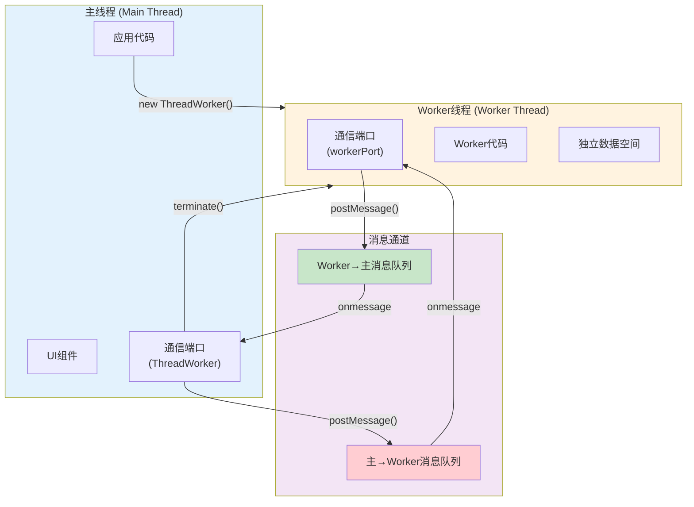
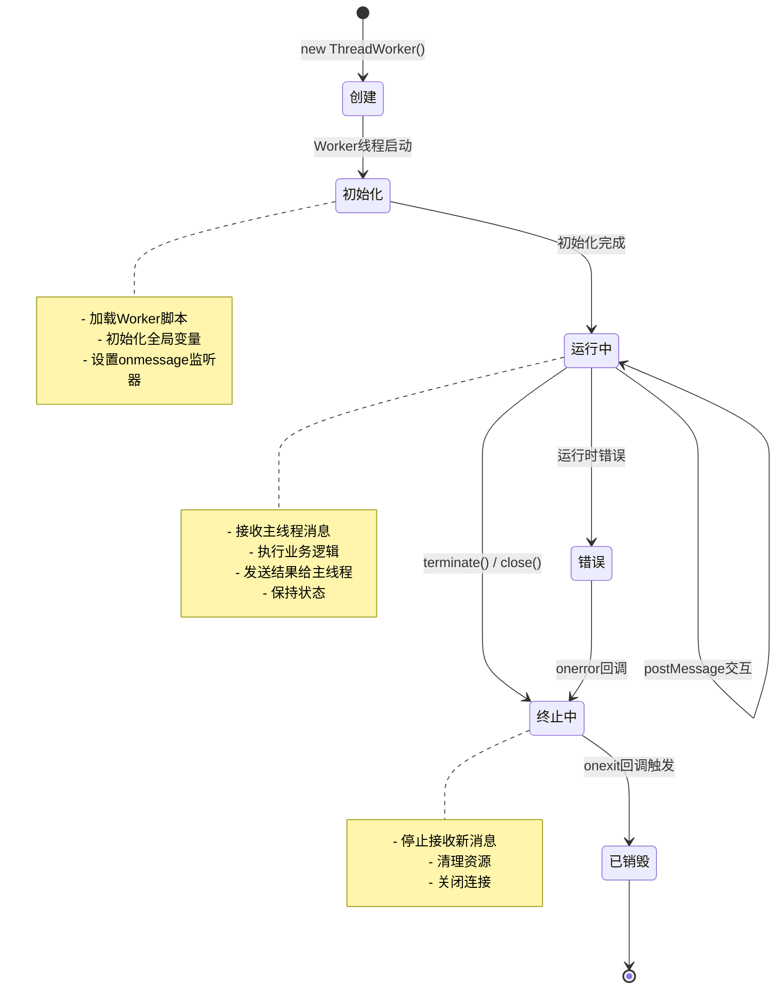
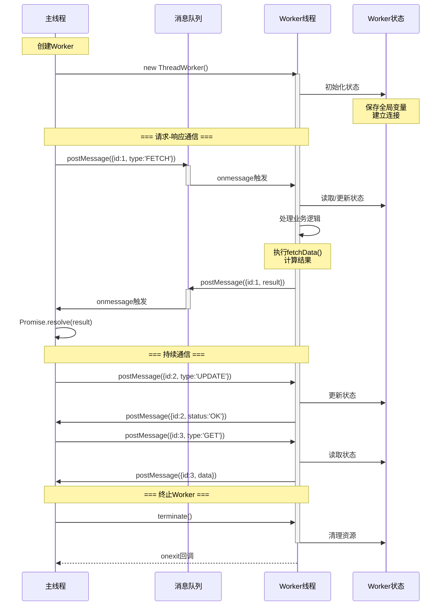
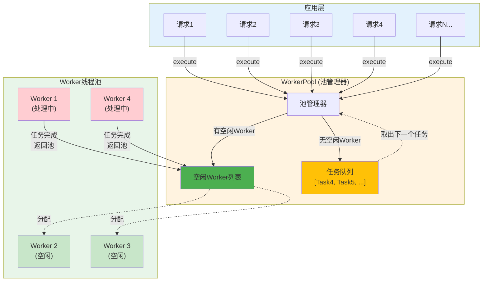
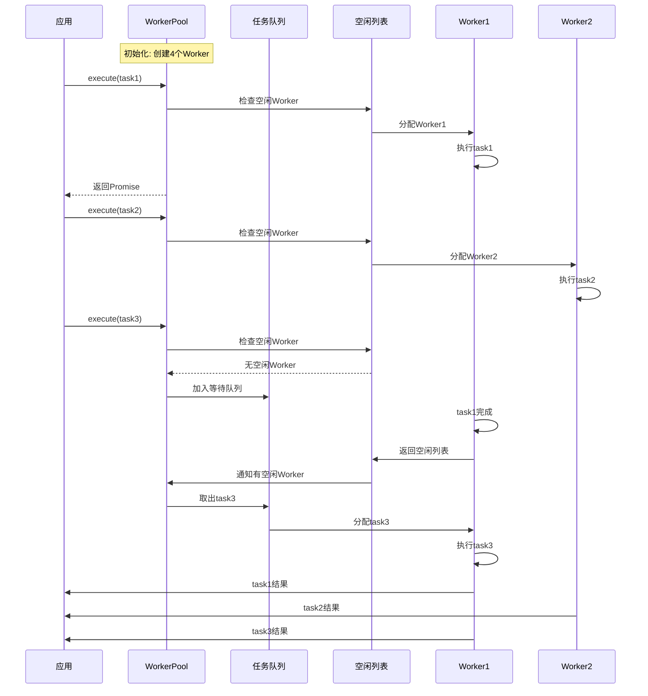

# 25-Worker独立线程管理 - 构建长时任务与持续通信的利器

> **适合人群**: 需要处理长时任务、持续通信的高级开发者
> **阅读时间**: 17分钟
> **核心内容**: Worker生命周期、双向通信、线程池、实战案例

---

## 🎯 Worker解决什么问题?

### TaskPool的局限

TaskPool虽然强大,但有些场景它无法胜任:

```typescript
// ❌ 场景1: 需要持续通信
// TaskPool: 一次性通信,无法持续交互
const result = await taskpool.execute(task)  // 执行完就结束

// ✅ Worker: 可以持续发送/接收消息
worker.postMessage({ type: 'START' })
worker.postMessage({ type: 'UPDATE', data: ... })
worker.postMessage({ type: 'STOP' })
```

```typescript
// ❌ 场景2: 需要保持状态
// TaskPool: 每次执行都是全新环境
await taskpool.execute(new taskpool.Task(process, data1))
await taskpool.execute(new taskpool.Task(process, data2))
// 两次执行无法共享状态

// ✅ Worker: 线程内可以保持状态
worker.postMessage({ type: 'INIT', cache: {} })
worker.postMessage({ type: 'ADD', key: 'a', value: 1 })
worker.postMessage({ type: 'GET', key: 'a' })  // 可以获取之前存储的值
```

```typescript
// ❌ 场景3: 长时运行的后台任务
// TaskPool: 适合短时任务 (<10s)
// WebSocket连接、日志监听等长时任务不适合

// ✅ Worker: 可以一直运行,直到手动terminate
const worker = new worker.ThreadWorker('workers/WebSocketWorker.ts')
// Worker可以一直保持WebSocket连接,直到应用关闭
```

---

## 📚 目录

1. **Worker基础**: 创建、通信、销毁
2. **生命周期管理**: 初始化、运行、终止
3. **双向通信**: 主线程↔Worker消息传递
4. **错误处理**: onerror、异常捕获
5. **Worker池化**: 复用Worker,提升性能
6. **实战1**: WebSocket长连接
7. **实战2**: 日志收集与上报
8. **实战3**: 实时数据处理管道
9. **性能优化**: 内存管理、通信优化
10. **Worker vs TaskPool**: 深度对比

---

## 一、Worker基础

### 1.1 Worker架构与通信机制

Worker提供独立的JavaScript运行环境,通过消息传递实现线程间通信:



**核心特点**:
- ✅ **独立线程**: Worker运行在单独线程,有独立的JavaScript环境和内存空间
- ✅ **持续通信**: 可以多次发送/接收消息,双向实时交互
- ✅ **状态保持**: Worker内部可以保存状态和数据
- ✅ **手动管理**: 需要手动创建和销毁 (terminate)

---

### 1.2 创建Worker

**步骤1: 创建Worker文件**

```typescript
// ✅ 可运行代码
// workers/MyWorker.ts

import worker from '@ohos.worker'

// 获取通信端口
const parentPort = worker.workerPort

// 监听主线程消息
parentPort.onmessage = (event: MessageEvents) => {
  const { type, data } = event.data

  console.log('[Worker] 收到消息:', type)

  switch (type) {
    case 'HELLO':
      parentPort.postMessage({ type: 'REPLY', message: 'Hello from Worker!' })
      break

    case 'CALCULATE':
      const result = data.a + data.b
      parentPort.postMessage({ type: 'RESULT', result })
      break

    case 'CLOSE':
      parentPort.close()  // 关闭Worker
      break
  }
}

// 监听错误
parentPort.onerror = (err) => {
  console.error('[Worker] 错误:', err)
}

console.log('[Worker] Worker已启动')
```

**步骤2: 主线程使用Worker**

```typescript
// ✅ 可运行代码
// 主线程代码

import worker from '@ohos.worker'

@Entry
@Component
struct WorkerDemo {
  private workerInstance: worker.ThreadWorker = null

  aboutToAppear() {
    // 创建Worker实例
    this.workerInstance = new worker.ThreadWorker('workers/MyWorker.ts')

    // 监听Worker消息
    this.workerInstance.onmessage = (event) => {
      console.log('[Main] 收到Worker消息:', event.data)

      if (event.data.type === 'REPLY') {
        console.log(event.data.message)  // 'Hello from Worker!'
      }
    }

    // 监听错误
    this.workerInstance.onerror = (err) => {
      console.error('[Main] Worker错误:', err)
    }

    // 监听Worker退出
    this.workerInstance.onexit = (code) => {
      console.log('[Main] Worker已退出,代码:', code)
    }
  }

  build() {
    Column() {
      Button('发送HELLO')
        .onClick(() => {
          this.workerInstance.postMessage({ type: 'HELLO' })
        })

      Button('计算')
        .onClick(() => {
          this.workerInstance.postMessage({
            type: 'CALCULATE',
            data: { a: 10, b: 20 }
          })
        })

      Button('关闭Worker')
        .onClick(() => {
          this.workerInstance.postMessage({ type: 'CLOSE' })
        })
    }
  }

  aboutToDisappear() {
    // 页面销毁时,终止Worker
    this.workerInstance.terminate()
  }
}
```

---

## 二、生命周期管理

### 2.1 Worker完整生命周期

Worker从创建到销毁经历以下关键阶段:



**生命周期钩子**:

### 2.2 初始化阶段

```typescript
// ✅ 可运行代码
// Worker内部: 初始化全局状态
const parentPort = worker.workerPort

// 全局状态
let isInitialized = false
let cache: Map<string, any> = new Map()

parentPort.onmessage = (event) => {
  const { type, data } = event.data

  // 初始化
  if (type === 'INIT') {
    isInitialized = true
    cache = new Map(Object.entries(data.initialCache))
    parentPort.postMessage({ type: 'INIT_SUCCESS' })
    return
  }

  // 确保已初始化
  if (!isInitialized) {
    parentPort.postMessage({ type: 'ERROR', message: '未初始化' })
    return
  }

  // 处理其他消息...
}
```

```typescript
// ✅ 可运行代码
// 主线程: 等待初始化完成
const worker = new worker.ThreadWorker('workers/CacheWorker.ts')

// 等待初始化
await new Promise<void>((resolve) => {
  worker.onmessage = (event) => {
    if (event.data.type === 'INIT_SUCCESS') {
      resolve()
    }
  }

  worker.postMessage({ type: 'INIT', initialCache: { key1: 'value1' } })
})

console.log('Worker初始化完成')
```

### 2.3 终止阶段

```typescript
// ✅ 可运行代码
// 方法1: Worker主动关闭
parentPort.onmessage = (event) => {
  if (event.data.type === 'SHUTDOWN') {
    // 清理资源
    cache.clear()
    connections.forEach(conn => conn.close())

    // 发送确认消息
    parentPort.postMessage({ type: 'SHUTDOWN_ACK' })

    // 关闭Worker
    parentPort.close()
  }
}

// 方法2: 主线程强制终止
this.workerInstance.terminate()  // 立即终止,不等待清理
```

---

## 三、双向通信

### 3.1 请求-响应通信模式

Worker支持主线程和Worker线程之间的双向异步通信:



**通信特点**:

```typescript
// ✅ 可运行代码
// Worker: 处理请求并返回响应
const parentPort = worker.workerPort

parentPort.onmessage = (event) => {
  const { id, type, data } = event.data

  // 处理请求
  const result = processRequest(type, data)

  // 返回响应 (带上请求ID)
  parentPort.postMessage({ id, type: 'RESPONSE', result })
}

function processRequest(type: string, data: any): any {
  switch (type) {
    case 'FETCH_USER':
      return { name: '张三', age: 25 }
    case 'CALCULATE':
      return data.a + data.b
    default:
      throw new Error(`未知请求类型: ${type}`)
  }
}
```

```typescript
// ✅ 可运行代码
// 主线程: 封装为Promise
class WorkerClient {
  private worker: worker.ThreadWorker
  private requestId: number = 0
  private pendingRequests: Map<number, (value: any) => void> = new Map()

  constructor(workerPath: string) {
    this.worker = new worker.ThreadWorker(workerPath)

    this.worker.onmessage = (event) => {
      const { id, type, result } = event.data

      if (type === 'RESPONSE') {
        const resolve = this.pendingRequests.get(id)
        if (resolve) {
          resolve(result)
          this.pendingRequests.delete(id)
        }
      }
    }
  }

  // 发送请求并等待响应
  async request(type: string, data: any): Promise<any> {
    const id = ++this.requestId

    return new Promise((resolve) => {
      this.pendingRequests.set(id, resolve)

      this.worker.postMessage({ id, type, data })
    })
  }

  terminate() {
    this.worker.terminate()
  }
}

// 使用
const client = new WorkerClient('workers/MyWorker.ts')

const user = await client.request('FETCH_USER', { userId: 123 })
console.log(user)  // { name: '张三', age: 25 }

const sum = await client.request('CALCULATE', { a: 10, b: 20 })
console.log(sum)  // 30
```

### 3.2 事件流模式

```typescript
// ✅ 可运行代码
// Worker: 持续发送事件
const parentPort = worker.workerPort

let intervalId: number

parentPort.onmessage = (event) => {
  if (event.data.type === 'START_MONITOR') {
    // 每秒发送一次状态
    intervalId = setInterval(() => {
      const status = {
        timestamp: Date.now(),
        cpuUsage: Math.random() * 100,
        memoryUsage: Math.random() * 1024
      }

      parentPort.postMessage({ type: 'STATUS_UPDATE', status })
    }, 1000)
  }

  if (event.data.type === 'STOP_MONITOR') {
    clearInterval(intervalId)
  }
}
```

```typescript
// ✅ 可运行代码
// 主线程: 监听事件流
@Entry
@Component
struct SystemMonitor {
  @State cpuUsage: number = 0
  @State memoryUsage: number = 0
  private worker: worker.ThreadWorker = null

  aboutToAppear() {
    this.worker = new worker.ThreadWorker('workers/MonitorWorker.ts')

    this.worker.onmessage = (event) => {
      if (event.data.type === 'STATUS_UPDATE') {
        const { cpuUsage, memoryUsage } = event.data.status
        this.cpuUsage = cpuUsage
        this.memoryUsage = memoryUsage
      }
    }

    // 启动监控
    this.worker.postMessage({ type: 'START_MONITOR' })
  }

  build() {
    Column() {
      Text(`CPU: ${this.cpuUsage.toFixed(2)}%`)
      Text(`内存: ${this.memoryUsage.toFixed(2)}MB`)
    }
  }

  aboutToDisappear() {
    this.worker.postMessage({ type: 'STOP_MONITOR' })
    this.worker.terminate()
  }
}
```

---

## 四、错误处理

### 4.1 Worker内部错误

```typescript
// ✅ 可运行代码
// Worker内部
const parentPort = worker.workerPort

parentPort.onmessage = (event) => {
  try {
    const result = riskyOperation(event.data)
    parentPort.postMessage({ type: 'SUCCESS', result })
  } catch (err) {
    // 捕获错误并发送给主线程
    parentPort.postMessage({
      type: 'ERROR',
      message: err.message,
      stack: err.stack
    })
  }
}

function riskyOperation(data: any): any {
  if (!data) {
    throw new Error('数据不能为空')
  }
  return data
}
```

### 4.2 主线程错误监听

```typescript
// ✅ 可运行代码
const worker = new worker.ThreadWorker('workers/MyWorker.ts')

// 监听Worker内部错误
worker.onerror = (err) => {
  console.error('[Main] Worker运行时错误:', err)
  // 可以选择重启Worker
  worker.terminate()
  worker = new worker.ThreadWorker('workers/MyWorker.ts')
}

// 监听消息中的错误
worker.onmessage = (event) => {
  if (event.data.type === 'ERROR') {
    console.error('[Main] Worker业务错误:', event.data.message)
  }
}
```

### 4.3 超时处理

```typescript
// ✅ 可运行代码
async function requestWithTimeout(
  worker: worker.ThreadWorker,
  message: any,
  timeout: number = 5000
): Promise<any> {
  return new Promise((resolve, reject) => {
    const timerId = setTimeout(() => {
      reject(new Error('请求超时'))
    }, timeout)

    const handler = (event) => {
      clearTimeout(timerId)
      worker.onmessage = null  // 移除监听器
      resolve(event.data)
    }

    worker.onmessage = handler
    worker.postMessage(message)
  })
}

// 使用
try {
  const result = await requestWithTimeout(
    worker,
    { type: 'SLOW_OPERATION' },
    3000  // 3秒超时
  )
} catch (err) {
  console.error('操作超时')
}
```

---

## 五、Worker池化

### 5.1 为什么需要Worker池?

```typescript
// ❌ 问题: 频繁创建/销毁Worker,性能差
for (let i = 0; i < 100; i++) {
  const worker = new worker.ThreadWorker('workers/MyWorker.ts')  // 创建开销大
  worker.postMessage({ data: i })
  worker.terminate()  // 销毁
}

// ✅ 解决方案: 复用Worker
const pool = new WorkerPool('workers/MyWorker.ts', 4)  // 创建4个Worker
for (let i = 0; i < 100; i++) {
  await pool.execute({ data: i })  // 自动分配到空闲Worker
}
```

### 5.2 Worker池实现

**Worker池架构图**:



**Worker池工作流程**:



```typescript
// ✅ 可运行代码
class WorkerPool {
  private workers: worker.ThreadWorker[] = []
  private availableWorkers: worker.ThreadWorker[] = []
  private taskQueue: Array<{ task: any, resolve: (value: any) => void }> = []

  constructor(workerPath: string, poolSize: number) {
    // 创建Worker池
    for (let i = 0; i < poolSize; i++) {
      const w = new worker.ThreadWorker(workerPath)

      w.onmessage = (event) => {
        // Worker完成任务,返回池中
        this.availableWorkers.push(w)

        // 处理下一个任务
        this.processNextTask()

        // 返回结果
        // (需要跟踪当前Worker正在处理哪个任务)
      }

      this.workers.push(w)
      this.availableWorkers.push(w)
    }
  }

  async execute(task: any): Promise<any> {
    return new Promise((resolve) => {
      // 如果有空闲Worker,立即执行
      if (this.availableWorkers.length > 0) {
        const worker = this.availableWorkers.pop()
        this.runTask(worker, task, resolve)
      } else {
        // 否则加入队列
        this.taskQueue.push({ task, resolve })
      }
    })
  }

  private runTask(
    worker: worker.ThreadWorker,
    task: any,
    resolve: (value: any) => void
  ) {
    // 设置一次性监听器
    const handler = (event) => {
      worker.onmessage = null
      resolve(event.data)

      // Worker完成任务,返回池中
      this.availableWorkers.push(worker)

      // 处理下一个任务
      this.processNextTask()
    }

    worker.onmessage = handler
    worker.postMessage(task)
  }

  private processNextTask() {
    if (this.taskQueue.length > 0 && this.availableWorkers.length > 0) {
      const { task, resolve } = this.taskQueue.shift()
      const worker = this.availableWorkers.pop()
      this.runTask(worker, task, resolve)
    }
  }

  terminate() {
    this.workers.forEach(w => w.terminate())
  }
}

// 使用
const pool = new WorkerPool('workers/ProcessWorker.ts', 4)

const tasks = Array(100).fill(0).map((_, i) => ({
  type: 'PROCESS',
  data: i
}))

const results = await Promise.all(
  tasks.map(task => pool.execute(task))
)

console.log('所有任务完成:', results.length)

pool.terminate()
```

---

## 六、实战1: WebSocket长连接

### 6.1 Worker实现

```typescript
// ✅ 可运行代码
// workers/WebSocketWorker.ts

import worker from '@ohos.worker'
import webSocket from '@ohos.net.webSocket'

const parentPort = worker.workerPort

let ws: webSocket.WebSocket = null
let isConnected = false

parentPort.onmessage = async (event) => {
  const { type, data } = event.data

  switch (type) {
    case 'CONNECT':
      await connect(data.url)
      break

    case 'SEND':
      send(data.message)
      break

    case 'DISCONNECT':
      disconnect()
      break
  }
}

async function connect(url: string) {
  try {
    ws = webSocket.createWebSocket()

    ws.on('open', () => {
      isConnected = true
      parentPort.postMessage({ type: 'CONNECTED' })
    })

    ws.on('message', (err, value) => {
      if (!err) {
        parentPort.postMessage({ type: 'MESSAGE', message: value })
      }
    })

    ws.on('error', (err) => {
      parentPort.postMessage({ type: 'ERROR', error: err.message })
    })

    ws.on('close', () => {
      isConnected = false
      parentPort.postMessage({ type: 'DISCONNECTED' })
    })

    await ws.connect(url)
  } catch (err) {
    parentPort.postMessage({ type: 'ERROR', error: err.message })
  }
}

function send(message: string) {
  if (!isConnected) {
    parentPort.postMessage({ type: 'ERROR', error: '未连接' })
    return
  }

  ws.send(message, (err) => {
    if (err) {
      parentPort.postMessage({ type: 'ERROR', error: err.message })
    }
  })
}

function disconnect() {
  if (ws) {
    ws.close()
    ws = null
  }
}
```

### 6.2 主线程使用

```typescript
// ✅ 可运行代码
@Entry
@Component
struct ChatPage {
  @State messages: string[] = []
  @State connectionStatus: string = '未连接'
  @State inputText: string = ''
  private wsWorker: worker.ThreadWorker = null

  aboutToAppear() {
    this.wsWorker = new worker.ThreadWorker('workers/WebSocketWorker.ts')

    this.wsWorker.onmessage = (event) => {
      const { type, message, error } = event.data

      switch (type) {
        case 'CONNECTED':
          this.connectionStatus = '已连接'
          break

        case 'DISCONNECTED':
          this.connectionStatus = '已断开'
          break

        case 'MESSAGE':
          this.messages.push(message)
          break

        case 'ERROR':
          console.error('WebSocket错误:', error)
          break
      }
    }

    // 连接WebSocket
    this.wsWorker.postMessage({
      type: 'CONNECT',
      data: { url: 'wss://echo.websocket.org' }
    })
  }

  build() {
    Column() {
      // 状态栏
      Text(`状态: ${this.connectionStatus}`)
        .fontSize(16)
        .margin({ bottom: 16 })

      // 消息列表
      List() {
        ForEach(this.messages, (msg: string, index: number) => {
          ListItem() {
            Text(msg)
              .padding(8)
              .backgroundColor('#F0F0F0')
              .borderRadius(4)
          }
        }, (msg: string, index: number) => index.toString())
      }
      .layoutWeight(1)

      // 输入框
      Row() {
        TextInput({ placeholder: '输入消息', text: this.inputText })
          .layoutWeight(1)
          .onChange((value) => {
            this.inputText = value
          })

        Button('发送')
          .onClick(() => {
            if (this.inputText) {
              this.wsWorker.postMessage({
                type: 'SEND',
                data: { message: this.inputText }
              })
              this.inputText = ''
            }
          })
      }
      .width('100%')
      .padding(16)
    }
    .width('100%')
    .height('100%')
  }

  aboutToDisappear() {
    this.wsWorker.postMessage({ type: 'DISCONNECT' })
    this.wsWorker.terminate()
  }
}
```

**效果**:
- ✅ WebSocket连接在Worker线程,不阻塞UI
- ✅ 消息收发异步处理
- ✅ 页面销毁时自动断开连接

---

## 七、实战2: 日志收集与上报

### 7.1 Worker实现

```typescript
// ✅ 可运行代码
// workers/LogWorker.ts

import worker from '@ohos.worker'
import fs from '@ohos.file.fs'

const parentPort = worker.workerPort

interface LogEntry {
  level: 'info' | 'warn' | 'error'
  message: string
  timestamp: number
  data?: any
}

let logBuffer: LogEntry[] = []
const BUFFER_SIZE = 100
const UPLOAD_INTERVAL = 30000  // 30秒上传一次

// 定时上传
setInterval(() => {
  uploadLogs()
}, UPLOAD_INTERVAL)

parentPort.onmessage = (event) => {
  const { type, data } = event.data

  switch (type) {
    case 'LOG':
      addLog(data)
      break

    case 'FLUSH':
      uploadLogs()
      break
  }
}

function addLog(entry: LogEntry) {
  logBuffer.push(entry)

  // 缓冲区满,立即上传
  if (logBuffer.length >= BUFFER_SIZE) {
    uploadLogs()
  }
}

async function uploadLogs() {
  if (logBuffer.length === 0) return

  const logs = logBuffer.splice(0, logBuffer.length)

  try {
    // 上传到服务器
    const response = await fetch('https://api.example.com/logs', {
      method: 'POST',
      headers: { 'Content-Type': 'application/json' },
      body: JSON.stringify({ logs })
    })

    if (response.ok) {
      parentPort.postMessage({
        type: 'UPLOAD_SUCCESS',
        count: logs.length
      })
    } else {
      // 上传失败,放回缓冲区
      logBuffer.unshift(...logs)
      parentPort.postMessage({ type: 'UPLOAD_FAILED' })
    }
  } catch (err) {
    // 网络错误,放回缓冲区
    logBuffer.unshift(...logs)
    console.error('[LogWorker] 上传失败:', err)
  }
}
```

### 7.2 主线程使用

```typescript
// ✅ 可运行代码
class Logger {
  private static worker: worker.ThreadWorker = null

  static init() {
    this.worker = new worker.ThreadWorker('workers/LogWorker.ts')

    this.worker.onmessage = (event) => {
      if (event.data.type === 'UPLOAD_SUCCESS') {
        console.log(`上传${event.data.count}条日志`)
      }
    }
  }

  static info(message: string, data?: any) {
    this.log('info', message, data)
  }

  static warn(message: string, data?: any) {
    this.log('warn', message, data)
  }

  static error(message: string, data?: any) {
    this.log('error', message, data)
  }

  private static log(level: string, message: string, data?: any) {
    if (!this.worker) {
      this.init()
    }

    this.worker.postMessage({
      type: 'LOG',
      data: {
        level,
        message,
        timestamp: Date.now(),
        data
      }
    })
  }

  static flush() {
    this.worker?.postMessage({ type: 'FLUSH' })
  }

  static terminate() {
    this.worker?.terminate()
  }
}

// 使用
Logger.info('应用启动')
Logger.warn('网络慢', { latency: 500 })
Logger.error('API调用失败', { url: '/api/user', status: 500 })

// 应用退出前,上传剩余日志
Logger.flush()
```

---

## 八、性能优化

### 8.1 减少通信频率

```typescript
// ❌ 频繁通信,性能差
for (let i = 0; i < 1000; i++) {
  worker.postMessage({ type: 'PROCESS', data: i })
}

// ✅ 批量通信
const batch = Array(1000).fill(0).map((_, i) => i)
worker.postMessage({ type: 'PROCESS_BATCH', data: batch })
```

### 8.2 使用ArrayBuffer传输大数据

```typescript
// ❌ 序列化大对象,耗时长
const largeData = { /* 10MB数据 */ }
worker.postMessage({ data: largeData })  // 序列化+复制,耗时100ms

// ✅ 使用ArrayBuffer零拷贝
const buffer = serializeToArrayBuffer(largeData)
worker.postMessage({ data: buffer }, [buffer])  // 转移所有权,耗时<1ms
```

### 8.3 Worker复用

```typescript
// ❌ 每次创建新Worker
async function processData(data: any) {
  const worker = new worker.ThreadWorker('workers/MyWorker.ts')
  // 使用worker...
  worker.terminate()
}

// ✅ 复用Worker
const workerPool = new WorkerPool('workers/MyWorker.ts', 4)

async function processData(data: any) {
  return workerPool.execute(data)
}
```

---

## 九、Worker vs TaskPool对比

| 特性 | Worker | TaskPool |
|------|--------|----------|
| **创建方式** | 手动创建/销毁 | 自动管理 |
| **通信模式** | 持续双向通信 | 一次性通信 |
| **状态保持** | ✅ 可以保持状态 | ❌ 每次全新环境 |
| **适用场景** | 长时任务、持续通信 | 短时任务、并行计算 |
| **数量限制** | 最多8个 | 无限制 |
| **启动开销** | 大 (~100ms) | 小 (~10ms) |
| **内存占用** | 大 (~10MB/个) | 小 (~1MB/个) |
| **代码复杂度** | 高 | 低 |

**选择建议**:
- ✅ TaskPool优先: 90%场景首选
- ✅ Worker适合: WebSocket、日志、实时处理等长时任务

---

## 📌 本章总结

### 核心要点

1. **Worker特点**: 独立线程、持续通信、状态保持
2. **生命周期**: 创建→初始化→运行→终止→销毁
3. **双向通信**: 请求-响应模式、事件流模式
4. **Worker池化**: 复用Worker,提升性能
5. **错误处理**: onerror + 超时机制

### 最佳实践

- ✅ 长时任务用Worker
- ✅ 复用Worker(池化)
- ✅ ArrayBuffer传输大数据
- ✅ 批量通信,减少消息数
- ✅ 手动管理生命周期
- ❌ 避免频繁创建/销毁
- ❌ 避免过多Worker (最多8个)

---

## 🎯 下一步

下一篇文章将学习 **《26-数据传递机制详解》**:
- 结构化克隆原理
- ArrayBuffer零拷贝
- Transferable对象
- 性能对比测试

---

> 💡 **小贴士**: Worker适合10%的特殊场景,大部分情况用TaskPool就够了。但掌握Worker,可以解决WebSocket、日志上报等复杂场景!
