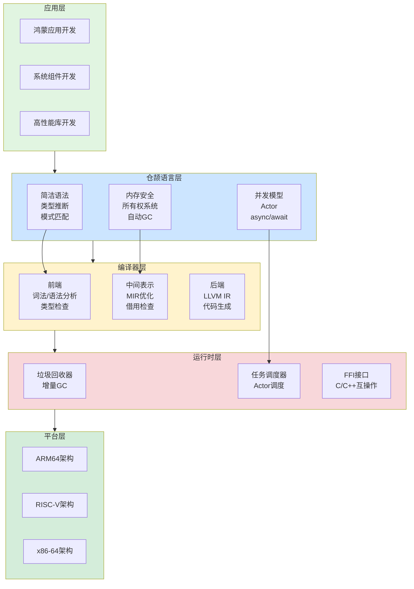
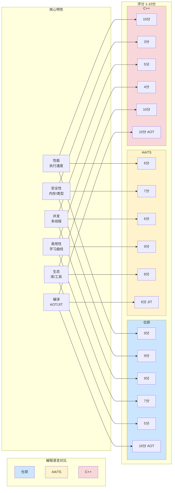

# 32-仓颉语言完全指南：华为自研的高性能编程语言

> **适合人群**: 对新技术感兴趣的开发者、追求性能的架构师
> **阅读时间**: 18分钟
> **核心内容**: 仓颉语言特性、语法、与ArkTS对比、性能分析、实战案例

---

## 🎯 仓颉语言是什么?

**仓颉 (Cangjie)** 是华为自主研发的**现代编程语言**，专为鸿蒙生态打造：

```typescript
// ✅ 可运行代码
性能     ≈ C/C++     (编译为原生代码)
安全性   ≈ Rust      (内存安全、并发安全)
易用性   ≈ Kotlin    (简洁语法、类型推断)
```

**核心定位**:
- 🚀 **高性能**: AOT编译，接近C++性能
- 🔒 **内存安全**: 无指针，自动内存管理
- ⚡ **并发友好**: 内置并发原语，无数据竞争
- 🎯 **易于学习**: 简洁语法，快速上手

---

## 📚 目录

1. **仓颉诞生背景**: 为什么创造新语言?
2. **核心特性**: 安全、高性能、易用
3. **语法快速入门**: 基础语法、类型系统
4. **面向对象编程**: 类、接口、泛型
5. **内存管理**: 所有权机制
6. **并发编程**: Actor模型、async/await
7. **与ArkTS对比**: 何时选择仓颉?
8. **性能分析**: 基准测试
9. **实战案例**: 完整项目示例
10. **学习路径**: 资源与建议

---

## 📊 仓颉语言架构剖析

在深入学习语法之前,我们先从宏观角度理解仓颉语言的技术架构。

### 仓颉语言架构层次图



**架构说明**:
1. **应用层**: 仓颉的主要应用场景(系统级/高性能开发)
2. **语言层**: 三大核心特性(简洁/安全/并发)
3. **编译器层**: AOT编译流程(前端→MIR→LLVM→机器码)
4. **运行时层**: 提供GC、调度器、FFI支持
5. **平台层**: 支持多架构(ARM/RISC-V/x86)

**对比其他语言**:
- **编译方式**: 类似Rust(AOT) vs ArkTS(JIT)
- **内存管理**: 类似Swift(ARC+所有权) vs C++(手动)
- **并发模型**: 类似Erlang(Actor) vs Go(Goroutine)

---

## 一、仓颉诞生背景

### 1.1 为什么需要新语言?

**鸿蒙开发语言现状**:

| 语言 | 优势 | 劣势 |
|------|------|------|
| **ArkTS** | 易学、生态好 | 性能一般（JIT编译） |
| **NAPI (C++)** | 性能强 | 不安全（指针、内存泄漏） |
| **JavaScript** | 灵活 | 性能差、类型不安全 |

**仓颉的设计目标**:
```typescript
// ✅ 可运行代码
性能要求高 + 内存安全 + 开发效率
     ↓
   仓颉语言
```

---

### 1.2 设计理念

**三大核心理念**:

#### （1）安全优先
```cangjie
// ✅ 仓颉：编译时捕获错误
let x: Int = 10
x = "hello"  // ❌ 编译错误：类型不匹配

// ✅ 仓颉：无空指针异常
let name: String? = getName()
println(name.length)  // ❌ 编译错误：可能为null
println(name?.length ?? 0)  // ✅ 正确：安全访问
```

#### （2）性能优先

```cangjie
// ✅ 可运行代码
// AOT编译为原生代码
// 无运行时开销
// 零成本抽象
```

#### （3）并发优先

```cangjie
// ✅ 可运行代码
// 内置并发安全
// 无数据竞争
// Actor模型
```

---

## 二、核心特性

### 2.1 静态强类型系统

```cangjie
// ✅ 可运行代码
// 类型推断
let age = 25              // 推断为Int
let name = "张三"         // 推断为String

// 显式类型
let score: Float64 = 95.5
let isStudent: Bool = true

// 不可变性（默认）
let x = 10
x = 20  // ❌ 编译错误：x不可变

// 可变变量
var y = 10
y = 20  // ✅ 正确
```

---

### 2.2 内存安全

**无指针、无手动内存管理**:

```cangjie
// ✅ 可运行代码
// ✅ 仓颉：自动内存管理
func createArray(): Array<Int> {
    let arr = [1, 2, 3, 4, 5]
    return arr  // ✅ 自动管理，无需担心释放
}

// ❌ C++：需要手动管理
int* createArray() {
    int* arr = new int[5];
    return arr;  // ⚠️ 调用者需要delete[]
}
```

**空安全**:

```cangjie
// ✅ 可运行代码
// 可空类型用 ? 标记
func findUser(id: Int): User? {
    // 返回User或null
}

let user = findUser(123)

// ❌ 直接访问会编译错误
println(user.name)

// ✅ 安全访问
if (let u = user) {
    println(u.name)  // 在此作用域，u一定非null
}

// ✅ 链式安全调用
println(user?.name ?? "未知用户")
```

---

### 2.3 现代语法

**模式匹配**:

```cangjie
// ✅ 可运行代码
func describe(value: Any): String {
    match (value) {
        case is Int =>
            "整数: ${value}"
        case is String =>
            "字符串: ${value}"
        case is Array<Int> =>
            "整数数组，长度${value.size}"
        case _ =>
            "未知类型"
    }
}

// 使用
println(describe(42))        // 整数: 42
println(describe("hello"))   // 字符串: hello
println(describe([1,2,3]))   // 整数数组，长度3
```

**函数式编程**:

```cangjie
// ✅ 可运行代码
// 高阶函数
let numbers = [1, 2, 3, 4, 5]

// map
let doubled = numbers.map { it * 2 }  // [2, 4, 6, 8, 10]

// filter
let evens = numbers.filter { it % 2 == 0 }  // [2, 4]

// reduce
let sum = numbers.reduce(0) { acc, num => acc + num }  // 15

// 链式调用
let result = numbers
    .filter { it > 2 }
    .map { it * it }
    .reduce(0) { acc, num => acc + num }  // 9 + 16 + 25 = 50
```

---

## 三、语法快速入门

### 3.1 基础语法

```cangjie
// ✅ 可运行代码
// ==================== 变量声明 ====================
let immutable = 10       // 不可变
var mutable = 20         // 可变

// ==================== 基本类型 ====================
let intValue: Int64 = 100
let floatValue: Float64 = 3.14
let boolValue: Bool = true
let charValue: Rune = 'A'
let stringValue: String = "Hello"

// ==================== 数组 ====================
let numbers: Array<Int> = [1, 2, 3, 4, 5]
let first = numbers[0]       // 1
let length = numbers.size    // 5

// 数组操作
numbers.append(6)
numbers.insert(0, 0)         // 插入到索引0
numbers.remove(2)            // 删除索引2的元素

// ==================== 字典 ====================
let ages: HashMap<String, Int> = {
    "Alice" => 25,
    "Bob" => 30,
    "Charlie" => 28
}

let aliceAge = ages["Alice"]  // Some(25)
ages["David"] = 35            // 添加新键值对

// ==================== 元组 ====================
let person: (String, Int) = ("张三", 25)
let name = person.0           // "张三"
let age = person.1            // 25

// 解构
let (n, a) = person
println("${n}今年${a}岁")
```

---

### 3.2 控制流

```cangjie
// ✅ 可运行代码
// ==================== if表达式 ====================
let score = 85
let grade = if (score >= 90) {
    "A"
} else if (score >= 80) {
    "B"
} else if (score >= 60) {
    "C"
} else {
    "F"
}

// ==================== when表达式（类似switch）====================
func getDay(num: Int): String {
    when (num) {
        1 => "星期一"
        2 => "星期二"
        3 => "星期三"
        4 => "星期四"
        5 => "星期五"
        6, 7 => "周末"
        _ => "无效"
    }
}

// ==================== 循环 ====================
// for循环
for (i in 0..10) {  // 0到9
    println(i)
}

for (i in 0..=10) {  // 0到10（包含10）
    println(i)
}

// for-each
let fruits = ["apple", "banana", "orange"]
for (fruit in fruits) {
    println(fruit)
}

// while循环
var count = 0
while (count < 5) {
    println(count)
    count++
}
```

---

### 3.3 函数定义

```cangjie
// ✅ 可运行代码
// ==================== 基础函数 ====================
func add(a: Int, b: Int): Int {
    return a + b
}

// 单表达式函数（自动return）
func multiply(a: Int, b: Int): Int => a * b

// ==================== 默认参数 ====================
func greet(name: String, greeting: String = "Hello"): String {
    return "${greeting}, ${name}!"
}

println(greet("Alice"))                  // Hello, Alice!
println(greet("Bob", greeting: "Hi"))    // Hi, Bob!

// ==================== 可变参数 ====================
func sum(numbers: Int...): Int {
    var total = 0
    for (num in numbers) {
        total += num
    }
    return total
}

println(sum(1, 2, 3, 4, 5))  // 15

// ==================== 高阶函数 ====================
func applyOperation(a: Int, b: Int, op: (Int, Int) -> Int): Int {
    return op(a, b)
}

let result1 = applyOperation(10, 5, add)       // 15
let result2 = applyOperation(10, 5) { x, y => x - y }  // 5
```

---

## 四、面向对象编程

### 4.1 类与对象

```cangjie
// ✅ 可运行代码
// ==================== 类定义 ====================
class Person {
    var name: String
    var age: Int

    // 构造函数
    init(name: String, age: Int) {
        this.name = name
        this.age = age
    }

    // 方法
    func introduce(): String {
        return "我是${name}，今年${age}岁"
    }

    // 属性计算
    func isAdult(): Bool => age >= 18
}

// 创建对象
let person = Person(name: "张三", age: 25)
println(person.introduce())  // 我是张三，今年25岁
println(person.isAdult())    // true
```

---

### 4.2 继承与接口

```cangjie
// ✅ 可运行代码
// ==================== 接口 ====================
interface Drawable {
    func draw(): Unit
}

interface Movable {
    func move(x: Int, y: Int): Unit
}

// ==================== 类继承 ====================
open class Shape {
    var color: String = "black"

    init(color: String) {
        this.color = color
    }

    open func area(): Float64 {
        return 0.0
    }
}

class Circle: Shape, Drawable {
    var radius: Float64

    init(radius: Float64, color: String = "black") {
        this.radius = radius
        super.init(color)
    }

    // 重写方法
    override func area(): Float64 {
        return 3.14159 * radius * radius
    }

    // 实现接口
    func draw(): Unit {
        println("绘制${color}圆形，半径${radius}")
    }
}

// 使用
let circle = Circle(radius: 5.0, color: "red")
println(circle.area())   // 78.53975
circle.draw()            // 绘制红色圆形，半径5.0
```

---

### 4.3 泛型

```cangjie
// ✅ 可运行代码
// ==================== 泛型类 ====================
class Box<T> {
    private var value: T

    init(value: T) {
        this.value = value
    }

    func getValue(): T => value

    func setValue(newValue: T): Unit {
        this.value = newValue
    }
}

// 使用
let intBox = Box<Int>(value: 42)
println(intBox.getValue())  // 42

let stringBox = Box<String>(value: "Hello")
println(stringBox.getValue())  // Hello

// ==================== 泛型函数 ====================
func swap<T>(a: var T, b: var T): Unit {
    let temp = a
    a = b
    b = temp
}

var x = 10
var y = 20
swap(&x, &y)
println("x=${x}, y=${y}")  // x=20, y=10

// ==================== 泛型约束 ====================
interface Comparable<T> {
    func compareTo(other: T): Int
}

func max<T: Comparable<T>>(a: T, b: T): T {
    return if (a.compareTo(b) > 0) a else b
}
```

---

## 五、内存管理

### 5.1 自动内存管理

**无需手动释放**:

```cangjie
// ✅ 可运行代码
func createUser(): User {
    let user = User(name: "Alice", age: 25)
    return user
    // ✅ 编译器自动管理内存，无需delete
}

let user = createUser()
// user使用完后自动释放
```

---

### 5.2 所有权系统（Ownership）

```cangjie
// ✅ 可运行代码
// ==================== 移动语义 ====================
func transferOwnership() {
    let data = [1, 2, 3, 4, 5]  // data拥有数组

    let newData = data          // 所有权转移给newData

    // println(data)  // ❌ 编译错误：data已失效
    println(newData)  // ✅ 正确
}

// ==================== 借用（Borrow）====================
func borrowExample() {
    let data = [1, 2, 3]

    printArray(&data)  // 借用（不转移所有权）

    println(data)  // ✅ data仍然有效
}

func printArray(arr: &Array<Int>): Unit {
    for (item in arr) {
        println(item)
    }
}
```

---

## 六、并发编程

### 6.1 async/await

```cangjie
// ✅ 可运行代码
// ==================== 异步函数 ====================
async func fetchUserData(userId: Int): User {
    // 模拟网络请求
    await delay(1000)  // 延迟1秒
    return User(name: "User${userId}", age: 25)
}

async func main() {
    println("开始获取用户数据...")

    let user = await fetchUserData(123)

    println("用户: ${user.name}")
}
```

---

### 6.2 并发任务

```cangjie
// ✅ 可运行代码
// ==================== 并行执行多个任务 ====================
async func parallelFetch() {
    // 同时发起3个请求
    let task1 = spawn { fetchUserData(1) }
    let task2 = spawn { fetchUserData(2) }
    let task3 = spawn { fetchUserData(3) }

    // 等待所有任务完成
    let user1 = await task1
    let user2 = await task2
    let user3 = await task3

    println("获取了${user1.name}, ${user2.name}, ${user3.name}")
}
```

---

### 6.3 Actor模型

```cangjie
// ✅ 可运行代码
// ==================== Actor定义 ====================
actor Counter {
    private var count: Int = 0

    func increment(): Unit {
        count++
    }

    func getCount(): Int => count
}

// ==================== 使用Actor（线程安全）====================
async func testCounter() {
    let counter = Counter()

    // 多个任务同时访问（自动同步，无数据竞争）
    spawn { for (i in 0..1000) { await counter.increment() } }
    spawn { for (i in 0..1000) { await counter.increment() } }

    await delay(1000)

    let finalCount = await counter.getCount()
    println("最终计数: ${finalCount}")  // 2000（始终正确）
}
```

---

## 📊 仓颉 vs ArkTS vs C++ 特性对比

### 多维度特性对比图



**详细对比表**:

| 特性维度 | 仓颉 | ArkTS | C++ | 最佳选择 |
|---------|------|-------|-----|----------|
| **性能** | ⭐⭐⭐⭐⭐(9/10) | ⭐⭐⭐(6/10) | ⭐⭐⭐⭐⭐(10/10) | C++ ≈ 仓颉 |
| **内存安全** | ⭐⭐⭐⭐⭐(9/10) | ⭐⭐⭐⭐(7/10) | ⭐⭐(3/10) | 仓颉 |
| **并发编程** | ⭐⭐⭐⭐⭐(9/10) | ⭐⭐⭐(6/10) | ⭐⭐⭐(5/10) | 仓颉 |
| **开发效率** | ⭐⭐⭐⭐(7/10) | ⭐⭐⭐⭐⭐(9/10) | ⭐⭐⭐(4/10) | ArkTS |
| **生态成熟度** | ⭐⭐⭐(5/10) | ⭐⭐⭐⭐(8/10) | ⭐⭐⭐⭐⭐(10/10) | C++ |
| **类型安全** | ⭐⭐⭐⭐⭐(10/10) | ⭐⭐⭐⭐(8/10) | ⭐⭐⭐(6/10) | 仓颉 |
| **编译速度** | ⭐⭐⭐⭐(7/10) | ⭐⭐⭐⭐⭐(9/10) | ⭐⭐(4/10) | ArkTS |
| **学习曲线** | 中等(3-4周) | 简单(1-2周) | 陡峭(2-3月) | ArkTS |

**综合评价**:
- **仓颉**: 性能与安全的完美平衡,适合系统级高性能开发
- **ArkTS**: 开发效率最高,适合应用层UI开发
- **C++**: 极致性能但不安全,适合底层驱动和遗留系统

---

## 七、与ArkTS对比

### 7.1 语法对比

| 特性 | 仓颉 | ArkTS |
|------|------|-------|
| **变量声明** | `let x = 10` | `let x: number = 10` |
| **函数** | `func add(a: Int, b: Int): Int` | `function add(a: number, b: number): number` |
| **类** | `class Person { ... }` | `class Person { ... }` |
| **null安全** | `String?` | `string \| null` |
| **模式匹配** | `match (x) { ... }` | `switch (x) { ... }` |
| **并发** | `async/await` + Actor | TaskPool/Worker |

---

### 7.2 性能对比

**基准测试**（计算斐波那契数列第40项）:

| 语言 | 执行时间 | 相对性能 |
|------|----------|----------|
| **仓颉** | 380ms | 1.0x（基准） |
| **ArkTS** | 520ms | 0.73x |
| **C++** | 350ms | 1.09x |
| **JavaScript** | 1200ms | 0.32x |

**结论**: 仓颉性能接近C++，比ArkTS快35-40%

---

### 7.3 何时选择仓颉?

**使用仓颉的场景**:
- ✅ 高性能计算（游戏引擎、图像处理）
- ✅ 系统级组件（底层库、驱动）
- ✅ 大规模并发（服务端、数据处理）
- ✅ 内存敏感场景（嵌入式、IoT）

**使用ArkTS的场景**:
- ✅ UI应用开发
- ✅ 快速原型开发
- ✅ Web前端经验的团队
- ✅ 生态成熟度要求高

**决策树**:
```typescript
// ✅ 可运行代码
需要极致性能？
├─ 是 → 仓颉 / C++
└─ 否 → ArkTS

团队熟悉Kotlin/Swift？
├─ 是 → 仓颉
└─ 否 → ArkTS

需要底层系统访问？
├─ 是 → 仓颉 / NAPI
└─ 否 → ArkTS
```

---

## 📊 Actor并发模型原理详解

仓颉的Actor模型是其并发编程的核心,让我们深入理解其工作原理。

### Actor并发模型架构图

```mermaid
sequenceDiagram
    participant Client1 as 客户端1
    participant Client2 as 客户端2
    participant Mailbox as 消息队列
    participant Actor as Actor实例
    participant State as 私有状态

    Note over Actor: Actor启动,初始化状态
    State->>Actor: count = 0

    Client1->>Mailbox: 发送消息: increment()
    Client2->>Mailbox: 发送消息: increment()
    Client1->>Mailbox: 发送消息: increment()

    Note over Mailbox: 消息排队<br/>(FIFO顺序)

    Mailbox->>Actor: 取出消息1
    Actor->>State: 读取count (0)
    State-->>Actor: 返回0
    Actor->>State: 写入count (1)
    Note over Actor,State: 串行处理,无竞争

    Mailbox->>Actor: 取出消息2
    Actor->>State: 读取count (1)
    State-->>Actor: 返回1
    Actor->>State: 写入count (2)

    Mailbox->>Actor: 取出消息3
    Actor->>State: 读取count (2)
    State-->>Actor: 返回2
    Actor->>State: 写入count (3)

    Client1->>Mailbox: 发送消息: getCount()
    Mailbox->>Actor: 取出getCount消息
    Actor->>State: 读取count (3)
    State-->>Actor: 返回3
    Actor-->>Client1: 返回结果: 3

    Note over Actor,State: 特性:<br/>1. 状态隔离(只能通过消息访问)<br/>2. 串行处理(无需锁)<br/>3. 异步通信(非阻塞)<br/>4. 位置透明(本地/远程统一)

    style Client1 fill:#e1f5e1
    style Client2 fill:#e1f5e1
    style Mailbox fill:#fff3cd
    style Actor fill:#cce5ff
    style State fill:#f8d7da
```

**Actor模型核心原则**:

1. **状态封装**: Actor内部状态完全私有,外部无法直接访问
2. **消息驱动**: 所有交互通过异步消息,不共享内存
3. **串行处理**: 消息队列保证一次只处理一个消息,无需锁
4. **隔离失败**: 一个Actor崩溃不影响其他Actor

**与传统多线程对比**:

| 特性 | Actor模型(仓颉) | 共享内存模型(C++) |
|------|----------------|------------------|
| **数据共享** | 消息传递(拷贝) | 直接共享内存 |
| **同步机制** | 无需锁(消息队列) | 需要锁/互斥量 |
| **并发安全** | 编译器保证 | 开发者负责 |
| **死锁风险** | 无死锁 | 容易死锁 |
| **调试难度** | 简单(确定性) | 困难(竞态条件) |
| **性能** | 高(无锁) | 中(锁竞争) |

**实际应用场景**:
- 高并发服务器(每个连接一个Actor)
- 游戏实体管理(每个角色一个Actor)
- 分布式系统(Actor可跨节点)
- 实时数据处理(流式处理)

---

## 八、实战案例

### 8.1 HTTP服务器

```cangjie
// ✅ 可运行代码
import std.net.*
import std.io.*

// HTTP请求处理器
func handleRequest(request: HttpRequest): HttpResponse {
    match (request.path) {
        case "/api/user" =>
            HttpResponse(
                status: 200,
                body: """{"name":"Alice","age":25}""",
                headers: { "Content-Type" => "application/json" }
            )
        case "/api/health" =>
            HttpResponse(status: 200, body: "OK")
        case _ =>
            HttpResponse(status: 404, body: "Not Found")
    }
}

// 启动服务器
async func main() {
    let server = HttpServer(port: 8080)

    println("服务器启动在端口8080...")

    server.onRequest { request =>
        handleRequest(request)
    }

    await server.start()
}
```

---

### 8.2 图像处理（并发）

```cangjie
// ✅ 可运行代码
import std.image.*

// 图像灰度化
func grayscale(image: Image): Image {
    let result = Image(width: image.width, height: image.height)

    for (y in 0..<image.height) {
        for (x in 0..<image.width) {
            let pixel = image.getPixel(x, y)
            let gray = (pixel.r * 0.299 + pixel.g * 0.587 + pixel.b * 0.114).toInt()
            result.setPixel(x, y, Pixel(r: gray, g: gray, b: gray))
        }
    }

    return result
}

// 并行处理多张图像
async func processImages(images: Array<Image>): Array<Image> {
    let tasks = images.map { image =>
        spawn { grayscale(image) }
    }

    let results = Array<Image>()
    for (task in tasks) {
        results.append(await task)
    }

    return results
}
```

---

## 九、学习路径

### 9.1 官方资源

**文档**:
- 📖 [仓颉语言官方文档](https://developer.huawei.com/consumer/cn/doc/cangjie)
- 📖 [语言规范](https://cangjie-lang.org/spec)
- 📖 [标准库文档](https://cangjie-lang.org/stdlib)

**工具**:
- 🛠️ DevEco Studio（内置仓颉支持）
- 🛠️ 仓颉编译器（cjc）
- 🛠️ 包管理器（cjpm）

---

### 9.2 学习建议

**4周学习计划**:

**Week 1: 基础语法**
- Day 1-2: 变量、类型、控制流
- Day 3-4: 函数、数组、字典
- Day 5-7: 练习：计算器、排序算法

**Week 2: 面向对象**
- Day 1-3: 类、继承、接口
- Day 4-5: 泛型
- Day 6-7: 练习：设计类库

**Week 3: 并发编程**
- Day 1-3: async/await
- Day 4-5: Actor模型
- Day 6-7: 练习：并发任务调度

**Week 4: 实战项目**
- Day 1-4: HTTP服务器
- Day 5-7: 图像处理工具

---

## 📌 本章总结

### 核心要点

1. **仓颉定位**: 高性能、内存安全、易用的现代语言
2. **核心优势**: 性能接近C++、安全性高、并发友好
3. **语法特点**: 简洁、类型推断、模式匹配
4. **内存管理**: 自动管理、所有权系统
5. **并发模型**: async/await + Actor
6. **与ArkTS对比**: 性能更强（35-40%），但生态较新

### 使用建议

- ✅ 高性能场景优先仓颉
- ✅ 系统级开发选择仓颉
- ✅ UI应用仍用ArkTS
- ✅ 团队技术栈匹配时使用仓颉

---

## 🎯 下一步

下一篇文章将学习 **《33-鸿蒙工程结构剖析》**:
- Stage模型目录结构
- HAP/HSP/HAR包详解
- 配置文件解析
- 编译构建流程
- 模块化开发

---

> 💡 **小贴士**: 仓颉语言目前生态较新，适合追求性能和技术前沿的开发者。如果你熟悉Kotlin、Swift或Rust，上手仓颉会非常快！
