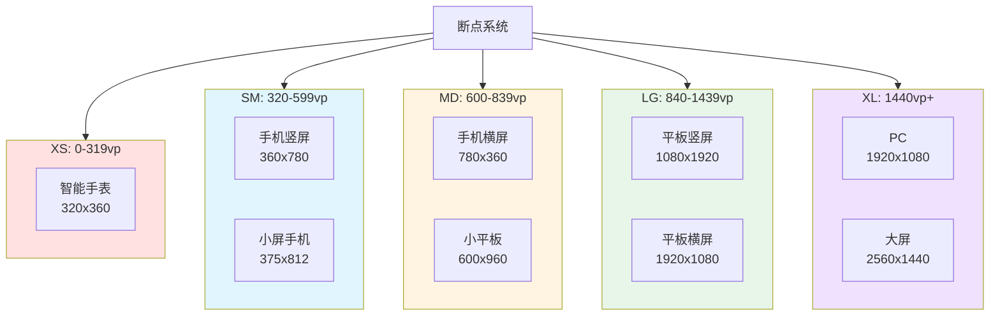
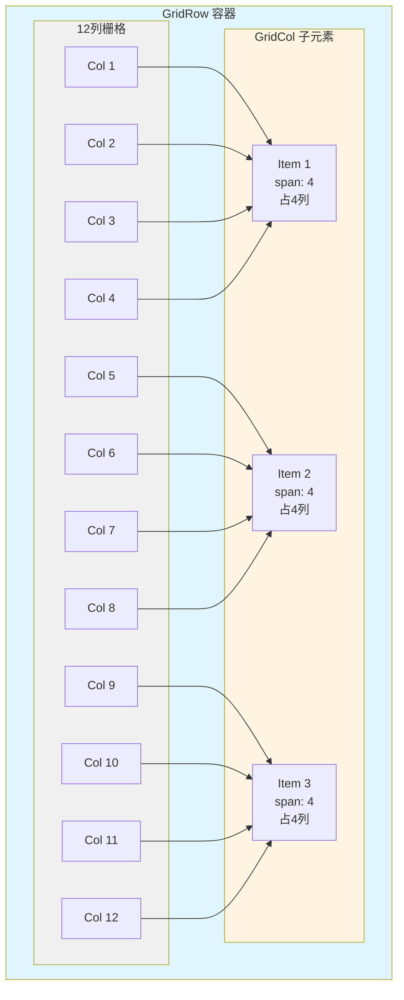
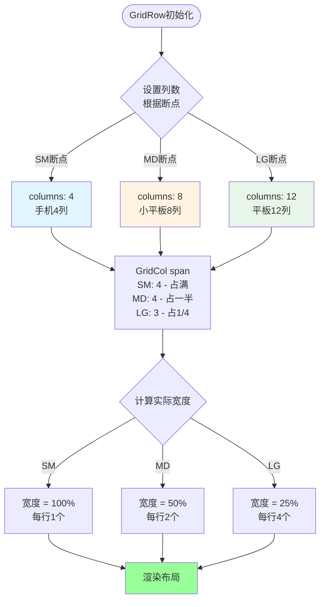

# 44-响应式布局技术：多屏幕适配完全指南

> **本文目标**: 掌握鸿蒙响应式布局技术，实现一套代码适配手机、平板、折叠屏等多种设备。

---

## 📖 引言

鸿蒙系统运行在多种设备上，屏幕尺寸差异巨大：

```typescript
// ✅ 可运行代码
设备屏幕尺寸对比:
┌────────────────────────────────────────────┐
│ 智能手表    2.5寸    320×360               │
│ 手机       6.5寸    1080×2340              │
│ 折叠屏     7.6寸    1768×2208 (展开)       │
│ 平板       10.8寸   2560×1600              │
│ 折叠屏     8.0寸    2200×2480 (展开)       │
│ PC         14寸     1920×1080              │
│ 车机       12.3寸   1920×720               │
└────────────────────────────────────────────┘

挑战:
├── 屏幕宽度: 320px - 2560px
├── 像素密度: 160dpi - 640dpi
├── 宽高比: 16:9, 4:3, 21:9
└── 交互方式: 触摸, 鼠标, 手写笔
```

### 为什么需要响应式布局？

```typescript
传统固定布局问题:
❌ 手机端设计在平板上显示 → 元素过小，浪费空间
❌ 平板端设计在手机上显示 → 内容显示不全，需滚动
❌ 为每个设备单独设计 → 开发成本高，维护困难

响应式布局优势:
✅ 一套代码，多端适配
✅ 自动调整布局，充分利用空间
✅ 提升用户体验，减少维护成本
```

---

## 一、断点系统 (Breakpoint)

### 1.1 断点系统架构

**断点系统工作原理**:

```mermaid
flowchart TD
    Start([应用启动]) --> InitBP[初始化断点管理器<br/>BreakpointManager.init]
    InitBP --> GetWidth[获取窗口宽度<br/>display.width]
    GetWidth --> CalcBP{计算断点}

    CalcBP -->|width < 320vp| SetXS[设置断点: XS<br/>超小屏]
    CalcBP -->|320-599vp| SetSM[设置断点: SM<br/>手机竖屏]
    CalcBP -->|600-839vp| SetMD[设置断点: MD<br/>手机横屏/小平板]
    CalcBP -->|840-1439vp| SetLG[设置断点: LG<br/>平板]
    CalcBP -->|width >= 1440vp| SetXL[设置断点: XL<br/>大屏/PC]

    SetXS --> Listen[监听窗口变化<br/>window.on]
    SetSM --> Listen
    SetMD --> Listen
    SetLG --> Listen
    SetXL --> Listen

    Listen --> Notify[通知组件更新<br/>@State更新]
    Notify --> Render[组件重新渲染<br/>根据断点调整布局]

    Render --> WaitChange{窗口大小变化?}
    WaitChange -->|是| GetWidth
    WaitChange -->|否| WaitChange

    style SetXS fill:#ffe1e1
    style SetSM fill:#e1f5ff
    style SetMD fill:#fff4e1
    style SetLG fill:#e8f5e9
    style SetXL fill:#f0e1ff
```

**断点与设备对应关系**:



### 1.2 断点系统原理

```typescript
// ✅ 可运行代码
/**
 * 鸿蒙断点系统
 *
 * 根据窗口宽度自动切换布局
 */
断点定义:
├── XS (Extra Small)
│   - 宽度: 0 - 319vp
│   - 设备: 智能手表
│   - 列数: 2列
│
├── SM (Small)
│   - 宽度: 320 - 599vp
│   - 设备: 手机竖屏
│   - 列数: 4列
│
├── MD (Medium)
│   - 宽度: 600 - 839vp
│   - 设备: 手机横屏, 小平板
│   - 列数: 8列
│
├── LG (Large)
│   - 宽度: 840 - 1439vp
│   - 设备: 平板
│   - 列数: 12列
│
└── XL (Extra Large)
    - 宽度: 1440vp+
    - 设备: PC, 大屏
    - 列数: 12列
```

### 1.2 断点系统实现

```typescript
// ✅ 可运行代码
/**
 * 断点类型
 */
export enum Breakpoint {
  XS = 'xs',  // 0-319vp
  SM = 'sm',  // 320-599vp
  MD = 'md',  // 600-839vp
  LG = 'lg',  // 840-1439vp
  XL = 'xl'   // 1440vp+
}

/**
 * 断点管理器
 */
export class BreakpointManager {
  private currentBreakpoint: Breakpoint = Breakpoint.SM;
  private listeners: ((breakpoint: Breakpoint) => void)[] = [];

  /**
   * 初始化断点监听
   */
  init(): void {
    // 获取当前窗口宽度
    const width = this.getWindowWidth();
    this.currentBreakpoint = this.getBreakpoint(width);

    // 监听窗口大小变化
    this.listenWindowResize();

    console.log(`[Breakpoint] 当前断点: ${this.currentBreakpoint}, 宽度: ${width}vp`);
  }

  /**
   * 根据宽度获取断点
   */
  private getBreakpoint(width: number): Breakpoint {
    if (width < 320) {
      return Breakpoint.XS;
    } else if (width < 600) {
      return Breakpoint.SM;
    } else if (width < 840) {
      return Breakpoint.MD;
    } else if (width < 1440) {
      return Breakpoint.LG;
    } else {
      return Breakpoint.XL;
    }
  }

  /**
   * 获取窗口宽度 (vp)
   */
  private getWindowWidth(): number {
    const display = display.getDefaultDisplaySync();
    const densityDPI = display.densityDPI;
    const widthPixels = display.width;

    // 转换为vp (vp = px / (dpi / 160))
    const scale = densityDPI / 160;
    return Math.round(widthPixels / scale);
  }

  /**
   * 监听窗口大小变化
   */
  private listenWindowResize(): void {
    // 获取主窗口
    window.getLastWindow(getContext(), (err, windowClass) => {
      if (err.code) {
        console.error('[Breakpoint] 获取窗口失败');
        return;
      }

      // 监听窗口大小变化
      windowClass.on('windowSizeChange', (size) => {
        const width = this.getWindowWidth();
        const newBreakpoint = this.getBreakpoint(width);

        // 断点变化
        if (newBreakpoint !== this.currentBreakpoint) {
          console.log(`[Breakpoint] 断点变化: ${this.currentBreakpoint} → ${newBreakpoint}`);

          this.currentBreakpoint = newBreakpoint;
          this.notifyListeners(newBreakpoint);
        }
      });
    });
  }

  /**
   * 注册监听器
   */
  onChange(listener: (breakpoint: Breakpoint) => void): void {
    this.listeners.push(listener);
  }

  /**
   * 通知监听器
   */
  private notifyListeners(breakpoint: Breakpoint): void {
    this.listeners.forEach(listener => {
      listener(breakpoint);
    });
  }

  /**
   * 获取当前断点
   */
  getCurrentBreakpoint(): Breakpoint {
    return this.currentBreakpoint;
  }

  /**
   * 判断是否为指定断点
   */
  is(breakpoint: Breakpoint): boolean {
    return this.currentBreakpoint === breakpoint;
  }

  /**
   * 判断是否大于等于指定断点
   */
  gte(breakpoint: Breakpoint): boolean {
    const order = [Breakpoint.XS, Breakpoint.SM, Breakpoint.MD, Breakpoint.LG, Breakpoint.XL];
    const currentIndex = order.indexOf(this.currentBreakpoint);
    const targetIndex = order.indexOf(breakpoint);
    return currentIndex >= targetIndex;
  }
}

// 全局单例
export const breakpointManager = new BreakpointManager();
```

### 1.3 使用断点系统

```typescript
// ✅ 可运行代码
/**
 * 响应式组件示例
 */
@Entry
@Component
struct ResponsiveLayout {
  @State currentBreakpoint: Breakpoint = Breakpoint.SM;

  aboutToAppear() {
    // 初始化断点管理器
    breakpointManager.init();

    // 获取当前断点
    this.currentBreakpoint = breakpointManager.getCurrentBreakpoint();

    // 监听断点变化
    breakpointManager.onChange((breakpoint) => {
      this.currentBreakpoint = breakpoint;
    });
  }

  build() {
    Column() {
      // 根据断点显示不同布局
      if (this.currentBreakpoint === Breakpoint.SM) {
        this.buildPhoneLayout()
      } else if (this.currentBreakpoint === Breakpoint.MD) {
        this.buildSmallTabletLayout()
      } else {
        this.buildTabletLayout()
      }
    }
  }

  @Builder buildPhoneLayout() {
    Column() {
      Text('手机布局 (SM)')
        .fontSize(20)

      // 单列布局
      ForEach([1, 2, 3, 4], (item) => {
        Card({ item })
          .width('100%')
          .margin({ bottom: 12 })
      })
    }
    .padding(12)
  }

  @Builder buildSmallTabletLayout() {
    Column() {
      Text('小平板布局 (MD)')
        .fontSize(20)

      // 双列布局
      Grid() {
        ForEach([1, 2, 3, 4], (item) => {
          GridItem() {
            Card({ item })
          }
        })
      }
      .columnsTemplate('1fr 1fr')
      .columnsGap(12)
      .rowsGap(12)
    }
    .padding(12)
  }

  @Builder buildTabletLayout() {
    Column() {
      Text('平板布局 (LG/XL)')
        .fontSize(24)

      // 三列布局
      Grid() {
        ForEach([1, 2, 3, 4, 5, 6], (item) => {
          GridItem() {
            Card({ item })
          }
        })
      }
      .columnsTemplate('1fr 1fr 1fr')
      .columnsGap(16)
      .rowsGap(16)
    }
    .padding(24)
  }
}
```

---

## 二、GridRow/GridCol栅格布局

### 2.1 栅格系统架构

**12列栅格系统原理**:



**响应式栅格布局**:



### 2.2 栅格系统原理

```typescript
// ✅ 可运行代码
栅格系统:
┌────────────────────────────────────────────┐
│ 12列栅格示例 (LG断点)                       │
│                                            │
│ ├─┼─┼─┼─┼─┼─┼─┼─┼─┼─┼─┼─┤                  │
│ │1│2│3│4│5│6│7│8│9│10│11│12│              │
│ ├─┴─┴─┴─┼─┴─┴─┴─┼─┴─┴─┴─┤                 │
│ │   4列  │   4列  │   4列  │               │
│ └────────┴────────┴────────┘               │
│                                            │
│ 或                                         │
│                                            │
│ ├─┴─┴─┴─┴─┴─┼─┴─┴─┴─┴─┴─┤                 │
│ │     6列     │     6列     │              │
│ └─────────────┴─────────────┘              │
└────────────────────────────────────────────┘

特点:
- 总列数: 12列 (可自定义)
- 列间距: gutter
- 子元素: span (占据列数)
- 偏移: offset
```

### 2.2 GridRow/GridCol基础

```typescript
// ✅ 可运行代码
/**
 * GridRow/GridCol 栅格布局
 */
@Entry
@Component
struct GridLayoutBasic {
  build() {
    GridRow({
      columns: 12,      // 总列数
      gutter: 12,       // 列间距
      breakpoints: {
        value: ['320vp', '600vp', '840vp'],
        reference: BreakpointsReference.WindowSize
      }
    }) {
      // 占据4列
      GridCol({ span: 4 }) {
        Column()
          .width('100%')
          .height(100)
          .backgroundColor('#FF6B6B')
      }

      // 占据4列
      GridCol({ span: 4 }) {
        Column()
          .width('100%')
          .height(100)
          .backgroundColor('#4ECDC4')
      }

      // 占据4列
      GridCol({ span: 4 }) {
        Column()
          .width('100%')
          .height(100)
          .backgroundColor('#45B7D1')
      }
    }
    .padding(12)
  }
}
```

### 2.3 响应式栅格

```typescript
// ✅ 可运行代码
/**
 * 响应式栅格布局
 */
@Entry
@Component
struct ResponsiveGrid {
  build() {
    GridRow({
      columns: {
        sm: 4,   // 手机: 4列
        md: 8,   // 小平板: 8列
        lg: 12   // 平板: 12列
      },
      gutter: {
        sm: 12,
        md: 16,
        lg: 24
      },
      breakpoints: {
        value: ['320vp', '600vp', '840vp'],
        reference: BreakpointsReference.WindowSize
      }
    }) {
      // 响应式列数
      GridCol({
        span: {
          sm: 4,  // 手机: 占满 (4/4)
          md: 4,  // 小平板: 占一半 (4/8)
          lg: 3   // 平板: 占1/4 (3/12)
        }
      }) {
        ProductCard({ title: '商品1' })
      }

      GridCol({
        span: {
          sm: 4,
          md: 4,
          lg: 3
        }
      }) {
        ProductCard({ title: '商品2' })
      }

      GridCol({
        span: {
          sm: 4,
          md: 4,
          lg: 3
        }
      }) {
        ProductCard({ title: '商品3' })
      }

      GridCol({
        span: {
          sm: 4,
          md: 4,
          lg: 3
        }
      }) {
        ProductCard({ title: '商品4' })
      }
    }
    .padding(12)
  }
}

// 效果:
// - 手机 (SM): 1列布局 (每行1个商品)
// - 小平板 (MD): 2列布局 (每行2个商品)
// - 平板 (LG): 4列布局 (每行4个商品)
```

### 2.4 栅格偏移和排序

```typescript
// ✅ 可运行代码
/**
 * 栅格偏移和排序
 */
@Entry
@Component
struct GridAdvanced {
  build() {
    GridRow({
      columns: 12,
      gutter: 12
    }) {
      // 占据6列
      GridCol({ span: 6 }) {
        Column()
          .width('100%')
          .height(100)
          .backgroundColor('#FF6B6B')
      }

      // 占据4列，偏移2列 (2列空白)
      GridCol({
        span: 4,
        offset: 2  // 向右偏移2列
      }) {
        Column()
          .width('100%')
          .height(100)
          .backgroundColor('#4ECDC4')
      }

      // 占据3列，排序优先级
      GridCol({
        span: 3,
        order: -1  // 显示在最前面
      }) {
        Column()
          .width('100%')
          .height(100)
          .backgroundColor('#45B7D1')
      }
    }
    .padding(12)
  }
}
```

### 2.5 实战：商品列表

```typescript
// ✅ 可运行代码
/**
 * 响应式商品列表
 */
@Entry
@Component
struct ProductList {
  @State products: Product[] = [];

  build() {
    Scroll() {
      GridRow({
        columns: {
          sm: 4,   // 手机: 4列
          md: 8,   // 小平板: 8列
          lg: 12   // 平板: 12列
        },
        gutter: {
          sm: 12,
          md: 16,
          lg: 24
        },
        breakpoints: {
          value: ['320vp', '600vp', '840vp'],
          reference: BreakpointsReference.WindowSize
        }
      }) {
        ForEach(this.products, (product: Product) => {
          GridCol({
            span: {
              sm: 4,  // 手机: 1列 (占满)
              md: 4,  // 小平板: 2列 (占一半)
              lg: 3   // 平板: 4列 (占1/4)
            }
          }) {
            ProductCard({ product })
          }
        })
      }
      .padding({
        left: 12,
        right: 12,
        top: 12,
        bottom: 12
      })
    }
  }

  aboutToAppear() {
    // 加载商品数据
    this.products = this.loadProducts();
  }
}

@Component
struct ProductCard {
  @Prop product: Product;

  build() {
    Column() {
      // 商品图片
      Image(this.product.image)
        .width('100%')
        .aspectRatio(1) // 1:1比例
        .borderRadius(8)

      // 商品信息
      Column({ space: 8 }) {
        Text(this.product.title)
          .fontSize(16)
          .fontWeight(FontWeight.Bold)
          .maxLines(2)
          .textOverflow({ overflow: TextOverflow.Ellipsis })

        Row() {
          Text(`¥${this.product.price}`)
            .fontSize(18)
            .fontColor('#FF6B6B')
            .fontWeight(FontWeight.Bold)

          Blank()

          Text(`已售${this.product.sales}`)
            .fontSize(12)
            .fontColor('#999999')
        }
        .width('100%')
      }
      .padding(12)
      .alignItems(HorizontalAlign.Start)
    }
    .width('100%')
    .backgroundColor(Color.White)
    .borderRadius(12)
    .shadow({
      radius: 8,
      color: 'rgba(0, 0, 0, 0.1)',
      offsetY: 2
    })
  }
}
```

---

## 三、媒体查询

### 3.1 媒体查询原理

```typescript
// ✅ 可运行代码
/**
 * 媒体查询 (Media Query)
 *
 * 根据设备特性应用不同样式
 */
支持的查询条件:
├── width / height
│   - 窗口宽度/高度
│
├── min-width / max-width
│   - 最小/最大宽度
│
├── orientation
│   - 屏幕方向 (portrait/landscape)
│
├── device-type
│   - 设备类型 (phone/tablet/tv/car)
│
└── dark-mode
    - 深色模式
```

### 3.2 基础媒体查询

```typescript
// ✅ 可运行代码
/**
 * 使用媒体查询
 */
import mediaQuery from '@ohos.mediaquery';

@Entry
@Component
struct MediaQueryExample {
  @State isTablet: boolean = false;
  @State isLandscape: boolean = false;
  private tabletListener: mediaQuery.MediaQueryListener | null = null;
  private orientationListener: mediaQuery.MediaQueryListener | null = null;

  aboutToAppear() {
    // 查询是否为平板 (宽度 >= 840vp)
    this.tabletListener = mediaQuery.matchMediaSync('(min-width: 840vp)');
    this.isTablet = this.tabletListener.matches;

    // 监听平板查询变化
    this.tabletListener.on('change', (result) => {
      this.isTablet = result.matches;
      console.log(`[MediaQuery] 平板模式: ${this.isTablet}`);
    });

    // 查询屏幕方向
    this.orientationListener = mediaQuery.matchMediaSync('(orientation: landscape)');
    this.isLandscape = this.orientationListener.matches;

    // 监听方向变化
    this.orientationListener.on('change', (result) => {
      this.isLandscape = result.matches;
      console.log(`[MediaQuery] 横屏模式: ${this.isLandscape}`);
    });
  }

  aboutToDisappear() {
    // 移除监听器
    this.tabletListener?.off('change');
    this.orientationListener?.off('change');
  }

  build() {
    Column() {
      if (this.isTablet) {
        this.buildTabletLayout()
      } else {
        this.buildPhoneLayout()
      }

      Text(this.isLandscape ? '横屏模式' : '竖屏模式')
        .fontSize(16)
        .margin({ top: 20 })
    }
  }

  @Builder buildPhoneLayout() {
    Text('手机布局')
      .fontSize(20)
  }

  @Builder buildTabletLayout() {
    Text('平板布局')
      .fontSize(24)
  }
}
```

### 3.3 组合媒体查询

```typescript
// ✅ 可运行代码
/**
 * 组合多个查询条件
 */
@Entry
@Component
struct ComplexMediaQuery {
  @State layoutMode: string = 'phone-portrait';
  private listener: mediaQuery.MediaQueryListener | null = null;

  aboutToAppear() {
    // 组合查询: 平板 且 横屏
    const query = '(min-width: 840vp) and (orientation: landscape)';
    this.listener = mediaQuery.matchMediaSync(query);

    this.updateLayoutMode();

    this.listener.on('change', () => {
      this.updateLayoutMode();
    });
  }

  updateLayoutMode() {
    // 判断设备类型和方向
    const isTablet = mediaQuery.matchMediaSync('(min-width: 840vp)').matches;
    const isLandscape = mediaQuery.matchMediaSync('(orientation: landscape)').matches;

    if (isTablet && isLandscape) {
      this.layoutMode = 'tablet-landscape';
    } else if (isTablet) {
      this.layoutMode = 'tablet-portrait';
    } else if (isLandscape) {
      this.layoutMode = 'phone-landscape';
    } else {
      this.layoutMode = 'phone-portrait';
    }

    console.log(`[MediaQuery] 布局模式: ${this.layoutMode}`);
  }

  build() {
    Column() {
      Text(`当前模式: ${this.layoutMode}`)
        .fontSize(20)
    }
  }

  aboutToDisappear() {
    this.listener?.off('change');
  }
}
```

---

## 四、自适应缩放

### 4.1 字体自适应

```typescript
// ✅ 可运行代码
/**
 * 字体自适应缩放
 */
class FontScaleManager {
  /**
   * 根据屏幕宽度缩放字体
   */
  static scale(baseFontSize: number): number {
    const screenWidth = this.getScreenWidth();

    // 基准宽度: 360vp (设计稿宽度)
    const baseWidth = 360;

    // 计算缩放比例
    const scale = screenWidth / baseWidth;

    // 限制缩放范围: 0.8 - 1.5
    const clampedScale = Math.max(0.8, Math.min(1.5, scale));

    return Math.round(baseFontSize * clampedScale);
  }

  /**
   * 获取屏幕宽度 (vp)
   */
  private static getScreenWidth(): number {
    const display = display.getDefaultDisplaySync();
    const densityDPI = display.densityDPI;
    const widthPixels = display.width;

    const scale = densityDPI / 160;
    return Math.round(widthPixels / scale);
  }
}

// 使用示例
@Entry
@Component
struct ScalableText {
  build() {
    Column({ space: 20 }) {
      // 自适应标题
      Text('标题文字')
        .fontSize(FontScaleManager.scale(24))  // 基准24fp
        .fontWeight(FontWeight.Bold)

      // 自适应正文
      Text('正文内容...')
        .fontSize(FontScaleManager.scale(16))  // 基准16fp

      // 自适应小字
      Text('提示信息')
        .fontSize(FontScaleManager.scale(12))  // 基准12fp
        .fontColor('#999999')
    }
    .padding(20)
  }
}

// 效果:
// - 手机 (360vp): 24fp, 16fp, 12fp
// - 小平板 (600vp): 40fp, 27fp, 20fp
// - 平板 (840vp): 56fp, 37fp, 28fp
```

### 4.2 布局自适应

```typescript
// ✅ 可运行代码
/**
 * 百分比布局
 */
@Entry
@Component
struct PercentageLayout {
  build() {
    Column() {
      // 宽度占父容器的90%
      Row()
        .width('90%')
        .height(100)
        .backgroundColor('#FF6B6B')

      // 宽度占父容器的80%
      Row()
        .width('80%')
        .height(100)
        .backgroundColor('#4ECDC4')
        .margin({ top: 12 })

      // 宽度占父容器的70%
      Row()
        .width('70%')
        .height(100)
        .backgroundColor('#45B7D1')
        .margin({ top: 12 })
    }
    .width('100%')
    .padding(20)
  }
}
```

### 4.3 宽高比自适应

```typescript
// ✅ 可运行代码
/**
 * 使用aspectRatio保持宽高比
 */
@Entry
@Component
struct AspectRatioLayout {
  build() {
    Column({ space: 12 }) {
      // 16:9宽高比
      Image('https://example.com/banner.jpg')
        .width('100%')
        .aspectRatio(16 / 9)  // 自动计算高度
        .borderRadius(12)

      // 1:1宽高比 (正方形)
      Image('https://example.com/product.jpg')
        .width('50%')
        .aspectRatio(1)
        .borderRadius(12)

      // 4:3宽高比
      Image('https://example.com/photo.jpg')
        .width('100%')
        .aspectRatio(4 / 3)
        .borderRadius(12)
    }
    .padding(12)
  }
}
```

---

## 五、多屏幕适配实践

### 5.1 手机适配

```typescript
// ✅ 可运行代码
/**
 * 手机端布局 (SM断点)
 */
@Entry
@Component
struct PhoneLayout {
  @State newsList: News[] = [];

  build() {
    Column() {
      // 顶部标题栏
      Row() {
        Text('新闻')
          .fontSize(20)
          .fontWeight(FontWeight.Bold)
      }
      .width('100%')
      .height(56)
      .padding({ left: 16, right: 16 })

      // 新闻列表 (单列)
      List({ space: 12 }) {
        ForEach(this.newsList, (news: News) => {
          ListItem() {
            NewsCard({ news, layout: 'vertical' })
          }
        })
      }
      .layoutWeight(1)
      .padding({ left: 16, right: 16 })
    }
    .width('100%')
    .height('100%')
  }
}

@Component
struct NewsCard {
  @Prop news: News;
  @Prop layout: string; // 'vertical' | 'horizontal'

  build() {
    if (this.layout === 'vertical') {
      // 垂直布局 (手机)
      Column() {
        Image(this.news.image)
          .width('100%')
          .aspectRatio(16 / 9)
          .borderRadius(8)

        Text(this.news.title)
          .fontSize(16)
          .fontWeight(FontWeight.Bold)
          .maxLines(2)
          .margin({ top: 8 })

        Text(this.news.summary)
          .fontSize(14)
          .fontColor('#666666')
          .maxLines(2)
          .margin({ top: 4 })
      }
      .width('100%')
      .backgroundColor(Color.White)
      .borderRadius(12)
      .padding(12)
    } else {
      // 水平布局 (平板)
      Row() {
        Image(this.news.image)
          .width(200)
          .aspectRatio(16 / 9)
          .borderRadius(8)

        Column({ space: 8 }) {
          Text(this.news.title)
            .fontSize(18)
            .fontWeight(FontWeight.Bold)
            .maxLines(2)

          Text(this.news.summary)
            .fontSize(14)
            .fontColor('#666666')
            .maxLines(3)
        }
        .layoutWeight(1)
        .margin({ left: 16 })
        .alignItems(HorizontalAlign.Start)
      }
      .width('100%')
      .backgroundColor(Color.White)
      .borderRadius(12)
      .padding(16)
    }
  }
}
```

### 5.2 平板适配

```typescript
// ✅ 可运行代码
/**
 * 平板端布局 (LG断点)
 */
@Entry
@Component
struct TabletLayout {
  @State newsList: News[] = [];

  build() {
    Row() {
      // 左侧导航 (固定宽度)
      Column() {
        Text('分类')
          .fontSize(20)
          .fontWeight(FontWeight.Bold)
          .margin({ bottom: 24 })

        Column({ space: 16 }) {
          NavItem({ title: '推荐', active: true })
          NavItem({ title: '科技', active: false })
          NavItem({ title: '财经', active: false })
          NavItem({ title: '体育', active: false })
        }
      }
      .width(240)
      .height('100%')
      .padding(24)
      .backgroundColor('#F5F5F5')

      // 右侧内容区
      Column() {
        // 顶部标题栏
        Row() {
          Text('推荐新闻')
            .fontSize(24)
            .fontWeight(FontWeight.Bold)
        }
        .width('100%')
        .height(72)
        .padding({ left: 24, right: 24 })

        // 新闻列表 (双列)
        GridRow({
          columns: 2,
          gutter: 24
        }) {
          ForEach(this.newsList, (news: News) => {
            GridCol({ span: 1 }) {
              NewsCard({ news, layout: 'horizontal' })
            }
          })
        }
        .padding({ left: 24, right: 24 })
      }
      .layoutWeight(1)
      .height('100%')
    }
    .width('100%')
    .height('100%')
  }
}

@Component
struct NavItem {
  @Prop title: string;
  @Prop active: boolean;

  build() {
    Row() {
      Text(this.title)
        .fontSize(16)
        .fontColor(this.active ? '#1E90FF' : '#333333')
        .fontWeight(this.active ? FontWeight.Bold : FontWeight.Normal)
    }
    .width('100%')
    .height(48)
    .padding({ left: 16, right: 16 })
    .backgroundColor(this.active ? '#E6F2FF' : Color.Transparent)
    .borderRadius(8)
  }
}
```

### 5.3 折叠屏适配

```typescript
// ✅ 可运行代码
/**
 * 折叠屏适配
 */
import window from '@ohos.window';

@Entry
@Component
struct FoldableLayout {
  @State isFolded: boolean = false;  // 是否折叠状态
  @State newsList: News[] = [];

  aboutToAppear() {
    // 监听折叠状态
    this.listenFoldStatus();
  }

  /**
   * 监听折叠状态变化
   */
  listenFoldStatus() {
    window.getLastWindow(getContext(), (err, windowClass) => {
      if (err.code) {
        console.error('获取窗口失败');
        return;
      }

      // 监听窗口模式变化
      windowClass.on('windowModeChange', (mode) => {
        // mode: 折叠/展开/悬停
        this.isFolded = (mode === window.WindowMode.FOLDABLE_FOLDED);
        console.log(`[Foldable] 折叠状态: ${this.isFolded}`);
      });
    });
  }

  build() {
    if (this.isFolded) {
      // 折叠状态: 使用手机布局
      this.buildPhoneLayout()
    } else {
      // 展开状态: 使用平板布局
      this.buildTabletLayout()
    }
  }

  @Builder buildPhoneLayout() {
    // 单列布局
    Column() {
      Text('折叠模式')
        .fontSize(20)

      List() {
        ForEach(this.newsList, (news: News) => {
          ListItem() {
            NewsCard({ news, layout: 'vertical' })
          }
        })
      }
    }
  }

  @Builder buildTabletLayout() {
    // 双列/三列布局
    Column() {
      Text('展开模式')
        .fontSize(24)

      GridRow({ columns: 3, gutter: 24 }) {
        ForEach(this.newsList, (news: News) => {
          GridCol({ span: 1 }) {
            NewsCard({ news, layout: 'horizontal' })
          }
        })
      }
    }
  }
}
```

---

## 六、实战案例：响应式新闻应用

### 6.1 项目结构

```typescript
// ✅ 可运行代码
响应式新闻应用:
├── 支持设备
│   - 手机 (SM)
│   - 小平板 (MD)
│   - 平板 (LG)
│   - 折叠屏
│
├── 响应式特性
│   - 断点系统
│   - 栅格布局
│   - 媒体查询
│   - 自适应缩放
│
└── 布局模式
    - 手机: 单列 + 底部导航
    - 小平板: 双列 + 底部导航
    - 平板: 三列 + 侧边导航
```

### 6.2 完整实现

```typescript
// ✅ 可运行代码
/**
 * 响应式新闻应用主页
 */
import { Breakpoint, BreakpointManager } from './BreakpointManager';

@Entry
@Component
struct NewsApp {
  @State currentBreakpoint: Breakpoint = Breakpoint.SM;
  @State currentCategory: string = 'recommend';
  @State newsList: News[] = [];

  aboutToAppear() {
    // 初始化断点管理器
    breakpointManager.init();
    this.currentBreakpoint = breakpointManager.getCurrentBreakpoint();

    // 监听断点变化
    breakpointManager.onChange((breakpoint) => {
      this.currentBreakpoint = breakpoint;
      console.log(`[NewsApp] 断点变化: ${breakpoint}`);
    });

    // 加载新闻数据
    this.loadNews();
  }

  build() {
    Column() {
      // 根据断点选择布局
      if (this.currentBreakpoint === Breakpoint.SM) {
        this.buildPhoneLayout()
      } else if (this.currentBreakpoint === Breakpoint.MD) {
        this.buildSmallTabletLayout()
      } else {
        this.buildTabletLayout()
      }
    }
    .width('100%')
    .height('100%')
    .backgroundColor('#F5F5F5')
  }

  /**
   * 手机布局 (SM)
   */
  @Builder buildPhoneLayout() {
    Column() {
      // 顶部分类
      this.buildCategoryTabs()

      // 新闻列表 (单列)
      List({ space: 12 }) {
        ForEach(this.newsList, (news: News) => {
          ListItem() {
            NewsCard({
              news,
              imageWidth: '100%',
              imageHeight: 200,
              titleSize: 16,
              summaryLines: 2
            })
          }
        })
      }
      .layoutWeight(1)
      .padding({ left: 16, right: 16, bottom: 16 })

      // 底部导航
      this.buildBottomNav()
    }
  }

  /**
   * 小平板布局 (MD)
   */
  @Builder buildSmallTabletLayout() {
    Column() {
      // 顶部分类
      this.buildCategoryTabs()

      // 新闻列表 (双列)
      GridRow({
        columns: 2,
        gutter: 16
      }) {
        ForEach(this.newsList, (news: News) => {
          GridCol({ span: 1 }) {
            NewsCard({
              news,
              imageWidth: '100%',
              imageHeight: 160,
              titleSize: 15,
              summaryLines: 2
            })
          }
        })
      }
      .layoutWeight(1)
      .padding({ left: 16, right: 16, bottom: 16 })

      // 底部导航
      this.buildBottomNav()
    }
  }

  /**
   * 平板布局 (LG/XL)
   */
  @Builder buildTabletLayout() {
    Row() {
      // 左侧导航
      this.buildSideNav()

      // 右侧内容
      Column() {
        // 顶部标题
        Row() {
          Text(this.getCategoryName(this.currentCategory))
            .fontSize(28)
            .fontWeight(FontWeight.Bold)
        }
        .width('100%')
        .height(80)
        .padding({ left: 32, right: 32 })

        // 新闻列表 (三列)
        GridRow({
          columns: 3,
          gutter: 24
        }) {
          ForEach(this.newsList, (news: News) => {
            GridCol({ span: 1 }) {
              NewsCard({
                news,
                imageWidth: '100%',
                imageHeight: 180,
                titleSize: 16,
                summaryLines: 3
              })
            }
          })
        }
        .layoutWeight(1)
        .padding({ left: 32, right: 32, bottom: 32 })
      }
      .layoutWeight(1)
    }
  }

  /**
   * 分类标签 (手机/小平板)
   */
  @Builder buildCategoryTabs() {
    Scroll(Scroller()) {
      Row({ space: 16 }) {
        this.buildCategoryTab('recommend', '推荐')
        this.buildCategoryTab('tech', '科技')
        this.buildCategoryTab('finance', '财经')
        this.buildCategoryTab('sports', '体育')
        this.buildCategoryTab('entertainment', '娱乐')
      }
      .padding({ left: 16, right: 16 })
    }
    .scrollable(ScrollDirection.Horizontal)
    .scrollBar(BarState.Off)
    .width('100%')
    .height(56)
  }

  @Builder buildCategoryTab(category: string, name: string) {
    Text(name)
      .fontSize(16)
      .fontColor(this.currentCategory === category ? '#1E90FF' : '#333333')
      .fontWeight(this.currentCategory === category ? FontWeight.Bold : FontWeight.Normal)
      .padding({ left: 16, right: 16, top: 8, bottom: 8 })
      .backgroundColor(this.currentCategory === category ? '#E6F2FF' : Color.Transparent)
      .borderRadius(20)
      .onClick(() => {
        this.currentCategory = category;
        this.loadNews();
      })
  }

  /**
   * 侧边导航 (平板)
   */
  @Builder buildSideNav() {
    Column({ space: 8 }) {
      Text('分类')
        .fontSize(24)
        .fontWeight(FontWeight.Bold)
        .margin({ bottom: 24 })

      this.buildNavItem('recommend', '推荐')
      this.buildNavItem('tech', '科技')
      this.buildNavItem('finance', '财经')
      this.buildNavItem('sports', '体育')
      this.buildNavItem('entertainment', '娱乐')
    }
    .width(280)
    .height('100%')
    .padding(32)
    .backgroundColor('#FFFFFF')
  }

  @Builder buildNavItem(category: string, name: string) {
    Row() {
      Text(name)
        .fontSize(18)
        .fontColor(this.currentCategory === category ? '#1E90FF' : '#333333')
        .fontWeight(this.currentCategory === category ? FontWeight.Bold : FontWeight.Normal)
    }
    .width('100%')
    .height(56)
    .padding({ left: 24, right: 24 })
    .backgroundColor(this.currentCategory === category ? '#E6F2FF' : Color.Transparent)
    .borderRadius(12)
    .onClick(() => {
      this.currentCategory = category;
      this.loadNews();
    })
  }

  /**
   * 底部导航 (手机/小平板)
   */
  @Builder buildBottomNav() {
    Row() {
      this.buildBottomNavItem('home', '首页', true)
      this.buildBottomNavItem('video', '视频', false)
      this.buildBottomNavItem('profile', '我的', false)
    }
    .width('100%')
    .height(56)
    .backgroundColor('#FFFFFF')
    .justifyContent(FlexAlign.SpaceAround)
  }

  @Builder buildBottomNavItem(key: string, title: string, active: boolean) {
    Column({ space: 4 }) {
      Text('•')
        .fontSize(24)
        .fontColor(active ? '#1E90FF' : '#999999')

      Text(title)
        .fontSize(12)
        .fontColor(active ? '#1E90FF' : '#999999')
    }
  }

  /**
   * 加载新闻
   */
  async loadNews() {
    // 模拟加载数据
    this.newsList = [
      {
        id: '1',
        title: '鸿蒙系统发布最新版本',
        summary: '华为发布鸿蒙4.0系统，带来全新特性...',
        image: 'https://example.com/news1.jpg',
        category: 'tech'
      },
      // 更多新闻...
    ];
  }

  getCategoryName(category: string): string {
    const names = {
      'recommend': '推荐',
      'tech': '科技',
      'finance': '财经',
      'sports': '体育',
      'entertainment': '娱乐'
    };
    return names[category] || '推荐';
  }
}

/**
 * 新闻卡片组件
 */
@Component
struct NewsCard {
  @Prop news: News;
  @Prop imageWidth: string | number;
  @Prop imageHeight: number;
  @Prop titleSize: number;
  @Prop summaryLines: number;

  build() {
    Column() {
      Image(this.news.image)
        .width(this.imageWidth)
        .height(this.imageHeight)
        .borderRadius(8)
        .objectFit(ImageFit.Cover)

      Column({ space: 8 }) {
        Text(this.news.title)
          .fontSize(this.titleSize)
          .fontWeight(FontWeight.Bold)
          .maxLines(2)
          .textOverflow({ overflow: TextOverflow.Ellipsis })

        Text(this.news.summary)
          .fontSize(14)
          .fontColor('#666666')
          .maxLines(this.summaryLines)
          .textOverflow({ overflow: TextOverflow.Ellipsis })

        Row({ space: 8 }) {
          Text('1小时前')
            .fontSize(12)
            .fontColor('#999999')

          Text('•')
            .fontSize(12)
            .fontColor('#999999')

          Text('1234阅读')
            .fontSize(12)
            .fontColor('#999999')
        }
      }
      .padding(12)
      .alignItems(HorizontalAlign.Start)
    }
    .width('100%')
    .backgroundColor(Color.White)
    .borderRadius(12)
    .shadow({
      radius: 8,
      color: 'rgba(0, 0, 0, 0.08)',
      offsetY: 2
    })
  }
}
```

### 6.3 效果展示

```typescript
// ✅ 可运行代码
手机端 (SM):
┌──────────────────────┐
│ [推荐][科技][财经]...  │  ← 分类标签
├──────────────────────┤
│ ┌──────────────────┐ │
│ │     新闻图片       │ │
│ ├──────────────────┤ │
│ │ 新闻标题...        │ │  ← 单列布局
│ │ 新闻摘要...        │ │
│ └──────────────────┘ │
│ ┌──────────────────┐ │
│ │     新闻图片       │ │
│ └──────────────────┘ │
├──────────────────────┤
│ [首页] [视频] [我的]  │  ← 底部导航
└──────────────────────┘

平板端 (LG):
┌──────┬───────────────────────────────┐
│ 分类  │        推荐                    │
│      │                               │
│推荐  │ ┌────┐ ┌────┐ ┌────┐         │
│科技  │ │新闻│ │新闻│ │新闻│          │  ← 三列布局
│财经  │ └────┘ └────┘ └────┘         │
│体育  │ ┌────┐ ┌────┐ ┌────┐         │
│娱乐  │ │新闻│ │新闻│ │新闻│          │
│      │ └────┘ └────┘ └────┘         │
└──────┴───────────────────────────────┘
 ↑侧边导航
```

---

## 七、响应式布局最佳实践

### 7.1 设计原则

```typescript
// ✅ 可运行代码
移动优先 (Mobile First):
✅ 先设计手机端
✅ 逐步增强到平板/PC
✅ 渐进式增加功能

内容优先 (Content First):
✅ 关键内容优先显示
✅ 次要内容可隐藏/折叠
✅ 充分利用可用空间

性能优先 (Performance First):
✅ 避免复杂计算
✅ 减少布局重排
✅ 懒加载非关键内容
```

### 7.2 常见陷阱

```typescript
// ❌ 陷阱1: 固定像素值
Text('标题')
  .fontSize(20)  // 所有设备都是20px

// ✅ 正确: 使用vp或缩放
Text('标题')
  .fontSize(FontScaleManager.scale(20))  // 自适应缩放

// ❌ 陷阱2: 不考虑方向
Column() {
  // 只考虑竖屏，横屏时布局混乱
}

// ✅ 正确: 根据方向调整
if (isLandscape) {
  Row() { /* 横屏布局 */ }
} else {
  Column() { /* 竖屏布局 */ }
}

// ❌ 陷阱3: 过度适配
// 为每个设备单独设计，代码复杂

// ✅ 正确: 使用断点系统
// 只定义几个关键断点，自动适配
```

---

## 八、总结

### 核心要点

```typescript
// ✅ 可运行代码
响应式布局四大支柱:
1️⃣ 断点系统
   - 定义不同屏幕尺寸的布局规则
   - SM/MD/LG/XL
   - 自动切换布局

2️⃣ 栅格布局
   - GridRow/GridCol
   - 12列栅格
   - 响应式列数

3️⃣ 媒体查询
   - 查询设备特性
   - 动态调整样式
   - 监听变化

4️⃣ 自适应缩放
   - 字体自适应
   - 百分比布局
   - 宽高比约束
```

### 下一步

- **45-平板与车机开发**: 大屏设备开发技术

---

## 📚 参考资料

- [HarmonyOS响应式布局](https://developer.harmonyos.com/cn/docs/documentation/doc-guides-V3/arkts-layout-development-responsive-layout-0000001454605342-V3)
- [栅格布局](https://developer.harmonyos.com/cn/docs/documentation/doc-references-V3/ts-container-gridrow-0000001478341133-V3)
- [媒体查询](https://developer.harmonyos.com/cn/docs/documentation/doc-references-V3/js-apis-mediaquery-0000001427902720-V3)

---

> 💡 **下一篇预告**: 《45-平板与车机开发：大屏应用开发指南》
>
> 我们将深入讲解平板分屏、悬浮窗、车机UI等大屏设备开发技术。

**一套代码，多端适配，响应式布局让开发更高效！** 🚀
