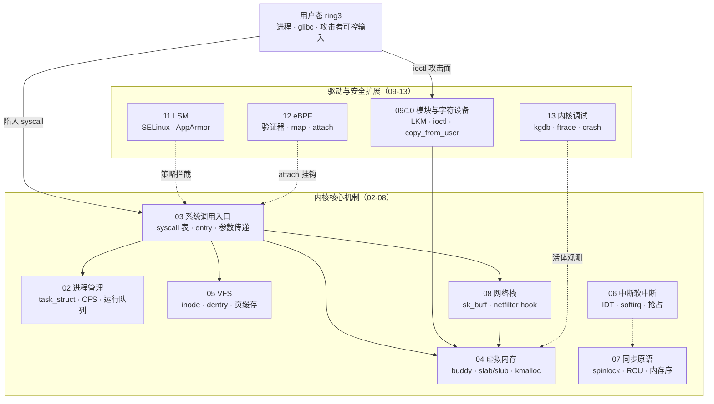
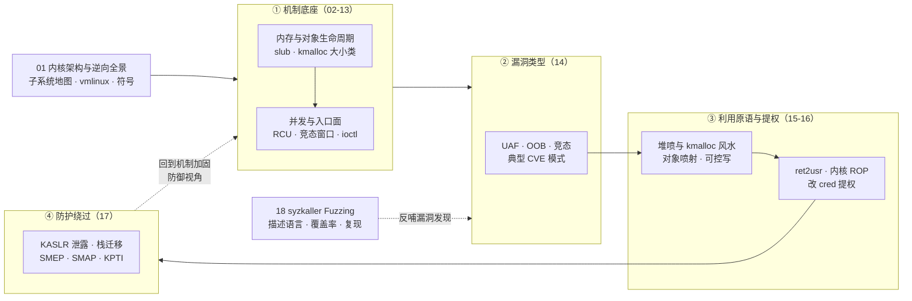

# Linux内核机制与内核利用 · 系列总览

> 与 [[38.Windows内核与驱动逆向/00.Windows内核与驱动逆向总览|系列 38（Windows 内核）]] 对称的 Linux 侧：从**子系统机制**入手，逐层推进到**内核漏洞类型 → 提权利用 → 防护绕过 → 自动化挖掘**，全程以逆向工程视角拆解 vmlinux 与内核对象的真实内存布局。上承 [[15.操作系统加载与启动/10.系统调用机制|系列 15]]——系列 15 讲"用户态如何陷入内核"，本系列接着讲"陷入之后内核如何运转，以及这套运转机制如何被攻击、又如何被加固"。

内核既是整个系统的信任根，也是攻防的终极战场：一处 `slab` 越界或一个 `ioctl` 的 `copy_from_user` 失校验，就可能把普通用户拉到 `ring0`。因此本系列坚持**先机制、后利用**——只有真正理解 `task_struct`、`kmalloc` 大小类与 RCU，才能看懂 UAF 为何可控、堆喷为何生效、KASLR 为何被泄露击穿。

> [!warning] 合规边界与学习建议
> **合规边界**：本系列涉及内核漏洞利用、提权与防护绕过技术，**仅限用于自有或已获明确书面授权的环境、CTF 靶场与合法安全研究**。所有利用手法均以**防御视角**呈现——复原攻击链的目的是加固检测、缓解与补丁，而非未授权入侵。对生产系统或他人资产进行未授权测试可能触犯《网络安全法》《刑法》等相关法律，后果自负。
> **学习建议**：
> - **先机制、后利用**：01-13 的子系统机制（尤其 04 的 slub 分配器、07 的 RCU、10 的 ioctl 攻击面）是理解 14-18 利用链的前提；跳读利用章节只会停留在"抄 EXP"层面，换个内核版本即失效。
> - **动手环境**：用 `QEMU` + 自编内核 + `KASAN`/`KMSAN` 复现，配合第 13 章的 `kgdb`/`ftrace`/`crash` 活体观测对象的分配、释放与复用时机，比读文字直观一个数量级。
> - **版本敏感**：内核利用高度依赖版本与配置（`CONFIG_*`、分配器实现、`CONFIG_SLAB_FREELIST_HARDENED` 等缓解），务必锁定内核版本与 `.config` 对照阅读，切忌跨版本硬套。
> - **对照 Windows**：与系列 38 对称阅读，池风水、`cred`/`_TOKEN` 结构、缓解机制的异同能显著加深理解，也便于建立跨平台的攻防直觉。

## 篇目导航

| # | 章节 | 说明 |
| --- | --- | --- |
| 01 | [[01.Linux内核架构与逆向全景]] | 子系统地图、vmlinux 分析、内核符号 |
| 02 | [[02.进程管理与CFS调度器]] | task_struct、调度类、运行队列 |
| 03 | [[03.系统调用实现与入口]] | syscall 表、entry、参数传递，呼应系列 15 |
| 04 | [[04.虚拟内存：伙伴系统与slab与slub]] | 页分配、slab 缓存、kmalloc 大小类 |
| 05 | [[05.VFS与文件系统层]] | inode/dentry/file、挂载、页缓存 |
| 06 | [[06.中断与软中断与内核抢占]] | IDT、softirq/tasklet、抢占点 |
| 07 | [[07.内核同步：自旋锁与RCU]] | 锁类型、RCU 读侧、内存序 |
| 08 | [[08.网络栈与netfilter]] | sk_buff、协议路径、hook 点 |
| 09 | [[09.内核模块与LKM开发]] | 模块加载、符号导出、参数 |
| 10 | [[10.字符设备与ioctl攻击面]] | file_operations、ioctl、copy_from_user |
| 11 | [[11.LSM与SELinux与AppArmor]] | hook 框架、策略、绕过面 |
| 12 | [[12.eBPF架构与验证器]] | 字节码、验证器、map、attach 点与攻击面 |
| 13 | [[13.内核调试：kgdb与ftrace与crash]] | 活体调试、tracepoint、崩溃转储 |
| 14 | [[14.内核漏洞类型：UAF与OOB与竞态]] | 典型 CVE 模式、竞态窗口 |
| 15 | [[15.内核利用原语与堆喷]] | kmalloc 风水、对象喷射、可控写 |
| 16 | [[16.内核提权：ret2usr与ROP与pt_regs]] | ret2usr、内核 ROP、修改 cred |
| 17 | [[17.绕过内核防护：KASLR与SMEP与SMAP与KPTI]] | 信息泄露、栈迁移、绕过技巧，呼应系列 34 |
| 18 | [[18.内核Fuzzing与syzkaller]] | 描述语言、覆盖率、复现，呼应系列 49 |

## 与知识库既有体系的衔接

- Windows 对称：[[38.Windows内核与驱动逆向/13.内核漏洞与利用基础]]、[[38.Windows内核与驱动逆向/26.内核池风水与利用]]
- 启动前置：[[15.操作系统加载与启动/10.系统调用机制]]、[[15.操作系统加载与启动/11.init与systemd启动]]
- 防护呼应：[[34.现代二进制防护机制/15.内核防护与kCFI]]（KASLR/SMEP/SMAP/KPTI）
- Fuzzing 呼应：[[49.Fuzzing与漏洞挖掘/14.内核与驱动Fuzzing：syzkaller]]
