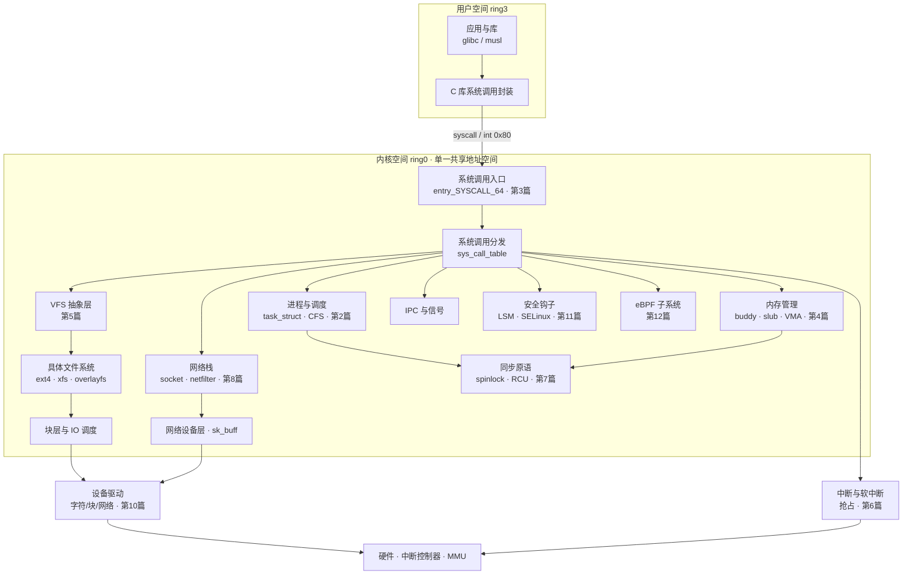
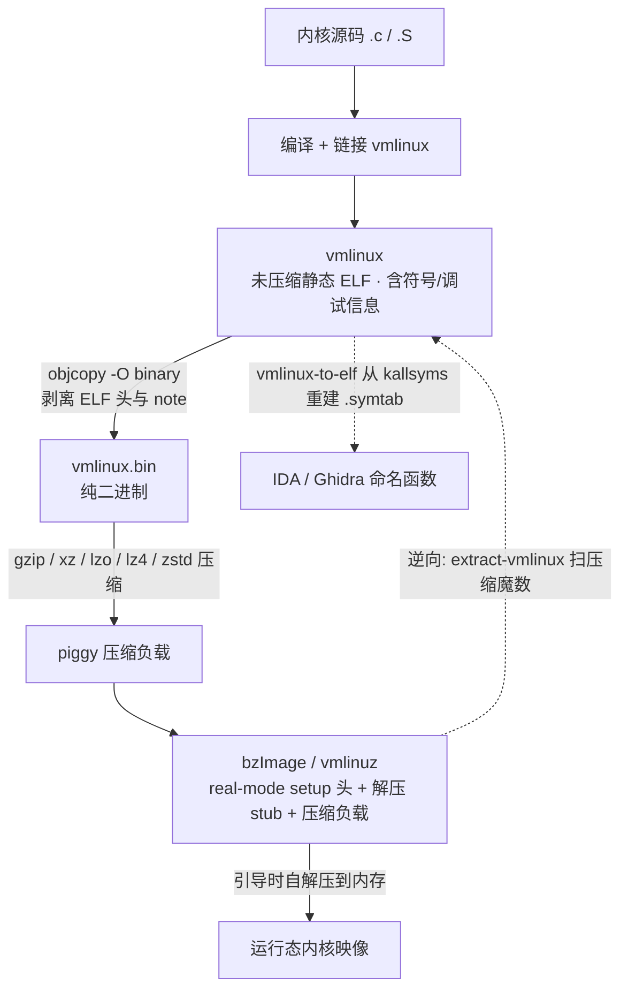

# Linux内核机制与内核利用（1）· Linux内核架构与逆向全景

> [!abstract] TL;DR
> - **Linux 是"模块化单体"（modular monolithic）内核**：进程、内存、VFS、网络、驱动全部跑在 ring 0 同一张地址空间里，跨子系统调用就是普通函数调用、零 IPC 开销——代价是任意一处 bug 都等于全内核权限沦陷，这正是整个利用系列存在的体系结构根因。
> - **逆向内核的第一块拼图是拿到 `vmlinux`**：发行版引导的是压缩态 `bzImage`/`vmlinuz`（real-mode 头 + 解压器 + 压缩负载），必须用 `extract-vmlinux` 按压缩魔数扫描、解出未压缩 ELF，才能喂给 IDA/Ghidra——直接拖 `vmlinuz` 进反汇编器只会看到一段解压 stub。
> - **内核即便 `strip` 掉 `.symtab` 仍有符号**：`CONFIG_KALLSYMS` 把 token 压缩的符号表编进只读数据段（`kallsyms_names`/`kallsyms_offsets`/`kallsyms_token_table`），运行时经 `/proc/kallsyms` 暴露；`vmlinux-to-elf` 能据此重建 `.symtab`，把裸地址一次性还原成命名函数。
> - **BTF（`.BTF` 段）是现代内核逆向的金矿**：`bpftool btf dump ... format c` 一条命令 dump 出全部内核结构体布局，等价于免费的类型信息；配合 `pahole` 能看清 `task_struct`、`cred`、`file` 每个字段的精确偏移与对齐空洞——这些偏移是后续写利用 payload 的硬通货。
> - **KASLR 让 `System.map` 的静态地址在运行时集体平移**：符号之间的"相对布局"不变、"绝对基址"随机，任一符号地址泄露即可反推 `kaslr_base`，进而算出所有其他符号——理解这条"整体平移"关系是后续信息泄露与提权的公共前提。
> - **本篇是全系列的地图与地基**：只铺子系统全景、镜像与符号的逆向基础设施，各子系统的算法内幕（CFS、伙伴系统、slub、RCU、netfilter……）分别下放到第 2～18 篇，避免与后文重复。

---

## 概述与定位

本系列后续十七篇要逐个拆解进程调度、系统调用入口、虚拟内存与堆分配器、VFS、中断与抢占、内核同步、网络栈、模块、字符设备、LSM、eBPF、内核调试，直到内核漏洞类型、利用原语、提权链与各类防护绕过。这些主题看似各自为战，却共享同一套前提知识：**要分析内核、要在内核里找漏洞、要写利用，你首先得能把内核这个几千万行、编译成一整块二进制的庞然大物"拿在手里看清楚"**——它由哪些子系统构成、它们在地址空间里怎么摆放、二进制从哪来、符号怎么找回、结构体布局如何还原。本篇的任务就是在开篇把这张"全景地图"和这套"逆向地基"铺好，让后面每一篇都能直接站在符号、结构体、地址空间的共同词汇表之上展开，而不必反复解释"vmlinux 是什么、commit_creds 的地址怎么找"。

先厘清本篇的边界。它**不**深入任何单一子系统的算法内幕——CFS 的红黑树与虚拟运行时留给第 2 篇，伙伴系统与 slub 的 freelist 留给第 4 篇，RCU 的宽限期留给第 7 篇，netfilter 的钩子链留给第 8 篇。本篇只做三件事，对应种子要点：一是画出**子系统地图**，交代内核由哪些功能块组成、彼此如何协作、在虚拟地址空间里各占哪段；二是讲清 **vmlinux 分析**，即内核二进制的形态谱系（vmlinux / vmlinux.bin / bzImage / vmlinuz）、ELF 分段结构、如何从引导镜像里把它抽出来；三是讲透**内核符号**，即 kallsyms 的内部数据结构、System.map 与 /proc/kallsyms 的关系、strip 后如何还原符号、KASLR 如何改变符号地址的语义。三者合起来，就是一切内核逆向与利用工作的"开机自检"。

为什么内核逆向要单独作为一个系列的开篇，而不能沿用用户态逆向那套经验？因为内核这个目标有几个根本性的不同。**其一，没有 libc、没有标准 ABI 边界的清晰函数库**：用户态程序里 `printf`、`malloc` 一眼可辨，内核里全是内部实现，命名规律、调用约定、错误处理都是内核自己那套（返回负 errno、`ERR_PTR`/`IS_ERR` 编码指针、大量 `goto` 错误处理）。**其二，它是一整块静态链接的二进制**：几万个函数编进一个 ELF，没有动态符号表的导入导出可依赖，可加载模块（LKM）另算。**其三，它高度依赖架构与编译配置**：同一份源码在 x86-64、arm64、riscv 上布局迥异，开没开 `CONFIG_KALLSYMS`、`CONFIG_DEBUG_INFO_BTF`、`CONFIG_RANDSTRUCT` 直接决定你能拿到多少信息。**其四，运行态还叠了 KASLR、SMEP、SMAP、KPTI、kCFI 一层层防护**（防护绕过留到第 17 篇，此处只需知道它们让"静态地址"和"运行时地址"分了家）。把这四条差异吃透，才能理解为什么内核逆向的第一步永远是"搞到带符号的 vmlinux"。

在知识库的坐标系里，本篇上承 [[15.操作系统加载与启动/11.init与systemd启动]]（内核如何被引导、解压、移交控制权）与 [[15.操作系统加载与启动/10.系统调用机制]]（用户态如何跨过那道门进入内核），横向对照 [[38.Windows内核与驱动逆向/13.内核漏洞与利用基础]]（Windows 侧的对称主题：ntoskrnl、PDB 符号、内核池），下启本系列后续所有子系统与利用篇。可以把本篇理解为：在你动手拆任何一个子系统之前，先学会怎么"打开发动机盖、认清每个部件、读懂零件编号"。

## 原理与机制

### 单体 vs 微内核：为什么这套架构决定了利用的可能性

Linux 属于**单体内核**（monolithic kernel）：调度器、内存管理、文件系统、网络协议栈、设备驱动全部编译进同一个二进制、运行在同一个特权级（x86 的 ring 0）、共享同一张内核虚拟地址空间。它们之间的"调用"就是普通的 C 函数调用——VFS 层调 ext4 的 `->read_iter`，就是一次间接跳转，没有任何权限检查、没有地址空间切换、没有消息传递。与之相对的是**微内核**（microkernel，如 Mach、seL4、MINIX 3、QNX）：只把最核心的调度、IPC、基本内存管理留在内核态，文件系统、驱动、网络栈拆成一个个跑在用户态的"服务进程"，彼此靠 IPC 消息通信。

Linux 选单体的理由是**性能**：一次跨子系统协作如果要走用户态服务器的 IPC，就得付出系统调用陷入、上下文切换、消息拷贝、再切回的代价，而单体内核里这一切退化为一条 `call` 指令。但这份性能红利有一个对安全研究至关重要的副作用——**特权不隔离**：既然所有子系统共享 ring 0 与同一地址空间，那么任何一个驱动、任何一个协议解析函数里的一处越界写、一次释放后使用，理论上都能被驱动成对整个内核内存的任意读写，进而改写当前进程的 `cred` 结构完成提权。微内核里一个 USB 驱动崩了顶多那个服务进程挂掉，单体内核里同样的 bug 就是 root。这条"共享地址空间 = 全权限攻击面"的性质，是整个利用系列（第 14～18 篇）成立的物理前提；本篇之所以要先讲架构，正是要让读者从一开始就理解：**内核利用的本质，是把某个子系统里的一个内存错误，沿着这张共享地址空间放大成对 `cred`/页表/`modprobe_path` 等关键对象的控制**。

需要澄清一个常见误解：Linux 虽是单体，却是**模块化**单体。可加载内核模块（LKM，第 9 篇）允许驱动在运行时插入/卸载，`EXPORT_SYMBOL` 机制让核心代码把接口导出给模块调用。但这只是**代码组织与加载时机**的模块化，不是**特权与地址空间**的隔离——模块一旦加载就和内核本体平起平坐，同在 ring 0、同一地址空间。所以"模块化"绝不等于"微内核化"，这一点在评估攻击面时必须分清。

### 子系统地图：一张图看懂内核由什么构成

下图给出内核的功能分层与主要子系统。上方是用户态经系统调用进入的入口，中间是各大子系统（本系列后续篇章逐一展开），下方是硬件抽象。请把它当作全系列的"目录索引"来读：



从逆向视角看这张图有三个抓手值得记住。**第一，`sys_call_table` 是全内核最重要的"总目录"**：它是一张函数指针数组，下标是系统调用号，元素指向 `__x64_sys_xxx` 实现。找到它就等于找到了从用户态可达的所有内核入口，也是历史上 rootkit 最爱 hook 的地方（现代内核把它放进只读段并加了保护，细节留给第 3、9 篇）。**第二，各子系统之间大量通过"操作表"（ops struct）解耦**：`file_operations`、`inode_operations`、`net_device_ops`、`proto_ops` 全是函数指针结构体，这既是内核的多态实现方式，也是利用中最经典的"控制流劫持点"——很多 UAF 利用的最后一步就是伪造一个 ops 表让内核跳到可控地址（原语细节第 15、16 篇）。**第三，`task_struct` 是进程宇宙的中心**：它挂着 `cred`（权限）、`mm_struct`（地址空间）、`files_struct`（打开的文件）、命名空间等一切，提权的终点几乎总是"改到当前 task 的 cred"。把这三个抓手记牢，后面读任何子系统都能快速定位"从这里能摸到哪些关键对象"。

### 内核在虚拟地址空间里的摆放

理解符号地址、理解 KASLR、理解"直接映射区"这些概念，前提是先看清 x86-64 内核的虚拟地址布局。内核活在 canonical 地址空间的**上半**（高地址），用户态在**下半**，中间隔着一大段"非 canonical 空洞"（高 17 位必须全 0 或全 1，硬件强制）：

```
x86-64 内核虚拟地址布局（4 级页表 / 48 位，KASLR 关闭时的典型值）
0x0000000000000000 – 0x00007fffffffffff   用户空间（低 128 TB，canonical 下半）
      ┈┈┈┈┈  非 canonical 空洞：高 17 位非全 0/全 1 的地址一律触发 #GP  ┈┈┈┈┈
0xffff800000000000 – 0xffffffffffffffff   内核空间（canonical 上半）
0xffff888000000000   page_offset_base     全部物理内存的"直接映射"（direct map / linear map）
0xffffc90000000000   vmalloc_base         vmalloc / ioremap 虚拟连续区
0xffffea0000000000   vmemmap_base         struct page 数组（每个物理页一个描述符）
0xffffffff80000000   __START_KERNEL_map   内核代码与数据（.text/.data/.bss 起点）
0xffffffffa0000000   MODULES_VADDR        可加载模块（LKM）映射区
```

这张表里有几个概念是后续所有篇章的公共货币。**直接映射区（direct map）**把全部物理内存线性映射到内核虚拟空间，`__pa()`/`__va()` 宏就是在这段做简单的加减偏移换算——这意味着内核几乎总能通过一个固定偏移访问任意物理页，是很多"任意物理地址读写"利用的落脚点。**vmemmap** 存放 `struct page` 数组，物理页帧号（pfn）直接当下标，物理地址与 `struct page` 之间因此能 O(1) 互转。**内核 text 段**从 `__START_KERNEL_map` 起，这是符号地址的基准区；**模块区**单独一段，所以模块符号和内核本体符号地址范围不同，逆向时看地址高位就能判断"这是内核本体还是某个 .ko"。

KASLR（Kernel Address Space Layout Randomization）做的事，就是在引导时给 `page_offset_base`、`vmalloc_base`、`vmemmap_base` 以及内核 text 基址各加一个随机偏移。关键在于——**内核 text 段内部各符号之间的相对距离不变**，随机的只是整段的起始基址。因此一旦你通过某种信息泄露拿到任意一个内核符号的运行时地址，就能用它减去该符号在 `System.map` 里的静态地址，算出这一次引导的 text 基址偏移（`kaslr_offset`），再把这个偏移加到任何其他符号的静态地址上，就得到它的运行时地址。这条"整体平移、相对不变"的性质，是后续信息泄露与提权篇（第 16、17 篇）反复利用的公共杠杆，务必在本篇就建立直觉。

### 从源码到可引导镜像：形态谱系

内核二进制不是单一文件，而是一条加工流水线上的若干形态。理解它们的谱系，才知道逆向时手里拿的到底是哪一环、缺了什么。下图给出正向构建与逆向抽取的对照：



**`vmlinux`** 是链接器产出的、未压缩的静态 ELF 可执行文件，包含全部代码、数据，若构建时保留则还含 `.symtab` 与 DWARF 调试信息。它是逆向的理想输入，但发行版几乎从不直接部署它。**`vmlinux.bin`** 是 `vmlinux` 经 `objcopy -O binary` 剥掉 ELF 头、note、符号后的纯二进制镜像——只剩要装载进内存的字节。**`bzImage`/`vmlinuz`** 才是 `/boot` 下真正被引导的东西：名字里的 "bz" 是 "big zImage"（能装载超过 512 KB 的大内核），**与 bzip2 毫无关系**，这是最常见的误解。它由三部分拼成——一段 16 位实模式 setup 代码（含 boot protocol 头，告诉 bootloader 各种参数）、一段解压 stub、以及被压缩的 `vmlinux.bin`（压缩算法由 `CONFIG_KERNEL_GZIP/XZ/ZSTD/...` 决定）。引导时 setup 头把控制权交给解压 stub，后者就地把压缩负载解开成运行态内核。

对逆向者而言，最关键的一条认知是：**直接把 `/boot/vmlinuz-*` 拖进 IDA/Ghidra 是错的**——你看到的只会是那段实模式 setup 和解压 stub，真正的内核代码还压在负载里。正确的第一步永远是先 `extract-vmlinux` 还原出 `vmlinux`，这也引出下一节的深度详解。

## 内核镜像剖析与符号还原详解

这一段把"vmlinux 分析 + 内核符号"两个种子要点合并深挖，因为在实践中它们是同一件事的两面：拿到 vmlinux 是为了看清代码，而看清代码离不开符号。

### vmlinux 的 ELF 分段：每段告诉你什么

`vmlinux` 是一个再普通不过的 ELF，但它的节区（section）布局携带了大量内核特有信息。用 `readelf -S vmlinux` 能看到几十个节，其中对逆向/利用最有价值的是这些：

```
节名                     含义与逆向价值
.text                    内核主体代码；符号地址的基准区（对应 __START_KERNEL_map 之后）
.init.text / .init.data  仅在引导阶段执行的初始化代码/数据，boot 后被 free_initmem() 回收
.rodata                  只读数据；sys_call_table 现代已放这里以防改写
.data / .bss             可写数据 / 未初始化数据
__ksymtab                EXPORT_SYMBOL 导出的符号表（供模块链接），泄露了"哪些函数被导出"
__ksymtab_gpl            EXPORT_SYMBOL_GPL 导出的符号表
__kcrctab                导出符号的 CRC，用于模块版本校验（vermagic/modversions）
__param                  内核启动参数（module_param）描述表
.altinstructions         "指令替换"元数据：引导时按 CPU 特性把某条指令热补丁成另一条
__ex_table               异常表：把可能触发缺页的指令与其修复地址配对（copy_from_user 等）
__bug_table              BUG()/WARN() 的文件行号表，逆向时能反推源码位置
__jump_table             static key（静态跳转补丁）的位置表
.BTF                     BPF 类型格式：全部内核类型的紧凑描述（详见下文，逆向金矿）
.symtab / .strtab        完整符号表（仅当未 strip 时存在）
.note.gnu.build-id       构建指纹，用于把 vmlinux 与其分离调试包精确配对
```

值得停下来讲清几个"为什么"。**`.init.text` 引导后被回收**这件事解释了一个逆向常见困惑：某些初始化函数在运行态内存里"消失"了——因为那段虚拟地址在 `free_initmem()` 后被归还，你在静态 vmlinux 里能看到、在运行内核的 `/proc/kcore` 里却读不到。**`__ex_table`（异常表）**是理解内核为何能"安全地"访问用户态指针的钥匙：`copy_from_user` 里那条访存指令若触发缺页且用户地址非法，缺页处理器会去异常表里查这条指令对应的修复地址，跳过去返回 `-EFAULT`，而不是 panic——这套机制的存在，也是 SMAP 防护（第 17 篇）要额外拦截"内核直接解引用用户指针"的原因。**`.altinstructions`** 则解释了为什么同一份 vmlinux 静态反汇编出来的指令，和运行时实际执行的可能不一样：内核会按 CPU 是否支持某特性，在引导时就地改写指令（比如把内存屏障换成更强/更弱的形式），逆向动态分析时要意识到这层"运行时自我修改"。

### kallsyms：strip 之后为什么还有符号

用户态程序一旦 strip 掉 `.symtab` 就基本"失明"了，内核却不然——只要构建时开了 `CONFIG_KALLSYMS`（发行版几乎必开），内核会把**一份自带的、经过压缩的符号表编进只读数据段**，与 ELF 的 `.symtab` 完全独立。这就是为什么你在一个 strip 过的 vmlinux 上，或者对着运行内核，依然能通过 `/proc/kallsyms` 拿到几万个函数名与地址。它的核心数据结构如下：

```
CONFIG_KALLSYMS_BASE_RELATIVE=y（现代默认）时的关键符号：
kallsyms_num_syms        符号总数（一个 32 位整数）
kallsyms_names           压缩后的名字流；每条记录 = [长度字节][token 序号...][类型隐含其中]
kallsyms_markers         每 256 个符号在 names 流中的起始偏移，用于二分加速定位
kallsyms_token_table     token 字典：把高频子串（如 "sys_"、"_lock"、"kmem_"）压成单字节
kallsyms_token_index     token 编号 → 在 token_table 中的偏移
kallsyms_offsets         每个符号相对 kallsyms_relative_base 的 32 位有符号偏移
kallsyms_relative_base   偏移基址（存 32 位相对量而非 64 位绝对量，省一半空间且天然抗 KASLR 干扰）
```

它的名字压缩算法很朴素却高效，值得讲透，因为逆向工具正是靠还原它来重建符号。内核里几万个符号名有大量重复子串（无数 `__x64_sys_`、`_lock`、`kmem_cache`）。构建脚本 `scripts/kallsyms.c` 统计出最高频的一批子串，塞进 `kallsyms_token_table`，给每个 token 一个字节编号；然后每个符号名不再存原始字符串，而是存一串 token 字节，解码时逐字节查 `token_index → token_table` 展开拼接即可。第一个字节还兼作 nm 风格的**类型字符**（`T`/`t` 代表全局/局部 text，`D`/`d` data，`R`/`r` rodata，`B`/`b` bss，`A` absolute 等），所以 `/proc/kallsyms` 每行才有"地址 类型 名字"三列。

`kallsyms_offsets` 存**相对偏移**而非绝对地址，是一处精妙设计：一来把每符号 8 字节压到 4 字节、几万符号省下几百 KB；二来天然适配 KASLR——运行时内核只需把随机化后的实际基址填进 `kallsyms_relative_base`，所有符号地址自动跟着平移，无需逐个重定位。这也再次印证前面那条"整体平移、相对不变"的规律。

顺带厘清 **`System.map` 与 kallsyms 的分工**：`System.map` 是构建时由 `nm vmlinux` 经 `scripts/mksysmap` 生成的一份**纯文本、静态**符号地址清单，落在 `/boot/System.map-$(uname -r)`，它记录的是**未经 KASLR 的链接期地址**，主要给崩溃分析、`ksymoops` 等离线工具用。而 kallsyms 是**编进内核、运行时可查**的动态版本，`/proc/kallsyms` 反映的是**已叠加 KASLR 偏移的真实运行地址**（前提是你有权限——`kptr_restrict` 非零时非特权用户看到的地址全是 `0000000000000000`，这是刻意的信息泄露缓解）。逆向时的常用套路：拿 `System.map` 的静态地址做符号名字典，拿 `/proc/kallsyms`（若可读）里同名符号的运行时地址一减，即得本次引导的 KASLR 偏移。

### BTF 与 pahole：把结构体布局白送到手

如果说 kallsyms 解决了"函数叫什么、在哪"，那 **BTF（BPF Type Format）**解决的是逆向里更难的另一半——"结构体长什么样、字段偏移多少"。开启 `CONFIG_DEBUG_INFO_BTF`（现代发行版内核普遍默认开启，因为 eBPF 的 CO-RE 特性依赖它）后，构建过程用 `pahole` 把 DWARF 调试信息**蒸馏**成一份极其紧凑的类型描述，放进 vmlinux 的 `.BTF` 段，运行时还镜像到 `/sys/kernel/btf/vmlinux`。BTF 描述了内核里每一个结构体、联合、枚举、函数原型的完整类型信息，体积却只有完整 DWARF 的零头。

它对逆向的意义怎么强调都不过分：过去要搞清 `task_struct` 里 `cred` 指针在第几个偏移、`cred` 结构里 `uid`/`euid` 各在哪，得靠翻源码 + 手工按 config 推算对齐，费时且极易因版本/配置差异算错。现在一条命令——`bpftool btf dump file /sys/kernel/btf/vmlinux format c`——就能把全部内核类型重新生成成一个 `vmlinux.h` 头文件，字段、嵌套、位域、对齐一应俱全。而这些偏移，恰恰是写内核利用 payload 时的硬通货：改 `cred` 要知道 `uid` 偏移，遍历进程要知道 `task_struct.tasks` 链表偏移，堆风水要知道目标对象的字段布局。`pahole -C task_struct vmlinux` 更能直接打印带**空洞（holes）与填充（padding）**标注的结构体布局——那些因对齐产生的空洞，有时正是溢出利用里"不影响关键字段就能被覆盖"的缓冲地带。

要留意版本与配置差异：BTF 是**这一份**内核的类型快照，换个版本、换个 `.config`，`task_struct` 的字段可能增删、偏移可能平移，所以利用代码里的偏移绝不能跨内核硬编码——正确做法是针对目标内核现场从其 BTF/`System.map` 提取。这也是现代内核利用越来越强调"目标特定"（target-specific）而非"通吃 exploit"的原因之一。

### 对抗逆向的现代内核配置

最后要给全景补一块"暗面"：内核也在主动增加逆向与利用的难度，理解这些才不会在实战中被"为什么和源码对不上"绊倒。**`CONFIG_RANDSTRUCT`**（GCC/Clang 插件）会在编译期**随机打乱**部分敏感结构体（如含函数指针的 ops 结构）的字段顺序，使跨构建的偏移不可预测——这直接废掉硬编码偏移的利用，也让 BTF 成为"每份内核自取偏移"的必需品。**LTO（链接时优化）与激进内联**会让大量小函数消失进调用者体内，反汇编里看不到独立符号。**FGKASLR（函数粒度 KASLR）**进一步在 text 段内部打乱函数排列，破坏"相对距离不变"这一前提（不过部署仍不普遍）。**kCFI/CFI**（第 17 篇细讲）给间接调用加校验，压制 ops 表劫持。这些机制的存在提醒我们：本篇建立的"符号—偏移—地址"三件套是**地基而非万能钥匙**，真实目标上能拿到多少，取决于对方开了哪些配置——逆向的第一步永远包含"侦查目标的构建配置"（读 `/proc/config.gz` 或 `/boot/config-*`）。

## 工具视角与实战

把上面的原理落到具体命令上。以下命令均假设在**自有的测试虚拟机**里对**自己构建或自己发行版**的内核操作（合规边界见下一节）。

**第一步，从引导镜像抽出 vmlinux。** 内核源码树自带脚本，它会扫描镜像里的 gzip/xz/lzo/lz4/zstd 魔数并解压：

```bash
# 内核源码树中的 scripts/extract-vmlinux
./scripts/extract-vmlinux /boot/vmlinuz-$(uname -r) > /tmp/vmlinux
file /tmp/vmlinux          # 期望看到 ELF 64-bit ... statically linked
readelf -S /tmp/vmlinux | grep -E '\.text|\.BTF|symtab'   # 看有哪些节
```

**第二步，若 vmlinux 被 strip、只剩 kallsyms，用 vmlinux-to-elf 重建符号表。** 这个开源工具解析内核内嵌的 kallsyms 数据结构，反向生成一个带完整 `.symtab` 的 ELF，从此 IDA/Ghidra 打开就是命名函数而非一片 `sub_ffffffff81xxxxxx`：

```bash
vmlinux-to-elf /tmp/vmlinux /tmp/vmlinux.symbolized.elf
# 产物可直接拖入 Ghidra/IDA，函数名、系统调用名一应俱全
```

**第三步，取结构体布局。** 有 BTF 就用 BTF，一步到位生成全类型头文件；也可用 pahole 直接看单个结构：

```bash
bpftool btf dump file /sys/kernel/btf/vmlinux format c > /tmp/vmlinux.h
pahole -C task_struct /tmp/vmlinux   # 打印字段偏移、大小、对齐空洞
pahole -C cred /tmp/vmlinux
```

**第四步，查符号地址与 KASLR 偏移。** 特权下 `/proc/kallsyms` 给运行时地址，与 `System.map` 静态地址相减即得本次偏移：

```bash
grep -E ' (commit_creds|prepare_kernel_cred)$' /proc/kallsyms   # 需 root 才见真实地址
grep ' commit_creds$' /boot/System.map-$(uname -r)             # 静态（未 KASLR）地址
zcat /proc/config.gz | grep -E 'KALLSYMS|BTF|RANDSTRUCT|KASLR' # 侦查目标构建配置
```

**第五步，动态分析用 QEMU + gdb。** 这是内核研究最标准的实验台：QEMU 起内核并开 gdbstub，宿主机 gdb 加载带符号 vmlinux 远程连上，可下断、看寄存器、读结构：

```bash
qemu-system-x86_64 -kernel bzImage -initrd rootfs.cpio -append "nokaslr" -s -S ...
gdb /tmp/vmlinux.symbolized.elf -ex 'target remote :1234' \
    -ex 'break __x64_sys_open' -ex 'continue'
# 实验环境常加 nokaslr 关掉随机化，便于地址对齐调试
```

**各反汇编器的取舍。** Ghidra 免费、脚本化（Python/Java）强、社区有成熟的内核加载脚本，适合批量分析与自动化；IDA Pro 商业、交互体验与反编译器（Hex-Rays）业界最强，处理超大 vmlinux 的响应更顺，很多内核逆向公开分析用它；radare2/rizin 轻量、纯命令行、易嵌进脚本流水线。无论用哪个，把上面第二步的"重建符号"和第三步的"导入 BTF 结构体"先做好，反编译质量会有质变——否则面对的是没有类型、没有名字的裸机器码。**crash 工具**则是另一条路：它专为分析运行内核（`/proc/kcore`）和崩溃转储（vmcore）设计，能按结构体语义打印内核对象、遍历链表、看每个 task，调试篇（第 13 篇）会专门展开。

一个贯穿始终的实战心法：**先侦查、再分析**。拿到一个目标内核，顺序永远是——`uname -r` 定版本 → 读 `/proc/config.gz` 或 `/boot/config-*` 看开了哪些 `CONFIG_`（有没有 kallsyms/BTF、有没有 RANDSTRUCT/KASLR）→ 据此决定符号从 `.symtab`、kallsyms 还是分离调试包来 → 结构体从 BTF、DWARF 还是手推来。跳过侦查直接开干，十有八九会在"偏移对不上、地址算不准"上翻车。

## 安全性与正确使用

> [!caution]
> 本文（及本系列）讲解的内核架构分析、vmlinux 抽取、符号与结构体还原、动态调试等一切技术，**仅限用于你自己拥有或已获得明确书面授权的系统、CTF 靶场与合规的安全研究环境**。逆向他人系统的内核、绕过你无权处置的设备上的防护、或将这些方法用于未授权访问、提权、持久化，均可能违反《网络安全法》《数据安全法》《刑法》第二百八十五/二百八十六条等相关法律，后果自负。本系列一律采取**防御与教育视角**：目的是让防御者、研究者、CTF 选手理解内核的攻击面与利用原理，从而更好地加固、检测、修复；**不提供针对任何真实生产系统或他人系统的武器化步骤，不为绕过商业软件授权/DRM 提供成品配方**。原理讲到能自洽复现于自有靶场为止，"打某个真实目标"的临门一脚不在本系列范围内。

除了法律合规，还有几条**技术安全**注意，避免自伤：一是**所有实验务必在虚拟机或隔离靶机里做**，内核态一个越界写就可能损坏文件系统或让宿主机内核崩溃、丢数据——QEMU/KVM 快照是你的好朋友，每次危险实验前先打快照。二是**不要在生产机上跑 `/proc/kcore` 的重读取或加载来路不明的 .ko**：加载模块等于把任意 ring 0 代码请进内核，供应链风险极高。三是**注意信息泄露边界**：`kptr_restrict`、`dmesg_restrict`、`perf_event_paranoid` 这些 sysctl 存在的意义就是限制符号/地址泄露，研究时为方便常调低它们，但**调低后的机器不要暴露在不可信网络里**，实验完记得复原。四是**尊重 GPL 与导出符号语义**：`EXPORT_SYMBOL_GPL` 表达的是"仅供 GPL 兼容模块使用"的法律与工程意图，逆向学习无碍，但据此写闭源模块规避许可是另一回事。把这些边界内化成肌肉记忆，才能在"把原理学透"和"不越界、不自伤"之间稳稳站住。

## 小结

本篇为整个《Linux内核机制与内核利用》系列铺好了地图与地基。三条主线请务必带走：**其一，架构决定攻击面**——Linux 的模块化单体设计让所有子系统共享 ring 0 与同一地址空间，性能换来的是"任一 bug 即全权限"，这是后续利用篇成立的根因；那张子系统地图里的 `sys_call_table`、各类 ops 函数指针表、`task_struct→cred` 是贯穿全系列的三个关键抓手。**其二，逆向从"拿到 vmlinux"开始**——发行版部署的是压缩态 `bzImage`/`vmlinuz`，必须先 `extract-vmlinux` 还原未压缩 ELF，其分段（`.text`/`.init.*`/`__ex_table`/`.altinstructions`/`.BTF`）各自携带独特的逆向信息。**其三，符号与偏移是硬通货**——kallsyms 让 strip 后的内核仍自带 token 压缩符号表，`vmlinux-to-elf` 据此重建 `.symtab`，BTF/`pahole` 白送全部结构体布局，而 KASLR 只做"整体平移、相对不变"的随机化，泄露任一符号即可反推全部地址。把"侦查配置 → 取符号 → 取结构体 → 静动结合分析"这套流程走顺，你就具备了打开后续任何一篇的钥匙。下一篇进入第一个具体子系统：进程管理与 CFS 调度器，我们会从 `task_struct` 这个"进程宇宙的中心"出发，看内核如何组织和调度成千上万个任务。

## 相关阅读

- 本系列纵深：[[02.进程管理与CFS调度器|→ task_struct 与调度器内幕]]、[[03.系统调用实现与入口|系统调用入口与 sys_call_table]]、[[04.虚拟内存：伙伴系统与slab与slub|内存管理与堆分配器]]、[[16.内核提权：ret2usr与ROP与pt_regs|提权链与 pt_regs]]、[[17.绕过内核防护：KASLR与SMEP与SMAP与KPTI|KASLR/SMEP/SMAP/KPTI 绕过]]
- Windows 对称主题：[[38.Windows内核与驱动逆向/13.内核漏洞与利用基础]]、[[38.Windows内核与驱动逆向/26.内核池风水与利用]]
- 引导与启动前置：[[15.操作系统加载与启动/11.init与systemd启动]]、[[15.操作系统加载与启动/10.系统调用机制]]
- 防护呼应：[[34.现代二进制防护机制/15.内核防护与kCFI]]（KASLR/SMEP/SMAP/KPTI/kCFI 的实现细节）
- Fuzzing 呼应：[[49.Fuzzing与漏洞挖掘/14.内核与驱动Fuzzing：syzkaller]]（如何自动化找出本篇所说的子系统 bug）
- 官方文档与书目：Linux 内核源码 `Documentation/`（尤其 `admin-guide/`、`bpf/btf.rst`、`x86/x86_64/mm.rst`）；kernel.org 在线文档 https://www.kernel.org/doc/html/latest/ ；Bovet & Cesati《Understanding the Linux Kernel》；Robert Love《Linux Kernel Development》；Perla & Oldani《A Guide to Kernel Exploitation》；LWN.net 的 kallsyms/BTF/KASLR 专题文章

[[00.Linux内核机制与内核利用总览|⬆ 系列总览]] | [[02.进程管理与CFS调度器|→ 下一章]]
