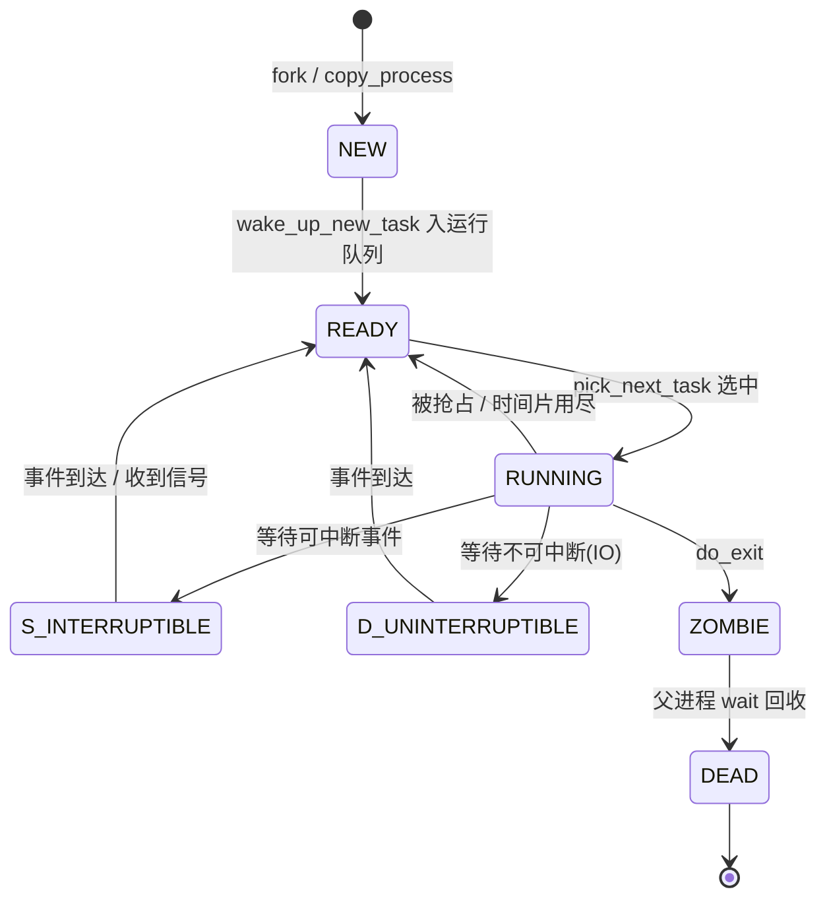
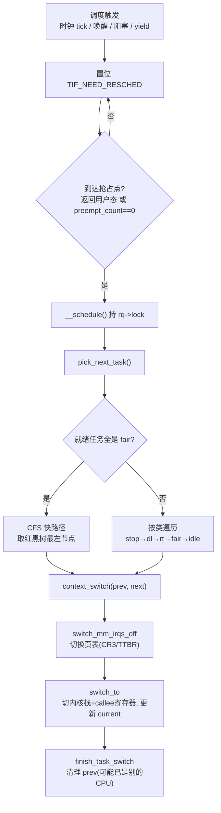

# Linux内核机制与内核利用（2）· 进程管理与CFS调度器
> [!abstract] TL;DR
> - Linux 不区分「进程」与「线程」，一切可调度实体都是 `task_struct`，线程只是共享 `mm/files/signal` 的一组 `task_struct`（同一 `tgid`）；`current` 宏在 x86-64 用 GS 段的 per-CPU 变量、在 arm64 用 `sp_el0` 常数级取到它。
> - 调度器是一个五级「调度类」栈：`stop → dl → rt → fair → idle`，`pick_next_task()` 严格按此优先级挑选；CFS（`fair_sched_class`）用 `vruntime`（按权重归一化的虚拟运行时间）为键、以红黑树最左节点为「下一个该跑的任务」，实现 O(log n) 挑选与近似完全公平。
> - `nice` 值经 `sched_prio_to_weight[]` 映射为权重，相邻级差约 1.25 倍 ≈ 10% CPU 份额；`vruntime += delta_exec × NICE_0_LOAD / weight`——权重越大 `vruntime` 走得越慢、占用 CPU 越多，这就是优先级的全部数学本质。
> - 6.6 起 CFS 内核被 **EEVDF**（最早有资格虚拟截止期优先）替换：用 `lag/eligible/virtual-deadline` 取代 `min_vruntime` 加一堆 buddy 启发式，延迟更可控；`sched_latency/min_granularity` 被 `base_slice_ns` 取代——这是逆向新老内核时最容易踩的版本差异。
> - `task_struct` 是内核提权的头号目标：`->cred` 指向的 `struct cred` 装着 uid/gid/capabilities，`commit_creds(prepare_kernel_cred(...))` 或直接把 `cred->uid` 覆写为 0 即 root；`comm[16]` 常被用作在堆喷中定位 `task_struct` 的指纹。

## 概述与定位

本篇是《Linux内核机制与内核利用》系列的第 2 篇。上一篇[[01.Linux内核架构与逆向全景|Linux内核架构与逆向全景]]给出了子系统地图与 `vmlinux` 逆向的宏观框架，本篇把镜头推近到内核最核心、也最「有生命」的子系统——**进程管理与调度**。它回答三个问题：内核用什么数据结构描述一个「正在活着的执行流」（`task_struct`）？内核如何在成百上千个就绪任务里决定「下一微秒 CPU 归谁」（调度类与 CFS/EEVDF 算法）？以及这套机制在内存里长什么样、为什么它是攻击者梦寐以求的提权跳板。

之所以把它放在整个系列的第二位，是因为它是后续几乎所有主题的地基。[[03.系统调用实现与入口|系统调用]]的入口最终要落到「当前进程」`current` 上；[[04.虚拟内存：伙伴系统与slab与slub|虚拟内存]]管理的 `mm_struct` 挂在 `task_struct` 下；[[06.中断与软中断与内核抢占|内核抢占]]的本质就是「在中断返回或临界区退出时触发一次重新调度」；而本系列后半段的[[16.内核提权：ret2usr与ROP与pt_regs|内核提权]]，其「最后一击」几乎总是落在 `task_struct->cred` 上。可以说，理解了 `task_struct` 与调度器，你就握住了 Linux 内核这台机器的方向盘与仪表盘。

需要划清边界：**抢占的触发时机与软中断细节**留给第 6 篇，**同步原语（`rq->lock`、RCU 保护的进程链表）**留给[[07.内核同步：自旋锁与RCU|第 7 篇]]，本篇只在必要处点到；**`pt_regs` 与提权 ROP 链**的构造细节留给第 16 篇，本篇只讲清「为什么 `cred` 是终点」。本篇的核心交付物是：把 `task_struct` 的关键字段、调度类栈、CFS/EEVDF 的算法与红黑树、以及它们在逆向与利用中的观察方法讲透。

## 原理与机制

### 一切皆 task：进程与线程的统一

Linux 内核里没有独立的「线程」类型。无论是用户态进程、内核线程（`kthread`）、还是 pthread 库创建的线程，在内核眼里都是一个 `task_struct`，也叫「任务」。`fork()`、`pthread_create()`、`vfork()` 最终都汇聚到 `clone()` 系统调用，只是传入的 `CLONE_*` 标志不同：

- 普通进程：几乎不共享，`copy_process()` 会复制一份新的 `mm_struct`（写时复制页表）、`files_struct`、`signal_struct`。
- 线程：带 `CLONE_VM | CLONE_THREAD | CLONE_SIGHAND | CLONE_FILES | CLONE_FS`，于是新 `task_struct` 与创建者**共享**地址空间、信号处理表、文件表，只有内核栈和寄存器上下文是独立的。

区分它们的是两个 id：`pid` 是内核调度看到的「任务号」（对用户态 pthread 而言就是 TID），`tgid`（thread group id）才是用户态 `getpid()` 看到的「进程号」。一个进程的主线程 `pid == tgid`；同组其它线程 `tgid` 相同、`pid` 各异。理解这一点，你才能看懂 `/proc/<pid>/task/<tid>/` 的目录结构，以及为什么 `ps -eLf` 能列出线程而 `ps -e` 不能。

**为什么这样设计（why）**：把线程做成「共享部分资源的任务」而非独立类型，让调度器只需面对一种实体，逻辑极大简化——调度器根本不关心你是进程还是线程，它只对 `task_struct` 排队。代价是「进程组语义」（信号投递、退出同步）要靠 `signal_struct` 额外维护。这与 Windows「进程是容器、线程才是调度单位」的二元模型形成鲜明对比（见 [[38.Windows内核与驱动逆向/13.内核漏洞与利用基础|Windows 内核漏洞与利用基础]]），也解释了为什么 Linux 下「线程」的创建/切换开销天然接近进程。

### task_struct：进程的「全部身份」

`task_struct`（定义在 `include/linux/sched.h`）是内核里最大的结构体之一，动辄数 KB，字段随配置（`CONFIG_*`）伸缩。逆向时不必背下全部，抓住几类关键字段即可：

```c
struct task_struct {
    unsigned int         __state;      // 进程状态（旧内核为 volatile long state）
    void                *stack;        // 内核栈基址（THREAD_SIZE，通常 16KB）
    unsigned int         flags;        // PF_KTHREAD / PF_EXITING ...
    int                  prio, static_prio, normal_prio;
    const struct sched_class *sched_class; // ★ 指向所属调度类
    struct sched_entity  se;           // CFS 调度实体（含 vruntime）
    struct sched_rt_entity rt;         // 实时调度实体
    struct sched_dl_entity dl;         // Deadline 调度实体
    unsigned int         policy;       // SCHED_NORMAL / FIFO / RR / DEADLINE ...
    cpumask_t            cpus_mask;    // CPU 亲和性
    struct mm_struct    *mm, *active_mm;// 地址空间（内核线程 mm==NULL，借 active_mm）
    pid_t                pid, tgid;     // 任务号 / 线程组号
    struct task_struct  *real_parent, *parent, *group_leader;
    struct list_head     children, sibling; // 进程树
    const struct cred   *real_cred, *cred;  // ★★ 凭据：uid/gid/capabilities
    char                 comm[16];     // 进程名（TASK_COMM_LEN=16，含 '\0'）
    struct files_struct *files;        // 打开文件表
    struct fs_struct    *fs;           // cwd / root
    struct nsproxy      *nsproxy;      // 命名空间（容器隔离的核心）
    struct thread_struct thread;       // 架构相关：内核栈指针/FPU/段寄存器（置于末尾）
};
```

几个值得单独强调的点：

- **`thread` 放在末尾**：它包含架构相关、大小可变的 FPU/寄存器状态，所以整个 `task_struct` 从专用 slab 缓存 `task_struct_cachep` 分配（见第 4 篇 slab）。
- **`comm[16]`**：进程名固定 16 字节，是逆向定位的「路标」——在内核堆里 dump 一段内存，看到可打印的短字符串后跟指针，八成命中了 `task_struct` 或其邻近结构。
- **`cred` 与 `real_cred`**：分别是「有效凭据」和「真实凭据」，正常情况下指向同一个 `struct cred`。它是本篇安全小节的主角。
- **`__state` 的改名**：Linux 5.14 起把 `volatile long state` 改名为 `unsigned int __state`，并要求用 `READ_ONCE(p->__state)` 访问。写 eBPF/crash 脚本跨版本时这是常见的编译不过原因。

### 进程状态机

`__state` 是一组位标志，描述任务当前处境：`TASK_RUNNING(0)`（就绪或正在运行）、`TASK_INTERRUPTIBLE(1)`（可被信号唤醒的睡眠，即 `ps` 里的 `S`）、`TASK_UNINTERRUPTIBLE(2)`（不可中断睡眠，`D` 态，常见于 IO 等待）、`__TASK_STOPPED`/`__TASK_TRACED`（被停止/被 ptrace 跟踪）、以及退出路径上的 `EXIT_ZOMBIE`（僵尸，等父进程 `wait`）与 `EXIT_DEAD`。`TASK_KILLABLE = TASK_UNINTERRUPTIBLE | TASK_WAKEKILL` 是个巧妙折中：既不可被普通信号打断，又能被致命信号杀死，避免了纯 `D` 态进程「杀不掉」的运维噩梦。



### 调度类栈：策略的分层

Linux 调度器不是一坨 if-else，而是一个**面向对象的调度类链表**。每个调度类是一组函数指针（`enqueue_task`/`dequeue_task`/`pick_next_task`/`task_tick`/`select_task_rq` 等），按优先级从高到低串成一条链：

| 调度类 | 服务的策略 | 用途 |
|---|---|---|
| `stop_sched_class` | 无（最高） | stop-machine、CPU 热插拔、迁移线程，抢占一切 |
| `dl_sched_class` | `SCHED_DEADLINE` | EDF+CBS，硬实时，给「周期+运行时+截止期」 |
| `rt_sched_class` | `SCHED_FIFO`/`SCHED_RR` | 固定优先级实时（0–99） |
| `fair_sched_class` | `SCHED_NORMAL`/`BATCH`/`IDLE` | CFS/EEVDF，绝大多数普通任务 |
| `idle_sched_class` | 无（最低） | 每 CPU 的 idle 任务（swapper） |

`pick_next_task()` 从最高优先级类开始问「你这有活干吗」，第一个答「有」的类就贡献下一个任务。**为什么用链表而非数组遍历（why）**：这让实时任务永远优先于普通任务（一个 `SCHED_FIFO` 任务只要就绪，CFS 任务就别想跑），同时把不同调度策略的实现彻底解耦——加一种新策略只需实现一个 `sched_class`，主调度器代码不用动。内核还做了关键优化：若运行队列里所有任务都是 fair 类（`rq->nr_running == rq->cfs.h_nr_running`），直接走 CFS 快速路径，省去逐类询问的开销——这条快路径覆盖了服务器上绝大多数时刻。

### 运行队列：每 CPU 一份

调度是**每 CPU 独立**的：全局 per-CPU 变量 `runqueues`，`this_rq()`/`cpu_rq(cpu)` 取当前/指定 CPU 的 `struct rq`。一个 `rq` 内嵌各调度类各自的子队列：`cfs`（`struct cfs_rq`，含红黑树）、`rt`（`struct rt_rq`，按优先级的位图+链表数组）、`dl`（`struct dl_rq`，按截止期的红黑树），外加 `curr`（当前任务）、`idle`、`stop` 指针和一把 `raw_spinlock` 保护整个队列。

**为什么每 CPU 一个队列（why）**：全局单队列在多核下是可怕的锁竞争热点——每次调度都要抢同一把锁，核越多越堵。每 CPU 队列让常规调度几乎无锁竞争，代价是要额外的**负载均衡**机制把任务在 CPU 间搬运（周期性均衡、`newidle` 均衡、唤醒时的 `select_task_rq_fair` 选核）。这是「用局部性换伸缩性」的经典权衡，也是 O(1) 调度器时代就确立、CFS 继承并强化的架构决策。

## 结构与算法详解：从 CFS 到 EEVDF

### CFS 的核心思想：模拟「理想多任务 CPU」

CFS（Completely Fair Scheduler，完全公平调度器）由 Ingo Molnar 在 2.6.23（2007）引入，取代了 O(1) 调度器那套充满魔法数字的启发式。它的哲学一句话可概括：**假想一台理想 CPU，能让 n 个就绪任务同时以 1/n 速度并行跑**。真实 CPU 只能串行，于是 CFS 记录每个任务「已经跑了多少（虚拟）时间」，永远挑那个跑得最少的来运行，从而不断向理想状态收敛。

这个「虚拟时间」就是 `vruntime`（存在 `sched_entity` 里）。它不是墙钟时间，而是**按权重归一化**后的运行时间：

```
每次更新（update_curr）：
  delta_exec = now - se->exec_start;                 // 本次实际占用 CPU 的墙钟纳秒
  se->vruntime += delta_exec * NICE_0_LOAD / se->load.weight;

  NICE_0_LOAD = 1024
  · nice  0：weight=1024 → vruntime 与墙钟 1:1 前进
  · nice -5：weight≈3121 → vruntime 前进更慢 → 同样墙钟内“欠账”少 → 更常被选中
  · nice+10：weight≈ 110 → vruntime 前进飞快 → 很快垫底 → 少被选中
```

优先级的全部数学就在这里：**权重越大，`vruntime` 增长越慢，任务越「显得」没怎么跑，就越频繁被红黑树最左端选中，于是拿到更多 CPU。** `nice` 值（-20…+19）经 `sched_prio_to_weight[40]` 表映射为权重，相邻级约 1.25 倍：

```
nice   -20    -15    -10    -5     0      5      10    15    19
weight 88761  29154  9548   3121   1024   335    110   36    15
每差一级 ≈ 1.25×  →  相邻 nice 约 10% 的 CPU 份额差
```

设计成 1.25 倍的等比而非线性，是为了让「`nice` 差值」对应「相对 CPU 比例」而与系统里有多少任务无关——`nice 0` 和 `nice 5` 两个任务共享 CPU，永远是约 1024:335 的比例，加进第三个任务也不改变这两者的相对关系。这是 CFS 相较老调度器「优先级含义随负载漂移」的一大进步。

### 红黑树与 min_vruntime

CFS 把每个 CPU 的就绪 fair 任务按 `vruntime` 为键插入一棵**红黑树**（树根内嵌于 `cfs_rq`，类型 `rb_root_cached`）。红黑树保证插入/删除 O(log n)，而「下一个该跑的任务」永远是**最左节点**（`vruntime` 最小）——`rb_root_cached` 直接缓存了最左指针，取下一个任务是 O(1)。

新任务或跨 CPU 迁移来的任务面临一个公平性陷阱：它的 `vruntime` 可能远小于本队列现有任务（比如刚 `fork` 出来 `vruntime≈0`），若直接入队会「霸占」CPU 很久。CFS 用 `cfs_rq->min_vruntime`（单调递增的地板值）解决：出队时把任务 `vruntime` 记为相对 `min_vruntime` 的偏移，入队到新队列时再加上目标队列的 `min_vruntime`，使其「随行就市」。睡眠唤醒的任务则给予一定补偿（不完全清零欠账），这样交互式任务（频繁睡眠等 IO）醒来后 `vruntime` 偏小，会被优先调度——**这就是 CFS 无需特判就能让桌面「感觉流畅」的原因**：交互式负载天然获得低延迟。

调度周期用 `sched_period`（目标延迟 `sysctl_sched_latency`，默认 6ms）控制：任务数 ≤ `sched_nr_latency`（8）时，每个任务在 6ms 内都能跑一次；超过则周期 = 任务数 × `min_granularity`（0.75ms），保证单次运行不至于碎到 cache 抖动。`sched_slice()` 按权重把周期分配成每个任务应得的时间片。



### EEVDF：6.6 起的接班人（关键版本差异）

从 Linux 6.6（2023 末）开始，`fair_sched_class` 的**内核算法被 EEVDF**（Earliest Eligible Virtual Deadline First，最早有资格虚拟截止期优先，Peter Zijlstra 主导）取代。注意：策略名 `SCHED_NORMAL`、用户可见接口、`nice`/权重体系都没变，变的是「怎么从红黑树里选下一个」。逆向 6.6+ 内核若还按老 CFS 的 `last/next/skip` buddy 与 `min_vruntime` 心智去读源码，会完全对不上。

EEVDF 的模型更严谨。它引入三个量：

```
lag_i = w_i × (V − v_i)     // V=队列加权平均 vruntime；lag>=0 即“有资格(eligible)”
                            //（该任务欠系统的账已还清，轮到它了）
vd_i  = v_i + r_i / w_i     // 虚拟截止期 = 当前 vruntime + 请求时间片 / 权重
调度决策：在所有 eligible 任务中，选虚拟截止期 vd 最小者
```

直觉上：`lag` 度量「一个任务相对公平份额被亏欠/超发了多少」，只有被亏欠（`lag≥0`、eligible）的任务才有资格竞争；在有资格者中，请求越紧急（`vd` 越早）越先跑。红黑树仍以 `vruntime` 为键，但被**增广**（augmented）以在子树里维护最小 `vd`，从而在 eligible 集合内 O(log n) 找到最早 `vd`。这套机制天然支持「延迟敏感」的短任务：一个只想跑很短一片的交互任务，其 `vd` 很早，会插队到长任务前面，且这是**有原则的**（可数学证明有界延迟），而非旧 CFS 那堆 `WAKEUP_PREEMPT`/buddy 补丁式启发式。相应地，`sysctl_sched_latency` 与 `sysctl_sched_min_granularity` 被单一的 `sysctl_sched_base_slice`（默认约 0.75ms，可经 `/sys/kernel/debug/sched/` 调）取代——想要更低延迟就调小 base slice，想要更高吞吐（更少切换）就调大。

### 上下文切换与 current

`__schedule()` 选出 `next` 后调用 `context_switch()`，它干两件大事：`switch_mm_irqs_off()` 切换地址空间（x86-64 写 CR3、arm64 写 TTBR，必要时刷 TLB；内核线程 `mm==NULL` 会借用前任的 `active_mm` 省去切换，即 lazy TLB）；`switch_to()` 是架构宏，保存前任的 callee-saved 寄存器与内核栈指针、装载后任的，并更新 `current`。x86-64 上 `__switch_to_asm` 换 RSP 后跳到 C 函数 `__switch_to` 处理 TLS/FPU；`current` 通过 GS 段的 per-CPU 变量 `pcpu_hot.current_task`（`this_cpu_read_stable`）常数级读取，arm64 则把 `task_struct` 指针常驻 `sp_el0`。切换后新任务从 `finish_task_switch()` 「醒来」，完成对前任的收尾（可能前任已被迁到别的 CPU，这正是那段著名「三个进程」注释的由来）。`CONFIG_THREAD_INFO_IN_TASK` 后 `thread_info` 内嵌在 `task_struct` 开头，内核栈单独分配并可用 `VMAP_STACK` 加保护页防栈溢出——这对第 16 篇讨论的「内核栈越界改 `pt_regs`」攻击面直接相关。

## 工具视角与实战

**观察进程与调度状态**。`/proc/<pid>/status`（含 `State`、`Cpus_allowed`、`Threads`）、`/proc/<pid>/stat`（第 3 字段是状态、第 14/15 是 utime/stime、第 39 是所在 CPU）、`/proc/<pid>/sched`（`se.vruntime`、`sum_exec_runtime`、`nr_switches` 等黄金数据）。`schedtool -v -p` 或 `chrt -p <pid>` 看/改调度策略与优先级，`taskset -p` 看/改 CPU 亲和性。全局视角用 `cat /proc/sched_debug` 或 `/sys/kernel/debug/sched/`（各 CPU 的 `cfs_rq`、`min_vruntime`、每个任务的 `tree-key`）。

**动态追踪**。`ftrace` 的调度事件最直接：`trace-cmd record -e sched_switch -e sched_wakeup`，或 `perf sched record` 后 `perf sched latency`（看每任务被唤醒到实际运行的延迟）、`perf sched map`（可视化各 CPU 上任务的时间占用）。`bpftrace` 一行即可统计切换：`bpftrace -e 'tracepoint:sched:sched_switch { @[args->prev_comm, args->next_comm] = count(); }'`，或用 `kprobe:finish_task_switch` 抓上下文切换时机。这些是分析「为什么我的任务被饿死/延迟抖动」的第一手段。

**逆向 task_struct 与偏移**。分析 `vmlinux` 时，`pahole -C task_struct vmlinux` 直接打印带偏移的字段布局——写内核利用/eBPF 时，`cred`、`comm`、`pid`、`tgid` 的偏移都随内核版本与 `CONFIG_*` 浮动，`pahole` 是获取「本目标内核精确偏移」的权威手段（也可解析 `/sys/kernel/btf/vmlinux` 拿 BTF）。`/proc/kallsyms`（需权限）给出 `init_task`、`init_cred`、`commit_creds`、`prepare_kernel_cred` 等符号地址（KASLR 下是重定位后的运行地址）。

**内核崩溃/在线分析**。`crash` 工具接 `vmcore` 或活内核（`/proc/kcore` + `vmlinux`）：`ps` 列全部任务及其 `task_struct` 地址与状态，`runq` 打印每 CPU 运行队列，`task <addr>` 或 `struct task_struct <addr>` 逐字段 dump，`task -R cred <pid>` 直看凭据，`bt <pid>` 回溯任一任务内核栈。gdb 接 `qemu -s` 调试时，`p $lx_current()`（内核自带的 gdb 脚本 `scripts/gdb/`）能直接取当前 `task_struct`，`lx-ps` 列进程。这些能力在第 13 篇[[13.内核调试：kgdb与ftrace与crash|内核调试]]会系统展开，本篇只强调：**看进程管理，`crash`+`pahole`+`bpftrace` 三件套足以把 `task_struct`/`rq`/红黑树扒到底。**

## 安全性与正确使用

> [!caution] 合规边界
> 本节讲解 `task_struct`/`cred` 为何是提权终点，**仅面向防御、检测与授权研究**：只应在你自有或获得书面授权的环境、CTF 靶场、隔离虚拟机中复现原理。这里给出的是「机制为何成立」的教学性说明，**不提供**针对真实生产系统或他人系统的武器化利用链、不给现成 exploit、不为绕过任何商业授权提供成品配方。把原理用于未授权系统属于违法行为，后果自负。

**为什么 `cred` 是提权的圣杯**。进程的一切权限——uid/gid/euid/egid/suid/sgid、`securebits`、以及 `cap_effective/permitted/inheritable` 等能力集——全装在 `struct cred` 里，由 `task_struct->cred`/`real_cred` 指向。内核做权限判定（`capable()`、文件访问、`setuid` 等）时读的就是它。因此，几乎所有 Linux 内核提权，无论前面的漏洞是 UAF、OOB 还是竞态（见第 14 篇），**最后一步都是「把当前进程的 `cred` 变成 root 的」**。两条经典路径：

- **调用内核 API（需劫持控制流）**：`commit_creds(prepare_kernel_cred(...))`。`prepare_kernel_cred` 造一份内核凭据（uid=0、满 capabilities），`commit_creds` 把它安装到 `current`。注意版本差异：**6.2+ 内核收紧了 `prepare_kernel_cred(NULL)` 的语义**（不再直接复制 `init_cred` 的满权限），研究/CTF 中改为传 `&init_task` 以取 init 进程的 root 凭据。这条路要求已能劫持内核执行流（ROP/`ret2usr`，见第 16 篇），并需绕过 [[17.绕过内核防护：KASLR与SMEP与SMAP与KPTI|SMEP/SMAP/KPTI/KASLR]]（见第 17 篇与 [[34.现代二进制防护机制/15.内核防护与kCFI|内核防护与kCFI]]）。
- **纯数据攻击（只需任意读写）**：不劫持控制流，直接定位 `current`（经 per-CPU `current_task` 或从内核栈底反推），沿 `->cred` 找到 `struct cred`，把其中的 `uid/gid/euid/egid` 和三组 capability 位覆写为 0。因为不改代码指针、不跳转，天然绕过 SMEP/CFI 这类控制流防护——这也是近年内核利用越来越偏爱「data-only」的原因。另一变体是把 `task->cred` 指针整个改指向内核里现成的 `init_cred`。

**历史演进与防护对抗**。老内核（约 5.10 前，随各架构 `set_fs()` 移除，x86-64 在 5.18 彻底删除）里 `thread_info->addr_limit` 曾是热门目标：把它改成 `-1` 即可让 `copy_to/from_user` 读写全部内核地址，等于白得任意读写原语——这一整类攻击已随 `set_fs` 的移除而消失，是「内核用架构改动一次性铲平一个攻击面」的范例。针对 `cred`，内核也在加固：`cred_jar`/`task_struct_cachep` 使用独立 slab 缓存并带 `SLAB_ACCOUNT`，配合 `CONFIG_RANDOM_KMALLOC_CACHES`、`SLAB_VIRTUAL` 等增加「跨缓存（cross-cache）」布局到 `cred/task_struct` 的难度；`comm[16]` 作为堆喷指纹的价值也促使研究者用它做检测（异常 `task_struct` 的 `comm` 与 `pid` 不一致往往是被伪造的信号）。防御侧还可用 LSM（第 11 篇）在 `cred` 变更钩子上告警、用 eBPF 监控 `commit_creds` 调用来源。Windows 侧的对称打法（改 `EPROCESS->Token`、池风水）见 [[38.Windows内核与驱动逆向/26.内核池风水与利用|内核池风水与利用]]，两相对照能看清「凭据在进程对象里、覆写凭据即提权」是跨 OS 的共性弱点。

**正确使用姿势**。研究者应在 `qemu`+`vmlinux`+`gdb` 或专用 CTF 内核镜像里工作，用 `pahole` 拿准偏移、用 `crash` 验证 `cred` 状态，把漏洞挖掘交给 [[49.Fuzzing与漏洞挖掘/14.内核与驱动Fuzzing：syzkaller|syzkaller]]（第 18 篇）这类工具在隔离环境规模化跑。目标永远是理解与加固，而非攻击真实目标。

## 小结

- Linux 用统一的 `task_struct` 描述所有可调度实体，进程/线程之别只是 `CLONE_*` 标志决定的资源共享程度与 `pid`/`tgid` 关系；`current` 是常数级取到的 per-CPU 指针。
- 调度器是 `stop→dl→rt→fair→idle` 五级调度类栈，`pick_next_task()` 严格按类优先级挑选，普通任务落在 CFS/EEVDF 上；运行队列每 CPU 一份以换伸缩性，代价是负载均衡。
- CFS 用「按权重归一化的 `vruntime`」+ 红黑树最左节点实现近似完全公平，`nice` 经等比权重表映射为约 10%/级的 CPU 份额；6.6 起 EEVDF 以 `lag/eligible/virtual-deadline` 取而代之，延迟更可控、更有理论保证——这是逆向新老内核的头号版本坑。
- `task_struct->cred` 是内核提权的终点：`commit_creds(prepare_kernel_cred(&init_task))` 或直接覆写 `cred->uid=0` 即 root；`addr_limit` 类攻击面已随 `set_fs` 移除而消失，防护与利用在 slab 隔离、data-only、cross-cache 上持续拉锯。
- 观察与逆向三件套：`crash`/`bpftrace`/`pahole` 看清 `task_struct`、运行队列与红黑树；`/proc/sched_debug` 与 `perf sched` 诊断公平性与延迟。

## 相关阅读

- 同系列：[[01.Linux内核架构与逆向全景|（1）Linux内核架构与逆向全景]]、[[03.系统调用实现与入口|（3）系统调用实现与入口]]、[[06.中断与软中断与内核抢占|（6）中断与软中断与内核抢占]]、[[07.内核同步：自旋锁与RCU|（7）内核同步：自旋锁与RCU]]、[[16.内核提权：ret2usr与ROP与pt_regs|（16）内核提权：ret2usr与ROP与pt_regs]]、[[17.绕过内核防护：KASLR与SMEP与SMAP与KPTI|（17）绕过内核防护]]
- Windows 对称：[[38.Windows内核与驱动逆向/13.内核漏洞与利用基础|Windows内核漏洞与利用基础]]、[[38.Windows内核与驱动逆向/26.内核池风水与利用|内核池风水与利用]]
- 启动前置：[[15.操作系统加载与启动/10.系统调用机制|系统调用机制]]、[[15.操作系统加载与启动/11.init与systemd启动|init与systemd启动]]
- 防护呼应：[[34.现代二进制防护机制/15.内核防护与kCFI|内核防护与kCFI]]
- Fuzzing 呼应：[[49.Fuzzing与漏洞挖掘/14.内核与驱动Fuzzing：syzkaller|内核与驱动Fuzzing：syzkaller]]
- 官方文档 / 书目：内核源码 `Documentation/scheduler/`（`sched-design-CFS.rst`、`sched-rt-group.rst`、`sched-bwc.rst`、`sched-deadline.rst`）、`include/linux/sched.h` 与 `kernel/sched/{core,fair,sched.h}.c`；LWN 关于 EEVDF 的系列文章（"An EEVDF CPU scheduler for Linux"）；Robert Love《Linux Kernel Development》第 3–4 章；Bovet & Cesati《Understanding the Linux Kernel》进程调度章；Mauerer《Professional Linux Kernel Architecture》。

[[00.Linux内核机制与内核利用总览|⬆ 系列总览]] | [[01.Linux内核架构与逆向全景|← 上一章]] | [[03.系统调用实现与入口|→ 下一章]]
