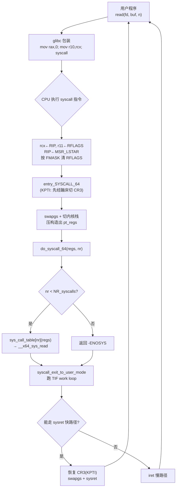
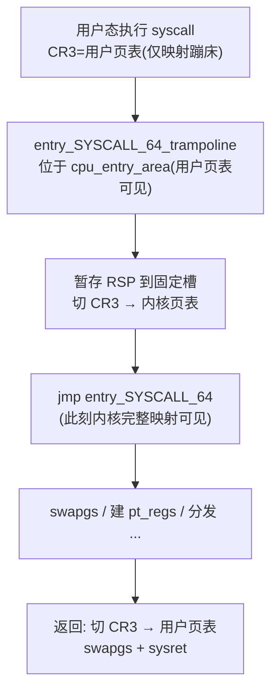
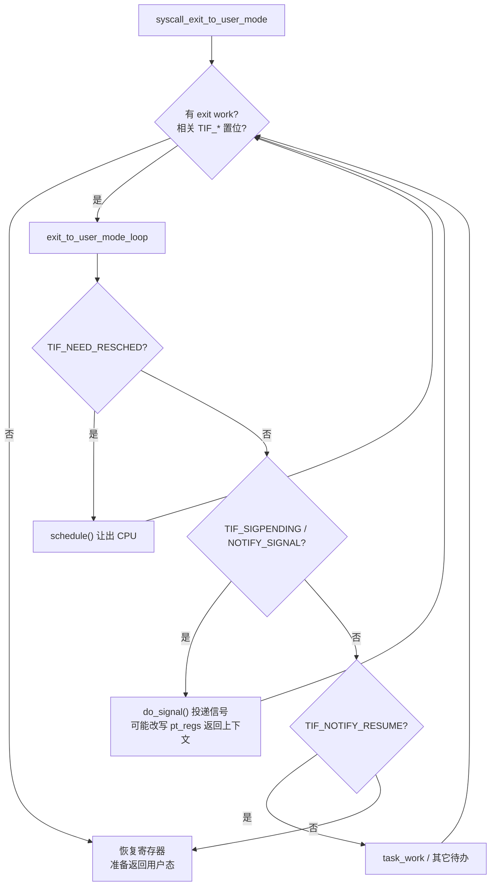

# Linux内核机制与内核利用（3）· 系统调用实现与入口
> [!abstract] TL;DR
> - 系统调用是用户态跨越 ring3→ring0 的**唯一受控闸门**；x86-64 用 `syscall` 指令加 `MSR_LSTAR` 配置入口地址，取代了慢速的 `int 0x80` 软中断门。
> - 参数走一套**独立于 C ABI 的约定**：`rax`(调用号)/`rdi`/`rsi`/`rdx`/`r10`/`r8`/`r9`——第 4 参用 `r10` 而非 `rcx`，因为 `syscall` 硬件把返回 RIP 塞进了 `rcx`、把 RFLAGS 塞进了 `r11`。
> - 入口 `entry_SYSCALL_64` 要**手动** `swapgs`、切内核栈、压出 `pt_regs`，再交给 `do_syscall_64` 经 `sys_call_table[nr]` 分发；返回时跑一遍 TIF work loop 处理信号/重调度，能走 `sysret` 快路径就绝不走 `iret`。
> - KPTI 把入口先落在**只读映射的蹦床(trampoline)**里切 `CR3`，seccomp/ptrace/audit 都挂在进出钩子上——入口既是内核最热的代码路径，也是最敏感的安全边界。
> - `sys_call_table` 是内核 rootkit 的经典 hook 目标；现代内核把它放进 `.rodata` 只读段，攻防重心随之转向 ftrace/kprobe hook 及其检测。

## 概述与定位

系统调用（system call，syscall）是内核向用户态暴露服务的标准接口，也是用户态代码进入内核态的**唯一合法通道**。用户程序想读文件、发网络包、创建进程、映射内存，都无法直接跳进内核函数——因为 CPU 的保护环（protection ring）机制不允许 ring 3 的代码随意 `call` 或 `jmp` 到 ring 0 的地址。它必须执行一条**特权切换指令**，让硬件在一个内核事先约定好的固定入口重新取指，由内核在受控条件下代为完成请求，再把控制权交还用户态。这条"闸门"是整台机器安全模型的枢纽：内核对用户态的全部信任边界，都收敛在这几百条汇编指令构成的进出通道上。

在本系列里，本篇处于承上启下的关键位置。往后几乎每一章——[[04.虚拟内存：伙伴系统与slab与slub|虚拟内存]]的 `mmap`/`brk`、[[05.VFS与文件系统层|VFS]]的 `open`/`read`、[[08.网络栈与netfilter|网络栈]]的 `socket`/`sendto`——用户态都是通过一次 syscall 才踏进那片子系统的。从攻击视角看更是如此：[[15.内核利用原语与堆喷|内核利用原语]]的第一步永远是"用某个 syscall 把可控数据或可控大小的对象送进内核"，[[16.内核提权：ret2usr与ROP与pt_regs|内核提权]]里反复出现的 `pt_regs` 正是在本篇描述的入口路径上被压到内核栈的。理解入口的每一个寄存器、每一次栈切换、每一个 TIF 标志检查，是后续所有利用与防护讨论的公共前提。

值得一提的是，系统调用的"接口契约"（调用号、参数含义、返回约定）是 Linux 对用户态**最稳定的承诺**——Linus 著名的"we do not break userspace"红线主要就落在这层。内核内部函数可以随版本任意重构，但 `__NR_read == 0`、`read` 三参数语义这类事实几十年不变，这也是为什么静态编译的老二进制能在新内核上直接跑。本篇既讲这层契约的表面语义，更钻进它背后那套汇编入口、`sys_call_table` 分发与返回时的"收尾工作"如何逐步实现。

## 原理与机制

### 为什么需要一道"闸门"：特权环与陷入

x86 有四个保护环，Linux 只用 ring 0（内核）和 ring 3（用户）。硬件按当前特权级（CPL）限制指令与内存访问：ring 3 不能改页表、不能关中断、不能碰内核数据。要让用户请求内核服务，就得有一种机制**同时完成两件事**——把 CPL 从 3 提到 0，并把执行流转到一个内核信任的地址。关键在"内核信任的地址"：如果允许用户指定跳转目标，等于把 ring 0 拱手让人。所以所有陷入机制的共性是——**入口地址由内核预先写死在某个硬件寄存器或描述符里，用户只能触发、不能指定**。这就是"受控"二字的全部含义。

### 从 int 0x80 到 syscall：入口机制的演进

早期 Linux 用软中断实现陷入：用户执行 `int 0x80`，CPU 查 IDT（中断描述符表）第 0x80 项，这是一个 DPL=3 的陷阱门，允许 ring 3 触发；硬件据此加载内核 CS/RIP、经 TSS 切到内核栈、压入用户 SS/RSP/RFLAGS/CS/RIP。它能用，但慢：要走完整的中断门语义、IDT 查表、段选择子合法性检查、特权级栈切换，微码开销可达数百周期。对 `getpid` 这种"进去转个身就出来"的调用，纯粹的进出成本占了绝大部分。

Intel 在 Pentium II 引入 `sysenter`/`sysexit`，AMD 在 x86-64 引入 `syscall`/`sysret`，都是为快速陷入而生的**专用指令**：不查 IDT、不做段检查、用 MSR（Model-Specific Register）直接给出入口。64 位 Linux 统一用 `syscall`。它的硬件语义精确而"极简"：

```
syscall 指令（长模式）硬件动作：
  rcx  ← 当前 RIP（返回地址，原值被覆盖！）
  r11  ← 当前 RFLAGS（原值被覆盖！）
  RIP  ← MSR_LSTAR (0xC0000082)         ; 内核入口 entry_SYSCALL_64
  CS   ← MSR_STAR[47:32]                ; 内核代码段
  SS   ← MSR_STAR[47:32] + 8            ; 内核数据段
  RFLAGS ← RFLAGS & ~MSR_FMASK (0xC0000084)  ; 清 IF/TF/DF 等
  —— 注意：RSP 不变！不切栈！GS 不变！——
```

这里藏着两个"极简即陷阱"的设计取舍，直接决定了内核入口汇编必须做什么：

第一，**`syscall` 不切换栈**。中断门会经 TSS 自动加载内核栈，但 `syscall` 为了快，跳过了这一步——执行入口第一条指令时，`RSP` 还指向**用户栈**。内核绝不能信任用户栈（用户可以把它指向任意地址甚至内核地址），所以入口汇编必须自己把栈切到本 CPU 的内核栈。

第二，**`syscall` 不动 GS**。内核用 `GS` 段基址指向 per-CPU 数据区（`current` 任务、当前 CPU 的内核栈顶都在里面），而用户态的 `GS` 可能被程序用作 TLS。入口必须执行 `swapgs` 把内核的 `KERNEL_GS_BASE` 换进来——而且返回前要换回去，一旦漏换或错换，就是经典的 `swapgs` 类漏洞与侧信道源头。

配置这套机制的 MSR 值在内核启动早期由 `syscall_init()` 写入：`MSR_LSTAR` = `entry_SYSCALL_64`，`MSR_STAR` 装内核/用户段选择子，`MSR_FMASK` 决定进入内核瞬间要清掉哪些标志位（清 `IF` 意味着**进入内核第一时间是关中断的**，清 `DF` 保证字符串指令方向确定，清 `TF` 防止单步陷阱在内核里乱触发）。32 位兼容路径另有 `MSR_CSTAR`（compat `syscall`）与 IDT 里保留的 `int 0x80`（`entry_INT80_compat`），x32 ABI 则用 `0x40000000` 偏移的调用号复用 64 位入口。

### 调用号与参数约定：一套不同于 C 的 ABI

用户态怎么告诉内核"我要哪个调用、带什么参数"？靠寄存器约定。x86-64 的 syscall 约定是**独立设计的**，不等同于 System V C 函数 ABI：

```
x86-64 系统调用寄存器约定：
  rax  ← 系统调用号（返回时被覆盖为返回值 / -errno）
  rdi  ← arg1
  rsi  ← arg2
  rdx  ← arg3
  r10  ← arg4     ← 注意！C ABI 这里是 rcx
  r8   ← arg5
  r9   ← arg6
  （最多 6 个寄存器参数；没有 syscall 用栈传参）
  rcx, r11 ← 调用后为硬件所用，视为被破坏(clobbered)
```

**为什么第 4 个参数是 `r10` 而不是 `rcx`？** 因为 `syscall` 指令会把返回 RIP 写进 `rcx`。如果沿用 C ABI 让 `rcx` 传第 4 参，执行 `syscall` 的一刹那这个参数就被硬件覆盖没了。于是内核 ABI 特意把第 4 参挪到 `r10`。这也是为什么 glibc 的 syscall 包装函数里总能看到一句 `mov r10, rcx`——它先按 C ABI 收到参数（第 4 个在 `rcx`），再搬到 `r10` 满足内核约定，然后才 `syscall`。这个"错位"是逆向识别手写 syscall 桩的强特征。限定 6 个寄存器参数、不用栈传参，也是为了让入口尽量少碰用户栈（少一次可能触发缺页/SMAP 的用户内存访问），把边界收得更干净。

### 分发核心：sys_call_table 与调用号

调用号是一个小整数（`__NR_read=0`、`__NR_write=1`……），它是 `sys_call_table` 这个函数指针数组的下标。分发本质上就一句：`sys_call_table[nr](regs)`。这张表由 `arch/x86/entry/syscalls/syscall_64.tbl` 声明式生成——每行 `<号> <abi> <名字> <入口函数>`，构建时经 `syscalltbl.sh`/`syscallhdr.sh` 生成 `unistd_64.h`（给出 `__NR_*` 宏）和表的初始化代码。表的长度 `NR_syscalls` 也由此确定；号段里没实现的位置填 `sys_ni_syscall`，调用即返回 `-ENOSYS`。这套"声明式表 + 脚本生成"的好处是：新增/废弃 syscall 只改一张表，号不复用、只增不减，从而维持了前述那条"不破坏用户态"的红线。

## 入口路径与执行详解

下面把一次 `read()` 从用户态到内核再返回的**完整路径**拆开。先看全景，再逐段钻。



### entry_SYSCALL_64：手工搭建陷入现场

进入 `entry_SYSCALL_64`（`arch/x86/entry/entry_64.S`）时，CPU 处于一种"半吊子"内核态：CPL 已是 0，但 `RSP` 还指着用户栈、`GS` 还是用户的。入口要做的第一批事就是把这个残缺现场补成完整的内核执行环境：

1. **`swapgs`**：把 per-CPU 基址换成内核的。此后才能用 `%gs:` 访问 `current`、当前 CPU 内核栈顶等 per-CPU 变量。
2. **暂存用户 RSP、载入内核 RSP**：把用户 `RSP` 存到一个 per-CPU 暂存槽（现代内核用 `TSS.sp2` 或 per-CPU scratch），再从 `cpu_current_top_of_stack` 取出本 CPU 的内核栈顶装进 `RSP`。至此才站在可信的内核栈上。
3. **构造 `iret` 帧 + 保存全部通用寄存器**：依次压入用户态的 `SS`、`RSP`、`R11`(即 RFLAGS)、`CS`、`RCX`(即返回 RIP)——这五个正好拼成 `iret`/`sysret` 返回所需的栈帧格式；再把 `rax`（连同 `orig_ax`）以及 `rdi/rsi/rdx/r10/r8/r9`、被调用者保存寄存器 `rbx/rbp/r12~r15` 全部压栈，凑齐一个完整的 `struct pt_regs`。

**为什么非要凑出 `pt_regs`？** 因为内核后续几乎一切都要看这块结构：syscall 参数从里面取、信号投递要在上面改返回上下文、`ptrace` 允许调试器读写它、返回时要靠它恢复用户寄存器。它是"用户态执行现场"在内核栈上的完整快照，也是[[16.内核提权：ret2usr与ROP与pt_regs|内核提权]]篇里攻击者梦寐以求的可控结构——很多利用的终点就是伪造一个 `pt_regs`，让内核"返回"到攻击者选定的用户态上下文。它在栈上的布局（偏移固定、被 `asm-offsets` 校验）如下：

```
struct pt_regs 在内核栈上的布局（低地址→高地址；栈顶方向在低地址）：
  +0x00 r15
  +0x08 r14
  +0x10 r13
  +0x18 r12
  +0x20 rbp
  +0x28 rbx
  +0x30 r11        ← 进入时=用户 RFLAGS
  +0x38 r10        ← arg4
  +0x40 r9         ← arg6
  +0x48 r8         ← arg5
  +0x50 rax        ← 返回时=返回值
  +0x58 rcx        ← 进入时=用户返回 RIP
  +0x60 rdx        ← arg3
  +0x68 rsi        ← arg2
  +0x70 rdi        ← arg1
  +0x78 orig_ax    ← 原始调用号（rax 会被返回值覆盖，故另存一份）
  ---- 以下 5 项即 iret/sysret 返回帧 ----
  +0x80 rip        ← 用户返回地址
  +0x88 cs
  +0x90 rflags
  +0x98 rsp        ← 用户栈指针
  +0xa0 ss
```

`orig_ax` 这一格值得单独说：`rax` 在返回时要装返回值，原来的调用号就没了；但**信号打断后重启系统调用**（`ERESTARTSYS` 机制）和 `ptrace` 观察都需要知道"本来在调哪个号"，所以内核把它单独存一份。这个"原始 vs 当前"的分离是很多陷入架构的通用手法。

### KPTI 蹦床：入口在页表隔离下的额外一跳

Meltdown 之后引入的 [[17.绕过内核防护：KASLR与SMEP与SMAP与KPTI|KPTI]]（内核页表隔离）给入口加了一层"蹦床"。用户态运行时用的页表**几乎不映射内核**，只映射极少量必需的跳板代码与数据（`cpu_entry_area`）。于是 `MSR_LSTAR` 不能直接指向 `entry_SYSCALL_64`（那在用户页表里是不可见的），而要指向一段位于用户页表也映射的**蹦床** `entry_SYSCALL_64_trampoline`：它先把 `RSP` 存好、切 `CR3` 到内核页表，再 `jmp` 到真正的入口；返回时对称地切回用户 `CR3` 才 `sysret`。



这层多出来的 `CR3` 切换（外加 TLB 刷新，缓解措施是 PCID）正是 KPTI 的主要性能代价，也解释了为什么 syscall 密集型负载在打了 Meltdown 补丁后会明显变慢。

### do_syscall_64：C 语言里的分发与"pt_regs 化"包装

栈和寄存器就绪后，汇编 `call do_syscall_64`（`arch/x86/entry/common.c`），把 `pt_regs*` 和调用号传进去。现代内核（启用 `CONFIG_GENERIC_ENTRY` 的通用入口框架）里它大致是：

```c
__visible noinstr void do_syscall_64(struct pt_regs *regs, int nr)
{
    add_random_kstack_offset();                 /* 每次 syscall 随机偏移内核栈，扰乱利用 */
    nr = syscall_enter_from_user_mode(regs, nr);/* seccomp / ptrace / audit 进入钩子 */

    if (likely(nr < NR_syscalls)) {
        nr = array_index_nospec(nr, NR_syscalls);   /* Spectre v1：钳住投机的越界下标 */
        regs->ax = sys_call_table[nr](regs);         /* 真正分发 */
    } else {
        regs->ax = __x64_sys_ni_syscall(regs);       /* -ENOSYS */
    }

    syscall_exit_to_user_mode(regs);            /* 返回前的收尾工作循环 */
}
```

有三处细节体现了"入口即安全边界"的思路。其一，`array_index_nospec` 把 `nr < NR_syscalls` 这个边界判断的结果强制作用到下标上，即便 CPU 投机执行越界分支也读不到表外指针——这是 Spectre v1 在最热路径上的直接体现。其二，`add_random_kstack_offset` 每次调用给内核栈起点加一个随机偏移，让攻击者难以稳定预测栈上对象地址，抬高利用门槛。其三，注意 `sys_call_table[nr]` 现在**统一接收 `struct pt_regs*`**，而不是像老内核那样按真实签名 `(fd, buf, count)` 直接传寄存器。

这个"pt_regs 化包装"（2018 年引入 `CONFIG_ARCH_HAS_SYSCALL_WRAPPER`）是理解现代内核符号的关键。`SYSCALL_DEFINE3(read, ...)` 现在展开成三层：

```c
/* 面向表：只吃 pt_regs，从中抽参数 */
long __x64_sys_read(const struct pt_regs *regs)
{
    return __se_sys_read(regs->di, regs->si, regs->dx);
}
/* 符号扩展/清高位层：把可能带垃圾高位的入参规整 */
static long __se_sys_read(long fd, long buf, long count)
{
    return __do_sys_read((unsigned int)fd, (char __user *)buf, (size_t)count);
}
/* 真正实现 */
static long __do_sys_read(unsigned int fd, char __user *buf, size_t count)
{ ... }
```

为什么绕这么一圈？动机之一同样是**投机执行安全**：老做法下，用户可控的寄存器值会原样喂进 handler，Spectre 时代担心它们被用作投机 gadget 的输入；改成先落进 `pt_regs`、再由特定架构包装显式抽取，缩小了攻击面，也顺手堵住"32 位参数高 32 位带垃圾"这类历史 bug（`__se_` 层强制符号扩展/清零）。对逆向者的直接影响是：你在反汇编里看到的 `__x64_sys_*` 只是取 `pt_regs` 字段的薄壳，真正逻辑在 `__do_sys_*`——找实现要多剥一层。

### 返回路径：不是"原路退出"，而要跑一遍收尾工作

很多人以为 syscall 干完活就直接 `sysret` 回去，其实返回前有一段**至关重要的收尾**：`syscall_exit_to_user_mode` 会检查当前线程的 `thread_info.flags`（TIF 标志），只要有"待办工作"就得先处理干净，绝不能带着未决信号或该让出的 CPU 直接回用户态。



这个循环解释了为什么"系统调用返回点"是[[02.进程管理与CFS调度器|调度]]与信号的天然汇合处：`TIF_NEED_RESCHED` 在这里被消费，完成一次自愿之外的抢占；`do_signal` 在这里投递信号，甚至可能把 `pt_regs` 的 `rip/rsp` 改成信号处理函数的入口（这正是信号"打断"用户流程的实现）。它也是被信号打断的 syscall 如何"重启"的地方——`ERESTARTSYS` 会借 `orig_ax` 把 `rip` 回退到 `syscall` 指令重新执行。循环跑空后才真正恢复寄存器返回。

### sysret 还是 iret：快路径与那个著名的坑

恢复用户态有两条路：`sysret` 快，但**语义脆弱**，只在返回帧"规规矩矩"时能用；否则退回 `iret` 慢路径。内核采取"机会式 `sysret`（opportunistic sysret）"：默认想走快的，一旦发现返回上下文被动过手脚（例如 `ptrace` 改了 `rcx`/`r11`/段寄存器、`RIP` 非规范地址、`RFLAGS` 里带了不该带的位）就老实用 `iret`。

这里有一段必须讲的历史——**CVE-2012-0217**。Intel 与 AMD 对 `sysret` 处理非规范（non-canonical）`RIP` 的时机不同：Intel 会在**已经加载了内核态栈/段之后**才对目标 `RIP` 做规范性检查，于是一旦 `RCX` 里是个非规范地址，`#GP` 异常会在 **ring 0、且用着一个可被用户影响的栈**的状态下触发，攻击者据此可在内核态执行代码、直接提权。多家操作系统（Linux、Windows、各 BSD、Xen）同期中招。Linux 的修复思路正是前面说的"机会式"策略：`sysret` 前显式检查 `RCX` 是否规范，不规范就改走 `iret`。这个案例极其典型地说明——**入口/出口这几条汇编，任何一个硬件语义的细微差异都可能是提权级漏洞**，它是内核里"每一位都要对"的地方。

### 错误约定与 vDSO 旁路

系统调用的返回值约定极简：成功返回结果（可能是文件描述符、字节数、指针值），失败返回 **负的 errno**。内核判定"落在 `[-4095, -1]` 区间即视为错误码"（`MAX_ERRNO = 4095`，见 `IS_ERR_VALUE`）。glibc 包装函数看到这个区间的返回值，就取负、写进线程的 `errno`、给调用者返回 `-1`。这套约定的好处是**返回值与错误共用一个寄存器 `rax`**，无需额外出参；代价是把可用返回值范围顶端的 4096 个数让给了错误码——对指针/大小而言无关紧要，因为内核态高地址指针换算回来也不会落进这个区间。

最后是 **vDSO** 这条"根本不陷入"的旁路。像 `clock_gettime`/`gettimeofday`/`getcpu` 这类高频、只读、结果由内核周期性更新的调用，为它们付一整次进出内核的成本太亏。于是内核把一小段代码和一个数据页以共享对象（vDSO，virtual dynamic shared object）形式映射进每个进程地址空间：用户态直接调 vDSO 里的函数，它读那个由内核更新的数据页算出时间，**完全不执行 `syscall`**。它的前身 `vsyscall` 是固定地址 `0xffffffffff600000` 的可执行页，因地址固定成了 ROP 的现成 gadget 源而被诟病，现已改为按需模拟/弃用；vDSO 则随 ASLR 随机化，兼顾了性能与安全。逆向时若发现某进程调 `gettimeofday` 却抓不到对应 syscall，多半就是走了 vDSO。

## 工具视角与实战

观察系统调用是逆向、调试、排障的日常。工具大体分两类：**在边界上打点**的（strace 系）与**在入口内部挂探针**的（ftrace/eBPF 系）。

- **strace / ltrace**：`strace` 用 `ptrace(PTRACE_SYSCALL)` 让被调试进程在每次 syscall 进出各停一次，读它的 `pt_regs`（`orig_ax` 拿号、`rdi..r9` 拿参、`rax` 拿返回值）并译码。优点是无需内核配置、能逐参解码；缺点是**每次 syscall 两次陷入调试器**，对高频负载有可观拖慢。`strace -f -e trace=openat,read` 按调用过滤、`-k` 打栈是常用姿势。`ltrace` 类似但主要跟库函数。
- **ftrace 的 raw_syscalls / syscalls tracepoints**：内核在入口内建了 `raw_syscalls:sys_enter` / `sys_exit` 以及每个调用各自的 `syscalls:sys_enter_read` 等 tracepoint。`trace-cmd record -e raw_syscalls:sys_enter` 或直接读 `/sys/kernel/tracing/` 即可低开销地全局采集，不像 ptrace 那样一对一停走。这是生产环境抓 syscall 分布的首选。
- **perf trace**：`perf trace -p <pid>` 给出类 strace 的输出但基于 perf 事件，开销更低，还能顺带采样调用栈、统计耗时分布。
- **bpftrace / eBPF**：`bpftrace -e 'tracepoint:raw_syscalls:sys_enter { @[args->id] = count(); }'` 一行就能按调用号做直方图；[[12.eBPF架构与验证器|eBPF]]还能在 `sys_enter` 上读参数、做聚合、甚至（受策略约束地）改行为，是现代内核可观测性的主力。
- **逆向反汇编识别 syscall**：在用户态二进制里，一次直接系统调用的强特征是 `mov eax, <号>` 后接 `syscall` 指令（机器码 `0F 05`）；若见到 `mov r10, rcx` 紧邻其前，几乎可断定是手写 syscall 桩而非普通函数调用。静态分析恶意样本时，这类"绕过 libc、直接 syscall"的写法常被壳/加载器用来躲过对 libc 导入表的 hook——直接看 `syscall` 号比看导入函数名更可靠。
- **定位 sys_call_table**：分析或研究内核时常需拿到表基址。`sys_call_table` 自 2.6 起不再导出，实用做法有三：读 `/proc/kallsyms`（需 `CONFIG_KALLSYMS` 且权限足够，`kptr_restrict` 会遮蔽指针）、比对随内核发行的 `System.map`、或从 `MSR_LSTAR`（`rdmsr 0xC0000082`）拿到入口地址再在 `.text` 里按 `call *sys_call_table(,rax,8)` 的指令模式向前回溯定位表。三种方法的可用性随内核加固程度（KASLR、`kptr_restrict`、`CONFIG_RANDOMIZE_BASE`）而异，这本身也是攻防的一部分。

## 安全性与正确使用

系统调用入口是内核最集中的攻击面，也因此堆满了防御。理解攻防两面，才能既讲透原理又守住边界。

**攻击面的本质**：每一条 syscall 都是把用户可控数据/大小/指针送进内核的机会，[[14.内核漏洞类型：UAF与OOB与竞态|内核漏洞]]绝大多数是在某个 syscall 处理路径里被触发的。入口本身也承载防线：`copy_from_user`/`copy_to_user` 在用户/内核内存拷贝处做地址合法性与 [[17.绕过内核防护：KASLR与SMEP与SMAP与KPTI|SMAP]] 检查（SMAP 让内核在非授权情形访问用户页即触发保护），`swapgs` 的正确配对防止 per-CPU 基址错乱，`FMASK` 清 `TF`/`DF` 消除一类进入内核瞬间的可利用状态。

**sys_call_table hook 与它的历史**：最经典的内核 rootkit 手法是改写 `sys_call_table[__NR_getdents64]`、`[__NR_kill]` 等表项，指向自己的函数以隐藏文件、进程或提供后门。早年这张表可写，直接改即可；后来内核把它放进 `.rodata` 只读段，攻击者遂发展出"临时清 `CR0.WP`（写保护位）→ 改表 → 复位 `WP`"的绕过——因为 ring 0 下 `WP=0` 时可写只读页。内核与防护方随后又加了更强的页属性锁定与完整性度量（如把关键只读区在建立后进一步保护、CR0 pinning 防止 `WP` 被随意翻转）来对抗。这段拉锯促成攻击重心转移：现代 rootkit 更多改用 **ftrace hook**（借内核函数入口的 `fentry`/`__fentry__` 桩挂钩）、`kprobe`、或直接 patch handler 首指令，而非硬改那张已被重点盯防的表。相应地，**检测**手段就是拿运行时 `sys_call_table` 各项与 `System.map` 逐一比对、检查表项是否指向内核 `.text` 之外、或核对关键函数首字节有无被 patch——这属于典型的防御/取证工作。

**纵深防御**：`seccomp` 是把攻击面主动收窄的关键机制——它在入口处（`syscall_enter_from_user_mode` 里，受 `TIF_SECCOMP` 驱动）跑一段 BPF 过滤器，对每次 syscall 按号与参数决定放行/拒绝/返回 errno/触发 trace，容器与浏览器沙箱据此把进程能调的 syscall 削到最小集。配合 `ptrace`/`audit` 钩子、`array_index_nospec`、内核栈随机偏移、KPTI/SMEP/SMAP，入口构成了层层设防的纵深。

> [!caution] 合规与安全边界
> 本篇对系统调用入口、`sys_call_table`、hook 与检测的讲解，**仅面向自有或授权环境、CTF 靶场与安全研究**，且一律采取防御/教育视角。文中不提供针对真实生产系统或他人系统的武器化步骤，不给出隐藏进程/植入后门/绕过审计的成品配方，也不为绕过任何商业授权或防护提供可直接落地的攻击链。研究 rootkit 手法的正当目的在于**编写检测与加固**：理解 `CR0.WP` 绕过是为了监控它、理解 ftrace hook 是为了识别它。请在隔离虚拟机中实验，遵守所在法域法律与授权范围；把原理用于保护系统，而非破坏他人系统。

## 小结

系统调用入口是一条被反复打磨的"极窄通道"：`syscall` 指令为快而只做最少的事（换 `RIP`/`CS`/`SS`、存 `rcx`/`r11`、清标志），把切栈、`swapgs`、构造 `pt_regs` 这些重活全留给内核入口汇编 `entry_SYSCALL_64`；参数走一套为躲开 `rcx` 而把第 4 参放到 `r10` 的独立 ABI；分发靠 `sys_call_table[nr](regs)` 一句，外裹 Spectre 钳位与 pt_regs 化包装；返回不是原路退出，而要跑一遍 TIF work loop 处理信号与重调度，再在"能快就快"的原则下于 `sysret` 与 `iret` 间抉择。KPTI 的蹦床、seccomp 的过滤、`sys_call_table` 从可写到只读的攻防拉锯，共同说明这几百条指令既是性能热点也是安全命脉——CVE-2012-0217 这样的提权级漏洞恰恰藏在 `sysret` 一个规范性检查的时机里。把入口的每个寄存器、每次栈切换、每个 TIF 检查看懂，是[[15.内核利用原语与堆喷|利用原语]]、[[16.内核提权：ret2usr与ROP与pt_regs|pt_regs 提权]]乃至[[17.绕过内核防护：KASLR与SMEP与SMAP与KPTI|防护绕过]]诸篇共同的地基。

## 相关阅读

- 系列前置与启动视角：[[15.操作系统加载与启动/10.系统调用机制]]、[[15.操作系统加载与启动/11.init与systemd启动]]
- 本系列强相关：[[02.进程管理与CFS调度器|② 进程管理与CFS调度器]]（返回路径上的调度）、[[16.内核提权：ret2usr与ROP与pt_regs|⑯ 内核提权：ret2usr与ROP与pt_regs]]（伪造 pt_regs）、[[17.绕过内核防护：KASLR与SMEP与SMAP与KPTI|⑰ 绕过内核防护：KASLR与SMEP与SMAP与KPTI]]（KPTI 蹦床/SMAP）、[[15.内核利用原语与堆喷|⑮ 内核利用原语与堆喷]]（呼应本篇入口）
- 防护呼应：[[34.现代二进制防护机制/15.内核防护与kCFI]]（KASLR/SMEP/SMAP/KPTI 的防护面）
- Fuzzing 呼应：[[49.Fuzzing与漏洞挖掘/14.内核与驱动Fuzzing：syzkaller]]（以 syscall 为变异面）
- Windows 对称参照：[[38.Windows内核与驱动逆向/13.内核漏洞与利用基础]]、[[38.Windows内核与驱动逆向/26.内核池风水与利用]]
- 官方与权威资料：内核源码 `arch/x86/entry/entry_64.S`、`arch/x86/entry/common.c`、`kernel/entry/common.c`；`Documentation/` 下 syscall 与 vDSO 说明；`man 2 syscall`（Linux syscall 调用约定与寄存器表）、`man 7 vdso`；Intel SDM 与 AMD APM 中 `SYSCALL`/`SYSRET` 指令语义与相关 MSR（`STAR`/`LSTAR`/`FMASK`）章节；《Understanding the Linux Kernel》系统调用一章。

[[00.Linux内核机制与内核利用总览|⬆ 系列总览]] | [[02.进程管理与CFS调度器|← 上一章]] | [[04.虚拟内存：伙伴系统与slab与slub|→ 下一章]]