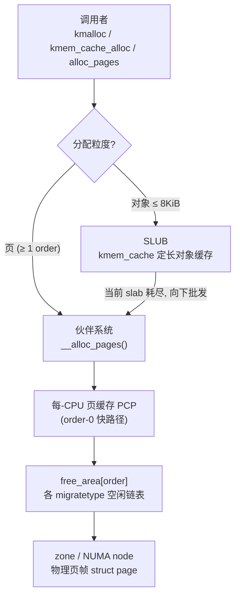
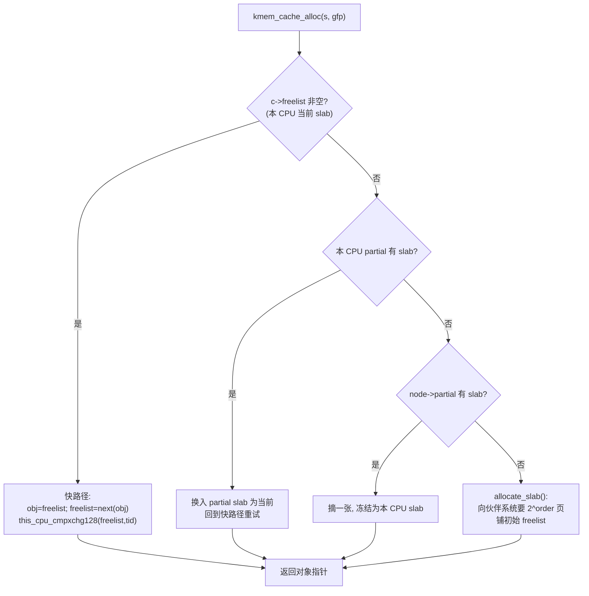
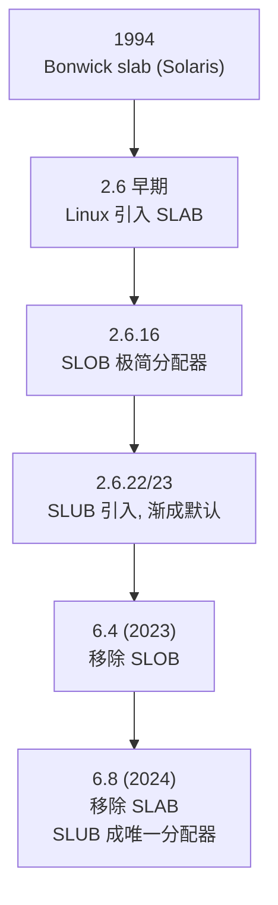

# Linux内核机制与内核利用（4）· 虚拟内存：伙伴系统与slab与slub
> [!abstract] TL;DR
> - 内核物理内存分配是三层栈：**伙伴系统**按“阶（order）”管理连续页帧、拆分与合并；**SLUB** 在页之上切出定长对象缓存；**kmalloc** 把变长请求映射到 2 的幂大小类缓存。三层各解决“外碎片—内碎片—通用接口”不同矛盾。
> - 伙伴系统用 `buddy_pfn = pfn XOR (1<<order)` 定位伙伴、按 migratetype 分桶抗碎片、用每-CPU 页缓存（PCP）削锁竞争；SLUB 用**每-CPU 无锁快路径**（freelist + tid + cmpxchg）在缓存命中时几乎零开销分配。
> - SLAB 与 SLOB 已成历史：SLOB 于 **6.4（2023）** 删除、SLAB 于 **6.8（2024）** 删除，**SLUB 成为唯一分配器**；struct slab 也于 5.17 从 struct page 拆出。
> - **缓存合并（aliasing）**把尺寸/对齐/标志兼容的缓存并成一个，导致大量不同类型对象共享 `kmalloc-N`——这是内核堆风水（heap grooming）的地基；专用缓存与 `kmem_buckets` 则反向做隔离。
> - 加固是“一招对一式”：freelist 指针混淆+中置、freelist 随机化、hardened usercopy、`RANDOM_KMALLOC_CACHES`、`init_on_alloc/free`，每一项都精确针对某个利用原语。本篇讲透机制与防御，利用手法留给第 14/15 篇。

## 概述与定位

要谈“内核里的虚拟内存”，先厘清一个常被混淆的分层：**虚拟地址空间的组织**（页表、缺页、mmap、vmalloc 区）与**物理内存的分配**（谁来交出一块可用的物理页）是两件事，但它们在同一套子系统里咬合。本篇聚焦后者——内核如何把裸的物理页帧，逐层加工成驱动、文件系统、网络栈随手就能 `kmalloc()` 的“堆”。这条链条自底向上是：NUMA 节点（`pg_data_t`）→ 内存区 zone（`ZONE_DMA/DMA32/NORMAL/MOVABLE/…`）→ 页帧（`struct page`）→ 伙伴系统（页粒度分配）→ SLUB（对象粒度分配）→ kmalloc（通用变长接口）。

为什么要分这么多层？因为一层解决不了所有矛盾。**伙伴系统**擅长交出“物理连续、2 的幂张”的页块，但它的最小粒度是一页（x86-64 上 4KiB）——你若只要一个 32 字节的 `struct` 却问它要一整页，会浪费 99% 的空间（内碎片），且频繁申请/释放页会把物理内存打得千疮百孔（外碎片）。于是在页之上再叠一层**对象缓存**（slab 家族）：一次向伙伴系统批发若干页当作一张“slab”，在其中零售定长对象，既摊薄了页分配开销，又几乎消灭了内碎片。而**kmalloc** 则是对象缓存之上的“傻瓜接口”：调用者不必自己 `kmem_cache_create`，直接 `kmalloc(size, gfp)`，内核把它路由到最接近的大小类缓存 `kmalloc-N`。

它落在虚拟地址空间的哪里？绝大多数 `kmalloc`/`kmem_cache_alloc`/`__get_free_pages` 返回的地址位于**内核直接映射区（direct/linear map，x86-64 上 `page_offset_base` 起）**——物理地址与虚拟地址只差一个固定偏移，`virt_to_phys()` 就是一次减法，这也是为什么这些指针能反向 `virt_to_page()`/`virt_to_slab()` 找回元数据。与之相对的 `vmalloc()` 走独立的 vmalloc 区、逐页建映射、物理不连续——它不属于本篇主线，仅在讲 `kvmalloc` 回退时点到。

**边界声明**：本篇是“机制篇”。分配器为何是内核堆利用的核心战场（freelist 劫持、UAF 对象复用、越界改写相邻对象、cross-cache）会讲清**原理与防御**，但成体系的喷射/风水/提权配方属于 [[14.内核漏洞类型：UAF与OOB与竞态]] 与 [[15.内核利用原语与堆喷]]；页表/缺页/KPTI 属于 [[17.绕过内核防护：KASLR与SMEP与SMAP与KPTI]]；对象在 VFS/网络里的具体形态见 [[05.VFS与文件系统层]]。Windows 侧的对称结构见 [[38.Windows内核与驱动逆向/26.内核池风水与利用]]。



## 原理与机制

**伙伴系统的核心思想**：把每个 zone 的空闲页组织成 11 个（阶 0 到 `MAX_ORDER`）空闲链表数组 `free_area[]`，阶 n 的桶里挂的都是“$2^n$ 张物理连续页”的块。分配时向上取整到能容纳请求的最小阶：要 3 页就给 order-2（4 页）。若该阶空桶，就到更高阶找一个块**对半劈开**，一半交付、另一半（即“伙伴”）降级挂回低一阶。释放时反向：检查这块的伙伴是否也空闲且同阶，若是则**合并**升阶，递归向上，尽量把空洞重新拼成大块。之所以叫“伙伴”，是因为一对伙伴的页帧号（pfn）只差一个比特：`buddy_pfn = pfn XOR (1 << order)`，合并后的块起始 `pfn = pfn AND ~(1 << order)`——纯位运算，$O(1)$ 定位、无需遍历。这套拆分/合并把外碎片控制得很好，代价是只能给 2 的幂大小、且最大一块受 `MAX_ORDER` 限制（默认 order-10 = 1024 页 = 4MiB）。

> [!note] 一个易踩的版本陷阱：`MAX_ORDER` 的语义在 6.x 被“修正”了。历史上 `MAX_ORDER` 是**排他计数**（值 11，合法阶是 0..10）；commit 23baf831a32c（“redefine MAX_ORDER sanely”）后 `MAX_ORDER` 改成**最大合法阶本身**（值 10）。读老代码/老书时 `< MAX_ORDER` 的循环边界要按当时语义理解，否则会差一。

**抗碎片的 migratetype 分桶**：光有伙伴合并不够——一个“不可移动”的内核对象若卡在一大片“可移动”页中间，就永远合不成大块。于是每个 pageblock 被标记迁移类型：`MIGRATE_UNMOVABLE`（内核对象）、`MIGRATE_MOVABLE`（用户页、页缓存，可被内存规整 migration 搬走）、`MIGRATE_RECLAIMABLE`（可回收，如某些 slab）、`MIGRATE_HIGHATOMIC`、以及可选的 `MIGRATE_CMA`/`MIGRATE_ISOLATE`。分配按类型走各自的空闲链，把“同命”的页聚在一起；当某类耗尽才按既定“抢占顺序”从别的 pageblock 偷。可移动页聚堆后，`kcompactd`/内存规整（compaction）就能把它们搬走腾出连续大块——这也是透明大页（THP）能成的前提。

**每-CPU 页缓存（PCP，`per_cpu_pages`）**：order-0（单页）分配最频繁，若每次都抢 zone 锁会成瓶颈。于是每 CPU 缓存一小批 order-0 空闲页，绝大多数单页申请/释放在本地无锁完成，攒够阈值再批量回吐给伙伴系统。这与 SLUB 的每-CPU slab 是同一种“把全局锁竞争下沉到 per-CPU 本地”的设计哲学。

**GFP 标志——分配的“上下文契约”**：`__alloc_pages(gfp, order, …)` 的行为由 gfp 决定。`GFP_KERNEL` 允许睡眠、可触发直接回收（direct reclaim）与 OOM；`GFP_ATOMIC` 用于中断/持锁等不可睡眠上下文，不能回收但可动用一点应急水位（watermark）储备；`GFP_NOWAIT` 连储备都不碰；`GFP_NOIO`/`GFP_NOFS` 约束回收路径不得回落到 I/O/文件系统（防死锁）；`__GFP_ZERO` 清零；`__GFP_ACCOUNT` 让分配计入 memcg（并路由到 `kmalloc-cg-N`）；`__GFP_DMA`/`__GFP_RECLAIMABLE` 影响 zone 与缓存类型选择。**水位（min/low/high）** 决定何时唤醒 `kswapd` 后台回收、何时转入调用者上下文的直接回收、何时启动 OOM killer。看懂 gfp，就看懂了一次分配“能等多久、能挖多深”。

**SLUB 层的机制轮廓**：每种对象有一个 `kmem_cache` 描述符，记录对象大小、对齐、每张 slab 的页阶、构造标志。它向伙伴系统批发 $2^{order}$ 页作为一张 slab，把这片连续内存切成等大对象，用一条**单链空闲表（freelist）**把所有空闲对象串起来——链指针**就存在空闲对象自己内部**（偏移 `s->offset`），不额外占元数据。分配即“摘链表头”，释放即“插链表头”，$O(1)$。真正让 SLUB 快的是**每-CPU 结构 `kmem_cache_cpu`**：每个 CPU 独占一张“当前 slab”和它的本地 freelist，命中时走无锁快路径；未命中才逐级下沉到每-CPU partial 链、每-node partial 链，最后才向伙伴系统要新 slab。

**kmalloc 的机制**：`kmalloc(size, gfp)` 本质是查表——把 size 向上取整到最近的大小类，找到对应的 `kmalloc-N` 缓存做 `kmem_cache_alloc`。当 size 是编译期常量时，`__builtin_constant_p` 让索引在编译期算好，零运行时开销；变长 size 才走 `kmalloc_index()` 运行时计算。超过 `KMALLOC_MAX_CACHE_SIZE`（4KiB 页上为 8192）的大块绕过对象缓存、`kmalloc_large()` 直接问伙伴系统要页。下一段把这些结构与算法逐一拆到字节级。

## 结构与算法详解

### struct page 与 struct slab：一块内存的“身份证”

物理内存里每张页帧都对应一个 `struct page`（约 64 字节，存于 `vmemmap`）。它是内核里最“精分”的结构——同一片字节，被匿名页、页缓存、伙伴块、slab 各自用 union 重新解释。这种类型双关（type punning）历史上极易出错，于是 5.17 起（Vlastimil Babka）把 slab 用途**拆成独立的 `struct slab`**：它仍与 `struct page` 内存重叠，但字段专属——`slab_cache`（回指所属 `kmem_cache`）、`freelist`（本 slab 的空闲链头）、`counters`（打包了 `inuse`/`objects`/`frozen`）、`slab_list`（挂到 partial/full 链的表头）。逆向与调试的关键杠杆就在这：拿到任意 slab 对象地址 `p`，`virt_to_slab(p)`（内部 `virt_to_folio` → `folio_slab`）就能取回 `slab->slab_cache`，从而知道“这块内存属于哪个缓存、对象多大”。

### 伙伴系统：拆分与合并的字节账本

```
分配 order=k：从 free_area[k] 摘块；若空，找最小的 j>k 有块，
  逐级对半劈：交付低半，把高半（buddy）挂回 free_area[j-1..k]。
释放 order=k 的块（起始 pfn）：
  buddy_pfn = pfn XOR (1 << k)              # 伙伴只差一个比特
  合并条件 = buddy 在系统内 且 空闲 且 同阶 且 同 zone/migratetype
  若可合并：pfn = pfn AND ~(1 << k); k += 1; 递归向上
```

“伙伴只差一个比特”是整套算法优雅的根源：无需任何额外索引，一次异或就定位到该跟谁合并；一次与运算就得到合并后大块的起始。设计权衡在于**只服务 2 的幂**——请求 5 页会被凑成 order-3（8 页），有内碎片，但换来了拆分/合并的 $O(1)$ 与极低的外碎片，对“页粒度”这个尺度是划算的。真正的定长小对象内碎片，交给上层 slab 消化。

### SLUB 的三级结构与无锁快路径

SLUB 的数据结构是三层嵌套：

- `kmem_cache`（全局，每种对象一个）：`size`（含元数据的对象跨距）、`object_size`（净大小）、`offset`（freelist 指针在对象内的位置）、`oo`（打包的 slab 页阶与每 slab 对象数）、`random`（本缓存的混淆密钥）、`cpu_slab`（指向每-CPU 结构）、`node[]`（每-node 结构）。
- `kmem_cache_cpu`（每 CPU 一个）：`freelist`（当前 slab 的本地空闲链头）、`slab`（当前正在零售的 slab）、`partial`（本 CPU 私藏的一串半满 slab）、`tid`（事务号）。
- `kmem_cache_node`（每 NUMA node 一个）：`partial`（半满 slab 链）、`nr_partial`，以及 DEBUG 下的 full 链。

**快路径（fast path）**为什么能无锁？关键是 `tid`——一个每次分配/释放都自增的每-CPU 事务号。分配时读出 `(freelist, tid)`，算出 `next = get_freepointer(object)`，再用一条 `this_cpu_cmpxchg128`（把 freelist 与 tid 打包成 128 位一起比较交换）原子地把 `freelist` 推进到 `next`、`tid` 自增。若中途发生了抢占/迁移到别的 CPU、或有并发释放改动了链头，`tid` 就对不上，cmpxchg 失败并重试——这既避免了关中断/加锁，又用 tid 破解了经典 ABA 问题。在缺少 128 位 cmpxchg 的架构上，退化为 `local_lock`+关中断实现同等语义。

**慢路径（slow path）**逐级下沉：本 CPU freelist 空 → 看本 CPU `partial` 链有没有半满 slab，有就换入当前槽、重试快路径；再空 → 到本 node 的 `partial` 链摘一张、**冻结（frozen）**为本 CPU 独占；仍空 → `allocate_slab()` 向伙伴系统批发 $2^{order}$ 页、按对象大小铺好初始 freelist。“每-CPU partial”这层缓冲是 SLUB 相对老 SLAB 的一大改良：它让“本地 slab 用完”不必立刻去抢 node 锁，`cpu_partial` 参数调这层的深浅——本质又是“把竞争下沉到 per-CPU”。



### 对象内布局与 freelist 指针

```
一个 SLUB 对象在 slab 内的布局（无 SLUB_DEBUG，SLAB_FREELIST_HARDENED 开）:
+------------------------------+  <- 对象起始 = 返回给调用者的指针
| payload 前半                 |
+------------------------------+  <- s->offset (硬化时被移到对象中部)
| freepointer (混淆后的 next)  |  宽度 = sizeof(void*)
+------------------------------+
| payload 后半                 |
+------------------------------+  <- 对象结束, 对齐到 s->size

编码:  stored = next XOR s->random XOR swab(&freepointer)   // freelist_ptr_encode
解码:  next   = stored XOR s->random XOR swab(&freepointer)
```

空闲对象内嵌链指针是 SLUB 的省内存妙笔，却也正是攻击者垂涎的目标——覆盖一个空闲对象的 freepointer，就能让下一次分配把对象“摆”到任意地址（任意写原语的雏形）。两项加固由此而来：其一，`SLAB_FREELIST_HARDENED` 把裸指针**异或混淆**——用本缓存随机 `s->random` 与“存放该指针的地址”的字节序翻转 `swab(&ptr)` 双重掩码，攻击者不知 `s->random` 与该槽地址就伪造不出合法 next，且顺带能在释放时做“指向自身/未对齐”的健全性检查以捕获部分双重释放。其二（5.7，Kees Cook），把 freepointer 从对象尾部**挪到对象中部**（`s->offset` 取对象一半处）：这样从对象头部发起的线性溢出（尤其是绕过尾部 redzone 的 off-by-one）要先趟过前半 payload 才够得着指针，抬高了改写门槛。

### kmalloc 大小类与缓存类型

```
kmalloc 通用大小类 (x86-64, KMALLOC_MIN_SIZE=8):
  8, 16, 32, 64, 96, 128, 192, 256, 512, 1024, 2048, 4096, 8192
            ^^^          ^^^
     96 / 192 是填补 64→128、128→256 空档的“非 2 次幂”类, 降内碎片
  kmalloc_index(): size<=8→类8; <=16→类16; … 且复用两个索引承载 96/192
  > 8192 (KMALLOC_MAX_CACHE_SIZE) → kmalloc_large() 直接走伙伴系统

类型 (kmalloc_type 按 gfp 选):
  KMALLOC_NORMAL   -> kmalloc-N        普通
  KMALLOC_CGROUP   -> kmalloc-cg-N     __GFP_ACCOUNT (记账/用户可触发)
  KMALLOC_RECLAIM  -> kmalloc-rcl-N    __GFP_RECLAIMABLE
  KMALLOC_DMA      -> dma-kmalloc-N    __GFP_DMA
  (+ RANDOM_KMALLOC_CACHES: kmalloc-rnd-01..16-N 十六份随机副本)
```

为什么要有 96 和 192 这两个“怪”尺寸？纯 2 的幂会让 65~127 字节的请求全落进 128 类、浪费近半；插入 96/192 把台阶细化，显著压低内碎片。为什么把 `kmalloc_index` 的表设计成部分索引复用来承载 96/192，是历史上为让编译期常量折叠尽量简单留下的痕迹——读源码时不必纠结索引号，认**缓存名（即实际尺寸）**即可。

把普通、记账、可回收、DMA 拆成四组前缀，是**功能正确性**（DMA 需低地址 zone、可回收需被回收器识别）叠加**安全隔离**（`__GFP_ACCOUNT` 常来自用户可控路径，单列 `kmalloc-cg-N` 使其不与内核内部对象在同一 freelist 相邻）的双重考量。`RANDOM_KMALLOC_CACHES`（6.6）更进一步：为普通类再造 16 份随机副本，按**调用点地址**（`_RET_IP_`）哈希叠加每次启动的随机种子选桶——同一处 `kmalloc` 本次启动稳定落同一桶，不同调用点（往往即不同对象类型）倾向落不同桶，从而打散“不同类型对象在同一 `kmalloc-N` 里相邻”的确定性。

### 缓存合并（aliasing）：风水的地基

SLUB 默认做**缓存合并**：`find_mergeable()` 会把尺寸、对齐、标志兼容且无构造函数、未标 `SLAB_NO_MERGE` 的多个缓存并成同一个底层缓存（互为别名）。好处是缓存数量、per-CPU 结构、内存占用都大降。副作用极其深远：`kmem_cache_create` 出来的许多“独立”对象，运行时其实和 `kmalloc-N` 或彼此共享同一片 slab、同一条 freelist——**这正是内核堆利用的地基**：攻击者能用一种易分配的对象去“填”另一种敏感对象的坑，或让溢出改到相邻的异类对象。防御侧的反制是给敏感对象**专用缓存**并置 `SLAB_NO_MERGE`（如 `struct cred` 的 `cred_jar`、`struct file`、后来的 `vm_area_struct` 等被陆续独立），以及 6.11+ 的 `kmem_buckets`（`CONFIG_SLAB_BUCKETS`，Kees Cook）——为“大小受攻击者控制”的调用点建独立桶集，阻断“用可控尺寸去撞任意缓存”的 cross-cache 玩法。启动参数 `slab_nomerge` 可全局关合并（调试/加固常用）。

### 一个不显眼却致命的标志：SLAB_TYPESAFE_BY_RCU

`SLAB_TYPESAFE_BY_RCU` 让对象被 `kfree` 后**不立刻归还**、且其所在 slab 的页在 RCU 宽限期内不被交回伙伴系统——于是对象内存可以立刻被重新分配成**同类型**对象，但绝不会突然变成别的类型或被解除映射。它用于 `anon_vma`、部分网络/文件对象等“无锁读取指针后再校验”的场景。对利用研究者，这类缓存上的 UAF 语义特殊：你拿到的悬垂指针在宽限期内始终指向一个合法的同类型对象，某些“先取指针再验字段”的竞态窗口因此存在——机制细节属于本篇，具体利用留给 [[14.内核漏洞类型：UAF与OOB与竞态]]。

### 横向对比：SLAB vs SLUB vs SLOB，以及为何只剩 SLUB

- **SLAB**（源自 Bonwick 1994 的 Solaris slab）：多级队列 + per-CPU 数组缓存 + 着色（cache coloring，错开对象在 L1 的落位），元数据丰富、局部性讲究，但结构复杂、每-node 队列在大核数下扩展性差、内存开销大。
- **SLOB**：极简“k&r 风格”块分配器，为极小内存嵌入式设备而生，碎片多、不适合通用。
- **SLUB**（Christoph Lameter，2.6.22/23）：**去队列化**，靠每-CPU slab + partial 链 + 无锁快路径拿扩展性，元数据尽量塞进 `struct page`/`struct slab`，代码更简、多核更快，并原生长出一整套调试与加固钩子。



结局是收敛：SLOB 于 6.4、SLAB 于 6.8 被删，主线只剩 SLUB。这意味着**今天分析任何较新内核，堆布局一律按 SLUB 语义推理**；老 CTF 题/老内核里 `slabinfo` 的队列列、着色等 SLAB 特征，则要按当年语义读。

## 工具视角与实战

**看伙伴系统**：`cat /proc/buddyinfo` 列出每 zone 各阶的空闲块数——高阶列全为 0 往往预示外碎片、大页申请会失败。`cat /proc/pagetypeinfo` 进一步按 migratetype 细分，是诊断“为何规整不出连续大块”的第一现场。

**看对象缓存**：`cat /proc/slabinfo`（需 root）每行是一个缓存，关键列 `active_objs`/`num_objs`（在用/总对象数）、`objsize`（对象大小）、`objperslab`（每 slab 对象数）、`pagesperslab`（每 slab 页数）。`slabtop -o` 实时按内存/对象数排序，抓“谁在吃内存/谁在泄漏”一目了然。更细的运行时属性在 `/sys/kernel/slab/<cache>/`：`object_size`、`slab_size`、`order`、`objs_per_slab`、`cpu_slabs`、`partial`、`aliases`（有多少缓存合并到此）、`cpu_partial` 等——逆向时用 `aliases`/`slab_size` 就能判断某个 `kmem_cache` 实际是否与 `kmalloc-N` 同宗。

**开调试/加固自检**：启动加 `slub_debug=FZPU,<cache>` 开红区（redzone）、毒填（poison）、用户追踪（每对象记 alloc/free 栈）、健全性检查。识记毒值有助于一眼看穿堆状态——`0x6b`（'kkkk'，已释放毒填 `POISON_FREE`）、`0x5a`（'ZZZZ'，`POISON_INUSE`）、`0xbb`（`SLUB_RED_INACTIVE`）、`0xcc`（`SLUB_RED_ACTIVE`）。在 dump 里看到一片 `6b 6b 6b …` 基本等于“这是块刚被 free 的对象”。

**深挖内核内存的三件套**：
- `crash`：`kmem -s`/`-S` 逐缓存列 slab 与对象、`kmem -i` 看总体、`kmem <addr>` 反查某地址属于哪个缓存/页——救火现场标配。
- `drgn`：Python 脚本化遍历 `prog["slab_caches"]` 链、走每-CPU `kmem_cache_cpu.freelist`、按对象反推缓存，做“活体”结构分析比 gdb 灵活得多。
- `gdb`（配 vmlinux 符号 / qemu `-s`）：`p *(struct kmem_cache *)…`、手动跟 `freelist` 链，配 KASAN 编译最适合本地调试。

**动态观测分配流**：内核有 `kmem:kmalloc`、`kmem:kmem_cache_alloc`、`kmem:kmem_cache_free`、`kmem:mm_page_alloc` 等 tracepoint。`bpftrace -e 'tracepoint:kmem:kmalloc { @[args->bytes_alloc] = count(); }'` 一行统计各尺寸分布；用 kprobe 挂 `__kmalloc`/`kmem_cache_alloc` 抓调用栈，能把“某系统调用到底 alloc 了哪个缓存的对象”钉死——这是漏洞研究里给对象“建档”的常规动作。`ftrace` 的 function graph 追 `allocate_slab`/`___slab_alloc` 则能看清快慢路径何时切换。

**逆向要点：从地址反推缓存**。给定一个内核堆指针，`virt_to_slab(p)->slab_cache->name` 就是它的缓存名与尺寸。若手上只有内存 dump，可用“对象尺寸指纹”反推：对象跨距、freepointer 的位置与混淆特征、以及相邻对象的重复步长，都能帮你判定它落在哪个 `kmalloc-N`。搞清目标对象的**尺寸类与是否被合并**，是后续任何堆布局分析的第一步。

## 安全性与正确使用

分配器之所以是内核安全的“主战场”，是因为几乎每个内存破坏漏洞最终都落到堆上：**UAF** 依赖对象释放后其内存被可控对象复用；**越界读写（OOB）** 靠改到 freelist 或相邻对象；**freelist 劫持**把“摘链表头”变成“把下一个对象摆到任意地址”的任意写雏形；**cross-cache** 利用缓存合并/页复用，用一种对象去影响另一种。理解上文的 freelist 内嵌、每-CPU 缓存、缓存合并、TYPESAFE_BY_RCU，就理解了这些原语的物理基础。

主线加固与它们各自封堵的原语（“一招对一式”）：
- **`SLAB_FREELIST_HARDENED`**：freepointer 异或混淆 + 释放健全性检查 → 抬高伪造 next/双重释放门槛。
- **freepointer 中置（5.7）**：把链指针挪到对象中部 → 抗从对象头发起的线性溢出改写指针。
- **`SLAB_FREELIST_RANDOM`**：随机化新 slab 内初始 freelist 顺序 → 破坏“相邻分配即相邻地址”的确定性布局。
- **`RANDOM_KMALLOC_CACHES`（6.6）**：普通类 16 份随机副本按调用点选桶 → 打散异类对象同缓存相邻。
- **专用缓存 `SLAB_NO_MERGE` / `kmem_buckets`（6.11+）**：把敏感对象/可控尺寸调用点隔离 → 断合并带来的 cross-cache。
- **`CONFIG_HARDENED_USERCOPY`**：`copy_to/from_user` 时 `__check_heap_object` 校验拷贝范围不越出该 slab 对象边界 → 挡“借越界拷贝泄露/篡改相邻对象”。
- **`init_on_alloc` / `init_on_free`（`CONFIG_INIT_ON_*`）**：分配/释放时清零 → 灭未初始化内存泄露、削弱部分 UAF 可利用性。
- **`SLUB_DEBUG` / KASAN / KFENCE**：红区、毒填、影子内存做越界/UAF 检测；KFENCE 采样式、开销低到可上生产。
- **memcg 记账拆分（`kmalloc-cg`）**：把用户可触发的记账分配与内核内部对象隔离，兼具核算与安全意义。

需要点破的取舍：这些防护多是**概率性/抬门槛**而非根治。freelist 随机化不改变对象仍在同缓存的事实；`RANDOM_KMALLOC_CACHES` 有限的 16 桶可被大量喷射摊平概率；`hardened usercopy` 只管 usercopy 这一条边界。真正接近根治 UAF 的方向（如虚拟映射 slab、地址不复用的 `SLAB_VIRTUAL` 提案、grsecurity 的 AUTOSLAB 按类型独立缓存）多在研究或树外。防御要按“纵深”叠加，别指望单一开关。

> [!caution] 合规边界与正确使用
> 本篇所有关于 freelist、缓存合并、UAF 复用、cross-cache 的讨论，**仅用于防御研究、漏洞理解、加固评估与教学**，适用范围限于**你自有或获得明确书面授权的系统、CTF 靶场与隔离的研究环境**。请勿据此对生产系统、他人主机或未授权目标实施任何内存破坏、提权或绕过商业授权的操作；本篇刻意只讲机制与防御原理，不提供针对真实目标的武器化喷射/提权成品配方——那类步骤请在 [[14.内核漏洞类型：UAF与OOB与竞态]]、[[15.内核利用原语与堆喷]] 的授权靶场语境中学习。任何研究都应遵循负责任披露与当地法律。

工程正确使用的日常准则同样重要：按上下文选对 gfp（中断里只能 `GFP_ATOMIC`）；大块优先 `kvmalloc` 让其在物理连续不可得时回退 vmalloc；`ksize()` 返回的是**缓存实际给的容量**（可能大于你请求的 size），把它当作“可安全使用的字节数”会读到相邻残留、既是 bug 也是信息泄露面，切忌依赖；释放后立即把指针置空以杜绝悬垂；给敏感结构显式建专用缓存并考虑 `SLAB_NO_MERGE`。

## 小结

内核物理内存分配是一座三层塔：**伙伴系统**用位运算级的拆分/合并管理页粒度连续块、以 migratetype 分桶与 PCP 缓存兼顾抗碎片与扩展性；**SLUB** 在页之上切定长对象，用每-CPU 无锁快路径（freelist + tid + cmpxchg）把命中路径压到近乎零开销，用 partial 分层把竞争下沉到本地；**kmalloc** 把变长请求映射到 2 的幂大小类（外加 96/192 与四种类型前缀），大块直通伙伴系统。历史上 SLAB/SLOB 已退场，SLUB 于 6.8 后成为唯一分配器，今天一切较新内核的堆布局都按 SLUB 语义推理。这套结构既是性能的杰作，也是内核堆利用与防御共同的战场：freelist 内嵌、缓存合并、对象复用语义构成了利用原语的物理基础，而 freelist 混淆+中置、随机化、hardened usercopy、随机 kmalloc 缓存、init-on-alloc/free 等则一招一式地抬高门槛。把这层“地基”吃透，第 14/15 篇的漏洞类型与利用原语才有立足之处。

## 相关阅读

- 内核官方文档：`Documentation/mm/`（尤其 `slub.rst`、`page_owner.rst`、`physical_memory.rst`）、`Documentation/dev-tools/kasan.rst` 与 `kfence.rst`。
- 源码入口：`mm/page_alloc.c`（伙伴系统）、`mm/slub.c`（SLUB）、`include/linux/slab.h`（kmalloc 大小类与类型）、`mm/slab_common.c`（缓存创建/合并）。
- 论文与书目：Jeff Bonwick, *The Slab Allocator: An Object-Caching Kernel Memory Allocator*（1994）；Bovet & Cesati, *Understanding the Linux Kernel*；Robert Love, *Linux Kernel Development*；Mauerbach, *Professional Linux Kernel Architecture*。
- LWN 深读：SLUB 引入与演进、`RANDOM_KMALLOC_CACHES`、`kmem_buckets`、struct slab 拆分等专题（lwn.net 搜对应标题）。
- 同系列：[[03.系统调用实现与入口]] · [[05.VFS与文件系统层]] · [[14.内核漏洞类型：UAF与OOB与竞态]] · [[15.内核利用原语与堆喷]] · [[17.绕过内核防护：KASLR与SMEP与SMAP与KPTI]]
- 交叉参考：[[38.Windows内核与驱动逆向/13.内核漏洞与利用基础]] · [[38.Windows内核与驱动逆向/26.内核池风水与利用]] · [[15.操作系统加载与启动/10.系统调用机制]] · [[15.操作系统加载与启动/11.init与systemd启动]] · [[34.现代二进制防护机制/15.内核防护与kCFI]] · [[49.Fuzzing与漏洞挖掘/14.内核与驱动Fuzzing：syzkaller]]

[[00.Linux内核机制与内核利用总览|⬆ 系列总览]] | [[03.系统调用实现与入口|← 上一章]] | [[05.VFS与文件系统层|→ 下一章]]
