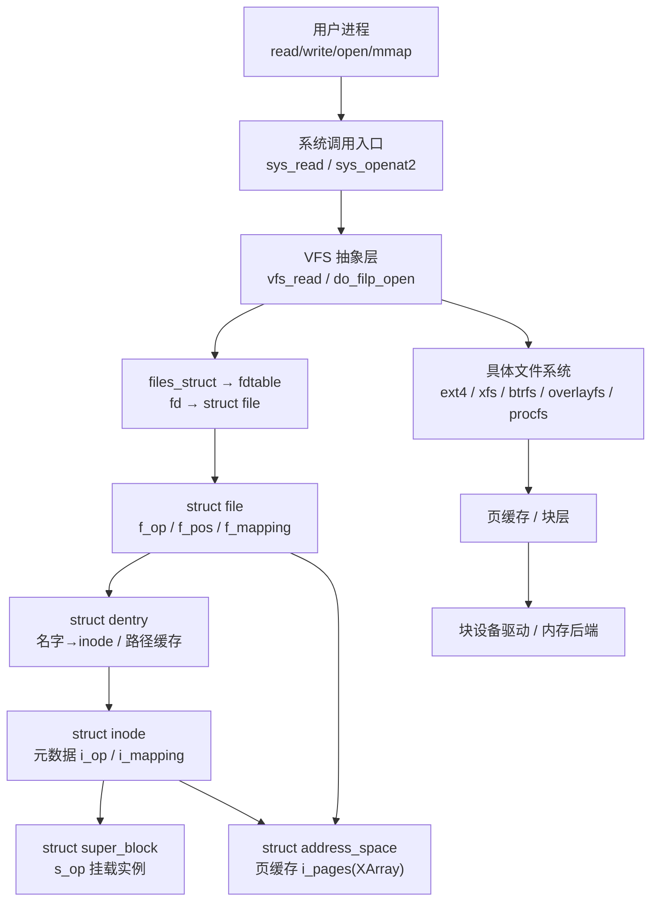
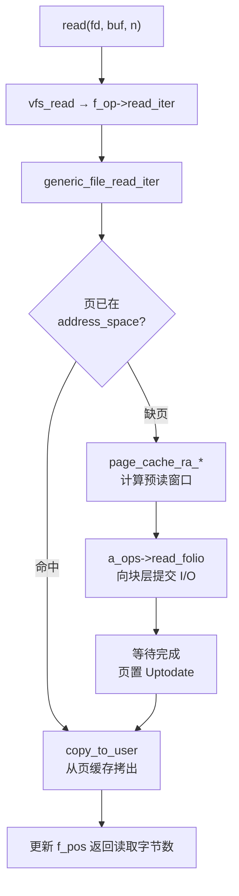
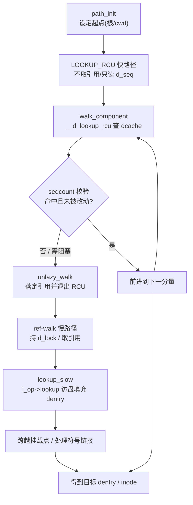

# Linux内核机制与内核利用（5）· VFS与文件系统层
> [!abstract] TL;DR
> - VFS 用「通用对象 + 函数指针表」在 C 里手写多态：`super_block`/`inode`/`dentry`/`file` 四大对象配 `*_operations` vtable，让 `open/read/write` 对 ext4、tmpfs、procfs、overlayfs 一视同仁——理解这套 vtable 的分派与内嵌（`container_of`）是逆向与利用的地基。
> - 路径解析建立在 dentry 树与 dcache 之上：RCU-walk 无锁快路径靠 `d_seq` seqcount 做乐观校验，失败以 `unlazy_walk` 回退到引用计数的 ref-walk，这是"高并发只读 lookup"与"正确处理并发 rename/umount"之间的核心权衡。
> - 页缓存以 `address_space` 的 XArray 把「文件偏移 → 物理页」索引起来，统一承载缓冲 I/O、`mmap`、预读与回写；缓存页与文件内容的强耦合，正是 Dirty COW、Dirty Pipe 这类"越权写文件"漏洞的温床。
> - 挂载的本质是把「某 `super_block` 的根 dentry」嫁接到挂载点 dentry 上，形成 per-namespace 的挂载树；mount 传播（shared/slave/private/unbindable）与 overlayfs 的 copy-up 是容器逃逸与本地提权 CVE 的高发地带。
> - 逆向/利用视角：`file`(filp)、`dentry`、`inode` 各据独立 slab 缓存且多带 `SLAB_ACCOUNT`，是堆喷与跨缓存 UAF 的常客；`f_op`/`i_op` 早年是函数指针劫持的经典落点，现多被 `const`/`__ro_after_init`/CFI 收敛，攻防重心已转向数据面。

## 概述与定位

虚拟文件系统（Virtual File System，VFS，也叫 Virtual Filesystem Switch）是 Linux "一切皆文件"哲学的落地引擎。它坐落在系统调用层与各具体文件系统（ext4、xfs、btrfs、tmpfs、overlayfs、procfs、sysfs……）之间，向上给用户态暴露一套统一、稳定的文件语义（`open/read/write/lseek/mmap/stat/mount`），向下把这些语义翻译成对某个具体文件系统或伪文件系统的调用。它的价值不在于自己实现了某种存盘格式，而在于**用一层抽象抹平了几十种异构文件系统的差异**：应用程序无需知道数据到底躺在机械盘的 ext4、内存里的 tmpfs、网络对端的 NFS，还是内核导出的 `/proc` 虚拟节点上，同一段 `read()` 代码就能工作。

这层抽象的思想直接继承自 Sun 的 vnode/VFS 架构（1985 年前后），Linus 在 Linux 早期就引入了类似设计。理解 VFS 的关键，是认识到它是**用 C 语言手写的一套面向对象系统**：没有语言级的类和虚函数，就用"结构体承载状态 + 函数指针表承载行为"来模拟。`struct inode` 是"文件"的抽象基类，`inode->i_op`（`inode_operations`）是它的虚函数表；`struct file` 是"打开的文件实例"，`file->f_op`（`file_operations`）是它的虚函数表。具体文件系统通过填充这些函数指针来"继承并重写"行为。这个"vtable + 内嵌对象"的范式贯穿全篇，也是后续几乎所有内核利用手法的认知前提。

**本章边界**：本篇聚焦 VFS 的对象模型、路径解析、页缓存与挂载子系统这几块 VFS 独有的机制，以及由它们直接衍生的攻击面（Dirty Pipe、Dirty COW、overlayfs 提权、file/dentry/inode 作为堆喷与 UAF 目标）。页缓存所用的物理页来自伙伴系统、filp/dentry/inode 所在的 slab 缓存内部机制，属于上一篇 [[04.虚拟内存：伙伴系统与slab与slub|虚拟内存]] 的地盘，这里只讲 VFS 如何"使用"它们；RCU-walk 依赖的 RCU 语义细节留给 [[07.内核同步：自旋锁与RCU|内核同步]]；`file_operations` 在字符设备上的具体攻击面（ioctl 处理函数、`private_data`）由 [[10.字符设备与ioctl攻击面|字符设备与ioctl]] 承接；UAF/竞态的通用分类学与堆喷通用原语分别见 [[14.内核漏洞类型：UAF与OOB与竞态|漏洞类型]] 与 [[15.内核利用原语与堆喷|利用原语与堆喷]]。本篇给出的是"这些通用手法在 VFS 对象上的具体形态"。

## 原理与机制

### 四大核心对象与它们的关系

VFS 的世界由四类对象撑起，理解它们的分工与生命周期，其他一切都是推论。

- **`super_block`（超级块）**：代表一个"已挂载的文件系统实例"。一块 ext4 分区被挂载后，内核就为它建一个 `super_block`，记录块大小、最大文件尺寸、文件系统类型（`s_type` 指向 `file_system_type`）、根 dentry（`s_root`）、以及超级块级操作表 `s_op`（`super_operations`：`alloc_inode`、`destroy_inode`、`write_inode`、`sync_fs`、`statfs`……）。同一种文件系统被挂载两次（两块 ext4 分区）就有两个 `super_block`。
- **`inode`（索引节点）**：代表一个"文件本体"——注意是本体而非名字。它持有文件的全部元数据：权限 `i_mode`、属主 `i_uid`/`i_gid`、大小 `i_size`、时间戳、硬链接数 `i_nlink`、设备号 `i_rdev`（设备文件用），以及虚函数表 `i_op`（`inode_operations`：`lookup`、`create`、`link`、`unlink`、`rename`、`getattr`、`setattr`、`permission`……）和内嵌的 `i_mapping`（指向页缓存的 `address_space`）。一个文件无论有多少个名字（硬链接）或被打开多少次，内核里都只有一个 inode。
- **`dentry`（目录项）**：代表"路径中的一个名字分量"，是把**名字**绑定到**inode**的黏合剂，也是**路径树在内存里的缓存形态**。`/home/user/a.txt` 会对应 `/`、`home`、`user`、`a.txt` 四个 dentry，每个通过 `d_parent` 指向父目录 dentry、`d_inode` 指向自己名字所对应的 inode、`d_name` 存名字。dentry 不上盘，它是纯粹的内存加速结构（dcache），存在的唯一目的是让下一次 `open` 同一路径时不必再逐层访盘做 `lookup`。
- **`file`（打开的文件）**：代表"某次 `open` 产生的会话"。它是唯一的 per-open 状态，持有当前读写偏移 `f_pos`、打开标志 `f_flags`/`f_mode`、指向对应 dentry+vfsmount 的 `f_path`、缓存的 `f_inode` 与 `f_mapping`、虚函数表 `f_op`（`file_operations`：`read_iter`、`write_iter`、`iterate`、`mmap`、`unlocked_ioctl`、`poll`、`release`……）、以及给具体驱动/文件系统自用的 `private_data`。两个进程各自 `open` 同一文件，会得到两个独立的 `struct file`（各有各的偏移），但它们的 `f_inode` 指向同一个 inode。

四者的从属关系可以概括为：**一次打开（file）落在一个名字（dentry）上，名字指向一个文件本体（inode），本体归属于一个挂载实例（super_block）**；而文件的数据内容则由 inode 的 `i_mapping`（address_space，即页缓存）托管。下图给出对象拓扑与调用穿透路径。



### 为什么用"内嵌对象 + container_of"而非继承指针

一个初看反直觉、但对逆向至关重要的设计：具体文件系统并不是"另建一个结构体、用指针指向 VFS 的 inode"，而是**把 `struct inode` 内嵌进自己的私有结构体**。例如 ext4 定义 `struct ext4_inode_info`，其中有个成员 `struct inode vfs_inode`；分配 inode 时一次性分配整个 `ext4_inode_info`，VFS 只看到里面那个 `vfs_inode` 子对象。当 VFS 回调具体文件系统、只递给它一个 `struct inode *` 时，文件系统用 `container_of(inode, struct ext4_inode_info, vfs_inode)` 反算出外层结构体的地址，取回自己的私有字段（如 ext4 的 extent 树、块映射）。

这样设计的深层原因有二：其一，**零额外指针跳转**——私有数据与通用数据物理相邻，一次分配、一次缓存行加载即可，性能敏感路径不容多一次解引用；其二，**生命周期天然一致**——通用对象与私有对象同生共死，不会出现"通用 inode 还在、私有部分已释放"的悬垂。对逆向者的含义是：**只要知道 `vfs_inode` 在外层结构中的偏移，就能在两个视角之间自由换算**；对利用者的含义是：**同一个 slab 对象里既有 VFS 通用字段又有 fs 私有字段，越界或 UAF 写入可能同时污染两者**，这正是很多 inode 相关漏洞能改到关键元数据（如 `i_mode` 提权成 setuid、`i_uid` 改成 0）的物理基础。`dentry`（内嵌 `d_iname` 短名内联缓冲）、`super_block`（`s_fs_info` 挂私有数据）也遵循类似哲学。

### 文件描述符表：从整数 fd 到 struct file

用户态握着的只是个小整数 fd，它到 `struct file` 的翻译由进程的 `files_struct` 完成。`files_struct` 里有个 `fdtable`，其 `fd` 是一个 `struct file *` 数组，`fd` 整数就是这个数组的下标；另有 `open_fds`/`close_on_exec` 两张位图管理"哪些 fd 在用""哪些 fd 需在 `execve` 时自动关闭"。默认内联 `fd_array[NR_OPEN_DEFAULT]`（通常 64）覆盖绝大多数进程；fd 数量增长时 `expand_fdtable` 会分配更大的数组并 RCU 方式替换。

这里有几个对安全至关重要的语义：其一，`fork` 复制 `files_struct`（引用计数 +1 到每个 `struct file`），而 `clone(CLONE_FILES)`（线程）共享同一张表；其二，通过 Unix 域套接字的 `SCM_RIGHTS` 辅助消息可以把一个 `struct file` 的引用"发送"给另一进程，在接收端安装为新 fd——这**不复制文件、只增加 `f_count` 引用**，是很多"保活已释放对象"或"跨进程持有引用"利用技巧的抓手；其三，`f_count` 的增减（`fget`/`fput`）是并发热点，历史上（如某些 keyring/文件引用计数漏洞）一旦引用计数因竞态或整数溢出错乱，就会引发过早释放（UAF）或永不释放（泄漏），近年内核把 `f_count` 从 `atomic_long_t` 重构为带饱和/死亡状态保护的 `file_ref`，正是为了把这类计数错误变成可检测的 `WARN` 而非可利用的 UAF。

### 页缓存：address_space 是文件内容的内存镜像

每个可缓存内容的 inode 都挂着一个 `address_space`（`inode->i_mapping`，通常就是内嵌的 `i_data`）。它是**文件线性偏移空间到物理页的映射表**：核心成员 `i_pages` 是一棵 XArray（4.20 之前是 radix tree），以页索引 `pgoff`（文件偏移除以页大小）为键、以 `struct page`/`struct folio` 为值；`a_ops`（`address_space_operations`）是这层的虚函数表，含 `read_folio`（旧名 `readpage`，缺页时从后端读入）、`writepages`（回写脏页）、`write_begin`/`write_end`（缓冲写的前后置钩子）、`direct_IO`、`migrate_folio` 等。

页缓存是 Linux I/O 的中枢，几乎所有路径都汇聚于此：缓冲 `read` 从这里拷出、缓冲 `write` 先把脏数据留在这里再异步回写、`mmap` 文件其实是把这些缓存页直接映射进进程地址空间、预读把未来可能要读的页提前拉进来、`msync`/`fsync` 把脏页刷回后端。**"文件内容"与"这些缓存页"在读写窗口内是同一份物理内存**——这句话既解释了页缓存的高性能，也解释了为什么一旦缓存页的写权限检查被绕过，攻击者就能直接改到文件内容而不触碰磁盘上的权限位。下图是缓冲读的骨架流程。



### 挂载：把一棵子树嫁接到目录树上

挂载的本质，是**把某个 `super_block` 的根 dentry（`s_root`）"贴"到目录树中某个已存在的 dentry（挂载点）之上**，使得路径解析走到挂载点时"跳转"进被挂载文件系统的根。内核用 `struct mount`（内含 `struct vfsmount mnt`）表示一次挂载：`mnt_parent` 指向父挂载、`mnt_mountpoint` 指向挂载点 dentry、`mnt.mnt_root` 指向被挂文件系统的根 dentry、`mnt.mnt_sb` 指向其 super_block。所有挂载在一个挂载命名空间（`mnt_namespace`）里构成一棵挂载树；容器技术正是靠 per-namespace 的挂载树 + `pivot_root`/`chroot` 给每个容器一套独立的文件系统视图。

`mount(2)` 这个老系统调用把"创建 super_block""设置选项""挂到某处"糅在一个巨型调用里；5.2 引入的新挂载 API（`fsopen`→`fsconfig`→`fsmount`→`move_mount`，外加 `open_tree`/`fspick`）把这几步拆开，让"配置一个未附着的文件系统再择机 `move_mount` 到位"成为可能，也让挂载错误信息更精细。这套新 API 的攻防含义在后文详述。

## 结构与流程详解：路径解析 · 页缓存 · 挂载传播

本段把三条最能体现 VFS 精巧之处、也最容易滋生漏洞的机制拆开讲透。删掉代码你也应能复述其原理。

### 路径解析：dcache、RCU-walk 与 ref-walk

把 `/home/user/a.txt` 变成一个 `dentry`/`inode`，看似简单，实则是内核里被优化到极致的一段热路径。朴素做法是从起点（绝对路径起于当前挂载命名空间的根、相对路径起于进程 `cwd`）开始，逐个分量调用父目录 inode 的 `i_op->lookup` 去访盘查找子项——但每次 `open` 都访盘显然无法接受。dcache（dentry 缓存）就是为消除重复 lookup 而生：一旦某个名字被解析过，对应 dentry 就缓存在一张全局哈希表里（键是 `父dentry 指针 + 名字哈希`），下次直接命中。dcache 还缓存**"不存在"这个事实**——`d_inode == NULL` 的 dentry 叫**负 dentry（negative dentry）**，让"反复 stat 一个不存在的路径"也能快速返回 `ENOENT`，无需每次访盘确认。

真正的精巧在于**并发**。路径解析是全系统最频繁的操作之一，若每步都对 dentry 加锁、增减引用计数，缓存行乒乓会拖垮多核性能。于是 Nick Piggin 在 2.6.38（2011）引入了 **RCU-walk（lazy pathwalk）**：

- **RCU-walk 快路径**：解析全程在 RCU 读侧临界区内，`__d_lookup_rcu` 查 dcache 时**既不加 `d_lock` 也不增 `d_count`**，只读取每个 dentry 的 `d_seq`（一个 seqcount）做乐观校验。若期间没有并发的 rename/删除改动这些 dentry（seqcount 未变），整条路径就能以近乎无锁、无原子操作的方式走完，扩展性极佳。
- **回退到 ref-walk**：一旦遇到必须阻塞的情形（要访盘做 `lookup_slow`、要获取信号量、seqcount 校验失败、跨越挂载点或符号链接需要复杂处理），就调用 `unlazy_walk` 尝试把当前已走到的 dentry"落定"——即补加引用计数、退出 RCU 临界区，转入传统的 **ref-walk（引用计数遍历）**。ref-walk 每步持有 dentry 引用、必要时加 `d_lock`，可以安全阻塞与访盘。若 `unlazy_walk` 落定失败（说明中途已被改动），整个 lookup 从头重来。

这套"乐观无锁 + 失败回退"是读多写少场景的经典权衡：常态下（路径已缓存、无并发改名）享受无锁快路径，罕见的冲突下用回退保证正确性。为支撑无锁读，dentry 的引用计数 `d_lockref` 用 lockref 技术把"自旋锁 + 计数"塞进一个 64 位字，用 `cmpxchg` 做无锁快路径增减，只有争用时才真正落到自旋锁。而 seqcount `d_seq` 则是"检测并发 rename"的关键——rename 会更新相关 dentry 的 seqcount，让正在乐观遍历的读者察觉"脚下的路变了"从而重试，避免读到一个正被移动、处于中间态的名字。

对逆向与安全的启示：路径解析里塞满了 `LOOKUP_*` 标志（`LOOKUP_FOLLOW` 跟随符号链接、`LOOKUP_DIRECTORY` 要求目录、`LOOKUP_RCU` 处于快路径等），符号链接与 `..`、以及跨挂载点是历史上路径处理 bug（TOCTOU、目录穿越、`..` 逃逸）的重灾区。`openat2(2)`（5.6）新增的 `RESOLVE_NO_SYMLINKS`/`RESOLVE_BENEATH`/`RESOLVE_IN_ROOT` 就是把"禁止跟随符号链接""禁止逃出起始目录"这类硬约束下沉进内核路径解析器，替代用户态那些屡被绕过的手写校验。下图给出两条路径的切换。



### 页缓存深潜：预读、回写、脏页与 mmap

页缓存的读路径已在上一段勾勒，这里补齐几个决定性能与安全的机制。

**预读（readahead）**。顺序读时若每次缺页都同步等一页 I/O，吞吐会被延迟拖死。内核维护一个自适应预读窗口：检测到顺序访问就成倍扩大预读量、异步提交，遇到随机访问则收缩窗口。预读命中的页在真正被 `read` 到时往往已是 Uptodate，用户几乎感觉不到 I/O。预读逻辑也是攻击面之一——恶意构造的访问模式可诱导内核过量预读做内存压制。

**脏页与回写（writeback）**。缓冲写并不立即落盘：`write_begin` 准备好页、把用户数据拷进页缓存、`write_end` 把页标记为脏（`PageDirty`）并挂到 inode 的脏页列表，`write()` 就返回了。真正落盘由 per-bdi（backing device）的 writeback 内核线程异步完成，触发条件是脏页比例超阈值（`vm.dirty_ratio`/`dirty_background_ratio`）、脏页存活超时（`dirty_expire_centisecs`），或用户显式 `fsync`/`sync`。这套"先写缓存、后台回写"是吞吐的关键，代价是**掉电/崩溃会丢失尚未回写的脏页**——这正是数据库必须 `fsync` 且关心 `fsync` 语义正确性的原因，也是历史上多起"`fsync` 出错后脏页被静默丢弃导致数据损坏"讨论的背景。

**mmap 与页缓存的统一**。文件 `mmap` 后，进程页表项直接指向页缓存里的物理页：读映射触发缺页时把缓存页填入页表；`MAP_SHARED` 的写会把该页标脏、最终回写文件；`MAP_PRIVATE` 的写触发写时复制（COW），分裂出一个私有匿名页，改动不落回文件。**"文件私有只读映射的写必须走 COW 分裂出私有页"这条不变式，一旦被竞态破坏，就是 Dirty COW**——攻击者让内核误把写落到共享的页缓存页上，从而绕过文件的只读权限直接篡改文件内容。

**Direct I/O 旁路**。以 `O_DIRECT` 打开的文件绕过页缓存，`direct_IO` 把用户缓冲区直接与块层对接，用于数据库等自管缓存的场景。它避免了"应用缓存 + 内核页缓存"双重缓存，但要求对齐、失去了预读与回写的便利，且与缓冲 I/O 混用会有一致性坑。

**memfd 与匿名页缓存**。`memfd_create(2)` 返回一个由匿名页缓存（tmpfs 后端）支撑的文件，其内容完全由用户控制、可 `mmap`、可通过 fd 传递、还能 `execveat` 执行。在利用工程里它是"把完全可控内容注入页缓存/伪造文件对象"的利器，也是无落地文件执行（fileless execution）的常见载体。

### 挂载传播：shared / slave / private / unbindable

只有一棵挂载树时，挂载语义很简单；容器时代的复杂性来自**挂载传播（mount propagation）**，由 Ram Pai 在 2.6.15（2005）基于"共享子树（shared subtree）"引入，用来解决"一处挂载是否要自动出现在别处"的问题。四种传播类型：

- **shared（`MS_SHARED`）**：处于同一 peer group 的挂载互相传播——在其中一个下面挂载/卸载，会自动镜像到组内所有成员。systemd 默认把根挂载设为 shared，好处是插入 U 盘等新挂载能被各处看到。
- **slave（`MS_SLAVE`）**：单向——从 master 接收传播，但自己下面的挂载变化不回传给 master。容器常把宿主的某些挂载以 slave 方式给容器，实现"宿主挂载能被容器看到，容器内乱挂不污染宿主"。
- **private（`MS_PRIVATE`）**：完全隔离，不收不发。
- **unbindable（`MS_UNBINDABLE`）**：private 且额外禁止被 bind 挂载，防止某子树被复制到别处。

再加上 **bind 挂载（`MS_BIND`）**——把一棵子树"重新挂"到另一位置，使同一份内容以两个路径出现——挂载语义的组合空间迅速膨胀，而组合中的边角（传播 + bind + 用户命名空间 + `nosuid`/`nodev` 标志的继承）正是容器逃逸与提权 CVE 的沃土。

**overlayfs** 是这块最热的具体文件系统：它把一个只读的 lower 层与一个可写的 upper 层叠加成统一视图，写下层文件时先把它"copy-up"到 upper 层再改，是容器镜像分层与可写根的基石。copy-up 过程涉及**跨文件系统复制文件的属主、权限、xattr（含 capability、setuid 位）**，一旦这里的权限/命名空间判定有疏漏，就可能让无特权用户在 upper 层造出一个带特权 capability 或 setuid 的可执行文件——这类逻辑漏洞（如 CVE-2023-0386、CVE-2021-3493）不需要内存破坏就能提权，机理在安全段展开。

## 工具视角与实战

VFS 的对象在 `/proc` 里有大量可观测投影，配合内核调试器与结构体反射工具，可以把上面所有抽象落到具体地址与偏移上。

**进程侧的文件视图**。`ls -l /proc/<pid>/fd/` 列出该进程所有打开的 fd 及其指向的文件（符号链接目标），被删除但仍打开的文件显示为 `... (deleted)`——这直接印证"unlink 一个打开的文件，数据要等最后一个 `f_count` 与 `i_nlink` 归零才真正释放"的语义，也是取证时找回"已删除但仍被进程持有"文件的入口。`cat /proc/<pid>/fdinfo/<fd>` 给出 `pos`（即 `f_pos`）、`flags`、`mnt_id` 等。`lsof`、`fuser` 是对这些信息的封装聚合。

**挂载与文件系统视图**。`/proc/self/mountinfo` 是最全的挂载信息源：每行含 mount id、parent id、major:minor、根路径、挂载点、挂载选项、**传播标志（`shared:`/`master:`/`propagate_from:`/`unbindable`）**、文件系统类型与源设备——排查容器挂载传播、bind 关系、overlayfs 层次时必看。`/proc/mounts`、`/proc/filesystems`（已注册的文件系统类型）、`findmnt` 是辅助。

**slab 与对象计数**。`slabtop` 或 `cat /proc/slabinfo` 里能看到 `dentry`、`inode_cache`、各文件系统的 `ext4_inode_cache`/`xfs_inode` 等、以及 `filp`（`struct file` 的缓存）当前对象数与占用。dcache/inode cache 在内存压力下由 shrinker 回收，负 dentry 暴涨会体现为 `dentry` 项飙升——既是性能排查线索，也是"负 dentry 洪泛做内存压制"这类 DoS 的观测面。

**内核态结构体反射**。用 `pahole -C file vmlinux`（或 `pahole -C inode`、`-C dentry`、`-C mount`）打印结构体的**逐字段偏移与大小**，这是把源码里的 `struct file` 翻译成"利用脚本里那些魔法偏移"的标准手段——`f_op`、`f_count`、`private_data`、`i_mode`、`i_uid` 的偏移都从这里来，且随内核版本/配置（如是否开 `CONFIG_...`）而变，务必对目标内核实测而非照抄。

**动态观测**。`bpftrace -e 'kprobe:vfs_read { @[comm]=count(); }'` 统计谁在读；`kprobe:do_filp_open`、`kprobe:__d_lookup`、`kprobe:vfs_write` 可挂钩看参数与频率；ftrace 的 `function_graph` 追 `generic_file_read_iter` 一路到块层能看清缺页/命中分支。这些属于 [[13.内核调试：kgdb与ftrace与crash|内核调试]] 与 [[12.eBPF架构与验证器|eBPF]] 的深水区，此处只示范用它们验证本章机制。

**离线/崩溃分析**。`crash` 工具的 `files <pid>` 直接列出进程的 `struct file` 表，`struct file <addr>`、`struct dentry <addr>`、`struct inode <addr>` 逐字段解构对象；`drgn` 脚本可编程遍历 `prog['init_task']` → `task->files->fdt->fd[i]` 把整个 fd 表走一遍。分析内核崩溃转储里"哪个 file/inode 被 UAF"时，这是主力。用户态还有 `stat`/`statx` 看 inode 元数据、`debugfs`/`dumpe2fs`（ext4）看盘上结构，把内存对象与盘上表示对照。

## 安全性与正确使用

> [!caution] 合规边界
> 本节剖析 VFS 相关漏洞的**成因原理与防御要点**，仅用于自有或获得书面授权的环境、CTF 靶场与安全研究，且一律以防御/教育视角展开。文中不提供针对真实生产系统或他人系统的武器化步骤，不给出可直接套用于攻击特定目标的成品利用，也不为绕过任何商业授权/DRM 提供武器化方法。在生产内核上验证请使用隔离虚拟机与厂商已披露信息，遵守当地法律与漏洞披露规范。

### VFS 对象为何是内核利用的核心目标

`file`、`dentry`、`inode` 是内核里数量巨大、分配释放极频繁、且字段语义关键的对象，天然适合做**堆喷载体**与 **UAF/OOB 的落点**：

- **可控内容的喷射体**：通过 `open`/`dup`/`SCM_RIGHTS` 大量制造 `struct file`、通过创建海量文件/目录制造 `dentry`/`inode`，能把这些对象铺满特定 slab；结合 `memfd`、扩展属性（xattr）、`msg_msg` 等可注入部分可控字节。它们各自位于独立缓存（`filp`、`dentry`、`inode_cache`），且现代内核多给这些缓存打上 `SLAB_ACCOUNT`（走 memcg 记账），因此它们常落在 `kmalloc-cg-*` 体系里——这既影响喷射时的 slab 选择，也是**跨缓存（cross-cache）UAF**要考虑的对齐前提，细节见 [[15.内核利用原语与堆喷|利用原语与堆喷]]。
- **关键字段即提权开关**：inode 的 `i_mode`（含 setuid 位）、`i_uid`/`i_gid`，`file` 的 `f_op`（函数指针表指针）、`f_cred`（打开时捕获的凭据）、`f_mode`（读写权限位，历史上把只读 file 改成可写是一类原语），`cred` 结构里的 `uid/gid/cap*`——任一被越权写入都可能直接提权。因此哪怕是"看似只改到文件元数据"的 OOB，也可能被导向 root。
- **函数指针劫持的今昔**：早年经典手法是把某 `file->f_op` 或 `inode->i_op` 指针改指到可控内存，让下一次 `ioctl`/`read` 跳进 ROP 链。现代缓解使这条路变窄：绝大多数 `*_operations` 表是 `const`、置于只读段（rodata），`__ro_after_init` 保护，加上前向 CFI/kCFI 校验间接调用目标的类型签名（见 [[34.现代二进制防护机制/15.内核防护与kCFI|内核防护与kCFI]]）。攻防重心因此从"改代码指针"转向"改数据字段"（如上面的 `i_mode`/`cred`）与"数据导向"手法。

### Dirty COW（CVE-2016-5195）：COW 竞态越权写文件

原理讲透而不给配方：Dirty COW 是内存管理里处理**私有只读文件映射写时复制**的一个竞态。正常语义下，对 `MAP_PRIVATE` 只读映射的写应触发 COW，分裂出一个私有匿名页，改动不落回原文件。漏洞在于 `get_user_pages` 走 `FOLL_WRITE|FOLL_FORCE` 强制取可写页的逻辑与 `madvise(MADV_DONTNEED)` 之间存在窗口：攻击者反复在"内核已判定要写、但尚未真正指向私有副本"的瞬间丢弃私有页，诱导内核把写落到**共享的页缓存页**上，从而绕过文件只读权限直接篡改文件内容（经典演示是改 `/etc/passwd` 或某 setuid 程序）。修复引入 `FOLL_COW` 语义、令 `can_follow_write_pte` 正确区分"已完成 COW"与"仍指向共享页"，堵住这个中间态。其防御含义是：**页缓存页与文件内容的共享，一旦与权限判定间出现 TOCTOU，就会塌方为任意（可读文件的）越权写**。

### Dirty Pipe（CVE-2022-0847）：管道缓冲标志未初始化

这是最贴近本章"页缓存 + splice"主题的漏洞，由 Max Kellermann 于 2022 披露，影响 5.8 起的内核。根因是 5.8 对匿名管道缓冲的重构中，`pipe_buffer` 的 `flags` 字段在某些填充路径（`copy_page_to_iter_pipe`/`push_pipe`）**未被清零**，残留了上一次使用留下的 `PIPE_BUF_FLAG_CAN_MERGE`。攻击链的机理是：用 `splice()` 把一个只读文件的**页缓存页**零拷贝地填进管道缓冲（此时缓冲指向的正是文件的缓存页），由于标志残留 `CAN_MERGE`，随后对管道的 `write()` 会被 `pipe_write` 判定为"可合并到已有缓冲页"，于是**把用户数据直接写进那页页缓存页**——而它就是文件的缓存内容，绕过了文件的写权限。约束条件（不能改文件大小、不能写页内偏移 0、目标数据得已在缓存中）使其非任意写，但足以覆盖可读文件的关键字节。

```mermaid
flowchart TD
    A["splice(只读文件 → pipe)<br/>页缓存页被填入管道缓冲"] --> B["pipe_buffer 复用<br/>flags 未清零(缺陷)"]
    B --> C["残留 PIPE_BUF_FLAG_CAN_MERGE"]
    C --> D["write(pipe, 数据)"]
    D --> E{"pipe_write 见 CAN_MERGE?"}
    E -->|是(缺陷路径)| F["直接写入已有页缓存页<br/>越过文件写权限检查"]
    E -->|正常| G["分配新的匿名管道页"]
    F --> H["脏页驻留缓存<br/>可读文件内容被篡改"]
```

修复极简：在分配/复用 `pipe_buffer` 时把 `flags` 显式清零。Dirty Pipe 的教训对逆向者极具代表性——**一个"未初始化标志位"的疏忽，叠加 splice 让页缓存页进入管道这一强耦合，就构成越权写文件**；它也再次印证本章反复强调的那条主线：页缓存页与文件内容共享物理内存，是威力与风险的同源。

### overlayfs copy-up 与挂载子系统的逻辑漏洞

overlayfs 的 copy-up 需要在不同层间搬运文件的属主、权限位与 xattr（包括 file capability、setuid 标志）。若 copy-up 时对"发起复制的用户/用户命名空间是否有权在目标层赋予这些特权属性"判定不严，无特权用户就可能在可写 upper 层造出一个携带特权 capability 或 setuid-root 的可执行文件，执行它即提权。CVE-2023-0386（属主/权限判定缺陷，允许把带 capability 的文件从 lower copy-up 到 upper 并保留特权）、CVE-2021-3493（Ubuntu 内核在用户命名空间中对 overlayfs 特权 xattr 的检查缺失）都是此类。它们的共性是**纯逻辑漏洞、无需内存破坏**，且高度依赖 **用户命名空间**放权给无特权进程去挂载/操作 overlayfs 的能力。同理，5.2 新挂载 API（`fsopen`/`move_mount` 等）扩大了无特权用户可触达的挂载代码路径，也带来新的审计面。

### 防御与正确使用

系统加固上：限制无特权用户命名空间创建（`user.max_user_namespaces`、发行版的 `kernel.unprivileged_userns_clone`）能大幅收敛 overlayfs/挂载类逻辑提权的前提；用 seccomp 收窄容器可用的 `mount`/`move_mount`/`open_by_handle_at`/`fsconfig` 等系统调用；挂载时坚持 `nosuid,nodev,noexec` 于不受信来源；对路径处理逻辑一律改用 `openat2` 的 `RESOLVE_*` 硬约束替代手写符号链接校验，杜绝 TOCTOU 目录穿越。内核编译上：`CONFIG_SLAB_FREELIST_RANDOM`/`HARDENED`、`CONFIG_INIT_ON_ALLOC_DEFAULT_ON`（正好能消灭 Dirty Pipe 那类未初始化残留）、`CONFIG_STATIC_USERMODEHELPER`、CFI 等都提高利用门槛。运维上：及时打补丁仍是对 Dirty COW/Dirty Pipe 这类已知漏洞最有效的手段——它们都以极简 patch 修复，落后一个版本就暴露在公开利用面前。开发上：任何"绕过一层拷贝直接操作页缓存页/共享缓冲"的优化（splice、`sendfile`、`vmsplice`、GUP），都要格外审计其权限判定与字段初始化，因为本章反复出现的失效模式正诞生于此。

## 小结

VFS 是 Linux "一切皆文件"的支点，用"通用对象 + 函数指针表 + 内嵌 `container_of`"在 C 里实现了跨文件系统的多态。四大对象各司其职：`super_block` 是挂载实例、`inode` 是文件本体与元数据、`dentry` 是名字与路径树缓存、`file` 是每次打开的会话；文件内容则由 inode 的 `address_space`（页缓存，XArray 索引）托管。路径解析靠 dcache 加速，并以 RCU-walk 无锁快路径（seqcount 乐观校验）+ ref-walk 回退兼顾扩展性与并发正确性。挂载把某 super_block 的根 dentry 嫁接进目录树，配合 shared/slave/private/unbindable 传播与 overlayfs copy-up，撑起了容器的文件系统隔离——也成为逻辑提权的高发区。

从利用视角看，`file`/`dentry`/`inode` 是堆喷与 UAF 的常客，其关键字段（`i_mode`、`i_uid`、`f_op`、`f_cred`）即提权开关；`f_op`/`i_op` 函数指针劫持被 `const`/CFI 大幅收敛，攻防重心转向数据面。而 Dirty COW 与 Dirty Pipe 这两起标志性漏洞，本质都源于同一条主线——**页缓存页与文件内容共享物理内存**，一旦权限判定出现竞态或标志残留，就塌方为越权写文件。理解本章的对象模型与页缓存/挂载机制，是读懂后续 UAF、堆喷、提权与防护绕过诸篇在"文件相关对象"上具体形态的前提。

## 相关阅读

- 内核官方文档：`Documentation/filesystems/vfs.rst`（VFS 对象与操作表总述）、`Documentation/filesystems/path-lookup.rst`（RCU-walk/ref-walk 路径解析权威说明）、`Documentation/filesystems/porting.rst`（跨版本 VFS 接口变迁）、`Documentation/filesystems/sharedsubtree.txt`（挂载传播）、`Documentation/filesystems/overlayfs.rst`。
- man 手册：`openat2(2)`（`RESOLVE_*`）、`mount(2)`、`mount_setattr(2)`、`open_tree(2)`、`move_mount(2)`、`fsopen(2)`/`fsconfig(2)`、`splice(2)`、`memfd_create(2)`、`proc(5)`（`mountinfo`/`fd`/`fdinfo`）。
- 书目：Robert Love,《Linux Kernel Development》第 13 章（VFS）；Bovet & Cesati,《Understanding the Linux Kernel》第 12 章（VFS）、第 15 章（页缓存）、第 16 章（访问文件）；《Linux Kernel Programming》相关章节。
- 漏洞披露：Max Kellermann, "The Dirty Pipe Vulnerability"（CVE-2022-0847 官方 writeup）；Dirty COW（CVE-2016-5195）官方公告；overlayfs CVE-2023-0386 / CVE-2021-3493 通告。LWN 系列文章 "RCU-walk" pathname lookup、"The new mount API"。
- 同系列：[[04.虚拟内存：伙伴系统与slab与slub|← 页与slab后端]]、[[10.字符设备与ioctl攻击面|file_operations与ioctl攻击面]]、[[14.内核漏洞类型：UAF与OOB与竞态|UAF/竞态分类]]、[[15.内核利用原语与堆喷|堆喷与利用原语]]、[[07.内核同步：自旋锁与RCU|RCU与seqlock]]。
- 跨库对照：[[38.Windows内核与驱动逆向/13.内核漏洞与利用基础]]、[[38.Windows内核与驱动逆向/26.内核池风水与利用]]（Windows 侧对象与池风水对照）、[[15.操作系统加载与启动/10.系统调用机制]]、[[15.操作系统加载与启动/11.init与systemd启动]]（挂载命名空间的启动前置）、[[34.现代二进制防护机制/15.内核防护与kCFI]]、[[49.Fuzzing与漏洞挖掘/14.内核与驱动Fuzzing：syzkaller]]。

[[00.Linux内核机制与内核利用总览|⬆ 系列总览]] | [[04.虚拟内存：伙伴系统与slab与slub|← 上一章]] | [[06.中断与软中断与内核抢占|→ 下一章]]
