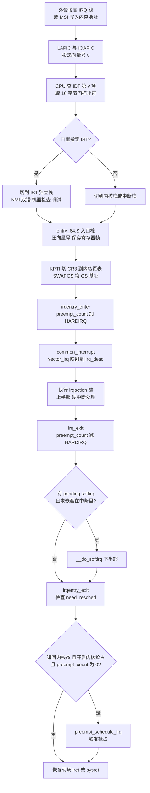
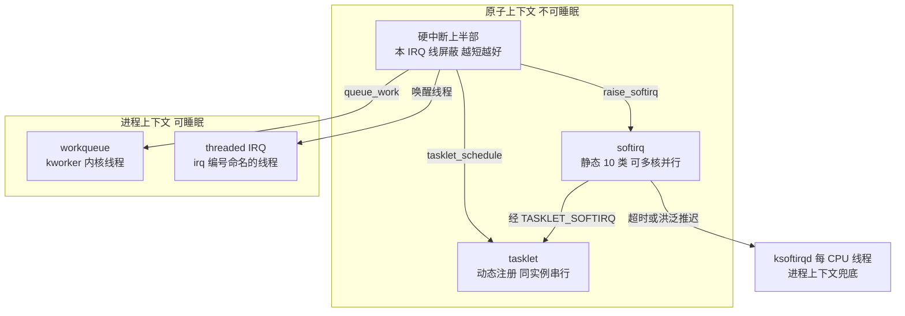
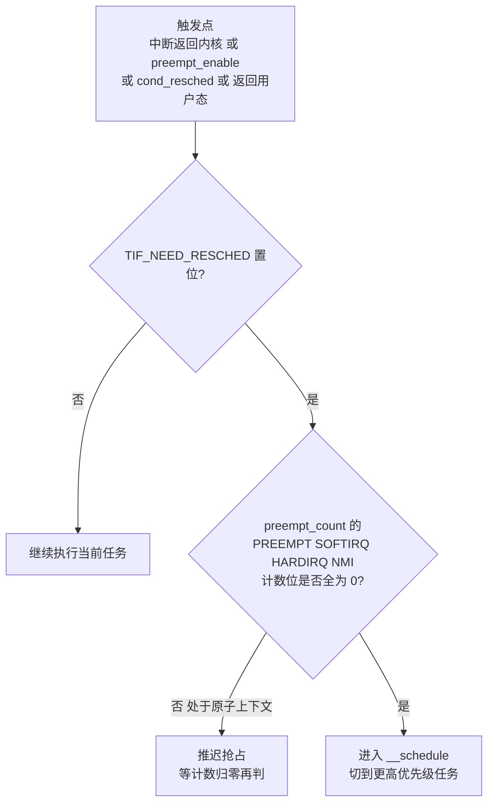

# Linux内核机制与内核利用（6）· 中断与软中断与内核抢占
> [!abstract] TL;DR
> - 中断是内核的“异步反应层”：CPU 用 IDT（x86-64 共 256 项、每项 16 字节的门描述符）把向量号映射到入口桩，0–31 是 CPU 异常、32–255 是外设 IRQ 与软件向量，NMI/双错/机器检查等靠 IST 切到独立的已知良好栈。
> - “上半部/下半部”是延迟处理的核心设计：硬中断处理程序运行在原子上下文（不可睡眠、本 IRQ 线屏蔽），必须极短；重活丢给 softirq/tasklet/workqueue——前两者仍在原子态，只有 workqueue 与线程化 IRQ 才是可睡眠的进程上下文。
> - softirq 是编译期静态的 10 类（NET_RX/TIMER/RCU/SCHED…），同一类可在多核并行；tasklet 建在 softirq 之上、保证同一实例全局串行；`ksoftirqd/N` 在 softirq 洪泛时兜底，避免饿死用户态。
> - 内核抢占由每 CPU 的 `preempt_count` 统一记账：从低到高是 PREEMPT/SOFTIRQ/HARDIRQ/NMI 计数位，任一非零即“原子上下文、禁止抢占与睡眠”；bit31 折叠了 need_resched 的反相位，让 `preempt_enable()` 用一条自减+判零走完快路径。
> - PREEMPT_NONE/VOLUNTARY/PREEMPT/RT 四档模型决定“内核态能否被强行抢占”，6.x 起可用 PREEMPT_DYNAMIC 在启动/运行时切换；抢占点集中在中断返回内核、`preempt_enable` 归零、`cond_resched()` 与返回用户态。
> - 逆向与安全视角：`sidt` 读 IDTR 是经典反虚拟机/反调试探针，IDT 挂钩是老牌 rootkit 手法（现代内核 IDT 已 `__ro_after_init` 只读映射）；`preempt_count` 失衡触发“scheduling while atomic”，硬中断与进程/软中断共享数据缺少 `irqsave` 保护正是内核 UAF/竞态漏洞的温床。

## 概述与定位

本篇讲的是内核里最“反应式”的一层：当外部世界（网卡收包、磁盘完成、定时器到点、键盘按下）异步地打断 CPU 时，内核如何在**尽可能短的时间、尽可能安全的上下文**里把事件接住、处理掉，并在合适的时机把 CPU 让给更该运行的任务。三个关键词——**中断（硬中断）、软中断（含 tasklet）、内核抢占**——看似三件事，本质是同一个问题的三个面：**当前这段代码运行在什么“执行上下文”里，它能不能被打断、能不能睡眠、能不能被换下 CPU。**

在系列里，本篇处在承上启下的位置。它复用了 [[03.系统调用实现与入口|系统调用入口]] 讲过的 `entry_64.S` 入口/退出汇编与 GS/CR3 切换（中断入口与 syscall 入口共享同一套“进出内核”的机制）；它给出的抢占点与 `need_resched` 语义，直接决定了 [[02.进程管理与CFS调度器|CFS 调度器]] 何时真正拿到 CPU；而它反复出现的“原子上下文不可睡眠”“与中断竞争必须关中断”这两条铁律，正是下一篇 [[07.内核同步：自旋锁与RCU|自旋锁与 RCU]] 存在的根本原因——`spin_lock_irqsave`、`local_bh_disable` 之所以要关中断/关下半部，就是为了和本篇的机制安全共存。

需要先建立的核心心智模型是**上下文的三态**：**进程上下文**（代表某个 `task` 在跑，可睡眠、可访问用户内存、可被抢占）、**软中断上下文**（下半部，原子、不可睡眠、可被硬中断打断）、**硬中断上下文**（top half，原子、不可睡眠、本地中断关闭、必须极短）。再加上 **NMI 上下文** 这个“连关中断都挡不住”的极端态。判断自己身处哪一态，靠的就是那个贯穿全篇的 `preempt_count`。看懂了它，中断、软中断、抢占三件事就串成了一条线。

本篇以 **x86-64** 为主线（IDT、APIC、`entry_64.S`、KPTI），但会在关键处对照 **ARM64**（无 IDT，改用异常向量表 `VBAR_EL1` + GIC 中断控制器），因为“机制在 arch 层不同、但 softirq/preempt 框架在 arch 之上通用”本身就是理解 Linux 分层的好例子。与 Windows 的 IDT/IRQL/DPC 体系的对照，则留给 [[38.Windows内核与驱动逆向/13.内核漏洞与利用基础|Windows 内核漏洞与利用基础]]，二者“中断优先级 + 延迟过程调用”的思路高度对称，读者可横向对照。

## 原理与机制

### 中断从硬件到 CPU：IDT 与中断控制器

一切从硬件说起。外设有事要报告，要么拉高一条物理 IRQ 线（经 I/O APIC 路由），要么以 **MSI/MSI-X** 的方式往一个特定的内存映射地址写一个约定的值（“消息信号中断”，PCIe 设备的主流方式，省掉了共享 IRQ 线的路由麻烦）。本地 APIC（LAPIC，每核一个）最终把这个事件转成一个 **8 位向量号 v（0–255）** 投递给 CPU。

CPU 收到向量 `v` 后，硬件自动做三件事：从 **IDTR** 寄存器指向的 **IDT（Interrupt Descriptor Table，中断描述符表）** 里取出第 `v` 项（x86-64 每项 16 字节的门描述符）；根据门描述符里的 **IST 字段** 决定是否切换到一个专用栈；把关键现场（RIP、CS、RFLAGS、RSP、SS，某些异常还有错误码）压栈，然后跳到门描述符里记录的处理程序入口。**为什么要有 IDT 而不是一个跳转表**？因为中断/异常必须在任意特权级、任意时刻安全地把控制权交给内核：门描述符里编码了目标代码段选择子、特权级检查（DPL）、进入时是否清中断标志（中断门 vs 陷阱门）、以及是否换栈（IST），这些都是硬件级的安全边界，不是一个软件跳转表能表达的。

向量号的划分是固定的约定：**0–31 保留给 CPU 异常/陷阱**（如 0 除零 #DE、3 断点 int3、6 非法指令 #UD、8 双错 #DF、13 一般保护 #GP、14 缺页 #PF、18 机器检查 #MC）；**32–255 给外部中断与软件中断**。其中 **向量 0x80（128）** 历史上被设成一个 **DPL=3 的陷阱门**，让用户态可以用 `int 0x80` 主动陷入内核发起系统调用（这条老路与 `syscall` 指令的关系见 [[03.系统调用实现与入口|第 3 篇]] 与 [[15.操作系统加载与启动/10.系统调用机制|系统调用机制]]）；其余向量绝大多数 DPL=0，用户态无权触发。

### 内核侧的入口与分发：genirq 框架

硬件跳到的入口不是驱动的处理函数，而是内核在 `arch/x86/entry/entry_64.S` 里为每个向量生成的**入口桩**（现代内核由 `idtentry`/`DEFINE_IDTENTRY` 宏体系生成）。入口桩负责“进内核的通用仪式”：在 KPTI 开启时切换 **CR3** 到内核页表、必要时 `SWAPGS` 把 GS 基址从用户态换成 per-CPU 的内核态、保存全部通用寄存器构成 `pt_regs`（这块寄存器帧正是 [[16.内核提权：ret2usr与ROP与pt_regs|第 16 篇]] 提权时反复利用的结构），然后调用 C 语言的通用入口 `irqentry_enter()`。

`irqentry_enter()` 会把 `preempt_count` 的 **HARDIRQ 计数位加一**——从这一刻起，`in_irq()` 为真、当前进入“硬中断上下文”。随后 `common_interrupt()` 用 per-CPU 的 `vector_irq[]` 数组把向量号翻译成 Linux 逻辑 IRQ 号，找到对应的 `irq_desc`，沿着它的 `irqaction` 链依次调用各驱动用 `request_irq()` 注册的处理函数（共享中断时链上可能挂多个）。这里有一层重要抽象：**genirq（通用 IRQ）框架** 用 `irq_chip`（mask/unmask/ack/eoi 的芯片操作）+ `irq_domain`（把硬件中断号 hwirq 映射到 Linux irq 号）把千差万别的中断控制器统一起来，驱动只管写 `handler`，不用碰 APIC/GIC 的寄存器细节。

处理完，`irq_exit()` 把 HARDIRQ 计数减回去，并检查一件关键的事：**本 CPU 有没有挂起的 softirq，且当前没有嵌套在别的中断里**——若有，就地调用 `__do_softirq()` 跑下半部；若无，直接走 `irqentry_exit()` 判断要不要抢占，最后 `iret`/`sysret` 恢复现场返回。

### 为什么要拆“上半部/下半部”

一个硬中断处理程序运行时，**本地中断是关闭的**（自 2.6.35 起所有 handler 默认关中断执行，早期的 `IRQF_DISABLED` 语义被固化），意味着这段时间同一 CPU 上其他中断都被压着、调度也停摆。中断关得越久，**中断延迟**越大、越可能丢中断、越伤实时性。所以设计原则是：**硬中断里只做“必须马上做、且极短”的事**（确认中断、读走硬件寄存器里易失的数据、记个状态），把耗时的协议处理（解析网络包、唤醒等待者、跑定时器回调）**推迟到“下半部”**，在中断重新打开之后再慢慢做。这就是 top half / bottom half 的分工，也是理解 softirq 存在意义的钥匙。

### 软中断：softirq / tasklet / workqueue 三件套

下半部有三种载体，选哪种取决于“**能不能睡眠、要不要高吞吐、需不需要动态创建**”：

- **softirq**：编译期静态定义、数量固定的 10 类（按优先级：`HI`、`TIMER`、`NET_TX`、`NET_RX`、`BLOCK`、`IRQ_POLL`、`TASKLET`、`SCHED`、`HRTIMER`、`RCU`），用 `open_softirq()` 注册处理函数，`raise_softirq()` 在 per-CPU 的 `__softirq_pending` 位图里置位。它**最快、可在不同 CPU 上并行运行同一类**（所以处理函数必须自己做好 SMP 同步），代价是**不可睡眠、且不能动态增删**——只有网络、定时器、块层、RCU 这种性能敏感的核心子系统才配拥有一类 softirq。
- **tasklet**：建在 `TASKLET_SOFTIRQ`（和高优先级的 `HI_SOFTIRQ`）之上的动态机制。它牺牲一点性能换来两个好处：**可以随时动态创建**、以及**保证同一个 tasklet 实例绝不会在两个 CPU 上同时跑**（靠 `TASKLET_STATE_SCHED`/`TASKLET_STATE_RUN` 两个状态位串行化），于是驱动写 tasklet 回调时不必操心自身的并发。普通驱动的下半部大多用它。近年（6.x）社区在推动**用 workqueue/BH-workqueue 替换 tasklet**，因为 tasklet 的全局串行与软中断上下文限制在现代很多场景下弊大于利。
- **workqueue**：把工作交给 `kworker` 内核线程，运行在**进程上下文、可以睡眠**（可 `mutex`、可 `GFP_KERNEL` 分配、可 `copy_from_user`）。凡是下半部里需要阻塞的活，只能走 workqueue。它是三者里唯一“不原子”的。

还有一个介于之间的 **线程化中断（threaded IRQ）**：`request_threaded_irq()` 让你注册一个极短的硬中断“快检”函数 + 一个跑在专属内核线程里的“慢处理”函数。**PREEMPT_RT 实时内核**会把几乎所有中断强制线程化，从而让中断也能被优先级调度、被抢占——这是实时性的关键。

### softirq 的执行与 ksoftirqd 兜底

`__do_softirq()` 并不是把 pending 的软中断一次跑完就走，而是带**双重刹车**：一轮跑完若还有新的 pending，最多重启 `MAX_SOFTIRQ_RESTART`（10）轮，或累计运行超过约 **2ms**，或出现 `need_resched`，就停下来，调用 `wakeup_softirqd()` 把剩下的活**推给每 CPU 的 `ksoftirqd/N` 内核线程**去慢慢处理。**为什么要这个阈值**？想象网卡被打爆，`NET_RX` 软中断源源不断地产生——如果 `__do_softirq` 死磕到底，用户态进程就会被彻底饿死（“softirq 风暴”）。把溢出的软中断降级到一个**普通优先级、可被调度**的内核线程，就给了调度器夺回 CPU 的机会。这也是 `/proc/softirqs` 之外，你在高负载机器上会看到 `ksoftirqd` 吃 CPU 的原因。软中断跑在 `local_bh_disable()` 的保护下（`preempt_count` 的 SOFTIRQ 位被置），所以**软中断之间不会在同一 CPU 上互相嵌套**，但**硬中断可以打断软中断**（硬中断优先级更高）。

### 内核抢占：preempt_count 与 need_resched

“抢占”回答的是：**当前正在内核态执行的这段代码，能不能被立即换下 CPU，去跑一个刚变得更该运行的任务？** 判断依据是两个量的组合：

1. **`need_resched`**（`thread_info` 里的 `TIF_NEED_RESCHED` 标志）：调度器在“时间片用完”（`scheduler_tick`）、“唤醒了更高优先级任务”（`try_to_wake_up`）等时刻，通过 `resched_curr()` 把它置位，表示“**该重新调度了**”。它只是“意愿”。
2. **`preempt_count`**（每 CPU 变量）：是“**许可**”。只要它的 PREEMPT/SOFTIRQ/HARDIRQ/NMI 任一计数位非零，就说明当前处于**原子上下文**（持有自旋锁、在软/硬中断里、显式 `preempt_disable()` 了），此时**绝不能抢占也绝不能睡眠**，否则轻则破坏临界区、重则死锁。

只有“**有意愿（need_resched 置位）且有许可（preempt_count 归零）**”时，抢占才真正发生。Linux 为此玩了个漂亮的位技巧：把 `need_resched` 的**反相值**折叠进 `preempt_count` 的 bit31（`PREEMPT_NEED_RESCHED`）。平时该位是 1（表示“不需要重调度”），一旦 `need_resched` 置位就把它清 0。于是 `preempt_enable()` 递减计数后，只要判断**整个 `preempt_count` 原始值是否为 0**——为 0 同时意味着“所有禁用计数都归零”且“bit31 被清（即确实需要重调度）”，一条 `decl` + 判零就走完了快路径，绝大多数情况零开销，只有真要抢占时才进慢路径 `preempt_schedule()`。

**抢占点**在哪儿？主要四处：**中断返回内核态时**（`irqentry_exit` → `preempt_schedule_irq`，仅 `CONFIG_PREEMPT`）、**`preempt_enable()` 使计数归零时**、**显式 `cond_resched()`**（长循环里主动让路，供非抢占内核降低延迟）、以及**返回用户态时**（退出内核前必查 `TIF_NEED_RESCHED`，这是所有内核配置下都有的“天然抢占点”）。

## 结构与执行详解：从IDT门到抢占计数

这一段把上面提到的两个核心数据结构摊开到**字节/比特级**，因为它们既是理解机制的锚点，也是逆向与利用时直接盯着看的对象。

### IDT 门描述符的字节布局（x86-64）

x86-64 下每个中断门是 16 字节。看懂它，才知道“IDT 挂钩改的是哪几个字节”“IST 到底怎么选栈”。

```
x86-64 中断门/陷阱门描述符（16 字节 = 128 位）
偏移   位            字段
0      bits 0–15     目标处理程序偏移 offset[15:0]
2      bits 16–31    段选择子 Segment Selector（通常是 __KERNEL_CS）
4      bits 32–34    IST：Interrupt Stack Table 索引，0=沿用当前栈，1–7=切到 TSS 里第 n 个 IST 栈
       bits 35–39    保留（置 0）
       bits 40–43    Type：0xE=中断门（进入即清 IF，关本地中断） / 0xF=陷阱门（不清 IF）
       bit  44       S=0（系统段描述符）
       bits 45–46    DPL：门的最低调用特权级（int 0x80 为 3，其余多为 0）
       bit  47       P：Present 有效位
6      bits 48–63    目标处理程序偏移 offset[31:16]
8      bits 64–95    目标处理程序偏移 offset[63:32]
12     bits 96–127   保留（置 0）
```

几个设计要点用散文讲清：**偏移被拆成三段（低 16、中 16、高 32）** 是 32 位 IDT 格式向 64 位扩展时为兼容而“打补丁”的历史包袱，逆向时拼地址要三段拼。**中断门 vs 陷阱门** 的差别只在进入时要不要自动清 `IF`：硬件中断入口几乎都用中断门（避免刚进来就被下一个中断套娃），而调试/断点这类希望允许嵌套的用陷阱门。**IST 是安全关键**：TSS 里有 7 个 IST 栈指针，`#DF` 双错、`NMI`、`#MC` 机器检查、`#DB` 调试这些“可能在栈本身已经烂掉的时刻发生”的异常，必须靠 IST 切到一个**预留的已知良好栈**，否则一旦当前内核栈溢出/损坏，异常处理自己又踩进坏栈就会级联崩溃。IST 栈与 KPTI 的 CPU entry area 都被同时映射进用户/内核两套页表，这样入口代码在切 CR3 之前也有栈可用——这条与 [[17.绕过内核防护：KASLR与SMEP与SMAP与KPTI|第 17 篇]] 的 KPTI 细节直接咬合。

### preempt_count 的比特布局

```
per-CPU __preempt_count 位布局（include/linux/preempt.h）
bit  0–7    PREEMPT   —— preempt_disable() 的嵌套计数（最多 255 层）
bit  8–15   SOFTIRQ   —— 本地下半部关闭 / 正在跑 softirq（bit8 常用作 in-softirq 标记）
bit 16–19   HARDIRQ   —— 硬中断嵌套计数
bit 20–23   NMI       —— NMI 嵌套计数
bit 31      PREEMPT_NEED_RESCHED —— need_resched 的“反相”折叠位
                       置 1 = 不需要重调度；清 0 = 需要重调度

派生判断（全是对上面掩码的位测试）：
in_irq()        = HARDIRQ 掩码非零
in_softirq()    = SOFTIRQ 掩码非零
in_interrupt()  = (HARDIRQ | SOFTIRQ | NMI) 非零   —— “在中断相关上下文里”
in_nmi()        = NMI 掩码非零
in_atomic()     = (HARDIRQ|SOFTIRQ|NMI|PREEMPT) 非零 —— “原子上下文，禁睡眠禁抢占”
preempt_count() == 0（原始值）⇒ 既不在原子态、且 bit31 已被清 ⇒ 快路径一条指令即可决定抢占
```

**为什么把四类上下文塞进一个整数的不同比特段**？因为内核在无数热点路径上都要问“我现在能睡吗？能抢占吗？在中断里吗？”，把答案压缩成对同一个 per-CPU 整数做几次位与，就把这些判断变成了几乎零成本的操作。这也是为什么一个**看似无害的 `preempt_count` 失衡**（`preempt_disable` 多了或少了一次、`local_bh_disable/enable` 不配对）后果严重：计数虚高会让 CPU 永远不肯抢占而“假死”，计数虚低（在原子区里被误判为可睡眠）则可能真的去睡眠，触发内核的 `BUG`：`sleeping function called from invalid context` 或 `scheduling while atomic`。逆向一个可疑驱动时，**检查每条 `preempt_disable`/`spin_lock` 是否都有配对的解锁**，是发现死锁/失衡类 bug 的常规动作。

### 一次“网卡收包”的全链路时序

把结构串成动态过程，最典型的是网络收包（细节属 [[08.网络栈与netfilter|第 8 篇]]，这里只走中断/软中断骨架）：网卡 DMA 好数据后发 MSI 中断 → CPU 经 IDT 进入硬中断上半部，驱动的 handler **只做“关本设备中断 + `napi_schedule` 置起 `NET_RX` softirq”就返回**（越短越好）→ `irq_exit` 发现 pending 的 `NET_RX`，跑 `__do_softirq` → `net_rx_action` 在软中断上下文里以 NAPI 轮询方式批量收包、走协议栈，**期间硬中断是开的**（新包来了可以再打断它，但软中断本身不嵌套）→ 若包太多超过 2ms/10 轮，剩余工作交给 `ksoftirqd`。整条链路完美诠释了“上半部极短、下半部干重活、洪泛有兜底”的设计。





### 抢占模型的四档与新动向

`CONFIG_PREEMPT_*` 决定“内核态代码能被抢占的程度”，是**吞吐 vs 延迟**的取舍：

- **PREEMPT_NONE**（服务器默认，追求吞吐）：内核态**不做非自愿抢占**，只在返回用户态、显式 `cond_resched()`/`schedule()`、阻塞时才让路。长内核路径可能造成较大调度延迟。
- **PREEMPT_VOLUNTARY**（桌面折中）：在 `might_sleep()` 等标注点插入额外的“自愿抢占”检查，延迟更低。
- **PREEMPT**（低延迟/桌面）：**完全内核抢占**——除了原子区（`preempt_count` 非零），内核代码几乎处处可被抢占，中断返回内核也会触发 `preempt_schedule_irq`。
- **PREEMPT_RT**（硬实时）：把绝大多数自旋锁变成**可睡眠的 rt-mutex**、把中断**线程化**、把软中断也纳入优先级调度，从而把内核的不可抢占区间压到极小。它长期在树外维护，主体到 **6.12（2024）** 才基本合入主线。

近年两个重要演进值得逆向者知道：**PREEMPT_DYNAMIC**（5.12 起）用 static call/static key 把抢占模型做成**启动或运行时可切换**（内核命令行 `preempt=none|voluntary|full`，或 debugfs 调），意味着同一个内核镜像的抢占行为不再是编译期定死的；以及更新的 **惰性抢占（PREEMPT_LAZY）** 工作，试图用一个统一模型取代 VOLUNTARY，减少内核里成千上万个手写 `cond_resched()`。



### 平台差异：ARM64 没有 IDT

x86 的 IDT 是“向量号 → 门描述符”的**表**；ARM64 完全不同，它用一张 **异常向量表**（基址在 `VBAR_EL1`），只有 16 个入口（4 种异常类型：同步异常/IRQ/FIQ/SError × 4 种来源状态），进入后靠读 **ESR_EL1**（异常症状寄存器）在软件里二次分发；外部中断由 **GIC（Generic Interrupt Controller）** 管理，对应 x86 的 APIC。但请注意：**这些差异都在 arch 层**，一旦进入 genirq、softirq、`preempt_count`、调度器，两平台走的是**同一套架构无关代码**。这正是 Linux “把硬件差异关进 arch 目录、把策略上提到通用层”的典型体现——逆向不同架构的内核时，`entry` 与中断控制器部分要重学，但下半部与抢占逻辑可以复用认知。

## 工具视角与实战

**观测中断与软中断的分布**是排障与画像的第一步：

```bash
# 每个 CPU 上各 IRQ 的触发计数 + 中断控制器 + 设备名（看中断是否均衡、有无热点）
cat /proc/interrupts
# 每类 softirq 在各 CPU 上的累计次数（NET_RX 飙升→网络软中断压力）
cat /proc/softirqs
# %irq / %soft 占比，定位“CPU 都耗在中断/软中断上”的问题
mpstat -P ALL -I ALL 1
# 中断亲和性：把某 IRQ 绑到指定 CPU（配合 irqbalance 或手动调优）
cat  /proc/irq/<N>/smp_affinity_list
echo 2 > /proc/irq/<N>/smp_affinity_list
```

**动态追踪**用 ftrace / bpftrace 看时序与热点：

```bash
# ftrace 抓硬中断进出与软中断进出事件
cd /sys/kernel/debug/tracing
echo 1 > events/irq/irq_handler_entry/enable
echo 1 > events/irq/softirq_entry/enable
cat trace_pipe

# bpftrace：统计各类 softirq 的处理耗时分布（vec 即 softirq 号）
bpftrace -e 'tracepoint:irq:softirq_entry { @st[args->vec] = nsecs }
             tracepoint:irq:softirq_exit  { @us = hist((nsecs - @st[args->vec])/1000); delete(@st[args->vec]) }'
# 谁在疯狂 raise NET_RX
bpftrace -e 'tracepoint:irq:softirq_raise /args->vec==3/ { @[kstack] = count() }'
```

**在崩溃/活取镜像里读 IDT**（配合 [[13.内核调试：kgdb与ftrace与crash|第 13 篇]] 的 crash/kgdb）：`crash` 里 `sys` 看系统信息、`irq` 看中断描述、`bt` 在中断栈上回溯；QEMU+gdb 下可用 `monitor info registers` 读 `IDT`（基址+限长），再按上面的 16 字节布局手工解析门描述符，验证某向量指向的处理程序符号是否与 `/proc/kallsyms` 里的 `asm_exc_*`/`asm_common_interrupt` 一致——**这正是检测 IDT 被篡改的方法**。

**逆向一个驱动的中断路径**，标准动线是：找 `request_irq`/`request_threaded_irq` 的调用点 → 定位 `handler` 函数指针 → 看它从设备 MMIO/DMA 缓冲读了什么、是否把**硬件可控的数据**未经校验就当长度/索引用（这类就是 [[10.字符设备与ioctl攻击面|第 10 篇]] 与 [[14.内核漏洞类型：UAF与OOB与竞态|第 14 篇]] 关注的攻击面）→ 跟踪它 `raise_softirq`/`tasklet_schedule`/`queue_work` 把重活推给了哪个下半部，再去逆那个下半部函数。一个反虚拟机彩蛋：**`sidt` 指令在用户态即可执行**（不特权），历史上的 “red pill” 就靠读 IDTR 基址来判断自己是否跑在虚拟机里（VMM 会把 IDT 重定位到不同地址）——逆向恶意样本时遇到裸 `sidt` 要警惕它在做环境探测。

## 安全性与正确使用

> [!caution] 合规边界与用途声明
> 本节所述的 IDT 结构、中断/软中断竞态、`preempt_count` 语义与栈切换细节，**仅用于你自有或获得书面授权的环境、CTF 靶场与防御性安全研究**，出发点是把机制讲透以便**加固、检测与教学**。请勿将其用于攻击真实生产系统或他人设备，不要据此编写投向真实目标的武器化利用，也不要用于绕过任何商业授权或篡改不属于你的系统。原理可以讲深，但**“打某个真实目标的成品配方”不在本文范围**。

**中断上下文的三条铁律**（违反即 bug，也是审计要点）：其一，**硬/软中断里不可睡眠**——不能拿 `mutex`、不能 `msleep`、不能 `copy_from/to_user`、不能用 `GFP_KERNEL` 分配（要用 `GFP_ATOMIC`），因为原子上下文没有可让出的 `task` 语义，睡下去就是死锁或崩溃。其二，**与中断处理程序共享的数据，进程上下文侧访问必须关中断**（`spin_lock_irqsave`/`local_irq_save`），否则进程正改到一半被中断打断、中断处理程序看到不一致状态，就是经典竞态——**中断天生放大竞态窗口**，很多内核 UAF/竞态漏洞（见 [[14.内核漏洞类型：UAF与OOB与竞态|第 14 篇]]）的根因就是“该 `irqsave` 的地方只用了普通锁甚至没锁”。其三，**下半部与进程上下文共享的数据用 `local_bh_disable`/`spin_lock_bh` 保护**，道理相同，只是挡的是软中断而非硬中断。这三条正是下一篇 [[07.内核同步：自旋锁与RCU|自旋锁与 RCU]] 各种 `_irq`/`_bh` 变体存在的根据。

**IDT 挂钩（IDT hooking）** 是老牌 rootkit 手法：改写 `IDT[vector]` 门描述符的偏移字段，把某向量（历史上常是 `int 0x80` 或缺页）劫持到攻击者代码，实现隐藏/提权。**现代内核的防御**是把 IDT 表放进 `__ro_after_init`、启动后映射为**只读**，写它会触发保护故障；再叠加 [[17.绕过内核防护：KASLR与SMEP与SMAP与KPTI|KASLR/SMEP/SMAP]] 让“把控制流引到用户态代码”的经典 ret2usr 失效（SMEP 禁止内核执行用户页、SMAP 禁止内核随意读写用户页）。**检测**思路则如上一节：周期性把 IDT 各项与 `kallsyms` 里的合法入口比对，任何偏离都可疑——这属于纯防御/取证范畴。

**preempt_count 与栈的利用面**（一律防御视角）：`preempt_count` 失衡本身通常只造成死锁/告警，但在漏洞链里，**中断/抢占引入的时序**常被用作竞态触发器（用定时器、`hrtimer` 或高频中断把某个 UAF 的“释放—再引用”窗口卡住）；`hrtimer`/`tasklet`/`irq_work` 这类**带函数指针的回调对象**若发生 UAF，被改写的回调指针会在下半部/中断上下文里被调用，成为控制流劫持点——因此加固上要配合 CFI/kCFI（见 [[34.现代二进制防护机制/15.内核防护与kCFI|内核防护与 kCFI]]）对间接调用做校验。IST 栈与中断栈也是 [[16.内核提权：ret2usr与ROP与pt_regs|栈迁移/ROP]] 关注的对象，但同样地，这里只讲“为什么这些结构是敏感面、该如何加固与检测”，不给成品攻击步骤。防御侧的正道是：**保持内核更新**（中断/定时器子系统的竞态 CVE 修复要及时打）、开启 KASLR/SMEP/SMAP/KPTI/CFI、生产内核别开不必要的调试接口、对驱动中断处理里“信任硬件数据”的地方做输入校验。

## 小结

把三件事收束成一句话：**中断决定“谁能打断我”，软中断决定“重活推到哪个上下文去做”，抢占决定“我什么时候被换下 CPU”——而三者共用同一把标尺 `preempt_count`。** 硬件用 IDT 把向量号变成受控的内核入口，IST 为致命异常保留干净栈；内核用 genirq 统一分发、用“上半部极短 + 下半部（softirq/tasklet/workqueue/线程化 IRQ）干重活 + ksoftirqd 兜底”兼顾了中断延迟与吞吐；抢占则靠 `need_resched`（意愿）与 `preempt_count`（许可）的组合，加上 bit31 折叠 need_resched 的位技巧，把“该不该、能不能换任务”压成一条指令的判断，并按 NONE/VOLUNTARY/PREEMPT/RT 四档（以及可运行时切换的 DYNAMIC 与新的 LAZY）在延迟与吞吐间取舍。

对逆向与安全而言，真正要刻进肌肉记忆的是**“判上下文”**：拿到一段内核代码先问它跑在硬中断、软中断、还是进程上下文，能不能睡、要不要 `irqsave`——这决定了它的正确性边界，也决定了它的攻击面在哪。IDT 挂钩、中断放大的竞态、带回调指针的下半部对象 UAF，都是从“上下文与时序”这个角度长出来的问题；理解了本篇，才能看懂后续同步、漏洞、提权、绕防护各篇为何要那样设计。

## 相关阅读

- 系列内：[[03.系统调用实现与入口]]（共享的 `entry_64.S` 进出内核机制）、[[02.进程管理与CFS调度器]]（抢占最终唤醒的调度器）、[[07.内核同步：自旋锁与RCU]]（`_irq`/`_bh` 变体的由来）、[[08.网络栈与netfilter]]（NET_RX 软中断与 NAPI）、[[14.内核漏洞类型：UAF与OOB与竞态]]、[[16.内核提权：ret2usr与ROP与pt_regs]]、[[17.绕过内核防护：KASLR与SMEP与SMAP与KPTI]]、[[13.内核调试：kgdb与ftrace与crash]]
- Windows 对称参考：[[38.Windows内核与驱动逆向/13.内核漏洞与利用基础]]、[[38.Windows内核与驱动逆向/26.内核池风水与利用]]（IDT/IRQL/DPC 与本篇中断/softirq/抢占的对照）
- 启动前置：[[15.操作系统加载与启动/10.系统调用机制]]、[[15.操作系统加载与启动/11.init与systemd启动]]
- 防护呼应：[[34.现代二进制防护机制/15.内核防护与kCFI]]（KASLR/SMEP/SMAP/KPTI 与间接调用校验）
- Fuzzing 呼应：[[49.Fuzzing与漏洞挖掘/14.内核与驱动Fuzzing：syzkaller]]
- 官方文档与书目：内核源码 `Documentation/core-api/genericirq.rst`（genirq 框架）、`Documentation/kernel-hacking/hacking.rst`（上下文与不可睡眠规则）、`arch/x86/entry/entry_64.S` 与 `include/linux/preempt.h` 源码注释；Intel SDM Vol.3 第 6 章（中断与异常/IDT/IST）；《Understanding the Linux Kernel》（Bovet & Cesati）中断与内核同步章；《Linux Kernel Development》（Robert Love）中断处理、下半部与内核抢占章

[[00.Linux内核机制与内核利用总览|⬆ 系列总览]] | [[05.VFS与文件系统层|← 上一章]] | [[07.内核同步：自旋锁与RCU|→ 下一章]]
