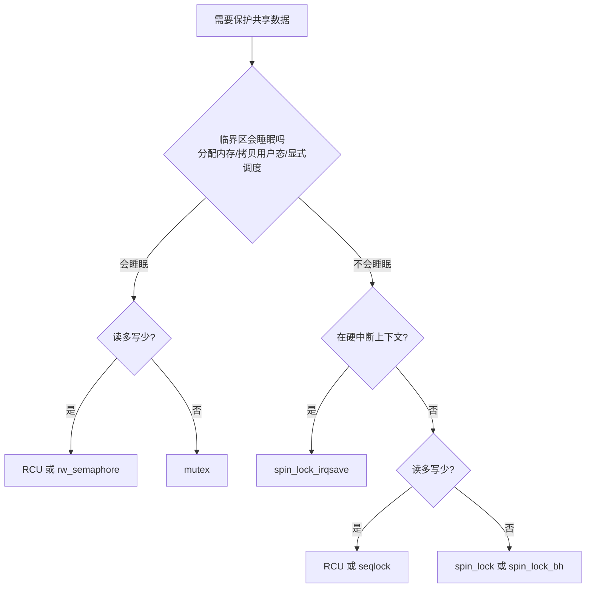
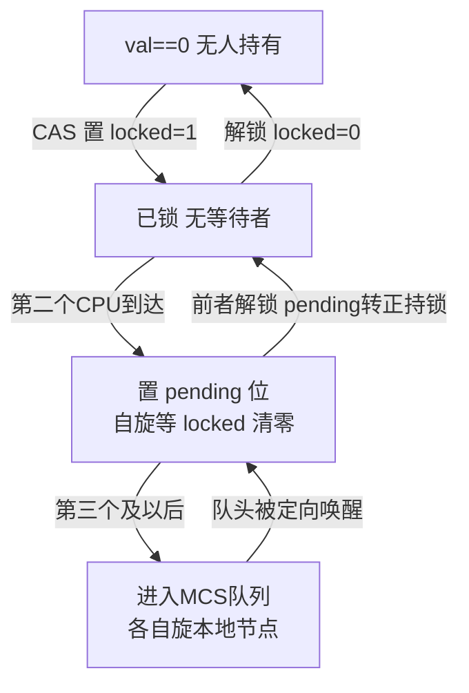
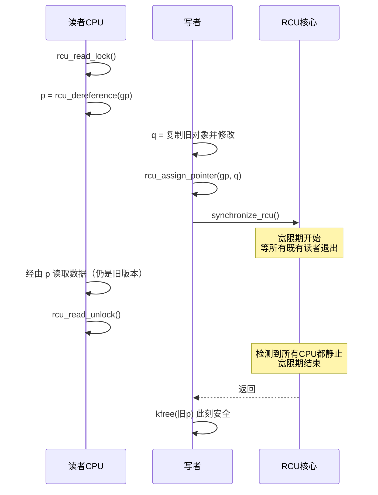
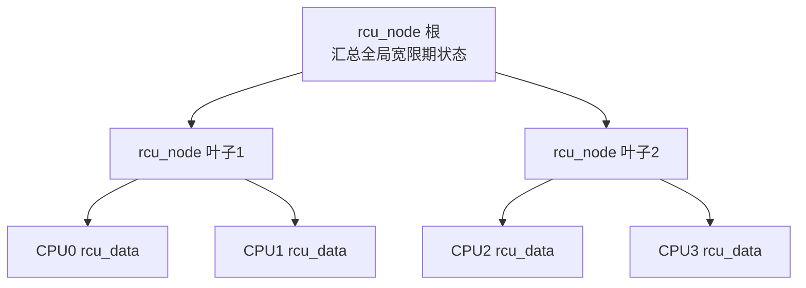

# Linux内核机制与内核利用（7）· 内核同步：自旋锁与RCU
> [!abstract] TL;DR
> - 内核并发来自三处：SMP 多核真并行、内核抢占、以及中断/软中断打断当前流。同步原语的任务是把「非原子的读-改-写」和「多步不变式」重新变回原子可见。
> - 自旋锁不睡眠、忙等，只能护住不睡眠的短临界区；现代 x86 用 **qspinlock**（32 位字里塞下 locked/pending/MCS 队尾），既保 FIFO 公平又消除 cacheline 抖动。mutex/semaphore 会睡眠，护长临界区。
> - **RCU** 让读侧几乎零成本：`rcu_read_lock()` 在非抢占内核里只是禁抢占，读者不写任何共享 cacheline；写者「复制-改-发布-延迟回收」，靠**宽限期**（所有既有读者退出）保证不会释放仍被引用的对象。
> - 内存序是隐形地基：`rcu_assign_pointer` 用 release 序发布，`rcu_dereference` 靠**数据依赖**保序；x86 是 TSO 只缺 StoreLoad，弱序架构（ARM/Power）需真实屏障。`READ_ONCE/WRITE_ONCE` 挡编译器撕裂与臆造。
> - 锁的缺失或误用直接长成漏洞：竞态（CWE-362）、double-fetch、RCU 读侧缺失导致的 UAF、`refcount_t` 未饱和导致的计数回绕提权。看懂锁，才能看懂这些 bug 的窗口。

## 概述与定位

在单处理器、不可抢占的古典 UNIX 里，内核态一旦进入就「独占」CPU，很多数据结构靠「关中断 + 不主动调度」天然串行化。Linux 早已不是那个世界：SMP 让多个 CPU 同时执行内核代码，`CONFIG_PREEMPT` 让内核代码在持锁之外的任意点被更高优先级任务抢占，中断与软中断随时打断当前执行流并可能访问同一份数据。**并发是常态，串行才需要显式构造**——这就是同步原语存在的理由。

同步要解决的核心问题只有两类。其一是**原子性缺失**：`counter++` 在机器层是「读内存、寄存器加一、写回」三步，两个 CPU 交错执行会丢更新。其二是**不变式跨多步**：一个链表插入要改前驱的 `next`、新节点的两个指针、后继的 `prev`，中间任何一步被别的 CPU 看到，都是一个「断裂」的链表。同步原语的本质，是把这些「逻辑上应当不可分割」的操作，在其他观察者眼里重新变回不可分割。

本章在系列里的定位是「地基」。它上承第 6 篇[[06.中断与软中断与内核抢占|中断与软中断与内核抢占]]——正是抢占与中断制造了并发；下启第 14 篇[[14.内核漏洞类型：UAF与OOB与竞态|竞态漏洞]]与第 15 篇[[15.内核利用原语与堆喷|利用原语]]——锁的缺失、误用、以及 RCU 宽限期的错误理解，直接长成 UAF 与提权原语。理解「锁应该怎样正确工作」，是判断「哪里的锁坏了、窗口有多宽」的前提。Windows 侧的对称主题见[[38.Windows内核与驱动逆向/13.内核漏洞与利用基础|Windows内核漏洞与利用基础]]。

Linux 的同步原语是一整个谱系，按「是否睡眠 / 读写对称性 / 读侧开销」铺开：

| 原语 | 睡眠 | 读侧开销 | 典型场景 |
|---|---|---|---|
| `atomic_t` / `atomic_long_t` | 否 | 一条 LOCK 指令 | 计数器、标志位 |
| `spinlock_t` | 否 | 忙等 + 写 cacheline | 短临界区、任意上下文 |
| `rwlock_t` | 否 | 忙等 + 写共享计数 | 读多写少（已过时） |
| `seqlock_t` | 读者否/写者否 | 读两次序号、可重试 | jiffies、timekeeping |
| `mutex` | 是 | 快路径一次原子操作 | 长临界区、进程上下文 |
| `rw_semaphore` | 是 | 原子计数 | 长临界区读写 |
| **RCU** | 读者否 | **几乎为零** | 读极多写极少、指针发布 |

选型的第一判据永远是**临界区会不会睡眠**：会睡眠（分配内存可能阻塞、`copy_from_user` 可能缺页、显式 `schedule`）就不能用自旋锁——持自旋锁时被调度走，别的 CPU 会一直空转等一个不再运行的持锁者，轻则性能塌方，重则死锁。第二判据是**读写比例**：读多写少时，让读者互斥是巨大浪费，RCU/seqlock 把读侧成本压到近乎零。



## 原理与机制

### 原子操作：一切锁的砖块

`atomic_t` 是最底层的砖块。它保证「读-改-写」在单条指令内对其他 CPU 呈现为原子。x86 靠 `LOCK` 前缀锁总线/缓存行（`lock incl`、`lock cmpxchg`），ARM 靠 `LDXR/STXR` 独占加载-条件存储的重试循环，RISC-V 有 `amoadd` 一类原子内存操作。最关键的原语是 **CAS（compare-and-swap）**：`atomic_cmpxchg(v, old, new)` 只有当当前值等于 `old` 时才写入 `new` 并返回旧值，它是构造几乎所有无锁算法的通用武器。

一个容易忽视但在安全上要命的点：普通 `atomic_t` 的加减**不做溢出饱和**。引用计数若用裸 `atomic_t`，攻击者制造计数回绕到 0，就能触发提前释放而其他引用仍在使用——这是一整类 UAF 的根。内核为此引入 `refcount_t`：加到接近 `UINT_MAX` 时**饱和不再回绕**，减到 0 之后再减会 `WARN` 并拒绝，从数据类型层面堵死这条路。逆向内核对象生命周期时，看清用的是 `atomic_t` 还是 `refcount_t`，往往就是「有没有计数 bug」的第一眼判断。

### 自旋锁：忙等的艺术与它的三次进化

自旋锁的语义极简：拿不到就原地打转（spin），直到拿到。它不睡眠，所以能用在中断上下文；但正因为忙等烧 CPU，它只配护**极短**的临界区。它的实现史，是一部与 cacheline 抖动和公平性搏斗的历史：

**第一代 · test-and-set**：一个字，0 空闲 1 占用，`xchg` 抢。问题有二：**不公平**（谁的缓存行状态好谁抢到，可能饿死某个 CPU），以及**cacheline bouncing**（所有自旋者都在同一个地址上做写型原子操作，缓存行在各核间反复失效弹跳，核越多越惨）。

**第二代 · ticket spinlock**（2.6.25，2008）：像银行叫号。锁分 `next`（下一张票号）和 `owner`（正在服务的号）两半。抢锁 = 原子地 `next++` 拿到自己的票号，然后自旋等 `owner` 等于自己。**FIFO 严格公平**解决了饥饿。但所有人还是盯着同一个 `owner` 变量自旋，写型更新仍触发 cacheline 广播，抖动没根治。

**第三代 · qspinlock（队列自旋锁）**（3.15/4.2，2014-2015，x86 默认）：思想源自 **MCS 锁**——让每个等待者自旋在**自己本地**的一个节点变量上，持锁者释放时只需写「下一个节点」的本地标志，缓存行不再全局弹跳。但纯 MCS 节点比一个字大，塞不进内核对 `spinlock_t` 只占 32 位的约束。qspinlock 的精巧在于把 32 位字切成多段编码：低 8 位 `locked`、第 8 位 `pending`、高 16 位编码队尾（CPU 号 + 上下文索引）。

```
qspinlock 的 32 位 val 布局：
 31            18 17  16 15      9   8   7        0
+----------------+------+---------+-----+----------+
|   tail cpu+1   | tail | (保留)  |pend | locked   |
|   (14 bit)     |idx(2)|         |(1)  | (8 bit)  |
+----------------+------+---------+-----+----------+
tail idx: 0=进程 1=软中断 2=硬中断 3=NMI（每CPU四套MCS节点，防嵌套上下文互抢同一节点）
```

它的路径设计是「常见情形极快、罕见情形才排队」：
- **无争用快路径**：`val==0` 时一条 CAS 把 `locked` 置 1，单核独占只花一次原子操作，和最朴素的自旋锁一样快。
- **两核轻争用**：第二个等待者不进队列，只置 `pending` 位并自旋等 `locked` 变 0，省掉建队列的开销。
- **三核及以上重争用**：后续者才进入 MCS 队列，各自自旋在本地节点，队头解锁时定向唤醒下一个，彻底消除全局抖动。



自旋锁还有一组「上下文变体」，是新手最常踩的坑。同一份数据如果既在进程上下文又在中断处理里被访问，就必须用 `spin_lock_irqsave`：它在持锁前**关本地中断并保存原 flags**，防止「进程上下文持锁 → 本核中断打进来 → 中断处理也去抢同一把锁 → 自己等自己 → 死锁」。若只与软中断共享，用 `spin_lock_bh` 关下半部即可。`spin_lock_irqsave` 之所以要 `save/restore` 而非无脑开中断，是因为可能本就在关中断的嵌套里，粗暴开中断会破坏外层假设。此外 `PREEMPT_RT` 实时补丁把普通 `spinlock_t` 变成可睡眠的 `rt_mutex`（以换取低延迟），只有 `raw_spinlock_t` 保持真忙等——逆向 RT 内核时二者语义天差地别。

### rwlock 与 seqlock：读写不对称的两条路

`rwlock_t` 允许多读者并发、写者独占。但它已被视为**过时**：读者仍要对共享计数做写型原子更新，cacheline 照样抖，且写者容易被源源不断的读者饿死。读多写少的正解是 RCU 或 seqlock。

**seqlock（顺序锁）** 走了一条反直觉的路：让读者「乐观地读、发现被写就重试」，读者**完全不阻塞写者**。写者进入时把序号 `seq++`（变奇数，宣告「正在写」），写完再 `seq++`（变回偶数）。读者进入先读 `seq`（若为奇数说明正在写，自旋等它变偶），记下值，读数据，读完再读一次 `seq`，若两次不等说明中途被写者插了一脚，**丢弃结果重来**。它的适用前提很硬：被保护的数据必须**可以安全地被读到中间态再丢弃重读**（比如两个 32 位拼一个 64 位 jiffies），因此绝不能用 seqlock 保护「读一半就去解引用的指针」。内核时钟、`timekeeping`、`jiffies_64` 是它的经典战场。

### mutex 与 semaphore：会睡眠的长临界区之锁

当临界区可能睡眠或耗时较长，就该用会睡眠的锁。`mutex` 是二值互斥，有个漂亮的优化叫 **乐观自旋（optimistic spinning / MCS）**：如果持锁者此刻正在别的 CPU 上运行，抢锁者宁可短暂自旋等它很快释放，也不立刻睡眠——因为「睡眠+唤醒」的上下文切换开销可能比等一下还大。只有当持锁者不在运行（大概率短期内不释放）才真正睡眠让出 CPU。`semaphore` 是计数信号量，可表达「最多 N 个并发」，`rw_semaphore` 则是读写版的睡眠锁，配 `down_read/down_write`。这些锁绝不能用在硬中断上下文——中断里不能睡眠。

### 内存屏障：所有锁背后的隐形合约

上面所有锁能工作，暗含一个前提：**加锁/解锁带有正确的内存序**。CPU 和编译器都会为性能重排内存访问，只要不违反单线程语义。多核下这会露馅：CPU-A 先写数据 `d` 再置标志 `ready=1`，CPU-B 见 `ready==1` 却读到旧的 `d`——因为两个写在 A 侧被重排，或两个读在 B 侧被重排。加锁语义要求 acquire（临界区内访问不能提到加锁之前）、解锁要求 release（临界区内访问不能推到解锁之后），中间的数据修改才被正确「关」在锁内。屏障的细节留到下一节深挖，这里只需记住：**锁 = 互斥 + 恰当的内存屏障**，二者缺一不可。

## RCU 与内存序详解

这是本章最硬的一节。RCU 与内存序是两个「不看透就永远只会照抄别人代码」的主题，而它们恰恰又深度纠缠：RCU 的正确性完全建立在内存序之上。

### RCU 的核心思想：读写在时间上分离

RCU（Read-Copy-Update，读-复制-更新）解决一个特定却极常见的场景：**数据读极多、写极少，且读者不能忍受任何加锁开销**（网络路由表、`dentry`/`inode` 查找、进程列表遍历、模块通知链……）。它的洞见是：与其让读写互斥，不如让它们**在时间上错开**——旧版本数据不立刻销毁，而是保留到「保证没有任何读者还在用它」之后再回收。读者因此永远看到一个**自洽的**版本（要么全旧要么全新），无需加锁。

它由三个动作构成，对应名字里的三个词：
- **Read（读）**：读者用 `rcu_read_lock()` / `rcu_read_unlock()` 圈出「读侧临界区」，中间用 `rcu_dereference()` 取出受保护指针并解引用。在非抢占内核里，`rcu_read_lock()` 便宜到几乎不存在——它只是**禁止抢占**（甚至可编译为空），不做任何原子操作、不写任何共享 cacheline。这正是 RCU 相对 rwlock 的碾压性优势：读侧零写、零抖动、完美线性扩展。
- **Copy（复制）+ Update（更新）**：写者不原地改，而是**复制一份**旧对象，在副本上从容修改，改好后用 `rcu_assign_pointer()` 把全局指针**原子地**指向新副本。此刻起，新读者看到新版本，老读者仍在用旧版本。
- **延迟回收（Reclaim）**：写者不能立刻 `kfree` 旧对象——可能还有读者攥着它。它调用 `synchronize_rcu()`（阻塞等待）或 `call_rcu()`（注册回调、不阻塞），等到**宽限期**结束才真正释放。



### 宽限期与静止状态：RCU 正确性的心脏

一切系于**宽限期（grace period）** 的定义：一段时间，长到「在它开始之前就已存在的所有读侧临界区，到它结束时都已退出」。只要满足这条，宽限期开始时摘下的旧对象，到宽限期结束时就**不可能**还被任何读者引用，回收绝对安全。

怎么判定宽限期结束？靠**静止状态（quiescent state）**——一个 CPU 处于静止状态，意味着它此刻**不可能**身处任何读侧临界区。在古典（非抢占）RCU 里，判据优雅得惊人：因为读侧临界区里禁抢占，所以**只要一个 CPU 发生了上下文切换、或进入了 idle、或跑到了用户态，它就必然不在任何读侧临界区内**。于是 RCU 核心只需确认「每个 CPU 自宽限期开始后都至少经历过一次静止状态」，就能宣布宽限期结束。这也解释了为何读侧临界区里**绝对不能睡眠/阻塞**（古典 RCU）——睡眠会触发上下文切换，被误判为静止，宽限期提前结束，旧对象被回收，而你还在用它 → UAF。

### Tree RCU：向几千核扩展

早期「一个全局状态 + 一把锁」记录所有 CPU 的静止情况，在几百核上就成了争用瓶颈。现代内核用 **Tree RCU**：把 CPU 组织成 `rcu_node` 的树，叶子节点各管一小撮 CPU，每个 CPU 先在自己的 `rcu_data` 上报告静止，汇聚到叶子，再层层向上到根。锁被分散到各层节点，避免全局单点争用。这是典型的「combining tree（汇聚树）」思想。



RCU 还有若干「口味」需要辨清：**可抢占 RCU（Preemptible RCU，`CONFIG_PREEMPT`）** 允许读侧临界区被抢占，代价是读者要维护 `->rcu_read_lock_nesting` 计数，静止判定更复杂。历史上曾有 RCU-classic、RCU-bh（防网络软中断 DoS）、RCU-sched 三种并存，Paul McKenney 在 4.20 左右做了「**RCU 大一统（consolidation）**」把它们并成单一口味，`rcu_read_lock` 同时覆盖原来三者的语义。**SRCU（Sleepable RCU）** 是唯一允许读侧睡眠的变体，代价是每个 SRCU 域要独立跟踪读者、`synchronize_srcu` 更贵。此外还有 **Tasks RCU**（服务于 ftrace/BPF 的 trampoline 回收）。逆向或调参时，`nocb`（no-callback CPU，把回收回调 offload 到专门内核线程，降低对延迟敏感 CPU 的干扰）也是常见配置。

### 发布-订阅与内存序：为什么 rcu_dereference 不用屏障

RCU 的读写协作靠一对「发布-订阅」宏，它们的全部魔法都在内存序里：

- **`rcu_assign_pointer(gp, p)`（发布）**：本质是 `smp_store_release(&gp, p)`。它保证——**对新对象的所有初始化写，都排在「发布指针」这个写之前对外可见**。否则读者可能先看到新指针、却读到尚未初始化完的对象字段。这是 release 语义：临界区内的写不能溢出到发布点之后。
- **`rcu_dereference(gp)`（订阅）**：取出指针并解引用。反直觉的是，它在几乎所有架构上**不需要读屏障**，只是 `READ_ONCE` + 编译屏障。原因是**数据依赖（data dependency）**：`p = READ_ONCE(gp); x = p->field;` 中，第二个读的地址**依赖于**第一个读的结果，CPU 无法在算出地址之前就发出第二个读，硬件天然保序。唯一的历史例外是 **DEC Alpha**：它的分体缓存（split cache）能让依赖读乱序，曾需要 `smp_read_barrier_depends()`。内核在 5.9（2020）左右把这个依赖屏障折叠进了 `READ_ONCE` 内部，此后连 Alpha 也无需显式屏障，`smp_read_barrier_depends` 被删除。**「靠数据依赖免费保序」正是 RCU 读侧零成本的物理根源。**

### 内存序全景：从 TSO 到 LKMM

要真正读懂上面这些，得建立内存序的整体图景。CPU 可能重排四种访问对：**LoadLoad、LoadStore、StoreLoad、StoreStore**。不同架构强度不同：

- **x86 是 TSO（Total Store Order）**：只允许 **StoreLoad** 重排（早先的写可以晚于后来对不同地址的读被观察到），其余三种都不重排。因此 x86 上 `smp_rmb()`/`smp_wmb()` 退化成纯**编译屏障** `barrier()`（无需真指令），只有 `smp_mb()`（全屏障）要发真实的 `mfence` 或 `lock addl $0,(%rsp)`。`LOCK` 前缀本身就是全屏障。
- **ARM/ARMv8、PowerPC 是弱序**：四种都可能重排，`smp_rmb/smp_wmb/smp_mb` 都要发真实屏障指令（ARM 的 `dmb ish` 系列）。ARMv8 更进一步提供 `LDAR`（load-acquire）/`STLR`（store-release）单指令语义。

内核不让你直接写这些底层屏障，而是提供一层语义化 API：
- **`smp_mb/smp_rmb/smp_wmb`**：全/读/写屏障。
- **`smp_load_acquire` / `smp_store_release`**：acquire 保证「其后的访问不上移」，release 保证「其前的访问不下移」，是实现锁和无锁结构的主力。
- **`atomic_*_acquire/_release/_relaxed` 变体**：让你精确指定原子操作附带的内存序，`_relaxed` 表示只要原子性、不要顺序（用于纯计数）。
- **`READ_ONCE` / `WRITE_ONCE`**：用 `volatile` 强制编译器**一次、完整、不臆造**地读/写。它防三种编译器暴行——**撕裂**（把 64 位写拆成两半，读者看到半个值）、**融合/复用**（把循环里的读提到循环外，读者永远看不到更新）、**臆造**（凭空多插一次读，破坏 double-fetch 假设）。凡是无锁访问共享变量，不套 `READ_ONCE/WRITE_ONCE` 就是 bug，`KCSAN` 会当数据竞争报出来。

依赖关系分三种，保序强弱不同，是无锁编程的进阶陷阱：**数据依赖**（地址依赖，如上，硬件保序，RCU 依赖它）、**地址依赖**、**控制依赖**（`if(READ_ONCE(x)) WRITE_ONCE(y,1);`——读决定了是否写，但**控制依赖不保证读读之间保序**，且编译器可能优化掉分支，比数据依赖脆弱得多，常需补 `smp_rmb`）。

Linux 把这一切形式化成了 **LKMM（Linux Kernel Memory Model）**，位于源码 `tools/memory-model/`。它用 `herd7` 工具跑 **litmus test（石蕊测试）**：一小段并发伪代码 + 一个断言，工具穷举所有合法执行，回答「这个重排结果在 LKMM 下允许吗」。`klitmus` 则能把 litmus 测试编译成真内核模块，在真硬件上跑验证。当你对「这段无锁代码在 ARM 上安不安全」拿不准，写个 litmus test 让 herd7 判，是内核开发者的标准操作。这也是逆向分析并发 bug 时构造 PoC 的思路来源。

## 工具视角与实战

理解原理之后，逆向和调试要靠工具把「隐形的并发」显形。

**lockdep（锁依赖验证器，`CONFIG_PROVE_LOCKING`）** 是排查死锁的头号武器。它在运行时记录每把锁的获取顺序，构建「锁类」之间的有向依赖图，一旦发现可能的**环**（经典 ABBA：线程1 持 A 抢 B，线程2 持 B 抢 A）立刻打印栈回溯告警——哪怕当次没真死锁，只要顺序可能成环就报。它还能抓「在关中断上下文里用了会开中断的锁」「持自旋锁时试图睡眠」等违规。开发内核代码时它几乎必开。

**KCSAN（Kernel Concurrency Sanitizer，`CONFIG_KCSAN`）** 是动态**数据竞争**检测器。它在内存访问上插桩、设软件 watchpoint，短暂延迟后回看该地址有没有被别的 CPU 无同步地并发访问，命中就报「data race」。它专治那些「漏了 `READ_ONCE`」「以为不用锁其实要锁」的隐蔽竞态，是找竞态漏洞的利器，与第 18 篇[[18.内核Fuzzing与syzkaller|syzkaller]]的模糊测试互补（见[[49.Fuzzing与漏洞挖掘/14.内核与驱动Fuzzing：syzkaller|内核与驱动Fuzzing]]）。

**`/proc/lock_stat`（`CONFIG_LOCK_STAT`）** 输出每把锁的争用次数、等待时间、持有时间，是定位性能瓶颈锁的量化依据。**`perf lock record/report`** 从另一角度采样锁竞争。**ftrace** 的 `preemptirqsoff`、`lock` 事件可追踪关抢占/关中断的最长临界区，`function_graph` 能看到 `spin_lock`/`mutex_lock` 的调用链——这些留待第 13 篇[[13.内核调试：kgdb与ftrace与crash|内核调试]]详展。

**逆向视角**：在反汇编里，`lock` 前缀（`lock cmpxchg`、`lock xadd`、`lock incl`）是原子操作/锁的显眼标志；`mfence`/`dmb` 是显式全屏障；qspinlock 的慢路径 `queued_spin_lock_slowpath`、RCU 的 `__rcu_read_lock`/`synchronize_rcu`/`call_rcu` 都是可搜的符号。看到某内核对象的读取路径**没有** `rcu_read_lock` 也没拿锁，就该警觉它是不是有竞态或 UAF 窗口。分析驱动 ioctl 攻击面（第 10 篇[[10.字符设备与ioctl攻击面|字符设备与ioctl攻击面]]）时，「哪些字段在无锁下被并发读写」往往就是漏洞所在。

## 安全性与正确使用

同步的缺陷会精确地长成漏洞，这是本系列反复出现的主线。

**竞态漏洞（CWE-362）**：两条执行流对共享资源的访问缺乏正确同步，产生「检查时」与「使用时」不一致（TOCTOU）。内核经典变体是 **double-fetch**：内核先从用户态取一个长度/大小做校验，稍后再取一次拿来用，攻击者在两次取之间用另一线程改掉该值，绕过校验造成 OOB。防御是**只取一次**（`copy_from_user` 到内核缓冲后只信内核副本）并对拷入值用 `READ_ONCE` 语义看待。

**RCU 误用导致的 UAF**：读侧忘了 `rcu_read_lock()`、或在读侧临界区里睡眠（古典 RCU）触发上下文切换被误判静止、或写者用了 `kfree` 而非 `kfree_rcu`/`call_rcu` 直接回收——任一都会让「宽限期保护」失效，读者解引用到已释放对象。这类 bug 极隐蔽，因为它只在特定调度时序下现形，正是 KCSAN 与 syzkaller 的目标。

**引用计数竞态**：裸 `atomic_t` 计数的 inc/dec 若与对象释放存在窗口，或计数可被推到回绕，都会导致提前释放型 UAF；`refcount_t` 的饱和语义是防御。审计内核对象生命周期时，`get`/`put` 是否配平、计数类型是否 `refcount_t`，是第一优先级。

> [!caution] 合规与使用边界
> 本文所有关于竞态窗口、double-fetch、RCU 宽限期误用、引用计数回绕的讨论，均为**防御与教育目的**：帮助读者写出正确的内核同步代码、审计并修复并发缺陷、在**自有或获授权的环境、CTF 靶场、安全研究实验**中理解漏洞成因。**严禁**将上述原理用于攻击你不拥有或未获明确书面授权的真实系统、生产环境或他人设备；本文不提供针对任何真实目标的武器化利用步骤，也不为绕过任何商业授权/许可保护提供可操作配方。原理讲透是为了「把锁修对、把竞态堵死」，而非「把别人的系统打穿」。具体的利用原语与提权链细节，本系列在第 14/15/16 篇以纯研究视角讨论，同样受此边界约束。

**正确使用的铁律**汇总：临界区会睡眠→绝不用自旋锁；与中断共享→`spin_lock_irqsave`；无锁访问共享变量→必套 `READ_ONCE/WRITE_ONCE`；发布指针→`rcu_assign_pointer`，取指针→`rcu_dereference` 且外层有 `rcu_read_lock`；回收 RCU 保护对象→`kfree_rcu`/`call_rcu`，绝不裸 `kfree`；持锁顺序全局一致以避免 ABBA；开发期开 `lockdep`+`KCSAN`。

## 小结

内核同步是「把逻辑上不可分割的操作，在并发观察者眼里重新变回不可分割」的工程。自旋锁用忙等换取「不睡眠、可用于中断上下文」，其实现从 test-and-set 到 ticket 再到 qspinlock，一路在公平性与 cacheline 抖动间求解，qspinlock 用 32 位字里的巧妙编码兼得 FIFO 公平与本地自旋。会睡眠的 mutex/semaphore 护长临界区，还用乐观自旋规避不必要的上下文切换。RCU 则为「读极多写极少」量身定制：读侧靠禁抢占实现近零成本，写侧靠「复制-发布-延迟回收」与**宽限期**保证不释放仍被引用的对象，而这一切的正确性，最终坐落在内存序这块隐形地基上——`rcu_assign_pointer` 的 release、`rcu_dereference` 的数据依赖、x86 的 TSO 与弱序架构的真实屏障、`READ_ONCE/WRITE_ONCE` 对编译器的约束。看懂这些，既是写对并发代码的前提，也是判断「哪把锁坏了、竞态窗口有多宽」的眼力。下一篇转入[[08.网络栈与netfilter|网络栈与netfilter]]，那里 RCU 与 per-CPU 数据的大规模运用，正是本章原理的实战舞台。

## 相关阅读

- 系列上一篇：[[06.中断与软中断与内核抢占|← 中断与软中断与内核抢占]]（抢占与中断如何制造并发）
- 系列相关：[[14.内核漏洞类型：UAF与OOB与竞态|内核漏洞类型：UAF与OOB与竞态]]、[[15.内核利用原语与堆喷|内核利用原语与堆喷]]、[[10.字符设备与ioctl攻击面|字符设备与ioctl攻击面]]、[[18.内核Fuzzing与syzkaller|内核Fuzzing与syzkaller]]
- Windows 对称主题：[[38.Windows内核与驱动逆向/13.内核漏洞与利用基础|Windows内核漏洞与利用基础]]、[[38.Windows内核与驱动逆向/26.内核池风水与利用|Windows内核池风水与利用]]
- 启动与系统调用前置：[[15.操作系统加载与启动/10.系统调用机制|系统调用机制]]、[[15.操作系统加载与启动/11.init与systemd启动|init与systemd启动]]
- 防护呼应：[[34.现代二进制防护机制/15.内核防护与kCFI|内核防护与kCFI]]
- Fuzzing 呼应：[[49.Fuzzing与漏洞挖掘/14.内核与驱动Fuzzing：syzkaller|内核与驱动Fuzzing：syzkaller]]
- 官方文档：内核源码 `Documentation/RCU/`（Paul McKenney 的 RCU 系列文档，尤其 `whatisRCU.rst`、`rcu.rst`）、`Documentation/memory-barriers.txt`（内存屏障圣经）、`tools/memory-model/`（LKMM 与 litmus/herd7）
- 延伸书目：Paul E. McKenney《Is Parallel Programming Hard, And, If So, What Can You Do About It?》（perfbook，RCU 与内存序权威）、《Understanding the Linux Kernel》同步章、LWN 系列文章 "Ticket spinlocks"/"MCS locks and qspinlocks"/"The RCU API"

[[00.Linux内核机制与内核利用总览|⬆ 系列总览]] | [[06.中断与软中断与内核抢占|← 上一章]] | [[08.网络栈与netfilter|→ 下一章]]
