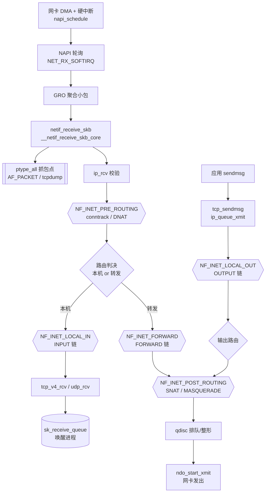
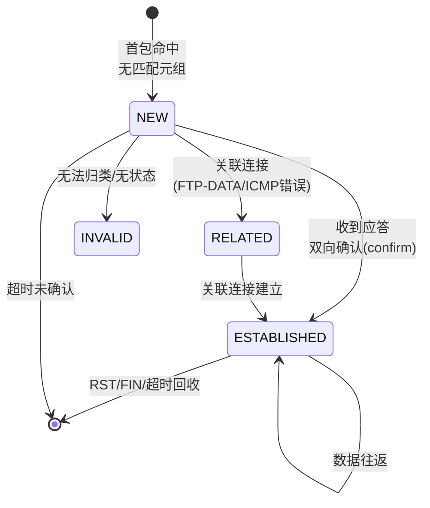

# Linux内核机制与内核利用（8）· 网络栈与netfilter
> [!abstract] TL;DR
> - `sk_buff` 是内核中报文的唯一载体：一个控制块（来自 `skbuff_head_cache`）挂着一块来自 `kmalloc-N` 通用缓存的数据缓冲区，靠 `head/data/tail/end` 四指针在缓冲区里滑动，用 `skb_push/pull/put/reserve` 无拷贝地穿上或剥掉各层协议头。
> - 收包走「网卡 IRQ → NAPI 轮询 → NET_RX_SOFTIRQ → GRO → `netif_receive_skb` → `ip_rcv` → 路由 → L4 → socket」，发包反向走「socket → L4 → `ip_output` → qdisc → `ndo_start_xmit`」；两条路径共用同一套 skb。
> - netfilter 在 IPv4/IPv6 协议路径上钉了 5 个 hook（PRE_ROUTING/LOCAL_IN/FORWARD/LOCAL_OUT/POST_ROUTING），每个 hook 按 priority 排一串 `nf_hook_ops`，回调返回 `NF_ACCEPT/DROP/STOLEN/QUEUE/REPEAT` 决定报文命运——iptables、nftables、conntrack、NAT 全部挂在这套框架上。
> - 每个网络命名空间（netns）有独立的 hook 链、conntrack 表与路由表；**非特权用户经 `unshare -Urn` 就能触达 nftables 的完整攻击面**，这是近年一大批 netfilter 提权 CVE 的共同入口。
> - 对利用者而言，skb 是顶级堆喷原语：**报文长度控大小、报文内容控数据、socket 接收队列控生命周期**，三者皆可控，配合 `cb[]` 控制块与 `skb_shared_info` 布局，是内核堆风水的常客。

## 概述与定位

Linux 网络栈是内核里代码量最大、路径最长、并发最凶的子系统之一。它的职责是把一串从网卡 DMA 进内存的原始字节，逐层解释成以太网帧、IP 包、TCP/UDP 段，最终投递到某个 socket 的接收队列；反过来，也要把应用 `write()` 下来的用户数据逐层封装、查路由、排队，交给驱动发出去。整条链路横跨**硬中断上半部、软中断下半部（NET_RX/NET_TX SOFTIRQ）、进程上下文的 socket 系统调用**三种执行环境，是理解第 6 篇「中断与软中断」和第 3 篇「系统调用」如何在一个真实子系统里协同的最佳样本。

在这条链路上，有两样东西是本篇的绝对主角。其一是 `struct sk_buff`（业内简称 skb），它是报文在内核里的**唯一货币**：从驱动收包那一刻分配，一路传递到 socket，中间所有协议层都操作同一个 skb，靠移动指针而非拷贝数据来"穿脱"协议头——这是网络栈高性能的地基。其二是 **netfilter**，Rusty Russell 在 2.4 内核引入的通用报文挂钩框架。它不是防火墙本身，而是防火墙的**地基**：它在协议路径的 5 个关键位置埋下 hook 点，任何内核模块都能注册回调，在报文流经时观察、修改、丢弃、改写或转交用户态。iptables、nftables、连接跟踪（conntrack）、NAT、透明代理、内核态负载均衡，全都是挂在这 5 个点上的"租客"。

为什么逆向与内核利用要专门啃这一篇？三条理由。**其一，攻击面巨大且可非特权触达**：netfilter/nf_tables 的配置面通过 setsockopt 与 netlink 暴露给用户态，而网络命名空间机制让非特权用户在自己的 userns+netns 里就能创建表、链、集合、规则——近五年 Linux 内核最出名的一批本地提权（CVE-2021-22555、CVE-2022-25636、CVE-2022-32250、CVE-2023-32233……）几乎清一色出自 netfilter，且多数经 `unshare -Urn` 无特权可达。**其二，skb 是一等堆喷原语**：它的数据缓冲区从 `kmalloc-N` 通用缓存分配，大小随报文长度可控、内容随报文载荷可控、生命周期随 socket 收发队列可控，是 UAF/OOB 利用中占坑、喷射、伪造对象的常客（详见第 15 篇）。**其三，netfilter hook 是经典 Rootkit 落点**：注册一个 LOCAL_IN 挂钩即可实现"魔法包"触发的后门，理解它才能检测它。

边界厘清：本篇聚焦 skb 数据结构、收发协议路径、netfilter 5 hook 及其框架（含 conntrack/NAT/iptables/nftables 概念）。**软中断与内核抢占**的机理在第 6 篇；**RCU** 如何保护 hook 链与路由表在第 7 篇；**eBPF/XDP/tc-bpf** 这条独立的可编程数据面在第 12 篇专章；**具体漏洞类型（UAF/OOB/竞态）与堆喷/提权原语**在第 14–16 篇。本篇给出的漏洞与 Rootkit 内容一律是**原理与检测视角**，不提供针对真实目标的武器化配方。

## 原理与机制

### sk_buff：报文的唯一载体

理解网络栈，先理解 skb 的双层结构。一个 skb 由**两块内存**组成：一块是 `struct sk_buff` 控制块本身（从专用 slab 缓存 `skbuff_head_cache` 分配，约 200+ 字节，字段极多且大量用 union 压缩），另一块是**线性数据缓冲区**（从 `kmalloc-N` 通用缓存分配，装真实报文字节）。控制块里最关键的四个指针 `head / data / tail / end` 全部指向那块数据缓冲区：`head` 是缓冲区起点，`end` 是终点，`data` 与 `tail` 圈出当前"有效数据"的线性区间。

这套设计的**核心动机**是零拷贝地增删协议头。收包时报文从外向内逐层解析，每剥掉一层头（如以太网头、IP 头），只需把 `data` 指针**向后推**（`skb_pull`），有效数据区就缩小，头部字节仍在缓冲区里但被"移出视野"；发包时反向，每加一层头就把 `data` **向前拉**（`skb_push`），前提是分配时预留了足够 headroom（`skb_reserve`）。追加载荷用 `skb_put` 把 `tail` 向后推。整个过程报文字节**一次都不搬**，只挪指针——这是网络栈能在万兆线速下工作的根本原因。散文视角：把 skb 想成一卷带子，`head/end` 是带盒边界，`data/tail` 是两个游标框住当前可读段；穿一层信封（协议头）就把左游标左移把信封纳入视野，拆一层就右移把它移出，带子本身从不重新誊写。

skb 还有一个逆向必知的字段 `cb[48]`——**控制缓冲区（control buffer）**。它是每层协议私有的 48 字节临时暂存，同一时刻只归当前协议层所有，层间交接时后一层可以随意覆盖。TCP 把它当 `struct tcp_skb_cb`（存 seq/end_seq/sacked 等），IP 分片、桥接各有各的用法。它在利用中常被关注：可控内容、位于 skb 控制块内、布局稳定。

### 两条路径与协议分发

收包路径（RX）的骨架是：网卡把帧 DMA 进接收环 → 触发硬中断 → 驱动的中断处理函数只做一件事：`napi_schedule` 把本设备挂进当前 CPU 的 poll 列表并**关闭该网卡的收包中断**，随后触发 `NET_RX_SOFTIRQ` → 软中断（或 `ksoftirqd`）执行 `net_rx_action`，回调驱动的 `poll()` 批量收包、构造 skb → 经 GRO 聚合后进入 `netif_receive_skb` → `__netif_receive_skb_core` 做 **ptype 分发**：先喂给所有抓包点（AF_PACKET、tcpdump），再按 `skb->protocol` 查 `ptype_base` 哈希，命中 `ETH_P_IP` 就调 `ip_rcv`。

发包路径（TX）反向：应用 `sendmsg` → `tcp_sendmsg`/`udp_sendmsg` 攒数据成 skb → `ip_queue_xmit`/`ip_output` 封 IP 头查路由 → 过 netfilter → `dev_queue_xmit` 把 skb 交给 **qdisc（排队规则/流量控制）** → 出队后调驱动 `ndo_start_xmit` → 网卡 DMA 发出。

### netfilter 的 5 个 hook 与判决

netfilter 在 IPv4（IPv6 对称）路径上钉了 5 个宏观 hook 点，位置由"报文相对本机的角色"决定：

- **NF_INET_PRE_ROUTING**：报文刚被 IP 层接手、**路由判决之前**。所有入站报文（无论最终去本机还是转发）都经过这里。DNAT、conntrack 入口挂这。
- **NF_INET_LOCAL_IN**：路由判决为"目的是本机"后、投递给 L4 之前。主机防火墙的 INPUT 链挂这。
- **NF_INET_FORWARD**：路由判决为"转发出去"的报文。路由器/网关的 FORWARD 链挂这。
- **NF_INET_LOCAL_OUT**：本机自己产生的报文，刚出 socket、进 IP 层。OUTPUT 链挂这。
- **NF_INET_POST_ROUTING**：所有即将离开本机的报文（本机产生的 + 转发的），出网卡之前。SNAT/MASQUERADE 挂这。

每个 hook 点维护一条按 `priority`（整数，越小越靠前）排序的回调链。回调即 `nf_hookfn`，返回一个**判决（verdict）**：`NF_ACCEPT`（放行，继续沿链走）、`NF_DROP`（丢弃，释放 skb）、`NF_STOLEN`（回调接管了 skb，栈不再处理，也不释放）、`NF_QUEUE`（转交用户态队列，配合 libnetfilter_queue）、`NF_REPEAT`（重新调用本回调）。协议路径靠 `NF_HOOK` 宏把"过 hook"和"过完继续"缝在一起：hook 全部返回 ACCEPT 才调用续延函数 `okfn`（这就是为什么源码里满是 `ip_rcv_finish`、`ip_local_deliver_finish` 这类 `_finish` 后缀——它们是 hook 放行后的**继续执行点**）。

## 协议路径与hook点详解

### sk_buff 完整内存布局

先把 skb 的物理布局钉死。数据缓冲区尾部还**藏着一个 `skb_shared_info`**（记录分页数据、GSO 信息与数据引用计数），它紧贴 `end` 之后，所以 `alloc_skb(size)` 实际申请的缓冲区 = `size` 对齐后 + `sizeof(skb_shared_info)`，这直接决定 skb 落进哪个 kmalloc 桶（对堆风水至关重要）：

```
   struct sk_buff  (控制块, 来自 skbuff_head_cache slab)
   ┌──────────────────────────────────────────────────────┐
   │ next/prev  sk  dev  cb[48]  len  data_len  truesize   │
   │ protocol  pkt_type  _nfct(conntrack指针)  ...          │
   │ head ─┐  data ─┐    tail ─┐        end ─┐              │
   └───────┼────────┼──────────┼────────────┼──────────────┘
           │        │          │            │
           ▼        ▼          ▼            ▼
   数据缓冲区 (来自 kmalloc-N 通用缓存, kmalloc_reserve)
   ┌─────────┬──────────────────┬──────────┬────────────────────┐
   │ headroom│  线性报文数据      │ tailroom │  skb_shared_info    │
   │ (预留头) │ (data..tail, len) │ (可追加)  │ nr_frags/frags[]/   │
   │         │                  │          │ frag_list/gso_*/    │
   │         │                  │          │ dataref (数据引用计数)│
   └─────────┴──────────────────┴──────────┴────────────────────┘
   ^head     ^data          ^tail          ^end
```

几个衍生要点，删掉上图也要能讲清：**其一**，`len` 是报文总长，`data_len` 是"非线性部分"（分页 frags + frag_list）的长度，`len - data_len` 才是 `data..tail` 这段线性长度——很多越界读的根因是把 `len` 当线性长度用。**其二**，大报文并不都塞进线性缓冲区：`skb_shared_info.frags[]` 用 `(page, offset, size)` 描述若干**分页片段**，`frag_list` 则把多个 skb 串成分片链，这样收发大包时数据可直接引用页缓存/网卡分页，避免线性大块分配。**其三**，`truesize` 记录这个 skb 真实占用的总内存，用于 socket 收发缓冲区（`sk_rcvbuf`/`sk_sndbuf`）的记账与背压——利用中控制 `truesize` 与实际占坑大小的偏差，有时能绕过配额、堆更多 skb。

### 克隆、拷贝与写时复制

`skb_shared_info.dataref` 是数据缓冲区的引用计数，撑起了 skb 的**写时复制**语义，逆向时务必分清三个操作：`skb_clone` 只复制**控制块**，两个 skb 共享同一份数据缓冲区、`dataref++`——所以克隆后**不许改数据/协议头**（tcpdump 抓包、多播分发就靠它零拷贝地"分身"）。`pskb_copy` 复制控制块 + 线性数据，但仍共享分页 frags。`skb_copy` 才是彻底深拷贝。理解这层：任何要改包的 hook（比如 NAT 改地址），若发现 skb 是共享的（`skb_shared()` 为真或 headroom 不足），必须先 `skb_cow`/`skb_unshare` 造一份可写副本——否则会踩踏别人的数据。这也是一类漏洞温床：**共享判断遗漏 → 改到被共享缓冲区**。

### 完整收包路径逐步展开

把 RX 掰开成因果链，读者不看源码也应能复述：

1. **DMA 与硬中断**：网卡把帧写入 RX 环形缓冲区，产生 MSI-X 中断。驱动中断处理函数**极短**：`napi_schedule()` 登记本设备到 CPU 的 NAPI poll 列表，`__napi_schedule` 触发 `NET_RX_SOFTIRQ`，并**屏蔽本网卡收包中断**。
2. **NAPI 轮询**：软中断上下文的 `net_rx_action` 遍历 poll 列表，调用驱动 `poll(budget)`，一次批量处理至多 `budget`（默认 64）个包，收满预算就让出、留待下轮。**为何要 NAPI？** 纯"一包一中断"在高负载下会陷入**接收活锁（receive livelock）**：CPU 全耗在中断上下半部，进程永远得不到调度、报文却排满队最终被丢。NAPI 的精髓是**高负载时自动从中断切到轮询**——有包才轮询、轮询期间关中断，把每包固定的中断开销摊薄，负载降下来再恢复中断。这是"中断缓解"的教科书实现，与第 6 篇软中断机理直接咬合。
3. **GRO 聚合**：`napi_gro_receive` 把同一流的多个连续小包在**进栈之前**合并成一个大 skb（Generic Receive Offload）。动机很实在：协议路径每包的固定开销（查路由、过 hook、锁）很贵，把 10 个包合成 1 个再进栈，就把这些开销摊薄 10 倍。
4. **进入协议无关层**：`netif_receive_skb` → `__netif_receive_skb_core`。此处先做 **ptype 抓包分发**——把 skb（克隆）交给所有注册在 `ptype_all` 的抓包 socket（AF_PACKET/tcpdump），再按 `skb->protocol` 查 `ptype_base`，把包交给 L3 handler。IPv4 的 `ip_rcv` 就是注册给 `ETH_P_IP` 的 `packet_type`。
5. **IP 层与第一个 hook**：`ip_rcv` 做完基本合法性校验（版本、校验和、长度），在末尾触发 **NF_INET_PRE_ROUTING**。放行后进 `ip_rcv_finish` → `ip_route_input` 查路由，判定"本机 or 转发"，把结果挂在 `skb->_skb_refdst`（dst_entry）上。
6. **分叉**：`dst_input` 调用路由项里的 `input` 回调——本机走 `ip_local_deliver`，转发走 `ip_forward`。前者触发 **NF_INET_LOCAL_IN** → `ip_local_deliver_finish` → 按 IP 协议号查 `inet_protos` 交给 L4（`tcp_v4_rcv`/`udp_rcv`）；后者触发 **NF_INET_FORWARD** → 减 TTL → `ip_output` → **NF_INET_POST_ROUTING** → 发出。
7. **L4 与投递**：`tcp_v4_rcv` 按四元组查 socket 哈希表，把 skb 挂进 `sk_receive_queue`，`sk_data_ready` 唤醒阻塞在 `recv` 的进程。至此报文从软中断上下文"交棒"给进程上下文。

### 完整发包路径

TX 是 RX 的镜像但少了硬件异步：`tcp_sendmsg` 在**进程上下文**把用户数据拷进 skb（受 `sk_sndbuf` 背压），`tcp_transmit_skb` 封 TCP 头 → `ip_queue_xmit` 封 IP 头查路由 → `__ip_local_out` 触发 **NF_INET_LOCAL_OUT** → `dst_output` → `ip_output` → **NF_INET_POST_ROUTING** → `ip_finish_output2` 查邻居表（ARP）填 MAC → `dev_queue_xmit`。后者把 skb 交给设备的 **qdisc**（默认 `pfifo_fast`/`fq_codel`），qdisc 负责排队、整形、优先级；出队时 `sch_direct_xmit` 调 `ndo_start_xmit` 把 skb 塞进网卡 TX 环，硬件 DMA 发出并在完成后回收 skb。TSO/GSO（分段卸载）让内核把一个巨型 skb 推到最后，由网卡或 `dev_queue_xmit` 前的 `skb_gso_segment` 才切成 MTU 大小的多个包——同样是"把每包开销摊薄"的思路。

### netfilter 框架内部：nf_hook_ops 与 nf_hook_slow

hook 不是散落的 `if`，而是一套注册表。现代内核里，每个 `(netns, 协议族 pf, hooknum)` 组合对应一个 `struct nf_hook_entries`——一段柔性数组，前半是各 hook 的 `(hookfn, priv)`，后半跟着对应 `nf_hook_ops` 指针，整段按 priority 升序排好。注册用 `nf_register_net_hook(net, ops)`，`ops` 描述 `{ hook 回调, pf, hooknum, priority }`。报文流经时，`NF_HOOK` 宏调 `nf_hook()`：**快路径**先查 `nf_hooks_needed[pf][hooknum]` 这个**静态键（static key）**——没人注册时整段代码被 patch 成空，零开销；有注册才落入 `nf_hook_slow` 遍历数组，逐个调回调、依判决决定继续/丢弃/接管。遍历期间用 RCU 保护（第 7 篇），因此增删规则不阻塞数据面。

**priority 决定了子系统的叠放顺序**，这是理解防火墙行为的关键。典型排布（PRE_ROUTING 为例）：conntrack（`NF_IP_PRI_CONNTRACK = -200`，最先，要在改包前记录原始元组）→ raw 表 → mangle（-150）→ DNAT（`NF_IP_PRI_NAT_DST = -100`）→ filter（0）→ ……。谁先谁后不是随意的：conntrack 必须最早看到原始报文，NAT 必须在 conntrack 之后、路由相关判决恰当的位置改地址。

**netns 维度**是利用面的放大器：每个网络命名空间持有**独立的** hook 链、conntrack 表、路由表、nftables 规则集。这意味着一个非特权用户 `unshare -Urn` 造出自己的 user+net 命名空间后，就在**自己的 netns 里**获得了操作 nftables/x_tables 的完整能力——无需 root。这正是 netfilter CVE 能"非特权本地提权"的结构性原因，也是为何加固时要收紧非特权 userns。

### iptables 与 nftables：两代配置面

netfilter 是地基，**iptables/nftables 是盖在上面的两代"规则语言 + 匹配引擎"**，务必分清。

**iptables（xtables）**：概念是**表（table）× 链（chain）× 规则（rule）**。5 张表 filter/nat/mangle/raw/security 各自在若干 hook 点注册回调；用户定义的规则是**线性列表**，报文到来时从头顺序匹配，每条规则 = 若干 match 模块 + 一个 target。match/target 是可加载的 `xt_*` 内核模块（`xt_tcpudp`、`xt_conntrack`、`REJECT`…）。缺点：规则线性遍历，万条规则性能差；IPv4/IPv6/ARP/桥各一套工具（iptables/ip6tables/arptables/ebtables），冗余。它经 `setsockopt(IPT_SO_SET_REPLACE)` 一次性灌入整张表——历史上多个 OOB（如 CVE-2021-22555 走的正是 `xt_compat` 32/64 位兼容层）就出在这条整表拷贝校验路径上。

**nftables（nf_tables，3.13 引入）**：用**单一框架**统一取代上述所有工具。核心是一台内核态**伪指令虚拟机**：用户态 `nft` 把规则编译成一串字节码（load/cmp/lookup/payload/meta…），内核 nf_tables VM 逐指令执行；支持**集合（set）/映射（map）/字典**做 O(1) 查表，一条 `map` 规则顶 iptables 上千条线性规则。配置走 **netlink 批量事务**（原子提交/回滚）。它还带 **flowtable（快路径卸载）**：已建立的连接可绕过完整规则求值，走软件/硬件快表。代价是 VM + 动态对象（表/链/集合/规则皆是可增删的堆对象、以 netlink 异步操作），对象生命周期复杂——这正是近年 UAF 频发之地（CVE-2022-32250、CVE-2023-32233 都是 nf_tables 集合/链对象的 UAF）。

### 连接跟踪与 NAT

**conntrack（nf_conntrack）**是有状态防火墙与 NAT 的引擎。它在 PRE_ROUTING/LOCAL_OUT 以最高优先级注册，为每条连接建立一个 `nf_conn`，用**双向元组**（原始方向 + 应答方向的 `{src ip, dst ip, src port, dst port, proto}`）做哈希，赋予状态：`NEW`（首包、无匹配）、`ESTABLISHED`（见到应答、双向确认）、`RELATED`（如 FTP 数据连接、ICMP 错误，与已有连接相关）、`INVALID`（无法归类）。skb 靠 `skb->_nfct` 指回它的 `nf_conn`。一个关键设计是**延迟确认（confirm）**：连接项在首包**离开时**（POST_ROUTING/LOCAL_IN 末尾的 `ipv4_confirm`）才正式插入确认哈希——若首包中途被丢，就不会污染 conntrack 表。

**NAT** 完全建立在 conntrack 之上：DNAT 在 PRE_ROUTING/LOCAL_OUT 改目的地址，SNAT/MASQUERADE 在 POST_ROUTING 改源地址；映射关系记在 `nf_conn` 里。**只有连接首包**真正遍历 NAT 规则并决定映射，后续包直接查 conntrack 套用同一映射——这既是性能所在，也是"连接跟踪表"成为 DoS 目标（表打满）的原因。





## 工具视角与实战

**配置与观测防火墙**：现代系统首选 `nft`——`nft list ruleset` 导出全部表/链/规则，`nft add table inet filter`、`nft add chain inet filter input '{ type filter hook input priority 0; }'` 直观地把"链"绑定到某个 hook 与 priority，比 iptables 更贴近底层模型（能一眼看出规则挂在哪个 hook）。兼容层 `iptables-nft` 让老命令跑在 nf_tables 后端。查连接跟踪用 `conntrack -L`（需 `conntrack-tools`）或 `cat /proc/net/nf_conntrack`；看 hook 是否被注册、协议统计用 `/proc/net/netfilter/` 与 `nstat`/`ss`。

**抓包与旁路**：`tcpdump`/`wireshark` 底层是 `AF_PACKET` socket，挂在 `ptype_all`，拿到的是 `netif_receive_skb` 阶段的 skb 克隆——所以它看到的是**过 netfilter 之前**的入站包与**发出前**的出站包，这解释了为何 tcpdump 看得到却被防火墙 DROP 的现象。要看更早、更快的点用 **XDP**（挂在驱动/NAPI，operate on `xdp_buff` 原始 DMA 帧，比 netfilter 快但功能弱，详见第 12 篇），或 **tc ingress/egress + cls_bpf**。

**动态追踪 skb 与 hook**：用 ftrace/kprobe 打点是逆向网络栈的利器。`bpftrace -e 'kprobe:ip_rcv { printf("%s len=%d\n", comm, ((struct sk_buff*)arg0)->len); }'` 在报文进 IP 层时打印长度；给 `nf_hook_slow`、`nft_do_chain`、`__nf_conntrack_confirm` 挂 kprobe 能观察 hook 遍历与 conntrack 确认时机。`trace-cmd record -p function_graph -g ip_rcv` 可画出从 `ip_rcv` 到 socket 的完整调用图，把上文的"路径"变成可复现的实证（呼应第 13 篇）。

**离线/崩溃态检查**：`crash` 或 `drgn` 里，`struct sk_buff` 的 `head/data/tail/end` 一读便知报文布局；顺 `sk->sk_receive_queue` 遍历排队 skb、顺 `nf_hook_entries` 数组读出每个 hook 的 `hookfn` 符号，是排查"哪个模块偷偷注册了 hook"（即 Rootkit 检测）的标准动作。逆向一个可疑内核模块时，`get_xrefs_to nf_register_net_hook` / 搜 `nf_hookfn` 签名（返回 `unsigned int`、吃 `void*priv, struct sk_buff*, const struct nf_hook_state*`）能快速定位它的挂钩回调。

**自写 hook（教学）**：一个最小 LKM 通过填 `struct nf_hook_ops { .hook=my_fn, .pf=NFPROTO_IPV4, .hooknum=NF_INET_PRE_ROUTING, .priority=NF_IP_PRI_FIRST }` 再 `nf_register_net_hook(&init_net, &ops)`，即可在每个入站包上运行 `my_fn` 并返回 `NF_ACCEPT/DROP`。这既是学习 hook 语义的最短路径，也是理解 Rootkit"魔法包后门"的基础——下一节讲清其攻防两面。

## 安全性与正确使用

> [!caution] 合规边界
> 本节涉及 netfilter 挂钩后门、skb 堆喷原语与真实 CVE，**仅用于自有/授权环境、CTF 靶场与安全研究，一律以防御、检测与教育为目的**。文中只讲**原理、可观测特征与加固**，不提供针对真实生产系统或他人系统的武器化步骤，也不为绕过任何商业授权/防护提供成品配方。在你**不拥有或未获书面授权**的系统上加载内核模块、注册挂钩、投递构造报文或运行提权 PoC，均可能违法。请在隔离虚拟机/自建靶场内实践，并对内核崩溃与数据丢失有预期。

**netfilter hook 型 Rootkit（检测视角）**。攻击者的内核模块注册一个 LOCAL_IN 或 PRE_ROUTING 挂钩，回调里检查每个入站包是否命中"魔法特征"（特定端口序列/载荷魔数/加密标记），命中则触发隐蔽动作（起反连、开后门端口、执行命令），并对触发包返回 `NF_DROP` 或 `NF_STOLEN` 让它**不进正常协议栈**、从而在 tcpdump 之后、防火墙日志之外"隐身"。这是"端口敲门（port knocking）"C2 的经典内核实现。**防御要点**：这类后门的破绽在于它必须**注册进 hook 链**——因此遍历 `nf_hook_entries` 校验每个 `hookfn` 是否属于已知模块、比对 `/proc/net/netfilter` 与内核符号、用完整性度量（第 11 篇 LSM/IMA）监控模块加载，即可发现异常挂钩。理解 hook 机制本身，就是检测它的前提。

**skb 作为堆喷原语（利用面认知）**。skb 在 UAF/OOB 利用中地位极高，因为它罕见地同时满足三个可控维度：**大小**——数据缓冲区从 `kmalloc-N` 分配，报文长度直接决定落哪个桶（记得算上尾部 `skb_shared_info` 的开销，欲落 `kmalloc-512` 需按差额缩短载荷）；**内容**——缓冲区里就是报文字节，攻击者对 payload 有近乎完全的控制，便于伪造被 UAF 释放对象的成员；**生命周期**——不 `recv` 就把 skb 长期挂在 `sk_receive_queue`，靠 `SO_RCVBUF`/回环 socket 精细控制占坑数量与释放时机。因此"喷 skb 占坑 → 触发释放 → 用 skb 数据覆盖目标对象"是标准套路。与 `msg_msg`、管道 buffer 等原语相比，skb 的优势在于**大小与内容双控且投递路径独立于目标漏洞**。具体如何把它编进利用链，属第 15 篇。

**代表性 netfilter 提权 CVE（原理概览，非配方）**：
- **CVE-2021-22555**（x_tables）：`setsockopt` 兼容层在整表拷贝时的堆越界写，可被引导去改写相邻 `msg_msg`/`m_list` 达成提权；经非特权 netns 可达，是"小越界写撬动大目标"的范式。
- **CVE-2022-25636**（nf_dup_netdev/nft_fwd）：硬件卸载路径下的数组越界写，源于对转发出口数量的错误假设。
- **CVE-2022-32250 / CVE-2023-32233**（nf_tables）：集合/链等动态对象在 netlink 事务下的**释放后使用**——事务提交/回滚与对象引用计数的竞态，是 nf_tables"对象生命周期复杂"这一结构性代价的直接体现，且均经 `unshare -Urn` 无特权触达。
- **CVE-2022-1015**（nf_tables 寄存器）：VM 寄存器边界校验缺陷导致的越界。

这些漏洞的共同教训有二：其一，**攻击面来自可编程性**——nf_tables 的 VM 与动态对象带来灵活也带来复杂状态机，UAF/OOB 随之而来；其二，**非特权 userns 是放大器**——它让上述内核代码对普通用户可达。**加固落点**因此清晰：收紧非特权用户命名空间（`sysctl kernel.unprivileged_userns_clone=0` 或 `user.max_user_namespaces=0`）、用 seccomp 过滤 `unshare/clone` 的 `CLONE_NEWUSER|CLONE_NEWNET`、开启 `CONFIG_STATIC_USERMODEHELPER`/lockdown、及时打补丁；而 KASLR/SMEP/SMAP/KPTI 这层通用缓解如何抬高利用成本，见第 17 篇与 [[34.现代二进制防护机制/15.内核防护与kCFI]]。

## 小结

网络栈把"一串字节"变成"投递到 socket 的报文"，靠的是 `sk_buff` 这个双层结构——控制块加可滑动的数据缓冲区，用 `head/data/tail/end` 四指针零拷贝地穿脱协议头；`skb_shared_info` 承载分页与写时复制，`dataref`/`skb_clone` 撑起零拷贝分身。收发两条路径横跨硬中断、软中断（NAPI + GRO/GSO）与进程上下文三种环境，是第 6 篇软中断机理的最佳落地。netfilter 在协议路径上钉下 5 个 hook，用按 priority 排序的 `nf_hook_ops` 链 + 静态键快路径 + RCU 保护，承载了 iptables/nftables/conntrack/NAT 全家桶；每个 netns 独立成套，是理解容器网络与非特权攻击面的钥匙。对逆向与利用而言，skb 的三重可控性使其成为顶级堆喷原语，而 nf_tables 的可编程性与非特权 userns 的可达性，共同解释了近年 netfilter 提权 CVE 的密集出现——理解机制，既为攻，更为守。

## 相关阅读

- 同系列 · 前后章：[[00.Linux内核机制与内核利用总览|系列总览]] · [[07.内核同步：自旋锁与RCU]]（hook 链与路由表的 RCU 保护）· [[09.内核模块与LKM开发]]（注册 netfilter hook 的载体）· [[12.eBPF架构与验证器]]（XDP/tc 可编程数据面）· [[06.中断与软中断与内核抢占]]（NAPI 与 NET_RX_SOFTIRQ）
- 同系列 · 利用链：[[14.内核漏洞类型：UAF与OOB与竞态]] · [[15.内核利用原语与堆喷]]（skb 喷射）· [[16.内核提权：ret2usr与ROP与pt_regs]] · [[17.绕过内核防护：KASLR与SMEP与SMAP与KPTI]]
- Windows 对称参照：[[38.Windows内核与驱动逆向/13.内核漏洞与利用基础]] · [[38.Windows内核与驱动逆向/26.内核池风水与利用]]
- 防护与启动呼应：[[34.现代二进制防护机制/15.内核防护与kCFI]] · [[15.操作系统加载与启动/10.系统调用机制]] · [[15.操作系统加载与启动/11.init与systemd启动]]
- Fuzzing 呼应：[[49.Fuzzing与漏洞挖掘/14.内核与驱动Fuzzing：syzkaller]] · [[18.内核Fuzzing与syzkaller]]
- 官方文档 / 权威书目：内核源码 `Documentation/networking/`（尤其 `netdev-features`、`scaling.rst`）· netfilter.org 官方文档（Netfilter Hacking HOWTO、nftables wiki）· RFC 791（IP）/ RFC 793 · RFC 9293（TCP）· 《Understanding Linux Network Internals》(Christian Benvenuti) · 《Linux Kernel Networking: Implementation and Theory》(Rami Rosen)

[[00.Linux内核机制与内核利用总览|⬆ 系列总览]] | [[07.内核同步：自旋锁与RCU|← 上一章]] | [[09.内核模块与LKM开发|→ 下一章]]