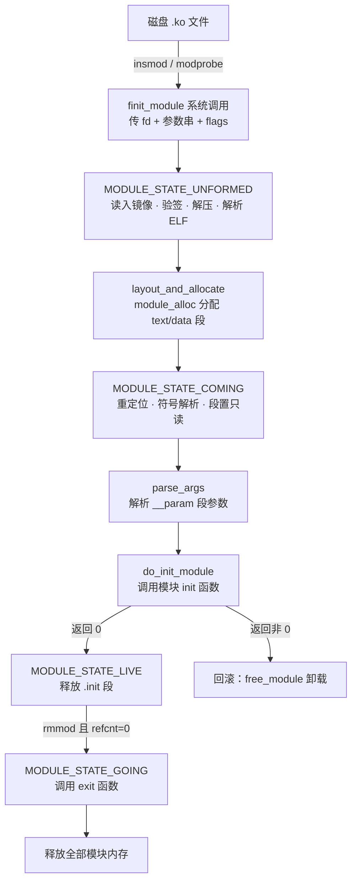
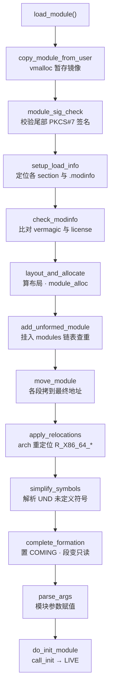
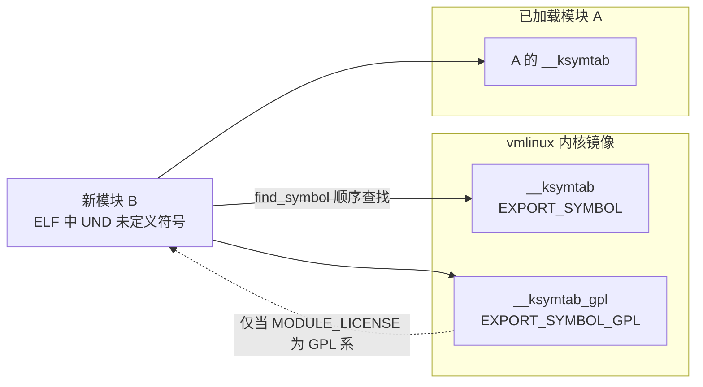

# Linux内核机制与内核利用（9）· 内核模块与LKM开发
> [!abstract] TL;DR
> - LKM 本质是一份**可重定位 ELF**（`.ko`），经 `finit_module` 进内核后由 `load_module()` 走「读镜像→验签→解压→解析 ELF→分配内存→重定位→符号解析→段置只读→解析参数→调 `init`」十余步流水线；`init` 返回非 0 会触发**整体回滚**，模块像从没加载过一样被销毁。
> - 符号导出靠 `EXPORT_SYMBOL` / `EXPORT_SYMBOL_GPL` 在 `__ksymtab` / `__ksymtab_gpl` 建表，`find_symbol()` 按「内核镜像→已加载模块」顺序解析未定义符号；**GPL 符号对非 GPL 模块不可见**，加载非 GPL 模块还会给内核打上 `P` 污点。
> - modversions（每个符号类型签名的 **CRC**）与 vermagic（内核版本 / SMP / preempt / 编译器串）是两道 ABI 护栏，任一不匹配即拒载——这正是「换了内核就必须重编模块」的根因。
> - `module_param()` 把参数登记进 `__param` 段，加载时 `insmod foo.ko x=1` 赋值；权限位非 0 还会在 `/sys/module/<mod>/parameters/` 暴露可读写的 sysfs 节点，内核 cmdline 上则以 `foo.x=1` 形式给 built-in 传参。
> - 能加载模块 ≈ 拿到 **ring 0 任意代码执行**，`CAP_SYS_MODULE` 约等于「root++」；**模块签名强制**（`MODULE_SIG_FORCE`）+ **lockdown** 是主要防线，绝大多数 LKM rootkit 与内核 CTF 题都以本篇讲的加载机制为载体。

## 概述与定位

**可加载内核模块（Loadable Kernel Module, LKM）** 是 Linux 单体内核（monolithic kernel）为了兼顾「单体的高性能」与「微内核的可插拔」而做出的工程折中：内核仍然运行在同一个地址空间、同一特权级（ring 0），但允许把一部分代码——设备驱动、文件系统、网络协议、加密算法——编译成独立的 `.ko` 文件，在**运行时按需装进内核、用完卸载**。这样既不必把所有硬件驱动都静态编进 `vmlinux` 撑大体积、拖慢启动，又能让发行版只发一个通用内核、把海量驱动做成模块随用随取。

理解模块，先要分清三种编译取向：`CONFIG_FOO=y`（**built-in**，静态编进内核镜像，开机即在）、`=m`（**module**，编成 `.ko` 单独加载）、`=n`（不编）。二者的深层差别不只是「时机」：built-in 代码位于内核正文的连续地址、其 `__init` 段在 `free_initmem()` 后统一回收；而模块运行在 `module_alloc()` 从专门的**模块地址区间**（x86-64 上 `MODULES_VADDR..MODULES_END`）分配的 vmalloc 内存里，有独立的引用计数、独立的生命周期、独立的符号表。选 built-in 还是 module 是有讲究的：**根文件系统所在的存储/文件系统驱动**若做成模块，就必须提前塞进 initramfs，否则内核挂不上根、根本读不到那个 `.ko`——这是「先有鸡还是先有蛋」的经典约束。反过来，很少用、耗内存、或需要热插拔（如 USB 驱动、`nvidia.ko` 这类外部模块）的东西天然适合做模块。

从历史看，模块的自动加载经历了 `kerneld`（用户态守护进程，靠 IPC 通知）→ `kmod`（内核线程直接 `exec` modprobe）→ 今天的 `request_module()` + uevent/`modprobe` 用户态回调。这条演进线的核心矛盾始终是：**内核何时、以何种权限、替谁去把一个模块从磁盘塞进自己的地址空间**——而这恰恰是本篇既讲「怎么开发」又讲「为何是攻击面」的原因。

在本系列的坐标里，本篇是承上启下的枢纽。它把前面 [[05.VFS与文件系统层|VFS]]、[[08.网络栈与netfilter|网络栈]] 里「注册一个 `file_operations` / `nf_hook`」的能力落到「一个可加载单元」上；又为后续 [[10.字符设备与ioctl攻击面|字符设备与 ioctl]]（模块最常见的攻击面载体）、[[14.内核漏洞类型：UAF与OOB与竞态|漏洞类型]]、[[15.内核利用原语与堆喷|利用原语]] 铺路——因为**几乎所有内核 CTF 题都以一个存在漏洞的 `.ko` 作为靶标，几乎所有持久化 rootkit 都以 LKM 作为进内核的入口**。看懂加载流程，才能看懂「攻击者拿到 root 后如何把恶意代码变成内核的一部分」，以及「防守方如何用签名与 lockdown 把这扇门焊死」。

## 原理与机制

### .ko 就是一份可重定位 ELF

用 `readelf -h hello.ko` 看，`Type:` 是 `REL (Relocatable file)`——和 `.o` 目标文件同类，而非可执行文件或共享库。它没有程序头（program header）、没有加载地址，因为**最终加载地址在运行时才由内核决定**，所有对外部符号和内部段的引用都以**重定位项（relocation）** 的形式悬而未决，等 `load_module()` 填。除了常规的 `.text` / `.data` / `.bss`，模块 ELF 里有几个内核专属的关键 section，是整台机器的「元数据骨架」：

| Section | 作用 |
|---|---|
| `.modinfo` | 存 `MODULE_LICENSE` / `MODULE_AUTHOR` / `vermagic` / `parm` 等键值对，`modinfo` 命令读的就是它 |
| `__versions` | modversions 开启时，存每个依赖符号的 **CRC** |
| `__ksymtab` / `__ksymtab_gpl` | 本模块**导出**给别人用的符号表 |
| `__param` | 本模块声明的**参数**描述符数组 |
| `.gnu.linkonce.this_module` | 一个 `struct module` 实例，是内核认识这个模块的「身份证」 |
| `.init.text` / `.exit.text` | `__init` / `__exit` 标记的函数，用后即弃或专供卸载 |

### 生命周期：init / exit 与 `__init` / `__exit` 的深意

一个最小模块靠两个宏挂钩生命周期：`module_init(fn)` 登记加载入口，`module_exit(fn)` 登记卸载出口。函数前的 `__init` / `__exit` 标记不是装饰，而是**段放置指令**：`__init` 把函数编入 `.init.text`，模块 `init` 跑完后这段内存**立即被释放**（省常驻内存）；`__exit` 把函数编入 `.exit.text`，只有在「支持模块卸载」时才保留，否则连编都不编进去。这套设计的 why 很清晰——内核对每一页常驻内存都吝啬，凡是「只用一次」或「可能永不用」的代码都要能回收。对应地，全局变量用 `__initdata` / `__exitdata` 标记也是同理。

`init` 函数的返回值语义极其严格：**返回 0 表示成功，返回负 errno 表示失败**。一旦失败，内核认为这次加载从未发生，会回滚已做的一切（下一节详解）。这与用户态「构造函数半途失败还残留半个对象」完全不同——内核不容忍「加载了一半的模块」。

### struct module 与状态机

每个模块在内核里对应一个 `struct module`，它记录 `name`、`state`、模块内存布局、导出符号表指针（`syms`/`num_syms`、`gpl_syms`）、参数数组（`kp`/`num_kp`）、`init`/`exit` 函数指针、引用计数、污点等。模块在其一生中走过一台状态机：



`UNFORMED` 是「已占名、尚未成形」的中间态，专门用来在并发加载同名模块时**抢占式查重**；`COMING` 表示骨架已就绪、正在初始化；`LIVE` 是正常服役；`GOING` 是卸载途中。状态字段配合锁，保证「一个模块同名只能存在一个」「正在卸载的模块不能被 `try_module_get`」。

### 引用计数：为什么 `rmmod` 会说 "Module is in use"

模块可被别的模块或子系统「引用」——例如一个文件系统模块正被挂载、一个驱动正被打开的设备节点占用。内核用引用计数管理：`try_module_get(mod)` 尝试加一（若模块正在 `GOING` 则失败，避免竞态卸载），`module_put(mod)` 减一。`lsmod` 里 "Used by" 那一列的数字和名字，就是这个计数与「谁在用我」的链表。只要计数不为 0，`rmmod` 就拒绝卸载；除非内核开了 `CONFIG_MODULE_FORCE_UNLOAD` 且用 `rmmod -f` 强拆——那是**极其危险**的操作，等于在别人正引用一段代码时把它从地址空间抽走，几乎必崩。

### 污点（taint）：内核的「免责声明」

加载某些模块会给内核打**污点标记**，`/proc/sys/kernel/tainted` 与 dmesg 里可见：`P`（`TAINT_PROPRIETARY_MODULE`，非 GPL 模块）、`O`（`TAINT_OOT_MODULE`，树外模块）、`F`（`TAINT_FORCED_MODULE`，强制加载）、`E`（`TAINT_UNSIGNED_MODULE`，未签名模块）。污点不是错误，而是**社区维护者的自我保护**：一旦内核被非官方代码「污染」，上游对随后的崩溃概不背书。逆向与应急响应时，污点位是判断「这台机器是否被塞过可疑模块」的第一手线索。

## load_module 全流程与符号 / 参数详解

这一节把「加载」这个动词彻底拆开——它是整篇的核心，因为无论开发调试、逆向分析还是漏洞利用，都绕不开 `load_module()` 这条流水线（现代内核在 `kernel/module/main.c`，5.12 之前是单文件 `kernel/module.c`）。

### 入口：init_module 与 finit_module 两个系统调用

有两条进内核的系统调用。老的 `init_module(void *image, unsigned long len, const char *params)` 要求**用户态先把整个 `.ko` 读进内存再整块拷进内核**。新的 `finit_module(int fd, const char *params, int flags)`（3.8 引入）改为**传一个文件描述符**，让内核自己去读文件。后者才是今天 `insmod`/`modprobe` 的默认路径，原因很实在：内核直接持有 fd，才能对**同一个文件**做完整性度量（IMA）、签名校验、以及基于文件的策略判断，避免「用户态给内核看 A、实际加载 B」的 TOCTOU。`flags` 支持 `MODULE_INIT_IGNORE_MODVERSIONS`、`MODULE_INIT_IGNORE_VERMAGIC`（强制加载时放宽校验），以及 5.17 起的 `MODULE_INIT_COMPRESSED_FILE`（让内核直接吃压缩模块）。

### 流水线逐步拆解



**① 读入与验签。** `copy_module_from_user()` 用 `vmalloc` 开一块暂存区把镜像读进来；随后 `module_sig_check()` 检查文件尾部是否附着签名。签名格式是 `.ko` 末尾追加一段 **PKCS#7**，再跟一个固定魔术串 `~Module signature appended~\n` 和长度信息；公钥来自内核构建期烧进的 `.builtin_trusted_keys` 等 keyring。若开了 `CONFIG_MODULE_SIG_FORCE`（或运行时 `module.sig_enforce=1`），验签失败直接 `-EKEYREJECTED` 拒载；否则只是打 `E` 污点。

**② 解析 ELF 与元数据。** `setup_load_info()` 逐个 section 校验、定位 `.modinfo`、`__versions`、符号表、字符串表、`.gnu.linkonce.this_module` 的偏移，把它们缓存进一个 `struct load_info`。`check_modinfo()` 从 `.modinfo` 取出 **vermagic** 与 **license** 做闸门校验（下详）。

**③ 分配内存与地址约束。** `layout_and_allocate()` 计算模块各段的对齐布局，把「常驻段」（正文、数据、只读数据）与「一次性 `.init` 段」分区，再调 `module_alloc()` 真正分配。这里有个**逆向者必须懂的架构约束**：x86-64 的模块内存必须落在 `MODULES_VADDR..MODULES_END` 这个紧挨内核正文的区间。为什么？因为模块里对内核符号的调用大量使用 `R_X86_64_PC32` / `R_X86_64_PLT32` 这类**±2GB 相对寻址**重定位，只有把模块放在离内核正文 2GB 以内，32 位偏移才装得下。这也解释了 KASLR 下模块基址与内核基址的关联性（细节见 [[17.绕过内核防护：KASLR与SMEP与SMAP与KPTI|KASLR 篇]]）。现代内核（5.8+）把布局重构为 `struct module_memory mem[]` 数组，细分 `MOD_TEXT` / `MOD_DATA` / `MOD_RODATA` / `MOD_RO_AFTER_INIT` / `MOD_INIT_TEXT` 等类型，为的是给不同段施加不同的 RO/RX 保护。

**④ 查重与搬运。** `add_unformed_module()` 以 `UNFORMED` 态把模块挂进全局 `modules` 链表，同名即报 `-EEXIST`。`move_module()` 把各 section 从暂存区拷到 `module_alloc` 的最终地址。

**⑤ 重定位。** `apply_relocations()` 遍历每个 `RELA` 段，按重定位类型回填地址：`R_X86_64_64`（填 64 位绝对地址）、`R_X86_64_PC32`/`PLT32`（填相对偏移）、`R_X86_64_32S`（32 位符号扩展）等，实现在架构相关的 `apply_relocate_add()`。这一步把「悬而未决的引用」变成「真实地址」，是 ELF 可重定位性的兑现。

### 符号解析：EXPORT_SYMBOL 的机器真相

**⑥ 解析未定义符号。** `simplify_symbols()` 遍历模块符号表，对每个 `SHN_UNDEF`（未定义）符号调 `find_symbol()` 去内核与已加载模块里找它的地址。能被找到的前提是——那个符号**被显式导出**了。内核用两个宏导出：

```c
EXPORT_SYMBOL(foo);      /* 任何模块可用 */
EXPORT_SYMBOL_GPL(bar);  /* 仅 GPL 系模块可用 */
```

其机器真相是：宏在 `__ksymtab`（或 `__ksymtab_gpl`）section 里放一个 `struct kernel_symbol`，把符号名、地址（4.19 起在支持 PREL32 重定位的架构上改存**相对偏移**而非绝对指针，既省一半空间又免去启动期重定位）、以及命名空间登记进去。`find_symbol()` 的查找顺序是「先内核镜像的 ksymtab，再逐个已加载模块的 ksymtab」。



**GPL 隔离**在这里落地：若一个符号在 `__ksymtab_gpl`，而请求方模块的 `MODULE_LICENSE` 不是 `GPL`/`GPL v2`/`Dual BSD/GPL` 等 GPL 兼容值，`find_symbol()` 就当作「找不到」，加载报 `Unknown symbol ... (err -2)`。这不是技术限制而是**许可证意图的技术化表达**：内核开发者用它把「只想让自由软件用」的接口圈起来。逆向闭源驱动时，常见「厂商为了用某个 GPL-only 接口而声明假 `MODULE_LICENSE("GPL")`」的灰色操作，就是钻这个纯字符串校验的空子。5.4 起还引入**符号命名空间**（`EXPORT_SYMBOL_NS`），模块须 `MODULE_IMPORT_NS(NS)` 显式声明才能用，进一步细化了「谁能用哪组内部 API」的边界。

模块自己也能导出符号供后加载的模块使用——这就是模块间依赖的由来。`depmod` 扫描所有 `.ko`，根据「谁导出、谁引用」算出依赖图写进 `modules.dep`，`modprobe` 据此先加载被依赖者。

### modversions 与 vermagic：两道 ABI 护栏

Linux 内核**不承诺稳定的内核内 ABI**，函数原型、结构体布局随版本变。为防止「用旧模块配新内核」导致的结构体错位式内存踩踏，有两道校验：

- **vermagic**：一个字符串，含内核版本、是否 SMP、是否 PREEMPT、是否支持模块卸载、编译器版本等。存于 `.modinfo`。加载时 `check_modinfo()` 逐字比对，不符即 "version magic ... should be ..." 拒载。它防的是「大方向不兼容」。
- **modversions（CONFIG_MODVERSIONS）**：更细。构建期用 `genksyms` 为每个导出符号，根据其**完整类型签名**（返回值、参数、涉及的结构体成员）算一个 **CRC**，存进 `__versions`（现代内核放在符号表旁）。加载时 `check_version()` 拿模块记的 CRC 和内核当前该符号的 CRC 比，不符即 "disagrees about version of symbol"。它防的是「函数签名或结构体悄悄变了」。

这两道闸就是「换个内核就得重编模块」「别人的 `.ko` 拿来 `insmod` 报 Invalid module format」的根本原因。理解它，才知道 `--force-vermagic` / `MODULE_INIT_IGNORE_*` 为何是「关掉安全气囊」的高危选项。

### 参数：module_param 的登记与暴露

**⑦ 解析参数。** `parse_args()` 把加载命令里 `key=value` 形式的参数逐个赋给模块变量。参数用宏声明：

```c
static int count = 1;
module_param(count, int, 0644);
MODULE_PARM_DESC(count, "重试次数");

static char *name = "anon";
module_param(name, charp, 0644);        /* 字符串指针 */

static int arr[8]; static int arr_n;
module_param_array(arr, int, &arr_n, 0644);   /* 数组 */
```

`module_param(name, type, perm)` 干了两件事：在 `__param` 段放一个 `struct kernel_param` 描述符（记变量地址、类型对应的 set/get 回调、权限位），并让加载器能按 type 解析文本。支持的类型有 `byte`/`short`/`ushort`/`int`/`uint`/`long`/`ulong`/`charp`/`bool`/`invbool`，以及数组与定长字符串变体。**权限位 perm 是关键**：非 0 时，内核在 `/sys/module/<模块名>/parameters/<参数名>` 建一个 sysfs 文件，权限即 perm——`0644` 意味着 root 可运行时读写这个参数（对 `charp`/数组要小心并发与生命周期）；`0` 则不建 sysfs 节点、只能加载时给一次。对 built-in 代码，同样的参数在**内核 cmdline** 上以 `模块名.参数名=值` 传入（如 `usbcore.autosuspend=-1`）。`MODULE_PARM_DESC` 只是给 `modinfo` 看的文档字符串，不影响逻辑。

### 收尾：do_init_module 与回滚语义

**⑧ 初始化与定型。** `complete_formation()` 把状态推到 `COMING`、给正文段加上 RO/RX 保护；`do_init_module()` 真正调用模块 `init`。成功（返回 0）则转 `LIVE`，并**释放 `.init` 段**——那些 `__init` 函数的内存就此归还。失败则一路回滚：从链表摘除、释放内存、状态清零，对外表现为 `insmod` 报错而系统毫发无损。这套「要么完整上线、要么彻底消失」的事务性，是内核稳定性的基石。

### 自动加载：便利与攻击面的一体两面

`request_module()` 让内核在需要某能力时**主动触发用户态 `modprobe`** 去加载模块。配合 `MODULE_ALIAS` / `MODULE_DEVICE_TABLE` 生成的 `modules.alias`，内核可以「按需拉起驱动」：插入一张网卡、`socket(AF_XXX)` 引用一个未加载的协议族、`mount -t somefs` 引用一个文件系统……都会触发对应模块自动加载。**便利的另一面是攻击面**：历史上多次出现「非特权用户通过一个普通系统调用（如指定冷门协议族、冷门文件系统）诱导内核自动加载一个存在漏洞的模块」，把「本需 root 才能触碰的代码」暴露给普通用户。这类问题的缓解包括收紧可自动加载的别名、`modules_disabled` sysctl 等。

## 工具视角与实战

### 最小可用模块 + Kbuild

```c
// hello.c
#include <linux/module.h>
#include <linux/init.h>
static int __init hello_init(void){ pr_info("hello: loaded\n"); return 0; }
static void __exit hello_exit(void){ pr_info("hello: bye\n"); }
module_init(hello_init);
module_exit(hello_exit);
MODULE_LICENSE("GPL");
MODULE_AUTHOR("you");
MODULE_DESCRIPTION("demo");
```

```makefile
# Makefile
obj-m += hello.o
KDIR := /lib/modules/$(shell uname -r)/build
all:   ; $(MAKE) -C $(KDIR) M=$(PWD) modules
clean: ; $(MAKE) -C $(KDIR) M=$(PWD) clean
```

要点解释：`obj-m += hello.o` 告诉 **Kbuild**「把 `hello.o` 链成模块」。构建时不是直接编，而是 `-C` 进内核的构建树、`M=$(PWD)` 让内核 Makefile 回到你的目录处理 `obj-m`。为什么绕这么一圈？因为模块必须**用目标内核完全相同的头文件、配置、编译器选项**编译，vermagic/modversions 才能对得上——这是「out-of-tree 模块必须对着 `/lib/modules/$(uname -r)/build` 编」的原因。构建产物除了 `hello.ko`，还有 `hello.mod.c`（自动生成，含 `struct module`、vermagic、依赖符号 CRC）。

### 核心命令与观测面

| 命令 / 路径 | 用途 |
|---|---|
| `insmod hello.ko count=3` | 直接加载单个 `.ko` 并传参（不解析依赖） |
| `modprobe hello count=3` | 从 `/lib/modules` 按名加载，**自动解析依赖** |
| `rmmod hello` / `modprobe -r` | 卸载 |
| `lsmod` / `cat /proc/modules` | 列出已加载模块、大小、引用计数与「被谁用」 |
| `modinfo hello.ko` | 看 license/author/vermagic/`parm`/`depends`/`sig` 等元数据 |
| `depmod -a` | 重建 `modules.dep` / `modules.alias` 依赖与别名索引 |
| `/sys/module/<mod>/` | 运行时视图：`parameters/`（参数）、`sections/`（各段基址）、`refcnt`、`taint` |

实战里，`/sys/module/<mod>/sections/.text` 给出模块正文的**运行时基址**，是 gdb 加载模块符号（`add-symbol-file`）或分析 rootkit 时定位代码的起点。运行时改参数：`echo 5 > /sys/module/hello/parameters/count`（前提是声明时 perm 给了写位）。看内核污点：`cat /proc/sys/kernel/tainted` 配合内核文档解码字母含义。

### 签名与压缩

给模块签名（自有 CI/自签环境）：

```bash
/usr/src/linux/scripts/sign-file sha256 MOK.priv MOK.der hello.ko
```

它把 PKCS#7 签名附到 `.ko` 尾部。开了 Secure Boot + lockdown 的机器只接受可信 keyring 能验证的签名，自签模块需先把公钥注册进 MOK（Machine Owner Key）。现代发行版还常开**模块压缩**（`CONFIG_MODULE_COMPRESS_ZSTD/XZ/GZIP`），`.ko.zst` 由 `finit_module` 的 `COMPRESSED_FILE` 标志让内核直接解压加载，省磁盘也省内存缓存。

### 调试手法

`printk`/`pr_info` 走 `dmesg` 是最朴素的手段；`pr_debug` 配合 **dynamic debug**（`/sys/kernel/debug/dynamic_debug/control`）可运行时按文件/行开关日志，不必重编。崩溃时看 oops 里的 `RIP: ...[hello]` 与栈回溯里的 `模块名+偏移`；用 `gdb vmlinux` + `lx-symbols`（内核自带 gdb 脚本）能自动加载各模块符号做源码级调试。更重的问题上 kgdb/kdump——留待 [[13.内核调试：kgdb与ftrace与crash|内核调试篇]] 详述。

## 安全性与正确使用

> [!caution] 合规边界（务必先读）
> 本篇涉及的 LKM rootkit 技术、符号劫持、加载器绕过等内容，**仅用于自有设备、获得书面授权的测试环境、CTF 靶场与防御 / 检测研究**。加载内核模块等于获得 ring 0 任意代码执行，对不属于你、或未获授权的系统实施任何此类操作，均可能触犯《网络安全法》《刑法》等法律。以下一律以**防御、检测、教育**视角陈述原理，**不提供**针对真实生产系统或他人系统的武器化脚本、不为绕过厂商签名 / 商业授权提供成品配方。原理讲透，是为了让防守方看懂攻击者在做什么、从而更好地设防。

### 为什么「能加载模块」是终极权限

模块与内核共享地址空间、共享 ring 0 特权，没有进程边界、没有系统调用检查。因此**能加载一个任意模块，就等于能在内核里执行任意代码**——它绕过一切用户态防护、可读写任意内核内存、可改任意函数指针。`CAP_SYS_MODULE` 这个 capability 因而是「root 之上」的存在：即便你用 seccomp、namespace 把一个 root 进程关起来，只要它还留着 `CAP_SYS_MODULE`，逃逸就是一条 `finit_module` 的距离。这也是容器默认 drop 掉 `CAP_SYS_MODULE` 的原因。

### 攻击者视角：LKM 作为持久化与隐藏载体（防御向概述）

攻击者拿到 root 后，常把恶意逻辑做成模块以求**持久化与隐蔽**。经典思路（此处仅作检测知识，不展开可运行细节）：

- **函数劫持**：早期直接改 `sys_call_table` 里的函数指针（劫持系统调用）；随着表被置只读、地址被 KASLR 隐藏，转向更「干净」的 **ftrace 钩子**——用内核自带的 `ftrace` 框架在目标函数入口挂自己的处理，既稳定又不改代码页。检测面：核对关键函数是否被 ftrace 附着、`sys_call_table` 项是否指向模块地址区间。
- **自我隐藏**：把自己的 `struct module` 从全局 `modules` 链表 `list_del`、从 `/sys/module` 摘除，使 `lsmod` 看不见自己。检测面：**交叉比对**多个信息源——`/proc/modules`、`/sys/module/` 目录、`kallsyms`、以及扫描模块内存区间——彼此不一致往往就是隐藏模块的破绽。
- **痕迹擦除**：清污点位、伪造 vermagic。检测面：结合基线快照与完整性度量（IMA）。

（具体的 ioctl 攻击面与内存破坏原语，属于 [[10.字符设备与ioctl攻击面|下一篇]] 与 [[14.内核漏洞类型：UAF与OOB与竞态|漏洞类型篇]] 的范畴，此处不展开。）

### 防守视角：把这扇门焊死

- **签名强制**：`CONFIG_MODULE_SIG_FORCE` 或 `module.sig_enforce=1`，内核只加载可信密钥签过的模块；配合 Secure Boot 与 `.builtin_trusted_keys` 形成从固件到内核的信任链。
- **lockdown LSM**：`lockdown=integrity/confidentiality` 关掉一切「用户态往内核塞代码/读内核内存」的旁路（`/dev/mem`、未签名模块、kexec、部分 BPF 等）；integrity 模式下未签名模块直接被拒。细节见 [[11.LSM与SELinux与AppArmor|LSM 篇]] 与 [[34.现代二进制防护机制/15.内核防护与kCFI|内核防护与 kCFI]]。
- **彻底禁用**：安全敏感场景可 `CONFIG_MODULES=n`（内核完全不支持模块，全部功能 built-in），或运行时一次性写 `sysctl kernel.modules_disabled=1` 关闭后续所有模块操作（该开关只能置 1、重启才复位）。
- **收敛自动加载**：限制非特权用户可触发的模块别名，降低「一个系统调用诱发加载漏洞模块」的风险。
- **监控与取证**：以污点位、`/proc/modules` 与 `/sys/module` 一致性、关键函数完整性作为**入侵检测信号**；这也正是 Windows 侧驱动加载防护（对称参考：[[38.Windows内核与驱动逆向/13.内核漏洞与利用基础]]、[[38.Windows内核与驱动逆向/26.内核池风水与利用]]）背后同构的思路。

正当研究应始终在授权靶场、快照可回滚的虚拟机内进行；把「原理理解」与「对真实目标的攻击」严格分开，是这条学习路径的底线。

## 小结

- **LKM = 可重定位 ELF + 一套运行时链接器**。`.ko` 里的未定义符号、内部段引用都以重定位项悬着，`load_module()` 就是内核里的「动态链接器」，把它们在运行时补全并装进 ring 0。
- **加载是一条事务性流水线**：读镜像→验签→解析 ELF→查 vermagic/CRC→分配内存→搬运→重定位→符号解析→段置只读→解析参数→调 `init`；`init` 返回非 0 即整体回滚，杜绝「半个模块」。
- **符号导出用许可证圈边界**：`EXPORT_SYMBOL` 对所有模块开放，`EXPORT_SYMBOL_GPL` 只对 GPL 系模块可见，命名空间进一步细分——这是纯字符串/表结构层面的机制，也因此可被灰色规避。
- **modversions（符号 CRC）+ vermagic（版本串）** 是两道 ABI 护栏，解释了「换内核必须重编」；`module_param` 把参数登记进 `__param` 段并可经 sysfs/cmdline 暴露。
- **安全上，能加载模块即等价于完全接管内核**：`CAP_SYS_MODULE` 是「root++」，LKM 是 rootkit 与内核 CTF 的通用载体；签名强制 + lockdown + 禁用模块 + 一致性监控构成纵深防线。

## 相关阅读

- 本系列上下游：[[08.网络栈与netfilter|← 网络栈与 netfilter]]、[[10.字符设备与ioctl攻击面|字符设备与 ioctl 攻击面 →]]、[[04.虚拟内存：伙伴系统与slab与slub|虚拟内存：module_alloc 背后的分配器]]、[[17.绕过内核防护：KASLR与SMEP与SMAP与KPTI|KASLR 与模块地址]]、[[13.内核调试：kgdb与ftrace与crash|内核调试：ftrace 钩子与符号加载]]
- 防护呼应：[[11.LSM与SELinux与AppArmor|LSM 与 lockdown]]、[[34.现代二进制防护机制/15.内核防护与kCFI|内核防护与 kCFI（KASLR/SMEP/SMAP/KPTI）]]
- Windows 对称：[[38.Windows内核与驱动逆向/13.内核漏洞与利用基础|Windows 内核漏洞与利用基础]]、[[38.Windows内核与驱动逆向/26.内核池风水与利用|Windows 内核池风水与利用]]
- 启动前置：[[15.操作系统加载与启动/10.系统调用机制|系统调用机制]]、[[15.操作系统加载与启动/11.init与systemd启动|init 与 systemd 启动]]
- Fuzzing 呼应：[[49.Fuzzing与漏洞挖掘/14.内核与驱动Fuzzing：syzkaller|内核与驱动 Fuzzing：syzkaller]]、[[18.内核Fuzzing与syzkaller|本系列 syzkaller 篇]]
- 官方文档 / 书目：内核源码树 `Documentation/kbuild/modules.rst`、`Documentation/admin-guide/module-signing.rst`；`kernel/module/main.c`（`load_module` 实现）；《Linux Device Drivers, 3rd Edition》（LDD3）第 2 章；《Linux Kernel Development》(Robert Love) 模块相关章节；The Linux Kernel Module Programming Guide (TLDP)

[[00.Linux内核机制与内核利用总览|⬆ 系列总览]] | [[08.网络栈与netfilter|← 上一章]] | [[10.字符设备与ioctl攻击面|→ 下一章]]