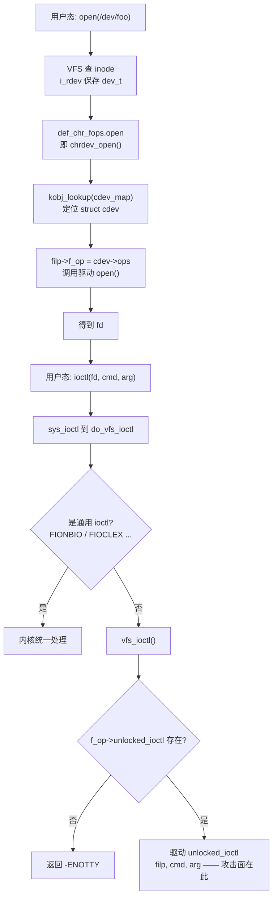
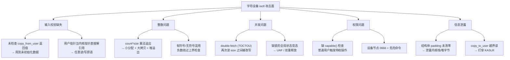
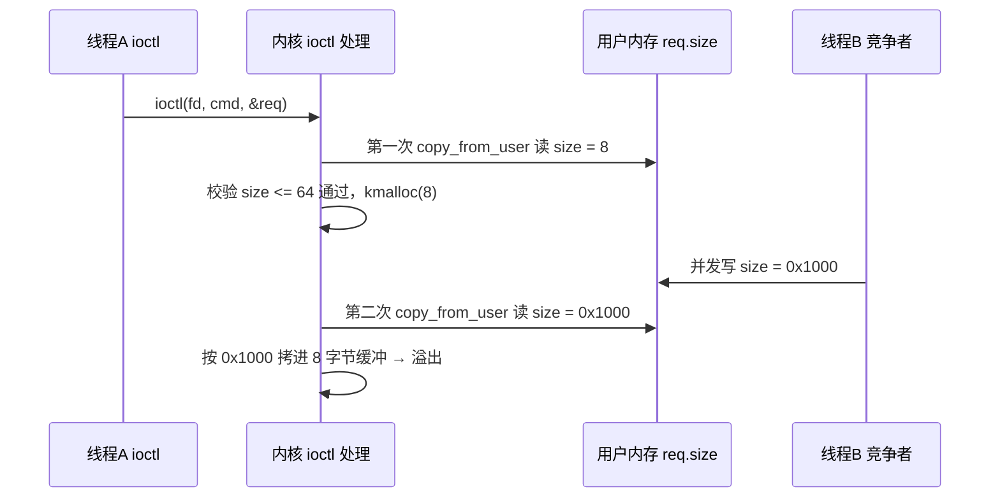

# Linux内核机制与内核利用（10）· 字符设备与ioctl攻击面
> [!abstract] TL;DR
> - 字符设备把"一切皆文件"落到 `struct file_operations`：`open("/dev/x")` 经 `chrdev_open` 把 `filp->f_op` 换成驱动自己的 fops，此后 `ioctl` 直达 `unlocked_ioctl`，这是内核里最庞大、最不规整、最容易出漏洞的攻击面。
> - `ioctl` 是"命令号 + 任意 arg"的万能逃生舱：`cmd` 与 `arg` 的语义完全由驱动私自定义，没有内核统一校验，海量厂商/树外驱动质量参差 —— Android 上 GPU（kgsl/Mali）、binder 等本地提权大多出在这里。
> - `copy_from_user`/`copy_to_user` 是用户态与内核态数据的唯一合法闸门：它做 `access_ok` 边界检查、带异常表容错、返回"未拷贝字节数"；不检查返回值、不清零结构体 padding、盲信 `_IOC_SIZE(cmd)` 都是教科书级的坑。
> - 五大漏洞族：输入校验缺失（把用户指针当内核指针解引用）、整数溢出（`count*size` 小分配大拷贝）、double-fetch 竞态（两次读 size 之间被改写）、权限缺失（无 `capable()` 且节点 0666）、信息泄露（padding / 越界读打穿 KASLR）。
> - 防御纵深：SMAP/SMEP、`CONFIG_HARDENED_USERCOPY`、`init_on_alloc`、SELinux ioctl 扩展权限（xperm 白名单）、前置 `capable()`；逆向侧靠定位 fops 结构 + `_IOC*` 解码 + smatch/syzkaller 找 bug。

## 概述与定位

Linux 把外设抽象成三类：**字符设备**（按字节流访问，如 `/dev/ttyS0`、`/dev/urandom`、GPU、传感器）、**块设备**（按块随机访问，走 `request_queue` 与页缓存）、**网络接口**（不在 `/dev` 里，走 socket 与协议栈）。字符设备是数量最多、最贴近"驱动作者手写代码"的一类：它没有块层的通用请求框架兜底，几乎每个操作都由驱动自己实现，因而也把最多的**未经内核核心审阅的代码**直接暴露给用户态。

本篇聚焦三件事及其安全含义：**`file_operations`**（VFS 与驱动之间的函数指针契约）、**`ioctl`**（那个"什么都能塞"的命令通道）、**`copy_from_user`**（跨越用户/内核边界搬运数据的唯一正确姿势）。之所以把它们并列成"攻击面"，是因为一条完整的本地提权链，其起点几乎总是"打开某个设备节点 → 发一个精心构造的 ioctl → 触发驱动里的内存破坏"。据统计，历年 Linux 本地提权 CVE 中，驱动 ioctl 处理函数占了极大比例，尤其在移动端：应用沙箱内的普通进程能直接 `open` GPU / codec / binder 节点，这些节点的 ioctl 就成了从沙箱打到内核的第一块跳板。

在系列里，本篇承上启下：VFS 的通用 fops 分发机制见 [[05.VFS与文件系统层]]（本篇只讲字符设备专有路径与其安全含义，不重复 VFS 全景）；驱动如何被加载、`module_init`/符号导出见 [[09.内核模块与LKM开发]]（本篇假设模块已在内核里，专讲它对外暴露的接口）；ioctl 触发的**具体漏洞类型**（UAF/OOB/竞态）的通用原理见 [[14.内核漏洞类型：UAF与OOB与竞态]]，本篇讲的是"ioctl 作为投递载体如何把这些 bug 喂进去"；后续的利用原语、提权、绕防护分别见第 15–17 篇。可以说，字符设备与 ioctl 是这条学习曲线上**攻击面的第一课**。

## 原理与机制

### 设备号与注册：驱动如何在 /dev 后面挂上代码

每个设备由一个 `dev_t`（32 位）标识，高 12 位是**主设备号**（major，标识哪个驱动），低 20 位是**次设备号**（minor，标识同一驱动下的具体实例）。宏 `MAJOR(dev)`、`MINOR(dev)`、`MKDEV(ma,mi)` 负责拆装。用户态在 `/dev` 下看到的字符设备节点（`ls -l` 首列为 `c`）就是把某个 `dev_t` 绑定到一个文件名，`mknod` 或 udev 负责创建。

驱动注册字符设备有三条路，理解它们对逆向定位入口很关键：

- **老式** `register_chrdev(major, name, fops)`：一把梭注册 256 个 minor，`fops` 直接给出。简单但粗糙。
- **现代显式** `alloc_chrdev_region()`（动态要号）或 `register_chrdev_region()`（静态要号）拿到 `dev_t`，再 `cdev_init(&cdev, &fops)` + `cdev_add(&cdev, dev, count)` 把一个 `struct cdev`（内含 `ops` 指向 fops）注册进全局 `cdev_map`。
- **misc 框架** `misc_register(&miscdevice)`：所有 misc 设备共享 major 10，minor 动态分配，`struct miscdevice` 里带 `.fops` 与 `.name`。**这是单例字符设备最常见的写法**，也是绝大多数 CTF 靶驱动和很多真实驱动（`/dev/fuse`、`/dev/kvm` 之类）的注册方式 —— 逆向时看到 `misc_register` 基本就锁定了 fops。

### file_operations：VFS 与驱动的函数指针契约

`struct file_operations`（`include/linux/fs.h`）是一张函数指针表，VFS 通过它把系统调用转发给驱动。核心字段（顺序即内存布局，逆向定位偏移全靠它）：

```c
struct file_operations {
    struct module *owner;
    loff_t  (*llseek) (struct file *, loff_t, int);
    ssize_t (*read)  (struct file *, char __user *, size_t, loff_t *);
    ssize_t (*write) (struct file *, const char __user *, size_t, loff_t *);
    ssize_t (*read_iter)  (struct kiocb *, struct iov_iter *);
    ssize_t (*write_iter) (struct kiocb *, struct iov_iter *);
    /* ... iopoll / iterate_shared / poll ... */
    long (*unlocked_ioctl) (struct file *, unsigned int, unsigned long);
    long (*compat_ioctl)   (struct file *, unsigned int, unsigned long);
    int  (*mmap) (struct file *, struct vm_area_struct *);
    int  (*open) (struct inode *, struct file *);
    int  (*release) (struct inode *, struct file *);
    /* ... */
};
```

这里有个历史细节：字段叫 `unlocked_ioctl` 而不是 `ioctl`，是因为 2.6.36 之前的 `->ioctl` 会持有 **BKL（大内核锁）**，为了摆脱 BKL 引入了"不加锁"的版本，驱动自己负责同步。到 2.6.39 BKL 被彻底删除，`->ioctl` 消失，只剩 `unlocked_ioctl`。"unlocked"这个词今天读起来别扭，其实是一段锁演进史的化石 —— 也提醒我们：**ioctl 的并发同步责任完全在驱动作者身上**，这正是后面 double-fetch/竞态漏洞的温床。

驱动通常用 `filp->private_data` 挂自己的上下文，用 `container_of` 从 `struct file`/`inode->i_cdev` 反推出私有结构。这个"从 file 找私有数据"的解引用链，也是 UAF 常见的落点。

### 从 open 到 ioctl：一次调用如何抵达驱动

关键在于 fops 的"偷梁换柱"：字符设备 inode 的默认 `f_op` 是 `def_chr_fops`，其 `.open` 指向 `chrdev_open()`。`chrdev_open` 用 `i_rdev` 在 `cdev_map` 里 `kobj_lookup` 找到 `struct cdev`，把 `filp->f_op` **替换为驱动自己的 fops**，再调用驱动的 `open`。此后这个 fd 上的一切读写/ioctl 都直达驱动。ioctl 侧的分发链路：



`do_vfs_ioctl` 先处理一小撮通用命令（`FIONBIO` 非阻塞、`FIOCLEX` close-on-exec、`FIGETBSZ` 等），其余交给 `vfs_ioctl` → `filp->f_op->unlocked_ioctl`。若驱动没设 `unlocked_ioctl`，返回 `-ENOTTY`（"inappropriate ioctl for device" 的历史命名，直译"不是打字机"）。注意 ioctl 的返回值是 `long`，**可以返回正值当数据**用，这与多数系统调用"非负即成功"的约定不同。

### ioctl 命令编码与 copy_from_user 语义

`cmd` 不是随便一个整数，而是用 `_IO`/`_IOR`/`_IOW`/`_IOWR` 宏（`asm-generic/ioctl.h`）编码出来的，多数架构下 32 位布局如下：

```
 位:  31 30 | 29 .............. 16 | 15 ........ 8 | 7 ........ 0
      +-----+----------------------+---------------+-------------+
      | DIR |         SIZE         |     TYPE      |     NR      |
      | 2位 |        14 位         |     8 位      |    8 位     |
      +-----+----------------------+---------------+-------------+

 DIR : _IOC_NONE(0)/_IOC_WRITE(1)/_IOC_READ(2)，方向以"用户态视角"为准
 SIZE: sizeof(参数类型)，由宏在编译期填入
 TYPE: "幻数"，通常取一个 ASCII 字符，用来区分不同驱动
 NR  : 命令序号
 解码宏: _IOC_DIR(cmd) / _IOC_TYPE(cmd) / _IOC_SIZE(cmd) / _IOC_NR(cmd)
```

方向以用户态为准：`_IOC_WRITE` 表示"用户往内核写"（内核 `copy_from_user`），`_IOC_READ` 表示"用户从内核读"（内核 `copy_to_user`）。**逆向时先把 cmd 常量丢进这四个解码宏，立刻就知道这条命令读/写多大的结构体、幻数是什么** —— 这是快速摸清一个陌生驱动 ioctl 语义的第一板斧。

`arg` 通常是一个用户态指针，内核**绝不能直接解引用**，必须走 `copy_from_user(dst_kernel, src_user, n)` / `copy_to_user(dst_user, src_kernel, n)`。它们做三件事：(1) `access_ok(addr, size)` 校验地址落在用户地址区间（`< TASK_SIZE`），挡住"把内核地址当参数传进来"的攻击；(2) 拷贝过程用**异常表（extable）**兜底，遇到坏页/缺页不会 oops，而是捕获后返回；(3) 返回**未拷贝的字节数**，`0` 才是全部成功。在开了 **SMAP** 的机器上，`copy_*_user` 内部用 `stac`/`clac` 临时开关对用户页的访问权限 —— 这也解释了为什么"直接解引用用户指针"在现代内核上会当场 fault：不是逻辑错，是硬件 SMAP 在拦。

## 攻击面剖析与漏洞模式详解

### 为什么偏偏是 ioctl

系统调用是内核精心设计、集中审阅、有稳定 ABI 的窄接口；而 ioctl 是**反面**：它是一个"命令号 + 一个 `unsigned long` 参数"的开放式逃生舱，`cmd` 空间 32 位任取，`arg` 语义完全私有。一个 GPU 驱动可能挂着上百条 ioctl，每条对应一个 handler，每个 handler 都在手写 `copy_from_user` + 业务逻辑。这带来三个致命的结构性问题：

1. **没有中心校验**：核心内核帮不上忙，参数合法性全靠驱动作者自觉。
2. **代码量巨大且质量参差**：树内驱动尚有 review，海量**树外/厂商驱动**（Android SoC 的 GPU、DSP、camera、modem 接口）几乎无人审计，却直接可从低权限进程访问。
3. **可达性强**：很多设备节点权限是 `0666` 或授予了 app 组，沙箱里的不可信代码就能 `open` 它、疯狂发 ioctl。攻击面 = 可达性 × 代码脆弱度，ioctl 在两个维度上都拉满。

下面把最常见的漏洞族拆开讲，每一族都给出"为什么会这样写错"和"正确该怎么写"。



### 一、输入校验缺失

最经典的两种：**(a) 把用户指针当内核指针直接解引用**。驱动图省事，写 `*(unsigned long *)arg = value;`，若 `arg` 是用户可控的任意值，这就等于一个受控地址的写原语（写受控值更是任意写）。现代 SMAP 会拦下直接访问用户页，但若攻击者把 `arg` 填成**内核地址**，`access_ok` 在旧内核/旧 `access_ok` 语义下未必挡得住，就演变成任意内核读写。**(b) 不检查 `copy_from_user` 返回值**：拷贝部分失败时缓冲区含未初始化的旧数据，后续逻辑照用，轻则信息泄露重则控制流劫持。正确写法永远是 `if (copy_from_user(...)) return -EFAULT;`。

### 二、整数溢出：小分配、大拷贝

漏洞模板：`buf = kmalloc(user_count * elem_size, GFP_KERNEL);` 随后 `copy_from_user(buf, uptr, user_count * elem_size)`。当 `user_count` 足够大，乘法在 `size_t` 上回绕成一个很小的值，`kmalloc` 分配了小对象，而真正拷贝时若长度取自另一处（或回绕点不一致），就往小对象里灌大数据 → **堆溢出**，直接进 slab 风水利用。修补靠 `kmalloc_array()`/`check_mul_overflow()` 等带溢出检查的分配接口。**有符号/无符号**同理：把 `size` 声明成 `int` 并 `if (size > MAX) return -EINVAL;`，攻击者传负数绕过上界，之后当无符号巨值使用。

### 三、double-fetch：两次读之间的空窗

这是 ioctl 竞态的招牌。驱动常常需要"变长参数"：先从用户结构体读一个 `size`，据此分配/校验，再回头按 `size` 拷贝真正的数据。问题在于**内核两次去用户内存取 `size`**，而用户内存在两次读之间可被另一个线程改写：



第一次读到的是"给校验器看的乖值"，第二次读到的是"给拷贝用的坏值"，校验形同虚设。根因是**信任用户内存的稳定性**。正确姿势：一次性把整个请求头拷进内核栈/堆的**内核副本**，之后只认这份副本，绝不二次回读用户内存。Pengfei Wang 等人的 double-fetch 研究与 Bochspwn 类工具专门扫这种模式，syzkaller 也能在并发调度下触发它。竞态的另一变体是**缺锁的全局状态**：ioctl 改动 `filp->private_data` 指向的对象而无锁，并发的 open/close/ioctl 造成 UAF 或双重释放 —— 这类往往比 double-fetch 更好利用，因为能直接控对象生命周期。

### 四、权限缺失：谁都能发的特权命令

ioctl handler 若执行敏感操作（改内核参数、映射物理内存、操作硬件寄存器）却不做 `capable(CAP_SYS_ADMIN)` 之类前置检查，那么**任何能 open 该节点的用户**都能触发。叠加设备节点 `0666` 的宽松权限，就是"人人可提权"。这类不是内存破坏，而是**逻辑越权**，危害同样致命，且静态审计极易漏掉（因为代码本身"没 bug"，只是少了一句检查）。

### 五、信息泄露：padding 与越界读打穿 KASLR

`copy_to_user` 把内核结构体回给用户时，**结构体的对齐填充字节（padding）若未清零**，就把内核栈/堆里的残留字节泄露出去 —— 这些残留可能含内核指针，足以打穿 KASLR（见 [[17.绕过内核防护：KASLR与SMEP与SMAP与KPTI]]）。例如 `struct{int a; long b;}` 在 `a` 与 `b` 之间有 4 字节洞，`copy_to_user(u, &s, sizeof(s))` 就漏 4 字节。修法是 `memset(&s, 0, sizeof(s));` 后再填字段（仅靠 `= {0}` 初始化器对 padding 的清零在标准上不保证，历史上出过事，`memset` 才是稳的惯用法；现代还有 `CONFIG_INIT_STACK_ALL_ZERO` 兜底）。另一路是**用户可控索引的越界读**：`copy_to_user(u, &table[user_idx], n)` 无边界检查，直接把内核内存当数组读出去。

### 补充面：_IOC_SIZE 盲信、compat_ioctl、mmap

- **盲信 `_IOC_SIZE(cmd)` 当拷贝长度**：由于整个 `cmd` 是用户提供的，攻击者能构造出任意 SIZE 字段的 `cmd`。若驱动写 `copy_from_user(fixed_buf, arg, _IOC_SIZE(cmd))` 而 `fixed_buf` 是定长栈/堆缓冲，就被喂超长 → 溢出。SIZE 只能当"参考/校验"，绝不能当"我信任的拷贝上限"。
- **`compat_ioctl` 的结构体错位**：64 位内核跑 32 位进程时，指针 4 字节、`long` 4 字节，结构体布局与 64 位不同。若驱动图省事把 `compat_ioctl` 直接指向 `unlocked_ioctl` 而不做转换，32 位下传来的结构体会被按 64 位布局**错位解读**，字段串位 → 内存破坏。正确要用 `compat_ptr()` 转 32 位指针、逐字段转换；历史上的 `compat_alloc_user_space()`（在用户栈上拼 compat 结构）更是 bug 重灾区，已被逐步淘汰。
- **`mmap` 也是攻击面**：ioctl 之外，fops 的 `mmap` 若用用户可控的偏移/pfn 调 `remap_pfn_range()`，可能把**任意物理内存**映射进用户空间 → 读写内核。审计驱动时 `mmap` 与 `ioctl` 要一并看。

## 工具视角与实战

### 运行时枚举：先摸清有哪些攻击面

```bash
ls -l /dev            # 首列 c 为字符设备，逗号分隔的两列是 major,minor
cat /proc/devices     # "Character devices:" 段落列出 major 与驱动名
ls /sys/class/        # 按设备类浏览
ls -l /sys/dev/char/  # 以 major:minor 反查 sysfs 节点
```
关注**权限宽松（组可写/others 可读写）**且**非标准**的节点 —— 那往往是厂商驱动，攻击面最肥。

### 逆向：在 .ko 里定位 fops 与 ioctl handler

思路是"从注册点顺藤摸瓜"。在 IDA/Ghidra 里：

1. 找 `module_init`（`.init.text` 段的 init 函数），定位它调用的 `misc_register` / `register_chrdev` / `cdev_add`；这些调用的参数里就有 `struct file_operations` 或 `struct miscdevice`（后者再取 `.fops`）。
2. `file_operations` 是一张函数指针表，`unlocked_ioctl` 的偏移随内核版本浮动（前面排着 owner/llseek/read/write/read_iter/write_iter/poll…）。一个稳的锚点是：找到传给 `misc_register` 的 `.name` 字符串，交叉引用回结构体，再顺表数到 ioctl 槽位。
3. 进入 ioctl handler，先认出开头的 `copy_from_user`（拷贝 arg 到本地结构），再看那个巨大的 `switch (cmd)`。把每个 `case` 的常量用 `_IOC_NR/_IOC_TYPE/_IOC_SIZE/_IOC_DIR` 手工解码，就还原出每条命令的语义与数据大小。
4. 重点盯：`copy_from_user`/`copy_to_user` 的长度是否受用户控、是否二次回读用户内存（double-fetch）、`kmalloc` 的 size 是否来自乘法、有没有 `capable()`。

### 静态与动态查错工具链

- **sparse**（`make C=2`）：靠 `__user` 注解检查用户/内核指针是否被误用（把 `__user` 指针直接解引用会告警），是内核自带的第一道静态防线。
- **smatch / coccinelle**：smatch 能跨函数追"用户可控值流到危险 sink（kmalloc size、数组下标、copy 长度）"，coccinelle 用语义补丁批量匹配"copy_from_user 后未查返回值"之类模式 —— 内核社区就用它们扫全树。
- **syzkaller / syzbot**：面向 ioctl 的覆盖引导 fuzzer，用 `syscall description`（`.txt` 描述 ioctl 的 cmd 与 arg 结构）教它构造合法 ioctl，在 KASAN/KCSAN 下自动抓 OOB/UAF/竞态。这是当代找 ioctl bug 的主力，详见 [[18.内核Fuzzing与syzkaller]] 与 [[49.Fuzzing与漏洞挖掘/14.内核与驱动Fuzzing：syzkaller]]。

### 一个可复现的教学漏洞驱动（实验环境）

下面是 CTF/靶场里最典型的"缺边界检查"模式，用于**教学演示** copy_from_user 误用如何形成溢出（正确写法见注释）：

```c
#define MYMAGIC 'k'
#define CMD_STORE _IOW(MYMAGIC, 1, struct req)   /* SIZE = sizeof(struct req) */
struct req { unsigned long size; void __user *buf; };

static char kbuf[64];

static long my_ioctl(struct file *f, unsigned int cmd, unsigned long arg)
{
    struct req r;
    /* 正确：一次性把请求头拷成内核副本，之后只认 r，杜绝二次回读(防 double-fetch) */
    if (copy_from_user(&r, (void __user *)arg, sizeof(r)))
        return -EFAULT;
    switch (cmd) {
    case CMD_STORE:
        /* BUG：未校验 r.size，用户给 0x1000 就把 64 字节的 kbuf 灌爆 → 溢出 */
        if (copy_from_user(kbuf, r.buf, r.size))
            return -EFAULT;
        /* 正确应为： if (r.size > sizeof(kbuf)) return -EINVAL; 再拷贝 */
        return 0;
    default:
        return -ENOTTY;   /* 未知命令的标准返回 */
    }
}
```

配 KASAN 编译、加载后用 `open("/dev/xxx")` + `ioctl(fd, CMD_STORE, &r)` 触发，KASAN 会立刻打印越界写的堆栈 —— 这就是从"发现攻击面"到"确认 bug"的最小闭环。真正的利用（把溢出变提权）涉及 slab 风水、原语构造、绕 SMEP/SMAP/KASLR，属于第 15–17 篇的范畴，本篇不展开成品配方。

## 安全性与正确使用

> [!caution]
> 本文所有漏洞模式、教学驱动与逆向手法，**仅用于**你自有或已获授权的环境、CTF 靶场与防御性安全研究，一律以**防御/教育视角**呈现。严禁将其用于未授权的真实生产系统、他人设备或绕过任何商业软件授权；文中不提供、也不应被用于针对真实目标的武器化步骤。理解攻击面的目的，是把驱动写对、把漏洞审出来、把防线配起来。

**给驱动作者的正确清单**（每条都对应上面某个漏洞族）：

- 一切用户数据只经 `copy_from_user`/`copy_to_user`（或 `get_user`/`put_user`）进出，**永不**直接解引用 `arg`；**必查返回值**。
- 变长参数：先把请求头拷成**内核副本**，之后只信副本，**不二次回读**用户内存（根除 double-fetch）。
- size/count 用 `size_t` 并以 `kmalloc_array()`、`struct_size()`、`check_*_overflow()` 防乘法回绕；边界比较避免有符号/无符号陷阱。
- 回给用户的结构体先 `memset(&s,0,sizeof(s))` 再填字段，杜绝 padding 泄露。
- 特权命令前置 `capable(CAP_SYS_ADMIN)` 等检查；设备节点权限收紧（udev 规则给最小 mode/属主），别一律 `0666`。
- `compat_ioctl` 认真做转换或明确用 `compat_ptr_ioctl` 通用桥；`mmap` 严格校验偏移与长度。

**平台侧防御纵深**：

- **SMEP/SMAP**：禁止内核执行/直接访问用户页，逼迫攻击者放弃 ret2usr、只能走 `copy_*_user` 式合法通道或先绕过（见 [[34.现代二进制防护机制/15.内核防护与kCFI]]）。
- **`CONFIG_HARDENED_USERCOPY`**：在 `copy_*_user` 里校验拷贝区间是否越出 slab 对象/栈帧/合法白名单，把很多溢出当场变成 BUG 而非静默破坏。
- **`init_on_alloc` / `CONFIG_INIT_STACK_ALL_ZERO`**：分配与栈自动清零，压制未初始化信息泄露。
- **SELinux ioctl 扩展权限（xperm）**：可按域白名单化允许的 cmd 号（`allowxperm dom target:class ioctl { 0x1234 };`），把某进程能发的 ioctl 收窄到必需集合 —— 这是从"能 open 就能发任意 ioctl"降级到"只能发被允许的几条"的关键机制（见 [[11.LSM与SELinux与AppArmor]]）。
- **seccomp 的局限**：seccomp 能按参数**标量**过滤系统调用，可以匹配 `ioctl` 的 `cmd` 值来禁用整类命令；但它**无法解引用指针**，看不到 `arg` 指向的结构体内容，所以挡不住"合法 cmd + 恶意 arg"，需要与 LSM/SELinux 配合。

## 小结

字符设备把内核最脆弱的一面直接摆在用户态面前：`file_operations` 是契约，`open` 经 `chrdev_open` 完成 fops 偷换，`ioctl` 是那个语义自定义、无中心校验的万能通道，`copy_from_user` 是唯一正确的越界搬运闸门。攻击面的本质是"高可达性 × 高代码脆弱度"：海量厂商驱动、宽松节点权限、手写的参数处理，共同酿成输入校验缺失、整数溢出、double-fetch 竞态、权限缺失、信息泄露五大漏洞族。逆向侧的方法论是"从注册点找 fops → 定位 ioctl handler → 用 `_IOC*` 解码每条命令 → 盯 copy 长度/二次回读/分配 size/权限检查"；防御侧则是驱动作者的正确编码清单叠加 SMAP/hardened usercopy/init_on_alloc/SELinux xperm 的纵深。把这一课学透，后续 UAF/OOB/竞态、堆喷、提权、绕防护，才有稳固的落脚点。

## 相关阅读

- 本系列前置与后续：[[05.VFS与文件系统层]]、[[09.内核模块与LKM开发]]、[[14.内核漏洞类型：UAF与OOB与竞态]]、[[15.内核利用原语与堆喷]]、[[17.绕过内核防护：KASLR与SMEP与SMAP与KPTI]]、[[18.内核Fuzzing与syzkaller]]
- 防护与访问控制：[[11.LSM与SELinux与AppArmor]]、[[34.现代二进制防护机制/15.内核防护与kCFI]]
- Windows 对称视角：[[38.Windows内核与驱动逆向/13.内核漏洞与利用基础]]、[[38.Windows内核与驱动逆向/26.内核池风水与利用]]
- 系统调用与启动前置：[[15.操作系统加载与启动/10.系统调用机制]]、[[15.操作系统加载与启动/11.init与systemd启动]]
- Fuzzing 呼应：[[49.Fuzzing与漏洞挖掘/14.内核与驱动Fuzzing：syzkaller]]
- 权威资料：《Linux Device Drivers, 3rd Edition》（LDD3，scull 驱动是字符设备与 ioctl 的经典教学例）；内核文档 `Documentation/driver-api/`、`Documentation/security/`；`include/uapi/asm-generic/ioctl.h`（cmd 编码宏）；`fs/ioctl.c`、`fs/char_dev.c`（分发与注册实现）；KernelNewbies 与 kernel.org 关于 `unlocked_ioctl`/BKL 移除的历史说明。

[[00.Linux内核机制与内核利用总览|⬆ 系列总览]] | [[09.内核模块与LKM开发|← 上一章]] | [[11.LSM与SELinux与AppArmor|→ 下一章]]
