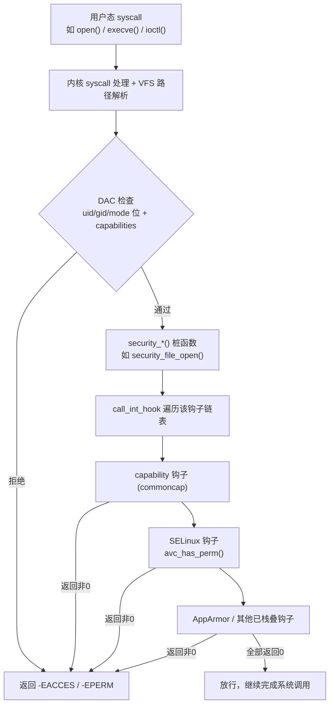
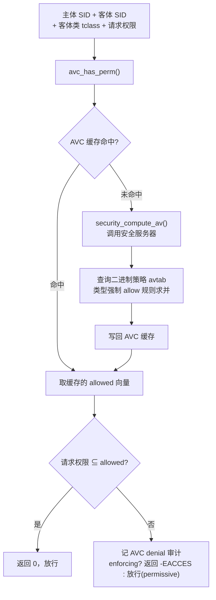
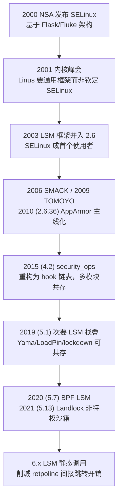

# Linux内核机制与内核利用（11）· LSM与SELinux与AppArmor

> [!abstract] TL;DR
> - LSM 不是某个安全模块，而是内核在关键路径插桩的**通用钩子框架**；钩子一律置于 DAC 检查【之后】，因此 MAC 只能"再收紧"访问、绝不能"额外授予"——这是理解其安全模型与绕过面的第一性原理。
> - SELinux 走 Flask 架构：一切主客体贴**标签(SID)**，AVC 缓存决策、安全服务器查类型强制策略，默认拒绝；AppArmor 走**路径**中介、profile 编译成 DFA，易写但受硬链接/绑定挂载/符号链接语义拖累。
> - 钩子机制从早期单一 `security_ops` 函数指针，演进到 4.2 的 **hook 链表**（多模块共存、首个拒绝即返回）、5.1 次要 LSM 栈叠、5.7 BPF LSM、6.x 静态调用降开销。
> - 真正的绕过发生在**内核内存破坏之后**：拿到任意读写即可把 `selinux_state.enforcing` 写 0、篡改 `cred` 安全 blob、或直接清空 `security_hook_heads`——`__ro_after_init` 与 physmap 写别名是这场攻防的焦点。
> - 策略层弱点同样致命：permissive 域、`unconfined_t`、过宽 allow 规则、危险 boolean，都让"开着 SELinux"形同虚设；防御须把 MAC 当纵深一层，而非阻止内存破坏的替代品。

## 概述与定位

传统 UNIX 的访问控制是 **DAC（Discretionary Access Control，自主访问控制）**：文件属主凭 `rwx` 位与 uid/gid 决定谁能访问，属主对自己的资源有"自由裁量权"。DAC 的致命缺陷在于它把安全策略下放给了每一个进程与用户——一旦某个 root 进程被攻陷，攻击者继承 root 的全部裁量权，整个系统的安全边界随之崩塌；`setuid` 程序、过宽的文件权限、粗放的 root 语义都在放大这个问题。**MAC（Mandatory Access Control，强制访问控制）**则相反：策略由系统统一制定、内核强制执行，任何主体（包括 root）都无法凭自身意愿逾越。SELinux、AppArmor、SMACK、TOMOYO 都是 MAC 的具体实现，而 **LSM（Linux Security Modules）就是承载它们的那层内核骨架**。

LSM 的诞生本身是一段耐人寻味的内核政治史。2000 年 NSA 发布 SELinux，希望把它直接并入主线；但 Linus Torvalds 拒绝为某一种安全模型背书，坚持内核只应提供**中立、通用的插桩机制**，让各家安全方案作为可插拔模块竞争。于是 2001 年内核峰会上，以 Crispin Cowan 为首的团队提出 LSM 框架，2003 年随 2.6 内核并入主线，SELinux 成为它的首个使用者。这个"框架而非钦定"的设计哲学，决定了 LSM 至今仍是一组**钩子（hook）**而非一套策略：内核只负责"在这些点上问一句允不允许"，至于怎么答，交给挂上来的模块。

在本系列的坐标中，本篇处于承上启下的位置。它上接[[10.字符设备与ioctl攻击面|字符设备与 ioctl 攻击面]]（LSM 钩子正是拦截 `ioctl`、`open`、`mmap` 等入口的最后一道逻辑闸），下接[[12.eBPF架构与验证器|eBPF 架构与验证器]]（BPF LSM 让钩子变得可编程）。更关键的是，它与本系列后半段的**利用主线**形成对照：[[16.内核提权：ret2usr与ROP与pt_regs|提权]]拿到的是内核执行流，[[17.绕过内核防护：KASLR与SMEP与SMAP与KPTI|KASLR/SMEP/SMAP/KPTI]]绕过的是 CPU 级隔离，而 SELinux/AppArmor 拦的是**语义级操作**。理解三者的层次差异，才能明白为什么"关掉 SELinux"往往是内核利用链的最后一环，而不是第一环。

## 原理与机制

### LSM 钩子框架：内核里的"关卡"

LSM 的核心是在内核关键代码路径上散布着数百个 `security_*()` 桩函数。当进程发起 `open()`，VFS 在完成路径解析与 DAC 权限位检查之后、真正返回文件描述符之前，会调用 `security_file_open(file)`；`execve()` 会经过 `security_bprm_check()`；`socket()`、`ptrace()`、`mmap()`、内核模块加载、`ioctl` 无不如此。**这些桩函数的位置经过精心设计：一律在 DAC 检查通过之后才触发。** 这一顺序不是实现细节，而是安全语义的基石——它保证 LSM 只能在 DAC 已经放行的基础上"进一步否决"，绝不可能让 LSM 去"授予"一个 DAC 本不允许的操作。用集合语言说，最终允许的操作集 = DAC 允许集 ∩ 各 LSM 允许集，是**交集收缩**，永远不会扩张。牢记这一点，后文所有"绕过面"的分析都能顺理成章。



### 从 security_ops 到 hook 链表

早期（2.6 到 4.1）LSM 用一个全局 `struct security_operations *security_ops` 承载所有钩子，本质是一张巨大的函数指针表，且**同一时刻只能有一个"主"模块**占据它——SELinux 与 AppArmor 势不两立，编译期或启动期二选一。这既限制了组合使用，也让 `security_ops` 成为一个诱人的单点篡改目标。

2015 年（4.2）Casey Schaufler 把它重构为 **hook 链表**：内核维护一个 `struct security_hook_heads security_hook_heads`，其中每一个钩子都是一条 `hlist`（哈希链表头）。模块通过 `security_add_hooks()` 把自己的回调挂到对应链表上，于是**多个模块可以在同一个钩子上依次登记**。调用时由 `call_int_hook` 宏遍历链表，语义是"限制性优先"：任一回调返回非零（错误码）立即中断并返回该错误，只有全部返回 0 才放行。

```c
// include/linux/lsm_hook_defs.h —— 每个钩子仅一行声明
LSM_HOOK(int, 0, file_open,          struct file *file)
LSM_HOOK(int, 0, bprm_check_security, struct linux_binprm *bprm)
LSM_HOOK(int, 0, inode_permission,   struct inode *inode, int mask)
LSM_HOOK(int, 0, task_kill,          struct task_struct *p, struct kernel_siginfo *info, int sig, const struct cred *cred)
/* ... 数百个，集中登记于一处头文件 ... */

// security/security.c —— 遍历链表，首个非0即返回（限制性语义）
#define call_int_hook(FUNC, IRC, ...) ({                       \
    int RC = IRC;                                              \
    struct security_hook_list *P;                             \
    hlist_for_each_entry(P, &security_hook_heads.FUNC, list) { \
        RC = P->hook.FUNC(__VA_ARGS__);                       \
        if (RC != 0) break;                                   \
    }                                                          \
    RC; })
```

这个宏是理解 LSM 语义的钥匙：**"允许"需要全体同意，"拒绝"只需一票否决**。它也解释了为什么 capability（`security/commoncap.c`）总是第一个被登记、最先运行——它是所有系统共有的最基础检查层，SELinux/AppArmor 只是叠加在其上的额外约束。到了 6.x，为削减 retpoline 在遍历函数指针时的间接跳转开销，LSM 又引入**静态调用（static call）**，把高频钩子编译为可原地改写的直接跳转，在 Spectre 缓解成为默认的时代把安全框架的固定成本压了下去。

### 安全 blob：主客体身上的"标签口袋"

MAC 需要给每个主体（进程）和客体（inode、文件、socket、IPC、key……）附着安全属性。早期做法是在 `struct cred`、`struct inode` 等结构里各塞一个 `void *security` 指针，各模块自行 `kmalloc`。多模块共存后，内核改为**统一 blob 管理**：模块在初始化时通过 `struct lsm_blob_sizes` 声明自己需要的字节数，内核把所有模块的需求**合并成一块连续内存**一次性分配，各模块按偏移取用自己的区段。对 SELinux 而言，进程的 blob 是 `struct task_security_struct`（含 `sid`、`osid`、`exec_sid`、`create_sid` 等），inode 的 blob 是 `struct inode_security_struct`（含该文件的 `sid`、对象类 `sclass`）。这块 blob 就是后文利用视角里"篡改进程安全上下文"的物理落点。

### SELinux：标签驱动的 Flask 架构

SELinux 脱胎于 NSA 的 Flask（Flux Advanced Security Kernel）架构，核心思想是**策略实施（enforcement）与策略决策（decision）分离**。内核里的钩子只管"实施"，把"该不该允许"的问题抛给**安全服务器（security server）**；服务器根据加载的策略计算出**访问向量（access vector，一个权限位图）**返回。因为每次访问都查策略太慢，中间夹了一层 **AVC（Access Vector Cache，访问向量缓存）**：



SELinux 的策略模型由三层叠加：**类型强制（Type Enforcement, TE）**是主力，一切主体属于某个"域（domain）"、一切客体属于某个"类型（type）"，默认全部拒绝，只有显式 `allow` 才放行；**RBAC（基于角色的访问控制）**约束用户能进入哪些域；**MLS/MCS（多级/多类安全）**加装保密等级与类别，用于军政级隔离与容器隔离。每个主客体的完整身份是一个**安全上下文四元组**，内核内部并不逐字比对字符串，而是压缩成 32 位整数 **SID**：

```
SELinux 安全上下文（security context）四元组：
  system_u : object_r : httpd_exec_t : s0
   └─user    └─role    └─type/domain   └─MLS/MCS 级别(sensitivity[:categories])
内核用 sidtab 维护 context <-> SID 的双向映射；
AVC 与策略计算全程只在 SID 这个整数上做比较，字符串仅在边界处出现。
```

### AppArmor：路径驱动的极简主义

AppArmor 与 SELinux 是两种世界观。它不给 inode 贴标签，而是**按可执行文件的路径来匹配 profile、按被访问对象的路径来裁决**。一个 profile 就是一组路径规则，经 `apparmor_parser` 编译成 **DFA（确定有限自动机）**加载进内核，运行时对路径字符串跑一遍状态机即得裁决。它有 `enforce`（强制）与 `complain`（学习，仅记录不拦截）两种模式，天然适配"先跑一遍生成 profile 再收紧"的工作流。

```
# /etc/apparmor.d/usr.sbin.nginx （节选）——路径即规则
/usr/sbin/nginx {
  #include <abstractions/base>
  capability net_bind_service,
  /etc/nginx/**      r,
  /var/log/nginx/*.log  w,
  /var/www/**        r,
  deny /etc/shadow   rwklx,
}
```

**标签制 vs 路径制的深层差异，决定了两者的强弱边界。** SELinux 的标签跟着 inode 走（存在 `security.selinux` 扩展属性里），文件改名、移动、硬链接都不改变其安全身份，语义严密、覆盖彻底、但策略庞大难写；AppArmor 的裁决绑定在**路径名**上，写起来直观、按应用逐个约束、上手快，代价是路径与 inode 的多对一关系（硬链接、绑定挂载、符号链接、mount namespace）会撕开语义缝隙——同一个 inode 换个路径就可能逃出规则。这正是后文绕过面里 AppArmor 独有的弱点来源。RHEL/Fedora/Android 选 SELinux 求严密，Ubuntu/SUSE 选 AppArmor 求易用，本质是"安全强度"与"运维成本"的取舍。

## Hook框架与策略引擎详解

### LSM 的注册、排序与栈叠

系统启动时，哪些 LSM 生效、以什么顺序生效，由编译期 `CONFIG_LSM` 与启动参数 `lsm=` 共同决定。运行态可直接读内核内省接口确认：

```
cat /sys/kernel/security/lsm
# 典型输出：capability,lockdown,yama,integrity,selinux
#           或 capability,lockdown,yama,integrity,apparmor
```

顺序至关重要，因为限制性钩子"首个拒绝即返回"，靠前的模块先表态。历史上 LSM 长期只允许**一个"主（major）"模块**（SELinux/AppArmor/SMACK/TOMOYO 互斥），但允许若干**"次（minor）"模块**并存：capability 永远在场，Yama（限制 `ptrace` 附加范围）、LoadPin（强制内核模块/固件从只读介质加载）、SafeSetID、Lockdown（锁定 root 对内核的写入能力，配合 Secure Boot）、IMA/EVM（完整性度量）等都可栈叠。2019 年（5.1）栈叠机制正式化，2021 年（5.13）又加入 **Landlock**——一个**非特权进程也能自我沙箱**的 LSM，让普通程序无需 root 就能主动放弃权限。至于"SELinux 与 AppArmor 同时全量启用"的完全栈叠，Casey Schaufler 推动多年仍在演进，难点在于安全 blob 布局、审计标签冲突与 `/proc/*/attr` 接口的多路复用。



### SELinux 策略是怎么"编译"进内核的

写策略的人面对的是 Reference Policy（refpolicy）的 `.te`（类型强制规则）、`.if`（接口宏）、`.fc`（文件上下文标注）三类源文件。它们经 `checkpolicy`/`secilc` 编译成**二进制策略**（早期是单一 `policy.NN`，现代走 CIL 中间语言与模块化 `semodule`），通过 `security_load_policy()` 写进内核的策略数据库。内核侧最热的数据结构是 **avtab**（access vector table，规则哈希表）与 **sidtab**。类型强制的核心规则只有几种形态，但组合出全部安全语义：

```
# 类型强制核心规则
allow httpd_t httpd_sys_content_t : file { read getattr open };  # 显式允许
type_transition httpd_t httpd_exec_t : process httpd_t;          # 域自动转换

# 域转换（domain transition）不是一条 allow 能完成的，需三方配套：
allow initrc_t httpd_exec_t : file    { execute };     # 父域能执行入口文件
allow httpd_t  httpd_exec_t : file    { entrypoint };  # 目标域认这个入口
allow initrc_t httpd_t      : process { transition };  # 父域能转入目标域
```

**域转换这三条缺一不可的设计，是 SELinux 严密性的缩影**：它把"谁能启动什么、启动后变成什么身份"拆成三个正交条件，任何一条缺失都转换失败。这与 setuid"执行即变身、无从细分"的粗放形成鲜明对比。此外 SELinux 提供 **boolean** 作为运行态开关（`getsebool`/`setsebool`），让一份策略能在若干预设行为间切换而不必重编译——但每一个开着的危险 boolean（如 `httpd_can_network_connect`）都是攻击面。

### enforcing / permissive / disabled 三态

SELinux 有三种全局状态：**enforcing**（拒绝并记录）、**permissive**（只记录不拦截，用于调试与生成策略）、**disabled**（完全关闭）。运行态在 enforcing 与 permissive 间切换由 `/sys/fs/selinux/enforce` 承载，写它需要 `security { setenforce }` 权限。permissive 还可细化到**单个域**（`permissive httpd_t;`）——这意味着即便系统整体 enforcing，某个域仍可能被策略作者特意放行，这是策略层最隐蔽的弱点之一。至于运行态彻底 disable，历史上有个 `/sys/fs/selinux/disable` 节点（`CONFIG_SECURITY_SELINUX_DISABLE`），在策略加载前写它即可摘除全部钩子；但它要求 `security_hook_heads` 不能是 `__ro_after_init`（否则无法卸载），与加固方向冲突，已被弃用/移除，现代内核只能靠 `selinux=0` 启动参数或不加载策略来关闭。

### 逆向视角：在一个内核镜像里定位这套机制

从逆向/研究角度，识别一个 vmlinux 中的 LSM 布局有几条稳定线索：`security_hook_heads` 是一个巨大的 `hlist_head` 数组，SELinux 通过 `security_add_hooks(selinux_hooks, ...)` 一次性登记，`selinux_hooks[]` 数组本身是一串 `LSM_HOOK_INIT(name, selinux_##name)` 的初始化项，`{钩子偏移, 回调函数地址}` 的规整排布在反汇编里很好认。决策热点 `avc_has_perm`/`security_compute_av` 通常带字符串或审计路径可交叉引用。而 `/sys/fs/selinux/enforce` 的写处理 `sel_write_enforce()` 会引用那个决定全局行为的**枚举/布尔状态**——早期是全局 `int selinux_enforcing`，4.19 前后被收进 `struct selinux_state selinux_state` 的 `enforcing` 字段。找到它，就找到了后文利用视角里最著名的那个"一字节开关"。

## 工具视角与实战

日常运维与安全研究里，SELinux 与 AppArmor 各有一套成熟工具链。**读懂 denial 比死记规则更重要**：SELinux 的每一次拒绝都会在审计日志留下 `type=AVC` 记录，包含主体域、客体类型、被拒权限，`audit2allow` 甚至能据此反向生成一条补丁策略（生产中须审阅而非无脑套用，否则等于亲手拆掉围栏）。

```
# —— SELinux 运行态 ——
getenforce; sestatus                 # 当前模式与策略概览
setenforce 0                         # enforcing<->permissive（需 setenforce 权限）
ausearch -m avc -ts recent           # 拉取最近的拒绝审计
ausearch -m avc -ts recent | audit2allow -M mypol   # 由 denial 生成候选策略模块
sesearch -A -s httpd_t -t shadow_t -c file          # 查策略：httpd_t 能否读 shadow_t
seinfo -t                            # 列出全部 type；seinfo --portcon 等查绑定
semanage fcontext -a -t httpd_sys_content_t "/srv/web(/.*)?"; restorecon -Rv /srv/web

# —— AppArmor 运行态 ——
aa-status                            # 已加载 profile 及其 enforce/complain 分布
aa-complain /usr/sbin/nginx          # 切到学习模式，只记录不拦截
aa-enforce  /usr/sbin/nginx          # 切回强制
aa-genprof  /usr/bin/foo             # 交互式生成新 profile
aa-logprof                           # 根据审计日志精修 profile

# —— 内核内省 / 逆向 ——
cat /sys/kernel/security/lsm         # 当前激活的 LSM 及顺序
cat /sys/fs/selinux/enforce          # 1=enforcing 0=permissive
mount | grep securityfs              # securityfs 挂载点，AppArmor 的 .load 也在其下
```

实战中最常见的坑，是把功能故障误判为程序 bug 而非 MAC 拦截：服务读不到某目录、绑定不了某端口、连不上某 socket，八成是 denial。正确姿势是先 `ausearch -m avc` 或看 `dmesg` 里的 `audit`/`apparmor` 行确认，再决定是修上下文标签（`restorecon`/`chcon`）、调 boolean，还是补一条最小化规则——而不是一把 `setenforce 0` 了事。对研究者，`sesearch` 与 `seinfo` 是审计一份策略"松不松"的利器：搜出所有能进入 `unconfined_t` 的路径、所有 permissive 域、所有指向敏感类型的宽泛 allow，就能量化这份策略的真实攻击面。

## 安全性与正确使用

现在回到本系列的主线——利用视角。**MAC 的绕过面分三个层次，越往下越致命。**

**第一层，设计层：MAC 不可被"骗"出额外权限。** 前文反复强调钩子在 DAC 之后、只做交集收缩，因此不存在"构造某种调用让 SELinux 反而授予权限"的逻辑绕过——这是它的强项，也划定了攻击者不该浪费时间的方向。想突破 MAC，只能从策略缝隙钻，或者干脆掀翻执行它的内核。

**第二层，策略层：把围栏修出洞。** 这是最现实的绕过，且不需要任何内存破坏。permissive 域让特定身份"开着 SELinux 却畅通无阻"；`unconfined_t` 之类的宽域本就近乎无约束，一旦目标进程落在其中，MAC 形同虚设；过宽的 `allow`（尤其涉及 `execmem`、`execstack`、`dac_override`、写敏感类型）等于预留后门；危险 boolean 被打开则临时放开成片权限。AppArmor 因路径制还有独有弱点：**硬链接**把受限文件链到一个规则未覆盖的路径即可绕过按名裁决，**绑定挂载/mount namespace** 让同一 inode 以合法路径重新出现，**符号链接竞态**（TOCTOU）在解析与使用之间偷换目标。这些不是实现 bug，而是"按路径裁决"的语义代价。

**第三层，内核破坏层：直接摘掉执行者。** 这是内核利用链的收尾环节，也是本系列真正的关切。**SELinux/AppArmor 的全部强制力都寄生在内核代码与内核数据结构上**；一旦通过 UAF/OOB/竞态（见[[14.内核漏洞类型：UAF与OOB与竞态|第14篇]]）拿到任意读写或执行流，MAC 就从"铜墙铁壁"退化为"几个可写的字节"。概念上有三个经典落点：

```
# 概念示意（研究/CTF 语境）：内核任意写之后，MAC 状态位是常见的"最后一公里"
#   selinux_state.enforcing  写 0    等价于免权限的 setenforce 0（记录但放行）
#   current->cred->security          篡改 task_security_struct.sid 至不受限域
#   security_hook_heads.<hook>       清空对应链表头，即摘除该类检查
# 现代内核把 selinux_state / security_hook_heads 标 __ro_after_init：
#   主内核映射只读，直接写会触发保护；攻击面转移到 physmap(direct map)
#   的可写别名，或先改 PTE 把目标页属性翻成可写——这与 SMEP/SMAP/KPTI 一脉相承。
```

这解释了内核利用为何常把"改 enforce 位"排在 `commit_creds(prepare_kernel_cred(0))` 之后：仅仅拿到 root uid 并不改变进程的 SELinux 域，enforcing 下许多操作仍被按域拦截，因此在重度 SELinux 的环境（典型如 Android）里，标准收尾是**改 uid/capabilities + 关 enforcing（或改 cred SID）+ 关 seccomp**三件套齐下。而内核加固的回应，正是把这些关键状态放进 `__ro_after_init` 只读段、上 CFI 防篡改函数指针链表、收紧 physmap 别名可写性——把"最后一公里"越修越长。**结论很清楚：MAC 是纵深防御的一层，用来限制被攻陷进程的爆炸半径、抬高利用成本，而不是阻止内存破坏本身的手段。** 真正挡住第三层的是内存安全与[[17.绕过内核防护：KASLR与SMEP与SMAP与KPTI|KASLR/SMEP/SMAP/KPTI]]、[[34.现代二进制防护机制/15.内核防护与kCFI|kCFI]]那一整套机制，SELinux 只是在它们失守后延缓崩塌。

> [!caution] 合规边界
> 本节所述绕过面（enforce 状态位、`cred` 安全 blob、hook 链表、physmap 可写别名、路径中介弱点）**仅用于自有/授权环境、CTF 靶场与内核安全研究**，一律以防御与教育为目的。本文不针对任何真实生产系统或他人设备提供武器化步骤，不为绕过厂商/商业授权或设备锁定提供成品配方。理解这些原语的价值在于：把 MAC 正确定位为纵深防御的一环，据此推动 `__ro_after_init`、CFI、页表保护、Secure Boot + Lockdown 等加固，而非把它误当作阻止内存破坏的替身。防御者应默认 enforcing、审计并消除 permissive 域与 `unconfined` 泄漏、最小化 allow 规则与 boolean、对 AppArmor 补齐硬链接/挂载缝隙。

## 小结

LSM 是一层刻意保持中立的内核骨架：它只在 DAC 之后、系统调用关键路径上插桩发问，把"允不允许"交给挂上来的模块，用 hook 链表的"一票否决"语义保证最终权限只会收缩、绝不扩张。SELinux 以标签与 Flask 架构追求严密——SID、AVC、类型强制、三态与域转换共同织成一张默认拒绝的网；AppArmor 以路径与 DFA 追求易用，代价是硬链接与挂载语义留下的缝隙。二者之上，栈叠、BPF LSM、Landlock、静态调用勾勒出这套框架二十余年的演进轨迹。从利用视角看，MAC 的绕过分设计层（不可能）、策略层（修洞即穿）、内核破坏层（改几个字节即废）三级；而 `__ro_after_init` 与 physmap 别名之争，正是这场攻防的当代前沿。把 SELinux/AppArmor 理解为"抬高利用成本、限制爆炸半径的纵深一层"，而非"内存安全的替代品"，是本篇留给读者最重要的判断。

## 相关阅读

- 内核官方文档：`Documentation/admin-guide/LSM/`（各 LSM 概览）、`Documentation/security/`；源码 `security/security.c`、`security/selinux/`、`security/apparmor/`、`include/linux/lsm_hook_defs.h`
- Crispin Cowan 等，《Linux Security Modules: General Security Support for the Linux Kernel》（USENIX Security 2002，LSM 原始论文）
- Peter Loscocco & Stephen Smalley，《Integrating Flexible Support for Security Policies into the Linux Operating System》（Flask/SELinux 原始论文）
- Stephen Smalley 等，《The SELinux Notebook》（SELinux 官方参考手册）；`man selinux(8)`、`apparmor(7)`、`capabilities(7)`
- 同系列：[[10.字符设备与ioctl攻击面|← 字符设备与 ioctl 攻击面]]、[[12.eBPF架构与验证器|BPF LSM 与验证器]]、[[08.网络栈与netfilter|网络栈与 netfilter]]、[[14.内核漏洞类型：UAF与OOB与竞态|内核漏洞类型]]、[[16.内核提权：ret2usr与ROP与pt_regs|内核提权]]、[[17.绕过内核防护：KASLR与SMEP与SMAP与KPTI|绕过内核防护]]
- 防护呼应：[[34.现代二进制防护机制/15.内核防护与kCFI|内核防护与 kCFI]]
- 启动与系统调用前置：[[15.操作系统加载与启动/10.系统调用机制|系统调用机制]]、[[15.操作系统加载与启动/11.init与systemd启动|init 与 systemd 启动]]
- Windows 对称参照：[[38.Windows内核与驱动逆向/13.内核漏洞与利用基础|内核漏洞与利用基础]]、[[38.Windows内核与驱动逆向/26.内核池风水与利用|内核池风水与利用]]
- Fuzzing 呼应：[[49.Fuzzing与漏洞挖掘/14.内核与驱动Fuzzing：syzkaller|内核与驱动 Fuzzing：syzkaller]]

[[00.Linux内核机制与内核利用总览|⬆ 系列总览]] | [[10.字符设备与ioctl攻击面|← 上一章]] | [[12.eBPF架构与验证器|→ 下一章]]
