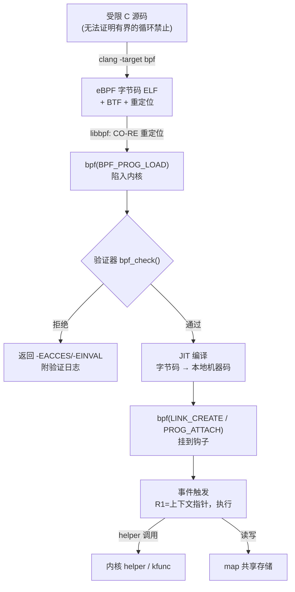
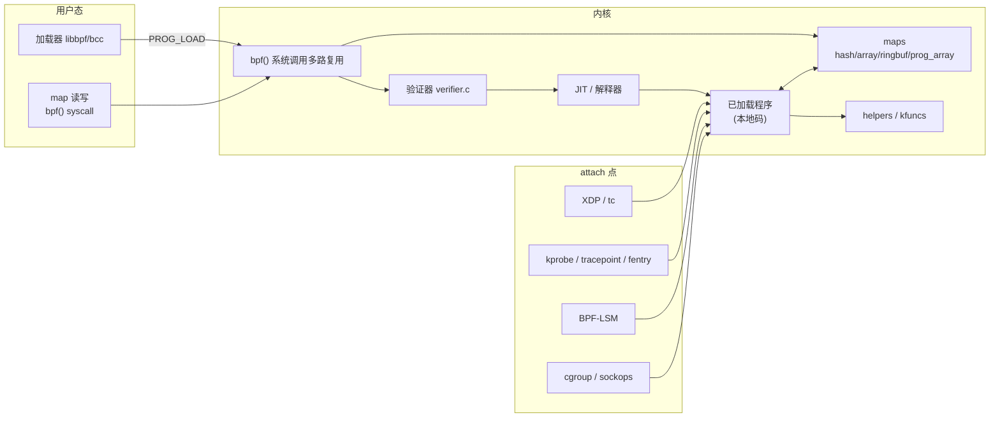
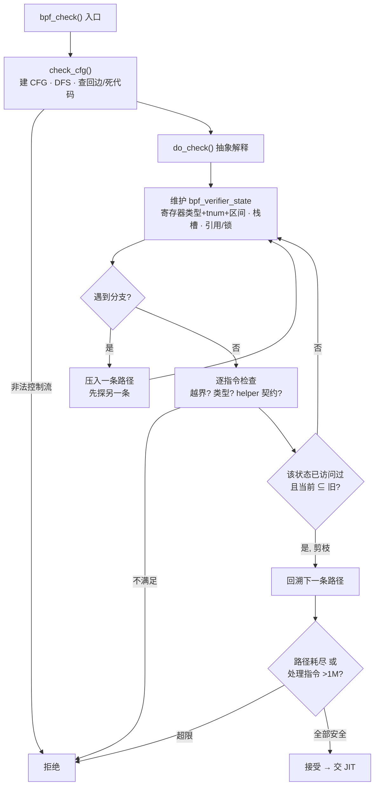
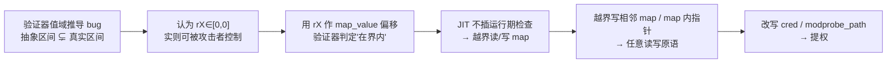

# Linux内核机制与内核利用（12）· eBPF架构与验证器
> [!abstract] TL;DR
> - eBPF 是内核里的一台受限 64 位寄存器虚拟机：用户态把 LLVM 编译出的字节码经 `bpf()` 系统调用送入内核，验证器静态证明其安全后 JIT 成本地机器码，挂到 XDP/kprobe/LSM 等钩子上以近乎零开销运行。
> - 验证器是整个体系的信任根，也是最大攻击面：它用抽象解释（tnum 位级追踪 + smin/smax/umin/umax 区间）在控制流图上对每条路径做值域推导，任何"抽象值域比真实值域更窄"的偏差都会退化成 map/栈的越界读写。
> - 安全模型的本质是"把所有安全检查前移到加载期"，以换取运行期零成本；1M 指令上限、状态剪枝、512 字节定长栈、有界循环，都是为了让静态验证既可判定又不被 DoS。
> - map 是程序与用户态、程序与程序之间唯一合法的共享内存；PROG_ARRAY 支撑尾调用，RINGBUF/PERF_EVENT_ARRAY 负责回传数据，也是利用链里承载 OOB 与类型混淆的主要载体。
> - 历史提权漏洞（CVE-2017-16995、CVE-2020-8835、CVE-2021-3490、CVE-2022-23222 等）几乎清一色是验证器值域/类型推导与真实语义的偏差；因此非特权 eBPF 在主流发行版被默认关闭，CAP_BPF 把权限从 CAP_SYS_ADMIN 中拆出。

## 概述与定位

eBPF（extended Berkeley Packet Filter）这个名字如今已是历史包袱。它的祖先 cBPF（classic BPF）由 McCanne 与 Van Jacobson 在 1992 年为 BSD 提出，本意只是让 `tcpdump` 能在内核里用一台两寄存器的微型虚拟机过滤报文，避免把每个包都拷到用户态再丢弃。2014 年 Alexei Starovoitov 把它彻底重写：寄存器扩到 64 位、数量增至 11 个、引入 JIT、maps、helper 函数与多种程序类型。从此"BPF"不再只是包过滤器，而是一台**通用的、可被用户态编程、在内核热路径上安全执行代码的引擎**。

理解 eBPF 的定位，最好的方式是把它放在"如何在内核里跑我自己的逻辑"这个问题的答案光谱上，与本系列相邻两章对照：

- **内核模块 / LKM（见第 09 章）**：能力全开也危险全开。一个空指针解引用就是 panic，一个逻辑错误就是 rootkit；加载需要 root 且要匹配内核版本，没有任何安全网。它是"原生代码"路线。
- **eBPF**：能力受限但安全有保。验证器在加载期就证明了它会终止、不会越界、不会泄露未初始化内存；程序可热插拔、不需要重编译或重启；借助 CO-RE（Compile Once, Run Everywhere）与 BTF 还能跨内核版本移植。它是"受控字节码 + 静态验证"路线。

这套机制的价值主张一句话概括：**用加载期一次性的静态证明，换取运行期永久的零安全开销**。因为 eBPF 程序往往挂在包接收、系统调用入口这类每秒百万次的热点上，任何运行期沙箱检查都太贵；验证器把安全成本前移到 `bpf()` 那一次系统调用里，一劳永逸。

应用版图大致分三块：**网络**（XDP 在网卡驱动层、skb 分配之前就能处理包，是最快的钩子；tc/clsact、socket filter、cgroup 钩子；Cilium、Katran 等据此做负载均衡与策略）；**可观测/追踪**（kprobe、tracepoint、USDT、perf 事件，bcc 与 bpftrace 是门面）；**安全**（BPF-LSM/KRSI，见第 11 章；网络策略；seccomp 仍用 cBPF）。

对逆向与安全研究者，eBPF 是一柄双刃剑。防御侧，它是构建运行时检测/EDR 的利器——挂到系统调用、检测利用行为、实时告警。攻击侧，加载器本身是一段庞大、复杂、特权的解析器，而验证器是约两万行精巧的抽象解释代码，历史上还可被非特权用户触及，是本地提权（LPE）的头号目标；同时 eBPF 也被用于构造隐蔽后门与 rootkit（如 bpfdoor）。本章聚焦这台虚拟机、它的验证器、maps 以及由此展开的攻击面，而不是教你写某个具体网络程序——那与第 08 章的网络栈/netfilter 有边界。

## 原理与机制

### 指令集与寄存器模型

eBPF 的 ISA 刻意设计得贴近 x86-64/arm64，好让 JIT 一对一映射、几乎零翻译损耗。这是"为什么长这样"的第一层答案：**它不是一台抽象机，而是本地寄存器机的最小公约数**。

- **11 个 64 位寄存器 R0–R10**。R0 存放 helper/函数返回值与程序退出码；R1–R5 是调用参数（caller-saved），程序入口时 R1 携带上下文指针；R6–R9 是 callee-saved（跨 helper 调用保值）；R10 是**只读**帧指针，指向一块 512 字节的栈。
- **512 字节定长栈**。定长意味着栈访问的边界是静态可判定的，这正是验证器能证明栈访问安全的前提。想要更多"内存"？只能走 map。
- **定长 64 位指令**（仅 `BPF_LD | BPF_DW | BPF_IMM` 加载 64 位立即数时占两个槽、共 128 位）。指令编码如下：

```
struct bpf_insn {        // 每条 8 字节；LD_IMM64 例外，占 16 字节
    __u8  code;          // opcode：低 3 位 = 指令类别
    __u8  dst_reg:4;     // 目的寄存器 R0..R10
    __u8  src_reg:4;     // 源寄存器
    __s16 off;           // 16 位有符号偏移（访存位移 / 跳转目标）
    __s32 imm;           // 32 位有符号立即数
};
// opcode 低 3 位的指令类别：
//   0 BPF_LD   1 BPF_LDX  2 BPF_ST   3 BPF_STX
//   4 BPF_ALU  5 BPF_JMP  6 BPF_JMP32(5.1+)  7 BPF_ALU64
```

`BPF_ALU` 是 32 位运算、`BPF_ALU64` 是 64 位运算，`BPF_JMP32` 是 5.1 引入的 32 位比较跳转——**32 位与 64 位运算的并存，恰恰是验证器值域追踪最容易出错、历史 CVE 最密集的地方**（后文详解）。

### 程序生命周期

一段 eBPF 从源码到运行，走过一条固定流水线。删去代码你也应能复述这条链：

1. 用**受限 C**（或 Rust 等）编写：不能有无法证明有界的循环，不能调用任意内核函数（只能调 helper 与 BPF-to-BPF 函数），除 map 外没有全局可变状态。
2. `clang -target bpf` 编译成含字节码、BTF 类型信息与重定位记录的 ELF。
3. 加载器（libbpf）根据当前运行内核的 BTF 做 CO-RE 重定位（把"字段在结构体里的偏移"按目标内核实际布局改写），再调 `bpf(BPF_PROG_LOAD)`。
4. 内核里：**验证器**逐指令检查 → **JIT** 编成本地码 → 返回一个程序 fd。
5. **attach**：把程序 fd 绑到某个钩子（XDP 的网卡 ifindex、某个 kprobe、某个 cgroup……），现代内核用 `BPF_LINK_CREATE` 得到一个可管理的 link。
6. **运行**：每次事件到来，内核以上下文指针置于 R1 直接调用那段 JIT 码。



### 系统调用、helper 与 map：受控的内外边界

**`bpf()` 是一个多路复用系统调用**：`syscall(SYS_bpf, cmd, &attr, size)`，命令包括 `PROG_LOAD`、`MAP_CREATE`、`MAP_LOOKUP/UPDATE/DELETE_ELEM`、`PROG_ATTACH`、`OBJ_PIN`、`BTF_LOAD`、`LINK_CREATE` 等。所有能力都从这一个入口进出，因此它也是审计与检测的天然锚点。

**helper 函数是 eBPF 与内核之间的 ABI 契约**。程序为什么不能直接 `call` 任意内核函数？因为那会同时破坏两件事：安全（任意函数可能越权、可能崩）与 KABI 稳定性。于是内核只暴露一组**经过筛选、带类型原型**的 helper（`struct bpf_func_proto` 声明每个参数类型，如 `ARG_PTR_TO_MAP_KEY`、`ARG_CONST_SIZE`），验证器据此逐一核对实参。这是一道"受控闸门"：`bpf_map_lookup_elem`、`bpf_probe_read_kernel`、`bpf_perf_event_output`、`bpf_ktime_get_ns`、`bpf_get_current_pid_tgid`、`bpf_ringbuf_reserve` 等各司其职。较新的 **kfunc** 机制借助 BTF 更灵活地暴露内核函数，但同样受验证器类型约束。注意某些 helper 天生敏感——`bpf_probe_write_user`（改用户态内存）、`bpf_override_return`（错误注入）、`bpf_send_signal`——它们的可用性被程序类型与权限严格限定。

**map 是 eBPF 的"状态"**。每次程序调用结束栈即清空，程序本身近乎无状态；跨调用的持久化、程序与用户态/程序与程序之间的共享，统统走 map——一个由 fd 引用的内核对象，本质是键/值字节块。类型繁多：`HASH`/`ARRAY`/`PERCPU_*`/`LRU_HASH`/`LPM_TRIE`（最长前缀匹配）/`RINGBUF`（高效回传）/`PROG_ARRAY`（尾调用跳板）/`PERF_EVENT_ARRAY`/`SOCKMAP` 等。程序端通过 helper（或 lookup 拿到 value 指针后直接访问）读写，用户态则通过 `bpf()` 系统调用读写。**正因为 map 是唯一的大块可寻址内存，它也就成了利用链里 OOB 落点与类型混淆的主战场**。



### JIT、尾调用与现代扩展

**JIT** 把 eBPF 逐条翻成本地机器码（x86-64 见 `arch/x86/net/bpf_jit_comp.c`）。没有 JIT 时走解释器 `___bpf_prog_run`；出于安全，很多发行版开 `CONFIG_BPF_JIT_ALWAYS_ON` 直接编译掉解释器（解释器本身曾是 gadget 来源）。JIT 还兼做加固——常量致盲（constant blinding）以对抗 JIT 喷射。

进阶特性还包括：**尾调用**（经 `PROG_ARRAY` 跳到另一段程序，不返回，深度上限 33，用来把大逻辑拆成小程序）；**BPF-to-BPF 函数调用**（5.5 起真正的函数调用，有独立栈帧）；**BPF trampoline / fentry-fexit**（5.5，近零开销的函数出入口追踪，比 kprobe 更快）；**CO-RE + BTF**（可移植性基石）；map 里的 **bpf_spin_lock**、**bpf 定时器**、**open-coded 迭代器**等。这些扩展每一个都在给验证器增加需要证明的新性质，也就每一个都可能带来新的验证漏洞——这引出下一节的主角。

## 深度详解：验证器算法与执行语义

验证器（`kernel/bpf/verifier.c`，内核里数一数二庞大的单文件）是 eBPF 安全模型的**信任根**：JIT 出来的本地码里**没有任何运行期边界检查**，所有安全性都由验证器在加载期"证明掉"。所以它既是皇冠上的明珠，也是攻击面的中心。理解它，要先理解它必须证明什么、如何证明、以及证明为何会出错。

### 验证器要证明的安全性质（soundness 目标）

1. **终止性**：程序必须停机。故无法证明有界的循环被拒；能证明有界的循环也要在预算内收敛；总处理指令数 ≤ 1,000,000。
2. **内存安全**：每次 load/store 都落在一个已知对象（栈 / map value / 包数据 / 上下文）内且在界内。
3. **无未初始化读**（防信息泄露）：不能读未写过的栈槽或未初始化寄存器。
4. **类型安全**：指针按其类型正确使用，非特权程序不得把内核指针当标量泄露到用户态；上下文按其 schema 访问。
5. **helper 契约**：实参类型/尺寸匹配原型；引用（如 lookup 得到的 socket、ringbuf 预留）必须被正确释放、锁必须配对。

**为什么用抽象解释而不是运行时沙箱？** 因为要对**所有可能输入**证明上述性质，又不能真的把程序跑一遍。验证器于是在控制流图上做**抽象解释**：不追踪具体值，而追踪每个寄存器可能取值的**保守上近似**（over-approximation）。只要这个抽象集合始终是真实取值集合的**超集**，基于它做的边界判断就是可靠的。

### 两趟：check_cfg 与 do_check

**第一趟 `check_cfg()`**：构建控制流图，DFS 遍历，识别回边（循环）、不可达指令，确保程序是有向无环图，或其回边可被证明有界。非法控制流（如跳出程序、非法跳转目标）当场拒绝。

**第二趟 `do_check()`**：真正的抽象解释器。它维护一份 `bpf_verifier_state`——寄存器文件（11 个 `bpf_reg_state`）+ 栈槽状态（每 8 字节槽的类型与活跃性）+ 引用/锁状态。遇到分支时它**分叉**：把一条分支压入待探栈（`bpf_verifier_stack_elem`），先沿另一条走，从而**穷举所有路径**。



### 寄存器抽象值：类型 + tnum + 区间

每个寄存器的抽象状态是理解一切的关键：

```
struct bpf_reg_state {          // 简化示意
    enum bpf_reg_type type;     // NOT_INIT / SCALAR_VALUE /
                                // PTR_TO_CTX / PTR_TO_MAP_VALUE /
                                // PTR_TO_STACK / PTR_TO_PACKET ...
    struct tnum var_off;        // {u64 value; u64 mask;} 位级已知/未知
    s64 smin_value, smax_value; // 有符号 64 位区间
    u64 umin_value, umax_value; // 无符号 64 位区间
    s32 s32_min_value, s32_max_value; // 32 位子寄存器区间
    u32 u32_min_value, u32_max_value;
    // ... off / id / ref_obj_id / parent 等
};
```

- **type**：`NOT_INIT`（未初始化，读即拒）、`SCALAR_VALUE`（纯数值）、各种 `PTR_TO_*`（上下文、栈、map value、包数据、包尾、socket……）。带 `_OR_NULL` 后缀的指针类型必须先做非空判断才能解引用——**漏掉这个判断的类型规则，就是 CVE-2022-23222 一类空指针/越界漏洞的根源**。
- **tnum（tristate number）**：`{value, mask}` 的位级三态。`mask` 中为 1 的位表示"未知"，为 0 的位其真值由 `value` 给出。它能精确传播按位与/或/移位——例如 `x & 0xff` 后高位确定为 0。
- **区间**：有符号 `smin/smax`、无符号 `umin/umax`，外加 32 位子寄存器的 `s32_*/u32_*`。**64 位区间与 32 位区间、以及 tnum 三者必须时刻保持一致**（`reg_bounds_sync`：tnum 可收紧区间，区间也可收紧 tnum）。

**访存边界检查就发生在这套抽象值上**。当程序执行 `*(u32 *)(rX + off)` 且 rX 是 `PTR_TO_MAP_VALUE`（value 尺寸 64）时，验证器要证明 `umax(偏移) + 4 ≤ 64`。证不出来就拒。**整个安全性系于一个不变式：验证器认定的偏移区间必须是真实区间的超集**。一旦某个 bug 让验证器认为区间比真实更窄（unsound），它就会放行一次本不该放行的访问——而 JIT 码里没有兜底检查——于是加载期的"证明错误"直接变成运行期的越界。

### 路径爆炸与状态剪枝

穷举所有路径是指数级的。验证器靠**状态剪枝**收敛：在跳转目标、循环头等汇合点记录已访问状态；当再次到达某点、且**当前状态被某个已访问状态"覆盖"**（`states_equal`/`regsafe`：当前状态携带的信息是旧状态的子集，即旧的更宽松、更一般）时，停止沿此路径继续——因为更一般的旧状态已经把当前行为覆盖过了，剪掉是可靠的。为避免过度剪枝导致 unsound，内核引入了**精确值回溯（precision tracking）**：对真正影响边界判断的寄存器做反向标记，保证该收紧时收紧、该保守时保守。

硬性上限兜底：`BPF_COMPLEXITY_LIMIT_INSNS = 1,000,000` 处理指令数、状态数量与分支栈深度上限。**为什么要有 1M 上限？** 因为验证必须终止且不能变成加载期 DoS——一个恶意大程序可能让验证器算到天荒地老。代价是：某些合法但过于复杂的程序会被"too large / too complex"拒绝。这就是验证器永恒的三难：**够聪明**（能通过合理程序）、**够可靠**（不放过危险程序）、**够快**（不被 DoS）——三者互相拉扯。

### 有界循环的演进

5.3 之前，任何回边一律拒绝，写循环只能靠 `#pragma unroll` 硬展开。5.3（Alexei）引入**有界循环**：验证器模拟迭代，靠状态剪枝收敛——归纳变量的区间先变宽再稳定，当循环头状态不再变化（成为已访问状态的子集）即证明其在指令预算内终止。6.x 进一步加入 `may_goto` 指令与 open-coded 迭代器（`bpf_iter`），让有界迭代写起来更自然、也更容易被验证器接受。

### Spectre：为什么验证器还要更复杂

即便一段 eBPF 在**架构语义**上内存安全，它仍可能是一个 **Spectre v1 gadget**：一次越界的**投机**加载，其结果影响第二次加载的地址，从而经 cache 侧信道泄露内核内存。验证器插入的架构边界检查拦不住投机执行。于是验证器还要**识别此类模式并插入掩码**（`index &= mask`，让即使投机也落在界内）或插入 `nospec`/lfence 屏障；对 Spectre v4（投机存储绕过）也要清理相应的栈访问模式。**这正是非特权 eBPF 极其危险的根本原因**——它等于把"构造 Spectre gadget"的原语交给非特权用户，所以主流发行版几乎都关闭了它。

### 验证器作为攻击面：规范化的利用原语（防御视角）

把上面串起来，就是 eBPF 提权的经典范式，其精神与第 14/15 章的 OOB→任意读写→提权一脉相承：



历史漏洞几乎都能归入一句话——**抽象域 ⊉ 具体语义**：

- **符号扩展/转换类**：CVE-2017-16995（`imm` 符号扩展处理不当，令验证器的抽象值与真实值脱钩，Jann Horn）。
- **32 位区间脱钩类**：CVE-2020-8835（Manfred Paul，Pwn2Own 2020，32 位区间推导 `__reg_bound_offset32`/tnum 缺陷）、CVE-2021-3490（ALU32 的 AND/OR/XOR 未正确同步 32 位区间）、CVE-2021-31440（32→64 位边界换算错误）。**这一类之所以高发，正因为 32 位与 64 位区间/tnum 必须处处同步，任一路径漏更新即脱钩。**
- **指针算术/类型混淆类**：CVE-2022-23222（`*_OR_NULL` 指针被允许参与指针算术 → 空指针/越界）、若干 ringbuf 类型混淆。
- **Spectre 掩码缺陷类**：CVE-2021-33200（指针算术掩码与投机执行交互出错）。

对防御者与研究者，这份归类本身就是价值：审计验证器时，最该盯的就是**任何可能让区间/tnum 与真实取值脱钩、或让指针类型判断松动的代码路径**。

## 工具视角与实战

这一节从"看得见、摸得着"的角度，给出逆向与自查会用到的工具链。核心工具是 **bpftool**——它几乎是 eBPF 的 `objdump + ps + lsof`：

```bash
# 列出已加载的程序 / map / link（排查可疑 eBPF、EDR 或后门时的第一步）
bpftool prog show
bpftool map show
bpftool link show                     # 看程序挂在哪个 attach 点

# 反汇编：xlated 是验证器改写后的字节码（helper 名/ map id 已解析）
bpftool prog dump xlated id <ID>
# jited 是最终跑的本地机器码——逆向"程序到底干了什么"的终极依据
bpftool prog dump jited id <ID>

# 观察 map 内容 / BTF 类型 / 内核支持的特性
bpftool map dump id <ID>
bpftool btf dump id <ID>
bpftool feature probe | grep -i 'bpf\|jit'
```

配套还有：`llvm-objdump -d prog.o` 反汇编 ELF 里的原始字节码，`readelf`/`pahole` 看 BTF；作者侧用 **libbpf/bcc/bpftrace** 写程序（`bpftrace -e 'tracepoint:syscalls:sys_enter_openat { printf("%s\n", comm); }'` 这类一行流）。

**读验证器日志**是攻防双方的必修课。加载时把 `log_level` 设为 1 或 2，内核会吐出逐指令的寄存器状态轨迹——每行标出各寄存器的类型与推断出的区间/tnum。调试"程序为何被拒"要读它；研究验证器本身、寻找区间脱钩，也要读它。一段典型日志形如 `R1=ctx(off=0,imm=0) R10=fp0`、`R2_w=inv(id=0,umax_value=63,var_off=(0x0; 0x3f))`——`var_off` 就是 tnum，`umax_value` 就是无符号上界，二者是否与你预期的真实取值一致，正是判断有没有脱钩的着眼点。

**逆向一段来路不明的 eBPF**（例如在恶意样本或某 EDR 里发现的程序）：用 `bpftool prog dump xlated/jited` 拿到逻辑，`map show/dump` 还原它读写哪些数据，`link show` 确认 attach 点（挂 XDP？挂 `sys_enter_execve`？挂 `tcp` 相关 tracepoint？），据此重建其意图——是在嗅探凭据、隐藏进程，还是在做流量重定向。attach 点本身就泄露了大量意图。

## 安全性与正确使用

> [!caution] 合规边界（务必先读）
> 本章对验证器缺陷、利用原语与 eBPF 恶意用途的讨论，**一律为防御、检测与教育目的**，且仅可在**你自有或已获书面授权的环境、CTF 靶场与安全研究实验室**中实践。文中不提供、也不应被用来编写针对**真实生产系统或他人系统**的武器化利用，不为绕过任何**商业授权/软件保护**提供成品配方。原理讲透，是为了让你**审计、加固、检测**，而不是拿去打某个真实目标。请始终保持在最小权限、可回滚的隔离环境里操作，并遵守当地法律与授权范围。

**权限模型的演进**是 eBPF 安全叙事的主线。早期大多数程序类型需要 `CAP_SYS_ADMIN`（近乎 root）；只有 socket filter/cgroup 等极少数允许非特权加载。5.8 引入 **`CAP_BPF`**（连同 `CAP_PERFMON`、`CAP_NET_ADMIN` 拆分），把"加载 BPF"的能力从"全能的 `CAP_SYS_ADMIN`"里析出，践行最小权限。而**非特权 eBPF**——把庞大验证器暴露给普通用户——因 Spectre 与历次 LPE，如今被 `sysctl kernel.unprivileged_bpf_disabled` 默认关闭（`=1` 关掉非特权 `bpf()` 系统调用，`=2` 更硬），Debian/Ubuntu/RHEL/Android 均默认禁用。**这一步把验证器的非特权攻击面几乎压到零**，是过去数年内核加固中收益最高的动作之一。

**加固旋钮**要点：`net.core.bpf_jit_harden`（常量致盲，防 JIT 喷射把可控立即数变成可执行 gadget）；`CONFIG_BPF_JIT_ALWAYS_ON`（编译掉解释器，消除其 gadget 面）；内核 lockdown；较新的 **BPF token** 委派模型（在容器里更细粒度地授予 BPF 能力）。运维层面：**持续打补丁**——验证器 CVE 出得很勤，很多修的就是前述"区间脱钩"；保持非特权 BPF 关闭；对多租户/容器环境尤其谨慎地授予 `CAP_BPF`。

**eBPF 作为恶意载体**（防御者须知其形，方能识其踪）：`bpfdoor`、`symbiote`、`ebpfkit` 等家族利用 tracepoint/XDP/uprobe 实现进程隐藏、凭据嗅探、"魔术包"后门（XDP 在协议栈前就吞掉触发包，极隐蔽），甚至用 `bpf_probe_write_user` 篡改用户态进程读到的数据。**检测思路**：监控 `bpf()` 系统调用与 `PROG_LOAD`/`LINK_CREATE` 事件；周期性用 `bpftool prog/link show` 枚举已加载程序与 attach 点，对可疑挂点（如挂在 `getdents`、`tcp_sendmsg`、`sys_read` 上的未知程序）告警；核对 JIT 码与已知良性程序基线；结合内核运行时完整性度量。防御与攻击在这里用的是同一套 `bpftool`——这也再次印证 eBPF 的双刃本质。

**正确使用小结**：把 eBPF 当作可观测/EDR/网络策略的强力工具，坚持最小权限（能不给 `CAP_BPF` 就不给）、打开全部加固旋钮、及时更新内核、默认关闭非特权 BPF；把验证器视为需要持续审计的信任根而非黑盒。

## 小结

一条主线贯穿全章：**eBPF = 内核里安全的可编程性**；**验证器 = 让这份安全成立的加载期证明 = 信任根 = 攻击面**；**map = 共享状态，也是利用落点**；**attach 点 = 能力所在，也是攻击起点**。

- 指令集贴近本地机器、11 寄存器/512 字节定长栈，是为了 JIT 零损耗与栈边界静态可判定。
- 安全模型把一切检查前移到加载期，换运行期零开销；1M 指令上限、状态剪枝、有界循环，都是为让静态验证既可判定又不被 DoS。
- 验证器用 tnum 位级三态 + 有符号/无符号（含 32 位子寄存器）区间做抽象解释，核心不变式是"抽象值域 ⊇ 真实值域"；**几乎所有历史提权都是这个不变式在某条路径上被打破——抽象域 ⊉ 具体语义**，尤以 32/64 位区间脱钩与 `_OR_NULL` 指针类型松动为最。
- Spectre 让验证器不得不额外插掩码/屏障，也让非特权 eBPF 危险到必须默认关闭；`CAP_BPF` 与 `unprivileged_bpf_disabled` 是权衡的产物。
- 逆向与自查以 `bpftool`（xlated/jited/link/map）与验证器日志为核心，从 attach 点反推意图。

下一章进入内核调试三件套（kgdb/ftrace/crash），届时会看到 ftrace 与 eBPF 在追踪基础设施上如何共用底层、又如何分工。

## 相关阅读

- 同系列 · 前置与呼应：[[00.Linux内核机制与内核利用总览|系列总览]]、[[09.内核模块与LKM开发]]（原生代码路线对照）、[[08.网络栈与netfilter]]（XDP/tc 的钩子邻居）、[[11.LSM与SELinux与AppArmor]]（BPF-LSM/KRSI）、[[14.内核漏洞类型：UAF与OOB与竞态]] 与 [[15.内核利用原语与堆喷]]（OOB→任意读写→提权的通用范式）、[[13.内核调试：kgdb与ftrace与crash]]（下一章）。
- Windows 对称视角：[[38.Windows内核与驱动逆向/13.内核漏洞与利用基础]]、[[38.Windows内核与驱动逆向/26.内核池风水与利用]]。
- 启动与系统调用前置：[[15.操作系统加载与启动/10.系统调用机制]]、[[15.操作系统加载与启动/11.init与systemd启动]]。
- 防护呼应：[[34.现代二进制防护机制/15.内核防护与kCFI]]（KASLR/SMEP/SMAP/KPTI，与 JIT 加固、Spectre 缓解一并理解）。
- Fuzzing 呼应：[[49.Fuzzing与漏洞挖掘/14.内核与驱动Fuzzing：syzkaller]]（验证器与 map 接口正是 syzkaller 高产的靶区）。
- 官方与经典：内核源码 `kernel/bpf/verifier.c` 与 `Documentation/bpf/`（尤其 verifier.rst）；ebpf.io 与 Cilium 的《BPF and XDP Reference Guide》；IETF 的 eBPF 指令集规范（BPF ISA）；Brendan Gregg《BPF Performance Tools》；《Linux Observability with BPF》（Calavera & Fontana）；`man 2 bpf` 与 `man 7 bpf-helpers`。

[[00.Linux内核机制与内核利用总览|⬆ 系列总览]] | [[11.LSM与SELinux与AppArmor|← 上一章]] | [[13.内核调试：kgdb与ftrace与crash|→ 下一章]]
